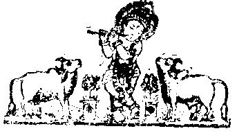

# षोडशग्रन्थ व अणुभाष्य संग्रह

*श्रीवल्लभाचार्य*

# भाग १ — स्तोत्र एवं प्रकरण-ग्रन्थसंग्रह

## मङ्गलाचरणम्

| चिन्ता-सन्तान-हन्तारो यत्-पादाम्बुज-रेणवः ।।
| स्वीयानां तान् निजाचार्यान् प्रणमामि मुहुर् मुहुः ।।१।।
| यदनुग्रहतो जन्तुः सर्वदुःखातिगो भवेत् ।।
| तमहं सर्वदा वन्दे श्रीमद्-वल्लभ-नन्दनम् ।।२।।
| अज्ञान-तिमिरानधस्य ज्ञानाञ्जन-शलाकया ।।
| चक्षुर् उन्मीलितं येन तस्मै श्रीगुरवे नमः ।।३।।
| नमामि हृदये शेषे लीला-क्षीराब्धि-शायिनम् ।।
| लक्ष्मी-सहस्र-लीलाभिः सेव्यमानं कलानिधिम् ।।४।।
| चतुर्भिश्च चतुर्भिश्च चतुर्भिश्च त्रिभिस् तथा ।।
| षड्भिर् विराजते योऽसौ पञ्चधा हृदये मम ।।५।।

| श्रीगोवर्धननाथ१-पादयगलं हैयङ्गवीन-प्रियं२
| नित्यं श्रीमथुराधिपं३ सुखकरं श्रीविट्ठलेशं४ मुदा ।।
| श्रीमद्वारवतीश५-गोकुलपती६ श्रीगोकुलेन्दुं७ विभुं
| श्रीमन्मन्मथमोहनं८ नटवरं९ श्रीबालकृष्णं१० भजेत् ।।६।।

| श्रीमद्वल्लभ-विट्ठलौ१ गिरिधरं गोविन्दरायाभिधं
| श्रीमद्बालकृष्ण-गोकुलपती नाथं रघूणांस्तथा।।
| एवं श्रीयदुनायकं किल घनश्यामं च तदवंशजान्२
| कालिन्दि३ स्वगुरु४गिरि५ गुरुविभुं६ स्वीयप्रभूं७श्च स्मरेत्।७।

बर्हापीडं नटवर-वपुः कर्णयोः कर्णिकारं

बिभ्रद् वासः कनक-कपिशं वैजयन्तीं च मालां।।
रन्ध्रान् वेणोर् अधर-सुधया पूरयन् गोप-वृन्दैः

| वृन्दारण्यं स्वपद-रमणं प्राविशद् गीतकीर्तिः।।८।।

| सौन्दर्यं निजहृद्गतं प्रकटितं स्त्री-गूढ-भावात्मकं
| पुंरूपं च पुनस् तदन्तर्गतं प्रावीविशद् स्वप्रिये ।।
| संश्लिष्टावुभयोर् बभौ रसमयः कृष्णो हि तत् साक्षिकं
| रूपं तत्रितयात्मकं परमभिध्येयं सदा वल्लभम्।।९।।

| श्रीवल्लभ-प्रतिनिधिं तेजोराशीं दयार्णवम् ।।
| गुणातीतं गुणनिधिं श्रीगोपीनाथम् आश्रये।।१०।।

सायं कुञ्जालयस्थापनम् उपविलसत्-स्वर्णपात्रं सुधौतं
राजद्यज्ञोपवीतं परितनुवसनं गौरम् अम्भोजवक्त्रम्।।

प्राणानायम्य नासापुट-निहितकरं कर्ण-राजद् विमुक्तं

| वन्देऽर्धोन्मीलिताक्षं मृगमदतिलकं विठ्ठलेशं सुकेशम्।।११।।
| ।। इति मङ्गलाचरणं सम्पूर्णम् ।।

## श्रीसर्वोत्तमस्तोत्रम्

| प्राकृतधर्मानाश्रयम् अप्राकृत-निखिल-धर्मरूपमिति ।।
| निगम-प्रतिपाद्यं यत् तत् शुद्धं साकृति स्तौमि।।१।।

| कलिकाल-तमश्छन्न-दृष्टित्वाद् विदुषामपि ।।
| सम्प्रत्यविषयस् तस्य माहात्म्यं समभूद् भुवि।।२।।
| दयया निजमाहात्म्यं करिष्यन् प्रकटं हरिः ।।
| वाण्या यदा तदा स्वास्थ्यं प्रादुर्भूतं चकार हि।।३।।
| तदुक्तमपि दुर्बोधं सुबोधं स्याद् यथा तथा ।।
| तन्नामाष्टोत्तरशतं प्रवक्ष्याम्यखिलाघ-हृत् ।।४।।

| ऋषिर् अग्निकुमारस्तु नाम्नां छन्दो जगत्यसौ ।।
| श्रीकृष्णास्यं देवता च बीजं कारुणिकः प्रभुः ।।५।।
| विनियोगो भक्तियोगह्रप्रतिबन्ध-विनाशने ।।
| कृष्णाधरामृतास्वादह्रसिद्धिर् अत्र न संशयः।।६।।

३

कृपा प्राप्त करनेका मार्ग पुष्टिमार्ग नहीं है, कृपासे प्राप्त होता मार्ग पुष्टिमार्ग है.

| आनन्दः१ परमानन्दः२ श्रीकृष्णास्यं३ कृपानिधिः४ ।।४।।
| दैवोद्धार-प्रयत्नात्मा५ स्मृतिमात्रार्तिनाशनः६ ।।७।।
| श्रीभागवत-गूढार्थह्रप्रकाशन-परायणः७ ।।
| साकार-ब्रह्म-वादैक-स्थापको८ वेदपारगः९ ।।८।।
| मायावाद-निराकर्ता१० सर्ववादि-निरासकृत्११ ।।
| भक्तिमार्गाब्ज-मार्तण्डः१२ स्त्रीशूद्राद्युधृतिक्षमः१३ ।।९।।
| अङ्गीकृत्यैव गोपीश-वल्लभीकृत-मानवः१४ ।।
| अङ्गीकृतौ समर्यादो१५ महाकारुणिको१६ विभुः१७ ।।१०।।
| अदेय-दान-दक्षश्च१८ महोदार-चरित्रवान्१९ ।।
| प्राकृतानुकृति-व्याजह्रमोहितासुर-मानुषः२० ।।११।।
| वैश्वानरो२१ वल्लभाख्यः२२ सद्रूपो२३ हितकृत्सताम्२४ ।।
| जनशिक्षाकृते कृष्ण-भक्तिकृत्२५ निखिलेष्टदः२६ ।।१२।।
| सर्व-लक्षण-सम्पन्नः२७ श्रीकृष्ण-ज्ञानदो२८ गुरुः२९ ।।
| स्वानन्द-तुन्दिलः३० पद्म-दलायत-विलोचनः३१ ।।१३।।
| कृपा-दृग्वृष्टि-संहृष्टह्रदास-दासीप्रियः३२ पतिः३३ ।।
| रोषदृक्पात-सम्प्लुष्ट-भक्तद्विड्३४ भक्तसेवितः३५ ।।१४।।
| सुखसेव्यो३६ दुराराध्यो३७ दुर्लभांघ्रिसरोरुहः३८ ।।

| उग्रप्रतापो३९ वाक्सीधुह्नपूरिताशेष-सेवकः४० ।।१५।।
| श्रीभागवत - पीयूषह्रसमुद्र - मथन - क्षमः४१ ।।
| तत्सारभूत-रास-स्त्रीह्रभाव-पूरितविग्रहः४२ ।।१६।।
| सान्निध्य-मात्र-दत्त-श्रीकृष्णप्रेमा४३ विमुक्तिदः४४ ।।
| रासलीलैक-तात्पर्यः४५ कृपयैतत्कथा-प्रदः४६ ।।१७।।
| विरहानुभवैकार्थह्रसर्वत्यागोपदेशकः४७ ।।
| भक्त्याचारोपदेष्टा४८ च कर्म-मार्ग-प्रवर्तकः४९ ।।१८।।
| यागादौ भक्तिमार्गैकह्रसाधनत्वोपदेशकः५० ।।
| पूर्णानन्दः५१ पूर्णकामो५२ वाक्पतिर्५३ विबुधेश्वरः५४ ।।१९।।
| कृष्ण-नाम-सहस्रस्य वक्ता५५ भक्तपरायणः५६ ।।
| भक्त्याचारोपदेशार्थ-नाना-वाक्य-निरूपकः५७ ।।२०।।
| स्वार्थोज्झिताखिल-प्राण-प्रियस्५८ तादृश-वेष्टितः५९ ।।
| स्वदासार्थ-कृताशेष-साधनः६० सर्वशक्तिधृक्६१ ।।२१।।
| भुवि भक्ति-प्रचारक-कृते स्वान्वयकृत्६२ पिता६३ ।।
| स्ववंशे स्थापिताशेष-स्वमाहात्म्यः६४ स्मयापहः६५ ।।२२।।
| पतिव्रता-पति:६६ पारह्ललौकिकैहिक-दानकृत्६७ ।।
| निगूढ-हृदयोऽनन्य-भक्तेषु ज्ञापिताशयः६९ ।।२३।।
| उपासनादि-मार्गातिह्रमुग्ध-मोहनिवारकः७० ।।

५

पुष्टिजीवका मुख्य धर्म है : कृष्णसेवा. अन्य धर्म उसकेलिए परधर्म या विधर्म हैं.

| भक्तिमार्गे सर्वमार्ग-वैलक्षण्यानुभूतिकृत्७१ ।।२४।।
| पृथक्शरण-मार्गोपदेष्टा७२ श्रीकृष्ण-हार्दवित्७३ ।।
| प्रतिक्षण-निकुञ्जस्थहलीला-रस-सुपूरितः७४ ।।२५।।
| तत्कथाक्षिप्त-चित्तस्७५ तद्विस्मृतान्यो७६ व्रजप्रियः७७ ।।
| प्रियव्रजस्थितिः७८ पुष्टि-लीलाकर्ता७९ रहःप्रियः८० ।२६।
| भक्तेच्छापूरक:८१ सर्वाज्ञातलीलो८२ - ऽतिमोहनः८३ ।।
| सर्वासक्तो८४ भक्तमात्रासक्तः८५ पतितपावनः८६ ।।२७।।
| स्वयशो-गान-संहृष्टह्रहृदयाम्भोज-विष्टरः८७ ।।
| यश:-पीयूष-लहरी-प्लावितान्य-रस:“ पर:८९ ।।२८।।
| लीलामृत-रसाद्रार्द्रीह्नकृताखिल-शरीर-भृत्९० ।।
| गोवर्धनस्थित्युत्साहस्९१ तल्लीला-प्रेमपूरितः९२ ।।२९।।
| यज्ञ-भोक्ता९३ यज्ञ-कर्ता९४ चतुर्वर्ग-विशारदः९५ ।।
| सत्यप्रतिज्ञस्९६ त्रिगुणातीतो९७ नयविशारदः९८ ।।३०।।
| स्व-कीर्तिवर्धनस्९९ तत्त्वसूत्र-भाष्य-प्रदर्शकः१०० ।।
| मायावादाख्य-तूलाग्निर्१०१ ब्रह्मवादनिरूपक:१०२ ।।३१।।
| अप्राकृताखिलाकल्पह्रभूषित:१०३ सहज-स्मित:१०४ ।।
| त्रिलोकीभूषणं१०५ भूमिभाग्य१०६ सहजसुन्दर:१०७ ।।३२।।
| अशेष-भक्त-सम्प्रार्थ्यह्वचरणाब्ज-रजोधन:१०८ ।।

| इत्यानन्दनिधेः प्रोक्तं नाम्नाम् अष्टोत्तरं शतम्।।३३।।
| श्रद्धा-विशुद्ध-बुद्धिर् यः पठत्यनुदिनं जनः ।।
| स तदेकमनाः सिद्धिम् उक्तां प्राप्नोत्यसंशयम्।।३४।।
| तदप्राप्तौ वृथा मोक्षः तदाप्तौ तद्गतार्थता ।।
| अतः सर्वोत्तमं स्तोत्रं जप्यं कृष्णरसार्थिभिः।।३५।।
| ।। इति श्रीमदग्निकुमारप्रोक्तं सर्वोत्तमस्तोत्रं सम्पूर्णम् ।।

## श्रीवल्लभाष्टकम्

| श्रीमद्वृन्दावनेन्दु-प्रकटित-रसिकानन्द-सन्दोहरूप-
| स्फूर्जद्रासादिलीलामृतजलधिभराक्रान्तसर्वोऽपि शश्वत्।
| तस्यैवात्मानुभाव-प्रकटन-हृदयस्याज्ञया प्रादुरासीद्
| भूमौ यः सन्मनुष्याकृतिरतिकरुणस् तं प्रपद्ये हुताशम्।१।

| नाविर्भूयाद् भवांश्चेद् अधिधरणितलं भूतनाथोदितासन्-
| मार्गध्वान्तान्धतुल्या निगमपथगतौ देवसर्गेऽपि जाताः।।
| घोषाधीशं तदेमे कथमपि मनुजाः प्राप्नुयुर् नैव दैवी
| सृष्टिर्व्यर्था च भूयान् निजफलरहिता देव ! वैश्वानरैषा ।।२।

७

अपने भजनीयके माहात्म्यका शास्त्रीय ज्ञान हर भक्तको होना चाहिये.

| न ह्यन्यो वागधीशात् श्रुतिगणवचसां भावमाज्ञातुम् ईष्टे
| यस्मात् साध्वी स्वभावं प्रकटयति वधूर् अग्रतः पत्युरेव।।
| तस्मात् श्रीवल्लभाख्य त्वदुदितवचनाद् अन्यथा रूपयन्ति
| भ्रान्ता ये ते निसर्गत्रिदशरिपुतया केवलान्धन्तमोगाः।।३।

| प्रादुर्भूतेन भूमौ व्रजपतिचरणाम्भोज-सेवाख्य-वर्त्म-
| प्राकट्यं यत् कृतं ते तदुत निजकृते श्रीहुताशेति मन्ये।।
| यस्मादस्मिन् स्थितो यत्किमपि कथमपि क्वाप्युपाहर्तुमिच्छ-
| त्यद्धा तद् गोपिकेशः स्ववदनकमले चारुहासे करोति।४।

| उष्णत्वैकस्वभावोऽप्यतिशिशिरवचः-पुंजपीयूषवृष्टिर्-
| आर्तेष्वत्युग्र-मोहासुर-नृषु युगपत् तापमप्यत्र कुर्वन् ।।
| स्वस्मिन् कृष्णास्यतां त्वं प्रकटयसि च नो भूतदेवत्वमेतद्
| यस्माद् आनन्ददं श्रीव्रजजननिचये नाशकं चासुराग्नेः।५।

| आम्नायोक्तं यदम्भो भवनम् अनलतस् तच्च सत्यं विभो यत्
| सर्गादौ भूतरूपाद् अभवद् अनलतः पुष्करं भूतरूपम् ।।
| आनन्दैकस्वरूपात् त्वदधिभु यदभूत् कृष्णसेवारसाब्धिश्
| चानन्दैक-स्वरूपस् तदखिलमुचितं हेतुसाम्यं हि कार्ये।६।

८ कृष्ण दवाधिदेव हैं, पुष्टिभक्तकेलिए कृष्णेतर देवका पूजनादि अनन्यताका भंग है.

| स्वामिन् श्रीवल्लभाग्ने क्षणमपि भवत: सन्निधानेकृपातः
| प्राणप्रेष्ठ-व्रजाधीश्वर-वदन-दिदृक्षार्ति-तापो जनेषु ।।
| यत् प्रादुर्भावम् आप्नोत्युचिततरम् इदं यत्तु पश्चाद् अपीत्थं
| दृष्टेऽप्यस्मिन् मुखेन्दौ प्रचुरतरम् उदेत्येव तच्चित्रमेतत्।७।

| अज्ञानाद्यन्धकारप्रशमनपटुता-ख्यापनाय त्रिलोक्याम्
| अग्नित्वं वर्णितं ते कविभिरपि सदा वस्तुतः कृष्णएव ।।
| प्रादुर्भूतो भवान् इत्यनुभव-निगमाद्युक्त-मानैर् अवेत्य
| त्वां श्रीश्रीवल्लभेमे निखिलबुधजनाः गोकुलेशं भजन्ते।८।
| ।। इति श्रीमद्विट्ठलदीक्षितविरचितं श्रीवल्लभाष्टकं सम्पूर्णम् ।।

## श्रीस्फुरत्कृष्णप्रेमामृतस्तोत्रम्

स्फुरत् - कृष्ण - प्रेमामृत - रस - भरेणातिभरिता

९

भक्तिमार्गमें अनन्यताके भंगसे बढ़कर दूसरा कोई अपराध नहीं है.

| विहारान् कुर्वाणा व्रजपति-विहाराब्धिषु सदा।।
| प्रियागोपीभर्तुः स्फुरतु सततं 'वल्लभ' इति
| प्रथावत्यस्माकं हृदि सुभगमूर्तिः सकरुणा ।।१।।

| श्रीभागवतप्रतिपदमणिवर-भावांशुभूषिता मूर्तिः।।
| 'श्रीवल्लभा'भिधानस् तनोतु निजदासस्य सौभाग्यम्।२।

| मायावादतमो निरस्य मधुभित्-सेवाख्य-वर्त्माद्भुतं
| श्रीमद्-गोकुलनाथ-सङ्गमसुधा-सम्प्रापकं तत्क्षणात्।।
| दुष्प्रापं प्रकटीचकार करुणा-रागाति-सम्मोहनः
| स श्रीवल्लभभानुरुल्लसति यःश्रीवल्लवीशान्तरः ।।३।।

| क्वचित् पाण्डित्यं चेत् न निगमगतिः सापि यदि न
| क्रिया सा सापि स्यात् यदि न हरिमार्गे परिचयः ।।
| यदि स्यात् सोऽपि श्रीव्रजपति-रतिर् नेति निखिलै:
| गुणैर् अन्यः को वा विलसति विना वल्लभवरम्।।४।।

 -->

| सेवामें प्रतिबन्धक ऐसे वादन्को निराकरण करि प्रमाणचतुष्टयकी
| एकवाक्यता करि स्वसिद्धान्तको उपदेशक होनो, स्वयं श्रीकृष्ण-
| सेवापरायण होनो अरु भगवत्सेवोचित निरुपधिस्नेहको उद्बोधक होनो)
| मायावादि-करीन्द्र-दर्प-दलनेनास्येन्दु-राजोद्गत
| श्रीमद्-भागवताख्य-दुर्लभ-सुधा-वर्षेण वेदोक्तिभिः।।
| राधावल्लभ-सेवया तदुचित-प्रेम्णोपदेशैरपि
| 'श्रीमद्वल्लभ'नामधेयसदृशो भावि न भूतोऽस्त्यपि।।५।।

| यदङ्घ्रि-नख-मण्डल-प्रसृत-वारि-पीयूष-युग्-
| वराङ्ग-हृदयैः कलिस् तृणमिवेह तुच्छीकृतः ।।
| व्रजाधिपतिरिन्दिरा-प्रभृति-मृग्य-पादाम्बुज:
| क्षणेन परितोषितस् तदनुगत्वमेवास्तु मे ।।६।।

| अघौघ-तमसावृतं कलि-भुजङ्गम् आसादितम्
| जगद्-विषय-सागरे पतितम् अस्वधर्मे रतम् ।।
| यदीक्षण-सुधानिधि-समुदितो-ऽनुकम्पामृताद्
| अमृत्युम् अकरोत् क्षणाद् अरणमस्तु मे तत्पदम्।।७।।
| ।।इति श्रीविट्ठलेश्वरविरचितं श्रीस्फुरत्कृष्णप्रेमामृतस्तोत्रं सम्पूर्णम्।।

११

पुष्टिजीवकी चाहना स्वार्थ या परार्थ की सिद्धि नहीं प्रत्युत कृष्णभक्ति ही होनी चाहिये.

## नामरत्नाख्यस्तोत्रम्

| यन्नामार्कोदयात् पापह्रध्वान्त-राशिः प्रशाम्यति ।।
| विकसन्ति हृदब्जानि तन्नामानि सदाश्रये ।।१।।

| आनुष्टुभम् इहच्छन्दः'ऋषिर् अग्निकुमारजः' ।।
| सर्वशक्ति-समायुक्तो देवः श्रीवल्लभात्मजः' ।।२।।

विनियोगः समस्तेष्ट-सिद्ध्यर्थे विनिरूपितः४ ।।

| श्रीविठ्ठलः१कृपासिन्धुर्२भक्तवश्यो३-ऽतिसुन्दरः४।।३।।
| कृष्ण-लीला-रसाविष्टः५श्रीमान्६वल्लभ-नन्दनः७ ।।
| दुर्दृश्यों८भक्त-सन्दृश्यो९भक्तिगम्यो१०भयापहः११।।४।।
| अनन्य-भक्त-हृदयो१२दीनानाथैक-संश्रयः१३ ।।
| राजीव-लोचनो१४रास-लीला-रस-महोदधिः१५।।५।।
| धर्मसेतुर्१६भक्तिसेतुः१७सुखसेव्यो१८व्रजेश्वरः१९ ।।
| भक्तशोकापहः२०शान्तः२१सर्वज्ञः२२सर्वकामदः२३ ।।६।।
| रुक्मिणी-रमणः२४श्रीशो२५भक्तरत्न-परीक्षकः२६ ।।
| भक्त-रक्षैक-दक्षः२७श्रीकृष्ण-भक्ति-प्रवर्तकः२८ ।।७।।
| महासुर-तिरस्कर्ता२९सर्वशास्त्र-विदग्रणीः३० ।।

| कर्मजाड्यभिदुष्णांशुर्३१ भक्तनेत्र-सुधाकरः३२ ।।८।।
| महालक्ष्मी-गर्भरत्नं३३ कृष्ण-वर्त्म-समुद्भवः३४ ।।
| भक्त-चिन्तामणिर्३५ भक्ति-कल्पद्रुम-नवांकुरः३६ ।।९।।
| श्रीगोकुल-कृतावासः३७ कालिन्दी-पुलिन-प्रियः३८ ।।
| गोवर्धनागमरतः३९ प्रिय-वृन्दावनाचलः४० ।।१०।।
| गोवर्धनाद्रि-मखकृन्४१ महेन्द्र-मद-भित्-प्रियः४२ ।।
| कृष्णलीलैक-सर्वस्वः४३ श्रीभागवत-भाववित्४४ ।।११।।
| पितृ-प्रवर्तित-पथ-प्रचार-सुविचारकः४५ ।।
| व्रजेश्वर-प्रीतिकर्ता४६ तन्निमन्त्रण-भोजकः४७ ।।१२।।
| बाललीलादि-सुप्रीतो४८ गोपी-सम्बन्धि-सत्कथः४९ ।।
| अति-गम्भीर-तात्पर्यः५० कथनीय-गुणाकरः५१ ।।१३।।
| पितृ-वंशोदधि-विधुः५२ स्वानुरूप-सुतप्रसूः५३ ।।
| दिक्चक्रवर्तिसत्कीर्तिर्५४ महोज्ज्वल-चरित्रवान्५५ ।।१४।।
| अनेक-क्षितिप-श्रेणीह्मूर्धासक्त-पदाम्बुजः५६ ।।
| विप्रदारिद्र्य-दावाग्निर्५७ भूदेवाग्नि-प्रपूजकः५८ ।।१५।।
| गो-ब्राह्मण-प्राणरक्षापरः५९ सत्य-परायणः६० ।।
| प्रिय-श्रुतिपथः६१ शश्वन् महा-मखकरः६२ प्रभुः६३ ।।१६।।
| कृष्णानुग्रह-संल्लभ्यो६४ महा-पतित-पावनः६५ ।।

१३

कृष्णआश्रय सुदृढ बने तदर्थ पुष्टिमार्गीको विवेक और धैर्य रखने चाहिये.

| अनेकमार्ग-संक्लिष्टह्रजीवस्वास्थ्यप्रदो महान् ।।१७।।
| नाना-भ्रम-निराकर्ता ६७ भक्ताज्ञानभिदुत्तमः ६८ ।।
| महापुरुष-सत्-ख्यातिर् ६९ महापुरुष-विग्रहः ७० ।।१८।।
| दर्शनीयतमो ७१ वाग्मी ७२ मायावाद-निरास-कृत् ७३ ।।
| सदाप्रसन्न-वदनो ७४ मुग्ध-स्मित-मुखाम्बुजः ७५ ।।१९।।
| प्रेमार्द्रदृग्-विशालाक्षः ७६ क्षिति-मण्डल-मण्डनः ७७ ।।
| त्रिजगद्व्यापिसत्कीर्तिह्नधवलीकृत-मेचकः ७८ ।।२०।।
| वाक्सुधाकृष्ट-भक्तान्तःकरणः ७९ शत्रुतापनः ८० ।।
| भक्त-सम्प्रार्थित-करो ८१ दासदासीप्सितप्रदः ८२ ।।२१।।
| अचिन्त्य-महिमा-मेयो ८३ विस्मयास्पद-विग्रहः ८४ ।।
| भक्तक्लेशासहः ८५ सर्वसहो ८६ भक्तकृते वशः ८७ ।।२२।।
| आचार्य-रत्नं ८८ सर्वानुग्रह-कृन्-मन्त्र-वित्तमः ८९ ।।
| सर्वस्व-दान-कुशलो ९० गीत-संगीत-सागरः ९१ ।।२३।।
| गोवर्धनाचलसखो ९२ गोप-गो-गोपिका-प्रियः ९३ ।।
| चिन्तितज्ञो ९४ महाबुद्धिर् ९५ जगद्वन्द्यपदाम्बुजः ९६ ।।२४।।
| जगदाश्चर्यरसकृत् ९७ सदा कृष्ण-कथा-प्रियः ९८ ।।
| सुखोदर्ककृतिः ९९ सर्व-सन्देह-च्छेद-दक्षिणः १०० ।।२५।।
| स्वपक्ष-रक्षणे दक्षः १०१ प्रतिपक्ष-क्षयंकरः १०२ ।।

| गोपिकाविरहाविष्टः १०३ कृष्णात्मा १०४ स्वसमर्पकः १०५ ।।२६।
| निवेदि-भक्त-सर्वस्वः १०६ शरणाध्व-प्रदर्शकः १०७ ।।
| श्रीकृष्णानुगृहीतैकह्वप्रार्थनीय-पदाम्बुजः १०८ ।।२७।।

| इमानि नामरत्नानि श्रीविट्ठल-पदाम्बुजम् ।।
| ध्यात्वा तदेक-शरणो यः पठेत् स हरिं लभेत् ।।२८।।
| यद्-यन्-मनस्यभिध्यायेत् तत्तद् आप्नोत्यसंशयम् ।।
| नामरत्नाभिधम् इदं स्तोत्रं यः प्रपठेत् सुधीः ।।२९।।
| तदीयत्वं गृहाणाशु प्रार्थ्यम् एतन् मम प्रभो ।।
| श्रीविट्ठल-पदाम्भोजह्लमकरन्द-जुषो-ऽनिशम् ।।
| इयं श्रीरघुनाथस्य कृतिर् विजयतेतराम् ।।३०।।
| ।। इति श्रीरघुनाथविरचितं नामरत्नाख्यस्तोत्रं सम्पूर्णम् ।।

## षोडशग्रन्थमाहात्म्यम्

| श्रीमदाचार्यचरणाः स्वीयानां भक्तिसिद्धये ।।
| अकार्षुः षोडशग्रन्थान् स्वसिद्धान्तार्थबोधकान्।।१।।
| तद्व्याख्यानं कृतं पूर्वैः प्रभुभिश्च पृथक् क्वचित् ।।
| यमुनाष्टकम् आरभ्य सेवाफलम् उदाहृताः।।२।।

एवं षोडशभिर्ग्रन्थैः पुरुषोत्तम-सेवनम् ।।

कृष्णसेवा-स्मरणमें तत्परता वही श्रीयमुनाजीकी सच्ची सेवा और स्तुति है. १५

| प्रतिपाद्य फलत्वेन चक्रे जीवोद्धृतिं विभुः।।३।।

| अवतार-दशायान्तु उद्धृती रूप-दर्शनात् ।।
| इह नामात्मकैर् ग्रन्थैः स्वदासानां सदोद्धृतिः।।४।।

| तस्मात् सर्वप्रयत्नेन दैवैः कर्तव्यमेव हि ।।
| सेवनं श्रीव्रजेशस्य तद्ग्रन्थानां च पाठनम्।।५।।
| ।। इति श्रीद्वारकेशचरणविरचितं षोडशग्रन्थमाहात्म्यम् ।।

## श्रीयमुनाष्टकम्

| नमामि यमुनाम् अहं सकल-सिद्धि-हेतुं मुदा
| मुरारि-पद-पंकज-स्फुरदमन्द-रेणूत्कटाम् ।।
| तटस्थ-नवकानन-प्रकट-मोद-पुष्पाम्बुना
| सुरासुर-सुपूजित-स्मरपितुः श्रियं बिभ्रतीम् ।।१।।

| कलिन्द-गिरि-मस्तके पतदमन्द-पूरोज्ज्वला
| विलास-गमनोल्लसत्-प्रकट-गण्ड-शैलोन्नता ।।
| सघोष-गति-दन्तुरा समधिरूढ-दोलोत्तमा
| मुकुन्द-रति-वर्धिनी जयति पद्मबन्धोः सुता ।।२।।

| भुवं भुवन-पावनीम् अधिगताम् अनेक-स्वनैः
| प्रियाभिरिव सेवितां शुक-मयूर-हंसादिभिः ।।
| तरङ्ग-भुज-कंकण-प्रकट-मुक्तिका-वालुका-
| नितम्ब-तट-सुन्दरीं नमत कृष्ण-तुर्य-प्रियाम् ।।३।।

| अनन्त-गुणभूषिते शिव-विरञ्चि-देव-स्तु ते
| घनाघन-निभे सदा ध्रुव-पराशराभीष्ट दे ।।
| विशुद्ध-मथुरा-तटे सकल-गोप-गोपी-वृते
| कृपा-जलधि-संश्रिते मम मनः सुखं भावय ।।४।।

| यया चरण-पद्मजा मुररिपोः प्रियम्भावुका
| समागमनतो-ऽभवत् सकल-सिद्धिदा सेवताम् ।।
| तया सदृशताम् इयात् कमलजा-सपत्नीव यद्-
| हरिप्रिय-कलिन्दया मनसि मे सदा स्थीयताम् ।।५।।

नमो-ऽस्तु यमुने सदा तव चरित्रम् अत्यद्भुतं
न जातु यम-यातना भवति ते पयः-पानतः ।।

यमुनाजलकी लोटीकी न्योछावर देनी और लेनी दोनों मांके दूधके विक्रय समान है १७

| यमोऽपि भगिनी-सुतान् कथमु हन्ति दुष्टानपि
| प्रियो भवति सेवनात् तव हरेर् यथा गोपिकाः ।।६।।

| ममास्तु तव सन्निधौ तनु-नवत्वम् एतावता
| न दुर्लभतमा रतिर् मुररिपौ मुकुन्द-प्रिये ।।
| अतो-ऽस्तु तव लालना सुर-धुनी परं सङ्गमात्
| तवैव भुवि कीर्तिता न तु कदापि पुष्टिस्थितैः ।।७।।

स्तुतिं तव करोति कः कमलजा-सपत्नि प्रिये
हरेर् यद् अनुसेवया भवति सौख्यम् आमोक्षतः ।।
इयं तव कथाधिका सकल-गोपिका-सङ्गम-

| स्मरश्रम-जलाणुभिः सकल-गात्रजैः सङ्गमः ।।८।।

| तवाष्टकम् इदं मुदा पठति सूरसूते सदा
| समस्त-दुरित-क्षयो भवति वै मुकुन्दे रतिः ।।
| तया सकल-सिद्धयो मुररिपुश्च सन्तुष्यति
| स्वभाव-विजयो भवेद् वदति वल्लभः श्रीहरेः ।।९।।
| ।। इति श्रीवल्लभाचार्यविरचितं श्रीयमुनाष्टकस्तोत्रं सम्पूर्णम् ।।

## बालबोधः

| नत्वा हरिं सदानन्दं सर्व-सिद्धान्त-संग्रहम् ।।
| बाल-प्रबोधनार्थाय वदामि सुविनिश्चितम्।।१।।

| 'धर्मार्थ-काममोक्षा'ख्याश् चत्वारोऽर्था मनीषिणाम् ।।
| जीवेश्वर-विचारेण द्विधा ते हि विचारिताः।।२।।
| अलौकिकास्तु वेदोक्ताः साध्य-साधन-संयुताः ।।
| लौकिका ऋषिभिः प्रोक्तास् तथैवेश्वर-शिक्षया।।३।।
| लौकिकंस्तु प्रवक्ष्यामि वेदाद् आद्या यतः स्थिताः ।।
| धर्मशास्त्राणि नीतिश्च कामशास्त्राणि च क्रमात्।।४।।
| त्रिवर्ग-साधकानीति न तन्निर्णय उच्यते ।।

| मोक्षे चत्वारि शास्त्राणि लौकिके परतः स्वतः ।।५।।
| द्विधा द्वे-द्वे स्वतस् तत्र सांख्य-योगौ प्रकीर्तितौ ।।
| त्यागात्याग-विभागेन सांख्ये त्यागः प्रकीर्तितः ।।६।।
| अहन्ता-ममता-नाशे सर्वथा निरहंकृतौ ।।

कृष्णसेवाको जो स्वधर्म जाने वही पुष्टिजीव है, पुष्टिमार्गमें प्रवेश पाने योग्य भी वही है. १९

| स्वरूपस्थो यदा जीवः कृतार्थः स निगद्यते।।७।।
| तदर्थं प्रक्रिया काचित् पुराणेऽपि निरूपिता ।।
| ऋषिभिर् बहुधा प्रोक्ता फलम् एकम् अबाह्यतः।।८।।
| अत्यागे योगमार्गो हि त्यागोऽपि मनसैव हि ।।
| यमादयस्तु कर्तव्याः सिद्धे योगे कृतार्थता।।९।।

| पराश्रयेण मोक्षस्तु द्विधा सोऽपि निरूप्यते ।।
| ब्रह्मा ब्राह्मणतां यातस् तद्रूपेण सुसेव्यते।।१०।।
| ते सर्वार्था न चाद्येन शास्त्रं किञ्चिद् उदीरितम् ।।
| अतः शिवश्च विष्णुश्च जगतो हितकारकौ।।११।।
| वस्तुनः स्थिति-संहारौ कार्यौ शास्त्र-प्रवर्तकौ ।।
| ब्रह्मैव तादृशं यस्मात् सर्वात्मकतयोदितौ ।।१२।।
| निर्दोष-पूर्ण-गुणता तत्-तच्छास्त्रे तयोः ख-ग कृता ।।
| भोग-मोक्ष-फले दातुं शक्तौ द्वावपि यद्यपि ।।१३।।
| भोगः शिवेन मोक्षस्तु विष्णुनेति विनिश्चयः ।।
| लोकेऽपि यत् प्रभुर्भुक्ते तन् न यच्छति कर्हिचित् ।।१४।।
| अतिप्रियाय तदपि दीयते क्वचिदेव हि ।।
| नियतार्थ-प्रदानेन तदीयत्वं तदाश्रयः ।।१५।।

२० आत्मनिवेदीको अपना सर्वस्व कृष्णसेवानें समर्पित करके ही सब व्यवहार चलाने.

प्रत्येकं साधनं चैतद् द्वितीयार्थे महान् श्रमः।।

| जीवाः स्वभावतो दुष्टा दोषाभावाय सर्वदा ।।१६।।
| श्रवणादि ततः प्रेम्णा सर्वं कार्यं हि सिध्यति ।।
| मोक्षस्तु सुलभो विष्णोर् भोगश्च शिवतस्तथा ।।१७।।
| समर्पणेनात्मनो हि तदीयत्वं ख२/ग२ भवेद् ध्रुवम् ।।
| अतदीयतया चापि केवलश्चेत् समाश्रितः ।।१८।।
| तदाश्रय ख१/ग१ -तदीयत्व ख२/ग२ -बुद्धयै किंचित् समाचरेत् ।।
| स्वधर्मम् अनुतिष्ठन् वै भारद्वैगुण्यम् अन्यथा ।।
| इत्येवं कथितं सर्वं नैतज्ज्ञाने भ्रमः पुनः ।।१९।।

।।इति श्रीवल्लभाचार्यविरचितो बालबोधः सम्पूर्णः।।

## सिद्धान्तमुक्तावली

नत्वा हरिं प्रवक्ष्यामि स्वसिद्धान्त-विनिश्चयम् ।।

| कृष्णसेवा सदा कार्या मानसी सा परा मता।।१।।
| चेतस् तत्प्रवणं सेवा तत्सिद्ध्यै तनुवित्तजा ।।

ठाकुरजीकेलिए भेट-सामग्री मांगनेवाला या तो लालची है या फिर अतिदुष्ट है. २१

| ततः संसार-दुःखस्य निवृत्तिर् ब्रह्म-बोधनम् ॥२॥

| परं ब्रह्म तु कृष्णो हि सच्चिदानन्दकं बृहत् ख ।।
| द्विरूपं तद्धि ख सर्वं स्याद् ख/१ एकं तस्माद् विलक्षणम् ख/२।३।

| अपरं ख/१ तत्र पूर्वस्मिन् ख/२ वादिनो बहुधा जगुः ।।
| मायिकं सगुणं कार्यं स्वतन्त्रं चेति नैकधा।।४।।
| ख/२ तद् एवैतत् ख/१ प्रकारेण भवतीति श्रुतेर्मतम् ।।

| द्विरूपं ख/१-२ चापि गङ्गावज् ज्ञेयं सा जलरूपिणी।।५।।
| माहात्म्य-संयुता नृणां सेवतां भुक्ति-मुक्ति-दा ।।
| मर्यादामार्ग-विधिना तथा ख/१-२ ब्रह्मापि बुध्यताम् ।।६।।
| तत्रैव देवता-मूर्तिः भक्त्या या दृश्यते क्वचित् ।।
| गङ्गायां च विशेषेण प्रवाहाभेद-बुद्धये ।।७।।
| प्रत्यक्षा सा न सर्वेषां प्राकाम्यं स्यात् तया जले ।।

| विहितात् च फलात् तद्धि प्रतीत्यापि विशिष्यते।।८।।
| यथा जलं तथा सर्वं९ यथा शक्ता तथा बृहत्१० ।।

यथा देवी तथा कृष्णः ....................॥

| ........................तत्राप्येतद् इहोच्यते।।९।।
| जगत्तु त्रिविधं प्रोक्तं ब्रह्म-विष्णु-शिवास् ततः ।।
| देवता-रूपवत्-प्रोक्ता ब्रह्मणीत्थं हरिर् मतः।।१०।।
| कामचारस्तु लोके-ऽस्मिन् ब्रह्मादिभ्यो न चान्यथा ।।
| परमानन्दरूपे तु कृष्णे स्वात्मनि निश्चयः।।११।।
| अतस्तु क+ख१+ख२ ब्रह्मवादेन कृष्णे बुद्धिर् विधीयताम् ।।

| आत्मनि ब्रह्मरूपेतु छिद्रा व्योम्नीव चेतनाः ।।१२।।
| उपाधि-नाशे विज्ञानेक/१ ब्रह्मात्मत्वावबोधनेक/२ ।।

अपने ठाकरुजीकेलिए भेट-सामग्री लेनेवाला अधम है, उसका नर्कपात निश्चित है. २३

| गङ्गा-तीर-स्थितो यद्वत् देवतां तत्र पश्यति ।।१३।।
| तथा कृष्णं परं ब्रह्म स्वस्मिन् ज्ञानीक/३ प्रपश्यति क/४ ।।
| संसारी ख=२/४ यस्तु भजते स दूरस्थो यथा तथा ।।१४।।
| अपेक्षित-जलादीनाम् अभावात् तत्र दुःख-भाक् ।।
| तस्मात् श्रीकृष्णमार्गस्थो विमुक्तः सर्वलोकतः ।।१५।।
| आत्मानन्द-समुद्रस्थं कृष्णमेव विचिन्तयेत् ।।
| लोकार्थी चेद् भजेत् कृष्णं क्लिष्टो भवति सर्वथा ।।१६।।
| क्लिष्टोऽपि चेद् भजेत् कृष्णं लोको नश्यति सर्वथा ।।

| ज्ञानाभावे पुष्टिमार्गी तिष्ठेत् पूजोत्सवादिषु ।।१७।।
| मर्यादास्थस्तु गङ्गायां श्रीभागवत-तत्परः ।।
| अनुग्रहः पुष्टिमार्गे नियामक इति स्थितिः ।।१८।।
| उभयोस्तु क्रमेणैव पूर्वोक्तैव फलिष्यति ।।
| ज्ञानाधिको भक्तिमार्गः एवं तस्मात् निरूपितः ।।१९।।

| भक्त्यभावेतु तीरस्थो यथा दुष्टैः स्वकर्मभिः ।।
| अन्यथाभावमापन्नस् तस्मात् स्थानाच्च नश्यति ।।२०।।

| एवं स्व-शास्त्र-सर्वस्वं मया गुप्तं निरूपितम् ।।
| एतद् बुद्ध्वा विमुच्येत पुरुषः सर्व-संशयात्।।२१।।
| ।।इति श्रीवल्लभाचार्यविरचिता सिद्धान्तमुक्तावली सम्पूर्णा।।

## पुष्टिप्रवाहमर्यादाभेदः

| पुष्टि क/१ ख/१ ग/१ विशेषेण पृथक् पृथक् ।।
| जीव २/य २/र २/ल भेदैः प्रवाहेण फलेन च।।१।।
| वक्ष्यामि सर्व-सन्देहा न भविष्यन्ति यच्छुतेः ।।

| भक्तिमार्गस्य कथनात् क/१ पुष्टिरस्तीति निश्चयः।।२।।
| 'द्वौ भूतसर्गावि'त्युक्तेः ख/१ प्रवाहोऽपि व्यवस्थितः ।।
| वेदस्य विद्यमानत्वात् ग/१ मर्यादापि व्यवस्थिता।।३।।

| कश्चिदेव हि भक्तो हि 'यो मद्भक्त' इतीरणात् ।।
| सर्वत्रोत्कर्षकथनात् पुष्टिर् अस्तीति निश्चयः।।४।।
| न सर्वोऽतः प्रवाहाद् हि भिन्नो वेदाच्च भेदतः ।।
| 'यदा यस्ये'ति वचनात् 'नाहं वेदैर्'इतीरणात् ।।५।।
| मार्गैकत्वेऽपि चेद् अन्त्यौ तनू भक्त्यागमौ मतौ ।।
| न तद् युक्तं सूत्रतो हि भिन्नो युक्त्या हि वैदिकः।।६।।
| जीव-देह-कृतीनां च भिन्नत्वं नित्यता-श्रुतेः ।।
| यथा तद्वत् पुष्टिमार्गे द्वयोरपि निषेधतः।।७।।
| प्रमाण-भेदाद् भिन्नोहि पुष्टिमार्गो क/१ निरूपितः ।।

शरणागति और समर्पण पूर्णरूपसे हो तब ही सच्चे होते हैं, अन्यथा दम्भ मात्र है. २५

| सर्गभेदं२ प्रवक्ष्यामि स्वरूपाऽङ्ग क्रिया ल युतम् ।।८।।
| इच्छा-मात्रेणख/२ मनसा प्रवाहं सृष्टवान् हरिः ।।
| वचसा ग/२ वेदमार्गं हि पुष्टिं कायेन क/२ निश्चयः ।।९।।

| मूलेच्छातः ख/३ फलं लोके वेदोक्तं ग/३ वैदिकेपि च ।।
| कायेनक/३ तु फलं पुष्टौ भिन्नेच्छातोऽपि नैकधा ।।१०।।

| 'तान् अहं द्विषतो' वाक्याद् भिन्ना जीवाः प्रवाहिणः ।।
| अत एवेतरौ कग भिन्नौ सान्तौ मोक्ष-प्रवेशतः।।११।।

| तस्माज् जीवाः पुष्टिमार्गे भिन्नाएव न संशयः ।।
| भगवद्-रूप-सेवार्थं तत्सृष्टिः नान्यथा भवेत्क/२/य ।।१२।।
| स्वरूपेणावतारेण लिङ्गेन च गुणेन च ।।
| तारतम्यं न स्वरूपे देहे वा तत्क्रियासु वा ।।१३।।
| तथापि यावता कार्यं तावत् तस्य करोति हि क/२/र ।।
| तेहि द्विधा शुद्धमिश्र-भेदान् मिश्रास् त्रिधा पुनः।।१४।।
| प्रवाहादि-विभेदेन भगवत्कार्य-सिद्धये ।।
| पुष्ट्या विमिश्राः सर्वज्ञाः प्रवाहेण क्रियारताः।।१५।।
| मर्यादया गुणज्ञास्ते शुद्धाः प्रेम्णाति-दुर्लभाः क/२/ल ।।
| एवं सर्गस्तु तेषां हि... ... ... ... ... ।।

| ... ... ... ... फलं त्वत्र निरूप्यते।।१६।।
| भगवानेव हि फलं स यथाविर्भवेद् भुवि ।।
| गुण-स्वरूप-भेदेन तथा तेषां फलं भवेत्।।१७।।
| आसक्तौ भगवान् एव शापं दापयति क्वचित् ।।
| अहंकारे-ऽथवा लोके तन्मार्ग-स्थापनाय हि।।१८।।
| न ते पाषण्डतां यान्ति नच रोगाद्युपद्रवः ।।
| महानुभावाः प्रायेण शास्त्रं शुद्धत्व-हेतवे ।।१९।।
| भगवत्-तारतम्येन तारतम्यं भजन्ति हि ।।
| लौकिकत्वं वैदिकत्वं कापट्यात् तेषु नान्यथा।।२०।।
| वैष्णवत्वं हि सहजं ततो-ऽन्यत्र विपर्ययः ।।

| सम्बन्धिनस्तु ये जीवाः प्रवाहस्थास् तथा परे।।२१।।
| 'चर्षणी'शब्दवाच्यास् ते सर्वे सर्ववर्त्मसु ।।
| क्षणात् सर्वत्वम् आयान्ति रुचिस्ततेषां न कुत्रचित् ।।२२।।
| तेषां क्रियानुसारेण सर्वत्र सकलं फलम् ।।

प्रवाहस्थान् ख प्रवक्ष्यामि

| स्वरूपा ख/२/य ख/२/र क्रिया ख/२/ल युतान्।।२३।।

समर्पण रहित कृष्णसेवा और कृष्णसेवा रहित केवल समर्पण दोनों पाखंड ही हैं. २७

| जीवास्ते ह्यासुराः ख/२/य सर्वे 'प्रवृत्तिञ्चे'ति वर्णिताः ।।
| ते च द्विधा प्रकीर्त्यन्ते ह्यज्ञ-दुर्ज्ञ-विभेदतः।।२४।।
| दुर्ज्ञास् ते भगवत्प्रोक्ता ह्यज्ञास् तान् अनु ये पुनः ।।
| प्रवाहेऽपि समागत्य पुष्टिस्थस् तैर् न युज्यते।।२५।।
| सोऽपि तैस् तत्कुले जातः कर्मणा जायते यतः ।।
| ... ... ... ... ... ... ... ... ।।

।। इति श्रीवल्लभाचार्यविरचितः पुष्टिप्रवाहमर्यादाभेदः सम्पूर्णः ।।

## सिद्धान्तरहस्यम्

| श्रावणस्यामले पक्षे एकादश्यां महानिशि ।।
| साक्षाद् भगवता प्रोक्तं तदक्षरश उच्यते ।।१।।

| ब्रह्म-सम्बन्ध-करणात् सर्वेषां देह-जीवयोः ।।
| सर्व-दोष-निवृत्तिर् हि दोषाः पञ्चविधाः स्मृताः।।२।।

| सहजा१ देश-कालोत्थाः२-३ लोक-वेदनिरूपिताः ।।
| संयोगजाः४ स्पर्शजा५श्च न मन्तव्याः कथञ्चन।।३।।
| अन्यथा सर्वदोषाणां न निवृत्तिः कथञ्चन ।।

| असमर्पित-वस्तूनां तस्माद् वर्जनम् आचरेत् ।।४।।
| निवेदिभिः समर्प्यैव सर्वं कुर्याद् इति स्थितिः२ ।।
| न मतं देवदेवस्य सामिभुक्त-समर्पणम् ।।५।।
| तस्माद् आदौ सर्वकार्ये सर्व-वस्तु-समर्पणम्३ ।।

| दत्तापहार-वचनं तथा च सकलं हरेः ।।६।।
| न ग्राह्यम् इति वाक्यं हि भिन्न-मार्ग-परं मतम् ।।
| सेवकानां यथा लोके व्यवहारः प्रसिध्यति।।७।।
| तथा कार्यं समर्प्यैव सर्वेषां ब्रह्मता ततः ।।

| गङ्गात्वं सर्वदोषाणां गुण-दोषादि-वर्णना।।८।।
| गङ्गात्वे न निरूप्या स्यात् तद्वद् अत्रापि चैव हि ।।

।। इति श्रीवल्लभाचार्यविरचितं सिद्धान्तरहस्यं सम्पूर्णम् ।।

२९

जिसका प्रभुको निवेदन किया हो उसका प्रभुसेवामें यथायोग्य समर्पण होना चाहिये.

## नवरत्नम्

| चिन्ता कापि न कार्या निवेदितात्मभिः कदापीति ।।
| भगवानपि पुष्टिस्थो न करिष्यति लौकिकीञ्च गतिम्।।१।
| निवेदनन्तु स्मर्तव्यं सर्वथा तादृशैर् जनैः ।।
| सर्वेश्वरश्च सर्वात्मा निजेच्छातः करिष्यति ।।२।।

| सर्वेषां प्रभुसम्बन्धो न प्रत्येकम् इति स्थितिः ।।
| अतोऽन्यविनियोगेऽपि चिन्ता का स्वस्य सोऽपि चेत्।।३।।
| अज्ञानाद् अथवा ज्ञानात् कृतम् आत्मनिवेदनम् ।।

| यैः कृष्णसात्कृतप्राणैः तेषां का परिदेवना।।४।।

| तथा निवेदने चिन्ता त्याज्या श्रीपुरुषोत्तमे ।।
| विनियोगेऽपि सा त्याज्या समर्थोहि हरिः स्वतः।।५।।

३० ब्रह्मसम्बन्धी जीव यदि सेवासे विमुख है तो इससे बड़ी दुर्भाग्यकी कोई बात नहीं है

| लोके स्वास्थ्यं तथा वेदे हरिस्तु न करिष्यति ।।
| पुष्टिमार्गस्थितो यस्मात् साक्षिणो भवताखिलाः।।६।।

| सेवाकृतिर् गुरोर् आज्ञा बाधनं वा हरीच्छया ।।
| अतः सेवापरं चित्तं विधाय स्थीयतां सुखम्।।७।।

| चित्तोद्वेगं विधायापि हरिर् यद्-यत् करिष्यति ।।
| तथैव तस्य लीलेति मत्वा चिन्तां द्रुतं त्यजेत्।।८।।
| तस्मात् सर्वात्मना नित्यं “श्रीकृष्णः शरणं मम” ।।
| वदद्भिर् एवं सततं स्थेयम् इत्येव मे मतिः।।९।।

।।इति श्रीवल्लभाचार्यविरचितं नवरत्नं सम्पूर्णम्।।

## अन्तःकरणप्रबोधः

| अन्तःकरण! मद्वाक्यं सावधानतया शृणु ।।
| कृष्णात् परं नास्ति दैवं वस्तुतो दोषवर्जितम्।।१।।

| चाण्डाली चेद् राजपत्नी जाता राज्ञा च मानिता ।।
| कदाचिद् अपमानेऽपि मूलतः का क्षतिर् भवेत्।।२।।
| समर्पणाद् अहं पूर्वम् उत्तमः किं सदा स्थितः ।।
| का ममाधमता भाव्या पश्चात्तापो यतो भवेत्।।३।।

| सत्यसंकल्पतो विष्णुः नान्यथा तु करिष्यति ।।
| आज्ञैव कार्या सततं स्वामिद्रोहो-ऽन्यथा भवेत् ।।४।।
| सेवकस्य तु धर्मो-ऽयं स्वामी स्वस्य करिष्यति ।।

| आज्ञा पूर्वन्तु या जाता गङ्गा-सागर-सङ्गमे ।।५।।
| यापि पश्चान् मधुवने न कृतं तद् द्वयं मया ।।

| देह-देश-परित्यागस् तृतीयो लोकगोचरः।।६।।
| पश्चात्तापः कथं तत्र सेवको-ऽहं न चान्यथा१ ।।
| लौकिक-प्रभुवत् कृष्णो न द्रष्टव्यः कदाचन२ ।।७।।
| सर्वं समर्पितं भक्त्या कृतार्थो-ऽसि३ सुखी भव ।।
| प्रौढापि दुहिता यद्वत् स्नेहात् न प्रेष्यते वरे।।८।।
| तथा देहे न कर्तव्यं वरस् तुष्यति नान्यथा४ ।।

| लोकवच् चेत् स्थितिर् मे स्यात् किंस्याद् इति विचारय ।।९।।

अशक्ये हरिरेवास्ति मोहं मा गाः कथञ्चन ।।

| इति श्रीकृष्णदासस्य वल्लभस्य हितं वचः।।१०।।
| चित्तं प्रति यदाकर्ण्य भक्तो निश्चिन्ततां व्रजेत् ।।
| ।।इति श्रीवल्लभाचार्यविरचितो अन्तःकरणप्रबोधः सम्पूर्णः।।

## विवेकधैर्य्याश्रयः

विवेकक - धैर्येख सततं रक्षणीये तथाश्रय:ग ।।

| विवेकस्तु हरिः सर्वं निजेच्छातः करिष्यति ।।१।।
| प्रार्थिते वा ततः किं स्यात् स्वाम्यभिप्राय-संशयात् ।।
| सर्वत्र तस्य सर्वं हि सर्वसामर्थ्यमेव च ।।२।।
| अभिमानश् च सन्त्याज्यः स्वाम्यधीनत्व-भावनात् ।।
| विशेषतश् चेद् आज्ञा स्याद् अन्तःकरण-गोचरः ।।३।।
| तदा विशेषगत्यादि भाव्यं भिन्नंतु दैहिकात् ।।

प्रेमसे स्वयं की जाती है वही सेवा है, किसीसे करवाने पर वह मजदूरी कहलाती है. ३३

| आपद्-गत्यादि-कार्येषु हठस् त्याज्यश् च सर्वथा३।।४।।
| अनाग्रहश् च सर्वत्र धर्माधर्माग्र-दर्शनम्४ ।।
| विवेको-ऽयं समाख्यातो... ... ... ... ... ...।।

| ... ... ... ... ... ... धैर्यन्तु विनिरूप्यते।।५।।
| त्रिदुःख-सहनं धैर्यम् आमृतेः सर्वतः सदाख ।।
| तक्रवद् देहवद् भाव्यं जडवद् गोपभार्यवत् ।।६।।
| प्रतीकारो यदृच्छातः सिद्धश् चेन् नाग्रही भवेत् ।।
| भार्यादीनां तथान्येषाम् असतश्चाक्रमं सहेत् ।।७।।
| स्वयम् इन्द्रिय-कार्याणि काय-वाङ्-मनसा त्यजेत् ।।
| अशूरेणापि कर्तव्यं स्वस्यासामर्थ्य-भावनात् ।।८।।
| अशक्ये हरिरेवास्ति सर्वम् आश्रयतो भवेत् ।।
| एतत् सहनम् अत्रोक्तम्... ... ... ... ... ...।।

| ... ... ... ... ... आश्रयो-ऽतो निरूप्यते ।।९।।
| ऐहिके पारलोके च सर्वथा शरणं हरिः" ।।

| दुःखहानौ१ तथा पापे२ भये३ कामाद्यपूरणे४।।१०।।

| भक्तद्रोहे भक्त्यभावे भक्तैश् चातिक्रमे कृते ।।
| अशक्ये वा सुशक्ये वा सर्वथा शरणं हरिः।।११।।
| अहंकार-कृते चैव पोष्य-पोषण-रक्षणे ।।
| पोष्यातिक्रमणे चैव तथान्तेवास्यतिक्रमे ।।१२।।
| अलौकिक-मन:सिद्धौ सर्वथा शरणं हरिः ।।

| एवं चित्ते सदा भाव्यं वाचा च परिकीर्तयेत् ।।१३।।
| अन्यस्य भजनं तत्र स्वतो-गमनमेव च ।।
| प्रार्थना कार्यमात्रेऽपि तथान्यत्र विवर्जयेत् ।।१४।।
| अविश्वासो न कर्तव्यः सर्वथा बाधकस्तु सः ।।
| ब्रह्मास्त्र-चातकौ भाव्यौ प्राप्तं सेवेत निर्ममः ।।१५।।
| यथाकथञ्चित् कार्याणि कुर्याद् उच्चावचान्यपि ।।
| किंवा प्रोक्तेन बहुना शरणं भावयेद् हरिम् ।।१६।।

| एवम् आश्रयणं प्रोक्तं सर्वेषां सर्वदा हितम् ।।
| कलौ भक्त्यादिमार्गा हि दुःसाध्या इति मे मतिः ।।१७।।

।। इति श्रीवल्लभाचार्यविरचितं विवेकधैर्याश्रयनिरूपणं सम्पूर्णम् ।।

३५

दर्शनको भक्ति मत समझो. दर्शन करो तो उनके जो तुम्हारे घरमें बिराजते हैं.

## कृष्णाश्रयस्तोत्रम्

या कलिकालमें लोकाश्रय तथा वेदाश्रय तो फलहीन उपाय भये
हैं परि श्रीकृष्णाश्रय तो अबहु निष्फल नाहिं. तातें धर्मके छ अङ्गः काल
देश द्रव्य कर्ता मन्त्र तथा कर्म की वर्तमान समयमें असाधकता तथा
कर्म ज्ञान भक्ति तथा प्रपत्ति मार्गके अनुसारहू श्रीकृष्णाश्रय ही एक
सांचो उपाय है

| सर्व-मार्गेषु नष्टेषु कलौ च खल-धर्मिणि ।।
| पाषण्ड-प्रचुरे लोके कृष्णएव गतिर् मम ।।१।।

| म्लेच्छाक्रान्तेषु देशेषु पापैक-निलयेषु च ।।
| सत्पीडा-व्यग्र-लोकेषु कृष्णएव गतिर् मम ।।२।।

| गङ्गादि-तीर्थ-वर्येषु दुष्टैरेवावृतेष्विह ।।
| तिरोहिताधिदैवेषु कृष्णएव गतिर् मम ।।३।।

अहंकार-विमूढेषु सत्सु ख पापानुवर्तिषु ।।

३६ कहींके प्रसादका नहीं परन्तु अपने सेव्य प्रभुको समर्पित महाप्रसादका आग्रह रखो.

| लाभ-पूजार्थ-यत्नेषु४ कृष्णएव गतिर् ममग ।।४।।

| अपरिज्ञान-नष्टेषु मन्त्रेष्वव्रत-योगिषु ।।
| तिरोहितार्थ-देवेषु६ कृष्णएव गतिर् ममग ।।५।।

| नाना-वाद-विनष्टेषु सर्व-कर्म६-व्रतादिषुख ।।
| पाषण्डैक-प्रयत्नेषु कृष्णएव गतिर् ममग ।।६।।

| अजामिलादि-दोषाणां नाशकोऽनुभवे स्थितः।।
| ज्ञापिताखिल-माहात्म्यः कृष्णएव गतिर् ममग ।।७।।

| प्राकृताः सकला देवा गणितानन्दकं बृहत् ।।
| पूर्णानन्दो हरिस् तस्मात् कृष्णएव गतिर् ममग ।।८।।

| विवेक-धैर्य-भक्त्यादिल-रहितस्य विशेषतः।।
| पापासक्तस्य दीनस्य कृष्णएव गतिर् ममग ।।९।।

३७

जो बेचा/खरीदा जाता है वह प्रसाद नहीं है. 'प्रसाद' कहकर उसे बेचना महापाप है.

| सर्व-सामर्थ्य-सहितः सर्वत्रैवाखिलार्थकृत् ।।
| शरणस्थसमुद्धारं कृष्णं विज्ञापयाम्यहम् ।।१०।।
| 'कृष्णाश्रयम्' इदं स्तोत्रं यः पठेत् कृष्ण-सन्निधौ ।।
| तस्याश्रयो भवेत् कृष्ण इति श्रीवल्लभोऽब्रवीत् ।।११।।
| ।। इति श्रीवल्लभाचार्यविरचितं कृष्णाश्रयस्तोत्रं सम्पूर्णम् ।।

## चतुःश्लोकी

| सर्वदा सर्व-भावेन भजनीयो व्रजाधिपः ।।
| स्वस्यायमेव धर्मो हि नान्यः क्वापि कदाचन।।१।।

एवं सदा स्म कर्तव्यं स्वयमेव करिष्यति ।।

| प्रभुः सर्वसमर्थो हि ततो निश्चिन्ततां व्रजेत्।।२।।

यदि श्रीगोकुलाधीशो धृतः सर्वात्मना हृदि ।।

| ततः किम् अपरं ब्रूहि लौकिकैर् वैदिकैरपि ।।३।।

| अतः सर्वात्मना शश्वद् गोकुलेश्व-रपादयोः ।।
| स्मरणं भजनं चापि न त्याज्यम् इति मे मतिः।।४।।

।। इति श्रीवल्लभाचार्यविरचिता चतुःश्लोकी सम्पूर्णा ।।

## भक्तिवर्धिनी

| यथा भक्तिः प्रवृद्धा स्यात् तथोपायो निरूप्यते ।।
| बीजभावे दृढे तु स्यात् त्यागात् श्रवण-कीर्तनात्क ।।१।।

| बीज-दाढ्य-प्रकारस्तु गृहे स्थित्वा स्वधर्मतः ।।
| अव्यावृत्तो भजेत् कृष्णं पूजया श्रवणादिभिःख/१।।२।।
| व्यावृत्तोऽपि हरौ चित्तं श्रवणादौ न्यसेत् सदाख/२ ।।

| ततः प्रेम य तथासक्तिः र व्यसनं च यदा भवेत् ।।३।।
| बीजं तद् उच्यते शास्त्रे दृढं यन् नापि नश्यति व ।।
| स्नेहाद् रागविनाशः य स्याद् आसक्त्या स्याद् गृहारुचिः र ।।४।
| गृहस्थानां बाधकत्वम् अनात्मत्वं च भासते ।।
| यदास्याद् व्यसनं ल कृष्णे कृतार्थः व स्यात् तदैव हि ।।५।।

३९

प्रभुसेवाके निमित्त आती भेट-सामग्रीसे जीविका चलानेवाला अछूत माना जाता है.

| तादृशस्यापि सततं गेह-स्थानं विनाशकम् ।।
| त्यागं कृत्वा यतेद् यस्तु तदर्थार्थैक-मानसः।।६।।
| लभते सुदृढां भक्तिं सर्वतोऽप्यधिकां पराम् ।।

| त्यागे बाधक-भूयस्त्वं 'दुःसंसर्गात् तथान्नतः।।७।।
| अत: स्थेयं हरिस्थाने तदीयैः सह तत्परैः ।।
| 'अदूरे विप्रकर्षे वा यथा चित्तं न दुष्यति।।८।।

| सेवायां वा कथायां वा यस्यासक्तिर् दृढा भवेत् ।।
| यावज्जीवं तस्य नाशो न क्वापीति मतिर् मम।।९।।

बाध-सम्भावनायान्तु नैकान्ते वास इष्यते ।।

| हरिस् तु सर्वतो रक्षां करिष्यति न संशयः।।१०।।

इत्येवं भगवच्-छास्त्रं गूढतत्त्वं निरूपितम् ।।

| य एतत् समधीयीत तस्यापि स्याद् दृढा रतिः।।११।।
| ।।इति श्रीवल्लभाचार्यविरचिता भक्तिवर्धिकी सम्पूर्णा।।

## जलभेदः

| (“कूप्याभ्यः स्वाहा... सर्वाभ्यः स्वाहा” (तैत्ति.संहि.
| ७।४।१२) वचनमें जो बीस प्रकारके जलके भेदको वर्णन भयो है तैसेइ
| भगवत्कथा करिवेवारेन्‌के हू अप्रकीर्ण(१-१९)=वर्गीकृत तथा प्रकीर्ण(२०)
| =अवर्गीकृत भाव बीस प्रकारके होय सके हैं. तहां अप्रकीर्ण भावन्में:
| विषयासक्तवक्ता(क१-५) मुमुक्षुवक्ता(ख६-१८) विमुक्तवक्ता(ग१९) ऐसे तीन
| उपभेद होत हैं. तहां विप्रकीर्ण भाववारेन्‌के(२०) उपभेद तो अगणित हैं.)
| नमस्कृत्य हरिं वक्ष्ये तद्गुणानां विभेदकान् ।।
| भावान् विंशतिधा भिन्नान् सर्वसन्देह-वारकान्।।१।।
| गुणभेदास्तु तावन्तो यावन्तो हि जले मताः ।।

| गायकाः कूपसंकाशा 'गन्धर्वा' इति विश्रुताः।।२।।
| कूप-भेदास्तु यावन्तस् तावन्तस् तेऽपि सम्मताः ।।

| ‘कुल्याः’ पौराणिकाः प्रोक्ताः पारम्पर्ययुता भुवि।।३।।

क्षेत्र-प्रविष्टास् ते चापि संसारोत्पत्ति-हेतवः ।।

| वेश्यादि-सहिता मत्ता गायका ‘गर्त’संज्ञिताः।।४।।

४९

दक्षिणा देकर भागवतकथा सुननेवाला पुष्टिमार्गी श्रीमहाप्रभुजीका द्रोही है.

जलार्थमेव गर्तास् तु नीचा गानोपजीविनः ।।

| 'ह्रदा'स्तु पण्डिताः प्रोक्ता भगवच्-छास्त्रतत्पराः।।५।।

सन्देह-वारकास् तत्र 'सूदा' गम्भीर-मानसाः ।।

| 'सरः-कमल-सम्पूर्णा:' प्रेम-युक्तास्तथा बुधाः।।६।।

अल्पश्रुताः प्रेमयुक्ता 'वेशन्ताः' परिकीर्तिताः ।।

| कर्मशुद्धाः 'पल्वलानि' तथाल्पश्रुत-भक्तयः।।७।।

योग-ध्यानादि-संयुक्ता गुणा 'वर्षा:' प्रकीर्तिताः ।।

| तपो-ज्ञानादि-भावेन ‘स्वेदजास्’तु प्रकीर्तिताः।।८।।

| अलौकिकेन ज्ञानेन ये तु प्रोक्ता हरेर् गुणाः ।।
| कादाचित्काः शब्दगम्याः ‘पतच्छब्दाः’ प्रकीर्तिताः।।९।।

देवाद्युपासनोद्भूताः ‘पृष्वा’ भूमेर् इवोद्गताः ।।

| साधनादि-प्रकारेण नवधा भक्तिमार्गतः ।।१०।।
| प्रेमपूर्त्या स्फुरद्धर्माः ‘स्यन्दमानाः’ प्रकीर्तिताः ।।

| यादृशास् तादृशाः प्रोक्ता वृद्धि-क्षय-विवर्जिताः ।।११।।
| ‘स्थावरास्’ ते समाख्याता मर्यादैक-प्रतिष्ठिताः ।।

| अनेक-जन्म-संसिद्धा जन्म-प्रभृति सर्वदा।।१२।।
| सङ्गादि-गुण-दोषाभ्यां वृद्धि-क्षय-युता भुवि ।।
| निरन्तरोद्गमयुता ‘नद्यस्’ ते परिकीर्तिताः।।१३।।

पैसे लेकर कथा करनेवालोंकी कथाको गटरके पानीके पानके समान जानो. ४३

एतादृशाः स्वतन्त्राश्च चेत् 'सिन्धवः' परिकीर्तिताः ।।

| पूर्णा भगवदीया ये शेष-व्यासाग्नि-मारुताः ।।१४।।
| जड-नारद-मैत्राद्यास् ते 'समुद्राः' प्रकीर्तिताः ।।
| लोक-वेद-गुणैः मिश्र-भावेनैके हरेर् गुणान् ।।१५।।
| वर्णयन्ति समुद्रास् ते 'क्षाराद्याः षट्' प्रकीर्तिताः ।।
| गुणातीततया शुद्धान् सच्चिदानन्दरूपिणः ।।१६।।
| सर्वान् एव गुणान् विष्णोर् वर्णयन्ति विचक्षणाः ।।
| ते‘ऽमृतोदाः’ समाख्यातास् तद्-वाक्पानं सुदुर्लभम् ।।१७।।
| तादृशानां क्वचिद् वाक्यं दूतानाम् इव वर्णितम् ।।

| अजामिलाकर्णनवद् बिन्दुपानं प्रकीर्तितम् ।।१८।।
| रागाज्ञानादि-भावानां सर्वथा नाशनं यदा ।
| तदा लेहनम् इत्युक्तं स्वानन्दोद्गम-कारणम् ।।१९।।

उद्धृतोदकवत् ‘सर्वे’ पतितोदकवत् तथा ।।

| उक्तातिरिक्त-वाक्यानि फलं चापि तथा ततः।।२०।।

| इति जीवेन्द्रियगता नाना-भावं-गता भुवि ।।
| रूपतः फलतश् चैव गुणा विष्णोर् निरूपिताः।।२१।।

।। इति श्रीवल्लभाचार्यविरचितो जलभेदः सम्पूर्णः ।।

## पञ्चपद्यानि

भक्ति तथा प्रपत्ति मार्गोके भेदतें भगवत्कथाके श्रोतान्के
मुख्य दो भेद होत हैं. तहां भक्तिमार्गमें उत्तमाधिकार मध्यमाधिकार तथा
कनिष्ठाधिकार यों तीन प्रकार होत हैं

| श्रीकृष्ण-रस-विक्षिप्त-मानसा रति-वर्जिताः ।।
| अनिर्वृता लोक-वेदे ते मुख्याः क/१ श्रवणोत्सुकाः।।१।।

| विक्लिन्न-मनसो ये तु भगवत्-स्मृति-विह्वलाः ।।
| अर्थैक-निष्ठास् ते चापि मध्यमाः क/२ श्रवणोत्सुकाः।।२।।

| निःसन्दिग्धं कृष्ण-तत्त्वं सर्वभावेन ये विदुः ।।
| ते त्वावेशात्तु विकला निरोधाद् वा नचान्यथा।।३।।
| पूर्ण-भावेन पूर्णार्थाः कदाचित् नतु सर्वदा ।।
| अन्यासक्तास्तु ये केचिद् अधमाः क/३ परिकीर्तिताः।।४।।

कथाकी दक्षिणा लेना, पारसमणिके पात्रमें भीख मांगने जैसी हास्यास्पद बात है. ४५

| अनन्य-मनसो मर्त्या उत्तमाः श्रवणादिषु ।।
| देश-काल-द्रव्य-कर्तृ-मन्त्र-कर्म-प्रकारतः ।।५।।
| ।। इति श्रीवल्लभाचार्यविरचितानि पञ्चपद्यानि ।।

## संन्यासनिर्णयः

| पश्चात्ताप-निवृत्त्यर्थं परित्यागो विचार्यते ।।
| स मार्गद्वितये प्रोक्तो भक्तौ ज्ञाने विशेषतः।।१।।

कर्ममार्गे न कर्तव्यः सुतरां कलिकालतः ।।

| अत आदौ भक्तिमार्गे कर्तव्यत्वाद् विचारणा।।२।।
| श्रवणादि-प्रसिद्ध्यर्थं कर्तव्यश् चेत् स नेष्यते ।।
| सहाय-सङ्ग-साध्यत्वात्१ साधनानां च रक्षणात्२।।३।।
| अभिमानात् नियोगात्३ च तद्-धर्मैश्च विरोधतः४।।

| गृहादेः बाधकत्वेन साधनार्थं तथा यदि।।४।।
| अग्रेऽपि तादृशैर् एव सङ्गो भवति नान्यथा ।।
| स्वयञ्च विषयाक्रान्तः पाषण्डी स्यात्तु कालतः।।५।।
| विषयाक्रान्त-देहानां नावेशः सर्वदा हरेः ।।
| अतो-ऽत्र साधने भक्तौ नैव त्यागः सुखावहः।।६।।

विरहानुभवार्थन्तु परित्यागः प्रशस्यते ।।

४७

तनुवित्तजासेवा = अपने घरमें अपने ही वित्तसे स्वयं प्रभुकी सेवा करना.

| स्वीय-बन्ध-निवृत्त्यर्थं वेशः सोऽत्र न चान्यथा१।।७।।
| कौण्डिन्यो गोपिकाः प्रोक्ताः गुरवः२ साधनं च तद्-।।
| भावो भावनया सिद्धः साधनं नान्यद् इष्यते३।।८।।
| विकलत्वं तथास्वास्थ्यं प्रकृतिः, प्राकृतं न हि ।।
| ज्ञानं गुणाश्च तस्यैवं वर्तमानस्य बाधकाः४।।९।।

| सत्यलोके स्थितिर् ज्ञानात् संन्यासेन विशेषितात् ।
| भावना साधनं यत्र फलं चापि तथा भवेत्।।१०।।
| तादृशाः सत्यलोकादौ तिष्ठन्त्येव न संशयः ।
| बहिश् चेत् प्रकटः स्वात्मा वह्निवत् प्रविशेद् यदि ।।११।।
| तदैव सकलो बन्धो नाशमेति न चान्यथा ।।
| गुणास्तु सङ्ग-राहित्याद् जीवनार्थं भवन्ति हि।।१२।।
| भगवान् फलरूपत्वात् नात्र बाधक इष्यते ।।
| स्वास्थ्य-वाक्यं न कर्तव्यं दयालुर् न विरुध्यते।।१३।।
| दुर्लभो-ऽयं परित्यागः प्रेम्णा सिध्यति नान्यथा ।।

| ज्ञानमार्गे तु संन्यासो द्विविधोऽपि विचारितः।।१४।।
| ज्ञानार्थम् स-१ उत्तराङ्गं स-२ च सिद्धिर् जन्मशतैः परम् ।।

४८ तनुवित्तजासेवाके ठिकाने केवल तनुजा करनेवाला पापी देवलक बनता है.

| ज्ञानं च साधनापेक्षं यज्ञादि-श्रवणान् मतम् ।।१५।।
| अतः कलौ स संन्यासः पश्चात्तापाय नान्यथा३ ।।
| पाषण्डित्वं भवेत् चापि तस्माज् ज्ञाने न संन्यसेत् ।।१६।।
| सुतरां कलिदोषाणां प्रबलत्वाद् इति स्थितिः४ ।।

| संन्यासमें हुं क्यों न संभवे ? या शंका को समाधान१,२,३,४,५)
| भक्तिमार्गेऽपि चेद् दोषः तदा किं कार्यम् उच्यते ।।१७।।
| अत्रारम्भे न नाशः स्याद् दृष्टान्तस्याप्यभावतः२ ।।
| स्वास्थ्यहेतोः परित्यागाद् बाधः केनास्य सम्भवेत्?३ ।।१८।।
| हरिर् अत्र न शक्नोति कर्तुं बाधां कुतो-ऽपरे ।।
| अन्यथा मातरो बालान् न स्तन्यैः पुपुषुः क्वचित्४ ।।१९।।
| ज्ञानिनाम् अपि वाक्येन न भक्तं मोहयिष्यति ।।
| आत्मप्रदः प्रियश्चापि किमर्थं मोहयिष्यति?५ ।।२०।।
| तस्माद् उक्त-प्रकारेण परित्यागो विधीयताम् ।।
| अन्यथा भ्रश्यते स्वार्थाद् इति मे निश्चिता मतिः ।।२१।।

(ग्रन्थोपसंहार)

| इति कृष्ण-प्रसादेन वल्लभेन विनिश्चितम् ।।
| संन्यासवरणं भक्तौ अन्यथा पतितो भवेत्।।२२।।

।। इति श्रीवल्लभाचार्यविरचितः संन्यासनिर्णयः सम्पूर्णः ।।

४९

तनुवित्तजासेवाके ठिकाने मात्र वित्तजासेवा करनेवाला अहंकारी बनता है.

## निरोधलक्षणम्

| यच्च दुःखं यशोदाया नन्दादीनां च गोकुले ।।
| गोपिकानांतु यद् दुःखं तद् दुःखं स्यान्ममक्वचित्३।।१।।
| गोकुले गोपिकानां च सर्वेषां व्रजवासिनाम् ।।
| यत् सुखं समभूत् तन्मे भगवान् किं विधास्यति४।।२।।

| उद्धवागमने जात उत्सवः सुमहान् यथा ।।
| वृन्दावने गोकुले वा तथा मे मनसि क्वचित् ।।३।।
| महतां कृपया यावद् भगवान् दययिष्यति ।।
| तावद् आनन्द-सन्दोहः कीर्त्यमानः सुखाय हि ।।४।।
| महतां कृपया यद्वत् कीर्तनं सुखदं सदा ।।
| न तथा लौकिकानां तु स्निग्ध-भोजन-रूक्षवत् ।।५।।
| गुणगाने सुखावाप्तिः गोविन्दस्य प्रजायते ।।

| यथा तथा शुकादीनां नैवात्मनि कुतोऽन्यतः ।।६।।
| क्लिश्यमानान् जनान् दृष्ट्वा कृपायुक्तो यदा भवेत् ।।
| तदा सर्वं सदानन्दं हृदिस्थं निर्गतं बहिः ।।७।।
| सर्वानन्द-मयस्यापि कृपानन्दः सुदुर्लभः ।।
| हृद्गतः स्वगुणान् श्रुत्वा पूर्णः प्लावयते जनान् ।।८।।
| तस्मात् सर्वं परित्यज्य निरुद्धैः सर्वदा गुणाः ।।
| सदानन्दपरैर् गेयाः सच्चिदानन्दता ततः ।।९।।

| अहं निरुद्धो रोधेन निरोध-पदवीं गतः ।।
| निरुद्धानां तु रोधाय निरोधं वर्णयामि ते।।१०।।
| हरिणा ये विनिर्मुक्तास् ते मग्ना भवसागरे ।।
| ये निरुद्धास् तएवात्र मोदम् आयान्त्यहर्निशम् ।।११।।

| संसारावेश-दुष्टानाम् इन्द्रियाणां हिताय वै ।।
| कृष्णस्य सर्ववस्तूनि भूम्न ईशस्य योजयेत् ।।१२।।
| गुणेष्वाविष्ट-चित्तानां सर्वदा मुरवैरिणः ।।
| संसार-विरह-क्लेशौ न स्यातां हरिवत् सुखम् ।।१३।।

जिन घर-धनादिका विनियोग कृष्णसेवामें नहीं किया जाता है वो त्याज्य हैं. ५१

| तदा भवेद् दयालुत्वम् अन्यथा क्रूरता मता ।।
| बाधशंकापि नास्त्यत्र तदध्यासोऽपि सिध्यति।।१४।।
| भगवद्-धर्म-सामर्थ्याद् विरागो विषये स्थिरः ।।
| गुणैर् हरि-सुख-स्पर्शात् न दुःखं भाति कर्हिचित् ।।१५।।
| एवं ज्ञात्वा ज्ञानमार्गाद् उत्कर्षो गुण-वर्णने ।।
| अमत्सरैर् अलुब्धैश्च वर्णनीयाः सदा गुणाः।।१६।।

| हरिमूर्तिः सदा ध्येया संकल्पाद् अपि तत्र हि ।।
| दर्शनं स्पर्शनं स्पष्टं तथा कृतिगती सदा।।१७।।
| श्रवणं कीर्तनं स्पष्टं पुत्रे कृष्णप्रिये रतिः ।।
| पायोर् मलांश-त्यागेन शेषभागं तनौ नयेत्।।१८।।
| यस्य वा भगवत्कार्यं यदा स्पष्टं न दृश्यते ।।
| तदा विनिग्रहस् तस्य कर्तव्य इति निश्चयः।।१९।।

नात: परतरो मन्त्रो नात: परतरः स्तव: ।।

| नात: परतरा विद्या तीर्थं नातः परात् परम्।।२०।।
| ।। इति श्रीवल्लभाचार्यप्रकटितं निरोधलक्षणम् सम्पूर्णम् ।।

५२ वेदनिन्दा और अधर्माचरण न किया जाय तो भक्तिमार्गसे उद्धार होता है.

## सेवाफलम्

| यादृशी सेवना प्रोक्ता तत्सिद्धौ फलम् उच्यते ।।
| अलौकिकस्य क दाने हि चाद्यः सिध्येन् मनोरथः।।१।।
| फलं ग वा ह्यधिकारो ख वा न कालोऽत्र नियामकः ।।

| उद्वेगः च प्रतिबन्धो वा भोगो वा स्यात् तु बाधकम्।।२।।
| अकर्तव्यं भगवतः छ/२ सर्वथा चेद् गतिर् न हि ।।
| यथा वा तत्त्वनिर्धारो विवेकः साधनं मतम्।।३।।
| बाधकानां परित्यागो भोगे ज/१ ऽप्येकं तथा परम् ।।
| निष्प्रत्यूहं महान् भोगः ज/२ प्रथमे क विशते सदा।।४।।

५३

दया, सन्तोष और इन्द्रियोंपर संयम रखनेसे प्रभु शीघ्र प्रसन्न होते हैं.

सविघ्नोऽल्पो ज/१ घातकः स्याद् बलाद् एतौ सदा मतौ ।।

| द्वितीये छ/२ सर्वथा चिन्ता त्याज्या संसार-निश्चयात्।।५।।

नत्वाद्ये दातृता नास्ति तृतीये बाधकं गृहम् ।।

| अवश्येयं सदा भाव्या सर्वम् अन्यन् मनोभ्रमः ।।६।।
| तदीयैर् अपि तत्कार्यं पुष्टौ नैव विलम्बयेत् ।।
| गुणक्षोभेऽपि द्रष्टव्यम् एतदेवेति मे मतिः ।।७।।
| कुसृष्टिर् अत्र वा काचिद् उत्पद्येत स वै भ्रमः ।।

।। इति श्रीवल्लभाचार्यविरचितं सेवाफलं सम्पूर्णम् ।।

## पञ्चश्लोकी

भक्तिवर्धिनी ग्रन्थमें कह्यो ता प्रकारसों पुष्टिभक्तिमार्गमें दृढ
बीजभाववारेक अदृढबीजभाववारे अव्यावृत्त ख-१ व्यावृत्त ख-२ एसे
अधिकारीन्कों; अथच पुष्टिप्रपत्तिमार्गके अधिकारिन्कों हु जो त्याज्य है
किंवा जो ग्राह्य है सो वो ग्रहण किंवा त्याग केसे करनो ताको उपदेश.

| गृहं सर्वात्मना त्याज्यं तच् चेत् त्यक्तुं न शक्यते ।।
| कृष्णार्थे तत् प्रयुंजीत ख/१ कृष्णो-ऽनर्थस्य मोचकः।।१।।

संगः सर्वात्मना त्याज्यः स चेत् त्यक्तुं न शक्यते ।।

| स सद्भिः सह कर्तव्यः सन्तः सङ्गस्य भेषजम्।।२।।

| अनुकूले कलत्रादौ विष्णोः कार्याणि कारयेत् ।।
| उदासीने स्वयं कुर्यात् प्रतिकूले गृहं त्यजेत्।।३।।
| तत्-त्यागे दूषणं नास्ति यतः कृष्ण-बहिर्मुखाः ।।

लौकिक कामनाओंसे की जाती सेवा-भक्तिका स्वीकार प्रभु कभी नहीं करते हैं. ५५

| अनुकूलस्य संकल्पः१ प्रतिकूल-विसर्जनम्२ ।।४।।
| करिष्यतीति विश्वासो३ भर्तृत्वे वरणं तथा४ ।।
| आत्मनैवेद्य५-कार्पण्ये६ षड्विधा शरणागतिः ।।५।।
| ।। इति श्रीमद्वल्लभाचार्यकृता पञ्चश्लोकी समाप्ता ।।

## साधनप्रकरणम्

::तत्त्वार्थदीपनिबन्धके द्वितीय सर्वनिर्णय प्रकरणके
अन्तर्गत कारिका२१२तें ::

| अधुना तु कलौ सर्वे विरुद्धाचार-तत्पराः ।।
| स्वाध्यायादिक्रियाहीनाः तथाचार-पराङ्मुखाः।।१।।
| क्रियमाणं तथाचारं विधिहीनं प्रकुर्वते ।।
| विक्षिप्तमनसो भ्रान्ता जिह्वोपस्थ-परायणाः।।२।।
| व्रात्यप्रायाः स्वतो दुष्टास् तत्र धर्मः कथं भवेत् ।।
| षड्भिः सम्पद्यते धर्मस् ते दुर्लभतराः कलौ।।३।।
| अथापि धर्ममार्गेण स्थित्वा कृष्णं भजेत् सदा ।।

| श्रीभागवतमार्गेण स कथञ्चित् तरिष्यति।।४।।

| अत्रापि वेदनिन्दायाम् अधर्मकरणात् तथा ।।
| नरके न भवेत् पातः किन्तु हीनेषु जायते।।५।।
| पूर्वसंस्कारतस् तत्र भजन् मुच्येत जन्मभिः ।।
| अत्यन्ताभिनिवेशश् चेत् संसारे न भवेत् तदा।।६।।
| एतावन्मार्त्रताप्यस्ति मार्गेऽस्मिन् मुरवैरिणः ।।

| सर्वत्यागे- ऽनन्यभावे कृष्णमात्रैक - मानसे ।।७।।
| सायुज्यं कृष्णदेवेन शीघ्रमेव ध्रुवं फलम् ।।
| एतादृशस्तु पुरुषः कोटिष्वपि सुदुर्लभः ।।८।।
| यो दारागार-पुत्राप्तान् प्राणान् वित्तम् इमं परम् ।।
| हित्वा कृष्णे परं-भावं-गतः प्रेमप्लुतः सदा ।।९।।

विशिष्टरूपं वेदार्थः फलं प्रेम च साधनम् ।।

५७

श्रीकृष्ण फल हैं, प्रेम साधन है, प्रेमको जगानेका साधन नवधाभक्ति है.

| तत्साधनं नवविधा भक्तिस्३ तत्प्रतिपादिका।।१०।।
| गीता सङ्खेपतस् तस्या वक्ता स्वयम् अभूद् हरिः ।।
| तद्विस्तारो भागवतं सर्वनिर्णय-पूर्वकम् ।।११।।
| व्यासः समाधिना सर्वम् आह कृष्णोक्तम् आदितः४ ।।
| मार्गोऽयं सर्वमार्गाणाम् उत्तमः परिकीर्तितः।।१२।।
| यस्मिन् पातभयं नास्ति मोचकः सर्वथा यतः ।।

| वर्णाश्रमवतां धर्मे मुख्ये नष्टे छलेन तु ।।१३।।
| क्रियमाणे न धर्मः स्याद् अतस् तस्मान् न मोचनम् ।।
| बुद्धिमान् आदरं तस्मिन् छले साध्येऽपि दुःखतः।।१४।।
| त्यक्त्वा मार्गे ध्रुवफले भक्तिमार्गे समाविशेत् ।।

| विरुद्धकरणं नास्ति प्रक्रिया न विरुध्यते।।१५।।
| कल्पितैर् एव बाधः स्याद् अवोचाम प्रमाणताम् ।।
| सर्वथा चेद् हरिकृपा न भविष्यति यस्यहि।।१६।।

तस्य सर्वम् अशक्यं स्यान् मार्गे-ऽस्मिन् सुतरामपि ।।

| कृपायुक्तस्य तु यथा सिध्येत् कारणम् उच्यते।।१७।।

| कृष्ण-सेवापरं१ वीक्ष्य दम्भादि-रहितं२ नरम्३ ।।
| श्रीभागवत-तत्त्वज्ञं४ भजेज् जिज्ञासुर् आदरात्।।१८।।

| तदभावे स्वयं वापि मूर्ति कृत्वा हरेः क्वचित् ।।
| परिचर्यां सदा कुर्यात् तद्रूपं तत्र च स्थितम्क ।।१९।।
| साकार-व्यापकत्वाच्चख मन्त्रस्यापि विधानतः ग ।।

| श्रीकृष्णं पूजयेद् भक्त्या यथालब्धोपचारकैः।।२०।।
| यथा सुन्दरतां याति वस्त्रैर् आभरणैर् अपि ।।
| अलंकुर्वीत सप्रेम तथा स्थान-पुर:सरम् ।।२१।।
| भार्यादिर् अनुकूलश् चेत् कारयेद् भगवत्-क्रियाम् ।।

५९

कृष्णसेवापर, दम्भादिरहित तथा भागवततत्त्वज्ञ पुरुषसे पुष्टिमार्गका मार्गदर्शन लें.

| उदासीने स्वयं कुर्यात्३ प्रतिकूले गृहं त्यजेत्।।२२।।
| तत्-त्यागे दूषणं नास्ति यतो विष्णु-पराङ्-मुखाः४ ।।

| सर्वथा वृत्तिहीनश् चेद् एकं यामं हरौ नयेत् ।।२३।।
| पठेच् च नियमं कृत्वा श्रीभागवतम् आदरात्१ ।।
| सर्वं सहेत परुषं सर्वेषां कृष्णभावनात् ।।२४।।
| वैराग्यं परितोषं च सर्वथा न परित्यजेत्२ ।।
| एतद्-देहावसाने तु कृतार्थः स्यान् न संशयः ।।२५।।
| इति निश्चित्य मनसा कृष्णं परिचरेत् सदा ।।

| सर्वापेक्षां परित्यज्य१-क दृढं कृत्वा मनः स्थिरम्१-ख ।।२६।।
| दृढविश्वासतो युक्त्या यथा सिध्येत् तथाऽऽचरेत्१-ग ।।
| वृथालाप-क्रिया-ध्यानं सर्वथैव परित्यजेत१-घ ।।२७।।

| यद् यद् इष्टतमं लोके यच्चातिप्रियम् आत्मनः ।।
| येन स्यान् निर्वृतिश् चित्ते तत् कृष्णे साधयेद् ध्रुवम्२।।२८।।
| स्वयं परिचरेद् भक्त्या वस्त्रप्रक्षालनादिभिः३ ।।
| एककालं द्विकालं वा त्रिकालं वापि पूजयेत्४।।२९।।

| स्वधर्माचरणं शक्त्या१ विधर्माच्च निवर्तनम्२ ।।
| इन्द्रियाश्व-विनिग्राहः३ सर्वथा न त्यजेत् त्रयम्।।३०।।
| एतद्विरोधि यत् किञ्चित् तत्तु शीघ्रं परित्यजेत्४ ।।
| धर्मादीनां तथा चास्य तारतम्यं विचारयन्५ ।।३१।।

यथा-यथा हरिः कृष्णो मनस्याविशते निजे ।।

अयोग्यको गुरु बनानेसे तो अच्छा है कि स्वयं ही कृष्णसेवा करने लग जाना. ६१

| तथा-तथा साधनेषु परिनिष्ठा विवर्धते ।।३२।।
| कृष्णे सर्वात्मके नित्यं सर्वथा दीनभावना ।।
| अहंकारं न कुर्वीत मानापेक्षां विवर्जयेत् ।।३३।।
| सर्वथा तद्गुणालापं नामोच्चारणमेव वा ।।
| सभायामपि कुर्वीत निर्भयो निःस्पृहस्ततः ।।३४।।
| साधनं परम् एतद्धि श्रीभागवतम् आदरात् ।।
| पठनीयं प्रयत्नेन निर्हेतुकम् अदम्भतः ।।३५।।

| शंख-चक्रादिकं धार्यं मृदा पूजाङ्गमेव तत् ।।
| तुलसी-काष्ठजा माला तिलकं लिङ्गमेव तत् ।।३६।।

| एकादश्युपवासादि कर्तव्यं वेध-वर्जितम् ।।
| तथा कृष्णाष्टमी चापि सप्तमी-वेध-वर्जिता ।।३७।।
| अन्यान्यपि तथा कुर्याद् उत्सवो यत्र वै हरेः ।।

| एतत् सर्वं प्रयत्नेन गृहस्थस्य प्रकीर्तितम् ।।३८।।

६२ जो सबकुछ बना है वही मूर्ति भी बना है फिर सेव्यकी भगवत्तानें शंका कैसी?

अन्येषां सम्भवेत्तु स्याद् यतेः पर्यटनं वरम्॥

| विक्षेपाद्६ अथवाशक्त्या७ प्रतिबन्धाद्८अपि क्वचित्।।३९।।
| अत्याग्रह-प्रवेशे९वा परपीडा१०दि-सम्भवे ।।
| तीर्थपर्यटनं श्रेष्ठं सर्वेषां वर्णिनां तथा ।।४०।।

| यज्ञास् तीर्थानि च पुनः समानि हरिणा कृताः१ ।।
| अतस् तेष्वप्रतिग्राही तद्दिनान् नाधिकस्य हि।।४१।।
| हतत्रपः पठेन् नित्यं नामानि च कृतानि च ।।
| एकाकी निस्पृहः शान्तः पर्यटेत् कृष्णतत्परः।।४२।।
| देह-पातन-पर्यन्तम् अव्यग्रात्मा सदागतिः२ ।।
| उत्तमोत्तमम् एतद्धि पूर्वम् उत्तमम् ईरितम्।।४३।।

| गृहं सर्वात्मना त्याज्यं तच्चेत् त्यक्तुं न शक्यते ।।
| कृष्णार्थं तन् नियुञ्जीत कृष्णः संसारमोचकः।।४४।।

भगवानने खंभेमेंसे प्रकट हो कर अपनी व्यापक-साकारताको प्रमाणित किया ६३

| धनं सर्वात्मना त्याज्यं तच्चेत् त्यक्तुं न शक्यते ।।
| कृष्णार्थं तत् प्रयुञ्जीत कृष्णो-ऽनर्थस्य वारकः।।४५।।

| अथवा सर्वदा शास्त्रं श्रीभागवतम् आदरात् ।।
| पठनीयं प्रयत्नेन सर्व-हेतु-विवर्जितम् ।।४६।।
| वृत्त्यर्थं नैव युञ्जीत प्राणैः कण्ठगतैर् अपि ।।
| तदभावे यथैव स्यात् तथा निर्वाहम् आचरेत् ।।४७।।
| त्रयाणां येन केनापि भजन् कृष्णम् अवाप्नुयात् ।।

| जगन्नाथे विठ्ठले च श्रीरंगे वेंकटे तथा ।।४८।।

यत्र पूजा-प्रवाहः स्यात् तत्र तिष्ठेत तत्परः ।।

| एतन् मार्गद्वयं प्रोक्तं गति-साधन-संयुतम्।।४९।।
| ।।इति श्रीमद्वल्लभाचार्यविरचिते श्रीभागवततत्वदीपे
| सर्वनिर्णयान्तर्गते साधनप्रकरणं सम्पूर्णम्।।

६४ प्रभुसेवार्थ मांगे हुवे द्रव्यसे की जाती सेवाको प्रभु बिलकुल स्वीकारते नहीं हैं.

## शिक्षापद्यानि

| यदा बहिर्मुखा यूयं भविष्यथ कथञ्चन ।।
| तदा काल-प्रवाहस्था देह-चित्तादयो-ऽप्युत ।।१।।
| सर्वथा भक्षयिष्यन्ति युष्मान् इति मतिर् मम ।।

| न लौकिकः प्रभुः कृष्णो मनुते नैव लौकिकम् ।।२।।

भावस् तत्राप्यस्मदीयः सर्वस्वश्चैहिकश्च सः ।।
परलोकश्च... ... ... ... ... ... ... ।।

| ... ... ... ... ... तेनायं सर्वभावेन सर्वथा ।।३।।
| सेव्यः... ... ... ... ... ... ... ... ।।

... सएव गोपीशो विधास्यत्यखिलं हि नः ।।
।। इति श्रीवल्लभाचार्य विरचितानि शिक्षापद्यानि समाप्तानि ।।

जो परिजन सेवाके प्रति उदासीन हों उनकी हठात् सेवामें नहीं जोड़ने चाहिये ६५

## श्रीपरिवृढाष्टकम्

| कलिन्दोद्भूतायास् तटम् अनुचरन्तीं पशुपजां
| रहस्येकां दृष्ट्वा नव-सुभग-वक्षोज-युगलाम् ।।
| दृढं नीविग्रन्थिं श्लथयति मृगाक्ष्या हठतरं
| रति-प्रादुर्भावो भवतु सततं श्रीपरिवृढे ।।१।।
| समायाते स्वस्मिन् सुर-निलय-साम्यं गतवति
| व्रजे वैशिष्ट्यं यो निज-पदगताब्जांकुश-यवैः ।।
| अकार्षीत् तस्मिन् मे यदुकुल-समुद्भासित-मणौ
| रति-प्रादुर्भावो भवतु सततं श्रीपरिवृढे ।।२।।
| 'हिही-ही-हीं'कारान् प्रतिपशु वने कुर्वति सदा
| नमद्-ब्रह्मशेन्द्र-प्रभृतिषु च मौनं धृतवति ।।
| मृगाक्षीभिः स्वेक्षा-नव-कुवलयैर् अर्चित-पदे
| रति-प्रादुर्भावो भवतु सततं श्रीपरिवृढे ।।३।।
| सकृत् स्मृत्वा कुम्भी यम् इह परमं लोकम् अगमत्
| चिरं ध्यात्वा धाता समधिगतवान् यं न तपसा ।।
| विभौ तस्मिन् मह्यं सजल-जलदाली-निभ-तनौ
| रति-प्रादुर्भावो भवतु सततं श्रीपरिवृढे ।।४।।
| पराकाष्ठा प्रेम्णः पशुप-तरुणीनां क्षितिभुजां
| सुदृप्तानां त्रासास्पदमखिल-भाग्यं यदुपतेः ।।

| विभुर् यस् तस्मिन् मे दर-विकच-जम्बालज-मुखे
| रति-प्रादुर्भावो भवतु सततं श्रीपरिवृढे ।।५।।
| दर-प्रादुर्भूत-द्विज-गण-महः - पूरित - वने
| चरन् कुह्वां राका-रुचिर-तर-शोभाधिक-रुचिः।।
| हरिर् यस् तस्मिन् स्त्री-गण-परिवृतो नृत्यति सदा
| रति-प्रादुर्भावो भवतु सततं श्रीपरिवृढे ।।६।।
| स्फुरद्-गुंजा-पुंजाकलित-निज-पादाब्ज-विलुठत्-
| स्रजि श्यामा-कामास्पद-पद-युगे मेचक-रुचिः।।
| वरांगे शृंगारं दधति शिखिनां पिच्छ-पटलै
| रति-प्रादुर्भावो भवतु सततं श्रीपरिवृढे ।।७।।
| दुरन्तं दुःखाब्धिं हसित-सुधया शोषयति यो
| यदास्येन्दुर् गोपी-नयन-नलिनानन्द-करणम् ।।
| अनंगः सांगत्वं व्रजति मम तस्मिन् मुररिपौ
| रति-प्रादुर्भावो भवतु सततं श्रीपरिवृढे ।।८।।
| इदं यः स्तोत्रं श्रीपरिवृढ-समीपे पठति वा
| शृणोति श्रद्धावान् रति-पति-पितुः पादयुगले।।
| रतिं प्रेप्सुः शश्वत् कुवलय-दल-श्यामल-तनौ
| रतिः प्रादुर्भूता भवति न चिरात् तस्य सुदृढा ।।९।।
| ।।इति श्रीमद्-वल्लभाचार्यविरचितं श्रीपरिवृढाष्टकं समाप्तम्।।

८५

भागवतकी आजीविका न की जाये तो ही भागवतसे उद्धार सम्भव है.

| ।। श्रीगिरिराजधार्यष्टकम् ।।
| भक्ताभिलाषाचरितानुसारी दुग्धादिचौर्येण यशोविसारी।।
| कुमारतानन्दित-घोषनारिः मम प्रभुः श्रीगिरिराजधारी ।।१।।
| व्रजांङ्गनावृन्द-सदाविहारी अंङ्गैर्गुहाङ्गारतमोपहारी।।
| क्रीडारसावेश-तमोऽभिसारी मम प्रभुः श्रीगिरिराजधारी ।।२।।
| वेणुस्वनानन्दित-पन्नगारी रसातलानृत्यपद-प्रचारी।।
| क्रीडन् वयस्याकृतिदैत्यमारी मम प्रभुः श्रीगिरिराजधारी ।।३।।
| पुलिन्ददाराहित-शम्बरारी रमासदोदार-दयाप्रकारी।।
| गोवर्धने कन्दफलोपहारी मम प्रभुः श्रीगिरिराजधारी ।।४।।
| कलिन्दजाकूलदुकूलहारी कुमारिकाकामकलावितारी।।
| वृन्दावने गोधनवृन्दचारी मम प्रभुः श्रीगिरिराजधारी ।।५।।
| व्रजेन्द्रसर्वाधिक-शर्मकारी महेन्द्रगर्वाधिक-गर्वहारी।।
| वृन्दावने कन्दफलोपहारी मम प्रभुः श्रीगिरिराजधारी ।।६।।
| मनःकलानाथ-तमोविदारी वंशीरवाकारित-तत्कुमारी।।
| रासोत्सवोद्वेल्लरसाब्धिसारी मम प्रभुः श्रीगिरिराजधारी ।।७।।
| मत्तद्विपोद्दाम-गतानुकारी लुण्ठत्प्रसूनाप्रपदीनहारी।।
| रामो रसस्पर्शकरप्रसारी मम प्रभुः श्रीगिरिराजधारी ।।८।।
| ।। इति श्रीवल्लभाचार्यविरचितं गिरिराजधार्यष्टकं सम्पूर्णम् ।।

| ।। श्रीगोपीजनवल्लभाष्टकम् ।।
| नवाम्बुदानीकमनोहराय प्रफुल्लराजीवविलोचनाय ।।
| वेणुस्वनैर्मोदितगोकुलाय नमोऽस्तु गोपीजनवल्लभाय ।।१।।
| किरीटकेयूरविभूषिताय ग्रैवेयमालामणिरञ्जिताय ।।
| स्फुरच्चलत्कांचनकुंडलाय नमोऽस्तु गोपीजनवल्लभाय ।।२।।
| दिव्याङ्गनावृन्दनिषेविताय स्मितप्रभाचारुमुखाम्बुजाय ।।
| त्रैलोक्यसम्मोहनसुन्दराय नमोऽस्तु गोपीजनवल्लभाय ।।३।।
| रत्नादिमूलालयसंश्रिताय कल्पद्रुमच्छायसमाश्रिताय ।।
| हेमस्फुरन्मण्डलमध्यगाय नमोऽस्तु गोपीजनवल्लभाय ।।४।।
| श्रीवत्सरोमावलिरंजिताय वक्षःस्थले कौस्तुभभूषिताय ।।
| सरोजकिंजल्कनिभांशुकाय नमोऽस्तु गोपीजनवल्लभाय ।।५।।
| दिव्याङ्गुलीयाङ्गुलिरञ्जिताय मयूरपिच्छच्छविशोभिताय ।।
| वन्यस्रजालंकृतविग्रहाय नमोऽस्तु गोपीजनवल्लभाय ।।६।।
| मुनीन्द्रवृन्दैरभिसंस्तुताय क्षरत्पयोगोकुलगोकुलाय ।।
| धर्मार्थकामामृतसाधकाय नमोऽस्तु गोपीजनवल्लभाय ।।७।।
| एनस्तम: स्तोमदिवाकराय भक्तस्य चिन्तामणिसाधकाय ।।
| अशेषदुःखामयभेषजाय नमोऽस्तु गोपीजनवल्लभाय ।।८।।
| ।।इति श्रीमद्वल्लभाचार्यविरचितं गोपीजनवल्लभाष्टकं समाप्तम्।।

प्रभुका भीतर आवेश हुवा होनेका प्रमाण है : प्रभुसेवा-स्मरणमें रुचिका बढ़ना ८१

## श्रीमधुराष्टकम्

| अधरं मधुरं वदनं मधुरं नयनं मधुरं हसितं मधुरम् ।।
| हृदयं मधुरं गमनं मधुरं मधुराधिपतेरखिलं मधुरम् ।।१।।
| वचनं मधुरं चरितं मधुरं वसनं मधुरं वलितं मधुरम् ।।
| चलितं मधुरं भ्रमितं मधुरं मधुराधिपतेरखिलं मधुरम् ।।२।।
| वेणुर् मधुरो रेणुर् मधुरो पाणिर् मधुरः पादौ मधुरौ ।।
| नृत्यं मधुरं सख्यं मधुरं मधुराधिपतेरखिलं मधुरम् ।।३।।
| गीतं मधुरं पीतं मधुरं भुक्तं मधुरं सुप्तं मधुरम् ।।
| रूपं मधुरं तिलकं मधुरं मधुराधिपतेरखिलं मधुरम् ।।४।।
| करणं मधुरं तरणं मधुरं हरणं मधुरं रमणं मधुरम् ।।
| वमितं मधुरं शमितं मधुरं मधुराधिपतेरखिलं मधुरम् ।।५।।
| गुञ्जा मधुरा माला मधुरा यमुना मधुरा वीची मधुरा ।।
| सलिलं मधुरं कमलं मधुरं मधुराधिपतेरखिलं मधुरम् ।।६।।
| गोपी मधुरा लीला मधुरा युक्तं मधुरं मुक्तं मधुरम् ।।
| दृष्टं मधुरं शिष्टं मधुरं मधुराधिपतेरखिलं मधुरम् ।।७।।
| गोपा मधुरा गावो मधुरा यष्टिर् मधुरा सृष्टिर् मधुरा ।।
| दलितं मधुरं फलितं मधुरं मधुराधिपतेरखिलं मधुरम् ।।८।।

।।श्रीति श्रीमद्वल्लभाचार्यप्रकटितं मधुराष्टकं सम्पूर्णम्।।

| ।। श्रीपुरुषोत्तमनामसहस्र स्तोत्रम् ।।
| पुराण-पुरुषो विष्णुः 'पुरुषोत्तम' उच्यते ।।
| नाम्नां सहस्रं वक्ष्यामि तस्य भागवतोद्धृतम् ।।१।।
| यस्य प्रसादाद् वागीशाः प्रजेशा विभवोन्नताः ।।
| क्षुद्राअपि भवन्त्याशु श्रीकृष्णं तं नतोऽस्म्यहम् ।।२।।
| अनन्ता एव कृष्णस्य लीला नामप्रवर्तिकाः ।।
| उक्ता भागवते गूढाः प्रकटा अपि कुत्रचित् ।।३।।
| अतस् तानि प्रवक्ष्यामि नामानि मुरवैरिणः ।।
| सहस्रं यैस्तु पठितैः पठितं स्यात् शुकामृतम् ।।४।।
| कृष्ण-नाम-सहस्रस्य ऋषिर् अग्निर् निरूपितः ।।
| गायत्री च तथा छन्दो देवता पुरुषोत्तमः ।।५।।
| विनियोगः समस्तेषु पुरुषार्थेषु वै मतः ।।
| बीजं भक्तप्रियः शक्तिः सत्यवाग् उच्यते हरिः ।।६।।
| भक्तोद्धरण-यत्नस्तु मन्त्रो-ऽत्र परमो मतः ।।
| अवतारित-भक्तांशः कीलकं परिकीर्तितम् ।।७।।
| अस्त्रं सर्वसमर्थश्च गोविन्दः कवचं मतम् ।।
| पुरुषो ध्यानम् अत्रोक्तः सिद्धिः शरण संस्मृतिः ।।८।।

प्रथमस्कन्धनामानि-अधिकारलीला

| श्रीकृष्णः सच्चिदानन्दो नित्यलीला-विनोदकृत् ।।
| सर्वागम-विनोदी च लक्ष्मीशः पुरुषोत्तमः।।९।।

| आदिकालः सर्वकालः कालात्मा माययावृतः ।।
| भक्तोद्धार-प्रयत्नात्मा जगत्कर्ता जगन्मयः।।१०।।
| नाम-लीला-परो विष्णुः व्यासात्मा शुक-मोक्ष-दः ।।
| व्यापि-वैकुण्ठ-दाता च श्रीमद्भागवतागमः ।।११।।
| शुकवागमृताब्धीन्दुः शौनकाद्यखिलेष्टदः ।।
| भक्ति-प्रवर्तकस्त्राता व्यास-चिन्ता-विनाशकः ।।१२।।
| सर्वसिद्धान्त-वागात्मा नारदाद्यखिलेष्टदः ।।
| अन्तरात्मा ध्यानगम्यो भक्ति-रत्न-प्रदायकः ।।१३।।
| मुक्तोपसृप्यः पूर्णात्मा मुक्तानां रतिवर्धनः ।।
| भक्त-कार्यैक-निरतो द्रौण्यस्त्र-विनिवारकः ।।१४।।
| भक्त-स्मय-प्रणेता च भक्तवाक्-परिपालकः ।।
| ब्रह्मण्य-देवो धर्मात्मा भक्तानां च परीक्षकः ।।१५।।
| आसन्न-हित-कर्ता च माया-हित-करः प्रभुः ।।
| उत्तरा-प्राणदाता च ब्रह्मास्त्र-विनिवारकः ।।१६।।
| सर्वतः पाण्डव-पतिः परीक्षिच्छुद्धि-कारणम् ।।
| गूढात्मा सर्ववेदेषु भक्तैक-हृदयङ्गमः ।।१७।।
| कुन्ती-स्तुत्यः प्रसन्नात्मा परमाद्भुत-कार्य-कृत् ।।
| भीष्म-मुक्ति-प्रदः स्वामी भक्तमोह-निवारकः ।।१८।।
| सर्वावस्थासु संसेव्यः समः सुख-हित-प्रदः ।।
| कृतकृत्यः सर्वसाक्षी भक्त-स्त्री-रति-वर्धनः ।।१९।।

११

भगवत्सेवा अपनी शक्ति-सामर्थ्यके अनुसार करें, देखादेखी न करें.

| सर्व-सौभाग्य-निलयः परमाश्चर्य-रूप-धृक् ।।
| अनन्य-पुरुष-स्वामी द्वारका-भाग्य-भाजनम्।।२०।।
| बीज-संस्कार-कर्ता च परीक्षिज्ज्ञान-पोषकः ।।
| सर्वत्र-पूर्ण-गुणक: सर्व-भूषण-भूषितः ।।२१।।
| सर्व-लक्षण-दाता च धृतराष्ट्र-विमुक्ति-दः ।।
| सन्मार्ग-रक्षको नित्यं विदुर-प्रीति-पूरकः।।२२।।
| लीला-व्यामोह-कर्ता च काल-धर्म-प्रवर्तकः ।।
| पाण्डवानां मोक्षदाता परीक्षिद्-भाग्यवर्धनः ।।२३।।
| कलि-निग्रह-कर्ता च धर्मादीनां च पोषकः ।।
| सत्सङ्ग-ज्ञान-हेतुश्च श्रीभागवत-कारणम्।।२४।।
| प्राकृतादृष्ट-मार्गश्च ... ... ... ... ...

द्वितीयस्कन्धनामानि-ज्ञान(साधन)लीला

| ... ... ... श्रोतव्यः सकलागमैः ।।
| कीर्तितव्यः शुद्धभावैः स्मर्तव्यश्चात्मवित्तमैः।।२५।।
| अनेक-मार्ग-कर्ता च नानाविध-गति-प्रदः ।।
| पुरुषः सकलाधारः सत्त्वैक-निलयात्मभूः।।२६।।
| सर्वध्येयो योगगम्यो भक्त्या ग्राह्यः सुरप्रियः ।।
| जन्मादि-सार्थककृतिः लीलाकर्ता पतिः सताम्।।२७।।
| आदिकर्ता तत्त्वकर्ता सर्वकर्ता विशारदः ।।
| नानावतारकर्ता च ब्रह्माविर्भाव-कारणम्।।२८।।

१०० सम्प्रदायके दीक्षामन्त्र अष्टाक्षर-पंचाक्षरका जप नित्य नियमसे अवश्य करें.

| दश-लीला-विनोदी च नाना-सृष्टि-प्रवर्तकः ।।
| अनेक-कल्प-कर्ता च सर्वदोष-विवर्जितः ।।२९।।
| तृतीयस्कन्धनामानि-सर्गलीला
| वैराग्य-हेतुः तीर्थात्मा सर्व-तीर्थ-फल-प्रदः ।।
| तीर्थ-शुद्धैक-निलयः स्वमार्ग-परिपोषकः ।।३०।।
| तीर्थ-कीर्तिः भक्त-गम्यो भक्तानुशय-कार्यकृत् ।।
| भक्ततुल्यः सर्वतुल्यः स्वेच्छा-सर्व-प्रवर्तकः ।।३१।।
| गुणातीतो- ऽनवद्यात्मा सर्ग-लीला-प्रवर्तकः ।।
| साक्षात् सर्व-जगत्कर्ता महदादि-प्रवर्तकः ।।३२।।
| माया-प्रवर्तकः साक्षी माया-रति-विवर्धनः ।।
| आकाशात्मा चतुर्मूर्तिः चतुर्धा भूतभावनः ।।३३।।
| रजः-प्रवर्तको ब्रह्मा मरीच्यादि-पितामहः ।।
| वेदकर्ता यज्ञकर्ता सर्वकर्ता-ऽमितात्मकः ।।३४।।
| अनेक-सृष्टि-कर्ता च दशधा-सृष्टि-कारकः ।।
| यज्ञाङ्गो यज्ञवाराहो भूधरो भूमिपालकः ।।३५।।
| सेतुर्विधरणो जैत्रो हिरण्याक्षान्तकः सुरः ।।
| दिति-कश्यप-कामैक-हेतुहसृष्टि-प्रवर्तकः ।।३६।।
| देवाभय-प्रदाता च वैकुण्ठाधिपतिर् महान् ।।
| सर्व-गर्व-प्रहारी च सनकाद्यखिलार्थ-दः ।।३७।।
| सर्वाश्वासन-कर्ता च भक्ततुल्याहव-प्रदः ।।

पुष्टिमार्गीको वैष्णवाचारसे विपरीत हौं ऐसे लौकिक-वैदिक आचार छोड़ने. १०१

| काल-लक्षण-हेतुश्च सर्वार्थ-ज्ञापकः परः ।।३८।।
| भक्तोन्नति-करः सर्वह्रप्रकार-सुख-दायकः ।।
| नाना-युद्ध-प्रहरणो ब्रह्म-शाप-विमोचकः ।।३९।।
| पुष्टि-सर्ग-प्रणेता च गुण-सृष्टि-प्रवर्तकः ।।
| कर्दमेष्ट-प्रदाता च देवहूत्यखिलार्थ-दः ।।४०।।
| शुक्ल-नारायणः सत्य-कालधर्म-प्रवर्तकः ।।
| ज्ञानावतारः शान्तात्मा कपिलः काल-नाशकः ।।४१।।
| त्रिगुणाधिपतिः साङ्ख्य-शास्त्र-कर्ता विशारदः ।।
| सर्ग-दूषण-हारी च पुष्टि-मोक्ष-प्रवर्तकः ।।४२।।
| लौकिकानन्द-दाता च ब्रह्मानन्द-प्रवर्तकः ।।
| भक्तिसिद्धान्त-वक्ता च सगुण-ज्ञान-दीपकः ।।४३।।
| आत्म-प्रदः पूर्ण-कामो योगात्मा योग-भावितः ।।
| जीवन्मुक्तिप्रदः श्रीमान् अन्य-भक्ति-प्रवर्तकः ।।४४।।
| काल-सामर्थ्य-दाता च काल-दोष-निवारकः ।।
| गर्भोत्तम-ज्ञान-दाता कर्ममार्ग-नियामकः ।।४५।।
| सर्वमार्ग-निराकर्ता भक्ति-मार्गैक-पोषकः ।।
| सिद्धि-हेतुः सर्वहेतुः सर्वाश्चर्यैक-कारणम् ।।४६।।
| चेतनाचेतन-पतिः समुद्र-परि-पूजितः ।।
| साङ्ख्याचार्य-स्तुतः सिद्ध-पूजितः सर्वपूजितः ।।४७।।

१०२ संध्यादि नित्य तथा श्राद्धादि नैमित्तिक सभी कर्म प्रभुके महाप्रसादसे ही करें.

चतुर्थस्कन्धनामानि-विसर्गलीला

| चतुथस्कन्धनामानि-विसगलाला
| विसर्ग-कर्ता सर्वेशः कोटि-सूर्य-सम-प्रभः ।।
| अनन्त-गुण-गम्भीरो महापुरुष-पूजितः।।४८।।
| अनन्त-सुख-दाता च ब्रह्म-कोटि-प्रजापतिः ।।
| सुधाकोटि-स्वास्थ्यहेतुः कामधुक् कोटिकामदः ।।४९।।
| समुद्र-कोटि-गम्भीरः तीर्थ-कोटि-समाह्वयः ।।
| सुमेरु-कोटि-निष्कम्पः कोटिब्रह्माण्ड-विग्रहः।।५०।।
| कोट्यश्व-मेध-पापघ्नो वायु-कोटि-महाबलः ।।
| कोटीन्दु-जगदानन्दी शिव-कोटि-प्रसादकृत् ।।५१।।
| सर्व-सद्-गुण-माहात्म्यः सर्व-सद्-गुण-भाजनम् ।।
| मन्वादि-प्रेरको धर्मो यज्ञनारायणः परः।।५२।।
| आकृति-सूनुः देवेन्द्रो रुचि-जन्मा-ऽभय-प्रदः ।।
| दक्षिणा-पतिरोजस्वी क्रियाशक्तिः परायणः।।५३।।
| दत्तात्रेयो योग-पतिः योग-मार्ग-प्रवर्तकः ।।
| अनसूया-गर्भ-रत्नम् ऋषि-वंश-विवर्धनः।।५४।।
| गुण-त्रय-विभाग-ज्ञः चतुर्वर्ग-विशारदः ।।
| नारायणो धर्मसूनुः मूर्ति-पुण्य-यशस्करः।।५५।।
| सहस्र-कवचच्छेदी तपः-सारो नर-प्रियः ।।
| विश्वानन्द-प्रदः कर्म-साक्षी भारत-पूजितः।।५६।।
| अनन्ताद्भुत-माहात्म्यो बदरी-स्थान-भूषणम् ।।

प्रभु जिसपर कृपा करते हैं उसकी लौकिक-वैदिक दृढासक्ति भी छूट जाती है. १०३

| जितकामो जितक्रोधो जितसङ्गो जितेन्द्रियः ।।५७।।
| उर्वशी-प्रभवः स्वर्ग-सुख-दायी स्थिति-प्रदः ।।
| अमानी मानदो गोप्ता भगवच्छास्त्र-बोधकः ।।५८।।
| ब्रह्मादि-वन्द्यो हंसः श्रीः माया-वैभव-कारणम् ।।
| विविधानन्त-सर्गात्मा विश्व-पूरण-तत्परः ।।५९।।
| यज्ञ-जीवन-हेतुश्च यज्ञ-स्वामीष्ट-बोधकः ।।
| नाना-सिद्धान्त-गम्यश्च सप्ततन्तुश्च षड्गुणः ।।६०।।
| प्रति-सर्ग-जगत्कर्ता नाना-लीला-विशारदः ।।
| ध्रुवप्रियो ध्रुवस्वामी चिन्तिताधिक-दायकः ।।६१।।
| दुर्लभानन्त-फलदो दया-निधिरमित्र-हा ।।
| अङ्गस्वामी कृपासारो वैन्यो भूमि-नियामकः ।।६२।।
| भूमि-दोग्धा प्रजा-प्राण-पालनैक-परायणः ।।
| यशोदाता ज्ञानदाता सर्व-धर्म-प्रदर्शकः ।।६३।।
| पुरञ्जनो जगन्मित्रं विसर्गान्त-प्रदर्शकः ।।
| प्रचेतसां पतिश्चित्र-भक्तिहेतुः जनार्दनः ।।६४।।
| स्मृतिहेतु-ब्रह्मभाव-सायुज्यादि-प्रदः शुभः ।।
| विजयी ... ... ... ... ... ... ...

पञ्चमस्कन्धनामानि-स्थान लीला

| ... स्थिति-लीलाब्धिः अच्युतो विजय-प्रदः।।६५।।
| स्व-सामर्थ्य-प्रदो भक्त-कीर्ति-हेतुः अधोक्षजः ।।

| प्रियव्रत-प्रियस्वामी स्वेच्छा-वाद-विशारदः ।।६६।।
| सङ्ग्यगम्यः स्व-प्रकाशः सर्व-सङ्ग-विवर्जितः ।।
| इच्छायां च समर्यादः त्यागमात्रोपलम्भनः ।।६७।।
| अचिन्त्य-कार्य-कर्ता च तर्कागोचर-कार्य-कृत् ।।
| शृङ्गार-रस-मर्यादा आग्नीध्र-रस-भाजनम् ।।६८।।
| नाभीष्ट-पूरकः कर्म-मर्यादा-दर्शनोत्सुकः ।।
| सर्व-रूपो-ऽद्भुत-तमो मर्यादा-पुरुषोत्तमः ।।६९।।
| सर्वरूपेषु सत्यात्मा काल-साक्षी शशि-प्रभः ।।
| मेरुदेवी-व्रत-फलम् ऋषभो भगलक्षणः ।।७०।।
| जगत्-सन्तर्पको मेघ-रूपी देवेन्द्र-दर्प-हा ।।
| जयन्ती-पतिरत्यन्तह्रप्रमाणाशेष-लौकिकः ।।७१।।
| शतधा-न्यस्त-भूतात्मा शतानन्दो गुण-प्रसूः ।।
| वैष्णवोत्पादन-परः सर्व-धर्मोपदेशकः ।।७२।।
| पर-हंस-क्रिया-गोप्ता योग-चर्या-प्रदर्शकः ।।
| चतुर्थाश्रम-निर्णेता सदानन्द-शरीरवान् ।।७३।।
| प्रदर्शिताय-धर्मश्च भरत-स्वाम्यपार-कृत् ।।
| यथावत्-कर्म-कर्ता च सङ्गानिष्ट-प्रदर्शकः ।।७४।।
| आवश्यक-पुनर्जन्मह्नकर्ममार्ग-प्रदर्शकः ।।

| यज्ञ-रूप-मृगः शान्तः सहिष्णुः सत्पराक्रमः ।।७५।।
| रहूगण-गति-ज्ञश्च रहूगण-विमोचक: ।।

| भवाटवी-तत्त्व-वक्ता बहिर्मुख-हिते रतः ।।७६।।
| गय-स्वामी स्थान-वंश-कर्ता स्थान-विभेद-कृत् ।।
| पुरुषावयवो भूमि-विशेष-विनिरूपकः ।।७७।।
| जम्बू-द्वीप-पतिः मेरु-नाभि-पद्मरुहाश्रयः ।।
| नानाविभूति-लीलाढ्यो गङ्गोत्पत्ति-निदानकृत् ।।७८।।
| गङ्गा-माहात्म्य-हेतुश्च गङ्गारूपो-ऽति-गूढ-कृत् ।।
| वैकुण्ठ-देह-हेत्वम्बु-जन्म-कृत् सर्व-पावनः ।।७९।।
| शिवस्वामी शिवोपास्यो गूढः सङ्कर्षणात्मकः ।।
| स्थान-रक्षार्थ-मत्स्यादि-रूपः सर्वैक-पूजितः ।।८०।।
| उपास्य-नाना-रूपात्मा ज्योतिरूपो गतिप्रदः ।।
| सूर्यनारायणो वेद-कान्तिरुज्वल-वेष-धृक् ।।८१।।
| हंसो-ऽन्तरिक्ष-गमन: सर्व-प्रसव-कारणम् ।।
| आनन्द-कर्ता वसुदो बुधो वाक्पतिरुज्वलः ।।८२।।
| कालात्मा काल-कालश्च कालच्छेदकृदुत्तमः ।।
| शिशुमारः सर्वमूर्तिः आधिदैविक-रूप-धृक् ।।८३।।
| अनन्त-सुख-भोगाढ्यो विवरैश्वर्य-भाजनम् ।।
| सङ्कर्षणो दैत्य-पतिः सर्वाधारो बृहद्-वपुः ।।८४।।
| अनन्त-नरकच्छेदी स्मृति-मात्रार्ति-नाशनः ।।
| सर्वानुग्रह-कर्ता च ... ... ... ... ...

१०६ अवैष्णवको स्वसेव्यप्रभुके दर्शन करानेसे एक वर्षकी सेवा विफल होती है.

| षष्ठस्कन्धनामानि-पोषण (पुष्टि)लीला
| ... ... ... मर्यादा-भिन्न-शास्त्रकृत् ।।८५।।
| कालान्तक-भयच्छेदी नाम-सामर्थ्य-रूप-धृक् ।।
| उद्धारनर्ह-गोप्तात्मा नामादि-प्रेरकोत्तमः ।।८६।।
| अजामिल-महादुष्ट-मोचको-ऽघ-विमोचकः ।।
| धर्मवक्ता-ऽक्लिष्टवक्ता विष्णुधर्म-स्वरूपधृक् ।।८७।।
| सन्मार्ग-प्रेरको धर्ता त्याग-हेतुः अधोक्षजः ।।
| वैकुण्ठ-पुर-नेता च दास-संवृद्धि-कारकः ।।८८।।
| दक्ष-प्रसाद-कृद्-हंसह्नगुह्य-स्तुति-विभावनः ।।
| स्वाभिप्राय-प्रवक्ता च मुक्तजीव-प्रसूति-कृत् ।।८९।।
| नारद-प्रेरणात्मा च हर्यश्व-ब्रह्म-भावनः ।।
| शबलाश्व-हितो गूढ-वाक्यार्थ-ज्ञापन-क्षमः ।।९०।।
| गुढार्थ-ज्ञापन: सर्व-मोक्षानन्द-प्रतिष्ठितः ।।
| पुष्टि-प्ररोह-हेतुश्च दासैक-ज्ञात-हृद्गतः ।।९१।।
| शान्ति-कर्ता सुहित-कृत् स्त्री-प्रसूः सर्व-काम-धृक् ।।
| पुष्टि-वंश-प्रणेता च विश्वरूपेष्ट-देवता ।।९२।।
| कवचात्मा पालनात्मा च(?) वर्मोपचिति-कारणम् ।।
| विश्वरूप-शिरच्छेदी त्वाष्ट्र-यज्ञ-विनाशकः ।।९३।।
| वृत्र-स्वामी वृत्र-गम्यो वृत्र-व्रत-परायणः ।।
| वृत्रकीर्तिः वृत्रमोक्षो मघवत्-प्राण-रक्षकः ।।९४।।

प्रभु अन्यकी सत्ताकी वस्तु अङ्गीकार नहीं करते हैं. प्रभुनिमित्त किसीको कुछ न दें. १०७

| अश्वमेध-हविर्भोक्ता देवेन्द्रामीव-नाशकः ।।
| संसार-मोचकश् चित्रह्नकेतु-बोधन-तत्परः।।९५।।
| मन्त्र-सिद्धिः सिद्धि-हेतुः सुसिद्धि-फल-दायकः ।।
| महादेव-तिरस्कर्ता भक्त्यै पूर्वार्थ-नाशकः ।।९६।।
| देव-ब्राह्मण-विद्वेषह्रवैमुख्य-ज्ञापकः शिवः ।।
| आदित्यो दैत्य-राजश्च महत्पतिर् अचिन्त्यकृत् ।।९७।।
| मरुतां भेदकस् त्राता व्रतात्मा पुम्प्रसूति-कृत् ।।
| सप्तमस्कन्धनामानि-ऊति लीला
| कर्मात्मा वासनात्मा च ऊति-लीला-परायणः।।९८।।
| सम-दैत्यसुरः स्वात्मा वैषम्य-ज्ञान-संश्रयः ।।
| देहाद्युपाधि-रहितः सर्वज्ञः सर्व-हेतु-विद् ।।९९।।
| ब्रह्म-वाक्-स्थापन-परः स्व-जन्मावधि-कार्यकृत् ।।
| सदसद्-वासना-हेतुः त्रिसत्यो भक्त-मोचकः ।।१००।।
| हिरण्य-कशिपु-द्वेषी प्रविष्टात्माति-भीषणः ।।
| शान्तिज्ञानादि-हेतुश्च प्रह्लादोत्पत्ति-कारणम् ।।१०१।।
| दैत्य-सिद्धान्त-सद्-वक्ता तपः-सार उदार-धीः ।।
| दैत्य-हेतु-प्रकटनो भक्ति-चिह्न-प्रकाशकः ।।१०२।।
| सद्वेष-हेतु: सद्वेषह्रवासनात्मा निरन्तरः ।।
| नैष्ठुर्य-सीमा प्रह्लाद-वत्सलः सङ्ग-दोष-हा ।।१०३।।
| महानुभावः साकारः सर्वाकारः प्रमाणभूः ।।

| स्तम्भ-प्रसूतिर्-नृहरिः नृसिंहो भीम-विक्रमः ।।१०४।।
| विकटास्यो ललज्-जिह्वो नख-शस्त्रो जवोत्कटः ।।
| हिरण्यकशिपुच्छेदी क्रूर-दैत्य-निवारकः ।।१०५।।
| सिंहासन-स्थः क्रोधात्मा लक्ष्मी-भय-विवर्धनः ।।
| ब्रह्माद्यत्यन्त-भयभूः अपूर्वाचिन्त्य-रूप-धृक् ।।१०६।।
| भक्तैक-शान्त-हृदयो भक्त-स्तुत्यः स्तुति-प्रियः ।।
| भक्ताङ्ग-लेहनोद्धृत-क्रोध-पुञ्जः प्रशान्तधीः ।।१०७।।
| स्मृति-मात्र-भय-त्राता ब्रह्म-बुद्धि-प्रदायकः ।।
| गोरूप-धार्यमृत-पा: शिव-कीर्ति-विवर्धनः ।।१०८।।
| धर्मात्मा सर्व-कर्मात्मा विशेषात्मा-श्रम-प्रभुः ।।
| संसारमग्न-स्वोद्धर्ता सन्मार्गाखिल-तत्त्ववाक् ।।१०९।।
| आचारात्मा सदाचारः ... ... ... ... ...

| अष्टमस्कन्धनामानि-मन्वन्तर लीला
| ... ... ... ... मन्वन्तर-विभावनः ।।
| स्मृत्या-ऽशेषाशुभहरो गजेन्द्रस्मृतिकारणम् ।।११०।।
| जाति-स्मरण-हेत्वैक-पूजा-भक्ति-स्वरूप-दः ।।
| यज्ञो भयान् मनुत्राता विभुः ब्रह्म-व्रताश्रयः।।१११।।
| सत्यसेनो दुष्ट-घाती हरिर्गज-विमोचकः ।।
| वैकुण्ठो लोककर्ता च अजितो-ऽमृत-कारणम् ।।११२।।
| उरुक्रमो भूमि-हर्ता सार्वभौमो बलि-प्रियः ।।

१०१

पुष्टिमार्गमें प्रभुसेवा व्यक्तिगत है, अधिकसे अधिक पारिवारिक है. बस.

| विभुः सर्वहितैकात्मा विष्वक्सेनः शिवप्रियः ।।११३।।
| धर्मसेतुः लोक-धृतिः सुधामान्तर-पालकः ।।
| उपहर्ता-योगपतिः बृहद्भानुः क्रिया-पतिः ।।११४।।
| चतुर्दश-प्रमाणात्मा धर्मो मन्वादि-बोधकः ।।
| लक्ष्मी-भोगैक-निलयः देव-मन्त्र-प्रदायकः ।।११५।।
| दैत्य-व्यामोहकः साक्षाद्-गरुड-स्कन्ध-संश्रयः ।।
| लीला-मन्दर-धारी च दैत्य-वासुकि-पूजितः ।।११६।।
| समुद्रोन्मन्थनायत्तो-ऽविघ्नकर्ता स्ववाक्य-कृत् ।।
| आदिकूर्मः पवित्रात्मा मन्दरा-घर्षणोत्सुकः ।।११७।।
| श्वासैजदब्धिर्वा-वीचिः कल्पान्तावधि-कार्यकृत् ।।
| चतुर्दश-महा-रत्नो लक्ष्मी-सौभाग्य-वधर्नः ।।११८।।
| धन्वन्तरिः सुधा-हस्तो यज्ञ-भोक्तार्ति-नाशनः ।।
| आयुर्वेद-प्रणेता च देव दैत्याखिलार्चितः ।।११९।।
| बुद्धि-व्यामोहको देवह्नकार्य-साधन-तत्परः ।।
| स्त्रीरूपो मायया वक्ता दैत्यान्तःकरण-प्रियः ।।१२०।।
| पायितामृत-देवांशो युद्ध-हेतु-स्मृति-प्रदः ।।
| सुमालि-मालिवधकृत् माल्यवत्-प्राणहारकः ।।१२१।।
| कालनेमि-शिरच्छेदी दैत्य-यज्ञ-विनाशकः ।।
| इन्द्र-सामर्थ्यदाता च दैत्य-शेष-स्थितिप्रियः ।।१२२।।
| शिव-व्यामोहको मायी भृगु-मन्त्र-स्व-शक्ति-दः ।।

| बलि-जीवन-कर्ता च स्वर्गहेतुः व्रतार्चितः ।।१२३।।
| आदित्यानन्द-कर्ता च कश्यपादिति-सम्भवः ।।
| उपेन्द्र इन्द्रावरजो वामन-ब्रह्मरूप-धृक् ।।१२४।।
| ब्रह्मादि-सेवित-वपु: यज्ञ-पावन-तत्परः ।।
| याच्ञोपदेश-कर्ता च ज्ञापिताशेष-संस्थितिः ।।१२५।।
| सत्यार्थ-प्रेरकः सर्व-हर्ता गर्व-विनाशकः ।।
| त्रिविक्रमः त्रिलोकात्मा विश्वमूर्तिः पृथुश्रवाः ।।१२६।।
| पाश-बद्ध-बलिः सर्वह्रदैत्य-पक्षोपमर्दकः ।।
| सुतल-स्थापित-बलिः स्वर्गाधिक-सुखप्रदः ।।१२७।।
| कर्म-सम्पूर्ति-कर्ता च स्वर्ग-संस्थापितामरः ।।
| ज्ञातत्रिविध-धर्मात्मा महामीनो-ऽब्धिसंश्रयः ।।१२८।।
| सत्यव्रत-प्रियो गोप्ता मत्स्य-मूर्ति-धृत-श्रुतिः ।।
| शृङ्ग-बद्ध-धृत-क्षोणिः सर्वार्थ-ज्ञापको गुरुः ।।१२९।।

नवमस्कन्धनामानि-ईशानुकथालीला

| ईश-सेवक-लीलात्मा सूर्य-वंश-प्रवर्तकः ।।
| सोम-वंशोद्भव-करः मनु-पुत्र-गति-प्रदः।।१३०।।
| अम्बरीष-प्रियः साधुः दुर्वासा-गर्व-नाशकः ।।
| ब्रह्म-शापोपसंहर्ता भक्त-कीर्ति-विवर्धनः।।१३१।।
| इक्ष्वाकु-वंश-जनक: सगराद्यखिलार्थदः ।।
| भगीरथ-महायत्नो गङ्गा-धौताङ्घ्रि-पङ्कजः।।१३२।।

समर्पित हो कर जो प्रभुसेवा कर सके वही ब्रह्मसम्बन्ध दीक्षा ले सकता है. १११

| ब्रह्म-स्वामी शिव-स्वामी सगरात्मज-मुक्ति-दः ।।
| खट्वाङ्ग-मोक्ष-हेतुश्च रघुवंश-विवर्धनः ।।१३३।।
| रघुनाथो रामचन्द्रो रामभद्रो रघु-प्रियः ।।
| अनन्तकीर्तिः पुण्यात्मा पुण्यश्लोकैकभास्करः ।।१३४।।
| कोशलेन्द्रः प्रमाणात्मा सेव्यो दशरथात्मजः ।।
| लक्ष्मणो भरतश्चैव शत्रुघ्नो व्यूहविग्रहः ।।१३५।।
| विश्वामित्र-प्रियो दान्तः ताडका-वध-मोक्ष-दः ।।
| वायव्यास्त्राब्धि-निक्षिप्त-मारीचश्च सुबाहुहा ।।१३६।।
| वृष-ध्वज-धनुर्भङ्गह्रप्राप्त-सीता-महोत्सवः ।।
| सीतापतिः भृगुपति-गर्व-पर्वत-नाशकः ।।१३७।।
| अयोध्यास्थ-महाभोगह्रयुक्तलक्ष्मी-विनोदवान् ।।
| कैकेयी-वाक्य-कर्ता च पितृवाक्-परिपालकः ।।१३८।।
| वैराग्य-बोधको-ऽनन्य-सात्त्विक-स्थान-बोधकः ।।
| अहल्या-दुःख-हारी च गुहस्वामी सलक्ष्मणः ।।१३९।।
| चित्रकूट-प्रिय-स्थानो दण्डकारण्य-पावनः ।।
| शरभङ्गसुतीक्ष्णादिह्नपूजितो ऽगस्त्यभाग्यभूः ।।१४०।।
| ऋषि-सम्पार्थित-कृतिः विराध-वध-पण्डितः ।।
| छिन्न-शूर्पणखा-नासः खर-दुषण-घातकः ।।१४१।।
| एक-बाण-हता-ऽनेक-सहस्र-बल-राक्षसः ।।
| मारीच-घाती नियतह्नसीतासम्बन्धशोभितः ।।१४२।।

११२ गुरुकी उपयोगिता भगवन्माहात्म्य, प्रभुसेवा तथा सिद्धान्तका ज्ञान देनेमें है.

| सीता-वियोग-नाट्यश्च जटायुर्वध-मोक्ष-दः ।।
| शबरी-पूजितो भक्तह्रहनुमत्-प्रमुखावृतः।।१४३।।
| दुन्दुभ्यस्थि-प्रहरणः सप्त-ताल-विभेदनः ।।
| सुग्रीव-राज्यदो वालीह्नघाती सागर।शोषणः।।१४४।।
| सेतु-बन्धन-कर्ता च विभीषण-हित-प्रदः ।।
| रावणादि-शिरच्छेदी राक्षसाघौघ-नाशकः।।१४५।।
| सीता-ऽभय-प्रदाता च पुष्पकागमनोत्सुकः ।।
| अयोध्या-पतिरत्यन्तह्रसर्व-लोक-सुखप्रदः।।१४६।।
| मथुरा-पुर-निर्माता सुकृतज्ञ-स्वरूप-दः ।।
| जनक-ज्ञान-गम्यश्च ऐलान्त-प्रकट-श्रुतिः।।१४७।।
| हैहयान्त-करो रामः दुष्ट-क्षत्र-विनाशकः ।।
| सोम-वंश-हितैकात्मा यदु-वंश-विवर्धनः।।१४८।।
| दशमस्कन्धपूर्वार्धनामानि-निरोधलीला

दशमस्कन्धपूर्वार्धनामानि-निरोधलीला

| परब्रह्मावतरणः केशवः क्लेश-नाशनः ।।
| भूमि-भारावतरणो भक्तार्थाऽखिल-मानसः।।१४९।।
| सर्व-भक्त-निरोधात्मा लीला-ऽनन्त-निरोध-कृत् ।।
| भूमिष्ठ-परमानन्दो देवकी-शुद्धि-कारणम् ।।१५०।।
| वसुदेव-ज्ञान-निष्ठह्रसम-जीव-निवारकः ।।
| सर्व-वैराग्य-करणह्रस्व-लीलाधार-शोधकः ।।१५१।।
| माया-ज्ञापन-कर्ता च शेष-सम्भार-सम्भृतिः ।।

शिष्यकी योग्यता जांचे बिना उसको दीक्षा देनेपर गुरुका विनाश होता है. ११३

| भक्तक्लेश-परिज्ञाता तन्निवारण-तत्परः ।।१५२।।
| आविष्ट-वसुदेवांशः देवकी-गर्भ-भूषणम् ।।
| पूर्ण-तेजो-मयः पूर्णः कंसाधृष्य-प्रतापवान् ।।१५३।।
| विवेक-ज्ञान-दाता च ब्रह्माद्यखिल-संस्तुतः ।।
| सत्यो जगत्कल्पतरुः नाना-रूप-विमोहनः ।।१५४।।
| भक्ति-मार्ग-प्रतिष्ठाता विद्वन्-मोह-प्रवर्तकः ।।
| मूल-काल-गुण-द्रष्टा नयनानन्द-भाजनम् ।।१५५।।
| वसुदेव-सुखाब्धिश्च देवकी-नयनामृतम् ।।
| पितृ-मातृस्तुतः पूर्वह्रसर्ववृत्तान्त-बोधकः ।।१५६।।
| गोकुलागति-लीलाप्तह्रवसुदेव-कर-स्थितिः ।।
| सर्वेशत्व-प्रकटनः माया-व्यत्यय-कारकः ।।१५७।।
| ज्ञान-मोहित-दुष्टेशः प्रपञ्चास्मृति-कारणम् ।।
| यशोदा-नन्दनो नन्दह्रभाग्य-भू-गोकुलोत्सवः ।।१५८।।
| नन्दप्रियो नन्दसूनुः यशोदायाः स्तनन्धयः ।।
| पूतना-सुपयः-पाता मुग्ध-भावाति-सुन्दरः ।।१५९।।
| सुन्दरी-हृदयानन्दो गोपी-मन्त्राभिमन्त्रितः ।।
| गोपालाश्चर्यरसकृत् शकटासुर-खण्डनः ।।१६०।।
| नन्द-व्रज-जनानन्दी नन्द-भाग्य-महोदयः ।।
| तृणावर्त-वधोत्साहो यशोदा-ज्ञान-विग्रहः ।।१६१।।
| बलभद्र-प्रियः कृष्णः सङ्कर्षण-सहायवान् ।।

| रामानुजो वासुदेवः गोष्ठाङ्गण-गति-प्रियः ।।१६२।।
| किङ्किणी-रव-भावज्ञो वत्स-पुच्छावलम्बनः ।।
| नवनीत-प्रियो गोपीह्रमोह-संसार-नाशकः ।।१६३।।
| गोप-बालक-भाव-ज्ञ: चौर्य-विद्या-विशारदः ।।
| मृत्स्नाभक्षण-लीलास्य-माहात्म्यज्ञानदायकः ।।१६४।।
| धरा-द्रोण-प्रीति-कर्ता दधि-भाण्ड-विभेदनः ।।
| दामोदरो भक्तवश्यो यमलार्जुन-भञ्जनः ।।१६५।।
| बृहद्वन-महाश्चर्यः वृन्दावन-गति-प्रियः ।।
| वत्सघाती बालकेलिः बकासुर-निषूदनः ।।१६६।।
| अरण्य-भोक्ताप्यथवा बाल-लीला-परायणः ।।
| प्रोत्साह-जनकश्चैवम् अघासुर-निषूदनः ।।१६७।।
| व्याल-मोक्ष-प्रदः पुष्टो ब्रह्म-मोह-प्रवर्धनः ।।
| अनन्तमूर्तिः सर्वात्मा जङ्गम-स्थावराकृतिः ।।१६८।।
| ब्रह्म-मोहन-कर्ता च स्तुत्य आत्मा सदाप्रियः ।।
| पौगण्ड-लीलाभिरतिः गोचारण-परायणः ।।१६९।।
| वृन्दावन-लता-गुल्मह्रवृक्ष-रूप-निरूपकः ।।
| नाद-ब्रह्म-प्रकटनो वयः-प्रतिकृति-स्वनः ।।१७०।।
| बर्हि-नृत्यानुकरणो गोपालानुकृति-स्वनः ।।
| सदाचार-प्रतिष्ठाता बलश्रम-निराकृतिः ।।१७१।।
| तरुमूल-कृता-ऽशेषह्रतल्प-शायी सखि-स्तुतः ।।

सेवा-कथाः तनुवित्तजा सेवाके साथ श्रवण-कीर्तन-स्मरण प्रथम साधन है. ११५

| गोपाल-सेवित-पदः श्रीलालित-पदाम्बुजः ।।१७२।।
| गोप-सम्पार्थित-फलह्रदान-नाशित-धेनुकः ।।
| कालीय-फणि-माणिक्यह्रंजितश्रीपदाम्बुजः ।।१७३।।
| दृष्टि-सञ्जीविताशेषह्रगोप-गो-गोपिका-प्रियः ।।
| लीलासम्पीत-दावाग्निः प्रलम्बवध-पण्डितः ।।१७४।।
| दावाग्न्यावृत-गोपालह्रदृष्ट्याच्छादन-वह्निपः ।।
| वर्षा-शरद्-विभूति-श्री: गोपीकामप्रबोधकः ।।१७५।।
| गोपी-रत्न-स्तुता-ऽशेषह्रवेणु-वाद्य-विशारदः ।।
| कात्यायनी-व्रत-व्याजह्रसर्व-भावाश्रिताङ्गनः ।।१७६।।
| सत्सङ्गति-स्तुति-व्याजह्रस्तुत-वृन्दावनांघ्रिपः ।।
| गोपक्षुच्छान्ति-संव्याजह्रविप्रभार्या-प्रसादकृत् ।।१७७।।
| हेतु-प्राप्तेन्द्र-यागस्वह्रकार्य-गोसव-बोधकः ।।
| शैल-रूप-कृता-ऽशेषह्ररस-भोग-सुखावहः ।।१७८।।
| लीला-गोवर्धनोद्धारह्रपालित-स्व-व्रजप्रियः ।।
| गोप-स्वच्छन्दलीलार्थह्रगर्गवाक्यार्थबोधकः ।।१७९।।
| इन्द्र-धेनु-स्तुति-प्राप्तह्रगोविन्देन्द्राभिधानवान् ।।
| व्रतादि-धर्म-संसक्तह्रनन्दक्लेश-विनाशकः ।।१८०।।
| नन्दादि-गोपमात्रेष्टह्रवैकुण्ठ-गति-दायकः ।।
| वेणुवाद-स्मर-क्षोभह्रमत्त-गोपी-विमुक्तिदः ।।१८१।।
| सर्व-भाव-प्राप्त-गोपीह्रसुख-संवर्धन-क्षमः ।।

११६ केवल सेवा : सेवा-कथा दोनों न हो पाये तो स्वगृहमें सेवा करनी चाहिये.

| गोपी-गर्व-प्रणाशार्थह्रतिरोधान-सुख-प्रदः ।।१८२।।
| कृष्ण-भाव-व्याप्त-विश्वह्रगोपी-भावित-वेषधृक् ।।
| राधा-विशेष-सम्भोगह्रप्राप्त-दोष-निवारकः ।।१८३।।
| परम-प्रीति-सङ्गीतह्रसर्वाद्भुत-महागुणः ।।
| मानापनोदनाक्रन्दह्रगोपी-दृष्टि-महोत्सवः ।।१८४।।
| गोपिका-व्याप्त-सर्वाङ्गः स्त्री-सम्भाषा-विशारदः ।।
| रासोत्सव-महासौख्यह्रगोपी-सम्भोग-सागरः ।।१८५।।
| जल-स्थल-रति-व्याप्तह्रगोपी-दृष्ट्यभिपूजितः ।।
| शास्त्रानपेक्ष-कामैकह्रमुक्ति-द्वार-विवर्धनः ।।१८६।।
| सुदर्शन-महासर्पह्रग्रस्त-नन्द-विमोचकः ।।
| गीत-मोहित-गोपीधृक्ह्रशंख चूड-विनाशकः ।।१८७।।
| गुण-सङ्गीत-सन्तुष्टिः गोपी-संसार-विस्मृतिः ।।
| अरिष्ट-मथनो दैत्यह्रबुद्धि-व्यामोह-कारकः ।।१८८।।
| केशीघाती नारदेष्ट: व्योमासुर-विनाशकः ।।
| अक्रूर-भक्ति-संराद्धह्रपादरेणु-महानिधिः ।।१८९।।
| रथावरोह-शुद्धात्मा गोपी-मानस-हारकः ।।
| हृद-सन्दर्शिताऽशेष-वैकुण्ठाक्रूर-संस्तुतः ।।१९०।।
| मथुरा-गमनोत्साहः मथुरा-भाग्य-भाजनम् ।।
| मथुरा-नगरी-शोभा-दर्शनोत्सुक-मानसः ।।१९१।।
| दुष्ट-रञ्जक-घाती च वायकार्चित-विग्रहः ।।

११७

केवल कथाः केवल सेवा भी न हो पाये तो श्रवण-कीर्तन-स्मरण करें.

| वस्त्र-माला-सुशोभाङ्गः कुब्जा-लेपन-भूषितः ।।१९२।।
| कुब्जा-सुरूप-कर्ता च कुब्जा-रति-वर-प्रदः ।।
| प्रसादरूप-सन्तुष्ट-हर-कोदण्ड-खण्डनः ।।१९३।।
| शकलाहत-कं साप्त-धनू-रक्षक-सैनिकः ।।
| जाग्रत्-स्वप्न-भयव्याप्त-मृत्युलक्षण-बोधकः ।।१९४।।
| मथुरा-मल्ल ओजस्वी मल्ल-युद्ध-विशारदः ।।
| सद्यः कुवलयापीड-घाती चाणूर-मर्दनः ।।१९५।।
| लीला-हत-महामल्लः शल-तोशल-घातकः ।।
| कंसान्तको जितामित्रो वसुदेव-विमोचकः ।।१९६।।
| ज्ञात-तत्त्व-पितृज्ञान-मोहनामृत-वाङ्मयः ।।
| उग्रसेन-प्रतिष्ठाता यादवाधि-विनाशकः ।।१९७।।
| नन्दादि-सान्त्वन-करः ब्रह्मचर्य-व्रते स्थितः ।।
| गुरु-शुश्रूषण-परः विद्या-पारमितेश्वरः ।।१९८।।
| सान्दीपनि-मृतापत्य-दाता कालान्तकादि-जित् ।।
| गोकुलाश्वासन-परः यशोदा-नन्द-पोषकः ।।१९९।।
| गोपिका-विरह-व्याज-मनो-गति-रति-प्रदः ।।
| समोद्धव-भ्रमरवाक् गोपिका-मोह-नाशकः ।।२००।।
| कुब्जा-रति-प्रदो-ऽक्रूर-पवित्रीकृत-भू-गृहः ।।
| पृथा-दुःख-प्रणेता च पाण्डवानां सुखप्रदः ।।२०१।।

११८ परिचर्याः निःसंग रहा न जाता हो तो सेवापरायण भगवदीयकी परिचर्या करें.

| दशमस्कन्धोत्तरार्धनामानि-निरोध लीला
| जरासन्ध-समानीत-सैन्य-घाती विचारकः ।।
| यवन-व्याप्त-मथुरा-जन-दत्त-कुशस्थलिः।।२०२।।
| द्वारकाद्भुत-निर्माण-विस्मापित-सुरासुरः ।।
| मनुष्य-मात्र-भोगार्थ-भूम्यानीतेन्द्र-वैभवः।।२०३।।
| यवन-व्याप्त-मथुरा-निर्गमानन्द-विग्रहः ।।
| मुचुकुन्द-महाबोध-यवन-प्राण-दर्प-हा।।२०४।।
| मुचुकुन्द-स्तुताऽशेष-गुण-कर्म-महोदयः ।।
| फल-प्रदान-सन्तुष्टिः जन्मान्तरित-मोक्ष-दः।।२०५।।
| शिव-ब्रह्मण-वाक्याप्त-जय-भीति-विभावनः ।।
| प्रवर्षण-प्रार्थिताग्नि-दान-पुण्य-महोत्सवः।।२०६।।
| रुक्मिणी-रमणः काम-पिता प्रद्युम्न-भावनः ।।
| स्यमन्तकमणि-व्याज-प्राप्त-जाम्बवतीपतिः।।२०७।।
| सत्यभामा-प्राणपतिः कालिन्दी-रति-वर्धनः ।।
| मित्रविन्दा-पतिः सत्या-पतिः वृष-निसूदनः।।२०८।।
| भद्रा-वाञ्छित-भर्ता च लक्ष्मणा-वरण-क्षमः ।।
| इन्द्रादि-प्रार्थित-वध-नरकासुर-सूदनः।।२०९।।
| मुरारिः पीठहन्ता च ताम्रादि-प्राण-हारकः ।।
| षोडश-स्त्री-सहस्रेशः छत्र-कुण्डल-दानकृत्।।२१०।।
| पारिजातापहरणः देवेन्द्र-मद-नाशकः ।।

| रुक्मिणी-सम-सर्वस्त्री-साध्यभोग-रतिप्रदः ।।२११।।
| रुक्मिणी-परिहासोक्ति-वाक्तिरोधान-कारकः ।।
| पुत्र-पौत्र-महाभाग्य-गृह-धर्म-प्रवर्तकः ।।२१२।।
| शम्बरान्तक-सत्पुत्र-विवाह-हत-रुक्मिकः ।।
| उषापहृत-पौत्र-श्री: बाण-बाहु-निवारकः ।।२१३।।
| शीत-ज्वर-भय-व्याप्त-ज्वर-संस्तुत-षड्गुणः ।।
| शङ्कर-प्रतियोद्धा च द्वन्द्व-युद्ध-विशारदः ।।२१४।।
| नृग-पाप-प्रभेत्ता च ब्रह्मस्व-गुण-दोष-दृक् ।।
| विष्णुभक्ति-विरोधैक-ब्रह्मस्व-विनिवारकः ।।२१५।।
| बलभद्राहित-गुणः गोकुल-प्रीति-दायकः ।।
| गोपीस्नेहैक-निलयः गोपी-प्राण-स्थितिप्रदः ।।२१६।।
| वाक्यातिगामि-यमुना-हलाकर्षण-वैभवः ।।
| पौण्ड्रक-त्याजितस्पर्थः काशीराज-विभेदनः ।।२१७।।
| काशी-निदाह-करणः शिव-भस्म-प्रदायकः ।।
| द्विविद-प्राण-घाती च कौरवाखर्व-गर्व-नुत् ।।२१८।।
| लाङ्गलाकृष्ट-नगरी-संविग्नाऽखिल-नागरः ।।
| प्रपन्नाभयदः साम्ब-प्राप्त-सन्मान-भाजनम् ।।२१९।।
| नारदाविष्ट-चरणः भक्त-विक्षेप-नाशकः ।।
| सदाचारैक-निलयः सुधर्माध्यासितासनः ।।२२०।।
| जरासन्धावरुद्धेन विज्ञापित-निज-क्लमः ।।

१२० कृष्णएवतात्पर्यः तीर्थाटन करते समय चित्त तीर्थमें नही अपितु श्रीकृष्णमें रखें.

| मन्त्र्युद्धवादि-वाक्योक्त-प्रकारैक-परायणः ।।२२१।।
| राजसूयादि-मख-कृत् सम्प्रार्थित-सहाय-कृत् ।।
| इन्द्रप्रस्थ-प्रयाणार्थ-महत्सम्भार-सम्भृतिः ।।२२२।।
| जरासन्ध-वध-व्याज-मोचिता-ऽशेष-भूमिपः ।।
| सन्मार्ग-बोधको यज्ञ-क्षिति-वारण-तत्परः ।।२२३।।
| शिशुपाल-हति-व्याज-जय-शाप-विमोचकः ।।
| दुर्योधनाभिमानाब्धि-शोष-बाण-वृकोदरः ।।२२४।।
| महादेव-वर-प्राप्त-पुर-शाल्व-विनाशकः ।।
| दन्तवक्त्र-वध-व्याज-विजयाघौघ-नाशकः ।।२२५।।
| विदूरथ-प्राण-हर्ता न्यस्त-शस्त्रास्त्र-विग्रहः ।।
| उपधर्म-विलिप्ताङ्ग-सूत-घाती वर-प्रदः ।।२२६।।
| बल्वल-प्राण-हरण-पालितर्षि-श्रुति-क्रियः ।।
| सर्व-तीर्थाघ-नाशार्थ-तीर्थ-यात्रा-विशारदः ।।२२७।।
| ज्ञान-क्रिया-विभेदेष्ट-फल-साधन-तत्परः ।।
| सारथ्यादि-क्रियाकर्ता भक्त-वश्यत्वबोधकः ।।२२८।।
| सुदामा(म?)-रङ्क-भार्यार्थ-भूम्यानीतेन्द्र-वैभवः ।।
| रवि-ग्रह-निमित्ताप्त-कुरुक्षेत्रैक-पावनः ।।२२९।।
| नृप-गोपी-समस्त-स्त्री-पावनार्थाखिल-क्रियः ।।
| ऋषि-मार्ग-प्रतिष्ठाता वसुदेव-मख-क्रियः ।।२३०।।
| वसुदेव-ज्ञान-दाता देवकी-पुत्र-दायकः ।।

तीर्थयात्रीका तीर्थक्षेत्रमें दान-भेंट लेना तीर्थका विक्रय करने समान पाप है. १२१

| अर्जुन-स्त्री-प्रदाता च बहुलाश्व-स्वरूप-दः ।।२३१।।
| श्रुतदेवेष्ट-दाता च सर्व-श्रुति-निरूपितः ।।
| महादेवाद्यतिश्रेष्ठो भक्ति-लक्षण-निर्णयः ।।२३२।।
| वृक-ग्रस्त-शिव-त्राता नाना-वाक्य-विशारदः ।।
| नर-गर्व-विनाशार्थ-हृत-ब्राह्मण-बालकः ।।२३३।।
| लोकालोक-परस्थान-स्थित-बालक-दायकः ।।
| द्वारकास्थ-महाभोग-नाना-स्त्री-रति-वर्धनः ।।२३४।।
| मनस्तिरोधान-कृत-व्यग्र-स्त्री-चित्त-भावितः ।।

एकादशस्कन्धनामानि-मुक्ति लीला

| एकादशस्कन्धनामानि-मुक्ति लीला
| मुक्तिलीला-विहरणः मौशल-व्याज-संहृतिः ।।२३५।।
| श्रीभागवत-धर्मादि-बोधको भक्ति-नीति-कृत् ।।
| उद्धव-ज्ञान-दाता च पञ्चविंशतिधा गुरुः ।।२३६।।
| आचार-भक्ति-मुक्त्यादि-वक्ता शब्दोद्भव-स्थितिः ।।
| हंसो धर्म-प्रवक्ता च सनकाद्युपदेश-कृत् ।।२३७।।
| भक्ति-साधन-वक्ता च योग-सिद्धि-प्रदायकः ।।
| नाना-विभूति-वक्ता च शुद्ध-धर्मावबोधकः ।।२३८।।
| मार्गत्रय-विभेदात्मा नाना-शङ्का-निवारकः ।।
| भिक्षुगीता-प्रवक्ता च शुद्ध-सांख्य-प्रवर्तकः ।।२३९।।
| मनो-गुण-विशेषात्मा ज्ञापकोक्त-पुरूरवाः ।।
| पूजाविधि-प्रवक्ता च सर्व-सिद्धान्त-बोधकः ।।२४०।।

१२२ शरण एवं भक्ति में भगवान् भक्त और अपने बीच किसी ओको सहन नहीं करते.

| लघु-स्वमार्ग-वक्ता च स्वस्थान-गति-बोधकः ।।
| यादवाङ्गोपसंहर्ता सर्वाश्चर्य-गति-क्रियः।।२४१।।

| द्वादशस्कन्धनामानि-आश्रय लीला
| काल-धर्म-विभेदार्थ-वर्ण-नाशन-तत्परः ।।
| बुद्धो गुप्तार्थ-वक्ता च नानाशास्त्र-विधायकः।।२४२।।
| नष्ट-धर्म-मनुष्यादि-लक्षण-ज्ञापनोत्सुकः ।।
| आश्रयैक-गति-ज्ञाता कल्किः कलिमलापहः ।।२४३।।
| शास्त्र-वैराग्य-सम्बोधः नाना-प्रलय-बोधकः ।।
| विशेषतः शुकव्याज-परीक्षिज्ज्ञान-बोधकः ।।२४४।।
| शुकेष्ट-गति-रूपात्मा परीक्षिद्-देह-मोक्षदः ।।
| शब्दरूपो नादरूपो वेदरूपो विभेदनः ।।२४५।।
| व्यासः शाखा-प्रवक्ता च पुराणार्थ-प्रवर्तकः ।।
| मार्कण्डेय-प्रसन्नात्मा वट-पत्र-पुटे-शयः ।।२४६।।
| माया-व्याप्त-महामोह-दुःख-शान्ति-प्रवर्तकः ।।
| महादेव-स्वरूपश्च भक्तिदाता कृपानिधिः ।।२४७।।
| आदित्यान्तर्गतः कालः द्वादशात्मा सुपूजितः ।।
| श्रीभागवतरूपश्च सर्वार्थ-फल-दायकः ।।२४८।।

| इतीदं कीर्तनीयस्य हरेर् नाम-सहस्रकम् ।।
| पञ्चसप्तति-विस्तीर्णं पुराणान्तर-भाषितम्।।२४९।।

महाप्रभुका आदेश : ब्रह्मवादको समझकर श्रीकृष्णमें बुद्धि स्थापित करो! १२३

| य एतत् प्रातरुत्थाय श्रद्धावान् सुसमाहितः ।।
| जपेद् अर्थाहितमतिः स गोविन्दपदं लभेत्।।२५०।।
| सर्व-धर्म-विनिर्मुक्तः सर्व-साधन-वर्जितः ।।
| एतद्-धारण-मात्रेण कृष्णस्य पदवीं व्रजेत्।।२५१।।
| हर्यावेशित-चित्तेन श्रीभागवत-सागरात् ।।
| समुद्धृतानि नामानि चिन्तामणि-निभानि हि।।२५२।।
| कण्ठस्थितान्यर्थदीप्त्या बाधन्ते-ऽज्ञानजं तमः ।।
| भक्तिं श्रीकृष्णदेवस्य साधयन्ति विनिश्चितम्।।२५३।।
| किं बहूक्तेन भगवान् नामभिः स्तुत-षड्गुणः ।।
| आत्मभावं नयत्याशु भक्तिं च कुरुते दृढाम्।।२५४।।
| यः कृष्णभक्तिमिह वाञ्छति साधनौघैः

नामानि भासुरयशांसि जपेत् स नित्यम् ।।

तं वै हरिः स्वपुरुषं कुरुतेतिशीघ्रम्

| आत्मार्पणं समधिगच्छति भावतुष्टः।।२५५।।

श्रीकृष्ण कृष्णसख वृष्णि-वृषावनिधृक्-
राजन्यवंश दहनानपवर्ग-वीर्य ।।

गोविन्द गोप-वनिता-व्रज-भृत्यगीत

| तीर्थश्रवः श्रवणमङ्गल पाहि भृत्यान्।।२५६।।

।।इति श्रीभागवतसारसमुच्चये वैश्वानरोक्तं
श्रीपुरुषोत्तमसहस्रनामस्तोत्रं सम्पूर्णम्।।

१२४ शास्त्रको अच्छी तरह समझकर मन-वचन-देहसे कृष्णकी सेवा करो.

## त्रिविधनामावली

| नामावली प्रवक्ष्यामि केशवस्यातिवल्लभाम् ।
| यस्याः संकीर्तनाद् विष्णुः आत्मानं सम्प्रयच्छति ।।
| श्रीकृष्णाय नमः।।१।।
| नराकृतये नमः ।।२।।
| परब्रह्मणे नमः ।।३।।
| यदु-कुल-चूडामणये नमः ।।४।।
| वसुदेव-नन्दनाय नमः ।।५।।
| भूमि-क्लेश-भार-हाराय नमः ।।६।।
| पुण्य-श्रवण-कीर्तनाय नमः ।।७।।
| कलिमल-संहति-कलन-यशःपुञ्जाय नमः ।।८।।
| भक्ति-मार्ग-प्रवर्तकाय नमः ।।९।।
| भक्त-जन-कल्प-वृक्षाय नमः ।।१०।।
| देवकी-नन्दनाय नमः ।।११।।
| वसुदेव-देवकी-पुण्य-पुञ्ज-फलाय नमः ।।१२।।
| देवकी-मनः-प्रमोद-जनकाय नमः ।।१३।।
| ब्रह्मादि-भक्त-वाक्य-परिपालकाय नमः ।।१४।।
| शेषादि-भक्त-सेवित-चरणाय नमः ।।१५।।
| कालिन्दी-वेग-हर्त्रे नमः ।।१६।।
| योग-मायाधिपतये नमः ।।१७।।

कृष्णसेवाको जो स्वधर्म जाने वहीं पुष्टिजीव है, पुष्टिमार्गमें प्रवेश पाने योग्य भी वही है. १२५

| गोकुलपतये नमः ।।१८।।

| गोपीजन-वल्लभाय नमः।।१९।।

| गोकुलोत्सवाय नमः।।२०।।

| अखिलाशा-पूरकाय नमः।।२१।।

| यशोदा-स्तनन्धयाय नमः।।२२।।

| नन्द-मनो-मोदकाय नमः।।२३।।

| पूतनान्तकाय नमः।।२४।।

| सुकृतज्ञाय नमः।।२५।।

| पूतनामोक्षदात्रे नमः।।२६।।

| भक्त-मनो-रोधकाय नमः।।२७।।

| गोकुलाभयदान-चरित्राय नमः ।।२८।।

| भक्त-प्रपञ्च-विस्मारकाय नमः।।२९।।

| शकट-भेदन-बाल-चरित्राय नमः।।३०।।

| तृणावर्त-विमर्दकाय नमः।।३१।।

| भक्ति-स्वासक्ति-जनकाय नमः।।३२।।

| यशोदा-मोह-नाशकाय नमः।।३३।।

| रामानुजाय नमः।।३४।।

| कृष्णाय नमः ॥३५॥

| वासुदेवाय नमः ॥३६॥

| अनन्त-गुण-गम्भीराय नमः।।३७।।

१२६ मन-वचन-कर्मसे कदापि अन्याश्रय मत करो. आश्रय केवल श्रीकृष्णका रखो.

| अद्भुत-कर्मणे नमः ।।३८।।
| गोकुल-चिन्तामणये नमः ।।३९।।
| गोप-गोकुल-नन्दनाय नमः ।।४०।।
| भक्त-सर्व-दुःख-निवारकाय नमः ।।४१।।
| महानुभावाय नमः ।।४२।।
| अचिन्त्य-गुण-कर्मणे नमः ।।४३।।
| नारायणाय नमः ।।४४।।
| व्रजाङ्गण-रिङ्गण-जानु-चरणारविन्दाय नमः ।।४५।।
| व्रज-पङ्काङ्ग-लेपनाय नमः ।।४६।।
| भक्त-परीक्षा-परिपालकाय नमः ।।४७।।
| व्रज-हीरमणये नमः ।।४८।।
| गोकुल-धूर्त-चरित्राय नमः ।।४९।।
| भक्त-वशीकरण-चरित्राय नमः ।।५०।।
| नवनीत-लवाहाराय नमः ।।५१।।
| दधि-दुग्ध-प्रियाय नमः ।।५२।।
| क्षीर-कणावलीढ-मुखारविन्दाय नमः ।।५३।।
| मृत्स्नाभक्षण-भीत-यशोदा-ताडन-सन्त्रास-
| नयनारविन्दाय नमः ।।५४।।
| सर्वविमोहकाय नमः ।।५५।।

| माहात्म्य-प्रदर्शकाय नमः ।।५६।।

आत्मनिवेदीको अपना सर्वस्व कृष्णसेवानें समर्पित करके ही सब व्यवहार चलाने. १२७

| परब्रह्मत्व-बोधकाय नमः ।।५७।।
| सर्वजनीन-माहात्म्याय नमः ।।५८।।
| दधि-भाण्ड-भेत्त्रे नमः ।।५९।।
| चौर्य-विशंकितेक्षणाय नमः ।।६०।।
| भक्ताधीनाय नमः ।।६१।।
| दामोदराय नमः ।।६२।।
| यमलार्जुन-भञ्जनाय नमः ।।६३।।
| भक्त-वाक्य-परिपूरकाय नमः ।।६४।।
| भक्तिदात्रे नमः ।।६५।।
| सर्वेश्वराय नमः ।।६६।।
| सर्वाय नमः ।।६७।।
| नन्द-विमोचित-बन्धनाय नमः ।।६८।।
| उपनन्दप्रियाय नमः ।।६९।।
| मातृरुत्सङ्ग-गताय नमः ।।७०।।
| वृन्दावन-क्रीडा-रताय नमः ।।७१।।
| वत्स-वाट-चराय नमः ।।७२।।
| वत्सासुर-हन्त्रे नमः ।।७३।।
| बक-विदारणाय नमः ।।७४।।
| वृन्दावन-चारिणे नमः ।।७५।।
| धेनुकासुर-खण्डनाय नमः ।।७६।।

१२८ ठाकुरजीके लिए भेट-सामग्री मांगनेवाला या तो लालची है या फिर अतिदुष्ट है.

| उत्ताल-ताल-भेत्त्रे नमः ।।७७।।
| सर्व-प्राणि-सुख-सञ्चार-कर्त्रे नमः ।।७८।।
| गोकुल-सुख-वासाय नमः ।।७९।।
| गोरजःच्छुरित-कुन्तलाय नमः ।।८०।।
| वेणुवाद-विशारदाय नमः ।।८१।।
| वन-कुसुमावली-रचिताकल्पाय नमः ।।८२।।
| अनुग-गीयमान-यशःपुञ्जाय नमः ।।८३।।
| गोपी-ताप-हारकाय नमः ।।८४।।
| गोपी-नयनारविन्दार्चिताय नमः ।।८५।।
| लौकिक-लीला-प्रदर्शकाय नमः ।।८६।।
| विषमूर्च्छित-गो-गोपाल-जीवनदृष्टये नमः ।।८७।।
| भक्त-परीक्षकाय नमः ।।८८।।
| कालियफणिमाणिक्यरञ्जितश्रीपदाम्बुजाय नमः ।।८९।
| नागपत्नी-समर्चिताय नमः ।।९०।।
| भक्ताश्रय-जल-स्थल-विशोधकाय नमः ।।९१।।
| नानाविध-क्रीडा-रताय नमः ।।९२।।
| प्रलम्ब-घातकाय नमः ।।९३।।
| दावाग्नि-पतित-गोकुल-रक्षकाय नमः ।।९४।।
| अग्निमुखाय नमः ।।९५।।
| सर्वर्तु-क्रीडा-विलासाय नमः ।।९६।।

यमुनाजलकी लोटीजीकी न्योछावर देनी और लेनी दोनों मांके दूधको बेचने समान है १२९

| गोकुल-चारु-विचित्र-चरित्राय नमः ।।९७।।
| गोपिका-धैर्य-विमोचक-वेणुनादाय नमः ।।९८।।
| गोपिका-नयन-पानैक-पात्राय नमः ।।९९।।
| श्रुतिरूप-गोपिकावर्णित-निखिलगुणाय नमः ।।१००।
| गोपकन्या-व्रत-फलाय नमः ।।१०१।।
| जलक्रीडासमासक्त-गोपीवस्त्रापहारकाय नमः ।।१०२।
| मुक्तोपसर्पकाय नमः ।।१०३।।
| वृन्दावन-बोधकाय नमः ।।१०४।।
| यज्ञभोक्त्रे नमः ।।१०५।।
| यज्ञ-भाग-भुजे नमः: ।।१०६।।
| धर्म-रक्षकाय नमः ।।१०७।।
| यज्ञपत्नी-प्रसादकाय नमः ।।१०८।।
| सर्वाज्ञान-निवारकाय नमः ।।१०९।।
| इति बाल-चरित्रस्य नाम्नाम् अष्टोत्तरं शतम् ।
| कृष्णभक्ति-हृदानन्दि कीर्तनाद् भक्ति-बोधकम् ।।
| ।।इति बाललीला नामावली।।

| ।। अथ प्रौढलीलानामानि ।।
| नामान्यथ प्रवक्ष्यामि यैः सन्तुष्यति केशवः ।
| वक्ष्यामि भक्त-हृदये परमानन्द-दायकः ।।
| अद्भुत-बालकाय नमः ।।१।।

- अम्बुजेक्षणाय नमः ।।२।।
- चतुर्भुजात्त-चक्रासिगदाशङ्खाद्युदायुधाय नमः ।।३।।
- श्रीवत्स-लक्ष्मणे नमः ।।४।।
- कौस्तुभाभरण-ग्रीवाय नमः ।।५।।
- पीताम्बर-धारिणे नमः ।।६।।
- नील-मेघ-श्यामाय नमः ।।७।।
- नाना-कल्प-विराजिताय नमः ।।८।।
- आत्मविस्मापक-मानुषवेष-सौन्दर्य-निधये नमः ।।९।।
- रमा-लालित-पाद-पद्माय नमः ।।१०।।
- भक्त-हितोपदेशकाय नमः ।।११।।
- हविर्मन्त्र-देवता-मूल-बोधकाय नमः ।।१२।।
- कृत-वेष-मोहित-देव-परीक्षकाय नमः ।।१३।।
- एकदेश-वृष्टि-वायुदेवता-क्षोभजनकाय नमः ।।१४।।
- सर्वरूपाय नमः ।।१५।।
- वेदमार्ग-रक्षकाय नमः ।।१६।।
- भक्तिमार्ग-प्रवर्तकाय नमः ।।१७।।
- गोवर्धनोद्धरण-धीराय नमः ।।१८।।
- सर्वजनीन-माहात्म्य-बोधकाय नमः ।।१९।।
- भक्त-विस्मापकाय नमः ।।२०।।
- मोहन-प्रबोधोभय-रक्षकाद्भुत-चरित्राय नमः ।।२१।।

प्राण जायें तो भले निकल जायें पर भागतकथाकी दक्षिणा नहीं लेनी चाहिये. १३१

| लोक-वेदोल्लङ्घनकर-प्रपन्नभक्त-सर्वदुःख-
| निवारकाय नमः।।२२।।

| इन्द्र-सुरभी-प्रसादकाय नमः ।।२३।।
| गोविन्दाय नमः ।।२४।।
| अत्यन्त-भक्त-निरोधकाय नमः ।।२५।।
| वरुणादि-देव-प्रबोधकाये नमः ।।२६।।
| व्यापि-वैकुण्ठ-प्रदर्शकाय नमः ।।२७।।
| मदनगोपालाय नमः ।।२९।।
| अनादि-ब्रह्मचारिणे नमः ।।३०।।
| कन्दर्प-कोटि-लावण्याय नमः ।।३१।।
| सर्वोपनिषत्-तात्पर्य-गोचराय नमः ।।३२।।
| गोपिका-रमणाय नमः ।।३३।।
| सकल-योगाधिपतये नमः ।।३४।।
| अलौकिक-पूर्ण-काम-जनकाय नमः ।।३५।।
| आशा-पूरक-सत्यात्मकाम-दीपकाय नमः ।।३६।।
| शृङ्गार-विभावादि-युक्ताय नमः ।।३७।।
| सत्यवाचे नमः ।।३८।।
| कामोन्मत्त-गोपाङ्गना-मुक्ति-दात्रे नमः ।।३९।।
| मुक्त्यधिक-फल-गोपी-मनो-मोहकाय नमः ।।४०।।
| लोकवेद-सर्वधर्म-परित्यक्त-गोपीसेवित-

१३२ पुष्टिभक्त प्रभुसेवाको मोक्ष-स्वर्गसे भी अधिक साक्षात् फलरूप मानता है.

| चरणारविन्दाय नमः ।।४१।।

- भक्त-प्रतिबन्ध-निवारकाय नमः।।४२।।
- अलब्ध-रास-गोपी-सद्योमुक्तिप्रदायकाय नमः ।।४३।
- परीक्षित-गोपवधू-सेवित-चरणाय नमः।।४४।।
- निजजन-स्मय-ध्वंसन-स्मिताय नमः।।४५।।
- कायिक-तिरोभावित-गोपी-पुञ्जाय नमः।।४६।।
- राधा-सहचराय नमः।।४७।।
- विरहव्याकुल-गोपाङ्गनान्वेषित-मार्गाय नमः।।४८।।
- ज्ञान-तुल्य-भक्त-भ्रान्ति-जनकाय नमः।।४९।।
- निकट-स्थिति-बोधकाय नमः।।५०।।
- गोपी-वर्णित-निखिल-गुणाय नमः।।५१।।
- भक्त-शुद्धि-विलम्बनाय नमः।।५२।।
- दीन-कृपा-प्रकटित-रूपाय नमः।।५३।।
- सर्व-मनो-नयनाह्लादकाय नमः।।५४।।
- गोपिका-वाक्य-विचारकाय नमः।।५५।।
- सर्वधर्म-निर्धारकाय नमः।।५६।।
- सर्वरसाभिज्ञाय नमः।।५७।।
- रासमण्डलाऽनेकरूपाय नमः।।५८।।
- उद्दीप्त-कामरस-पूरकाय नमः।।५९।।
- अतिक्रान्त-मर्यादाय नमः।।६०।।

भगवत्सेवामें प्रतिबन्धक न हों वहां तक ही परोपकारादि कार्य करने चाहिये. १३३

| भक्तदैन्य-निवारकाय नमः ।।६१।।
| यमुना-कीर्ति-जनकाय नमः ।।६२।।
| सुदर्शन-मोचकाय नमः ।।६३।।
| बलदेवाभीष्ट-दात्रे नमः ।।६४।।
| शङ्खचूड-घातकाय नमः ।।६५।।
| गोपीक्लेश-नाशक-गुणार्णवाय नमः ।।६६।।
| स्वसमान-गुणाय नमः ।।६७।।
| सर्ववशीकरण-द्वादशविध-चरित्राय नमः ।।६८।।
| नारदादि-बोधिताक्लिष्ट-कर्मणे नमः ।।७०।।
| दुष्ट-दुर्बुद्धि-नाश-हेतवे नमः ।।७१।।
| शिष्ट-ज्ञानदीपकाय नमः ।।७२।।
| केश्यादि-महादुष्ट-निबर्हणाय नमः ।।७३।।
| नारदादि-वन्दित-चरणाय नमः ।।७४।।
| व्योमादि-दुष्ट-पीडित-गोपगोपीरक्षकाय नमः ।।७५।।
| सद्भक्तिहेतवे नमः ।।७६।।
| अक्रूरादि-भक्त-मनोरथ-परिपूरकाय नमः ।।७७।।
| नन्दादि-गोप-मथुरागमनोत्सव-हेतवे नमः ।।७८।।
| भक्तदुःख-मूलोच्छेदकाय नमः ।।७९।।
| गोपिका-मन:कार्पण्य-शील-हेतवे नमः ।।८०।।
| गोपिका-विरह-नाशक-वाक्य-पुञ्जाय नमः ।।८१।।

| भक्त-संशयच्छेदकाय नमः ।।८२।।
| व्यापिवैकुण्ठ-वासिने नमः ।।८३।।
| अक्रूरादि-भक्तस्तुतानन्त-गुणाय नमः ।।८४।।
| सत्यप्रतिज्ञाय नमः ।।८५।।
| स्वगुण-प्रतिबोधकाय नमः ।।८६।।
| मथुरा-दर्शनोत्सुकाय नमः ।।८७।।
| स्वाधार-वैकुण्ठ-स्थापकाय नमः ।।८८।।
| पौर-पुरन्ध्री-पुण्य-जनकाय नमः ।।८९।।
| रजकादि-दुष्ट-नाशकाय नमः ।।९०।।
| वस्त्राद्यनेकाकल्प-भूषित-रूपाय नमः ।।९१।।
| वायक-सुदाम-भक्तालङ्कृताय नमः ।।९२।।
| अत्युदाराय नमः ।।९३।।
| कुब्जानुलेपालङ्कृताय नमः ।।९४।।
| कुब्जादि-भक्त-सहज-दोष-दूरीकरणाय नमः ।।९५।।
| स्वलीलौपयिक-रूपाभिव्यञ्जकाय नमः ।।९६।।
| मथुरा-महोत्सवाय नमः ।।९७।।
| दैत्यधर्म-निवारकाय नमः ।।९८।।
| धनुर्भङ्ग-बोधित-कालाय नमः ।।९९।।
| अतिसामर्थ्यबोधिताक्लिष्ट-कर्मचरित्राय नमः ।।१००।।
| मृत्युधर्म-बोधकाय नमः ।।१०१।।

९३५

पुष्टिभक्त लौकिक-वैदिक कर्तव्योंका पालन साक्षिभावसे करता है.

| कुवलयापीड-घातकाय नमः ।।१०२।।
| गजदन्त-वरायुधाय नमः ।।१०३।।
| निखिलजन-मनो-नयनाह्लादकाय नमः ।।१०४।।
| सर्वरसाविर्भावकाय नमः ।।१०५।।
| निखिल-कामिनी-प्रेमावलोकिताय नमः ।।१०६।।
| चाणूरादि-महामल्लदैत्यगर्व-निबर्हणाय नमः ।।१०७।।
| कंसघातकाय नमः ।।१०८।।
| वसुदेव-देवकी-दुःख-विदारकाय नमः ।।१०९।।
| यदुकुल-नलिनी-विकाशकाय नमः ।।११०।।
| कालदुःख-निवारकाय नमः ।।१११।।
| प्रदर्शित-सदाचाराय नमः ।।११२।।
| सान्दीपनि-मृतापत्य-दात्रे नमः ।।११३।।
| नन्दादि-ज्ञानबोधकाय नमः ।।११४।।
| यशोदा-स्नेह-रक्षकाय नमः ।।११५।।
| गोपिकादि-लौकिकभावदोषदूरीकरणाय नमः ।।११६।।
| उद्धवादि-मध्यमभाव-बोधकाय नमः ।।११७।।
| स्वनिष्ठ-मनोदोष-नाशकाय नमः ।।११८।।
| कुब्जादि-मनोरथ-पूरकाय नमः ।।११९।।
| अक्रूरादि-भक्त-सन्मान-हेतवे नमः ।।१२०।।
| भक्त-हित-चिन्तकाय नमः ।।१२१।।

१३६ प्रभुसेवा-स्मरणादिमें पुष्टिजीवकी प्रवृत्ति सहज होती है, अन्यत्र असहज.

| पाण्डव-स्थापकाय नमः ।।१२२।।
| कुन्ती-प्रीति-हेतवे नमः ।।१२३।।
| प्रौढ-लीलावबोधकाय नमः ।।१२४।।
| भक्तपक्ष-बोधकाय नमः ।।१२५।।
| धृतराष्ट्र-ज्ञान-बोधकाय नमः ।।१२६।।
| इच्छा-वाद-स्थापकाय नमः ।।१२७।।
| माया-प्रवर्तकाय नमः ।।१२८।।
| सर्वाभिवन्दित-चरणारविन्दाय नमः ।।१२९।।
| एवं श्रीकृष्ण-नामानि प्रौढ-लीलावबोधने ।
| कीर्तितान्यति-पुण्यानि शतं विंशतिरष्ट च ।।

॥इति प्रौढलीला नामानि॥

| ।। अथ राजलीलानामानि ।।
| अतः परं प्रवक्ष्यामि राजलीलाम् उपाश्रितः ।
| कृतवान् यानि कर्माणि तानि नामानि मुक्तये ।।
| क्षात्र-धर्म-प्रवर्तकाय नमः ।।१।।
| दिव्य-युद्ध-विशारदाय नमः ।।२।।
| जरासन्ध-समानीत-सैन्य-घातकाय नमः ।।३।।
| द्वारका-पुर-निर्माण-हेतवे नमः ।।४।।
| भक्ताचिन्त्य-सुख-दात्रे नमः ।।५।।
| यवनान्तकाय नमः ।।६।।

| यवनान्तकाय नमः ।।६।।

प्रभुको सहज प्रेम भाता है. हठ, दुराग्रह, स्पर्धा आदिसे प्रभु अप्रसन्न रहते हैं. १३७

| मुचुकुन्द-प्रसादकाय नम ।।७।।
| सर्वदेवता-मनोरथ-पूरकाय नमः ।।८।।
| शिव-ब्राह्मण-वाक्य-परिपालकाय नमः ।।९।।
| दैत्य-मोहन-चरित्राय नमः ।।१०।।
| रुक्मिणी-मनोरथ-पूरकाय नमः ।।११।।
| रुक्मिणी-गान्धर्व-विवाहाय नमः ।।१२।।
| रुक्मिणी-प्राणपतये नमः ।।१३।।
| रुक्मि-प्रभृति-दुष्ट-मानस-दुःखदाय नमः ।।१४।।
| रुक्मिणी-विवाह-प्रदर्शितगृहस्थ-धर्माय नमः ।।१५।।
| त्रिविध-विवाह-कर्त्रे नमः ।।१६।।
| काम-जनकाय नमः ।।१७।।
| शम्बर-घातक-प्रद्युम्नाय नमः ।।१८।।
| जाम्बवती-प्राणपतये नमः ।।१९।।
| लोक-निर्मित-सर्वार्थ-ज्ञापकाय नमः ।।२०।।
| सत्यभामा-वल्लभाय नमः ।।२१।।
| सत्राजित्-स्वर्ग-हेतवे नमः ।।२२।।
| स्यमन्तक-मणि-हर्त्रे नमः ।।२३।।
| शुद्ध-कीर्ति-स्थापकाय नमः ।।२४।।
| अक्रूरादि-भक्त-दोष-निवारकाय नमः ।।२५।।
| कालिन्दी-पतये नमः ।।२६।।
| १३८ प्रश्नके जिनका छोड दिया है वो दुर्भागी जीव भवमातृमें नच गये हैं

१३८ प्रभुने जिनको छोड़ दिया है वो दुर्भागी जीव भवसागरमें डूब गये हैं.

- पाण्डव-राज्य-स्थापकाय नमः ।।२७।।
- मित्रविन्दा-पतये नमः ।।२८।।
- सत्या-पतये नमः ।।२९।।
- भद्रा-पतये नमः ।।३०।।
- लक्ष्मणा-पतये नमः ।।३१।।
- रोहीणी-पतये नमः ।।३२।।
- षोडश-सहस्र-नायिकाधिपतये नमः ।।३३।।
- मुरारये नमः ।।३४।।
- नरकान्तकाय नमः ।।३५।।
- वसुधा-पूजित-चरणाय नमः ।।३६।।
- सर्वजनीन-सुख-हेतवे नमः ।।३७।।
- पारिजातापहरणाय नमः ।।३८।।
- महेन्द्रादि-दुष्टबुद्धि-निवारकाय नमः ।।३९।।
- सर्वरत्नकोशादि-पूरित-गृहाय नमः ।।४०।।
- रुक्मिण्यादि-स्त्री-मनःपरीक्षकाय नमः ।।४१।।
- लौकिक-लीला-वाक्य-विशारदाय नमः ।।४२।।
- श्रुत्यर्थ-प्रतिपादक-दशदश-पुत्राय नमः ।।४३।।
- कलिधर्म-प्रतिपादक-वंशादि-कर्त्रे नमः ।।४४।।
- बाणासुर-बलान्त-कर्त्रे नमः ।।४५।।
- महादेवादि-सम्मान-हेतवे नमः ।।४६।।

प्रभुने जिनको पकड़ रखा है वो अहर्निश अलौकिक आनन्दमें मग्न रहते हैं. १३९

| ज्वरादि-दोष-नाशकाय नमः ।।४७।।
| प्रह्लादादि-भक्तवंश-रक्षकाय नमः ।।४८।।
| दानादिधर्म-बोधकाय नमः ।।४९।।
| नृग-मोक्ष-हेतवे नमः ।।५०।।
| ब्रह्मण्याय नमः ।।५१।।
| पुष्टिमार्ग-प्रवर्तकाय नमः ।।५२।।
| यमुना-कर्षण-हेतवे नमः ।।५३।।
| स्पर्धादि-दुष्ट-विमोचकाय नमः ।।५४।।
| पौण्ड्रक-काशी-राज-हन्त्रे नमः ।।५५।।
| देवतान्तर-वर-दृप्त-गर्व-नाशकाय नमः ।।५६।।
| काशी-दाहकाय नमः ।।५७।।
| दुष्ट-निवास-दोष-नाशकाय नमः ।।५८।।
| मुक्ति-हेतवे नमः ।।५९।।
| दुःसङ्ग-दृप्त-द्विविदादि-वध-हेतवे नमः ।।६०।।
| राज्यादि-दृप्त-कौरव-गर्व-नाशकाय नमः ।।६१।।
| मर्यादाभक्ति-दृप्त-भक्तमोह-नाशकाय नमः ।।६२।।
| जीवाधिकार-शास्त्र-गर्व-नाशकाय नमः ।।६३।।
| सुधर्मालङ्कृत-चरणाय नमः ।।६४।।
| भक्तापेक्षावभास-हेतवे नमः ।।६५।।
| उद्धवादि-बुद्ध्यादि-बुध्यनुसारिणे नमः ।।६६।।

१४० प्रभुसेवामें परायण भक्तका तो संसार भी वैकुण्ठके समान अलौकिक होता है.

- जीव-धर्मावबोधकाय नमः।।६७।।
- हीन-धर्मावलम्बन-जीवकार्य-कर्त्रे नमः।।६८।।
- भक्तज्ञान-हेतवे नमः।।६९।।
- पुष्टि-निमित्त-ज्ञापकाय नमः।।७०।।
- राजसूयादि-प्रवर्तकाय नमः।।७१।।
- शिशुपालादि-भक्त-वैकुण्ठप्राप्ति-हेतवे नमः।।७२।।
- दुर्योधनादि-दुष्ट-मान-भङ्ग-हेतवे नमः।।७३।।
- युधिष्ठिरादि-भक्त-गर्व-नाशकाय नमः।।७४।।
- प्रद्युम्नादि-यादव-गर्व-प्रहारकाय नमः।।७५।।
- तपस्यादि-दृप्त-शाल्वादि-घातकाय नमः।।७६।।
- पुण्यादि-हीन-धर्म-ज्ञापन-हेतवे नमः।।७७।।
- मुख्य-सिद्धान्त-प्रवर्तकाय नमः।।७८।।
- दन्तवक्त्र-विदूरथादि-मुक्ति-हेतवे नमः।।७९।।
- क्षत्रिय-धर्म-नाट्योपसंहारकाय नमः।।८०।।
- न्यस्त-शस्त्राय नमः।।८१।।
- बलदेव-तीर्थयात्रा-प्रवर्तकाय नमः।।८२।।
- सूत-घातकाय नमः।।८३।।
- पार्थ-सारथये नमः।।८४।।
- अव्यक्त-गीतामृत-महोदधि-प्रवर्तकाय नमः।।८५।।
- कौरव-बलान्त-कर्त्रे नमः।।८६।।

षोडशग्रन्थके ज्ञानसे रहित पुष्टिमार्गका ज्ञान बिना १ के ०००... समान. १४१

| इतर-पक्षपात-नाशकाय नमः ।।८७।।
| सुदामारङ्कभार्यार्थ-भूम्यानीतेन्द्रवैभवाय नमः ।।८८।।
| हेतुस्थापकाय नमः ।।८९।।
| देश-कालादि-धर्म-हेत्वनुसारिणे नमः ।।९०।।
| यात्रोत्सव-प्रवर्तकाय नमः ।।९१।।
| अखिल-नयनामृताब्धि-पूरकाय नमः ।।९२।।
| गोपिकादि-साक्षात्कार-हेतवे नमः ।।९३।।
| रुक्मिण्यादि-भक्ति-स्थापकाय नमः ।।९४।।
| सन्मार्ग-स्थापकाय नमः ।।९५।।
| वसिष्ठादि-सेवित-चरणाय नमः ।।९६।।
| वसुदेव-महोत्सव-कर्त्रे नमः ।।९७।।
| वसुदेव-ज्ञान-बोधकाय नमः ।।९८।।
| देवकी-मनःपीडापनोदकाय नमः ।।९९।।
| देवादि-भक्तशापादि-दोष-नाशकाय नमः ।।१००।।
| देवकी-मृतापत्य-दात्रे नमः ।।१०१।।
| देवकी-स्तनन्धयाय नमः ।।१०२।।
| भक्ताचिन्त्य-सुख-दात्रे नमः ।।१०३।।
| सुभद्रा-विवाह-हेतवे नमः ।।१०४।।
| जनकादि-ज्ञानि-मनोरथ-पूरकाय नमः ।।१०५।।
| श्रुतदेवाद्युपासक-सन्मार्ग-बोधकाय नमः ।।१०६।।

| अखिल-निगम-निजजन-संस्तुताय नमः ।।१०७।।
| सर्वागम्य-स्वरूपाय नमः ।।१०८।।
| ऐश्वर्यादि-षड्डर्म-स्थापकाय नमः ।।१०९।।
| भक्तदुष्ट-वैभव-नाशकाय नमः ।।११०।।
| भक्तसङ्कट-निवारकाय नमः ।।१११।।
| वृकादि-दुष्टघातकाय नमः ।।११२।।
| ब्रह्मशिवादि-वन्दित-चरणाय नमः ।।११३।।
| सर्वोत्कर्ष-बोधकाय नमः ।।११४।।
| विप्र-मृतापत्य-दात्रे नमः ।।११५।।
| अर्जुनादि-गर्व-प्रहारकाय नमः ।।११६।।
| द्वारिका-नायकाय नमः ।।११७।।
| नाना-विलास-विलसित-सुखाब्धये नमः ।।११८।।
| निखिल-निजजन-प्रपञ्च-विस्मारकाय नमः ।।११९।।
| इत्येवं राजलीलायां नाम्नाम् अष्टादशं शतम् ।।
| निरोध-लीलाम् आश्रित्य भक्त्यै भक्ते निरूपितम् ।।१।।
| बाललीला-नामपाठात् श्रीकृष्णे प्रेम जायते ।।
| आसक्तिः प्रौढलीलाया नामपाठाद् भविष्यति ।।२।।
| व्यसनं कृष्ण-चरणे राजलीलाभिधानतः ।।
| तस्मान् नामत्रयं जाप्यं भक्ति-प्राप्तीच्छुभिः सदा ।।३।।

॥त्रिविधलीलानामावली सम्पूर्णा।।

प्रभु जिसपर कृपा करते हैं उसकी लौकिक-वैदिक दृढासक्ति भी छूट जाती है. १४३

श्रीवल्लभाचार्य विद्यापीठ : शीघ्र ही कार्यरत होने जा रही यह विद्यापीठ
अध्ययनोपयोगी ग्रन्थालय, अध्ययनकक्ष, निवास, भोजन, अध्यापक
आदि अत्यावश्यक सुविधाओंसे सुसज्ज होगी. विशेष जानकारीकेलिये :
http://www.vallabhacharyavidyapeeth.org/

पुष्टिस्वाध्याय: सप्ताहके प्रायः सभी दिन आबाल-वृद्ध सभी पुष्टिमार्गीओं
केलिये सम्प्रदायके मूल ग्रन्थोंका अध्यापन विद्वान् आचार्यवंशजों द्वारा
तीन माध्यमोंसे होता है: १.टेलिफोनिक कोन्फरन्स्, २.इंटर्नेट् द्वारा
लाईव् ऑडियो तथा ३. इंटर्नेट् द्वारा लाईव् वीडीयो कोन्फरन्स्.

विशेष जानकारीकेलिये फोनसम्पर्क- योगेन्द्र: (+91) 932373379

पिनाकीन:(+91)9726444515. नीरज(यु.एस्.ए.):+7325424165
ईमेलसम्पर्क: pushtiswadhay@gmail.com.

## पुष्टिस्वाध्याय समयतालिका

- रवीवार:
- मध्याह्न
- ०२ : ३०से
- सर्वनिर्णय
- सायं
- ०४ : ३०से
- षोडशग्रन्थ
- सोमवार:
- रात्रि
- ०८ से
- श्रीपुरुषोत्तमनामसहस्रम्
- बुध:
- रात्रि
- ०८ से
- सर्वनिर्णयप्रकरणम्
- गुरुवार:
- सायं
- ०४ से
- षोडशग्रन्थ
- गुरुवार:
- रात्रि
- ०८ से
- सर्वनिर्णयप्रकरणम्
- शुक्र-शनिवार:
- रात्रि
- ०८ से
- बालपुष्टि-षोडशग्रन्थ

१४४ षोडशग्रन्थसार : कृष्णसेवा सदा करते रहना और उसीको जीवनका फल मानना.

## तत्त्वार्थदीपनिबन्ध

॥ श्रीकृष्णाय नमः ॥
॥ श्रीमदाचार्यचरणकमलेभ्यो नमः ॥

तत्त्वार्थदीपनिबन्धे
प्रथमं शास्त्रार्थप्रकरणम् ।

| नमो भगवते तस्मै कृष्णायाद्भुतकर्मणे ।
| रूपनामविभेदेन जगत् क्रीडति यो यतः ॥ १ ॥
| सात्त्विका भगवद्भक्ता ये मुक्तावधिकारिणः ।
| भवान्तसम्भवा दैवात्तेषामर्थे निरूप्यते ॥ २ ॥
| भगवच्छास्त्रमाज्ञाय विचार्य च पुनः पुनः ।
| यदुक्तं हरिणा पश्चात्सन्देहविनिवृत्तये ॥ ३ ॥
| कं शास्त्रं देवकीपुत्रगीतमेको देवो देवकीपुत्र एव ।
| नोऽप्येकस्तस्य नामानि यानि कर्माप्येकं तस्य देवस्य सेवा ॥ ४ ॥
| इत्याकलय्य सततं शास्त्रार्थः सर्वनिर्णयः ।
| श्रीभागवतरूपं च त्रयं वच्मि यथामति ॥ ५ ॥
| वेदान्ते च स्मृतौ ब्रह्मलिङ्गं भागवते तथा ।
| ब्रह्मेति परमात्मेति भगवानिति शब्दयते ।
| त्रितये त्रितयं वाच्यं क्रमेणैव मयाऽत्र हि ॥ ६ ॥
| वेदाः श्रीकृष्णवाक्यानि व्याससूत्राणि चैव हि ।
| समाधिभाषा व्यासस्य प्रमाणं तच्चतुष्टयम् ॥ ७ ॥
| उत्तरं पूर्वसन्देहवारकं परिकीर्तितम् ।
| अविरुद्धं तु यत्त्वस्य प्रमाणं तच्च नान्यथा ।
| एतद्विरुद्धं यत्सर्वं न तन्मानं कथञ्चन ॥ ८ ॥
| अथवा सर्वरूपत्वान्नामलीलाविभेदतः ।
| विरुद्धांशपरित्यागात्प्रमाणं सर्वमेव हि ॥ ९ ॥
| द्वापरादौ तु धर्मस्य द्विपरत्वाद्वयं प्रमा ।
| विरुद्धवचनानां च निर्णयानां तथैव च ॥ १० ॥
| त०री०नि० मूळ.

विरुद्धवचना
१ त०ही०नि० मूळ.

२ तत्त्वार्थदीपनिबन्धे

| यज्ञरूपो हरिः पूर्वकाण्डे ब्रह्मतनुः परे ।
| अवतारी हरिः कृष्णः श्रीभागवत ईर्यते ॥ ११ ॥
| सूर्यादिरूपधृग् ब्रह्मकाण्डे ज्ञानाङ्गमीर्यते ।
| पुराणेष्वपि सर्वेषु तत्तद्रपो हरिस्तथा ॥ १२ ॥
| भजनं सर्वरूपेषु फलसिद्ध्यै तथापि तु ।
| आदिमूर्तिः कृष्ण एव सेव्यः सायुज्यकाम्यया ॥ १३ ॥
| निर्गुणा मुक्तिरस्माद्धि सगुणा साऽन्यसेवया ।
| ज्ञानेऽपि सात्त्विकी मुक्तिर्जीवन्मुक्तिरथापि वा ॥
| ज्ञानी चेद्भजते कृष्णं तस्मान्नास्त्यधिकः परः ॥ १४ ॥
| बुद्धावतारे त्वधुना हरौ तद्वशगाः सुराः ।
| नानामतानि विप्रेषु भूत्वा कुर्वन्ति मोहनम् ॥
| यथाकथञ्चित्कृष्णस्य भजनं वारयन्ति हि ॥ १५ ॥
| अयमेव महामोहो हीदमेव प्रतारणम् ।
| यत्कृष्णं न भजेत् प्राज्ञः शास्त्राभ्यासपरः कृती ।
| तेषां कर्मवशानां हि भव एव फलिष्यति ॥ १६ ॥
| ज्ञाननिष्ठा तदा ज्ञेया सर्वज्ञो हि यदा भवेत् ।
| कर्मनिष्ठा तदा ज्ञेया यदा चित्तं प्रसीदति ।
| 'भक्तिनिष्ठा तदा ज्ञेया यदा कृष्णः प्रसीदति ॥ १७ ॥
| निष्ठाभावे फलं तस्मान्नास्येवेति विनिश्चयः ।
| निष्ठा च साधनैरेव न मनोरथवार्तया ॥ १८ ॥
| स्वाधिकारानुसारेण मार्गस्त्रधा फलाय हि ।
| अधुना ह्यधिकारास्तु सर्व एव गताः कलौ ।
| कृष्णश्चेत् सेव्यते भक्त्या कलिस्तस्य फलाय हि ॥ १९ ॥
| सर्वेषां वेदवाक्यानां भगवद्वचसामपि ।
| श्रौतोऽर्थो ह्ययमेव स्यादन्यः कल्प्यो मतान्तरैः ॥ २० ॥
| कृष्णवाक्यानुसारेण शास्त्रार्थ ये वदन्ति हि ।
| ते हि भागवताः प्रोक्ताः शुद्धास्ते ब्रह्मवादिनः ॥ २१ ॥
| एतन्मतमविज्ञाय सात्त्विका अपि वै हरिम् ।
| मतान्तरैर्न सेवन्ते तदर्थ ह्येष उद्यमः ॥ २२ ॥
| प्रपञ्चो भगवत्कार्यस्तद्रूपो माययाऽभवत् ।
| तच्छक्त्याऽविद्यया त्वस्य जीवसंसार उच्यते ॥ २३ ॥
| संसारस्य लयो मुक्तौ न प्रपञ्चस्य कहिचित् ।

शास्त्रार्थप्रकरणम् । ३

| कृष्णस्यात्मरतौ त्वस्य लयः सर्वसुखावहः ॥
| पञ्चपर्वा त्वविद्या हि जीवगा मायया कृता ॥ २४ ॥
| आकाशवद् व्यापकं हि ब्रह्म मायांशवेष्टितम् ।
| सर्वतः पाणिपादान्तं सर्वतोऽक्षिशिरोमुखम् ॥ २५ ॥
| सर्वतः श्रुतिमल्लोके सर्वमावृत्य तिष्ठति ।
| अनन्तमूर्ति तद् ब्रह्म ह्यविभक्तं विभक्तिमत् ॥ २६ ॥
| बहु स्यां प्रजायेयेति वीक्षा तस्य ह्यभूत् सती !
| तदिच्छामात्रतस्तस्माद् ब्रह्मभूतांशचेतनाः ॥ २७ ॥
| सृष्ट्यादौ निर्गताः सर्वे निराकारास्तदिच्छया ।
| विस्फुलिङ्गा इवाग्नेस्तु सदंशेन जडा अपि ॥ २८ ॥
| आनन्दांशस्वरूपेण सर्वान्तर्यामिरूपिणः ।
| सच्चिदानन्दरूपेषु पूर्वयोरन्यलीनता ॥ २९ ॥
| अत एव निराकारौ पूर्वावानन्दलोपत: ।
| जडो जीवोऽन्तरात्मेति व्यवहारस्त्रिधा मतः ॥ ३० ॥
| विद्याऽविद्ये हरेः शक्ती माययैव विनिर्मिते ।
| ते जीवस्यैव नान्यस्य दुःखित्वं चाप्यनीशता ॥ ३१ ॥
| स्वरूपाज्ञानमेकं हि पर्व देहेन्द्रियासवः ।
| अन्तःकरणमेषां हि चतुर्धाऽध्यास उच्यते ॥ ३२ ॥
| पञ्चपर्वा त्वविद्येयं यद्वद्धो याति संसृतिम् ।
| विद्ययाऽविद्यानाशे तु जीवो मुक्तो भविष्यति ॥ ३३ ॥
| देहेन्द्रियासवः सर्वे निरध्यस्ता भवन्ति हि ।
| तथापि न प्रलीयन्ते जीवन्मुक्तगताः स्फुटम् ॥ ३४ ॥
| आसन्यस्य हरेर्वापि सेवया देवभावतः ।
| इन्द्रियाणां तथा स्वस्मिन् ब्रह्मभावाल्यो भवेत् ॥ ३५ ॥
| आनन्दांशप्रकाशाद्धि ब्रह्मभावो भविष्यति ।
| सायुज्यं वान्यथा तस्मिनुभयं हरिसेवया ॥
| एवं कदाचिद् भगवान् साक्षात् सर्वं करोत्यजः ॥ ३६ ॥
| कदाचित् पुरुषद्वारा कदाचित् पुनरन्यथा ।
| कदाचित् सर्वमामैव भवतीह जनार्दनः ॥ ३७ ॥
| महेन्द्रजालवत् सर्वं कदाचिन्माययाऽसृजत् ।
| तदा ज्ञानादयः सर्वे वार्तामात्रं न वस्तुतः ॥ ३८ ॥

तत्त्वार्थदीपनिबन्धे

| वियदादि जगत् सृष्ट्वा तदाविश्य द्विरूपतः ।
| जीवान्तर्यामिभेदेन क्रीडति स्म हरिः कचित् ॥ ३९ ॥
| अचिन्त्यानन्तशक्तेस्तद् यदेतदुपपद्यते ।
| अत एव श्रुतौ भेदाः सृष्टेरुक्ता ह्यनेकधा ॥ ४० ॥
| यथाकथञ्चिन्माहात्म्यं तस्य सर्वत्र वर्ण्यते ।
| भजनस्यैव सिद्ध्यर्थं तत्त्वमस्यादिकं तथा ॥ ४१ ॥
| माहात्म्यज्ञानपूर्वस्तु सुदृढः सर्वतोऽधिकः ।
| स्नेहो भक्तिरिति प्रोक्तस्तया मुक्तिर्न चान्यथा ॥ ४२ ॥
| पञ्चात्मकः स भगवान् द्विषडात्मकोऽभूत्
| पञ्चद्वयीशतसहस्रपरामितश्च ।
| एकः समोऽप्यखिलदोषसमुज्झितोऽपि
| सर्वत्र पूर्णगुणकोऽपि बहूपमोऽभूत् ॥ ४३ ॥
| निर्दोषपूर्णगुणविग्रह आत्मतन्त्रो
| निश्चेतनात्मकशरीरगुणैश्च हीनः ।
| आनन्दमात्रकरपादमुखोदरादिः
| सर्वत्र च त्रिविधभेदविवर्जितात्मा ॥ ४४ ॥
| तस्य ज्ञानाद्धि कैवल्यमविद्याविनिवृत्तितः ।
| वैराग्यं साङ्ख्ययोगौ च तपो भक्तिश्च केशवे ॥ ४५ ॥
| पञ्चपर्वेति विद्येयं यया विद्वान् हरिं विशेत् ॥
| सत्त्वसृष्टिप्रवृत्तानां दैवानां मुक्तियोग्यता ॥ ४६ ॥
| तीर्थादावपि या मुक्तिः कदाचित् कस्यचिद् भवेत् ॥
| कृष्णप्रसादयुक्तस्य नान्यस्येति विनिश्चयः ॥ ४७ ॥
| सेवकं कृपया कृष्णः कदाचिन्मोचयेत् कचित् ।
| तन्मूलत्वात् स्तुतिस्तस्य क्षेत्रस्य विनिरूप्यते ॥ ४८ ॥
| तस्मात् सर्व परित्यज्य दृढविश्वासतो हरिम् ।
| भजेत श्रवणादिभ्यो यद्विद्यातो विमुच्यते ॥ ४९ ॥
| ब्रह्मानन्दे प्रविष्टानामात्मनैव सुखप्रमा ।
| सङ्घातस्य विलीनत्वाद् भक्तानां तु विशेषतः ॥ ५० ॥
| सर्वेन्द्रियैस्तथा चान्तःकरणैरात्मनापि हि ।
| ब्रह्मभावात्तु भक्तानां गृह एव विशिष्यते ॥ ५१ ॥

शास्त्रार्थप्रकरणम् । ५

| मोहार्थशास्त्रकलिलं यदा बुद्धेर्विभिद्यते ।
| तदा भागवते शास्त्रे विश्वासस्तेन सत्फलम् ॥ ५२ ॥
| जीवस्त्वाराग्रमात्रो हि गन्धवद् व्यतिरेकवान् ।
| व्यापकत्वश्रुतिस्त्वस्य भगवत्त्वेन युज्यते ॥ ५३ ॥
| आनन्दांशाभिव्यक्तौ तु तत्र ब्रह्माण्डकोटयः ।
| प्रतीयेरन् परिच्छेदो व्यापकत्वं च तस्य तत् ॥ ५४ ॥
| प्रकाशकं तच्चैतन्यं तेजोवत्तेन भासते ।
| न प्राकृतेन्द्रियैर्ग्राह्यं न प्रकाशयं च केनचित् ।
| योगेन भगवदृष्ट्या दिव्यया वा प्रकाशते ॥ ५५ ॥ ५६ ॥
| आभासप्रतिबिम्बत्वमेवं तस्य न चान्यथा ।
| आनन्दांशतिरोधानात् तत्तद्वृत्तेन भासते ॥ ५७ ॥
| मायाजवनिकाच्छन्नं नान्यथा प्रतिबिम्बते ।
| तत्र वृत्तेर्वा सुपर्णाश्रुतेरपि विरुद्ध्यते ।
| गुहां प्रविष्टावित्युक्तेर्भगवद्वचनादपि ॥ ५८ ॥
| जीवहानिस्तदा मुक्तिर्जीवन्मुक्तिर्विरुद्ध्यते ।
| लिङ्गस्य विद्यमानत्वादविद्यायां ततोऽपि हि ॥ ५९ ॥
| अधिष्ठातुर्विनष्टत्वान्न देहः स्पन्दितुं क्षमः ।
| प्रारब्धमात्रशेषत्वे सुषुप्तस्यैव न व्रजेत् ॥ ६० ॥
| तत्त्वमस्यादिवाक्यस्य शोधितस्यापि युक्तितः ।
| न विद्याजनने शक्तिरन्यार्थं तच्च कीर्तितम् ॥ ६१ ॥
| ब्रह्मणः सर्वरूपत्वमवयुज्य निरूपितम् ।
| अलौकिकं तत्प्रमेयं न युक्त्या प्रतिपद्यते ॥ ६२ ॥
| तपसा वेदयुक्त्या च प्रसादात् परमात्मनः ।
| विद्यां प्राप्तोत्पुरुक्लेशः कचित् सत्ययुगे पुमान् ॥ ६३ ॥
| सर्वज्ञत्वं च तस्येष्टं लिङ्गं तेजोऽप्यलौकिकम् ।
| तत्प्राप्तावपि नो मुक्तिर्जाग्रत्स्वप्नवदुद्भवः ।
| अविद्याविद्ययोस्तस्माद् भजनं सर्वथा मतम् ॥ ६४ ॥
| सच्चिदानन्दरूपं तु ब्रह्म व्यापकमव्ययम् ।
| सर्वशक्ति स्वतन्त्रं च सर्वज्ञं गुणवर्जितम् ॥ ६५ ॥
| सजातीयविजातीयस्वगतद्वैतवर्जितम् ।
| सत्यादिगुणसाहस्रैर्युक्तमौत्पत्तिकैः सदा ॥ ६६ ॥

౬

तत्त्वार्थदीपनिबन्धे

| सर्वाधारं वश्यमायमानन्दाकारमुत्तमम् ।
| प्रापञ्चिकपदार्थानां सर्वेषां तद्विलक्षणम् ॥ ३७ ॥
| जगतः समवायि स्यात् तदेव च निमित्तकम् ।
| कदाचिद्रमते स्वस्मिन् प्रपञ्चेऽपि कचित्सुखम् ॥ ६८ ॥
| यत्र येन यतो यस्य यस्मै यद् यद्यथा यदा ।
| स्यादिदं भगवान् साक्षात् प्रधानपुरुषेश्वरः ॥ ६९ ॥
| यः सर्वत्रैव सन्तिष्ठन्नन्तरः संस्पृशेन्न तत् ।
| शरीरं तं न वेदेत्थं योऽनुविश्य प्रकाशते ।
| सर्ववादानवसरं नानावादानुरोधि तत् ॥ ७० ॥
| अनन्तमूर्ति तद्ब्रह्म कूटस्थं चलमेव च ।
| विरुद्धसर्वधर्माणामाश्रयं युक्त्यगोचरम् ॥ ७१ ॥
| आविर्भावतिरोभावैर्मोहिनं बहुरूपतः ।
| इन्द्रियाणां तु सामर्थ्याददृश्यं स्वेच्छया तु तत् ॥ ७२ ॥
| आनन्दरूपे शुद्धस्य मत्त्वस्य फलनं यदा ।
| तदा मरकतश्याममाविभावे प्रकाशते ॥ ७३ ॥
| चतुर्युगेषु च तथा नानारूपवदेव तत् ।
| उपाधिकालरूपं हि तादृशं प्रतिबिम्बते ॥ ७४ ॥
| अथवा शून्यवद् गाढं व्योमवद् ब्रह्म तादृशम् ।
| प्रकाशते लोकदृष्ट्या नान्यथा दृक् स्पृशेत् परम् ॥ ७५ ॥
| आत्मसृष्टेन वैषम्यं नैर्घृण्यं चापि विद्यते ।
| पक्षान्तरेऽपि कर्म स्यानियतं तत् पुनर्वृहत् ॥ ७६ ॥
| स एव हि जगत्कर्ता तथापि सगुणो न हि ।
| गुणाभिमानिनो ये हि तदंगाः सगुणाः स्मृताः ।
| कर्ता स्वतन्त्र एव स्यात् सगुणत्वे विरुद्ध्यते ॥ ७७ ॥
| केचिदत्रातिविमलप्रज्ञाः श्रौतार्थबाधनम् ।
| कृत्वा जगत्कारणतां दूषयन्ति परे हरौ ॥ ७८ ॥
| अनाद्यविद्यया बद्धं ब्रह्म तत् किल कारणम् ।
| स्वाविद्यया संसरति मुक्तिः कल्पितवाक्यतः ॥ ७९ ॥
| एवं प्रतारणाशास्त्रं सर्वमाहात्म्यनाशकम् ।
| उपेक्ष्यं भगवद्भक्तैः श्रुतिस्मृतिविरोधतः ।
| कलौ तदादरो मुख्यः फलं वैमुख्यतस्तमः ॥ ८० ॥

शास्त्रार्थप्रकरणम् ।

৬

| ज्ञाननाश्यत्वसिद्ध्यर्थं यदेतद्विनिरूपितम् ।
| तदन्यथैव संसिद्धं विद्याविद्यानिरूपणैः ॥ ८१ ॥
| यन्मायिकत्वकथनं पुराणेषु प्रदृश्यते ।
| तदैन्द्रजालपक्षेण मतान्तरमिति ध्रुवम् ।
| नास्ति श्रुतिषु तद्वार्ता दृश्यमानासु कुत्रचित् ॥ ८२ ॥
| वाचारम्भणवाक्यानि तदनन्यत्वबोधनात् ।
| न मिथ्यात्वाय कल्पन्ते जगतो व्यासगौरवात् ॥ ८३ ॥
| ज्ञानार्थमर्थवादश्चेच्छुतिः सृष्टयादिरूपिणी ।
| अनङ्गीकरणाद्युक्तं विधिमाहात्म्ययोर्न तत् ॥ ८४ ॥
| अपवादार्थमेवैतदारोपो वस्तुतो न हि ।
| दृढप्रतीतिसिद्ध्यर्थमिति चेत् तन्न युज्यते ॥ ८५ ॥
| मुख्यार्थबाधनं नास्ति कार्यदर्शनतः श्रुतेः ।
| ऐन्द्रजालिकपक्षेऽपि तत्कर्तृत्वं नटे यथा ॥ ८६ ॥
| मुक्तिस्तदातिनष्टा स्यात् स्वप्नदृष्टगजेष्विव ।
| मायादीनां च कर्तृत्वं श्रुतिसूत्रैर्विबाध्यते ॥ ८७ ॥
| अकर्तृत्वञ्च यत् तस्य माहात्म्यज्ञापनाय हि ।
| विरुद्धधर्मबोधाय न युक्तैकस्य वारणम् ॥ ८८ ॥
| मायिकत्वं पुराणेषु वैराग्यार्थमुदीर्यते ।
| तस्मादविद्यामात्रत्वकथनं मोहनाय हि ॥ ८९ ॥
| असत्यमप्रतिष्ठं ते जगदाहुरनीश्वरम् ।
| अपरस्परसम्भतं किमन्यत् कामहैतुकम् ॥ ९० ॥
| अखण्डाद्वैतभाने तु सर्वं ब्रह्मैव नान्यथा ।
| ज्ञानाद् विकल्पबुद्धिस्तु बाध्यते न स्वरूपतः ॥ ९१ ॥
| भिन्नत्वं नैव युज्येत ब्रह्मोपादानतः कचित् ।
| वाचारम्भणमात्रत्वाद् भेदः केनोपजायते ॥ ९२ ॥
| साह्यो बहुविधः प्रोक्तस्तत्रैकः सत्प्रमाणकः ।
| अष्टाविंशतितत्त्वानां स्वरूपं यत्र वै हरिः ॥ ९३ ॥
| अन्ये सूत्रे निषिद्ध्यन्ते योगोऽप्येकः सदाहृतः ।
| यस्मिन् ध्यानं भगवतो निर्बीजेऽप्यात्मबोधकः ॥ ९४ ॥
| वैराग्यज्ञानयोगैश्च प्रेम्णा च तपसा तथा ।
| एकेनापि दृढेनेशं भजन् सिद्धिमवाप्नुयात् ॥ ९५ ॥

८ तत्त्वार्थदीपनिबन्धे

| ज्ञाने लयप्रकारा हि जगतो बहुधोदिताः ।
| मनसः शुद्धिसिद्ध्यर्थमेकः साङ्ख्यानुलोमतः ॥ ९६ ॥
| इन्द्रियाणां देवतात्वभावनाप्रापणे तथा ।
| गोविन्दासन्यसेवात: प्रापणं नान्यथा भवेत् ॥ ९७ ॥
| अद्वयात्मदृढज्ञानाद् वैराग्यं गृहमोचकम् ।
| वागादिविलयाः सर्वे तदर्थ मनआदिषु ॥ ९८ ॥
| भावनामात्रतो भाव्या न हि सर्वात्मना लयः ।
| मनोमात्रत्वकथनं तदर्थ जगतः कचित् ॥ ९९ ॥
| भक्तिमार्गानुसारेण मतान्तरगता नराः ।
| भजन्ति बोधयन्त्येवमविरुद्धं न बाध्यते ।
| नैकान्तिकं फलं तेषां विरुद्धाचरणात् कचित् ॥ १०० ॥
| एवं सर्वं ततः सर्व स इति ज्ञानयोगतः ।
| यः सेवते हरिं प्रेम्णा श्रवणादिभिरुत्तमः ॥ १०१ ॥
| प्रेमाभावे मध्यमः स्याज्ज्ञानाभावे तथादिमः ।
| उभयोरप्यभावे तु पापनाशस्ततो भवेत् ॥ १०२ ॥
| तपोवैराग्ययोगे तु ज्ञानं तस्य फलिष्यति ।
| योगयोगे तथा प्रेम स्तुतिमात्रं तनोऽन्यथा ॥ १०३ ॥
| अर्थोऽयमेव निग्विलैरपि वेदवाक्यै-

| रामायणेः सहितभारतपञ्चरात्रैः ।
| अन्यैश्च शास्त्रवचनैः सह तत्त्वसूत्रै-
| र्निर्णीयते सहृदयं हरिणा सदैव ॥ १०४ ॥

| इति श्रीकृष्णव्यासविष्णुस्वामिमतवर्तिश्रीवलभदीक्षितविरचिते
| शास्त्रार्थकथनं प्रथमं प्रकरणम् ॥ १ ॥

समाप्तं शास्त्रार्थप्रकरणम् ।

श्रीकृष्णाय नमः
श्रीमदाचार्यचरणमकलेभ्यो नमः ।

## तत्त्वार्थदीपनिबन्धे

द्वितीयं सर्वनिर्णयप्रकरणम् ।

[No legible text]

| पञ्चात्मकं द्विरूपं च साधनैर्बहुरूपकम् ।
| स्वानन्ददायकं कृष्णं ब्रह्मरूपं परं स्तुमः ॥ १ ॥
| अग्निहोत्रं तथा दर्शपूर्णमासः पशुस्तथा ।
| चातुर्मास्यानि सोमश्च क्रमात् पञ्चविधो हरिः ॥ २ ॥
| तत्साधनं च स हरिः प्रयाजादि स्रुगादि यत् ।
| प्राकृतं रूपमेतद्धि नित्यं काम्यं तु वैकृतम् ॥ ३ ॥
| ज्ञानिनस्तदभिव्यक्तौ कर्तुर्मोक्षः क्रमाद् भवेत् ।
| अन्यथा स्वर्गसौख्यं तु द्विरूपं तत् क्रमाद्भवेत् ॥ ४ ॥
| वाक्यशेषात्त्वात्मसुखं प्रसिद्धेर्लोक उच्यते ।
| यन्न दुःखेन सम्भिन्नं न च ग्रस्तमनन्तरम् ।
| अभिलाषोपनीतं च तत्सुखं स्वःपदास्पदम् ॥ ५ ॥
| स्पर्द्धासूयादिदुःखानि स्वर्गिणां स्युः सदा ध्रुवम् ।
| प्रवृत्तिमार्गनिष्ठत्वान्न ध्रुवोपरि तद्गतिः ॥ ६ ॥
| न च स्वर्गादिलोकेषु वाक्यशेषोक्तमीर्यते ।
| अत आत्मसुखं वाक्ये वाच्यं तत् सत्त्वतो भवेत् ।
| शुद्धे सत्त्वगुणोद्भेदः स्वर्गः सत्त्वगुणोदयः ॥ ७ ॥
| अतस्तदेव हि फलं कामाभावेऽपि सिद्ध्यति ।
| यागादेर्भगवद्रूपात्कामितं फलति स्फुटम् ॥ ८ ॥
| श्लिष्टप्रयोगाद्वेदस्य परोक्षकथनं मतम् ।
| बालानुशासनार्थाय रोचनार्थं तथा वचः ॥ ९ ॥
| पशुबन्धयाजी सर्वान् लोकानाप्नोति निश्चयः ।
| अक्षय्यं ह वै चातुर्मास्ययाजिनः सुकृतं भवति ॥ १० ॥
| D. N. M.

अक्षय्य ह
1 T. D. N. M.

र

तत्त्वार्थदीपनिबन्धे

| अक्षय्यं सर्वलोकाख्यमात्मरूपं न चान्यथा ।
| नित्ये स्वर्गफलं नान्यत् पश्वादिर्विकृतौ फलम् ॥ ११ ॥
| रूपं तदेव विकृतेः किश्चित् साधनमन्यथा ।
| विकृताद्धि हरेः किञ्चिद्विकृतं फलमीर्यते ॥ १२ ॥
| नित्यकर्मप्रसिद्ध्यर्थं काम्यादीनां विधिः श्रुतौ ।
| पशुपुत्राद्यभावे तु न नित्यं कर्म सिद्ध्यति ॥ १३ ॥
| अङ्गेऽपि तत्फलं नित्ये ज्ञानादिभिरुदीर्यते ।
| यथाकथञ्चिन्नित्यस्य सिद्धिर्वेदेन बोध्यते ॥ १४ ॥
| ध्यानादिभिर्यथा मूर्त्तरभिव्यक्तिः परात्मनः ।
| आधानादिक्रियातोऽपि व्यक्तिर्यज्ञस्वरूपिणः ॥ १५ ॥
| दुःखाभावः सुखं चैव पुरुषार्थद्वयं मतम् ।
| मोक्षः कामस्तयोरङ्गं धर्मो ह्यर्थेन साधितः ॥ १६ ॥
| साधनं च फलं चैव हरिर्वेदे निरूप्यते ।
| तदभिव्यक्तितः सर्वं पुरुषार्थस्वरूपतः ॥ १७ ॥
| रूपप्रपञ्चकरणादासक्तस्वांशवारणे ।
| श्रुतिमात्मप्रसादाय चकारात्मानमेव सः ॥ १८ ॥
| इति नित्यः श्रुतेरर्थः सात्त्विकानां प्रकाशते ।
| उत्पन्नास्त्रिविधा जीवा देवदानवमानवाः ॥ १९ ॥
| सर्वे वेदविदो जाताः स्वभावगुणभेदतः ।
| तेषां प्रकृतिवैचित्र्याछृत्यथो बहुधोदितः ॥ २० ॥
| भावस्याज्ञानतः कर्ममात्रं केचिद् वदन्ति हि ।
| लोकप्रतीतं स्वीकृत्य कदाचिद्भगवान् वदेत् ॥ २१ ॥
| फलं तु सर्वमेवात्र तदंशत्वाद्भविष्यति ।
| अतः कामनिषेधो हि कचिद्भगवतोदितः ॥ २२ ॥
| यथोक्ते ह्यपुनर्जन्म ह्यन्यथा पुनरुद्भवः ।
| तदर्चिरादिधूमादिमार्गद्वयमुदीरितम् ।
| वैराग्यार्थं तदप्युक्तं पञ्चाग्निख्यापने श्रुतौ ॥ २३ ॥
| बहु प्रकारमेकं हि कर्मवेदे प्रकाश्यते ।
| भगवन्मूत्तितासिद्धये ते सर्वे पूर्वजैर्धृताः ॥ २४ ॥
| अल्पज्ञत्वादाधुनिकाः पाठज्ञानाक्षमा द्विजाः ।
| मन्दाः सुमन्दमतयो मन्दभाग्या ह्युपद्रुताः ॥ २५ ॥
| द्वापारान्ते हरिव्यासस्तदर्थं प्रथमं पृथक् ।

सर्वनिर्णयप्रकरणम् । ३

| चातुर्होत्रविभागेन व्यस्तवान् वेदरूपतः ।
| शाखाभेदास्तु तच्छिष्यैस्तेनैव प्रेरितैः कृताः ॥ २६ ॥
| प्रकारभेदे पूर्व तु विकल्पो ह्यैच्छिको मतः ।
| अधुना नियतः शाखाभेदात्तत्तदधीतिषु ॥ २७ ॥
| कर्मवद् ब्रह्मभेदाश्च गीयन्ते बहुधर्षिभिः ।
| तेषां भिन्नतया पाठे उच्छेदो भवतीति हि ।
| कर्मशाखागताश्चक्रे निर्णयः पृथगेव हि ॥ २८ ॥
| असन्दिग्धोऽपि वेदार्थः स्थूणाग्वननवत् कृतः ।
| मीमांसानिर्णयः प्राज्ञे दुर्बुद्धेस्तु ततो द्वयम् ॥ २९ ॥
| जैमिनिः कर्मतत्त्वज्ञो निर्णयं पूर्व उक्तवान् ।
| व्यासः स्वयं हि सर्वज्ञ उत्तरे निर्णयं जगौ ॥ ३० ॥
| उभयोर्हि परिज्ञाने सर्ववेदार्थनिर्णयः ।
| निर्णयो बहुभिर्नष्टः पश्चाद् वक्ष्ये तयोर्गतिम् ॥ ३१ ॥
| पुरुषो विहितः षोढा करौ पादौ शिरोऽन्तरम् ।
| शिरो ब्रह्म हरिः पूर्व यज्ञः पञ्चविधः स्वयम् ।
| अनन्तमूर्तिर्भगवांस्तेन शाग्वास्तथा कृताः ॥ ३२ ॥
| स्मृतिर्वहुविधा प्रोक्ता वेदाचारविभेदतः ।
| ऋषीणां पूर्वचरितस्मरणं स्मृतिरुच्यते ॥ ३३ ॥
| तदाचाराल्लोकतश्च न्यायान्नित्यानुमेयतः ।
| प्रवृत्तिर्जीविका लोके व्यवहारो विशुद्धता ॥ ३४ ॥
| सम्वादे चान्यशेषत्वान्न स्मृत्यर्थ स्पृशेच्छ्रुतिः ।
| गृहादिरिव देहस्य धर्मस्योपकृतिः स्मृतिः ।
| उभयोः समवाये तु धर्मः पुष्टो, न चाऽन्यथा ॥ ३५ ॥
| गर्भाधानादिसंस्काराः सन्ध्योपास्त्यादिकं तथा ।
| नित्यश्राद्धादिकर्माणि पाकयज्ञादिकं तथा ॥ ३६ ॥
| प्रायश्चित्तमिति ह्येष पञ्चधा कर्मसङ्ग्रहः ।
| नित्यानुमेयवेदस्तु मूलं पञ्चविधस्य हि ॥ ३७ ॥
| व्रततीर्थादिकं काम्यं नित्यवद् बोध्यते कचित् ।
| पूर्वाचारेण सम्प्राप्तं पुराणं मूलमस्य हि ॥ ३८ ॥
| कृष्यादिजीविकाशास्त्रं पूर्वर्ष्याचारतः प्रमा ।
| करदण्डादिशास्त्रस्य मूलं युक्तिः पुराविदाम् ॥ ३९ ॥

तत्त्वार्थदीपनिबन्धे

| शुद्धिं केचित् पृथक् प्राहुः संस्कारः कस्यचिन्मतः ।
| देशकालद्रव्यकर्तृमन्त्रकर्मविभेदतः ॥ ४० ॥
| षोढा शुद्धिः स्मृता साऽपि द्विधा ह्यन्योन्यतः खतः ।
| सर्वशेषेयमाख्याता श्रुत्यर्थेऽपि विशेषतः ।
| धर्मः सम्पद्यते षड्मिरधर्मो ह्यन्यथा भवेत् ॥ ४१ ॥
| कल्पसूत्रेषु वेदत्वं स्मृतित्वं च प्रतीयते ।
| अर्थतः कर्तृतश्चापि वेदत्वं पाठतः स्मृतिः ॥ ४२ ॥
| सौकर्यार्थं कृतिस्तस्य सङ्गलीकृत्य वर्णनात् ।
| तेनापि क्रियमाणस्तु धर्मः श्रौतो भवेद् ध्रुवम् ॥ ४३ ॥
| इष्ट्यौपासनकर्माणि न श्रौतानि कथञ्चन ।
| भेदाद्वैजात्यतश्चापि काल एकस्तयोः परम् ॥ ४४ ॥
| कालबाधान्न कर्तव्यं स्मार्तं श्रौतो बली यतः ।
| पश्चाद्वा गौणकालेऽपि कर्तव्यमिति केचन ॥ ४५ ॥
| स्मार्तमात्रस्य करणादाभासो ब्राह्मणो भवेत् ।
| स्वर्गाभासाद्यपि फलं श्रौतमात्रेऽपि चाखिलम् ॥ ४६ ॥
| ब्रह्मप्रकरणं स्मार्तं कल्पसूत्रवदेव हि ।
| पुराणमूलकं वाऽपि ह्याश्रमाचारतोदितम् ॥ ४७ ॥
| पुराणं वेदवत् पूर्वसिद्धं सर्वोपयोगि तत् ।
| सर्वोपकरणानीव धर्मस्य नरगेह्योः ॥ ४८ ॥
| तदज्ञाने सर्वमौढ्यं तेन तद् हृदयं स्मृतम् ।
| भावयुक्तस्य धर्मस्य प्रमितौ तत् प्रयुज्यते ॥ ४९ ॥
| सर्वसृष्टिपदार्थानां याथार्थ्यज्ञापनं ततः ।
| शाखाविभागवत्तस्य विभागः सोऽन्यनेकधा ॥ ५० ॥
| शतं कल्पास्ततोऽप्यन्ये सन्ति कृष्णेन निर्मिताः ।
| सत्त्वेन रजसा वाऽपि तमसा वाऽप्यनेकधा ॥ ५१ ॥
| नाना सृष्टिप्रकारा हि नाना धर्मा ह्यनेकधा ।
| सर्वस्वरूपी कृष्णस्तु कर्त्ता तेषु तथोदितः ॥ ५२ ॥
| सात्त्विकेषु तु कल्पेषु तत्प्रकारपुराणतः ।
| आचारान्मुक्तिमाप्नोति भवस्त्वन्येषु केवलः ।
| धर्महीनस्तत्सहितो राजसेषु सुखं ततः ॥ ५३ ॥
| अपेक्षितं तु सर्वत्र सर्वोक्तं गृह्यते कचित् ।
| इदानीं त्रिविधा जीवास्तेन त्रितयमीर्यते ॥ ५४ ॥

सर्वनिर्णयप्रकरणम् । ५

| प्रवृत्त्यर्थं तु सर्वत्र मुक्तिः फलमुदीर्यते ।
| तदवस्थापरित्यागाद्वचनं सत्यमेव हि ॥ ५५ ॥
| चतुर्युगे तु व्यासानां नानात्वात् स्वखकालजम् ।
| वृत्तान्तमाहुर्नान्यस्य कल्पान्तास्तेन कीर्तिताः ॥ ५६ ॥
| सर्वनिर्द्धारणार्थाय व्यासो भारतमुक्तवान् ।
| एकं कल्पमुपाश्रित्य स्त्रीशूद्राणां हिते रतः ॥ ५७ ॥
| धर्मनिर्द्धारणं तत्र सर्वेषां समुदाहृतम् ।
| प्रत्यब्दं वृक्षवत् कल्पा भुवनद्रुमरूपिणः ॥ ५८ ॥
| अन्यकल्पोक्तरीत्यांऽपि कथितो भगवान् स्वयम् ।
| कल्पेऽस्मिन् सर्वमुत्त्यर्थमवतीर्णस्तु सर्वतः ।
| सर्वतत्त्वं सर्वगूढं प्रसङ्गादाह पाण्डवे ॥ ५९ ॥
| शुकवत्तद् व्यासगीतं सत्त्वेनास्यावतारतः ।
| ईशवाक्यं तु तस्यापि दुर्बोधं भजनाहते ॥ ६० ॥
| जीवा एव हि सर्वत्र व्यासाः साम्पतमेव हि ।
| स्वयं भूत्वा हरिः कृष्णः स्वांशं व्यासं चकार सः ।
| स्वज्ञापनाय भक्तानां पदप्राप्त्यै ततः परम् ॥ ६१ ॥
| सत्त्वस्य व्यवधानत्वादात्मज्ञानात्तु योगतः ।
| व्यासकार्यं समस्तं च कृतवानधिकं तथा ।
| अनिवृतिस्ततो जाता तेन भागवतं कृतम् ॥ ६२ ॥
| सर्वगोप्यो हि धर्मस्तु वेदे मुख्यतयोदितः ।
| ब्रह्ममात्रप्रकाशस्तु कृपया सनकादिगः ॥ ६३ ॥
| स इदानीं तु गीतायां प्रकटो भगवत्कृतः ।
| तद्व्यासत्वाद्भागवतं पूर्वं भगवतोदितम् ॥ ६४ ॥
| विश्वासार्थं पुराणेषु पठितं भक्तिहेतुकम् ।
| प्रतिपाद्येशलीलायाः पुराणार्थं त्वतः पुनः ॥ ६५ ॥
| सर्वमुक्तिनिवृत्त्यर्थं वेदत्वं तस्य नोक्तवान् ।
| वेदकर्तृवचस्त्वाद्धि सतां सर्वं भविष्यति ॥ ६६ ॥
| स्वस्यान्यस्य च निर्वाहं वेदः कर्तुं न हि क्षमः ।
| अत्यन्तमलिना लोकास्ततो भागवतं कृतम् ।
| एतदभ्यसनाल्लोको मुच्यतेऽनुपजीवनात् ॥ ६७ ॥
| कालादिधर्महेतूनामभावात् साम्प्रतं कलौ ।
| वेदस्मृतिपुराणानामर्थाः सर्वे हि बाधिताः ॥ ६८ ॥

## तत्त्वार्थदीपनिबन्धे

| कालादिसाधनापेक्षारहितः सर्वतोऽधिकः ।
| फलतः सुगमश्चैव सर्वथा फलसाधकः ॥ ६९ ॥
| योगसाह्ये तु ये मुख्ये तयोः सत्त्वे प्रयोजनम् ।
| ज्ञानदुर्बलवादानां न मनोरथवार्तया ।
| सिद्धिं यान्ति नरा दुष्टा व्यामोहस्तु ततः फलम् ॥ ७० ॥
| ग्रन्थान् पुराणवाक्यानि वेदरूपेण च कचित् ।
| कृत्वा वृथा वेषधराः कृष्णं नोपासते परे ॥ ७१ ॥
| षडङ्गानि तथा वेदे वेदरक्षाफलानि हि ।
| स्वरूपतोऽर्थतश्चैव ह्यनुष्ठानात् त्रिधा हि तत् ॥ ७२ ॥
| शिक्षा छन्दः स्वरूपे तु निरुक्तं व्याकृतिस्तथा ।
| अर्थे ज्योतिस्तथा कल्पो ह्यनुष्ठाने प्रयोजकः ।
| विशेषनो हीदमुक्तं सर्व सर्वत्र चैव हि ॥ ७३ ॥
| ये धातुशब्दा यत्रार्थे उपदेशे प्रकीर्तिताः ।
| तथैवार्यो वेदराशेः कर्तव्यो नान्यथा कचित् ॥ ७४ ॥
| साक्षाद्धर्मप्रतीतेस्तु कल्पः स्मृतिषु चिन्तितः ।
| दर्शादिकालनिर्धारो ज्योतिःशास्त्रफलं स्मृतम् ॥ ७५ ॥
| पद्निर्वचनाद्वेदे निघण्टुविवृतावपि ।
| निरुक्तस्याङ्गता प्रोक्ता तथाऽल्पस्तस्य सञ्चरः ॥ ७६ ॥
| व्याकृतिः पाणिनीयं हि प्रातिशाख्यं तु शब्दगम् ।
| आदिमत्त्वाल्लक्षणानां नाङ्गत्वं पूर्वचोदितम् ॥ ७७ ॥
| अनिङ्ग्यादि प्रातिशाख्ये विशेद् व्याकरणे तु तत् ।
| छन्दसः पाठहेतुत्वं शब्दज्ञानोपयोगतः ॥ ७८ ॥
| आरोग्ये धर्मसिद्धिः स्याद्रक्षा च धनुषो भवेत् ।
| उद्वेगहानिर्गान्धर्वे स्थापत्यं च स्रुगादिषु ॥ ७९ ॥
| काव्यादीनामसत्यत्वान्नोपयोगः कथञ्चन ।
| धर्मे कर्तुः कचित् कीर्तिर्नैपुण्यं पाठतः कचित् ॥ ८० ॥
| रामायणमनन्तं हि पुराणमिव सन्मतम् ।
| व्यासः पूर्वमनेकोक्तो वाल्मीकिः साम्प्रतं किल ।
| समाधिभाषया प्राह प्रमाणं सर्वथैव तत् ॥ ८१ ॥
| वाशिष्ठादेस्तु सम्वादात् प्रामाण्यं नान्यथा कचित् ।
| न्यायस्तु नीतिशास्त्रं हि तर्को मीमांसया युतः ॥ ८२ ॥
| मोहार्थान्यन्यशास्त्राणि बुद्धे कृष्णे तदिच्छया ।

सर्वनिर्णयप्रकरणम् । ७

| देवांशैः कल्पितान्येव तदुक्तं सर्वथा मृषा ॥ ८३ ॥
| प्रमेयं हरिरेवैकः सगुणो निर्गुणश्च सः ।
| गुणाः कार्य तथा धर्मः क्रियोत्पत्त्यादयश्च सः ॥ ८४ ॥
| बुद्धिसौकर्यसिद्ध्यर्थं त्रिरूपेणोपवर्ण्यते ।
| कारणेन च कार्येण स्वरूपेण विशेषतः ॥ ८५ ॥
| अष्टाविंशतिभेदास्तु कारणे तत्त्वभेदतः ।
| भगवत्त्वं यतस्तेषां तस्मात्तत्त्वानि तानि तु ॥ ८६ ॥
| अण्डसृष्टेः पूर्वभावात् कारणत्वं न चान्यथा ।
| कारणत्वं न चैवास्ति चिदानन्दांशयोः स्वतः ॥ ८७ ॥
| आनन्त्यमेव भेदानां तयोः कार्ये तथैव च ।
| अतस्तेषां तु ये भेदा नोक्तास्ते हि विशेषतः ॥ ८८ ॥
| स्वरूपे तु त्रयो भेदाः क्रियाज्ञानविभेदतः ।
| विशिष्टेन स्वरूपेण क्रियाज्ञानवतो हरेः ॥ ८९ ॥
| विशिष्ठे वाचकं गीता श्रीभागवतमेव च ।
| केवले काण्डद्वितयं वेदो धर्मः प्रवेशतः ॥ ९० ॥
| तस्यैवोद्धूतरूपत्वात् क्रियाज्ञाने अपि स्वतः ।
| अविकार्ये विकार्ये तु ह्यध्रुवे कार्यवन्मते ॥ ९१ ॥
| वेदवाच्ये तु ये रूपे तदभिव्यक्तितः फलम् ।
| अनुष्ठानाद् गुरोर्वापि लौकिके लौकिकं फलम् ।
| प्रेमसेवात एव स्याद्विशिष्टव्यक्तिरुत्तमा ॥ ९२ ॥
| कार्यभेदविभेदान् हि कल्पयित्वा विभागशः ।
| वृथा शास्त्रप्रवृत्तिर्हि यस्मात् कार्यमतिर्वृथा ॥ ९३ ॥
| सत्त्वं रजस्तमश्चैव पुरुषः प्रकृतिर्महान् ।
| अहङ्कारः पञ्चमात्रा शब्दस्पर्शाकृती रसः ॥ ९४ ॥
| गन्धो भूतानि पञ्चैव खं वायुज्योतिरपक्षितिः ।
| क्रियामयानीन्द्रियाणि वाग्दोर्मण्ड्राङ्घ्रिपायवः ।
| श्रोत्रं त्वग्घाणदृग्जिह्वा मनः षडिति भेदतः ॥ ९५ ॥
| आध्यात्मिकस्तु यः प्रोक्तः सोऽसावेवाधिदैबिकः ।
| अतो हि देवतावर्ग इन्द्रियेभ्यो न भिद्यते ॥ ९६ ॥
| माया तु गुणरूपा हि कालस्तु भगवान् परः ।
| सूत्रं महांस्तथा प्राणो बुद्धिश्चाहमभेदतः ॥ ९७ ॥
| प्रकृतिः पुरुषश्चोभौ परमात्माऽभवत् पुरा ।

८ तत्त्वार्थदीपनिबन्धे

| यद्रूपं समधिष्ठाय तदक्षरमुदीर्यते ॥ ९८ ॥
| आनन्दांशतिरोभावः सत्त्वमात्रेण तत्र हि ।
| मुख्यजीवस्ततः प्रोक्तः सृष्टीच्छावशगो हरिः ॥ ९९ ॥
| इच्छामात्रात्तिरोभावस्तस्यायमुपचर्यते ।
| ब्रह्मकूटस्थाऽव्यक्तादिशब्दैर्वाच्यो निरन्तरम् ॥ १०० ॥
| सर्वावरणयुक्तानि तस्मिन्नण्डानि कोटिशः ।
| मूलाविच्छेदरूपेण तदाधारतया स्थितः ॥ १०१ ॥
| प्रभुत्वेन हरेः स्फूर्ती लोकत्वेन तदुद्भवः ।
| अन्तर्याम्यवनारादिरूपे पादत्वमस्य हि ॥ १०२ ॥
| हंसाकृतित्वकथने पुच्छत्वं परमात्मनः ।
| तदुपासनया ज्ञानात् परमात्मत्वमस्य हि ॥ १०३ ॥
| ज्ञानमार्गे त्वेतदेव सेव्यं कृष्णस्ततोऽधिकः ।
| रूपान्तरं तु तस्यैव सर्वसामर्थ्यसंयुतम् ॥ १०४ ॥
| चिदानन्दतिरोभावस्तदनुद्गम एव च ।
| ईषत्मत्त्वांशप्राकट्यं बहिरन्तस्तु मर्वतः ॥ १०५ ॥
| चिदानन्दावपि तथा स कालः सकलोद्भवः ।
| क्रियाशक्तिप्रधानत्वान्नित्यगः सकलाश्रयः ॥ १०६ ॥
| विकृतावेव तच्छक्तिः सर्वोत्पत्त्यन्तभावनः ।
| ऐश्वर्यं भगवद्दत्तं तत्रैव प्रतितिष्ठति ॥ १०७ ॥
| अत एवेश्वरः प्रोक्तः सर्वान्तर उदीरितः ।
| आसुरादिमते तस्मान्नान्यः सेव्यः कथञ्चन ॥ १०८ ॥
| मुख्याधिकारी कृष्णस्य प्रभुवत् फलसाधकः ।
| सूर्यगत्या तु तद्भद्राः सूर्यस्तस्याधिभौतिकम् ।
| आध्यात्मिकं तु तद्भद्राः कचिदिच्छाऽपि भेदिका ॥ १०९ ॥
| विधिषेधप्रकारेण यः क्रियाशक्तिरुद्गतः ।
| तत्कर्म प्रकटं तावद् यावत् फलसमापनम् ॥ ११० ॥
| तदेकं भगवद्रूपं साधारण्येन सर्वगम् ।
| अग्रपश्चाद्भावभेदा द्विधा प्रकटमुच्यते ॥ १११ ॥
| सृष्टौ साधारणं तद्धि खांशेन प्रकटं यथा ।
| कालवत् सकलं रूपमङ्गं तद्वशगं तथा ॥ ११२ ॥
| इच्छामात्रप्रकटनं सर्वथा तत् तिरोहितम् ।
| सर्ववस्त्वाश्रितं पश्चात् स्वभावोऽयं हरेस्तनुः ॥ ११३ ॥

सर्वनिर्णयप्रकरणम् ।

?

| वस्तूङ्गमतिरोभावैस्तथा सत्त्वादिभिः पुनः ।
| परिणामस्तु तत्कार्य सर्वानुभवसाक्षिकम् ॥ ११४ ॥
| सामान्यतो विशेषेण न प्रकाशः कदाचन ।
| एवं कालस्तथा कर्म स्वभावो हरिरेव सः ॥ ११५ ॥
| अतस्तदुद्गमः शास्त्रे न कदाचिदुदाहृतः ।
| सर्वसाधारणत्वेन न तत्तत्त्वं तदेव तत् ॥ ११६ ॥
| अभावः कारणं चात्र ध्वंसश्चापि तदुच्यते ।
| कार्यादिशब्दवत् तस्मिन् सापेक्षा वृत्तिरेतयोः ।
| अपृथग्विद्यमानत्वान्न धर्मैरधिको गणः ॥ ११७ ॥
| आनन्त्येऽपि हि कार्याणां गणभेदो द्विधा मनः ।
| समष्टिव्यष्टिभेदेन केवले जडजीवता ॥ ११८ ॥
| सर्वेषां त्रिगुणत्वाद्वि त्रयो भेदाः पृथङ्मताः ।
| आधिदैविकमध्यात्ममधिभूतमिति स्मृताः ॥ ११९ ॥
| सच्चिदानन्दरूपेण देहजीवेशरूपिणः ।
| व्यष्टिः समष्टिः पुरुषो जीवभेदाम्त्रयो मताः ॥ १२० ॥
| अन्तर्याम्यक्षर कृष्णो ब्रह्मभेदास्तथा परे ।
| स्वभावकर्मकालाश्च रुद्रो ब्रह्मा हरिस्तथा ॥ १२१ ॥
| अविद्या प्रकृतिर्माया निद्रा चिन्तेन्द्रजालता ।
| महत्तत्त्वं ब्रह्मरूपमस्मचित्तं तथैव ॥ १२२ ॥
| अहङ्कारो रुद्ररूपमहङ्कारोऽस्मदादिषु ।
| मनश्चन्द्रशरीरं च मनोऽस्माकं तथैव च ॥ १२३ ॥
| चक्षुः सूर्यशरीरं च चक्षुरस्माकमेव च ।
| मूलेन्द्रियाणि ब्रह्माण्डं देवदेहास्तथैव च ॥ १२४ ॥
| अस्मदिन्द्रियवर्गश्च रूपत्रयमुदीरितम् ।
| चन्द्रश्चन्द्राभिमानी च मनःप्रेरक एव नः ॥ १२५ ॥
| सूर्यो मण्डलमानी च चक्षुःप्रेरक एव नः ।
| एवं सर्वत्र तद्भेदः स्वयमूह्या विभागशः ॥ १२६ ॥
| तन्मात्राणि च भूतानां गुणाः कार्यगतास्तथा ।
| महाभूतान्यावरणं मध्यभूतानि च क्रमात् ॥ १२७ ॥
| अहङ्कारमहत्तत्त्वप्रकृतीनां पुनस्तथा ।
| मूलमावरणं चैव ब्रह्मान्तःकरणं तथा ॥ १२८ ॥
| अन्येऽप्यवान्तरा भेदाः शतशः सन्ति सर्वशः ।
| D. N. M.

अन्यऽप्यवान्त
2 T. D. N. M.

१० तत्त्वार्थदीपनिबन्धे

| लोकपालास्तु ते त्वत्र स्वर्गस्थस्तु पुरन्दरः ॥ १२९ ॥
| दशदिक्षु तु ते त्वत्र मध्यस्थस्तु पुरन्दरः ।
| तादृशैरपरैर्देवैः प्रतिमन्वन्तरं पृथक् ॥ १३० ॥
| लोकपालास्तथा भिन्नाः स्थानैः सह विभागशः ।
| लोकालोके मानसे च मेरोर्मूध्नि तथैव च ॥ १३१ ॥
| ब्रह्मणोऽपि तथा सत्ये विराड्जीवस्तु भोगभुक ।
| गुणावनारस्त्वन्यः स्यादेवमन्यत्र सर्वशः ॥ १३२ ॥
| कैलासादिविभेदश्च तथा वैकुण्ठवासिनः ।
| कृत्रिमं च ध्रुवस्थानं श्वेतद्वीपं तथैव च ।
| एवमेकप्रकारेण गुणतस्त्रिविधं मतम् ॥ १३३ ॥
| सूर्यश्चक्षुस्तथा रूपं गोलकं चेति वा भिदा ।
| बुद्धिः ग्वानि नथा मात्राः कचिदेवं भिदात्रयम् ॥ १३४ ॥
| भगवद्वयतिरिक्तानां घटादीनां यथोद्भवः ।
| व्यवहारे तथा ज्ञानक्रिययोरपि निश्चयः ॥ १३५ ॥
| न प्रतिस्फुरणं रूपरहितस्य कदाचन ।
| अविद्यायास्तथा बुद्धेन शुद्धत्वं कदाचन ॥ १३६ ॥
| बुद्धेर्वृत्तिः स्थितिनाम गुणतः सा त्रिधा मता ।
| अतो जागरणादीनि जीवस्तद्वशगो यतः ॥ १३७ ॥
| सुखदुःखसमुत्पत्तिर्नित्या ब्रह्मसुखात् पृथक् ।
| अन्धन्तमःप्रवेशाच्च हीच्छादीनां च सर्वशः ॥ १३८ ॥
| मनोधर्माश्च ये चान्ये भगवत्सङ्गवर्जिताः ।
| उत्पद्यन्ते विलीयन्ते घटादिरिव नान्यथा ॥ १३९ ॥
| आविर्भावतिरोभावौ शक्ती वै सुरवैरिणः ।
| भक्त्या त्वायो द्वितीयस्तु तदभावाद्धरौ सदा ॥ १४० ॥
| सर्वाकारस्वरूपेण भविष्यामीति या हरेः ।
| वीक्षा यथा यनो येन तथा प्रादुर्भवत्यजः ॥ १४१ ॥
| मृदादि भगवद्रूपं घटाद्याकारसंयुतम् ।
| मूलेच्छातस्तथा तस्मिन् प्रादुर्भावो हरेस्तदा ।
| तिरोभावस्तथैव स्याद् रूपान्तरविभेदतः ॥ १४२ ॥
| वृद्धिर्विपरिणामश्च तथाऽपक्षय एव च ।
| पूर्वरूपतिगेभ्यो द्वितीयस्यादिमस्तथा ॥ १४३ ॥
| उभावेकीकृतौ लोके वृद्ध्यादिभिरुदीरितौ ।

सर्वनिर्णयप्रकरणम् । ११

| परिमाणाधिक्यतश्च वैजात्याश्यूनभावतः ॥ १४४ ॥
| मनश्चान्नमयं वेदे तदस्माकमथापि वा ।
| पोषितत्वात्तदन्नेन तद्रूपेणोपवर्ण्यते ॥ १४५ ॥
| एवं सृष्टिप्रभेदेषु कल्पेषु च तथैव च ।
| प्रकारभेदा दोषाय न भवन्ति तदिच्छया ॥ १४६ ॥
| इन्द्रियाणां प्रमाणत्वं सत्त्वयोगान्न चान्यथा ।
| सत्त्वस्य तारतम्येन याथार्थ्य वस्तुनः स्फुरेत् ।
| अतः प्रमाणगणना लोकेषु न विचार्यते ॥ १४७ ॥
| व्यवहारः सन्निपातो गुणानां स च लौकिकः ।
| शास्त्रसिद्धेः पूर्वसिद्धः प्राणिमात्रस्थ सर्वतः ॥ १४८ ॥
| तस्य त्रिविधरूपत्वान्नाममात्रेण सा प्रमा ।
| तस्माद्वेदादिरेवात्र प्रमाणं तच्च कीर्तितम् ॥ १४९ ॥
| अपञ्चीकृतरूपं हि सूत्रमात्रं हरिः स्वयम् ।
| सुषुम्णामार्गतो व्यक्तः शब्दब्रह्म प्रकाशते ॥ १५० ॥
| पञ्चाशद्वर्णरूपश्च सूक्ष्मो नित्यो निरन्तरः ।
| सर्वतोऽन्तोऽनन्तरूपो बहुरूपः खभेदतः ॥ १५१ ॥
| वर्णः पदं तथा वाक्यं तस्य नामत्रयं मतम् ।
| द्वयं चाविकृतं लोके वेदे सर्वं स्वयं हरिः ॥ १५२ ॥
| वर्णाः पदानि सर्वाणि भगवद्वाचकत्वतः ।
| सर्वार्थाण्येत्र सर्वत्र व्यवहृत्यै तथापि तु ।
| शक्तिसङ्कोचतो लोके विशेषख्यापकानि वै ॥ १५३ ॥
| तत्र व्याकरणादीनां व्यवस्थापकता मता ।
| देशे देशे तथाचारो भाषाभेदैरनेकधा ॥ १५४ ॥
| अनन्तमूर्तयो वर्णाः पदे तेनार्थवाचकाः ।
| केवलाः कोशतो ज्ञेया वाचकाः पदनोऽथवा ॥ १५५ ॥
| पदं न वाचकं वाक्ये सादृश्यात् स्मारकं परम् ।
| विशिष्टं वाक्यमेवात्र वाक्यार्थस्य च वाचकम् ॥ १५६ ॥
| पदान्तरप्रवेशेन विशिष्टे वाच्यवाचके ।
| पटवद्वाक्यभेदश्च वाक्यार्थश्चापि भिद्यते ॥ १५७ ॥
| अवान्तराणां वाक्यानां स्मारकत्वं तथा परे ।
| वाक्यमेकं हरिश्चैको वेदवाक्यार्थरूपधृक् ॥ १५८ ॥
| अवान्तरेषु च तथा पदे वर्णे तथैव च ।

१२ तत्त्वार्थदीपनिबन्धे

| त्रयोऽपि वैदिका भिन्ना नानाधर्मयुतास्तथा ॥ १५९ ॥
| सादृश्येऽपि न वेदत्वं ताहग्वाक्ये ततोऽन्यतः ।
| अधिकारिविभेदेन धर्माधर्मी तथा मतेः ॥ १६० ॥
| प्रत्येकं पूर्णता वाक्ये शाखाभेदेषु सर्वतः ।
| दर्शादिषु तदङ्गेषु मन्त्रमात्रे तथैव च ।
| हरिस्तत्तत्स्वरूपेण तस्मात्सर्वत्र वाचकः ॥ १६१ ॥
| पुराणे च ततोऽन्यत्र वाक्यार्थो बुद्धिकल्पितः ।
| पदानामानुपूर्वी तु तत्र कल्प्या ह्यनेकधा ॥ १६२ ॥
| सर्वप्रतीतिनाशे तु तन्नाश उपचर्यते ।
| तथा वाक्यत्वनिष्पत्तेर्न दूषणमिहाण्वपि ॥ १६३ ॥
| अद्यापि तानि जायन्ते घटवज्ज्ञानतः स्थितिः ।
| विप्रलिप्सादिमूलत्वादप्रामाण्यं च लौकिके ॥ १६४ ॥
| अप्रामाण्येऽपि प्रामाण्यं कर्तृविश्वासतः क्वचित् ।
| अतो वेदाद्यसम्वादी नार्थो ग्राह्यः कथञ्चन ॥ १६५ ॥
| वेदे सर्वत्र नाधिक्यं वाक्ये न न्यूनताऽपि वा ।
| अतो न वाक्यभेदः स्याल्लोके तन्नैव दूषणम् ॥ १६६ ॥
| भूतसूक्ष्मो ध्वनिर्वर्णो नामसृष्टौ निरूप्यते ।
| प्रकृतिप्रत्ययो लोके व्युत्पत्त्यर्थं निरूपितौ ॥ १६७ ॥
| नैतावता कृत्रिमत्वं शब्दे वक्तुं हि शक्यते ।
| प्रपञ्चभेदात् तत्त्वानामाधिक्यं वर्णतो न हि ॥ १३८ ॥
| संस्कारमात्रविलयादथ वा तद्विलीनता ।
| तदभावाद्वासुदेवे तच्छब्देषु न लीनता ॥ १६९ ॥
| अस्मदादिमुखेनापि क्रीडार्थं सर्वतो हरिः ।
| शब्दभेदं वितनुते रूपेष्विव विनिश्चयः ॥ १७० ॥
| वाक्यार्थयोग्यावयवैर्वाक्यं सर्वत्र सम्मतम् ।
| आकाङ्क्षा योग्यताऽऽसत्तिः पदे तस्मादुदीरिता ॥ १७१ ॥
| मृदा घोटकनिर्माणे न शृङ्गकरणं मतम् ।
| तथा युक्तार्थबोधाय नाऽऽकाङ्कारहितं पदम् ॥ १७२ ॥
| अर्थद्वारा पदे धर्मा लोकदृष्ट्यैव कल्पिताः ।
| तस्माद्वाक्यं सर्वमेव सा यतो विश्वतोमुखी ॥ १७३ ॥
| पदद्वयं सुप्तिङन्तं ताभ्यां चलति वाक्पतिः ।
| पदानि बहुशः सन्ति सुप्तिङमध्यविभेदतः ॥ १७४ ॥

सर्वनिर्णयप्रकरणम् । १३

| तत्राऽसकारवालादि ते भिन्ना अंशतः परे ।
| तदुदाहरणे श्लेषस्तत्र योगादिकल्पना ॥ १७५ ॥
| फलार्थं लक्षणा प्रोक्ता गौणी चाप्युपचारतः ।
| प्राकव्येषत्तिरोधानतिरोधानैर्हरिर्वभौ ॥ १७६ ॥
| प्रवर्तकत्वं कृष्णस्य, न विध्यर्थस्य कर्हिचित् ।
| कार्यतादिपरिज्ञानमुत्पाद्यैष प्रवर्तयेत् ॥ १७७ ॥
| अनिष्टमिष्टं साध्यं वा नासाध्यं किञ्चिदस्ति हि ।
| तथापि यतते कश्चित् कचिदेव हरीच्छया ॥ १७८ ॥
| मिथ्याप्रलोभनं वेदे न क्वचित् कर्हिचिद्भवेत् ।
| तथैव कर्मविज्ञानं धर्मस्तेनैव नान्यथा ॥ १७९ ॥
| साधनानि स्वरूपं च सर्वस्याह श्रुतिः फलम् ।
| न प्रवर्तयितुं शक्तास्तथा चेन्नरको न हि ॥ १८० ॥
| लोकेऽपि राजदण्डादेरन्यथाविषयो न हि ।
| प्रेरको भगवानात्मा स्वात्मना दोषवर्जितः ॥ १८१ ॥
| न विशेषोऽस्ति लोकेऽस्मँस्तारतम्यं न चैव हि ।
| अखण्डं कृष्णवत्सर्वं यथा तत्तु निरूपितम् ॥ १८२ ॥
| आत्मैव तदिदं सर्वं सृज्यते सृजति प्रभुः ।
| त्रायते त्राति विश्वात्मा ह्रियते हरतीश्वरः ॥ १८३ ॥
| आत्मैव तदिदं सर्वं ब्रह्मैव तदिदं तथा ।
| इति श्रुत्यर्थमादाय साध्यं सर्वैर्यथामति ।
| अयमेव ब्रह्मवादः शिष्टं मोहाय कल्पितम् ॥ १८४ ॥
| वर्णाश्रमवतां धर्मः श्रुत्यादिषु यथोदितः ।
| तथैव विधिवत् कार्यः खवृत्त्यन्नेन जीवता ।
| आचारो वृत्तिहीनश्चेदर्द्धं फलति नाखिलम् ॥ १८५ ॥
| अनभ्यासेन वेदानामाचारस्य च लङ्घनात् ।
| आलस्यादन्नदोषाच्च मृत्युर्विप्राञ्जिघांसति ॥ १८६ ॥
| शिलोञ्छवृत्त्या सन्तुष्टः श्रौतं कर्माखिलं चरेत् ।
| तपःस्वाध्यायनिरतो ह्यग्निहोत्रादिपञ्चकम् ॥ १८७ ॥
| स्मार्तं कृताकृतं तस्य सर्वं जानन् हरिं यथा ।
| क्रमेण मुक्तिमाप्नोति ब्रह्मलोकं परं गतः ॥ १८८ ॥
| एतस्य तारतम्येन मानुषानन्दतो द्विजः ।
| अक्षरानन्दपर्यन्तमानन्दान् विन्दते क्रमात् ॥ १८९ ॥

१४ तत्त्वार्थदीपनिबन्धे

| उपान्स्वानन्दपर्यन्तं पुनर्जन्म भवेद्रुवम् ।
| तत्तद्रूपेण लोकेषु भोगान् भुक्त्वा तथाविधान् ॥ १९० ॥
| एकाश्रमेण वा तिष्ठेद्विशेद्वा समनन्तरम् ।
| आयुर्भागक्रमेणैव चतुष्टयमथापि वा ॥ १९१ ॥
| त्रिदण्डं परिगृह्णीत सर्वशास्त्राविरोधि तत् ।
| शास्त्रेऽपि भगवानाह दण्डस्यैकस्य धारणम् ।
| प्रतिपत्तिरियं सर्वा देहस्य ज्ञानिनो भवेत् ॥ १९२ ॥
| आद्यन्तयोस्तु भिक्षाऽन्नं द्वितीये तु शिलोञ्छनम् ।
| तृतीये वन्यभेदाः स्युभिक्षायामपि संयमः ॥ १९३ ॥
| गुरुसेवा कर्मकृतिस्तपः पर्यटनं क्रमात् ।
| स्वाध्यायेन तथा कृत्या तपसा मानसा मखाः ।
| अत्यावश्यकमेतद्धि चतुर्णा तत्पृथक् पृथक् ॥ १९४ ॥
| श्रेयान् स्वधर्मो विगुणः परधर्मात्स्वनुष्ठितात् ।
| स्वधर्मे निधनं श्रेयः परधर्मो भयावहः ॥ १९५ ॥
| उत्तरोत्तरधर्मेषु निष्ठायामधिकं फलम् ।
| तस्य चेत् परमा भक्तिस्तिरोधानं भविष्यति ।
| भक्तिः स्वतन्ना शुद्धा च दुर्लभेति न सोच्यते ॥ १९६ ॥
| अयं हि सर्वकल्पानामुत्तमः परिकीर्तितः ।
| त्रिषु स्वाश्रमधर्मेषु प्रथमे वा प्रतिष्ठितः ॥ १९७ ॥
| न्यासे सर्वपरित्यागी नष्टाहम्ममताभिदः ।
| योगमुत्तममास्थाय लोकातीतो बहिर्दृशिः ॥ १९८ ॥
| असम्प्रज्ञातयोगेक्षो देहत्यागे विमुच्यते ।
| तादृशस्य बलाद्वापि देहत्यागो विमुक्तिदः ॥ १९९ ॥
| सम्प्रज्ञानसमाधिस्थः साङ्ख्येनात्मविभिन्नदृक् ।
| विकृतं प्रकृतेः कार्यं मायेति त्यक्तविग्रहः ॥ २०० ॥
| एवं योगं च साङ्ख्यं च समास्थापयति कृती ।
| योगेन त्यक्तदेहश्चेत्क्रमान्मुक्तिं स विन्दति ॥ २०१ ॥
| ब्रह्मलोकप्रवृत्तानां या गतिस्तस्य सा भवेत् ।
| भक्ताधिकारिणां मुक्तिरन्यथा प्रकृतौ लयः ॥ २०२ ॥
| पुनः सृष्टौ तथैश्वर्य कर्मिणां पुनरागतिः ।
| आसन्योपासकानां तु ब्रह्मणा सह मुक्तता ॥ २०३ ॥
| अभक्ते पुनरावृत्तिर्योगनिष्ठां गतस्य तु ।

सर्वनिर्णयप्रकरणम् । १५

| ऐश्वर्यादि हरेर्भक्तो भित्त्वाण्डं प्रविशेद्धरिम् ॥ २०४ ॥
| केवलेन हि साख्येन विविक्ताध्यात्मसंस्थितिः ।
| नैव किञ्चित् करोमीति दृढबुद्धिरसक्तधीः ।
| अन्तेऽप्येवं सदा ध्यायन्नविद्यातो विमुच्यते ॥ २०५ ॥
| केवलेनापि योगेन दग्धकर्ममलाशयः ।
| योगवीर्येण जितदृग् लिङ्गं भित्त्वा तथा भवेत् ॥ २०६ ॥
| योगसाह्ये धर्महीने विमार्गपरिपोषिते ।
| नरकायैव भवतः पश्चात्किञ्चित्सुखं भवेत् ॥ २०७ ॥
| ज्ञानाङ्गे चित्तरोधे च तौ प्रमाणं न सर्वथा ।
| पदार्थतत्त्वनिद्धारे न प्रमाणं कथञ्चन ॥ २०८ ॥
| फलांशे तु प्रमत्तस्य शास्त्रमात्रपरस्य हि ।
| नरकस्त्वन्यथाभावात्तेन मूले विनिन्दितौ ॥ २०९ ॥
| फलांशे तु स्तुतौ कृष्णवाक्ये भागवतेऽपि च ।
| तदन्येषां मतानां तु सर्वथा व्यर्थता मता ।
| न तैरिष्टेन युज्येत मिथ्यार्थाऽभिनिवेशतः ।
| तस्माद्वेदोक्तमार्गेषु न स्वल्पोऽपि पतेद्बुधः ।
| अतः स एव सद्धर्मैः सेव्यो वर्णिभिरादरात् ॥ २१० ॥
| धर्ममार्ग परित्यज्य छलेनाधर्मवर्तिनः ।
| पतन्ति नरके घोरे पाषण्डमतवर्तनात् ॥ २११ ॥
| अधुना तु कलौ सर्वे विरुद्धाचारतत्पराः ।
| स्वाध्यायादिक्रियाहीनास्तथाऽऽचारपराङ्मुखाः ॥ २१२ ॥
| क्रियमाणं तथाचारं विधिहीनं प्रकुर्वते ।
| विक्षिप्तमनसो भ्रान्ता जिह्नोपरस्थपरायणाः ॥ २१३ ॥
| व्रात्यप्रायाः खतो दुष्टास्तत्र धर्मः कथं भवेत् ।
| षड्भिः सम्पद्यते धर्मस्ते दुर्लभतराः कलौ ॥ २१४ ॥
| अथापि धर्ममार्गेण स्थित्वा कृष्णं भजेत्सदा ।
| श्रीभागवतमार्गेण स कथञ्चित्तरिष्यति ॥ २१५ ॥
| अत्रापि वेदनिन्दायामधर्मकरणात् तथा ।
| नरके न भवेत् पातः किन्तु हीनेषु जायते ॥ २१६ ॥
| पूर्वसंस्कारतस्तत्र भजन्मुच्येत जन्मभिः ।
| अत्यन्ताभिनिवेशश्चेत् संसारे न भवेत्तदा ।
| एतावन्मात्रताऽप्यस्ति मार्गेऽस्मिन्सुरवैरिणः ॥ २१७ ॥

१६ तत्त्वार्थदीपनिबन्धे

| सर्वत्वागेऽनन्यभावे कृष्णमात्रैकमानसे ।
| सायुज्यं कृष्णदेवेन शीघ्रमेव ध्रुवं फलम् ॥ २१८ ॥
| एतादृशस्तु पुरुषः कोटिष्वपि सुदुर्लभः ।
| यो दारागारपुत्राप्तान् प्राणान् वित्तमिमं परम् ।
| हित्वा कृष्णे परं भावं गतः प्रेमप्लुतः सदा ॥ २१९ ॥
| विशिष्टरूपं वेदार्थः फलं प्रेम च साधनम् ।
| तत्साधनं नवविधा भक्तिस्तत्प्रतिपादिका ॥ २२० ॥
| गीता सङ्क्षेपतस्तस्या वक्ता स्वयमभूद्धरिः ।
| तद्विस्तारो भागवतं सर्वनिर्णयपूर्वकम् ।
| व्यासः समाधिना सर्वमाह कृष्णोक्तमादितः ॥ २२१ ॥
| मार्गोऽयं सर्वमार्गाणामुत्तमः परिकीर्तितः ।
| यस्मिन् पातभयं नास्ति मोचकः सर्वथा यतः ॥ २२२ ॥
| वर्णाश्रमवतां धर्मे मुख्ये नष्टे छलेन तु ।
| क्रियमाणे न धर्मः स्यादतस्तस्मान्न मोचनम् ॥ २२३ ॥
| बुद्धिमानादरं तस्मिँश्छले साध्येऽपि दुःखतः ।
| त्यक्त्वा मार्गे ध्रुवफले भक्तिमार्गे समाविशेत् ॥ २२४ ॥
| विरुद्धकरणं नास्ति प्रक्रिया न विरुद्ध्यते ।
| कल्पितैरेव बाधः स्यादवोचाम प्रमाणताम् ॥ २२५ ॥
| सर्वथा चेद्धरिकृपा न भविष्यति यस्य हि ।
| तस्य सर्वमशक्यं स्यान्मार्गेऽस्मिन् सुतरामपि ।
| कृपायुक्तस्य तु यथा सिद्धयेत् कारणमुच्यते ॥ २२६ ॥
| कृष्णसेवापरं वीक्ष्य दम्भादिरहितं नरम् ।
| श्रीभागवततत्त्वज्ञं भजेज्जिज्ञासुरादरात् ॥ २२७ ॥
| तदभावे स्वयं वाऽपि मूर्तिं कृत्वा हरेः कचित् ।
| परिचर्यां सदा कुर्यात् तद्रूपं तत्र च स्थितम् ॥ २२८ ॥
| साकारव्यापकत्वाच्च मन्त्रस्यापि विधानतः ।
| श्रीकृष्णं पूजयेद् भक्त्या यथालब्धोपचारकैः ॥ २२९ ॥
| यथा सुन्दरतां याति वस्त्रैराभरणैरपि ।
| अलङ्कर्वीत सप्रेम तथा स्थानपुरःसरम् ॥ २३० ॥
| भार्यादिरनुकूलश्चेत् कारयेद् भगवत्क्रियाम् ।
| उदासीने स्वयं कुर्यात् प्रतिकूले गृहं त्यजेत् ।
| तत्त्यागे दूषणं नास्ति यतो विष्णुपराङ्मुखाः ॥ २३१ ॥

सर्वनिर्णयप्रकरणम् । १७

| सर्वथा वृत्तिहीनश्चेदेक यामं हरौ नयेत् ।
| पठेच नियमं कृत्वा श्रीभागवतमादरात् ॥ २३२ ॥
| सर्व सहेत परुषं सर्वेषां कृष्णभावनात् ।
| वैराग्यं परितोषं च सर्वथा न परित्यजेत् ॥ २३३ ॥
| एतद्देहावसाने तु कृतार्थः स्यान्न संशयः ।
| इति निश्चित्य मनसा कृष्णं परिचरेत् सदा ॥ २३४ ॥
| सर्वापेक्षां परित्यज्य दृढं कृत्वा मनः स्थिरम् ।
| दृढविश्वासतो युक्त्या यथा सिद्ध्येत्तथाऽऽचरेंत् ।
| वृथालापक्रियाध्यानं सर्वथैव परित्यजेत् ॥ २३५ ॥
| यद्यदिष्टतमं लोके यच्चातिप्रियमात्मनः ।
| येन स्यान्निवृतिश्चित्ते तत् कृष्णे साधयेद्रुवम् ॥ २३६ ॥
| स्वयं परिचरेद्भक्त्या वस्त्रप्रक्षालनादिभिः ।
| एककालं द्विकालं वा त्रिकालं वापि पूजयेत् ॥ २३७ ॥
| स्वधर्माचरणं शक्त्या विधर्माच्च निवर्तनम् ।
| इन्द्रियाश्वविनिग्राहः सर्वथा न त्यजेत् त्रयम् ॥ २३८ ॥
| एतद्विरोधि यत् किञ्चित्तत्तु शीघ्रं परित्यजेत् ।
| धर्मादीनां तथा चास्य तारतम्यं विचारयन् ॥ २३९ ॥
| यथा यथा हरिः कृष्णो मनस्याविशते निजे ।
| तथा तथा साधनेषु परिनिष्ठा विवर्धते ॥ २४० ॥
| कृष्णे सर्वात्मके नित्यं सर्वथा दीनभावना ।
| अहङ्कारं न कुर्वीत मानापेक्षां विवर्जयेत् ॥ २४१ ॥
| सर्वथा तद्गुणालापं नामोच्चारणमेव वा ।
| सभायामपि कुर्वीत निर्भयो निःस्पृहस्ततः ॥ २४२ ॥
| साधनं परमेतद्धि श्रीभागवतमादरात् ।
| पठनीयं प्रयत्नेन निर्हेतुकमदम्भतः ॥ २४३ ॥
| शङ्खचक्रादिकं धार्य मृदा पूजाङ्गमेव तत् ।
| तुलसीकाष्ठजा माला तिलकं लिङ्गमेव तत् ॥ २४४ ॥
| एकादश्युपवासादि कर्तव्यं वेधवर्जितम् ।
| तथा कृष्णाष्टमी चापि सप्तमी वेधवर्जिता ।
| अन्यान्यपि तथा कुर्यादुत्सवो यत्र वै हरेः ॥ २४५ ॥
| एतत् सर्व प्रयत्नेन गृहस्थस्य प्रकीर्तितम् ।
| T. D. N. M.

एतत् सर्वं प्रय
3 T. D. N.M.

१८ तत्त्वार्थदीपनिबन्धे

த்

| अन्येषां सम्मवेत्तु स्याद्यतेः पर्यटनं वरम् ॥ २४६ ॥
| विक्षेपादथवा शक्त्या प्रतिबन्धादपि कचित् ।
| अत्याग्रहप्रवेशे वा परपीडादिसम्भवे ।
| तीर्थपर्यटनं श्रेष्ठं सर्वेषां वर्णिनां तथा ॥ २४७ ॥
| यज्ञास्तीर्थानि च पुनः समानि हरिणा कृताः ।
| अतस्तेष्वप्रतिग्राही तद्दिनान्नाधिकस्य हि ॥ २४८ ॥
| हतत्रपः पठेन्नित्यं नामानि च कृतानि च ।
| एकाकी निस्पृहः शान्तः पर्यटेत्कृष्णतत्परः ॥ २४९ ॥
| देहपातनपर्यन्तमन्यग्रात्मा सदागतिः ।
| उत्तमोत्तममेतद्धि पूर्वमुत्तममीरितम् ॥ २५० ॥
| गृहं सर्वात्मना त्याज्यं तच्चेत्त्यक्तुं न शक्यते ।
| कृष्णार्थ तन्नियुञ्जीत कृष्णः संसारमोचकः ॥ २५१ ॥
| धनं सर्वात्मना त्याज्यं तच्चेत्त्यक्तुं न शक्यते ।
| कृष्णार्थ तत् प्रयुञ्जीत कृष्णोऽनर्थस्य वारकः ॥ २५२ ॥
| अथवा सर्वदा शास्त्रं श्रीभागवतमादरात् ।
| पठनीयं प्रयत्नेन सर्वहेतुविवर्जितम् ॥ २५३ ॥
| वृत्त्यर्थ नैव युञ्जीत प्राणैः कण्ठगतैरपि ।
| तदभावे यथैव स्यात्तथा निर्वाहमाचरेत् ।
| त्रयाणां येन केनापि भजन् कृष्णमवाप्नुयात् ॥ २५४ ॥
| जगन्नाथे विट्ठले च श्रीरङ्गे वेङ्कटे तथा ।
| यत्र पूजाप्रवाहः स्यात्तत्र तिष्ठेत तत्परः ॥ २५५ ॥
| एतन्मार्गद्वयं प्रोक्तं गतिसाधनसंयुतम् ।
| कर्ममार्गे प्रवक्ष्यामि भ्रान्तानां बहुशः फलम् ॥ २५६ ॥
| अयथाज्ञानतः कर्म कुर्वाणाम्रिविधा मताः ।
| सात्त्विकादिविभेदेन कर्म चाऽपि त्रिधा भवेत् ॥ २५७ ॥
| सात्त्विकः सात्त्विकं कर्म यथाश्रुतिपरः कृती ।
| स्वर्गलोकस्तस्य सिद्धयेद्विमानस्त्रीभिरावृतः ॥ २५८ ॥
| पुण्यस्य तु तिरोधाने पतत्यर्वाकुशिरास्ततः ।
| पुण्यशेषं समादाय समीचीनेषु जायते ॥ २५९ ॥
| राजसं कर्म कुर्वाणो मेर्वादिसुखभाग् भवेत् ।
| तामसं कर्म कुर्वाणः पाताले सुग्वभाग् यथा ॥ २६० ॥

सर्वनिर्णयप्रकरणम् । ११

| राजसः सात्त्विकं कुर्वन् दैत्यस्वर्गेषु जायते ।
| राजसं कर्म कुर्वाणश्चन्द्रलोके सुखी भवेत् ॥ २६१ ॥
| वृष्टिद्वाराऽन्नरूपः सन् रेतोयोनिषु जायते ।
| तामसं कर्म कुर्वाणो यक्षलोके सुखी भवेत् ॥ २६२ ॥
| तामसः सात्त्विकं कुर्वन् पितृलोके महीयते ।
| राजसं कर्म कुर्वाणो भूतादिसुखमाप्नुयात् ।
| तामसं कर्म कुर्वाणः सर्पादिसुखभुग् भवेत् ॥ २६३ ॥
| सर्वेषां पुनरावृत्तिस्तथा कर्म पुनर्भवः ।
| एवं त्रयीधर्मपरा गतागतमवाप्नुयुः ॥ २६४ ॥
| तत्तद्देवोपासकानामाजन्मोपासने फलम् ।
| तत्तत्सायुज्यरूपादि वेदोक्तानामनेकधा ।
| पौराणिकानां च तथा निषिद्धेतरभावतः ॥ २६५ ॥
| यजन्ते सात्त्विका देवान् यक्षरक्षांसि राजसाः ।
| प्रेतान् भूतगणांश्चान्ये यजन्ते तामसा जनाः ॥ २६६ ॥
| विहितानेककर्तृणां देहान्ते यदुपादनम् ।
| तत्सायुज्यादिसिद्धिः स्यात्तत्पोषोऽन्यस्य वै फलम् ॥ २६७ ॥
| कर्मणां गहना रीतिर्ब्रह्मणापि न बुद्ध्यते ।
| ईश्वरत्वात्तदिच्छायाः प्रधानत्वादनेकधा ।
| तदुद्रेकोऽवसाने स्यात् कृपाक्रोधविभेदतः ॥ २६८ ॥
| कृपयाऽधमतां प्राप्य भक्तं वै मोचयेत् कचित् ।
| अनियुक्ततपस्यानां पीडया क्रोधतः क्वचित् ।
| हीनभावं नयत्येष दुष्टं वा मोचयेत् कचित् ॥ २६९ ॥
| कर्मणो ह्यपि बोद्धव्यं बोद्धव्यं च विकर्मणः ।
| अकर्मणश्च बोद्धव्यं गहना कर्मणो गतिः ॥ २७० ॥
| अतश्च सुतरामेव कर्ममार्गो दुरत्ययः ।
| अतोऽपि भजनं कार्यं भजनेन हि तादृशम् ॥ २७१ ॥
| अन्योन्यनाशकत्वं च कर्मणां भवति कचित् ।
| कर्ममार्गे फलं तस्मान्न निरूप्यं हि सर्वथा ॥ २७२ ॥
| जायखेति म्रियखेति तृतीयो यदुदाहृतः ।
| प्रकीर्णकानां सर्वेषां तत्फलं परिकीर्तितम् ॥ २७३ ॥
| ईश्वरालम्बनं योगो जनयित्वा तु तादृशम् ।

२० तत्त्वार्थदीपनिबन्धे

| बहुजन्मविपाकेन भक्तिं जनयति ध्रुवस् ॥ २७४ ॥
| साङ्ख्येऽपि भगवच्चित्ते फलमेतन्न चान्यथा ।
| समर्पणात् कर्मणां च भक्तिर्भवति नैष्ठिकी ॥ २७५ ॥
| योगेन तु निषिद्धेन यदि देहः प्रसिद्ध्यति ।
| तदा कल्पान्तपर्यन्तं भावनातस्तु सत्फलम् ।
| अन्यथा नरके पातो दृढभूमौ तु संस्थितिः ॥ २७६ ॥
| छलयोगस्तथा साङ्ख्यं शाक्तो मार्गोऽभिधीयते ।
| सिद्धान्ताश्च तथा कौला लोकातीतविभेदतः ॥ २७७ ॥
| साङ्ख्ये भेदद्वयं तत्र द्वितीयेऽनुग्रहादिकम् ।
| आग्रे लोकस्य सन्मानमन्ते तुल्यं तमस्तयोः ॥ २७८ ॥
| लोके व्यामोहकं शास्त्रं सप्तानां बोधकः शिवः ।
| कलौ जनिष्यमाणानामसुराणां क्षयाय हि ॥ २७९ ॥
| वामाः शाक्ताश्च योगे तु प्रकटाप्रकटे भिदा ।
| प्रकृतिस्तत्र संराध्या साध्यो योगश्च तुष्टये ॥ २८० ॥
| शैवश्च वैष्णवश्चैव उपास्ये भेदकद्वयम् ।
| कर्मासक्तास्तु ये तत्र वैदिकाः समुदाहृताः ॥ २८१ ॥
| सप्तापि सर्वथा त्याज्या भगवन्मार्गवर्तिभिः ।
| बौद्धाश्चतुर्विधाः पूर्वमन्तरानन्तरमार्गिणः ॥ २८२ ॥
| तेषां बृहस्पतिमुखाः कर्तारो हरिरद्य तु ।
| कृष्णसङ्गोपनार्थाय स्वयमेव जगाद ह ॥ २८३ ॥
| वेदमार्गविरोधेन येषां करणमण्वपि ।
| ते हि पाषण्डिनो ज्ञेयाः शास्त्रार्थत्वेन वेषिणः ॥ २८४ ॥
| सर्वेषां नरके वासस्तमोऽर्वाक्प्रतिपादके ।
| नरकात् पुनरावृत्तौ नानायोनिषु सम्भवः ॥ २८५ ॥
| आनन्दस्य तिरोभावः सर्वथा दुःखमुच्यते ।
| तस्य स्थानं तु सर्वत्र यमलोको विशेषतः ॥ २८६ ॥
| शुद्धं तमो दुःखरूपं सहजासुरसंश्रयम् ।
| सर्वत्र नरकश्चैव तमश्चेति त्रिधा तु तत् ॥ २८७ ॥
| सर्वत्र स्वर्गलोकश्च वासुदेवस्त्रिधा सुखम् ।
| सुखधर्मस्तथेच्छा स्यात् किञ्चिदुद्गम एव सः ॥ २८८ ॥
| सर्वथा ह्युद्गमः कामो धर्मिणस्तु सुखं स्मृतम् ।

सर्वनिर्णयप्रकरणम् । २१

| द्वेषक्रोधस्तथा दुःखं पूर्ववद् दुःखधर्मतः ॥ २८९ ॥
| लोभोऽतिकिञ्चिदुद्भेदो धर्मयोः सुखदुःखयोः ।
| मोहस्तु द्विविधः प्रोक्तो धर्मवत् सुखदुःखयोः ॥ २९० ॥
| मदे सुखसमुद्भेदो मात्सर्येऽन्यस्य केवलः ।
| अन्येषां सर्वधर्माणां तद्धर्मोद्गम एव च ॥ २९१ ॥
| विपाकः कर्मणां येषां प्राग्देहविनिपाततः ।
| प्राप्तस्तानीह भुज्यन्ते ततोऽन्यानि भवान्तरे ॥ २९२ ॥
| एते सर्वे विशेषेण जीवसन्निधिमात्रतः ।
| स्फुरन्त्यन्यस्याभिमानाज्जीवो दुःखी निगद्यते ॥ २९३ ॥
| अग्रपश्चाद्भावतश्च कर्मणा स्फुरितो हरिः ।
| अग्रोगमानुद्गमनैः सुखदुःखे तनोति हि ॥ २९४ ॥
| ज्ञाने यहि मनोराज्यं शोकस्तेनापि नो भवेत् ।
| त्रिविधं दुःखमेतद्धि भवत्येव न संशयः ॥ २९५ ॥
| सर्वाध्यासनिवृत्तौ हि सर्वथा न भवेद्व्यथा ।
| सा च विद्योदये सा च न शब्दात् सुविचारितात् ॥ २९६ ॥
| मर्यादाभङ्ग एव स्यात् प्रमाणानां तथा सति ।
| गजानुमानं नैवं स्यात् साङ्कर्य वा तथा भवेत् ॥ २९७ ॥
| दशमस्त्वमसीत्यादौ देहादिविषयत्वतः ।
| शब्दस्य साहचर्येण चक्षुषैव भवेन्मतिः ।
| स्मारकत्वमतो वाक्ये सङ्ख्याज्ञानं पुरा यतः ॥ २९८ ॥
| अध्यासस्यानिवृत्तत्वान्न विविक्तात्मदर्शनम् ।
| मनसा शक्यते कर्तुं नान्यथा सर्वदा भवेत् ॥ २९९ ॥
| प्रत्यक्षेणापि विज्ञानं मायया ज्ञानकाशया ।
| स्वप्नप्रबोधरीत्या हि किमु शाब्दं निवारयेत् ।
| सर्वज्ञत्वं सर्वभावज्ञानं चापाततः फलम् ॥ ३०० ॥
| सर्वो न ब्रह्म सर्व तु वामदेवस्तथा जगौ ।
| अवयुत्या गर्भवासी सूर्याद्यनुवदन्मुहुः ॥ ३०१ ॥
| ज्ञानदुर्बलवाक्यत्वात् पाषण्डवचनं मतम् ।
| सत्ये युगेऽतिमहतां भवत्येतन्न चान्यथा ॥ ३०२ ॥
| खमो जागरणं चैव यथा ह्यन्योन्यवैरिणौ ।
| विद्याविद्ये तथा स्यातां न तु सर्वात्मना लयः ॥ ३०३ ॥

२

तत्त्वार्थदीपनिबन्धे

| हदमेव विनिश्चित्य कृष्णो ह्यर्जुनमब्रवीत् ।
| मामेष ये प्रपद्यन्ते मायामेतां तरन्ति ते ॥ ३०४ ॥
| एवकारेण सर्वेषामनुपायत्वमाह हि ।
| ज्ञानादीनां हि सर्वेषां तदधीनत्वतः सदा ।
| विश्वासं सर्वतस्त्यक्त्वा कृष्णमेव भजेद् बुधः ॥ ३०५ ॥
| न दृष्टः श्रुतपूर्वो वा भजन् कृष्णमनामयम् ।
| न मुक्तः सर्वथा यस्माद् गोप्यो गावस्तथाऽभवम् ॥ ३०६ ॥
| आपाततस्तु सर्वेषामुपायत्वं मयोदितम् ।
| विष्णोः कृपाविशिष्टानां तत्फलं नान्यथा भवेत् ॥ ३०७ ॥
| यन्न योगेन साङ्खयेन दानव्रततपोऽध्वरैः ।
| व्याख्यास्वाध्यायसंन्यासैः प्राप्नुयाद्यत्नवानपि ॥ ३०८ ॥
| तस्मात्त्वमुद्धवोत्सृज्य चोदनां प्रतिचोदनाम् ।
| प्रवृत्तिं च निवृत्तिं च श्रोतव्यं श्रुतमेव च ॥ ३०९ ॥
| मामेकमेव शरणमात्मानं सर्वदेहिनाम् ।
| याहि सर्वात्मभावेन यास्यसे ह्यकुतोभयम् ॥ ३१० ॥
| इत्येकादशसर्वस्वं भगवान् स्वयमुक्तवान् ।
| आत्मानं हि स्वयं वेद तस्मादन्यवचो मृषा ॥ ३११ ॥
| कर्मयोगादयः सर्वे कृष्णोद्गमनहेतवः ।
| उदासीनतयोद्भेदान्न हि सर्वात्मना फलम् ॥ ३१२ ॥
| भक्तावत्यादरेणैव प्रकटो जायते हरिः ।
| आत्मानं च ततो दद्यात् सुखे का परिदेवना ॥ ३१३ ॥
| सहनं खननं गङ्गातीरस्थितिवदेव तत् ।
| साङ्ख्यो योगस्तथा भक्तिस्तत्र प्रेमातिसौख्यदम् ॥ ३१४ ॥
| पिता चरेद्यथा बाले सुखं भक्ते तथा हरिः ।
| प्रेम्णैव सर्वतोऽत्यर्थं गोपीनां कामदो यतः ॥ ३१५ ॥
| अच्छिद्रसेवनाच्चैव निष्कामत्वात् खयोग्यतः ।
| द्रष्टुं शक्यो हरिः सर्वैन्यान्यथा तु कथञ्चन ॥ ३१६ ॥
| दयया सर्वभूतेषु सन्तुष्ट्या येनकेनचित् ।
| सर्वेन्द्रियोपशान्त्या च तुष्यत्याशु जनार्दनः ॥ ३१७ ॥
| शृण्वन्ति गायन्ति गृणन्त्यभीक्ष्णशः
| स्मरन्ति नन्दन्ति तवेहितं जनाः ।

శ్రీ

सर्वनिर्णयप्रकरणम् । २३

| त एव पश्यन्त्यचिरेण तावकं
| भवप्रवाहोपरमं पदाऽम्बुजम् ॥ ३१८ ॥
| अन्तर्बहिःसाधनयोः स्वरूपं परिकीर्तितम् ।
| प्रकारश्चाप्ययं प्रोक्तो दर्शनेनान्यथा तु तत् ॥ ३१९ ॥
| सर्वापेक्षापरित्यागात् पौरुषस्य सभाजनम् ।
| आसक्त्या भगवद्भक्तैः परं दर्शनसाधनम् ॥ ३२० ॥
| कपिलादिर्महायोगी पूर्व येनोपलब्धवान् ।
| तं प्रकारमिहोवाच पाक्षिकं तद्धि साधनम् ॥ ३२१ ॥
| राजवत् कुत्रचित् कृष्णः कस्यचित् केनचित् फलम् ।
| ददाति तावता नित्यं सर्वत्रेति न निश्चयः ॥ ३२२ ॥
| प्रेम्णा सेवा तु सर्वत्र सेव्यवश्यत्वसाधनम् ।
| किञ्चिद्भक्तियुतश्चेत् स्याद्योगादिः साधनं क्वचित् ॥ ३२३ ॥
| सर्व ब्रह्मात्मकं जानन् कर्म चाऽपि तथाऽचरन् ।
| पञ्चकर्मविधानेन षोढाऽपि प्रकटः सदा ।
| निर्बन्धेन फलत्येष न च भक्त्या यथा तथा ॥ ३२४ ॥
| कणादादिमुनिश्रेष्ठाः शुक्रमोहितबुद्धयः ।
| वृथाशास्त्रकलापं हि जगुस्तेन न चान्यथा ॥ ३२५ ॥
| प्रेम्णोऽन्यत् साधनं लोके नास्ति मुख्यं परं महत् ।
| श्रीभागवतमेवात्र परं तस्य हि साधनम् ॥ ३२६ ॥
| अधिकारमभिप्रायं ज्ञात्वा भक्तमुखेन हि ।
| सकृच्छ्रवणमात्रेण कृष्णे प्रेम भवेद् ध्रुवम् ॥ ३२७ ॥
| विरक्तो विपरीतादिभावनारहितः सुहृत् ।
| लीलामात्रश्रुतौ तस्य भवेत् प्रेमाऽखिले किमु ॥ ३२८ ॥
| श्रीभागवततत्त्वार्थमतो वक्ष्ये सुनिश्चितम् ।
| यज्ज्ञानात् परमा प्रीतिः कृष्णं शीघ्रं फलिष्यति ॥ ३२९ ॥
| इति श्रीमद्वल्लभाचार्यविरचिते श्रीभागवततत्त्वदीपे सर्वनिर्णयकथनं
| नाम द्वितीयं प्रकरणम् ॥

समाप्तं सर्वनिर्णयप्रकरणम् ।

# भाग २ — श्रीमद्ब्रह्मसूत्राणुभाष्यम्

## प्रथमोऽध्यायः

### प्रथमः पादः

श्रीमद्वल्लभाचार्यविरचितं
श्रीमद्ब्रह्मसूत्राणुभाष्यम्
प्रथमो अध्यायः
प्रथमः पादः

| अथातो ब्रह्मजिज्ञासा ॥1॥ (1|1|1)

इदम् अत्र विचार्यते : वेदान्तानां विचारः आरम्भणीयो न वा इति. किं तावत् प्राप्तम्? न
आरम्भणीयः इति. कुतः?

साङ्गोऽध्येयस्तथा ज्ञेयो वेदः शब्दाश्च बोधकाः॥

| निःसन्दिग्धं तदर्थाश्च लोकवद् व्याकृतेः स्फुटाः॥1॥

अर्थज्ञानार्थं विचारः आरम्भणीयः. तस्य च ब्रह्मरूपत्वात् तज्ज्ञाने पुरुषार्थो भवति इति न
मन्तव्यं, विचारं विनापि वेदादेव साङ्गाद् अर्थप्रतीतेः. नच अर्थज्ञानम् अविहितम्, अविचारिताः
च शब्दाः न अर्थं प्रत्याययन्ति इति वाच्यं, ज्ञेयश्च इति विधानात्.

“गीती शीघ्र शिरःकम्पी तथा लिखितपाठकः॥

अनर्थज्ञोऽल्पकण्ठश्च षडेते पाठकाधमाः" (पाणि.शि.32)

इति बाधोपलब्धिश्च. शब्दः चक्षुरादिवद् न सन्दिग्धार्थप्रतिपादकः. तदर्थश्च
व्याकरणादिना निश्चीयते. यथा लौकिकवाक्ये तथा वेदेऽपि. नच तद्विरुद्धं निर्णेतव्यम्,
अप्रामाणिकत्वप्रसङ्गात्. तस्माद् वेदार्थज्ञानार्थं विचारो न आरम्भणीयः.

स्याद् एतत्. न वेदार्थज्ञानमात्राय विचारः किन्तु ब्रह्मज्ञानाय, तस्य च आत्मरूपत्वात्, तस्य
च अविद्यावच्छिन्नत्वाद्, देहात्मभावदृढप्रतीतेः तदतिरिक्तस्य ब्रह्मणो अभावाद् न वेदमात्राद्
असम्भावना-विपिरीतभावना-निवर्तकं ज्ञानम् उत्पद्यते प्रत्युत देहात्मभावदृढप्रतीतेः श्रुतेः
उपचरितार्थत्वं स्तुतित्वं वा कल्पयिष्यति इति. मा एवम्.

अलौकिको हि वेदार्थो न युक्त्या प्रतिपद्यते ॥

| तपसा वेदयुक्त्या तु प्रसादात् परमात्मनः ॥2॥

| नहि स्वबुद्ध्या वेदार्थं परिकल्प्य तदर्थं विचारः कर्तुं शक्यः. ब्रह्म पुनः यादृशं वेदान्तेषु
| अवगतं तादृशमेव मन्तव्यम् अणुमात्रान्यथाकल्पनेऽपि दोषः स्यात्. “यो अन्यथा सन्तम् आत्मानम्
| अन्यथा प्रतिपद्यते, किं तेन न कृतं पापं चौरेणात्मापहारिणा” (मनुस्मृ.5।255), “नैषा तर्केण
| मतिरापनेया” (कठोप.1।2।9) इति श्रुतेश्च.

नच विरुद्धवाक्यानां श्रवणात् तन्निर्धारार्थं विचारः, उभयोरपि प्रामाणिकत्वेन
एकतरनिर्धारस्य अशक्यत्वाद्, अचिन्त्यानन्तशक्तेतिमतिः सर्वभवनसमर्थे ब्रह्मणि विरोधाभावात्
च. अतएव उपनिषत्सु तत्-तदुपाख्याने बोधाभावे औपाधिकबोधे च तपसएव उपदेशः.

नच 'तपः'शब्देन विचारः, तस्य पूर्वानाधिक्यात् तपएव. नच उपाख्यानानां मिथ्यात्वं,
तथा सति सर्वत्रैव मिथ्यात्वं भवेद्, विशेषाभावात्. न हि अप्रामाणिकोक्ते विधौ वा उपाख्याने वा

ब्रह्मस्वरूपे वा कस्यचिदपि विश्वासो यथा लोके. तस्माद् वेदे अक्षरमात्रस्यापि
असत्यार्थ(ज्ञान)स्य अभावाद् वैदिकानां न सन्देहोऽपि, किं पुनः विरुद्धार्थकल्पना.

विद्यासु च तदश्रुतेः. यदि वेदार्थज्ञाने विचारस्य उपयोगः स्यात्, अङ्गत्वेन व्याकरणस्येव
विद्यासु श्रवणं स्यात्.

| स्वातन्त्र्ये च पुराणादेरिव मीमांसायापि प्रकारभेदेन प्रतिपादकत्वं स्यात्. “तन्तु औपनिषदं
| पुरुषं पृच्छामि” (बृहदा.उप.3।9।26) इति तु तेषां निषेधः. अन्यथाज्ञानं न उपनिषदुक्तं फलं
| समर्पयति, तस्माद् न आरम्भणीयएव ब्रह्मविचारः. अनेन धर्मविचारोऽपि आक्षिप्तएव. नहि एतद्
| निराकर्तुः सो अयम् अतिभारः इति पूर्वः पक्षः.

| सिद्धान्तस्तु ः
| सन्देहवारकं शास्त्रं बुद्धिदोषात् तदुद्भवः॥
| विरुद्धशास्त्रसम्भेदाद् अङ्गैश्चाशक्यनिश्चयः॥।3॥
| तस्मात् सूत्रानुसारेण कर्तव्यः सर्वनिर्णयः॥
| अन्यथा भ्रश्यते स्वार्थाद् मध्यमश्च तथादिमः॥4॥

परम्परया पाठवद् अर्थस्यापि गुरुमुखादेव श्रवणेऽपि मन्द-मध्यमयोः सन्देहो भवेत्
समानधर्मदर्शनात् पदादिपाठवत्. तत्र यथा लक्षणानाम् उपयोगः एवमेव मीमांसायापि. तदुक्तं
असन्दिग्धेऽपि वेदार्थे स्थूणाखननवन् मतः॥

| मीमांसानिर्णयः प्राज्ञे दुर्बुद्धेस्तु ततो द्वयम्॥5॥

तथाच निर्णये येन-केनचिद् वक्तव्ये हरिः स्वयं व्यासो विचारं चिकीर्षुः तत्कर्तव्यतां
बोधयति “ब्रह्मजिज्ञासा कर्तव्या” इति व्यासोक्तत्वादपि कर्तव्यता.

| 'कर्तव्य'पदाध्याहारे स्वातन्त्र्यं न भवति. अन्यथा “अथ योगानु-शासनम्”(योगसू.1।1)
| इतिवत् स्वतन्त्रता स्यात्. तथाच ज्ञानानुपयोगः. तथाहि “तन्तु औपनिषदं पुरुषं पृच्छामि"
| (बृहदा.उप.3।9।26) इति केवलोपनिषद्वेद्यं ब्रह्म, न शास्त्रान्तरवेद्यम्. तद् यदि मीमांसा स्वतन्त्रा
| स्यात् तज्जनितं ज्ञानं न ब्रह्मज्ञानं भवेत्.

अथवा अध्याहारकरणापेक्षया 'अथ'शब्दएव अधिकारे व्याख्येयः. वेदाध्ययनानन्तर्यन्तु
सिद्धमेव. नहि अनधीतएव विचारम् अर्हति. तत्र एतत् स्यात्. स्वतन्त्रता इति, तत्र
प्रतिविधास्यामः. वेदार्थब्रह्मणो वेदानुकूलविचारः इति. किम् अत्र युक्तम्? व्याख्यानम् इति,
व्याख्यानतो विशेषप्रतिपत्तेः. यथा कर्मणि दर्शपूर्णमासौतु पूर्वं व्याख्यास्यामः “अथातो
दर्शपूर्णमासौ व्याख्यास्यामः” (आप.श्रौ.सू.1।1) इति. अथवा एतर्हि इमानि सिध्यन्ति प्रयोजनानि.
अधिकाकांक्षा न भवेत्. अध्याहारश्च पुरुषार्थश्च सिध्येद्, उच्छेदश्च न भवेद् इति. कथम्?
'अथ'शब्दो अर्थचतुष्टये वर्तते ः 1मङ्गले 2अधिकारे 3आनन्तर्ये 4अर्थान्तरोपक्रमे च. तत्र
श्रुतिमात्रेणैव मङ्गलसिद्धेः अर्थान्तरस्य च पूर्वोक्तस्य अभावाद् न अत्र तत्कल्पनम्. अथ
अवशिष्यते आनन्तर्ये वा अधिकारे वा इति.

आनन्तर्येतु अध्ययनस्य स्वतःसिद्धत्वाद् अधिकाकांक्षा भवति. तथा सति तदभावाद् न
विचारः सिध्येत्.

तथाहि, न तावद् धर्मविचारानन्तर्यम्, विपर्ययसम्भवात्. नच पाठतो नियमः. तत्रापि तथा.
नच आचाराद् व्यवस्था, तत्रापि अनियमसम्भवात्, प्रत्यवायाश्रवणात्. सम्भवेऽपि न वक्तव्यत्वम्
अध्ययनवत्. तथाच ततोऽपि आकाङ्क्षा भवेत्. नच वैराग्य-शम-दमादिः पूर्वसिद्धः. तेषामेव
अभावात्. नच यदैव सम्भवः तदैव तत् कर्तव्यम् इति वाच्यं तदसम्भवापत्तेः. तथाहि. ब्रह्मणः
परमपुरुषार्थत्वे ज्ञाते तज्ज्ञानस्यैव साधनत्वे अवगते, तच्छेषत्वे च यागादीनाम् अवगते,
तदर्थकर्मकरणे चित्तशुद्धौ सत्यां वैराग्यादि. इदं च वेदान्तविचार-व्यतिरेकेण न भवति इति
अन्योन्याश्रयः.

निर्धारितेतु वेदान्ते विचारो व्यर्थएव. नच साक्षात्कारः तत्फलम्, तस्य शब्दशेषत्वेन
तत्कल्पनायां प्रमाणाभावात्. “दशमः त्वम् असि” इत्यादौ प्रत्यक्षसामग्या बलवत्त्वाद् देहादेः
प्रत्यक्षत्वात् स्वदेहमपि पश्यन् “दशमो अहम्” इति मन्यते. न तथा प्रकृते.
मनननिदिध्यासनविधीनाम् आनर्थक्यप्रसङ्गात्.

नच अधिकारिभेदः कल्पनीयः, शब्दज्ञाने तत्कल्पनायां प्रमाणाभावात्. अत्यन्तासत्येऽपि
अर्थे शब्दस्य ज्ञानजननात् प्रमाणसङ्करापत्तिश्च. मनसा तज्जननेऽपि तथा.

तस्मात् प्रथमं शाब्दमेव ज्ञानम् इति मन्तव्यम्, अनुभवसिद्धत्वात्, इदानीन्तनानामपि
शमादिरहितानां निर्विचिकित्सित-वेदार्थज्ञानोपलब्धेः, संन्यासानुपपतिश्च.

किञ्च, अध्याहारश्च कर्तव्यः. सच 'कर्तव्या'दिपदानाम्. यदि तत् स्वार्थं, व्यर्थमेव वाक्यं
स्यात्. परार्थत्वेतु अशक्यम्. नहि तैः विचारः कर्तुं शक्यते. स्वकृतिवैयर्थ्यं च. असङ्गतिश्च अस्य
सूत्रस्य भवेत्.

किञ्च, अधिकारपक्षे पुरुषार्थः सिध्यति, न आनन्तर्यपक्षे उक्तन्यायात्. किञ्च, तादृशस्य
अधिकारिणः श्रवणमात्रेण कृतार्थस्य समाधिनिरतस्य प्रवचनासम्भवात् शास्त्रोच्छेदः
शास्त्रविरोधश्च. साधनानाम् अग्रे स्वयमेव वक्तव्यत्वात्. अतो अनेकदोषदुष्टत्वाद्
अधिकारार्थएव श्रेयान्.

नच ज्ञातुम् इच्छा जिज्ञासा न अधिकर्तुं शक्या इति वाच्यं, 'जिज्ञासा'पदस्य विचारार्थत्वात्.
अतएव “जिज्ञासितुम् इच्छेद्” इति पुराविदां वचनानि. 'जिज्ञासा'पदेन च एतज् ज्ञापयति.
ब्रह्मज्ञानं पुरुषार्थसाधनत्वाद् इष्टम्. तदिच्छापूरणाय विचारो आरभ्यते इति. यस्मात् कर्मादिभ्यो
ज्ञानमेव पुरुषार्थसाधनम् इत्यतः तज्ज्ञानाय विचारो अधिक्रियते इति 'अतः'शब्दार्थः.

अधिकारीतु त्रैवर्णिकएव. नहि वेदविचारस्य वेदाधिकार्यतिरिक्तः शक्यते कल्पयितुम्.
नहि मन्दमतेः वेदो न आयाति इति त्रैवर्णिके मतिमत्त्वम् अधिकारिविशेषणं कल्प्यते.
अन्धपङ्ग्वादीनामिव कर्मणि गृहाद्यासक्तस्य मननाद्यसम्भवात् साक्षात्कारो न भविष्यति.

नच धर्मन्यायेन गतार्थत्वम् अस्य, अप्रतिज्ञानाद् अनुपलब्धेश्च. नच जगत्कारणं परमात्मा
वा प्रकृतिः वा परमाणवो वा इति सन्देहे किञ्चिद् अधिकरणम् अस्ति.

| स्याद् एतत्. “अथातो धर्मजिज्ञासा” (जैमि.सू.1।1।1) इति धर्मविचारं प्रतिज्ञाय
| नोदकवाक्यार्थस्य धर्मत्वम् उक्त्वा प्रामाण्यपुरःसरं सर्वे सन्देहाः निवारिताः. तत्र ब्रह्मज्ञानस्यापि
| धर्मत्वम्.

| “आत्मा इत्येव उपासीत” (बृहदा.उप.1।4।7)
| “आत्मानं श्लोकम् उपासीत” (बृहदा.उप.1।4।15)
| “तद् ब्रह्म इति उपासीत” (तैत्ति.उप.3।10।4)
| “आत्मा वा अरे द्रष्टव्यः” (बृहदा.उप.2।4।5)
| इत्यादिनोदनावाक्यार्थत्वात्.
| “अयं हि परमो धर्मो यद् योगेन आत्मदर्शनम्” (याज्ञ.स्मृ.1।8) इति स्मृतेश्च.
| सृष्ट्यादिवाक्यानान्तु अर्थवादत्वम्, आरोपपवादविषयधर्म-प्रतिपादकत्वेन
| विधेयोपासनाविषयस्तावकत्वात्.

नच ज्ञानादीनाम् अविधेयत्वं, प्रमाणवस्तुपरतन्त्रत्वेन आकृतिसाध्यत्वाद् इति वाच्यम्. नहि
सर्वात्मना असाध्यम्. प्रकारभेदस्तु अप्रयोजकः. सर्वस्यापि कारणेषु पुरुषव्यापृतिः. तद् अत्र
वृत्तिसम्पादने प्रमाणासम्पादने वा पुरुषकृतिसाध्यत्वम्. अन्यथा सिद्धान्तेऽपि मननादिशा-
स्त्रवैफल्यापत्तेः. साधनप्रतिपादक-श्रुतिविरोधश्च. येनापि सर्वक्रियाफलत्वं निराकार्यं तेनापि
गुरूपसत्त्यादिना यतितव्यमेव ज्ञानार्थे. तस्माद् यत्रापि विध्यश्रवणं तत्रापि विधिं परिकल्प्य
तत्रत्यानां तच्छेषत्वं कल्प्यमिति न अर्थो अनया मीमांसया. अन्यथा विरोधोऽपि.

स्याद् एतत्. ब्रह्मविचारएव आरम्भणीयो, न धर्मविचारः. सर्ववेदव्यासकर्त्रा वेदव्यासेन
अकृतत्वात् तुच्छफलत्वाच्च. कल्पोक्तप्रकारेण निःसन्दिग्धं करण-सम्भवाच्च, आचारपरम्परयापि
करणसम्भवाच्च. एतर्ह्यपि सन्देहे सूत्रभाष्य-याज्ञिकानामेव अनुवृतिः क्रियते, न मीमांसकस्य.
तस्मात् साङ्गवेदाध्येतुः निःसन्देह-करणसम्भवाद् न पूर्वयापि कृत्यम्.

किञ्च, परमकृपालुः वेदः संसारिणः संसाराद् मोचयितुं कर्माणि चित्तशुध्यर्थं बोधितवान्
इति कूपे अन्धपातनवद् अप्रामाणिकत्वभिया अवसीयते. विपरीत-बोधिकातु पूर्वमीमांसा
तस्मादपि न कर्तव्या इति.

मा एवम्, किं विचारमात्रं न कर्तव्यं, पूर्वकाण्डविचारो वा.

न आद्यः, तुल्यत्वात् समर्थितत्वाच्च.

द्वितीये सामान्यन्यायेन सन्देहे निवार्ये लक्षणवत् तदुपयोगः. अनिष्टतया निरूपणं न
मीमांसादोषः किन्तु विचारकाणां स्वभावभेदात्.

किञ्च. आवश्यकत्वादपि निवृत्तानामपि यागादिज्ञानस्य आवश्यकत्वं चित्तशुद्ध्यर्थत्वात्.
परमाश्रमभेदेन प्रकारभेदः कायिकादिभेदात्. तत्र आद्यस्य वाचिको द्वितीय-तृतीययोः कायिकः
चतुर्थस्य मानसिकः इति आश्रमिणाम्. तस्माद् एकेनैव चरितार्थत्वात् किं द्वितीयेन? इति प्राप्ते.
उच्यते. उपासनायाः धर्मत्वेऽपि न ब्रह्मणो धर्मत्वम्, ज्ञानरूपत्वात्, धर्मस्य च क्रियारूपत्वात्.

नच अर्थवादानां धर्मइव ब्रह्मणि उपयोगः कर्तुं शक्यः, उत्पत्तिप्रकारफलभेदानाम् अभावात्.
प्रकृतेतु माहात्म्यज्ञानार्थं तदुपयोगः. तस्य च ज्ञानोपयोगो यथा तथा वक्ष्यते चतुर्थे. 'उपासना'-
'दर्शना'दिपदानां मनोव्यापारत्वमेव. विचारस्यापि यथा ज्ञानोपयोगित्वं तथा अग्रे वक्ष्यते.

| किञ्च, औपनिषदज्ञानस्यापि कर्मोपयोगित्वं “यदेव विद्यया करोति श्रद्धयोपनिषदा वा
| तदेव वीर्यवत्तरं भवति” (छान्दो.उप.1।1।10) इति. अतएव ब्रह्मविदामेव जनकादीनां कर्मणि
| सर्वदेवसानुनिध्यम्. अन्यथा आभासत्वमेव.

नच ब्रह्मरूपात्मविज्ञाने देहाद्यध्यासाभावेन कर्तृत्वाभावात् कर्मानधिकारः इति वाच्यम्.
निरध्यस्तैरेव देहादिभिः कर्मकरणसम्भवात्. अतएव जीवन्मुक्तानां सर्वे व्यापाराः. तथाच स्मृतिः
नैव किञ्चित् करोमीति युक्तो मन्येत तत्त्ववित्।

पश्यन् शृण्वन् स्पृशन् जिघ्रन् अश्नन् गच्छन् स्वपन् श्वसन्॥
प्रलपन् विसृजन् गृह्णन् उन्मिषन् निमिषन्नपि।
इन्द्रियाणि इन्द्रियार्थेषु वर्तन्त इति धारयन्॥
ब्रह्मणि आधाय कर्माणि सङ्गं त्यक्त्वा करोति यः।
लिप्यते न स पापेन पद्मपत्रम् इव अम्भसा॥
(भग.गीता 5।8-10) इति.

अतो ब्रह्मविदामेव कृतं कर्म शुभफलं भवति. अतो धर्मविचारकाणामपि ब्रह्म जिज्ञास्यमेव.
तस्माद् न गतार्थत्वानुपयोगौ.

| ननु फलप्रेप्सुः अधिकारी. फलञ्च विचारस्य शाब्दं ज्ञानं, तस्य मननादिद्वारा अनुभवः, तस्य
| च अनर्थनिवृत्तिपूर्वकपरमानन्दावाप्तिः. तथाच विरक्तो अनर्थजिहासुः परप्रेप्सुश्च अधिकारी
| कस्माद् न भवति “शब्दब्रह्मणि निष्णातो न निष्णायात् परे यदि, श्रमस्तस्य फलं मन्ये ह्यधेनुमिव
| रक्षतः” (भाग.पुरा.11।11।18) इति भगवद्वचनात् केवलस्य निन्दाश्रवणात् इति चेत्, न,
| फलकामनायाः अनुपयोगात्, अन्येनैव तत्समर्पणात्. नित्यत्वादपि अर्थज्ञानस्य न फलप्रेप्सुः
| अधिकारी. निन्दार्थवादस्तु मननादिविधिशेषः इति मन्तव्यम्.

ननु ब्रह्मणो विचारे प्रतिज्ञाते विरोधनिराकरणादीनाम् अप्रतिज्ञातार्थत्वम्. नच
अवक्तव्यत्वं निर्विचिकित्सज्ञानानुदयप्रसङ्गाद् इति चेद्, न, 'ब्रह्मणः' इति न कर्मणि षष्ठी, किन्तु
शेषषष्ठी. तथाच ब्रह्मसम्बन्धि तज्ज्ञानोपयोगि सर्वमेव प्रतिज्ञातं वेदितव्यम्. नच गौणतापत्तिः
अजिज्ञास्यत्वञ्च स्याद् इति वाच्यम्, ब्रह्ममात्रे सन्देहाभावात्. सन्दिग्धस्यैव जिज्ञास्यता. गौणत्वन्तु
शब्दतएव, नतु अर्थतः.

| वेदप्रामाण्यन्तु प्रतितन्त्रसिद्धत्वाद् न विचार्यते. तस्माद् ब्रह्म जिज्ञासितव्यम् इति सिद्धम्.
| इति प्रथमाध्याये प्रथमपादे प्रथमं जिज्ञासाधिकरणम्॥1॥

| किञ्च, तत्र किं लक्षणं, किं प्रमाणकम् इति जिज्ञासायाम् आह सूत्रकारः
| जन्माद्यस्य यतः शास्त्रयोनित्वात्॥2॥ (1।1।2)

ननु कथम् अत्र सन्देहो यावता “सत्यं ज्ञानम् अनन्तं ब्रह्म” (तैत्ति.उप. 2।1) इति आह
श्रुतिरेव. विरुद्धं च एतत्. स्वरूपलक्षणाकथने कार्यलक्षणस्य वक्तुम् अशक्यत्वात्
विवादाध्यासितत्वाच्च. न हि ब्रह्मणो जगत्कर्तृत्वं सर्वसम्मतम्. नच आगमोदितमिति वेदमात्रस्य
ब्रह्मप्रमाणकत्वं वक्तुं शक्यते.

किञ्च, व्यर्थश्च एवं विचारः. लक्षणप्रमाणाभ्यां हि वस्तुज्ञानं भवति. तच्च स्वरूपलक्षणेनैव
भवति इति किम् अनेन. तस्माद् अयुक्तम् उत्पश्यामः इति. उच्यते.
सन्देहवारकं शास्त्रं वेदप्रामाण्यवादिनाम्।

| क्रियाशक्तिज्ञानशक्ति सन्दिह्येते परस्थिते॥6॥

न हि श्रुतिं व्याख्यातुं प्रवृत्तः सूत्रकारः किन्तु सन्देहं वारयितुम्. तत्र “सत्यं ज्ञानमनन्तम्”
(तैत्ति.उप.2।1), “नित्य-शुद्ध-मुक्त-स्वभावम्” (नृसिं. ताप.उप.9) इति श्रुत्या
कर्तृत्वादिप्रापञ्चिकधर्मराहित्यं प्रतीयते. “यतो वा इमानि भूतानि जायन्ते, येन जातानि जीवन्ति,
यत्प्रयन्त्यभिसंविशन्ति" (तैत्ति.उप.3।1) इति कर्तृत्वञ्च.

तत्र सन्देहः : किं ब्रह्म कर्तृ, आहोस्विद् अकर्तृ? किं तावत् प्राप्तम्? अकर्तृ. कथम्?
“ब्रह्मविदाप्नोति परम्” (तैत्ति.उप.2।1) इति प्रधानवाक्यम्, फलसम्बन्धात्. ऋचापि विवृतं “सत्यं
ज्ञानमनन्तं ब्रह्म यो वेद निहितं गुहायां परमे व्योमन्, सोऽश्नुते सर्वान् कामान् सह ब्रह्मणा
विपश्चिता" (तैत्ति.उप. 2।1) इति. फलार्थं च ब्रह्मज्ञानम्. फलञ्च फलवाक्योक्त-धर्मज्ञानादेव, न
अन्यथा. कर्तृत्वञ्च परविवरणतया उक्तम्. परं किम् इति उक्ते यः सर्वान्तरः आनन्दः इति. कथं
सर्वान्तरम्? इति आकांक्षायां परिचयार्थं भूत-भौतिकसृष्टिम् उक्त्वा गौणानन्तर्यं परिहृतम्.
गौणोपासनाफलञ्च प्रधानशेषतया उक्तम्. तत्र अन्यगतकर्तृत्वारोपानुवादोऽपि सम्भवति. ततश्च
“भृगुर्वै वारुणिः” (तैत्ति. उप.3।1) इति उपाख्यानेऽपि परिचायकत्वाद् गौणकर्तृत्वमेव अनूद्यते,
फलाश्रवणाद् इति पूर्वः पक्षः.

सिद्धान्तस्तु

| उत्पत्ति-स्थिति-नाशानां जगतः कर्तृ वै बृहत्॥
| वेदेन बोधितं तद्धि नान्यथा भवितुं क्षमम्॥7॥
| नहि श्रुतिविरोधोऽस्ति कल्पोऽपि न विरुध्यते॥
| सर्वभावसमर्थत्वाद् अचिन्त्यैश्वर्यवद् बृहत्॥8॥

वेदेनैव तावद् जगत्कर्तृत्वं बोध्यते. वेदश्च परमाप्तो अक्षरमात्रमपि अन्यथा न वदति.
अन्यथा सर्वत्रैव अविश्वासप्रसङ्गात्. नच कर्तृत्वे विरोधो अस्ति सत्यत्वादिधर्मवत् कर्तृत्वस्यापि
उपपतेः. सर्वथा निर्धर्मकत्वे सामानाधि-करण्यविरोधः. 'सत्य'-'ज्ञाना'दिपदानां धर्मभेदेनैव
तदुपपतेः. नच कर्तृत्वं संसारिधर्मो, देहाद्यध्यासकृतत्वाद् इति वाच्यम्. प्रापञ्चिके कर्तृत्वे तथैव नतु
अलौकिककर्तृत्वे. अतएव 'अस्य' इति आह. 'अस्य' इति पुरोवर्ति प्रपञ्चः इदमा निर्दिश्यते.
अनेकभूतभौतिक-देवतिर्यङ्मनुष्यानेकलोकाद्भुतरचनायुक्त-ब्रह्माण्डकोटिरूपस्य मनसापि
आकलयितुम् अशक्यरचनस्य अनायासेन उत्पत्तिस्थितिभङ्गकरणं न लौकिकम्. प्रतीतञ्च निषेध्यं,
न अप्रतीतं, न श्रुतिप्रतीतम्. सत्यत्वादयश्च लौकिकाः ततः सर्वनिषेधे तदज्ञानमेव भवेत्. नच
सत्यत्वादिकं लोके नास्त्येव व्यवहारमात्रत्वात्, कारणगतमेव सत्यत्वं प्रपञ्चे भासते इति वाच्यम्.
तर्हि कर्तृत्वं तथा कुतो न अङ्गीक्रियते? स्मृतिश्च स्वीकृता भवति “कर्ता कारयिता हरिः” इति.

नच आरोपन्यायेन वक्तुं शक्यं तथा सति अन्यस्य स्यात्. तत्र न प्रकृतेः, अग्रे स्वयमेव
निषिध्यमानत्वात्. न जीवानाम् अस्वातन्त्र्यात्. नच अन्येषाम् उभयनिषेधादेव. तस्माद्

ब्रह्मगतमेव कर्तृत्वम्. एवं भोक्तृत्वमपि. नवा काचित् श्रुतिः कर्तृत्वं निषेधति. विरोधभानात्
कल्प्यातु लौकिकपरा. फलवाक्येऽपि अश्रुतानां गुणोपसंहारः कर्तव्यः. तथाच अयं सूत्रार्थः. जन्मः
आदिः येषाम् इति अवयवसमासाद् अतद‌गुणसंविज्ञानो बहुव्रीहिः.

अथवा जन्मप्रभृति सर्वे भावविकाराः 'आदि'शब्देन गृह्यन्ते. तथाच जन्मश्च आदिश् च इति
एकवद्भावः. 'आदि'शब्दश्च धर्मवाची. स च स्वसम्बन्धिनं लक्षयति. तस्य उभयसापेक्षत्वाद्
उत्पत्तेः विद्यमानत्वाद् अन्यानेव भावविकारान् उपलक्षयति इति 'आदि'शब्देन अन्ये
भावविकाराः.

अथवा जन्मनो न आदित्यं, तदाधारस्य पूर्वम् अविद्यमानत्वात्. अन्येतु आदिमन्तः,
तदाधारस्य पूर्वं विद्यमानत्वात्. अतः 'आदि'शब्दः स्वाधारसद्धर्म-वाची तद्धर्माणाम् उपलक्षकः.
अथवा गमन-प्रवेशयोः भेदाद् जन्म आदिः येषाम् इति जात्यपेक्षया एकवचनम्. जन्मतु श्रुतत्वात्
सिद्धम्.

| अथवा किम् अनया कुसृष्ट्या. जन्म आद्यस्य आकाशस्य यतः इति. “तस्माद् वा एतस्माद्
| आत्मनः आकाशः सम्भूतः” (तैत्ति.उप.2।1) इत्येव विचार्यते फलसम्बन्धित्वात्. तेन एकत्र सिद्धः
| शास्त्रार्थः प्रकारान्तरेऽपि “यतो वा इमानि भूतानि” (तैत्ति.उप.3।1) इति अत्र विस्फुलिङ्गवत्
| सर्वोत्पत्तिः, अत्रतु क्रमेण इति विशेषः. एतेन सर्वएव प्रकाराः सूचिताः वेदितव्याः. ब्रह्मविचारे
| ब्रह्मणोऽपि अधिकृतत्वाद् ब्रह्म इति आयाति नतु अध्याहारः. शास्त्रे योनिः शास्त्रयोनिः. शास्त्रोक्त-
| कारणत्वाद् इति अर्थः. शास्ति इति शास्त्रं वेदः. सामान्यग्रहणं पूर्वकाण्डे पूर्वसृष्टिवाक्यानां
| सङ्ग्रहार्थं. यथा अस्यैव कारणत्वं, न अन्यस्य तथा उपरिष्टाद् वक्ष्यामः. मतान्तरवद् जन्मादीनां न
| विकारित्वं किन्तु आविर्भावतिरोभावावेव, तथोत्तरत्र वक्ष्यते तदनन्यत्वाधिकरणे (ब्रह्मसू.2।1।
| 15) नामलीलायापि न पृथग् निरूपणं प्रपञ्चमध्यपातात्.

केचित् पृथग्रूपनामप्रपञ्चकर्तृत्वं योगविभागेन प्रतिज्ञाय समन्वयादि-सूत्रेष्वेव हेतून्
वर्णयन्ति. अन्वयसिध्यर्थं च अतति व्याप्नोति इति अत्. शास्त्रे योनित्वं प्राप्तं तद् इति, न एतत्
सूत्रकारसम्मतम् इति प्रतिभाति.

तस्मात् सर्वज्ञत्वं सर्वशक्तिमत्वञ्च सिद्धं निरङ्कुशजगत्कर्तृत्वेन.

ननु न सर्वो वेदो ब्रह्मणो जगत्कर्तृत्वे मानं, तपोयज्ञादियुक्तप्रजापति-प्रभृतीनामेव
जगत्कारणत्वस्य पूर्वकाण्डे तत्तदुपाख्यानेषु अवगम्यमानत्वात्. नच अवान्तरकारणत्वं, परस्य
अश्रवणात्. उत्तरकाण्डेतु द्वयप्रतिपादनाद् विरोधः सन्देहश्च. मीमांसायाः सन्देहनिवारकत्वेऽपि
एकांशस्य अप्रामाण्यं स्यात्. उभयसमर्थने शास्त्रवैफल्यं वा. वेदप्रामाण्यादेव तत्सिद्धेः.
बाधितार्थवचनं वेदे नास्ति इति अवोचाम.

किञ्च, वेदान्ताः किं वेदशेषा, वेदा वा? न आद्यः, अनुपयोगात्. अनारभ्याधीतत्वेन
तदुपयोगित्वे पूर्वकाण्डविचारेणैव गतार्थत्वम्, विद्याप्रवेशश्च. न द्वितीयः, यज्ञाप्रतिपादनाद्
मन्त्रब्राह्मणत्वाभावाच्च. तस्माद् वेदोषरा वेदान्ताः इति तेषां किं स्यात्? इति चेद्, मा एवम्. अस्ति
तावद् वेदत्वम् अध्ययनादिभ्यः स्मरणाच्च. प्रमाणं च सर्वोऽपि वेदः स्वार्थे. सच न यज्ञश्चेद् ब्रह्म
भवतु. नच एतावता अवेदत्वम्, अतिप्रसङ्गात्. शक्यते हि अग्निहोत्रादीनाम् अन्यतरदनन्तर्भाव्यः

तथा वक्तुम्. तस्माद् ब्रह्मापि प्रतिपादयन्तो वेदान्ता वेदत्वं न व्यभिचरन्ति इति.
मन्त्रब्राह्मणरूपत्वञ्च उत्पश्यामः. ऋगेव मन्त्रः ब्रह्मप्रतिपादकं ब्राह्मणं, तच्छेषाः
सृष्ट्यादिप्रतिपादकाः. यद्यपि न विधीयते, तथापि तादृशमेव ज्ञानं फलाय इति युक्तम् उत्पश्यामः.
पूर्ववैलक्षण्यन्तु भूषणाय.

| काण्डद्वयस्य अन्योन्योपकारित्वाय साधारणग्रहणम्. “यदेव विद्यया
| करोति"(छान्द.उप.1।1।10) इत्यादिना पूर्वशेषत्वं सर्वस्य. “तमेतं वेदानुवचनेन ब्राह्मणा
| विविदिषन्ति" (बृहद्.उप.4।4।22) इत्यादिना सर्वस्य उत्तरशेषत्वम्. कर्मब्रह्मणोः क्रियाज्ञानयोः
| धर्मिपरत्वेन ऐक्यात् कर्तृवाक्येषु सर्वत्र न विरोधः. तस्मात् शास्त्रयोनित्वं सिद्धम्.

| केचिद् अत्र 'जन्मा'दिसूत्रं लक्षणत्वाद् अनुमानम् इति वर्णयन्ति. अन्ये पुनः श्रुत्यनुवादकम्
| आहुः. सर्वज्ञत्वाय श्रुत्यनुसार्यनुमानं च ब्रह्मणि प्रमाणम् इति. तत्तु, “तन्त्वौपनिषदं पुरुषं पृच्छामि”
| (बृहद्.उप.3।9।26) इति केवलोपनिषद्वेद्यत्वाद् उपेक्ष्यम्, अनधिगतार्थगन्तृत्वात् प्रमाणस्य.
| मनन-निदिध्यासनयोः श्रवणाङ्गत्वम्. सन्देहवारकत्वात् शास्त्रस्यापि तदङ्गत्वम् इति॥2॥
| इति प्रथमाघ्याये प्रथमपादे द्वितीयं जन्माद्यधिकरणम्॥2॥

| तत्र एतत् स्यात्. तत्र किं समवायि निमित्तं कर्तृ वा किम् अतो यदि एवम्? एवम् एतत्
| स्यात्. यदि एकमेव स्यात् तदा क्रिया-ज्ञानशक्त्योः निरतिशयत्वं भज्येत, मृदादिसाधारण्यं च
| स्यात् मतान्तरवत्. कथम् एवं सन्देहो यावता “यतो वा इमानि” (तैत्ति.उप.3।1) इत्यादिभ्यो
| निःसन्देहश्रवणात्. एवं हि सः. पञ्चमी श्रूयते यतः इति. पञ्चम्याः तसिल् इति. 'आत्मनः' इत्यपि
| पञ्चमी, निमित्तत्वे न सन्देहः, पञ्चम्याः निमित्तत्व-कथनात्. उपादानत्वे कर्तृत्वे च सन्देहः,
| तद्वाचकाश्रवणात्, कल्पनायां प्रमाणाभावात्. समवायित्वे पुनः सुतरां सन्देहः. एवं प्राप्ते आह
| तत्तु समन्वयात् ॥3॥ (1।1।3)

'तु'शब्दः पूर्वपक्षव्यावृत्त्यर्थः. निमित्तत्त्वस्य श्रुतिसिद्धत्वाद् मतान्तरनिराकरणत्वेन अग्रे
वक्ष्यते. तद् ब्रह्मैव समवायि कारणम्. कुतः? समन्वयात्, सम्यग् अनुवृत्तत्वात्. अस्ति-भाति-
प्रियत्वेन सच्चिदानन्दरूपेण अन्वयाद्, नामरूपयोः कार्यरूपत्वात्. प्रकृतेरपि स्वमते तदंशत्वात्.
अज्ञानात् परिच्छेदाप्रियत्वे. ज्ञानेन बाधदर्शनात्. नानात्वन्तु ऐच्छिकमेव जडजीवान्तर्यामिष्वेव
एकैकांशप्राकट्यात्. कथम् एवम्? इति चेद्, न, सद्रूपे घटरूपक्रियासु इव तारतम्येन आविर्भाववद्
जडेऽपि भानत्वादिप्रतितेः तारतम्येन आविर्भावो अङ्गीकर्तव्यः. भगवदिच्छायाः नियामकत्वात्.
नच साधारण्येन सर्वजगत्प्रति परमाण्वादीनाम् अन्वयः सम्भवति. एकस्मिन् अनुस्यूते सम्भवति
इति अनेककल्पनायाः अन्याय्यत्वात्. लोके कर्तृविशेषवद् उपादानविशेष-ग्रहणेऽपि न ब्रह्मणि
व्यभिचारः. अलीकप्रतीतेः अस्तित्वादिप्रतीतावपि सम्यग् अन्वयाभावाद् न कार्यत्व-व्यभिचारौ.
तस्माद् ब्रह्मणएव समवायित्वम्.

एतत् सर्वं श्रुतिरेव आह “स आत्मानं स्वयमकुरुत” (तैत्ति.उप.2।7) इति. निमित्तत्वन्तु
स्पष्टमेव सर्ववादिसम्मत्. केचिद् अत्र शास्त्रयोनित्व-पूर्वपक्षनिराकरणाय “तत्तु समन्वयात्”
(ब्रह्मसू.1।3) इति योजयन्ति.

तत् पूर्वपक्षसिद्धान्तयोः द्वयोरपि असङ्गतत्वाद् उपेक्ष्यम्. तथाहि. जैमिनिः
धर्मजिज्ञासामेव प्रतिज्ञाय तत्प्रतिपादकस्य पूर्वकाण्डस्य समन्वयम् आह. अवान्तरवाक्यानां
प्रकारशेषत्वात्. नच सर्वस्मिन् वेदे धर्मएव जिज्ञास्यः, तदग्गुरुणैव व्यासेन ब्रह्मजिज्ञासायाः
प्रतिज्ञातत्वात्. सन्देहमात्रवारकत्वाद् जिज्ञासयोः नतु अलौकिकार्थसाधकत्वम्. तथा सति
वेदानाम् अन्याधीनत्वेन अप्रामाण्यं स्यात्. 'वेदजिज्ञासा' इत्येव उक्तं स्यात्.

किञ्च,

| साधनं च फलञ्चैव सर्वस्याह श्रुतिः स्फुटम्।
| न प्रवर्तयितुं शक्ता तथा चेन्नरको नहि॥9॥
| प्रवर्तकस्तु सर्वत्र सर्वात्मा हरिरेव हि।
| यज्ञएव हि पूर्वत्र बोध्यते स्वर्गसिद्धये॥10॥
| सिद्धएव हि सर्वत्र वेदार्थो वेदवादिनाम्।
| मन्त्राणां कर्मणाञ्चैव दर्शनश्रवणाच् छृतौ॥
| कृतिश्च सिद्धतुल्यत्वं वेदः स्वार्थेच सन्मतः॥11।

“प्रजापतिरकामयत प्रजायेय इति स एतद् अग्निहोत्रं मिथुनम् अपश्यत्” ()

“प्रजापतिः यज्ञान् असृजताग्निहोत्रं च अग्निष्ठोमं च पौर्णमासीं च उक्थ्यं च अमावास्यां च
अतिरात्रं च तानुदमिमीत यावदग्निहोत्रम् आसीत् तावान् अग्निष्टोमः” (तैत्ति.संहि.1) इत्यादि.

नहि उपाख्यानानां मिथ्यार्थत्वं बुद्धजन्मनः पुरोक्तं युक्तं वा. तथा सति वेदानाम्
अप्राण्यमेव स्यात्. मिथ्योपाख्यानप्रतिपादकलोकवत्. तस्मात् पूर्वमीमांसानभिज्ञाः क्रियापरत्वं
सर्वस्यापि वेदस्य वदन्तो मूर्खाएव.

| उत्तरवादिनोऽपि पूर्वज्ञानम् अङ्गीकृत्य पूर्वानुपयोगित्वं ब्रह्मज्ञानस्य वदन्तो
| वेदानभिज्ञाएव. “यदेव विद्यया करोति श्रद्धयोपनिषदा वा तदेव वीर्यवत्तरं भवति”
| (छान्दो.उप.1।1।10) इति उपनिषज्ज्ञानस्य श्रुतिसिद्धैव कारणता. नच बाधितत्वात् त्यज्यते इति
| वाच्यं, ब्रह्मात्मज्ञानवतएव वसिष्ठादेः यज्ञाधिकारात्. नच एवं किम् अनेन इति वाच्यम्,
| इत्थम्भूतत्वाद् यज्ञस्य.

किञ्च, कर्मफलवत् ब्रह्मफलस्यापि लौकिकत्वात्. “य एवं वेद प्रतितिष्ठति, अन्नवानन्नादो
भवति महान् भवति प्रजया पशुभिर् ब्रह्मवर्चसेन महान् कीर्त्या” (तैत्ति.उप.3।6) इति
अत्यन्ताविद्यावतो यज्ञानधिकारात् तन्निषेधार्थं ज्ञानम् उपयुज्यते. नच देहाध्यासस्य कारणत्वम्,
“ब्रह्मार्पणं ब्रह्महविः” (भग.गीता 4।24) इत्यादिस्मृतेः. तस्माद् अन्योन्योपयोगित्वे न कोपि दोषः.

क्रिया-ज्ञानयोः स्वातन्त्र्येण पुरुषार्थसिद्ध्यर्थं भिन्नतया शास्त्रप्रवृत्तिः.

किञ्च. वेदान्तवाक्यानाम् अस्मिन् शास्त्रे समन्वयएव प्रतिपाद्यते सन्देहनिराकरणद्वारा. तत्
कथं सिद्धवद्धेतुत्वेन निर्देशः. अग्रिमवैयर्थ्यं च स्यात्. नच प्रतिज्ञागर्भितहेतुत्वम्, अनुपयोगात्.
गौणमुख्यभावे परं विवादः. नच येन रूपेण समन्वयो मतान्तरस्थैः विचारितः तथा अग्रे सूत्रेषु
निर्णयो अस्ति.

शास्त्रारम्भस्तु प्रथमसूत्रएव समर्थितः. तस्मात् समवायिकारणत्वमेव अनेन सूत्रेण सिद्धम्.
ननु कारणत्वमेव अस्तु ब्रह्मणः. किं समवायिकारणत्वेन? विकृतत्वं च स्यात्. अनर्थरूपत्वेन कार्यस्य
अयुक्तता च. तस्माद् अनारम्भणीयमेव एतत् सूत्रम् इति चेद्, मा एवम्. सर्वोपनिषत्समाधानार्थं
प्रवृत्तः सूत्रकारः. तद् यदि ब्रह्मणः समवायित्वं न ब्रूयाद् भूयान् उपनिषद्भागो व्यर्थः स्यात्.
“इदं सर्वं यदयमात्मा” (बहुदा उप 2|4|5/4|5|7)

| "इदं सर्वं यदयमात्मा" (बृहदा.उप.2।4।5/4।5।7)

| "आत्मैवेदं सर्वम्" (छान्दो.उप.7।25।2)

| "स सर्वं भवति, ब्रह्म तं परादात्” (बृहदा.उप.2।4।6) इत्यादिः,

“स आत्मानं स्वयमकुरुत” (तैत्ति.उप.2।7)

| "एकमेवाद्वितीयं" (छान्दो.उप.6।2।1)

| “वाचारम्भणं विकारः” (छान्दो.उप.6।1।4) इत्याद्येवमादीनि वाक्यानि स्वार्थे बाधितानि भवेयुः.

ननु एवं निःसन्दिग्धत्वात् कथं सूत्रप्रवृत्तिः? उच्यते. अस्थूलादि-वाक्यान्यपि सन्ति सर्वत्र
प्रपञ्चतद्धर्मवैलक्षण्यप्रतिपादकानि. ततो अन्योन्य-विरोधेन एकस्य मुख्यार्थबाधो वक्तव्यः. तत्र
स्वरूपापेक्षया कार्यस्य गौणत्वात् प्रपञ्चरूपप्रतिपादकानामेव कश्चित् कल्पयेत्. तन् मा भूद् इति
जन्मादिसूत्रवत् समन्वयसूत्रमपि सूत्रितवान्. तथाच अस्थूलादिगुणयुक्तएव अविक्रियमाणएव
आत्मानं करोति इति वेदान्तार्थः सङ्गतो भवति. विरुद्धसर्वधर्माश्रयत्वन्तु ब्रह्मणो भूषणाय.

किञ्च, अन्यपदार्थसृष्टौ वैषम्य-नैर्घृण्ये स्याताम्. कर्माधीनत्वेतु अनीशता. ततः कर्तृत्वमपि
भज्येत. ततः सर्वमाहात्म्यनाशएव स्यात्.

ननु एवमेव अस्तु, अपवादार्थत्वात्, रज्जुसर्पवद् अयुक्तार्थकथनेऽपि न दोषः “सर्वं
समाप्नोषि ततोसि सर्वः” (भग.गीता 11।40) इति स्मृतेश्च इति चेत्, मा एवम्. तथा सति
पाषण्डित्वं स्यात्. एतादृशशास्त्रार्थाङ्गीकर्तुः आसुरेषु भगवता गणितत्वात्. “असत्यम् अप्रतिष्ठन्ते
जगदाहुरनीश्वरम् परस्परसम्भूतं किमन्यत् कामहैतुकम्” (भग.गीता 16।8) इति
शास्त्रानर्थक्यञ्च. “सर्वं समाप्नोषि” इत्यपि असङ्गतं स्यात्, वस्तुपरिच्छेदात्. नहि वेदो
निष्प्रपञ्चरूप-कथनम् उक्त्वा स्वोक्तं जगत्कर्तृत्वं निषेधति. तस्माद् अध्यारोपापवादपरत्वेन
व्याख्यातृभिः वेदान्ताः तिलापः कृता इति मन्यामहे, सर्ववाक्यार्थबाधात्. यथा
निर्दोषपूर्णगुणविग्रहता भवति तथा उपरिष्टाद् वक्ष्यामः.

ननु पुरुषार्थानि शास्त्राणि. इदञ्च शास्त्रं मोक्षरूपपुरुषार्थसाधकम्. मोक्षश्च
अविद्यानिवृत्तिरूपः इति युक्तम्. अविद्या च अज्ञानं ज्ञानेनैव नश्यति. ततो ज्ञानोपयोगित्वेन
व्याख्यातव्ये वेदान्ते अध्यारोपापवादव्यतिरेकेण व्याख्यानम् अयुक्तम्. अतो यथाकथञ्चिद्
व्याख्यानेऽपि पुरुषार्थसिद्धेः न कोऽपि दोषः इति चेद्, न. पुरुषार्थस्य शास्त्रार्थस्य वा स्वरूपं
शास्त्रैकसमधिगम्यं, न स्वबुद्धिपरिकल्पितम्. अतः स्वबुद्ध्या शास्त्रार्थं परिकल्प्य तत्र वेदं
योजयन्तो महासाहसिकाः सद्भिः उपेक्ष्याः.

| पुरुषार्थः पुनः यथा वेदान्तेषु अवगतः
| “ब्रह्म वेद ब्रह्मैव भवति” (मुण्ड.उप.3।2।9)
| “ब्रह्मविदाप्नोति परम्” (तैत्ति.उप.2।1)

| “न स पुनरावर्त्तते” (छान्दो.उप.8।2।9)

“ततो मां तत्त्वतो ज्ञात्वा विशते तदनन्तरम्” (भग.गीता 18।55)

| “अनावृत्तिः शब्दाद् अनावृत्तिः शब्दात्” (ब्रह्मसू.4।4।22) इत्यवमादिभिः श्रुति-स्मृति-न्यायैः
| ब्रह्मप्राप्तेरेव पुरुषार्थत्वम्. ब्रह्म च पुनः न जीवस्य आत्ममात्रम् अज्ञानवद् वा “एकस्यैव ममांशस्य
| जीवस्यैव महामते, बन्धोस्याविद्ययानादिर् विद्यया च तथेतरः" (भाग.पुरा.11।11।4) इति
| भगवता जीवस्यैव अविद्यावत्त्वप्रतिपादनात्. तस्माद् न्यायोपबृंहित-सर्ववेदान्तप्रतिपादित-
| सर्वधर्मवद् ब्रह्म. तस्य श्रवण-मनन-निदिध्यासनैः अन्तरङ्गैः शमदमादिभिश्च बहिरङ्गैः
| अतिशुद्धे चित्ते स्वयमेव आविर्भूतस्य स्वप्रकाशस्य सायुज्यं परमपुरुषार्थः. तस्मात् सर्वे वेदान्ताः
| स्वार्थएव युक्तार्थाः इति न्यायैः वक्तव्यत्वाद् ब्रह्मणः समवायित्वाय समन्वयसूत्रं वक्तव्यम्.
| इति प्रथमाध्याये प्रथमपादे तृतीयं समन्वयाधिकरणम्॥3॥

एवं ब्रह्मजिज्ञासां प्रतिज्ञाय किंलक्षणकं ब्रह्म? इति आकांक्षायां 'जन्मादि'सूत्रद्वयेन
वेदप्रमाणकं जगत्कर्तृ समवायि च इति उक्तम्. एवं त्रिसूत्र्या जिज्ञासालक्षणविचारकर्तव्यता
सिद्धा.

तत्र ब्रह्मणि चतुर्धा विचारः : स्वरूप-साधन-फलप्रतिपादकानि वेदान्तवाक्यानि
त्रिविधानि, मतान्तरनिराकरणञ्च. तत्र स्वरूपे विचारिते मतान्तरनिरासव्यतिरेकेण साधन-
फलयोः अनुपयोगात्. अतः प्रथमं स्वरूपनिर्णयः. तदनु मतान्तरनिरासः. तदनु साधनानि फलं च
इति. तत्र प्रथमे अध्याये स्वरूपवाक्यानि विचार्यन्ते. तानि द्विविधानि सन्दिग्धानि,

निःसन्दिग्धानि च. तत्र निःसन्दिग्धानां निर्णयो न वक्तव्यः. सन्दिग्धानि पुनः चतुर्विधानि
: कार्यप्रतिपादकानि, अन्तर्यामिप्रतिपादकानि, उपास्यरूप-प्रतिपादकानि, प्रकीर्णकानि च इति.

तत्र प्रथमपादे कार्यवाक्यानां निर्णयः उच्यते. सच्चिदानन्दरूपेण आकाश-वायु-
तेजोवाचकवाक्यानि षड्विधान्यपि निर्णीयन्ते. अन्यत्र अन्यवाचकान्यपि वेदान्तेषु
भगवद्वाचकानि इति.

तत्र लक्षणविचारएव सद्रूपाणां वाचकता निर्णीता. चिद्रूपस्य ज्ञानप्रधानस्य निर्णयार्थम्
ईक्षत्यधिकरणम् आरभ्यते सप्तभिः सूत्रैः, सप्तद्वारत्वाद् ज्ञानस्य. तत्र एवं सन्देहः. ब्रह्मणः
स्वप्रकाशत्वेन सर्वप्रमाणाविषयत्वात् “यतो वाचो निवर्तन्ते” (तैत्ति.उप.2।4) इति श्रुतेश्च
विचारः कर्तुं न शक्यते, स्वप्रकाशत्वविरोधात् श्रुतिविरोधाच्च आहोस्विद् विरोधपरिहारेण शक्यते
इति.

| किं तावत् प्राप्तम्? न शक्यते इति. कुतः?
| ज्ञापनार्थं प्रमाणानि सन्निकर्षादिमार्गतः।
| सर्वथाऽविषयेऽवाच्येऽव्यवहार्ये कुतः प्रमा॥13॥

ऐहिकामुष्मिक-व्यवहारयोग्ये पुरुषप्रवृत्तिः. प्रवृत्त्यर्थं हि प्रमाणानि. ब्रह्म पुनः
सर्वव्यवहारातीतम् इति. ननु एतदपि वेदादेव अवगम्यते इति चेत्, तर्हि बाधितार्थप्रतिपादकत्वाद्
न वेदान्ताः विचारयितव्याः इति प्राप्ते उच्यते.

| ईक्षतेर्नाशब्दम्॥4॥ (1|1|4)

| न विद्यते शब्दो यत्र इति अशब्दं सर्ववेदान्ताद्यप्रतिपाद्यं ब्रह्म न भवति. कुतः? ईक्षतेः.
| “सदेव सौम्येदमग्र आसीद् एकमेवाद्वितीयम्” (छान्दो.उप.6।2।1)

इति उपक्रम्य

| “तदैक्षत बहुस्याम् प्रजायेय” (तत्रैव 6।2।1) इति.

| “तत्तेजोऽसृजत” (तत्रैव 6।2।3) तथा अन्यत्र

| “आत्मा वेदमेक एवाग्र आसीद् नान्यत्किञ्चन मिषत्” (ऐत.उप.1।1।1)

| "स ऐक्षत लोकानुसृजा" (तत्रैव 1।1।1),

| “स इमान् लोकानसृजत” (तत्रैव 1।1।2) इति.

"स ईक्षाञ्चक्रे" (प्रश्नोप.6।3),

“स प्राणम् असृजत” (तत्रैव 6।3) इत्येवमादिषु सृष्टिवाक्येषु ब्रह्मणः ईक्षा प्रतीयते.

किम् अतो यदि एवम्-एवम् एतत् स्यात्. सर्वव्यवहारप्रमाणातीतोऽपि ईक्षाञ्चक्रे
“लोकसृष्टिद्वारा व्यवहार्यो भविष्यामि” इति. अतो यथा-यथा कृतवान् तथा-तथा स्वयमेव
उक्तवान्. पूर्वरूपं फलरूपञ्च सृष्टस्वांश-पुरुषार्थत्वाय. ततश्च प्रमाणबलेन अविषयः स्वेच्छया
विषयश्च इति उक्तम्.

ननु सर्वप्रमाणविषयत्वे दूषिते केवलवेदविषयत्वं कथं सिद्धान्तीक्रियते? उच्यते.

| ननु सर्वेप्रमाणविषयत्वे दूषिते केवलवेदाविषयत्वं कथं सिद्धान्तीक्रियते? उच्यते.
| चक्षुरादीनां प्रामाण्यम् अन्यमुखनिरीक्षकत्वेन, न स्वतः, भ्रमानुत्पत्तिप्रसङ्गात्. सत्त्वसहितानामेव
| चक्षुरादीनां प्रामाण्यात्. अतो निरपेक्षाएव भगवन्निःश्वासरूपवेदाएव प्रमाणम्. सङ्केतग्रहस्तु
| वैदिकएव वेदविद्भिः कृतः. आकृतिमात्रार्थं लोकापेक्षा. अनधिगतार्थगन्तृ च प्रमाणं, लोकानधिगतः
| इति अर्थः. यज्ञ-ब्रह्मणोः अलौकिकत्वं सिद्धमेव. लौकिको व्यवहारः सन्निपातरूपत्वात्
| पुरुषार्थासाधकएव. तर्हि शब्दमात्रस्य कथं ग्रहणम्? वेदव्याख्यातृवाग्विषयत्वाद् इति ब्रूमः. एतेन
| “मनसैवानुद्रष्टव्यम्” (बृहदा. उप.4।4।19) इत्यपि समर्थितम्. तस्मात् सृष्ट्यादिप्रतिपादकापि
| वेदान्ताः साक्षात् ब्रह्मप्रतिपादकाः इति सिद्धम्॥4॥

| स्याद् एतत्. कर्तृत्वम् अकर्तृत्वं च वेदे प्रतीयते ब्रह्मणः.
| “यतो वा इमानि भूतानि जायन्ते” (तैत्ति.उप.3।1),
| “स आत्मानं स्वयमकुरुत” (तैत्ति.उप.2।7)
| “निष्कलं निष्क्रियं शान्तं निरवद्यं निरञ्जनम्” (श्वेता.उप.6।19)
| “असङ्गो ह्ययं पुरुषः” (बृहदा.उप.4।3।15)

इत्येवमादिवाक्येषु, तत्र द्वेधा निर्णयः सम्भवति, सर्वभवनसमर्थत्वाद्

विरुद्धसर्वधर्माश्रयत्वेन, अन्यतरबाधाद् वा. अलौकिकापेक्षया लौकिकस्य जघन्यत्वात् कर्तृत्वादेः
लोकसिद्धत्वात् कर्तृत्वबाधएव युक्तः. ईक्षत्यादिकन्तु प्रकृतिगुणसम्बन्धादपि ब्रह्मणो युज्यते.

तस्माद् अलौकिक-सर्वभवनसमर्थत्वादि-कल्पनापेक्षया लौकिकएव अन्यतरबाधो युक्तः. ततश्च
सत्यस्वरूपाद् अन्यदेव एतद् इति स्वयमेव आशङ्क्य परिहरति सूत्रकारः.

| गौणशचेन्नात्मशब्दात्॥5॥

ईक्षत्यादियुक्तः परमात्मा गौणः प्रकृतिगुणसत्त्वसम्बन्धवान् इति चेद्, न, तथा वक्तुं न
शक्यते. कुतः? आत्मशब्दात्. “आत्मा वा इदमेक एवाग्र आसीद्” (ऐत.उप.1।1) इति उपक्रम्य “स
ऐक्षत” (ऐत.उप.1।1) इति उक्तम्. 'आत्म'शब्दः पुनः सर्वेषु वेदान्तेषु निर्गुणपरब्रह्मवाचकत्वेनैव
सिद्धः. तस्यैव जगत्कर्तृत्वं श्रुतिः आह.

ननु च उक्तम् अन्यतरबाधो युक्तः इति. न युक्तः, स्वातन्त्र्याभावेन सगुणस्य
कर्तृत्वायोगात्. वेदाश्च प्रमाणभूताः. ततः सर्वभवनसामर्थ्यमेव श्रुतिबललभ्यम् अङ्गीकर्तव्यम्.

| किञ्च. अस्ति-भाति-प्रियत्वादिधर्मवद् ब्रह्मगतकर्तृत्वं लोके प्रतीयते, कार्यत्वात्. तस्माद्
| 'आत्म'शब्दप्रयोगाद् गुणातीतमेव कर्तृ॥5॥

ननु 'आत्म'शब्दोऽपि लोकवद् गौणो अस्तु. लोके हि केनचित् पृष्टो विष्णुमित्र आह "यज्ञदत्तो
ममात्मा" इति. अत्र गौणत्वम् उपचारः इति एवं प्राप्ते, अभिधियते.

| तन्निष्ठस्य मोक्षोपदेशात्॥6॥

एवं हि श्रूयते ः “असद्वा इदमग्र आसीत्. ततो वै सदजायत. तदात्मानं स्वयमकुरुत”
(तैत्ति.उप.2।7) इति उपक्रम्य “यदा ह्येवैष एतस्मिन् अदृश्ये अनात्म्ये अनिरुक्ते अनिलयने अभयं
प्रतिष्ठां विन्दते, अथ सो अभयं गतो भवति" (तत्रैव 2।7) इति.

| प्रापञ्चिकधर्मरहिते ब्रह्मणि एतस्मिन् पूर्वोक्तजगत्कर्तरि परिनिष्ठितो मुक्तो भवति इति
| अर्थः. तत्र यदि जगत्कर्ता गौणः स्यात् तन्निष्ठस्य संसारएव स्याद्, न मोक्षः॥6॥

किञ्च,

| हेयत्वावचनाच्च॥7॥

| इतोऽपि निर्गुणएव जगत्कर्ता. वेदान्तेषु सर्वत्र साधनोपदेशे पुत्रादिवद् जगत्कर्ता हेयत्वेन न
| उपदिश्यते. यदि सगुणः स्यात् प्राकृतगुणपरिहारार्थं मुमुक्षभिः जगत्कर्ता न उपास्यः स्यात्,
| पुत्रादिवत्. अतः ईक्षत्यादयो न सगुणधर्माः. सूत्रत्रयस्य 'ईक्षति'हेतुसाधकत्वात् 'च'कारः. एवं
| सूत्रचतुष्टयेन ईक्षति-हेतुना जगत्कर्तृत्वोपपत्त्या सृष्टिवाक्यानां ब्रह्मपरत्वम् उपपादितम्॥7॥

अतः परं स्वतन्त्रहेतून् आह :

| "स्वाप्ययात्" (ब्रह्मसू.1।1।8)

| “गतिसामान्यात्” (ब्रह्मसू.1।1।9)

| "श्रुतत्वाच्च" (ब्रह्मसू.1।1।10) इति सूत्रत्रयेण.

ननु किमर्थं हेत्वन्तराणि? साधकत्वे एकेनापि तत्सिद्धेः. असाधकत्वे शतेनापि असिद्धेः इति
चेत्, मा एवम्. रूपभेदार्थं हेत्वन्तराणि नानाविधान्-भोजनतृप्तिवत्. “तद्यथा 'आत्म'शब्दात्”

| (ब्रह्मसू.1।1।5), “तन्निष्ठस्य मोक्षोपदेशात्”, (ब्रह्मसू.1।1।6) “हेयत्वावचनाच्च” (ब्रह्मसू. 1।1।7)
| इति निर्गुणस्य स्वरूपपरतया कार्यपरतया च. कार्यस्य पुनः विधिनिषेधभेदाद् द्विरूपता इति.
| एवम् उत्तरत्रापि प्रपञ्चयिष्यते. तत्र सृष्टिवाक्यानाम् ईक्षतिहेतुना भगवत्परत्वम् उक्तम्. इदानीं
| प्रलयवाक्यानाम् आह.

| स्वाप्ययात्॥8॥

| ब्रह्मणो न सर्वव्यवहारातीतत्वम्. कुतः? स्वाप्ययात् स्वस्मिन्नपि अयात्. तत्र
| चित्प्रकरणत्वाद् जीवस्य उच्यते. एवं हि श्रूयते. “यत्रैतत् पुरुषः 'स्वपिति' नाम सता सौम्य तदा
| सम्पन्नो भवति तस्माद् एनं स्वपिति इति आचक्षते स्वं ह्यपीतो भवति” (छान्दो.उप.6।8।1) इति.

'स्वपिति' इति न क्रियापदं किन्तु जीवस्य नाम. तदैव स्वपितिनामत्वं यदा सता सम्पद्यते.
सति 'स्व'शब्दवाच्ये अपीतिं लयं प्राप्नोति इति अर्थः. अहरहर् जीवो ब्रह्म सम्पद्य ततो
बलाद्यधिष्ठानं प्राप्य पुनर्नवइव समायाति, वासनाशेषात्. 'स्व'शब्देन च अभेदः. अर्थतः
'सच्'छब्दसामानाधिकरण्याद् निर्गुणत्वम्.

| ननु प्रलये वक्तव्ये कथं सुषुप्तिः? मोक्षातिरिक्तदशायां तथाकर्म-सम्बन्धाभावाद् इति
| ब्रूमः॥8॥

मुक्तेतिवाक्यानाम् आह.

| गतिसामान्यत्वात्॥१॥

| गतौ सामान्यात्. गतिः मोक्षः. समानस्य भावः सामान्यम्. मोक्षे सर्वस्यापि भगवतापि
| तुल्यत्वात्. एवं हि श्रूयते “स यथा सर्वासामपां समुद्र एकायनम्” (बृहदा.उप.2।4।11) इति
| उपक्रम्य “वागेकायनम्” (तत्रैव) इति दृष्टान्तार्थं निरूप्य “स यथा सैन्धवखिल्य उदके प्रास्तः”
| (तत्रैव 2।4।12) इत्यादिना लयदृष्टान्तं निरूप्य “न प्रेत्य सञ्ज्ञास्ति” (तत्रैव 2।4।12) इति
| प्रतिपाद्य तन्निरूपणार्थं “यत्र हि द्वैतमिव भवति तदितर इतरम्” (तत्रैव 2।4।14) इत्यादिना
| सर्वस्य शुद्धब्रह्मत्वं प्रदर्शितम्. आदिमध्यावसानेषु शुद्धब्रह्मणएव उपपादनात् सर्वेषां वेदान्तानां
| ब्रह्मसमन्वयः उचितः इति॥9॥

किञ्च,

| श्रुतत्वाच्च ॥ 10 ॥

| “पूर्णमदः पूर्णमिदं पूर्णात् पूर्णमुदच्यते, पूर्णस्य पूर्णमादाय पूर्णमेव अवशिष्यते”
| (बृहदा.उप.5।1।1) इति श्रुत्येव असन्दिग्धं सर्वकार्यत्वं प्रतिपादितम्. “सर्वे वेदा यत् पदम्
| आमनन्ति" (कठोप.1।2।15) इति च. 'च'कारो अधिकरणसम्पूर्णत्वद्योतनाय. एवं चिद्रूपस्य
| कारणतानिरूपणेन वेदान्तानां ब्रह्मपरत्वं निरूपितम्॥10॥
| इति प्रथमाध्याये प्रथमपादे चतुर्थम् ईक्षत्यधिकरणम्॥4॥

अतः परम् आनन्दरूपस्य कारणत्वोपपादनेन तद्वाक्यानां ब्रह्मपरत्वम् उपपाद्यते
'आनन्दमया'द्यष्टभिः सूत्रैः. तत्र तैत्तिरीयशाखायां ब्रह्म-भृगुप्रपाठकद्वयेन तत्र 'आनन्दमयः' इति
'मयट्'प्रत्ययान्तस्य अब्रह्मत्वेन अजगत्कर्तृत्वे ब्रह्मप्रपाठकस्य अब्रह्मपरत्वं स्याद् इति
तन्निराकरणार्थम् आनन्दमयाधिकरणम्. षडिन्द्रियस्वरूपद्वयानन्दभेदेन आनन्दस्य अष्टविधत्वाद्
अष्टसूत्राणि.

ननु कथं सन्देहः? कथं वा अस्य अब्रह्मत्वे प्रपाठकासङ्गतिः? इति उच्यते. ब्रह्मविदः
परप्राप्तिं प्रतिज्ञाय ज्ञेयांशे कारणत्वाय आनन्दांशम् अप्रवेश्य जडत्वपरिहाराय सर्वज्ञानन्दरूपं
फलम् उपपाद्य तन्निरूपणार्थं सर्वोऽपि प्रपाठकः आरब्धः. तत्र साधनशेषब्रह्मणो वाक्यादेव
निःसन्दिग्धप्रतीतेः फलस्य ब्रह्मत्वं प्रतिपादनीयम्. तत्र अब्रह्मान्नमयादितुल्यवचनात्
सुखवाचकशब्दानामेव वचनाच्च सन्देहः. आनन्दांशस्यैव कारणत्वेन ब्रह्मत्वप्रतिपादनार्थत्वात्
तदभावे प्रपाठकवैयर्थ्यञ्च.

फलस्य नैकट्यप्रतिपादनाय 'आत्म'पदप्रयोगेण फलरूपेण जगत्कारणताम् उक्त्वा तस्यैव
मध्ये सर्वान्तरत्वं प्रतिपादितं “तस्माद् वा एतस्माद् विज्ञानमयाद् अन्योऽन्तर आत्मा आनन्दमयः”
(तैत्ति.उप.2।5) इति. अन्ते च “एतम् आनन्दमयमात्मानम् उपसङ्क्रामति" (तैत्ति.उप.2।5) इति.
आदि-मध्यरूपे अनूद्य फलत्वेन उपपादितम्. तन्निरूपकस्यापि तत्त्तुल्यफलत्वं वक्तुम्
अनुनमयादीनामपि ब्रह्मत्वेन उपासनम् उक्तम्.

तत्र पूर्वपक्षे अन्नमयादिरिव आनन्दमयस्यापि न ब्रह्मत्वम्, अन्नमयादितुल्यवचनात्
तथैव फलसिद्धेः इति. एवं प्राप्ते अभिधीयते.

| आनन्दमयो अभ्यासात्॥11॥ (1।1।5)

आनन्दमयः परमात्मा, न अन्नमयादिवत् पदार्थान्तरम्. कुतः? अभ्यासात्. अभ्यस्यते पुनः-
पुनः कीर्त्यते इति अभ्यासः, तस्मात्. अभ्यासस्य भेदकत्वं पूर्वतन्त्रसिद्धम्.

यथा पूर्वतन्त्रे शब्दान्तराभ्यास-सङ्ख्या-गुण-प्रक्रिया-नामधेयानां षण्णां कर्मभेदकत्वम्
एवमेव आनन्दमयस्यापि अभ्यासात् पूर्ववैलक्षण्यम्. अतो अतुल्यत्वाद् ब्रह्मत्वम्. एवम् अभ्यासः
श्रूयते “को ह्येवान्यात् कः प्राण्यात्, यदेश आकाश आनन्दो न स्यात्. एष ह्येव आनन्दयाति”
(तैत्ति.उप.2।7) इति अर्थतो अभ्यासः. स्तुत्या मयडर्थत्वप्रकृतिस्तु तुल्या. पुनर्वचनेन अभ्यासेन
प्रवाहाद् भेदे साधिते ब्रह्मत्वम्. नतु द्वयापत्तिः, उत्तरस्य साधकत्वात्. तस्माद् आनन्दमयं ब्रह्मैव.

| अथवा “स नैव रेमे. तस्माद् एकाकी न रमते. स द्वितीयम् ऐच्छत्. सहैतावान् आस”
| (बृहदा.उप.1।4।3) इत्यादिश्रुतिभिः, “एष उ एव” (कौषी.उप.3।8) इति श्रुतेश्च तानि-तानि
| साधनानि कारयित्वा तानि-तानि फलानि ददद् भगवान् स्वक्रीडार्थमेव जगद्रूपेण आविर्भूय क्रीडति
| इति वैदिकैः निर्णीयते. एतदेव काण्डद्वयेऽपि प्रतिपाद्यते. अन्यथा जीवस्य साधन-फले
| निरूपयन्त्याः श्रुतेः जीवपरत्वमेव स्याद् न ब्रह्मपरत्वम्. कर्म-ब्रह्मणोरपि जीवशेषत्वं न अपेयात्.

| एवं सति पूर्वकाण्डे अवान्तरफलानि उक्त्वा “एतस्यैव आनन्दस्य अन्यानि भूतानि मात्राम्
| उपजीवन्ति” (बृहदा.उप.4।3।32) इति श्रुतेः निरवध्यानन्दात्मकमेव परमं फलम् इति

तद्विवक्षमाणा पूर्वं सामान्यतः आह, ससाधनं तैत्तिरीये “ब्रह्मविदाप्नोति परम्” (तैत्ति.उप.2।1)
इति. अक्षरब्रह्मवित् परं ब्रह्म आप्नोति इति अर्थः. अत्र 'पर'शब्दस्य पूर्वपरत्वे 'तद्' इत्येव वदेत्. पूर्वं
'ब्रह्मो'क्त्वा अग्रे यत् 'परम्' इति आह तेन सान्निध्यात् ततएव परं पुरुषोत्तमरूपमेव अत्र
अभिप्रेतम् इति ज्ञायते.

किञ्च, प्रतिवादिना तदाप्तिः ज्ञानात्मिकैव वाच्या. तथा सति ब्रह्मप्राप्तो ब्रह्म प्राप्नोति इति
अर्थः स्यात्. सच असङ्गतः, साधनसाध्यभावव्याहृतिश्च.

अतः परं विशेषतः तद्विवक्षमाणानुभवैकगम्यं तत् स्वरूपं न अन्यमान-गम्यम् इति
ज्ञापयितुम् अन्यमुखेन आह “तद् एषाभ्युक्ता” (तैत्ति.उप.2।1) इति. अन्यथा
सर्वार्थतत्त्वप्रतिपादिका श्रुतिः एवं कथं वदेत् 'तद्' इति अव्ययम्. तथाच 'तत्' पूर्वोक्तं ब्रह्मविदः
परप्राप्तिलक्षणम् अर्थं विशदतया प्रतिपाद्यत्वेन अभिमुखीकृत्य उपगृह्य ऋगेषा विदितपरब्रह्मकैः
उक्ता. पूर्ववाक्योक्तार्थस्य वैशद्यम् अनया क्रियते इति अर्थः सम्पद्यते. तामेव आह “सत्यं ज्ञानम्
अनन्तं ब्रह्म. यो वेद निहितं गुहायां परमे व्योमन् सो अश्नुते सर्वान् कामान् सह ब्रह्मणा
विपश्चिता" (तैत्ति.उप.2।1) सोपपत्तिकम् आनन्दात्मकत्वम् अग्रे निरूपणीयमिति अधुना
तदनिरूप्य सच्चिदंशौ देशकालापरिच्छिन्नत्वञ्च उक्तवती.

अथवा, अक्षरब्रह्मणि आनन्दात्मकत्वे सत्यपि तस्य परिच्छिन्नत्वाद् न परमफलत्वम् अतः
आनन्दे अपरिच्छिन्नत्वमेव परमफलतावच्छेदकम् इति तद्धर्मपुरःसरं परमानन्दएव
'अनन्त'शब्देन उच्यते अत्र. “सत्यं विज्ञानम् आनन्दं ब्रह्म” (सर्वसार.उप.3) “सञ्चिदानन्दविग्रहम्”
(मुण्ड.1।4) इत्यादिश्रुतिषु त्रयाणामपि एकप्रक्रमपठितत्वाद् द्वितयोक्तौ तन्नियतसहचरितत्वेन
अनुक्तोऽपि आनन्दः प्राप्स्यतएव इति आशयेन वा आनन्दः स्फुटतया न उक्तः.

| अथ वेदनपदार्थम् आह “यो वेद” इत्यादिना. अत्र इदम् आकृतम्. “नायमात्मा प्रवचनेन
| लभ्यो न मेधया न बहुना श्रुतेन, यमेवैष वृणुते तेन लभ्यस्तस्यैष आत्मा वृणुते तनुं स्वाम्”
| (मुण्ड.3।2।3) इति श्रुत्या वरणेतर-साधनाप्राप्यत्वम् उच्यते. एवं सति श्रुतिद्वयविरोधपरिहाराय
| अक्षरब्रह्मज्ञानेन अविद्यानिवृत्त्या प्राकृतधर्मराहित्येन शुद्धत्वसम्पादनेन पुरुषोत्तमप्राप्तौ
| स्वरूपयोग्यता सम्पाद्यते. तादृशे जीवे स्वीयत्वेन वरणे भक्तिभावात् सहकारियोग्यतासम्पत्त्या
| पुरुषोत्तमप्राप्तिः भवति इति निर्णीयते. तदैव गुहायां परमव्योमाविर्भावः. परो मीयते दृश्यते
| अनेन इति तथा. ज्ञानमार्गीय-जीवज्ञेयप्रकारकाद् वैशिष्ट्येनापि तथा. परमव्योम्नो
| अत्यलौकिकत्वज्ञापनाय अलौकिकः प्रयोगः कृतः. “भक्त्या अहम् एकया ग्राह्यः” (भाग.पुरा.
| 11।14।21) “नाहं वेदैः” (भग.गीता 11।52) इति उपक्रम्य “भक्त्या तु अनन्यया शक्यः” (तत्रैव
| 11।54) इत्यादिस्मृतिरपि एवमेव सङ्गच्छते. अन्यथा ज्ञानमार्गीणामपि ब्रह्मविदां परप्राप्तिः
| स्याद् नतु एवम्

“मुक्तानामपि सिद्धानां नारायण-परायणः।
सुदुर्लभः प्रशान्तात्मा कोटिष्वपि महामुने॥
तस्मान् मद्भक्तियुक्तस्य योगिनो वै मदात्मनः।
न ज्ञानं नच वैराग्यं प्रायः श्रेयो भवेद् इह”

| (भाग.पुरा.6।14।5,6)

| इत्यादिवाक्यैः एतदेव आह. गुहायां हृदयाकाशे यदाविर्भूतं परमं व्योमाक्षरात्मकं
| व्यापिवैकुण्ठं, तस्य पुरुषोत्तमगृहरूपत्वात् तत्र निहितं स्थापितमिव वर्तमानं यो वेद स भक्तो
| ब्रह्मणा नित्याविकृतरूपेण विपश्चिता, विविधं पश्यच्चित्वं हि विपश्चित्वं पृषोदरादित्वात्
| पश्यच्छब्दावयवस्य यच्छब्दस्य लोपं कृत्वा व्युत्पादितो 'विपश्चिच्'छन्दः. तेन
| विविधभोगचतुरेण सह सर्वान् कामान् अश्नुते इति अर्थः. एतेन परप्राप्तिपदार्थः उक्तो भवति.
| शुद्धपुष्टिमार्गीयत्वाद् अस्य भक्तस्य स्वातन्त्र्यं भोगे उच्यते. सहभावोक्त्या ब्रह्मणो गौणत्वम्.
| अतएव भक्ताधीनत्वं भगवतः स्मृतिष्वपि उच्यते “अहं भक्तपराधीनः” (भाग.पुरा.9।4।63),
| “वशे कुर्वन्ति मां भक्त्या” (तत्रैव 9।4।66) इत्यादिवाक्यैः.

यद्यपि 'अश' भोजने इति धातोः अश्नाति इत्येव रूपं भवति, 'अशूङ्' व्याप्तौ इति धातोः
भवति अश्नुते इति रूपं, विकरणभेदात् पदभेदाच्च. तथापि अत्र 'अश' भोजने इति धातोरेव प्रयोगः
इति ज्ञायते. तथा हि अत्र अशनक्रियायां ब्रह्मणा सहभावः उच्यते. तथाच व्याप्त्यर्थकत्वे ब्रह्मणा
सहभूतान् कामान् व्याप्नोति इति अर्थो भवति अथवा ब्रह्मणा सहभूतः सः जीवः कामान् व्याप्नोति
इति. एतौतु अनुपपन्नौ. नहि कामवज्जीवकर्तृक-व्यापनक्रियाकर्मत्वं ब्रह्मणि सम्भवति
अतिमहत्त्वात्.

व्यापनं च अत्र स्वाधीनीकरणमेव वाच्यम्. नहि कामानां तथात्वं स्वतः पुरुषार्थरूपम्,
भोगशेषत्वात् तेषाम्. पूर्वोक्तपरप्राप्ति-व्याकृतिरूपत्वाच्च अस्य तथा अर्थो अनुपपन्नः.

| तेन 'अश' भोजने इति धातोरेव अयं प्रयोगो, अर्थस्य अलौकिकत्व-ज्ञापनाय अलौकिकः
| प्रयोगः कृतः. “व्यत्ययो बहुलम्” (पा.सू.3।1।85) इति सूत्रेण छन्दसि तद्विधानात्, श्ना-प्रत्यय-
| परस्मैपदयोः व्यत्ययेन श्नुप्रत्यया-त्मनेपदे जाते इति भोगार्थकएव अयं धातुः एवमेव, “न
| तदश्नोति कञ्चन, न तदश्नोति कश्चन" (बृहदा.उप.3।8।8) इत्यत्र प्रत्ययमात्र-व्यत्ययेन प्रयोगो
| 'अश'धातोरेव इति ज्ञेयम्. अन्यथा सर्वव्यापकस्य ब्रह्मणः तन्निषेधो अनुपपन्नः स्यात्.

| ननु सकामो अत्र उपासकः तदुपास्यञ्च सगुणं ब्रह्म, द्वयोरपि कामोपभोगश्रवणात्. “यत्र हि
| द्वैतमिव भवति तदितर इतरं पश्यति” (बृहदा. उप.4।5।15) इति उपक्रम्य “यत्रतु अस्य
| सर्वमात्मैव अभूत् तत् केन कं पश्येत्” (तत्रैव 4।5।15) इत्यादिना अन्यदर्शनादिनिषेधात् ब्रह्मविदः
| कामोपभोगा-सम्भवश्च इति चेद्, मा एवम्. “तदेषाभ्युक्ता” (तैत्ति.उप.2।1) इति वाक्येन
| पूर्ववाक्योक्तार्थनिरूपिका इयम् ऋगिति उक्तत्वेन प्राकृतगुण-सम्बन्धस्य तत्र वक्तुम्
| अशक्यत्वात्. तथा सति ब्रह्मवित्प्राप्यत्व-परत्वयोः असम्भवापत्तेः. नच वेद्यस्य अगुणत्वम् उत्तरस्य
| सगुणत्वम् इति वाच्यं, परत्वानुपपत्तेः. साधनशेष-भूतस्य अगुणत्वं तत्फलस्य सगुणत्वम् इति
| असङ्गततरञ्च. “यद्धि पश्यन्ति मुनयो गुणापाये समाहिताः” (भाग.पुरा.10।28।15) इति
| श्रीभागवतवाक्येन गुणातीतपुंसां वैकुण्ठदर्शनाधिकारः उच्यते यत्र तत्र किमु वाच्यं तत्परदर्शने.

| यच्च उक्तं ब्रह्मविदो द्वैतदर्शनानुपपत्त्या कामभोगासम्भवः इति तत्रापि उच्यते. “यत्रतु
| अस्य सर्वमात्मैव अभूत्” (बृहदा.उप.2।5।15) इति श्रुतिः अखण्डब्रह्माद्वैतभाने ब्रह्मविदः
| प्रापञ्चिकभेदादर्शनं वदति, नतु प्रपञ्चातीतार्थदर्शनं बोधयति निषेधति वा. पुरुषोत्तमस्वरूपन्तु

| यावत् स्वधर्म-विशिष्टं प्रपञ्चातीतमेव इति तद्दर्शनादौ किम् आयातम्. “पुरुष एवेदं सर्वं यद् भूतं
| यच्च भव्यम्” (शु.यजु.संहि.31।2) इत्यनेन ब्रह्मात्मकत्वं प्रपञ्चस्य उक्त्वा एतदपि तस्य विभूतिरूपं
| पुरुषस्तु इतो महान् इति आह “एतावान् अस्य महिमा अतो ज्यायांश्च पूरुषः” (तत्रैव 31।3) इति
| श्रुतिः. अतो न किञ्चिद् अनुपपन्नम्. एवं सति ब्रह्मविदः परप्राप्तेः पूर्वदशा “तत् केन” इत्यादिना
| उच्यते, उत्तरदशातु “सो अश्नुते” इत्यनेन उच्यते इति सर्वं सुस्थम्. छान्दोग्येऽपि “यत्र नान्यत्
| पश्यति” (छान्दो.उप.7।24।1) इत्यादिना भूमस्वरूपम् उक्त्वा “आत्मैव इदं सर्वम्” (तत्रैव
| 7।25।2) इत्यन्तेन तद्विभावम् उक्त्वा उच्यते. “स वा एष एवं पश्यन् एवं मन्वान एवं विजानन्
| आत्मरतिरात्मक्रीड आत्ममिथुन आत्मानन्दः स स्वराड् भवति तस्य सर्वेषु लोकेषु कामचारो
| भवति” (तत्रैव 7।25।2) इति. एतच्च, “लिङ्गभूयस्त्वात् तद्धि बलीयस्तदपि” (ब्रह्मसू. 3।3।43)
| इति अधिकरणे प्रपञ्चयिष्यते.

अथवा “तदेषाभ्युक्ता” इति वाक्येन पूर्ववाक्योक्त-ब्रह्मनिरूपिका इयम् ऋगिति उच्यते.
तत्र साधन-फले निरूपिते इति ऋच्यपि ते एव निरूप्येते. तथाहि. आनन्दस्य फलात्मकत्वेन
साधनशेषभूते ब्रह्मणि तम् अनुक्त्वा, “यो वेद” इत्यन्तया ऋचा “ब्रह्मविद्” इत्येतावतो वाक्यस्य
विवरणं क्रियते. एतेन फलाप्तौ स्वरूपयोग्यतासम्पत्तिः उक्ता. ततः उक्तरीत्या भगवद्वरणेन
भक्तिलाभे गुहायाम् आविर्भूतं यत् परमं व्योमः तस्मिन् निहितः पुरुषोत्तमएव इति. “तं निहितम्”
इति तृतीया अर्थे द्वितीया. तथाच तत्र निहितेन ब्रह्मणा इति अग्रे पूर्ववत्.

अथ परमफलत्वात् निरवध्यानन्दात्मकत्वम् अन्तरङ्गेभ्योऽपि अन्तरङ्गत्वं स्वस्मिन्
ज्ञापयितुं सर्वस्य सर्वरूपत्वेन सर्वाधिदैविकरूपत्वमपि ज्ञापयितुम् आधिभौतिकादिरूपेण
आविर्भवितुं भगवान् आकाशादिरूपेण आविर्भूतो अतएव भवने आकाशस्यैव कर्तृत्वम् उच्यते. अग्रे
अन्नमयादीनि चत्वारि रूपाणि पूर्वं निरूपितानि उत्तरोत्तरम् अन्तरङ्गभूतानि. अन्न-
रसमयशरीरभूतात् प्राणमयः, तस्माद् मनोमयः, तस्माद् विज्ञानमयः. कश्चित्तु एतानि रूपाणि
विकारात्मकत्वात् प्राकृतान्येव एतेभ्योऽपि अन्तरङ्गो विमुक्ताविद्यो जीवएव आनन्दमयः उच्यते
इति आह.

सः प्रतिवक्तव्यः: अग्रिमप्रपाठके भृगुणा “अधीहि भगवो ब्रह्म” (तैत्ति.उप.3।1) इति
पृष्टो वरुणः तदा उत्तमाधिकाराभावात् स्वयं ब्रह्मस्वरूपम् अनुक्त्वा, तपसा अधिकारातिशयक्रमेण
स्वयमेव ज्ञास्यति इति तदेव साधनं सर्वत्र उपदिष्टवान्. “तपसा ब्रह्म विजिज्ञासस्व”
(तैत्ति.उप.3।2) इति. ब्रह्माति-रिक्तेन साधनेन न तज् ज्ञातुं शक्यम् इति ज्ञापनाय “तपो ब्रह्म”
इति सर्वत्र उक्तवान्. तथाच तपसा साधनेन ब्रह्मत्वेन ज्ञातानि रूपाणि प्राकृतानि इति विचारकेण
न वक्तुं शक्यम् इति. तर्हि पुनः ब्रह्मविषयक-प्रश्न-साधनोपदेश-तत्करण-
पूर्वातिरिक्तब्रह्मज्ञानानां परम्परा न उपद्यते इति चेद्, मा एवम्. भगवतो हि विभूतिरूपाणि
अनन्तानि. तत्र येन रूपेण यत् कार्यं करोति तेन रूपेण समर्थोऽपि तदतिरिक्तं न करोति. तथैव
तल्लीला यतः.

तथाच अन्नमयादिरूपैः क्षुद्राण्येव फलानि ददाति. हीनाधिकारिणां तावतैव
आकाङ्क्षानिवृत्तिः भवति. एवं सति यादृशेन अधिकारेण अन्नमय-स्वरूपज्ञानं भवति तादृशे

| तस्मिन् सम्पन्ने तज् ज्ञानमपि तथा. एवमेव उत्तरत्रापि. तथाच आकाशादिरूपम्
| आधिभौतिकस्वरूपम् उक्त्वा आध्यात्मिकं तत् पुरुषस्वरूपं वदन्ती पक्षिरूपम् आह. यतः तेनैव
| रूपेण आधिभौतिके रूपे आध्यात्मिकस्य पुरुषस्य प्रवेशः. तदुक्तं वाजसनेयिशाखायाम् “पुरश्चक्रे
| द्विपदः पुरश्चक्रे चतुष्पदः, पुरः स पक्षी भूत्वा पुरः पुरुष आविशत्” (बृहदा.उप. 2।5।18) इति.
| वस्तुतस्तु पुरुषएव. परन्तु पुरःसम्बन्धी सन् पक्षी भूत्वा पुरः शरीराणि आविशद् इति अर्थः.
| प्राकृतीषु विविधासु पूर्वु अप्राकृतस्य एकविधस्य प्रवेशो अनुचितो यद्यपि तथापि स्वप्रवेशं विना न
| किञ्चिद्भावीति गतिप्रतिबन्धकम् उल्लङ्घ्य अलौकिकया गत्या प्रविशामि इति ज्ञापनाय
| पक्षिभवनम्. सः हि तादृशः. अतएव द्विपदः चतुष्पदः इति उक्तम्. आधिदैविकः एकएव इति “यः
| पूर्वस्य” (तैत्ति.उप.2।3) इति सर्वत्र उक्तम्.

ननु आनन्दमयेऽपि एवम् उक्तेः न अयमपि परमकाष्ठापन्नरूपः, किन्तु पूर्वोक्तेभ्यो
अतिशयितधर्मवान् विभूतिरूपएव. नच शिर आदीनाम् आनन्दरूपत्वेनैव उक्तेः अयं परमात्मैव
इति वाच्यम्. अन्नमये यथा अवयवानां तद्रूपत्वं तथा आनन्दमयेऽपि तेषां तद्रूपत्वाद् अन्यथा
“तस्य एषएव शारीर आत्मा” इति न वदेत्. शरीरं हि पूर्वोक्तं, तत्सम्बन्धी हि शारीरः तद्भिन्नः
प्रतीयते. तथाच परब्रह्मत्वं स्वान्यात्मवत्त्वञ्च सर्वश्रुतिविरुद्धम्. ननु एतद् अतिरिक्तं चेद् ब्रह्म
स्यात् तदा “आनन्दमयाद् अन्योऽन्तर आत्मा ब्रह्म” इत्यपि वदेत्. नतु एवम् अतो अयं परएव इति
चेद्, न, आध्यात्मिकरूपाणामेव अत्र निरूपणात्, तेषां च पञ्चरूपत्वात् तावतामेव निरूपणम् अतो
अस्माद् अन्यएव परः इति प्राप्ते प्रतिवदति “आनन्दमयो अभ्यासात्”. आनन्दमयशब्दवाच्यः
परएव. कुतः? अभ्यासात्. “तस्यैषएव शारीर आत्मा. यः पूर्वस्य” (तैत्ति.उप. 2।5) इति
अन्नमयादिषु सर्वत्रैव आत्मत्वेन आनन्दमयस्यैव कथनात्.

| ननु न किञ्चिद् मानम् अत्र पश्यामः. किञ्च, आनन्दमयस्यैव सर्वत्र आत्मत्वेन कथने
| आनन्दमयेऽपि, “तस्यैष एव...” इत्यादि न वदेद् “अयमेव पूर्वस्य आत्मा” इति वदेद् अतो न
| आनन्दमयः परः इति चेद्, उच्यते. न हि ईश्वराद् अन्यः सर्वेषाम् एकः आत्मा भवितुम् अर्हति.
| तस्य आनन्दरूपत्वन्तु “एतस्यैव आनन्दस्य अन्यानि भूतानि मात्राम् उपजीवन्ति” (बृहद.उप.4।3।
| 32) इति. “रसो वै सः. रसं ह्येवायं लब्ध्वा आनन्दीभवति. को ह्येवान्यात् कः प्राण्यात् यदेष आकाश
| आनन्दो न स्यात्. एष ह्येव आनन्दयाति” (तैत्ति.उप. 2।7) इत्यादिश्रुतिभिः निर्णीयते. एवं सति
| तदेकवाक्यतायै प्रकृतोऽपि 'आनन्दमय'शब्दः तद्वाच्येव इति मन्तव्यम्. अन्यथा “आनन्दमयाद्
| अन्योऽन्तर आत्मा" इत्यपि वदेत्.

ननु उक्तम् आध्यात्मिकानामेव अत्र निरूपणाद् इत्यादिः इति चेद्, न. उक्तरीत्या
आधिदैविकस्यैव अन्ते निरूपणात्. अतएव भार्गव्यां विद्यायामपि भृगोः
अन्नमयादिज्ञानानन्तरमपि पुनः ब्रह्मजिज्ञासा उक्ता, नतु आनन्दमयज्ञाने. न हि भृगोः
आध्यात्मिकज्ञानार्थं प्रवृत्तिः किन्तु ब्रह्मज्ञानार्थमेव, “अधीहि भगवो ब्रह्म” (तैत्ति.उप.3।1) इति
प्रश्नवचनात्.

किञ्च, “ब्रह्मविद् आप्नोति परम्” (तैत्ति.उप.2।1) इति उपक्रमाद् अन्ते ज्ञेयानन्दगणनाम्
उक्त्वा, “स यश्चायं पुरुषे यश्चासावादित्ये. स एकः" (तैत्ति.उप.2।8) इति वाक्यैः ब्रह्मविदि

पुरुष आदित्ये च तदेव अक्षरं ब्रह्म प्रतिष्ठितम् इति तदानन्दोऽपि तथैव इति तयोः आनन्दयोः
ऐक्यम्. एवं रूपं ब्रह्म इति यो वेदः तस्य क्रमेण अन्नमयादिप्राप्तिम् उक्त्वा अन्ते वदति “एतम्
आनन्दमयम् आत्मानम् उपसङ्क्रामति” (तैत्ति.उप.2।8) इति. एवं सति उपक्रमे परप्राप्तेः
फलत्वेन उक्तेः उपसंहारेऽपि तथैव भवितव्यत्वाद् आनन्दमय-प्राप्तेरेव अन्ते फलत्वेन उक्तेः
तदुत्तरम् अन्यस्य अनुक्तेः आनन्दमयएव परः.

ननु उपसङ्क्रमणं हि अतिक्रमणम् अतो न तथा इति चेद्, हन्तैवम् अतिक्रान्त-शब्दार्थाः
त्वन्मतिः भाति. यतः 'सङ्क्रमण'शब्दः प्राप्त्यर्थकः सर्वत्र श्रूयते. अतएव रवेः मकरादि-राशिप्राप्तौ
तत्तत्सङ्क्रमणम् इति उच्यते. न च इयं न परममुक्तिः, “अस्माद् लोकात् प्रेत्य” इति पूर्वम् उक्तेः.
अतएव पुरुषोत्तमा-नन्दानुभवे सति अनुभवैकगम्यो अयम् आनन्दो न मनोवाग्विषयः इति ज्ञात्वा
लोक-वेद-कालादिभ्योऽपि न बिभेति इति “यतो वाच” (तैत्ति.उप. 2।4) इति श्लोकेन उक्तवती.
अन्यथा आनन्दे मनसोऽपि अगम्यत्वम् उक्त्वा, 'विद्वान्' इति कथं वदेत्. एवं सति “सो अश्नुते
सर्वान् कामान् सह ब्रह्मणा विपश्चिता" (तैति.उप.2।1) इति ऋचि यत् फलम् उक्तं तदेव अन्ते
विवृतम् इति ज्ञायते. अन्यथा "अस्माद् लोकात् प्रेत्य" इति उक्तत्वाद् देहाभावेन भयानुपस्थित्या
तन्निषेधासम्भवः कामभोगासम्भवश्च. अतएव सामानाधिकरण्यम् अनुक्त्वा, “आनन्दं ब्रह्मणः"
इति उक्तम्. एतेन लौकिकं पूर्वदेहं त्यक्त्वा साक्षाद्-भगवद्भजनोपयोगिनं भगवद्विभूत्यात्मकं
सङ्घातं प्राप्नोति इत्यादौ. तथाहि देहेन्द्रियप्राणान्तःकरणजीवात्मको हि सङ्घातः. तत्र स्थूलं
शरीरम् आद्यविभूति-रूपम्. द्वितीयं स्पष्टम्. तृतीयं सर्वेन्द्रियसम्बन्धित्वेन इन्द्रियरूपत्वेन च
अन्तःकर-णात्मकत्वेन च इन्द्रियान्तःकरणरूपम्. तुरीयं जीवतत्त्वात्मकम्. यत्र गुहायां भगवद्वरणेन
परमव्योमार्विर्भावः ततः पूर्णानन्दात्मकं पुरुषोत्तमस्वरूपं फलरूपं प्राप्य उक्तऋगर्थरीत्या तेन
सह सर्वकामाशनमेव मनोवागविषयानन्दवेदनं तद्वान् भवति इति वाक्यैकवाक्यतया अवगम्यते.

| अथ इदं विचार्यते. “पुरश्चक्रे द्विपदः” (बहदा.उप.2।5।18) इति श्रुतौ वस्तुतस्तु पुरुषएव.
| परन्तु पुरःसम्बन्धी सन् पक्षी भूत्वा पुर आविशद् इति निरूपितम्. प्रकृते च अन्नमयादयः तथैव
| उक्ताः. एवं सति एकस्यां पुरि बहूनां तेषां प्रवेशो न वक्तुम् उचितः. प्रयोजनाभावाद् इतः
| एकैकस्यां पुरि तथा वाच्यः. तत्र कीदृश्यां तस्यां कस्य प्रवेशः इति विचार्यमाणे प्राकृतत्व-
| ब्रह्मत्वयोः अविशेषात् विनिगमकाभावात् सर्वेषां सर्वत्र प्रवेशो अप्रवेशो वा भवेद् इति चेद्, अत्र
| इदं प्रतिभाति: “अस्माद् लोकात् प्रेत्य” (तैत्ति.उप.2।8) इति वाक्ये 'इदं' शब्दप्रयोगात्
| प्राकृतगुणमयं प्रपञ्चम् अतिक्रम्य गुणातीतं प्रपञ्चं साक्षाल्लीलोपयोगिनं प्राप्नोति इति अवगम्यते.
| तत्प्राप्त्यैव भगवद्भावे सम्पन्ने पूर्वं भगवद्विरहभावेन अतितीव्रत्वेन सर्वोपमर्दिना
| शरीरेन्द्रियप्राणान्तःकरणानि नष्टान्येव स्युः यदि तत्तद्रूपं ब्रह्म तेषु-तेषु न प्रविष्टं स्यात्. जीवस्य च
| ब्रह्मण्येव लयेन लीलारसाननुभवेन नाशएव सः. तथाच तत्तद्रूपं ब्रह्म तेषु-तेषु स्थितमिति न तेषां
| नाशः. जीवेतु आनन्दमयः पुरुषोत्तमः प्रविशति इति रसात्मकत्वाद् आनन्दात्मकमेव
| विरहभावरसाब्धिम् अनुभूय पश्चात् प्रादुर्भूतं प्रभुस्वरूपं प्राप्य “न बिभेति कुतश्चन”
| (तैत्ति.उप.2।9) इतिवाक्येन लोकात् तदभावम् उक्त्वा, “एतं ह वाव न तपति किमहं साधु नाकरवं
| किमहं पापमकरवम्” (तैत्ति.उप.2।9) इति वाक्यैः वेदाद् भयाभावः उच्यते. शरीरप्राणमनो-

ऽन्तःकरणजीवात्मनां शरीरत्वं वाजसनेयिशाखायाम् अन्तर्यामिब्राह्मणे पठ्यते. “यस्य सर्वाणि
भूतानि शरीरं यस्य प्राणः शरीरं यस्य वाक् शरीरं यस्य चक्षुः शरीरं यस्य श्रोत्रं शरीरं यस्य मनः
शरीरं यस्य त्वक् शरीरम्” (बृहदा.उप.3।7) इत्यादेः अन्ते “यस्यात्मा शरीरम्” इति. अत्र
पूर्वोक्तनिर्गुणदेहानां भगवच्चरणरेणुजत्वेन भूतरूपत्वाद् ब्रह्मशरीरत्वम्. तत्र अन्नमयतत्प्रवेशेन
तत्स्थितिः प्राणेष्वपि तथा. ज्ञानेन्द्रियेषु विज्ञानमयप्रवेशात् तथा. मनसि मनोमयप्रवेशात्
तथात्वम्. जीवेतु आनन्दमयः प्रविशतीति तथात्वम् अतो युक्तं पक्षित्वकथनम्. आनन्दमयस्य
स्वरूपं विशेषतो वक्तुम् अशक्यम् इति “यः पूर्वस्य” इति सर्वत्र उक्तम्. शरीरप्रवेशप्रयोजनक-
पक्षिरूपित्वं पञ्चस्वपि साधारणम् इति तेषु तथा वदन्ति आनन्दमयेऽपि तथैव उक्तवती श्रुतिः इति
ज्ञेयम्. एवं सति स्पर्शमणिसम्बन्धित्वेन रजतादेः हेमत्वमिव उक्तप्रकारकप्रवेशाद् आश्रयाणामपि
तत्तदात्मकत्वम् इति उच्यते. वस्तुतस्तु परोक्षवादो अयम् इति ज्ञायते. तथाहि “ब्रह्मविदाप्नोति
परम्” इति वाक्येन ब्रह्मविदः परप्राप्तिं सामान्यतः उक्त्वा तत्तात्पर्यं “सत्यं ज्ञानम्” इति ऋचा
उक्तम्. तत्र सर्वात्मभाववान् भक्तो भगवता सह तत्स्वरूपात्मकान् कामान् भुङ्क्ते इति
उक्तव्याख्यानेन तदर्थो अवधार्यते. उक्तभक्तस्य सदैव, विरहभावेतु विशेषतः
प्रियस्वरूपातिरिक्तास्फूर्त्या अननप्राणादिरूपः सएव इतिज्ञापनाय तत्तद्रूपत्वम् उच्यते.

तेन परमप्रेमवत्वं सिध्यति. ततो भगवदाविर्भावे सत्यपि पूर्वभावस्य अतितीव्रत्वेन
ज्ञानादिसर्वतिरोधानेन अग्रिमरसानुभवो न भविष्यतीति स्वयमेव तदनुभवात्मको भवति इति
ज्ञापनाय विज्ञानरूपत्वम् उच्यते. तद् अनुभवविषयः प्रकट आनन्दमयः इति तत्स्वरूपम् उच्यते.
तत्र निरुपधिप्रीतिरेव मुख्या, न अन्यद् इति ज्ञापनाय प्रियस्य प्रधानाङ्गत्वम् उच्यते. तदा
प्रियेक्षणादिभिः आनन्दात्मकएव विविधरसभावसन्दोहः उत्पद्यते यः सः दक्षिणः पक्षः उच्यते. ततः
स्पर्शादिभिः पूर्वविलक्षणः प्रकृष्टानन्दसन्दोहो यः सः उत्तरः पक्षः उच्यते.
नानाविधपक्षसमूहात्मकत्वात् तयोः पक्षयोः युक्तं तथात्वम्. स्थायिभावस्य एकरूपत्वाद्
आत्मत्वम् उच्यते. यतः ततएव विभावादिभिः विविधभावोत्पत्तिः.
परप्राप्तिसाधनीभूतब्रह्मज्ञानदशायां तदानन्दोऽपि यः पूर्वम् अनुभूतः सः गणितानन्दः इति एतद्
आनन्दानुभवानन्तरं तुच्छत्वेन भाति इष्टगतौ असाधनत्वेन स्वरूपतोऽपि तस्माद् हीनत्वं च इति
पृष्ठभागादपि दूरस्थित-पुच्छरूपत्वं ब्रह्मणः उच्यते. पुरुषोत्तमाधिष्ठानत्वात् प्रतिष्ठारूपत्वं च. एवं
सति अक्षरादपि उत्तमत्वेऽपि अप्रधानीभूयः भक्तकामपूरणकर्तृत्वे असम्भावना विपरितभावना च
सम्भवति. तदभावाय “असन्नेव स भवति” इत्याद्युक्तम्. स्वानुभवाभावेऽपि गुरूपदेशादिनापि
तदस्तित्वमात्रमपि यो जानाति तं ब्रह्मविदः सन्तं सत्त्वधर्मविशिष्टं वर्तमानञ्च विदुः इति अग्रे
अवदद् “अस्ति ब्रह्मेति चेद्...” इत्यादिना. ब्रह्मासत्त्वज्ञाने असन् भवति इति उक्त्वा तदस्तित्वज्ञाने
सन् भवति इति अनुक्त्वा, “सन्तमेनं विदुः” इति तत्त्वेन अन्यज्ञानं यद् उक्तं तेन
उक्तपुरुषोत्तमानन्दानुभववन्तं ज्ञानक्रियाविशिष्टं जीवं वर्तमानं विदुः. अननुभवे केवलं
गुरूपदेशादिना तादृग्ब्रह्मास्तित्वज्ञाने स्वरूपतः सन्तं तं विदुः नतु ज्ञानादिमन्तम्. तदसत्त्वज्ञानेतु
अलीकतुल्यम् इति श्रुतितात्पर्यम् इति ज्ञायते.
एवं विचारचातुर्यवद्धिः सद्भिर्व्राजाधिपे।

| आनन्दमयतानन्द-सन्दोहायावधार्यते॥ ॥11॥

ननु आनन्दमयस्य न ब्रह्मता वक्तुं शक्या. मयटो लोके विकाराधिकारविहितत्वाद् इति
आशङ्क्य स्वयमेव परिहरति.

| विकारशब्दानुनेति चेन्न प्राचुर्यात्॥12॥

| अनेनैव पूर्वसूत्रार्थः सिद्धो भविष्यति. विकारवाचि शब्दो 'मयट्'प्रत्ययो यस्मिन् तद्
| 'विकार'शब्दं तस्मात् 'तच्छ'ब्दवाच्यं ब्रह्म न भवति. ब्रह्मणो अविकारित्वाद् इति चेद्, न. अत्र
| विकारे मयट् किन्तु प्राचुर्यात्. प्राचुर्यम् अतति प्राप्नोतीति प्राचुर्यात्. तथाच पाणिनिः.
| “तत्प्रकृतवचने मयट्” (पाणि.सूत्र 5।4।21) प्राचुर्येण प्रस्तुतं वचनं तत् प्रकृतवचनं, तस्मिन्
| 'मयट्'प्रत्ययो भवति इति अर्थः.

प्राचुर्येण पूर्वापेक्षयापि आधिक्येन “को ह्येवान्यात् कः प्राण्यात्” (तैत्ति.उप.2।7) इति
वाक्ये प्रकर्षेण स्तुतम्. अतो मयट् पूर्वापेक्षया प्राचुर्यमयते. एकदेशनिर्देशेन तदर्थलक्षणया प्राचुर्यः.
प्राचुर्येण प्रस्तुतार्थवाचकत्वाद् इति अर्थः इति वा.

| छन्दसि द्व्यज्-व्यतिरिक्त-स्थले मयटो विकारे विधानाभावात् व्याकरणमपि
| अर्थनिर्णायकम्. विज्ञानमयानन्दमयशब्दौ पश्यन्नपि पाणिनिः “मयड्वैतयोर्भाषायां” (पाणि.सूत्र
| 4।3।143) “द्वयचश्छन्दसि” (पाणि.सूत्र 4।3।150) इति कथम् अवोचत्.

| अत्र केचित् सर्वविप्लववादिनो विकारार्थत्वं वदन्ति, श्रुतिसूत्रादीनाम् अर्थाज्ञानात्. तद्
| वेदाद्यर्थविद्भिः भगवतो नवमावतारकार्यं ज्ञात्वा उपेक्ष्यम्. यो अर्थः तम् अवोचाम॥12॥

| शब्दबलविचारेण मयटो विकारार्थत्वं निवारितम्. अर्थबलविचारेणापि निराकरोति.
| तद्धेतुव्यपदेशाच्च॥13॥

| हेतुत्वेन व्यपदेशो हेतुव्यपदेशः. तस्य हेतुव्यपदेशः तद्धेतुव्यपदेशः तस्मात्. “एष ह्येव
| आनन्दयाति” (तैत्ति.उप.2।7) इति. आनन्दयति इति अर्थः. सर्वस्यापि विकारभूतस्य आनन्दस्य
| अयमेव आनन्दमयः कारणम्. यथा विकृतस्य जगतः कारणं ब्रह्म अविकृतं सच्चिद्रूपं एवमेव
| आनन्दमयोऽपि कारणत्वाद् अविकृतो अन्यथा तद्वाक्यं व्यर्थमेव स्यात्. तस्माद् न आनन्दमयो
| विकारार्थः. 'च'कारः समुच्चयं वदन् सूत्रद्वयेन एको अर्थो मध्ये प्रतिपादितः इति आह॥13॥

ननु किमिति निर्बन्धेन सूत्रत्रयेण एवं वर्ण्यते? अन्नमयादिवद् उपासनापरत्वेनापि
श्रुत्युपपत्तेः पक्षपुच्छादित्वेन मोदप्रमोदादीनाम् उक्तत्वाच्च. तस्माद् ब्रह्मत्वेन साधितमपि
आवश्यकोपपत्यभावाद् न ब्रह्मपरत्वम् इति प्राप्ते अभिधीयते.

| मान्त्रवर्णिकमेव च गम्यते॥14॥

“सत्यं ज्ञानम् अनन्तं ब्रह्म. यो वेद निहितं गुहायां परमे व्योमन्. सोऽश्नुते सर्वान् कामान्
सह ब्रह्मणा विपश्चिता” (तैत्ति.उप.2।1) इति मन्त्रः. मन्त्रेण अभिधया वृत्त्या प्रतिपाद्यं

मान्त्रवर्णिकम्. तदुपपादनग्रन्थे तदेव मुख्यतया ज्ञायते. यत्र यदुद्दिष्टं तदेव मुख्यतया ज्ञातव्यम्.
उपपादनीयं च सन्दिग्धम्. तत्र “ब्रह्मणा विपश्चिता” इति सन्दिग्धं सर्वज्ञं ब्रह्म.

तस्य हि फलत्वं वाक्ये न उपपाद्यते. फलन्तु सर्वैः स्तुतः आनन्दः. अभ्यासात् स्तुतत्वम् इति
अवोचाम. शिरःपाण्यादिकन्तु स्तुत्यर्थमेव पुरुषविधत्वाय. लोके हि अन्तर्भूतं बहिः वेष्टितं च
तदाकारं भवति.

जीवो अत्र मुख्यः, कर्तृत्वेन व्यपदेशात्. सच वस्तुतो हंसरूपः. पुरुषाधिकारकं हि शास्त्रम्.
तेन पुरुषशरीरे तदाकारः सर्वं फलं प्राप्नोति. अतः पुरुषं हंसरूपेण अनुवर्णयति.

पञ्चस्वपि शारीरः आत्मा जीवः एकएव. तत्र अन्नमये निःसन्दिग्धत्वात् “तस्यैषएव
आत्मा” इति न उच्यते. द्वितीयादिषु प्रथमोक्तमेव अतिदिश्यते. तत्र अन्नमये हस्तेन प्रदर्शयन्निव
निःसन्दिग्धं व्याख्यातम्. तदन्तरो हि प्राणः आन्तरव्यवहारकारणम्, बल-भोजन-विसर्गादिषु
उपयोगात्. तस्य सञ्चारः आकाशे परिनिष्ठितः पृथिव्याम्. एवं लौकिकव्यवहारार्थं
बाह्याभ्यन्तरभेदेन द्वयम्.

तदनु वैदिकव्यवहारः. स च मनोमयः पुरुषः. आदेशः कर्मचोदना. ब्राह्मणानि सशेषाणि.
अथर्वाङ्गिरसे ब्रह्मकर्मत्वात् प्रतिष्ठा.

तदनु नानाविधयागादिसाधनवतः फलं विज्ञानमयः. तत्र श्रद्धा आपः. तृतीयाध्यायेतु अयम्
अर्थो विस्तरेण वक्ष्यते. यथोक्तकर्तृत्वात् क्रममुक्तिः.

ऋतसत्यौ प्रमीयमाणानुष्ठीयमानौ धर्मौ योगश्च मुख्यत्वाद् आत्मा. अधोभागो महर्लोकः.
तादृशस्य ततो अर्वाक् संसृत्यभावात्. ततोऽपि ब्रह्मविदः आनन्दमयः फलम्. तस्य स्वरूपस्य
एकत्वाद् धर्मभेदेन शिरःपाण्यादि निरूप्यते. तस्य मुख्यतया प्रीतिविषयत्वं धर्मः तच्छिरः
मोदप्रमोदौ अपरिनिष्ठित-परिनिष्ठितौ आनन्दातिशयौ. आनन्दस्तु स्वरूपम्. साधनरूपत्वात् ब्रह्म
पुच्छम् इति. श्लोकौतु सञ्चिदंशबोधकौ केवलानन्दत्वपरिहाराय.

| अपरौतु श्लोकौ माहात्म्यज्ञापनाय वाग्गोचरागोचरभेदेन. अवान्तरानन्दास्तु सर्वे तस्मात्
| न्यूनतया तदुत्कर्षत्वबोधनाय. तस्मात् सर्वत्र प्रपाठके मान्त्रवर्णिकमेव प्रतीयते. अतो मुख्योपपत्तेः
| विद्यमानत्वेन आनन्दमयः परमात्मैव. 'च'कारो मध्ये प्रयुक्तो विधिमुखविचारेण
| अधिकरणसम्पूर्णत्व-बोधकः॥14॥

| निषेधमुखेन चतुःसूत्र्या इदमेव अधिकरणं पुनः विचार्यते सुदृढत्वाय. इदम् अत्र आकृतम् :
| जीवएव आनन्दमयो भवतु, फलस्य पुरुषार्थत्वात्. सः ब्रह्मविद् आनन्दमयो भवति इति
| स्वर्गादिसुखवद् अलौकिकमेव रूपम् आनन्दमयं जीवस्य फलभूतम् इति प्राप्ते अभिधीयते.
| नेतरोऽनुपपत्तेः॥15॥

| इतरो जीवो न. आनन्दमयो न भवति. कुतः? अनुपपत्तेः. जीवस्य फलरूपत्वमात्रेण
| आनन्दमयत्वं न उपपद्यते. तथा सति तस्य स्वातन्त्र्येण जगत्कर्तृत्वे अत्यलौकिकमाहात्म्यवत्त्वेन
| निरूपणं न उपपद्यते. अतो न जीवः आनन्दमयः॥15॥

| भेदव्यपदेशाच्च ॥ 16 ॥

| इतोऽपि न जीवः आनन्दमयः. यतो भेदेन व्यपदिश्यते. “रसं ह्येवायं लब्ध्वा आनन्दीभवति”
| (तैत्ति.उप.2।7) इति. आनन्दो अस्य अस्ति इति आनन्दी. “एष ह्येव आनन्दयाति” (तैत्ति.उप.2।7)
| इति. आनन्दयति इति अर्थः. 'च'करात् सूत्रद्वयेन जीवो न आनन्दमयः इति निरूपितम्॥16॥

तर्हि जडो भवतु आनन्दमयः. न, आन्तरत्वाद् न कार्यरूपो भवति किन्तु कारणरूपः. सः
स्वमते नास्ति इत्येव. मतान्तरेतु प्रकृतिः भवेत् तद् निवारयति.

| कामाच्च नानुमानापेक्षा॥17॥

| जडा प्रकृतिः नास्ति इति कारणत्वेन निराकृतैव. अथ एतद् वाक्यान्यथानुपपत्या
| सत्त्वपरिणामरूपा कल्प्येत. सा कल्पना न उपपद्यते. कुतः? कामात्. आनन्दमयनिरूपणानन्तरं “सो
| अकामयत” (तैत्ति.उप.2।6) इति श्रूयते. सः कामः चेतनधर्मः. अतः चेतनएव आनन्दमयः इति.
| 'च'कारात् “स तपो अतप्यत" (तैत्ति.उप.2।6) इत्यादिः. अतो अनुमानपर्यन्तम् अर्थम् अबोधयद्
| वाक्यं न तिष्ठति इति अर्थः॥17॥

| अस्मिन्ननस्य च तद्योगं शास्ति॥18॥

| इतश्च न जडः आनन्दमयः. अस्मिन् आनन्दमये अस्य जीवस्य च “आनन्दमयम् आत्मानम्
| उपसङ्क्रामति” (तैत्ति.उप.2।8) इति तेन रूपेण योगं शास्ति. फलत्वेन कथयति इति. न हि
| जीवस्य जडापत्तिः युक्ता. “ब्रह्मैव सन् ब्रह्माप्येति” (बृहदा.उप.3।4।6) इतिवद् अस्यापि अर्थः.
| तस्मात् न अयं जीवो, नापि जडः. पारिशेष्याद् ब्रह्मैव इति सिद्धम्.

| ये पुनः अधिकरणभङ्गं कुर्वन्ति, तेषाम् अज्ञानमेव. यतः तैरपि आनन्दमयः कः पदार्थः इति
| वक्तव्यम्. न तावज् जीवः, तस्य ब्रह्मज्ञानफलत्वेन “ब्रह्मणा विपश्चिता” इति आनन्दमयस्य
| उक्तवात्. अथ जडः स्वर्गवत् तदा किम् आश्रितः इति वक्तव्यम्. जडाश्रितत्वे कर्मफलमेव स्यात्.
| ज्ञानस्यापि अवान्तरफलम् इति चेद्, न. तर्हि किम् आनन्दात् तस्य अतिरिक्तं फलं भविष्यति.
| जडचिद्रूपतायाः पूर्वमेव विद्यमानत्वात्. “अस्यैव आनन्दस्य अन्यानि भूतानि मात्राम् उपजीवन्ति"
| (बृहदा.उप.4।3।32) इति श्रुतिविरोधश्च. पुच्छत्वेन ब्रह्मवचनात् प्रद्वेषः इति चेत्, तर्हि “स एको
| ब्रह्मण आनन्दः" (तैत्ति.उप.2।8) इति अत्रापि षष्ठ्या भेदनिर्देशाद् ब्रह्मणः परमपुरुषार्थत्वं न
| अङ्गीकुर्यात्.

उपक्रमादिसर्वविरोधश्च पूर्वमेव प्रतिपादितः. यद्यपि अधिकरणम् अन्यथारचितं “ब्रह्म
पुच्छम्” इति. तत्र न पुच्छस्य ब्रह्मत्वं प्रतिपाद्यते, येन अन्यथासमाधानं भवेत् किन्तु ब्रह्मणः
पुच्छत्वम् इति. पूर्वन्यायेन “इदं पुच्छं प्रतिष्ठा” इतिवत्. तत्र श्रुतिबाधो ब्रह्मणापि अशक्यः.

मौख्यं च एतत्. आनन्दमयस्यैव ब्रह्मत्वे न कोऽपि दोषः स्यात्. आनन्दमयस्य अब्रह्मत्वं
परिकल्प्य तत्पुच्छत्वेन ब्रह्म वेदबोधितम् इति ज्ञात्वा तत्समाधानार्थं यतमानो महामूढः इति
विषयफलयोः किं मुख्यम् इत्यपि अनुसन्धेयम्. पुच्छत्वोक्तिस्तु पूर्वभावित्वाय. अतएव
ज्ञानविषयत्वं प्रतिष्ठा च. आनन्दमयो ब्रह्मण्येव प्रतिष्ठिते इति. अत्र अवयवावयविभावो भाक्तः

| इतितु युक्तम्, प्राणमयादीनामपि तथात्वात्. अन्तःस्थितस्य बाह्यानुरोधेन तथात्वम् इति सर्वं
| सुस्थम्॥18॥

| इति प्रथमाध्याये प्रथमपादे पञ्चमम् आनन्दमयाधिकरणम्॥5॥

| अन्तस्तद्मोपदेशात्॥19॥ (1।1।6)

| “अथ य एषोऽन्तरादित्ये हिरण्यमयः पुरुषो दृश्यते हिरण्यस्मश्रुः हिरण्यकेशः आप्रणखात्
| सर्वएव ससुवर्णः.(6) तस्य यथा कप्यासं पुण्डरीकमेवम् अक्षिणि तस्योदिति नाम स एष सर्वेभ्यः
| पाप्मभ्य उदितः. उदेति ह वै सर्वेभ्यः पाप्मभ्यो य एवं वेद:(7)... इति अधिदैवतम्”
| (छान्दो.उप.1।6।6-8). “अथ अध्यात्मम्” (तत्रैव 1।7।1) अपि “अथ य एषोऽन्तरक्षिणि पुरुषो
| दृश्यते” (तत्रैव 1।7।5) इत्यादिः.

| तत्र संशयः. किम् अधिष्ठातृदेवताशरीरम् आहोस्वित् परब्रह्म इति, ब्रह्मणो वा शरीरम्?
| इति. तदर्थम् इदं विचार्यते: 'हिरण्मय'शब्दः सुवर्णविकार-वाची, आहोस्वित् प्रकाशसाम्येन
| आनन्दवाची इति. “ब्रह्मविदाप्नोति परम्” (तैत्ति.उप.2।1) इति उपक्रम्य आनन्दमयस्य फलत्वम्
| उक्त्वा द्वितीयोपाख्याने "स यश्चायं पुरुषे यश्चासावादित्ये स एकः स य एवंविद्"
| (तैत्ति.उप.3।10) इति साधनस्य "आनन्दमयम् आत्मानम् उपसङ्क्रम्य" (तैत्ति.उप.3।10) इति
| फलं श्रुतम्. तत्र सवितरि विद्यमानस्य अब्रह्मत्वे फलं न उपपद्यते इति विचारारम्भः. तत्र
| 'हिरण्मय'शब्दो विकारवाची. केशनखादयः च उच्यन्ते शरीरधर्माः. "मृता वा एषा त्वग् अमेध्या
| यत् केशश्मश्रु" (कठोप.3) इति शरीरम् अन्तरा न उपपद्यते. परिच्छेदश्च आधिदैविकादिवचनञ्च
| बाधकम्. अतः सर्वथा तच्छरीरम् इतितु मन्तव्यम्. चाक्षुषत्वाच्च. इन्द्रियवत्त्वञ्च श्रूयते "यथा
| कप्यासं पुण्डरीकमेवम् अक्षिणी तस्य" (छान्दो.उप.1।6।7) इति. कपेः आसः आसनम्. आरक्तं
| तस्य आसनं भवति इति. असभ्यतुल्यता च. अतो देहेन्द्रिययोः विद्यमानत्वाद् जीवः कश्चिद्
| अधिकारी सूर्यमण्डलस्थः इति गम्यते. फलं तत्सायुज्यद्वारा इति. अथ उच्येत "एष सर्वेभ्यः
| पाप्मभ्य उदितः" (छान्दो.उप. 1।6।7) इति अपहतपाप्मत्वादिधर्मश्रवणात्. पूर्वदोषस्यापि
| विद्यमानत्वाद् ब्रह्मणएव केनचित् निमित्तेन शरीरपरिग्रहः इति.

तस्य च शरीरस्य कर्मजन्यत्वाभावाद् अपहतपाप्मत्वादिः सङ्गच्छते. सुवर्णशरीरत्वमपि
अलौकिकत्वाद् ब्रह्मणएव सङ्गच्छते. शरीरवद् इन्द्रियस्यापि परिग्रहः. वर्णमात्रपरिग्रहात् न
असभ्यता. स्थावरापेक्षया जङ्गमस्य उत्कृष्टत्वात् स्थावरावयवोपमानवद् जङ्गमावयवोपमानं
स्थावरस्यापि इति सर्वब्रह्मभावाय श्रुत्युक्तत्वाच्च. तस्माद् ब्रह्मणएव इदं शरीरम् इति एवं प्राप्ते,
उच्यते : अन्तस्तद्धर्मोपदेशात्.

| अन्तः दृश्यमानः परमात्मैव. कुतः? तद्धर्मोपदेशात्. तस्य ब्रह्मणो धर्माः उदित्यादिधर्माः
| उपदिश्यन्ते. “स एष सर्वेभ्यः पाप्मभ्य उदितः” (छान्दो. उप.1।6।7) इति. अयम् आशयः : ब्रह्म
| कारणं, जगत् कार्यम् इति स्थितम्. तत्र कार्यधर्माः यथा कारणे न गच्छन्ति तथा
| कारणासाधारणधर्माऽपि कार्ये. तत्र अपहतपाप्मत्वादयः कारणधर्माः ते यत्र भवन्ति तद् ब्रह्म
| इत्येव अवगन्तव्यम्, बलिष्ठत्वात् कारणधर्मस्य. नामतुल्यतामात्रम् उभयेषामपि धर्माणाम्. ते

श्रुत्येकसमधिगम्या ब्रह्मणि. लोके प्रमाणान्तरमपि प्रवर्तते. अतः सर्वरसादयो ब्रह्मनिष्ठाएव धर्माः.
स्थूलत्वादयस्तु ये ब्रह्मणि निषिध्यन्ते. अस्थूलादिवाक्येषु ते कार्यधर्माः. “अणोरणीयान्”
(कठोप.2।20) इत्यादिषु कारणधर्माएव. अतः एकोऽपि असाधारणो धर्मो विद्यमानः शिष्टान्
सन्दिग्धानपि ब्रह्मधर्मानेव गमयति. इममेव श्रुत्यभिप्रायम् अङ्गीकृत्य सर्वत्र ब्रह्मवाक्यनिर्णयम्
आह सूत्रकारः. तथाच श्रुतिव्यतिरिक्तस्थले तथैव अवगन्तव्यम्. ‘अनन्तम्’ इति अनन्तमूर्तिता च
ब्रह्मणः प्रतिज्ञाता. अन्यथा “गुहायां निहितम्” इति विरुध्येत. तस्मात् साकारं तादृशमेव ब्रह्म.

ब्रह्मणः शरीरम् इतितु सर्वथा असङ्गतम्. सर्वकर्तुः ब्रह्मणः का वा अनुपपत्तिः स्याद् येन
स्वस्यापि शरीरं कल्पयेत् किन्तु लीलया व्यामोहनार्थम् अन्यथा भासयेत् नटवत्.

| तस्माद् वेदातिरिक्तेऽपि उपपत्तिपूर्वकं यत्र ब्रह्मधर्मः तद् ब्रह्म इति मन्तव्यम्. ब्रह्मतु
| वेदैकसमधिगम्यं यादृशं वेदे प्रतिपाद्यते तादृशमेव इति असकृद् अवोचाम. प्रकृतेऽपि 'हिरण्मयः'
| इत्यत्र 'य'कारलोपः छान्दसः. अतो न द्वच्. 'हिरण्य'शब्दः आनन्दवाची, लोकेऽपि तस्य
| आनन्दसाधकत्वात्. अतः केशादयोऽपि सर्वे आनन्दमयाएव. तादृशमेव ब्रह्मस्वरूपम् इति मन्तव्यम्.
| अतएव “ध्येयः सदा सवितृमण्डलमध्यवर्ति नारायणः सरसिजासनसन्निविष्टः, केयुरवान्
| मकरकुण्डलवान् किरीटी हारी हिरण्मयवपुः धृतशङ्खचक्रः" (आन. हृद.55) इत्यत्रापि 'वपुः'
| स्वरूपम्. "माया ह्येषा मया सृष्टा” (महाभा.12। 339।45) इत्यादिभगवद्वाक्यं भगवन्मायया
| भगवन्तम् अन्यथा पश्यन्ति इति आह, नतु भगवानेव मायिकः इति. शरीरे सति जीवत्वमेव इति
| निश्चयः. अतो ब्रह्मधर्मोपदेशात् सूर्यमण्डलस्थः परमात्मैव॥19॥

| भेदव्यपदेशाच्चान्यः॥20॥

| इतोऽपि सूर्यमण्डलस्थः परमात्मा, भेदव्यपदेशात्. “य आदित्ये तिष्ठन् आदित्याद् अन्तरो,
| यम् आदित्यो न वेद, यस्य आदित्यः शरीरं, य आदित्यम् अन्तरो यमयति, एष त आत्मा अन्तर्यामी
| अमृतः” (बृहदा.उप.3।7।9) इति श्रुत्यन्तरे आधिदैविकं सूर्यमण्डलाभिमानिभ्यां भेदेन निर्दिष्टम्.
| यद्यपि तत्र आकारो न श्रूयते तथापि 'हिरण्मय'वाक्येन एकवाक्यत्वात् सर्वत्र साकारमेव ब्रह्म इति
| मन्तव्यम्.

अन्तर्यामिब्राह्मणे चत्वारो अर्थाः उच्यन्ते : सर्वत्र तिष्ठन् तद्धर्मैः न सम्बध्यते.
सर्वमुक्तिपरिहाराय स्वधर्मैः तद् न बध्यते. स्वलीलासिद्ध्यर्थं तच्छरीरम् इति. तस्य नियमनं
तदर्थम् इति. 'च'काराद् धर्माः उच्यन्ते.

| तस्मात् सर्वविलक्षणत्वाद् अन्यएव, न अभिमानी. उपचारव्यावृत्त्यर्थम् 'अन्य'पदेन
| उपसंहारः. ब्रह्मत्वे सिद्धे ज्ञानं वा उपासना वा इति, न अस्मत् सिद्धान्ते कश्चन विशेषः. कारणे
| कार्यधर्मारोपस्तु अयुक्तएव. कार्येपुनः कारणधर्माधिकरणत्वेन उपासना अभेदात्. फलाय इति
| सर्वत्र व्यवस्थितिः ॥20॥

| इति प्रथमाध्याये प्रथमपादे षष्ठम् अन्तस्तद्धर्माधिकरणम्॥6॥

| “अस्य लोकस्य का गतिः इति आकाश इति होवाच. सर्वाणि ह वा इमानि भूतानि
| आकाशादेव समुत्पद्यन्ते. आकाशं प्रत्यस्तं यन्ति. आकाशो ह्येव एभ्यो ज्यायान् आकाशः परायणम्”
| (छान्द.उप.1।9।1) इति.

तत्र संशयः : भूताकाशो ब्रह्म वा? इति. ननु कथम् अत्र सन्देहः? 'आकाश'-'व्योम'शब्दाः
बह्मण्येव प्रयुज्यन्ते ब्रह्मप्रकरणे. कार्यनिरूपणेतु महाभूतवचनः. यथा “आकाश आनन्दो न
स्यात्”(तैत्ति.उप.2।7) “परमे व्योमन् प्रतिष्ठित”(तत्रैव 3।6) इत्यादि. “आत्मनः आकाशः सम्भूतः"
(तत्रैव 2।1) इति कार्यनिरूपणम्. अतः प्रकरणादेव सन्दिग्धनिर्णये किमिति सूत्रारम्भः.
जन्मादिलक्षणसूत्रेण च अयम् अर्थो निर्णीतः. अन्यथा 'ब्रह्म'शब्देऽपि सन्देहः स्यात्,
महाभूतवेदादिवाचकत्वात्. तस्मात् प्रकरणादेव परिज्ञानं भविष्यति इति चेद्, उच्यते. असन्दिग्धे
प्रकरणे तथैव निर्णयः. इह पुनः प्रकरणमपि सन्दिग्धम्. अतो विचारः.

| अवान्तरविद्यायां पर्यवसितप्रकरणवद् अस्यापि प्रकरणस्य भूताकाशएव पर्यवसानम् इति
| लोकभाष्यन्यायेन आकाशो भौतिकएव इति पूर्वपक्षः. तत्र आह,
| आकाशस्तल्लिङ्गात्॥21॥ (1।1।7)

| आकाशः परमात्मैव. कुतः? तल्लिङ्गात्. श्रुति-लिङ्गादयो नियामकत्वेन पूर्वतन्त्रवद्
| इहापि गृह्यन्ते. लिङ्गं श्रुतिसामर्थ्यम् एकवाक्यता च सर्वासां ब्रह्मश्रुतीनाम्. तत्र ब्रह्मैव
| जगत्कारणम् इति निःसन्दिग्धेषु सिद्धम्. सर्वशब्दवाच्यत्वं ब्रह्मण्येव. तत्र वाक्यार्थापेक्षया
| पदार्थस्य दुर्बलत्वाद् वाक्यार्थः सर्वगतित्वादिः. तद्वाक्यार्थान्यथानुपपत्त्या 'आकाश'पदार्थो ब्रह्म
| इति 'सर्व'शब्दवाच्यत्वाच्च न लक्षणा, मुख्यत्वाच्च. यावत् मुख्यपरत्वं सम्भवति तावद् न कस्यापि
| वेदान्तस्य अपरब्रह्मपरत्वम् इति मर्यादा. तस्माद् “यदेष आकाश आनन्दो न स्यात्”
| (तैत्ति.उप.2।7) इतिवद् अत्रापि आकाशो ब्रह्मैव इति सिद्धम्॥21॥
| इति प्रथमाध्याये प्रथमपादे सप्तमम् तल्लिङ्गाधिकरणम्॥7॥
| अथवा प्रमाणम् ॥30॥ (111833)

| अतएव प्राणः॥22॥ (1।1।8।22)

| “प्रस्तोतर्या देवता प्रस्तावम् अन्वायत्ता” (छान्दो.उप.1।11।4) इति उपक्रम्य श्रूयते.
| “कतमा सा देवतेति प्राण इति होवाच. सर्वाणि ह वा इमानि भूतानि प्राणमेव अभिसंविशन्ति
| प्राणमभ्युज्जहते. सैषा देवता प्रस्तावम् अन्वायत्ता" (छान्दो.उप.1।11।5) इति. तत्र संशयः. प्राणः
| आसन्यो ब्रह्म वा? इति. पूर्वपक्षसिद्धान्तौ पूर्ववदेव इति अतिदिशति.

| ननु अधिकरणानां न्यायरूपत्वात् सर्वत्र गमिष्यति, किमिति अतिदिश्यते इति. उच्यते.
| प्राणस्य मुख्यस्यापि सर्वभूतसंवेशनं स्वापादौ श्रुतावेव उपपाद्यते “यदा वै पुरुषः स्वपिति प्राणं
| तर्हि वागप्येति” (शत.ब्राह्म.10।3।3।6) इत्यादिना. तत्र यथा प्राणविद्यायाः न ब्रह्मपरत्वम्
| एवमेव अस्यापि न ब्रह्मपरत्वमिति न न्यायेन प्राप्नोति. अतो अतिदिशति. अनेन च अयम्
| अतिरिक्तो न्यायः आपादितः. यत्रैव प्रकरणे ब्रह्मपरत्वे कल्प्यमाने न किञ्चिद् बाधकं तत्रैव
| ब्रह्मपरत्वं कल्पनीयम् इति, नतु अन्यस्मिन् सम्भवे तत्परत्वम् इति. अतएव तल्लिङ्गात्
| 'प्राण'शब्दवाच्यं ब्रह्म इति॥22॥

| इति प्रथमाध्याये प्रथमपादे अष्टमम् अतिदेशाधिकरणम्॥४॥

| ज्योतिश्चरणाभिधानात्॥23॥ (1।1।9)

| इदम् आमनन्ति “अथ यदतः परो दिवो ज्योतिः दीप्यते, विश्वतः पृष्ठेषु सर्वतः पृष्ठेषु
| अनुत्तमेषु उत्तमेषु लोकेषु इदं तावद्यदिदम् अस्मिन् अतः पुरुषे ज्योतिः” (छान्दो.उप.3।13।7)
| इति. तत्र 'ज्योतिः'शब्देन प्राकृतं ज्योतिः आहोस्वित् ब्रह्मैव? इति संशयः.

| अत्र असाधारणब्रह्मधर्माभावात् पूर्वपक्षः. सिद्धान्तेतु चरणस्य ब्रह्मधर्मत्वम् इति
| “एतावानस्य महिमा. अतो ज्यायांश्च पूरुषः. पादोऽस्य सर्वा भूतानि त्रिपाद् अस्य अमृतं दिवि”
| (छान्दो.3।12।6) इति पूर्ववाक्यम्. “गायत्री वा इदं सर्वं भूतं यदिदं किञ्च” (छान्दो.उप.3।12।1)
| इति गायत्र्याख्यब्रह्मविद्यां वक्तुं तस्याः पादचतुष्टयं प्रतिपाद्य ब्रह्मणः चतुष्पात्त्वम् उक्तम्.
| पुरुषसूक्तेऽपि आश्रमचतुष्टयस्था जीवाः पादत्वेन उक्ताः. तथा प्रणवब्रह्मविद्यायामपि
| अकारोकार-मकार-नादवाच्याः चत्वारः पादाः विश्व-तैजस-प्राज्ञ-तुरीयाः उक्ताः. “तद् विष्णोः
| परमं पदम्” (कठोप.1।3।9) इति च. “ब्रह्म पुच्छम्” (तैत्ति.उप.2।5) इति च. सत्यकामब्राह्मणेतु
| स्पष्टाएव ब्रह्मणः चत्वारः पादाः निरूपिताः. अतः सच्चिदानन्दरूपस्य प्रत्येक-समुदायाभ्यां
| चतूरूपत्वम्. तत्र केवलानां कार्यत्वमेव. चतुर्थपादस्यतु ब्रह्मत्वम्.

| तत्रापि षड्विधत्वप्रतिज्ञानाद् भूतपृथिवीशरीराणां परिचायकत्वेन षड्विधत्वम् अनिरूप्य
| हृदयस्य षड्विधत्वं निरूपयन् “तस्य ह वा एतस्य” (छान्दो.उप.3।13।1) इत्यादिना पञ्च
| देवपुरुषान् निरूप्य तेषां द्वारपालत्व-ज्ञानानन्तरम्, “अथ यद् अतः परो ज्योतिर्दीप्यते”
| (छान्दो.उप.3।13।7) इति चतुर्थपादस्य षष्ठविधत्वप्रतिपादनात्. अतः चतुर्थपादे पञ्च पुरुषाः,
| ततः परो दिवो ज्योतिः षष्ठः. तस्यैव सर्वत्र दीप्यमानत्वं निरूप्य तदेव अन्तःपुरुषे उपसंहरति.
| “तस्मात् पूर्वं त्रिपाद् अस्य अमृतं दिवि” (छान्दो.उप.3।12।6) इति उक्तत्वाद् अस्य
| त्रिपात्सम्बन्धि अमृतम् उपरितनलोकेषु इति. अतो अत्र चतुर्थः पादो निरूप्यते इति सिद्धम्. अतः
| पादानां ब्रह्मधर्मत्वाद् ज्योतिषो ब्रह्मत्वम् इति ब्रह्मधर्मनिर्णयार्थम् इदम् अधिकरणं चरणानाम्
| औपचारिकत्व-व्यावृत्त्यर्थम्. एतद् निर्णयेन प्रणवादिविद्या निर्णीता वेदितव्याः॥23॥

छन्दोऽभिधानानुनेति चेन्न

| तथा चेतोर्पणनिगदात् तथा हि दर्शनम्॥24॥

| ननु न अत्र ब्रह्म चतुष्पाद् निरूपितं किन्तु गायत्री छन्दः. “गायत्री वा इदं सर्वं भूतं यदिदं
| किञ्च” (छान्दो.उप.3।12।1) इति उपक्रम्य तामेव भूत-पृथिवी-शरीर-हृदय-भेदैः व्याख्याय, “सैषा
| चतुष्पदा षड्विधा गायत्री. तदेतद् ऋचाभ्युक्तम्” (छान्दो.उप.3।12।5) “एतावान् अस्य
| महिमा” (छान्दो. उप.3।12।6) इति. तस्यामेव व्याख्यानरूपायां गायत्र्याम् उदाहृतो मन्त्रः कथम्
| अकस्माद् ब्रह्म चतुष्पाद् अभिदध्यात्. “यद्वै तद् ब्रह्म” (तत्रैव 3।12।7) इति 'ब्रह्म'पदमपि छन्दसः
| प्रकृतत्वात् तत्परमेव अवगन्तव्यम्. शब्दस्यापि ब्रह्मवाचकत्वसिद्धेः ब्रह्मोपनिषद् इतिवत् शब्दब्रह्म
| इति च. तस्मात् छन्दसएव पादाभिधानाद् न ब्रह्मधर्माः पादाः इति चेद्, न एषः दोषः. तथा चेतो
| अर्पणनिगदात्. तथा तेन द्वारेण चेतसो अर्पणं निगद्यते. “गायत्री वा इदं सर्वं यद् इदं किञ्च”

| (छान्दो.उप.3।12।1) इति. न हि वर्णसमाम्नायरूपस्य सर्वत्वम् अनुपचारेण सम्भवति. यथा
| सूचीद्वारा सूत्रप्रवेशः तथा गायत्रीद्वारा बुद्धिः तत्प्रतिपाद्ये ब्रह्मणि प्रविशेद् इति. कुतः एतद् एवं
| प्रतिपाद्यते? इति, तत्र आह 'तथा हि दर्शनम्'. तथा तेनैव प्रकारेण दर्शनं ज्ञानं भवति. स्थूला बुद्धिः
| न आहत्यैव ब्रह्मणि प्रविशेद् इति. एतेन सर्वाः मन्त्रोपासना व्याख्याताः. हि युक्तश्च अयम् अर्थो
| लोके स्वतो यद् न प्रविशति तद् उपायेन विशति इति. नतु अदृष्टद्वारा, दृष्टे सम्भवति
| अदृष्टकल्पनायाः अन्याय्यत्वात्. तस्मात् पादाः ब्रह्मधर्माः॥24॥

| भूतादिपादव्यपदेशोपपत्तेश्चैवम्॥25॥

| किञ्च, भूतादयो अत्र पादाः व्यपदिश्यन्ते. भूत-पृथिवी-शरीर-हृदयानि चत्वारि. न हि
| एतानि गायत्र्याः पादाः भवितुम् अर्हन्ति. ब्रह्मपरिग्रहेतु उपपद्यन्ते. यावद् मुख्यम् उपपद्यते तावद्
| न गौणं कल्पनीयम्. अयम् अर्थः : पूर्वहेतौ छन्दसोऽपि पादाः व्यपदेशाद् भवन्ति. तथापि ब्रह्मणएव
| युक्ताः इति. पुरुषसूक्ते “एतावान् अस्य” (ऋग्सं.10।90।3) इति अस्य ब्रह्मपरत्वात्. अस्मिन्
| वाक्येतु गायत्र्याः पादाएव न उपदिष्टाः किन्तु ते ब्रह्मणएव पादाः इति. तद्वाचकत्वेन गायत्र्याम्
| उपचारेण उपसंहारः. 'च'काराद् अर्थाः न शब्दस्य पादाः भवन्ति किन्तु अर्थस्यैव इति. तस्माद्
| ब्रह्मवाक्यत्वे भूतादीनां पादत्वम् उपपद्यते न अन्यथा इति. तस्मात् पादानां ब्रह्मधर्मत्वम्॥25॥

| उपदेशभेदानुनेति चेन्नोभयस्मिन्नप्यविरोधात्॥26॥

| “पादोऽस्य विश्वा भूतानि” (छान्दो.उप. 3।12।6) सर्वाणि भूतानि एकः पादः. पादत्रयम्
| अमृतं दिवि इति एको अर्थः.

पादेषु सर्वभूतानि पुंसः स्थितिपदो विदुः।

| अमृतं क्षेममभयं त्रिमूर्ध्नोऽधायि मूर्धसु॥15॥

| इति अपरः. पुरुषसूक्तानुरोधे द्वितियएव अर्थः. प्रथमे तावद्, ननु 'दिवि'इतिमन्त्रे
| सप्तम्याः आधारत्वं प्रतिपाद्यते. 'अतःपरम्' इत्यत्र पञ्चम्याः अनाधारत्वम् अतः उपदेशभेदात्
| पूर्वोक्तपरामर्शाभावाद् न ज्योतिषो ब्रह्मत्वम् इति चेद्, न एषः दोषः, उभयस्मिन्नपि
| अविरोधात्. मन्त्रे दिव्येव उक्तम्. अस्मिन् वाक्ये सर्वत्र उच्यते. सर्वत्र विद्यमानस्य दिवि
| विद्यमानत्वं न विरुध्यते. 'अतः'शब्देन न तत्र अविद्यमानत्वं किन्तु ततोऽपि अन्यत्र सत्त्वं बोध्यते
| तस्मात् सप्तमी-पञ्चमी-निर्देशो न विरुद्धः. द्वितीयेतु, ननु मन्त्रे 'अमृत'पदम् अत्र 'ज्योतिः'पदम्
| अतः उपदेशभेदात् चतुर्थश्च पादो हृदयम्. 'अतः'शब्दाच्च सर्वस्माद् भेदः प्रतिपाद्यते. अतः
| उपदेशभेदाद् न एकवाक्यता अस्मिंश्च वाक्ये चरणाभावात्. स्वरूपासिद्धो हेतुः इति चेत्, न एषः
| दोषः उभयस्मिन् 'ज्योतिः'पदे 'अमृत'पदे च प्रयुज्यमाने एकार्थत्वाद् न विरोधः. पादत्रयम्
| उपरितनलोकेषु चतुर्थं सर्वत्र इति. अन्यथा वैजात्यं पादानाम् आपद्येत परिच्छेदविरोधश्च. अतो
| 'अमृत-ज्योतिः'शब्दयोः एकार्थत्वेन विरोधाभावाद् एकवाक्यत्वम्. अतो अत्र चरणसद्भावात् तस्य
| च ब्रह्मधर्मत्वात् ज्योतिब्रह्मैव॥26॥

| इति प्रथमाध्याये प्रथमपादे नवमं ज्योतिश्चरणाधिकरणम्॥९॥

| प्राणस्तथानुगमात्॥27॥ (1।1।10)

अस्ति कौषीतकिब्राह्मणोपनिषदि इन्द्र-प्रतर्दनसंवादः, “प्रतर्दनो ह वै दैवोदासिः”
(कौषी.उप.3।1) इत्यादिना “एष लोकपाल एष लोकाधिपतिरेष लोकेशः स म आत्मेति विद्यात् स
म आत्मेति विद्यात्” (तत्रैव 3।8) इत्येतदन्तम्. तत्र वरदाने “मामेव विजानीहि एतदेव अहं
मनुष्याय हिततमं मन्ये" इत्युपक्रम्य त्वाष्ट्रवधादिना आत्मानं प्रशस्य स्वोपासनायाः पापाभावं
फलत्वेन प्रतिपाद्य कस्त्वम् इति विवक्षायां “प्राणो वा अहम् अस्मि प्रज्ञात्मानं मामायुरमृतम्
इत्युपास्व" (तत्रैव 3।2) इति उक्त्वा आयुषः प्राणत्वम् उपपाद्य अमृतत्वञ्च प्राणस्य उपपाद्य,
“प्राणेन ह्येव अमुष्मिन् लोके अमृतत्वम् आप्नोति" (तत्रैव 3।2) इति अमृतत्वं योगेन प्रतिपादयति.
तत्र सन्देहः, प्राणः किम् आसन्यो ब्रह्म वा? इति.

| “अतएव प्राणः” (ब्रह्मसू.1।1।23) इत्यत्र 'प्राण'शब्दमात्रे सन्देहः. अत्र अर्थेऽपि सन्देहः.
| बाधकञ्च वर्ततइति पृथग् अधिकरणारम्भः. तत्र साधकासाधारणधर्मस्य अभावाद् बाधकानां
| विद्यमानत्वाद् न ब्रह्मत्वम् इति पूर्वपक्षः.

| सिद्धान्तस्तु चतुर्भिः सूत्रैः प्रतिपाद्यते. तत्र प्रथमं साधकधर्ममम् आह एकेन. त्रिभिः
| बाधकनिराकरणम्. प्राणः परमात्मा भवितुम् अर्हति. कुतः? तथा अनुगमात्. तथाहि, पौर्वापर्येण
| पर्यालोच्यमाने वाक्ये पदार्थानां समन्वयो ब्रह्मप्रतिपादनपरः उपलभ्यते. उपक्रमे तावद् “वरं
| वृणीष्व” इति इन्द्रः प्रतर्दनोक्तः परमपुरुषार्थं वरम् उपचिक्षेप. “त्वमेव मे वृणीष्व यं त्वं मनुष्याय
| हिततमं मन्यसे” (कौषी.उप.3।1) इति. तस्मै हिततमत्वेन उपदिश्यमानः प्राणः कथं परमात्मा न
| स्यात्. न हि परमात्मनो अन्यद् हिततमम् अस्ति, परमानन्दस्वरूपत्वात्. पापाभावश्च
| ब्रह्मविज्ञानएव. “क्षीयन्ते चास्य कर्माणि तस्मिन् दृष्टे परावरे” (मुण्ड.उप.2।2।8) इति श्रुतेः.
| प्रज्ञात्मत्वञ्च तस्यैव सम्भवति. उपसंहारेपि “आनन्दो अजरोमृतः” (कौषी.ब्रह्म.3।8) इति, “एष
| लोकाधिपतिः” (तत्रैव 3।8) इत्यादि च. तस्मात् सर्वत्रानुगमात् प्राणो ब्रह्म॥27॥

न वक्तुरात्मोपदेशाद् इति चेद्

| अध्यात्मसम्बन्धभूमा ह्यस्मिन्॥28॥

बाधकम् आह. यद् उच्यते “प्राणो ब्रह्म” इति, तद् न, कुतः? वक्तुः आत्मोपदेशात्. वक्ता हि
इन्द्रः आत्मानम् उपदिशति “मामेव विजानीहि” इति उपक्रम्य “प्राणो वा अहम् अस्मि प्रज्ञात्मानं
मामायुरमृतम् इत्युपास्व" (कौषी. ब्राह्म.3।2) इति. स एष प्राणो वक्तुः आत्मत्वेन उपदिश्यमानः
कथं ब्रह्म स्यात्? तथाच वाचो धेनुत्वोपासनवद् देवतायाः प्राणत्वोपासना बोध्यते.

अन्ये च ब्रह्मधर्माः प्राणस्तावका इति कथम् अस्य ब्रह्मोपाख्यानत्वम्? इति चेद्, न,
अध्यात्मसम्बन्धभूमा हि अस्मिन्. अस्मिन् प्रकरणे अध्यात्मसम्बन्धः. आत्मानम् अधिकृत्य यः
सम्बन्धः. 'आत्म'शब्दो ब्रह्मवाची. वस्तुतो जीवस्य ब्रह्मत्वाय तथावचः. तस्य सम्बन्धः. तद्धर्माः.
तेषां बाहुल्यं प्रतीयते. “एष लोकपालः” (कौषी.उप.3।8) इत्यादि. यावद् यथाकथञ्चिदपि
ब्रह्मप्रकरणत्वं सिध्यति, तावद् अन्यप्रकरणत्वम् अयुक्तम् इति 'हि'शब्दार्थः. प्राणस्य

| प्रज्ञानात्मत्वम्. स्वान्त्र्येण आयुर्दातृत्वम्. “न वाचं विजिज्ञासीत वक्तारं विद्यात्”
| (कौषी.ब्राह्म.3।8) इति च उपक्रम्य, “तद् यथा रथस्यारेषु नेमिः अर्पिता, नाभावरा अर्पिता एवमेव
| एता भूतमात्राः प्रज्ञामात्रास्वर्पिताः, प्रज्ञामात्राः प्राणे अर्पिताः. स एष(प्राणएव) प्रज्ञात्मानन्दो
| अजरो अमृतो न साधुना कर्मणा" (तत्रैव 3।8) इत्यादिविषयेन्द्रियव्यवहारे अरनाभिभूतं
| प्रत्यगात्मानमेव उपसंहरति. “स म आत्मेति विद्यात्” (तत्रैव 3।8) इति च उपसंहारः. तस्माद्
| अध्यात्मसम्बन्धबाहुल्याद् ब्रह्मोपदेशएव अयम्॥28॥

तर्हि बाधकस्य का गतिः? इत्यतः आह.

| शास्त्रदृष्ट्या तूपदेशो वामदेववत्॥29॥

| पूर्वसूत्रेण अपहृतम् अत्र परिहरति 'तु'शब्दः. अयं दोषो व्यवहारदृष्ट्योपदेशे. “अहं
| ब्रह्म"इति आर्षेण दर्शनेन तु उपदेशः. ननु "तत्त्वमसि” (छान्दो.उप.6।9।4), “अयमात्मा ब्रह्म”
| (बृहदा.उप.2।5। 19) इति वाक्येषु जीवस्य ब्रह्मत्वं बोध्यते तत्र “प्रत्यधिकारं शास्त्रप्रवृत्तिः”
| इतिन्यायेन स्वात्मनएव ब्रह्मत्वावगतिः मुख्या, न प्रतर्दनस्य इन्द्रजीवब्रह्मत्वावगतिः उपासनं वा
| पुरुषार्थाय. अतः शास्त्रदृष्टिरपि न एवंविधा. केवलस्य चैतन्यमात्रस्य तादृशे ब्रह्मण्यैक्यावगतिः
| विरोधात् “तत्त्वमस्या”-दिवाक्यार्थो अध्यवसीयते. नतु ब्रह्मधर्माः जीवे वक्तुं शक्यन्ते इति
| आशङ्क्य परिहरति. वामदेववत्. “तद्वैतत् पश्यन् ऋषिर्वामदेवः प्रतिपेदे 'अहं मनुरभवं सूर्यश्च' ”
| (तत्रैव 1।4।10) इति. यएव प्रत्यबुध्यते सः सर्वं भवति. तत्र सर्वेषां सर्वभावे सर्वानन्त्यप्रसङ्गात्
| सर्वम् एकमेव इति वक्त्तव्यम्.

| ततः कारणलयएव सर्वभावः इति “मनुरभवं सूर्यश्च” इति अवयुत्यानुवादो अनुपपन्नः.
| तत्र यथा ज्ञानावेशात् सर्वधर्मस्फूर्तिः एवम् अत्रापि ब्रह्मावेशाद् उपदेशः इति. त्वाष्ट्रवधादयो
| ब्रह्मधर्माएव, तदावेशेन क्रियमाणत्वात्. “ननु एष वज्रः तव शक्र तेजसा हरेर्दधीचेः तपसा च
| तेजितः, तेनैव शत्रुं जहि विष्णुयन्त्रितः" (भाग.पुरा.6।11।20) इति वृत्रवचनं श्रीभागवते. तस्माद्
| युक्तं ब्रह्मधर्मवचनम्. ननु “स्वाप्ययसम्पत्योः अन्यतरापेक्षमाविष्कृतं हि” (ब्रह्मसू.4।4।16) इति
| सूत्रे सुषुप्तौ ब्रह्मसम्पतौ च ब्रह्मधर्माविर्भावो नतु अन्यद् इति कथम् एवम् इति चेद्, मा एवम्.
| उपदेशभावनादिष्वपि कदाचिद् उत्तमाधिकारिविषये ब्रह्मप्राकट्यम् इति अङ्गीकर्तव्यम्, “मय्येव
| सकलं जातम्” (कौषी.उप.1।19) इत्यादि-वाक्यानुरोधात्. “इहैव समवनीयन्ते प्राणाः”
| (बृहदा.उप.3।12।11). “ब्रह्मैव सन् ब्रह्माप्येति” (तत्रैव 4।4।6) इत्यपि आविर्भावापेक्षम्. तस्य च
| प्रायिकत्वाद् न सूत्रे फलत्वम् आह. जीवन्मुक्तानामपि परममुक्तेः वक्तव्यत्वाच्च.

| असम्प्रज्ञातसमाधाविव आविर्भावदशायामेव शरीरवियोगे वियोजका-भावाद् वागादिमात्रं
| लीयते. तस्य च प्राप्तत्वादेव न अर्चिरादिगतिः. तथापि प्रायिकत्वाद् न सूत्र-गीतादिषु तद्वचनम्.
| सगुण-निर्गुणभेदेन नियमवचनन्तु अप्रामाणिकमेव. ब्रह्मवादे गुणानङ्गीकाराच्च. तस्माद् युक्तम्
| उक्तं शास्त्रदृष्ट्यातु उपदेशः इति॥29॥

जीवमुख्यप्राणलिङ्गाद् न इति चेद्

| नोपासात्रैविध्यादाश्रितत्वादिह तद्योगात्॥30॥

अन्यद् बाधकद्वयम् आशङ्कते. ननु यद्यपि ब्रह्मधर्माः भूयांसः प्रकरणे श्रूयन्ते. तद्वद्
जीवधर्माः मुख्यप्राणधर्माश्च बाधकाः सन्ति. “न वाचं विजिज्ञासीत वक्तारं विद्याद्”
(कौषी.ब्राह्म.3।8) इत्यादि. अत्र हि वागादि-करणाध्यक्षस्य जीवस्य विज्ञेयत्वम् अभिधीयते. “अथ
खलु प्राणएव प्रज्ञात्मेदं शरीरं परिगृह्य” (तत्रैव 3।3) इति शरीरधारणं मुख्यप्राणधर्मः. “मा मोहम्
आपद्यथा, अहमेव एतत् पञ्चधा आत्मानं प्रविभज्य एतद् बाणम् अवष्टभ्य विधारयामि”
(प्रश्नोप.2।3) इति श्रवणात्.

| “यो वै प्राणः सा प्रज्ञा या प्रज्ञा स प्राणः” (कौशि.ब्राह्म.3।3) इति जीवमुख्यप्राणवाच्यत्वे
| प्रज्ञा-प्राणयोः सहवृत्तित्वाद् उपचारो युज्यते, उत्क्रान्तिश्च, नतु सर्वथा विलक्षणस्य ब्रह्मणः.
| तस्माज् जीवमुख्यप्राण-लिङ्गयोः विद्यमानत्वाद् न ब्रह्मप्रकरणम् इति चेद्, न, उपासात्रैविध्यात्.
| अयम् अर्थः. किम् अत्र चोद्यते? जीवमुख्यप्राणलिङ्गाद् ब्रह्मधर्माणां जीवपरत्वं, त्रयाणामपि
| स्वतन्त्रत्वं वा, लिङ्गद्वयस्यापि ब्रह्मधर्मत्वम् उच्यताम् इति वा. आद्यः पूर्वमेव परिहृतः. न हि
| ब्रह्मधर्मा अन्यपरत्वेन परिणेतुं शक्या इति. द्वितीये दूषणम् आह, उपासात्रैविध्यात्. तथा सति
| उपासनं त्रिविधं स्यात्. तद् वाक्यभेदप्रसङ्गाद् न युक्तम्. तृतीयेतु उपपत्तिः उच्यते. जीवधर्मा
| ब्रह्मणि न विरुध्यन्ते, आश्रितत्वात्. जीवस्यापि ब्रह्माधारत्वात् तद्धर्मापि भगवदाश्रिताएव. 'इह'
| इति उभयत्र सम्बन्धो ब्रह्मवादे. मुख्यप्राणेतु तद्योगात्. तेन योगः तद्योगः तस्मात्. प्राणधर्माः
| भगवति न विरुध्यन्ते. प्राणस्य भगवत्सम्बन्धात् तद्धर्माणामपि भगवत्सम्बन्धात्. अथवा
| वक्तृत्वादयो न जीवधर्माः किन्तु ब्रह्मधर्माएव. जीवे आश्रितत्वाद् भासन्ते, “परात्तु तच्छ्रुतेः"
| (ब्रह्मसू.2।3।41) इतिन्यायात्. प्राणेऽपि तथा. स्वाप्यय-सम्पत्त्योः जीवस्य ब्रह्माश्रितत्वम्.
| आध्यात्मिकाधिदैविकरूपत्वाद् न संयोगः. प्राणस्यतु संयोगएव. तस्मात् सर्वे धर्माः ब्रह्मणि
| युज्यन्ते.

| सहोत्क्रमस्तु क्रिया-ज्ञानशक्त्योः भगवदीययोः देहे सहैव स्थानं सहोत्क्रमणम् इति
| भगवदधीनत्वं सर्वस्यापि बोध्यते. ननु “प्राणस्तथानुगमाद्” (ब्रह्मसू.1।1।27) इति 'प्राण'शब्देन
| ब्रह्मैव प्रतिपादितं तत् कथं धर्मयोः उत्क्रमणम्? इति चेद्, अत्र धर्म-धर्मिणोः एकत्व-पृथक्त्व-
| निर्देशयोः विद्यमानत्वात्. “प्राणो वा अहम् अस्मिन् प्रज्ञात्मा" (कौषी.ब्राह्म.3।2) इति. अत्र
| क्रियाज्ञानशक्तिमान् निर्दिष्टः. तदनु एकैकस्य धर्मप्रशंसा, "यो वै प्राणः सा प्रज्ञा, या प्रज्ञा स प्राणः"
| (तत्रैव 3।4) इति उपसंहारान्तम्. पुनः तयोरेव उत्क्रमण-प्रवेशाभ्यां “सह ह्येव अस्मिन् शरीरे
| वसतः सहोत्क्रामतः" (तत्रैव 3।4) इति उपक्रम्य सुषुप्ति-मूर्च्छा-मरणेषु प्राणाधीनत्वं सर्वेषाम्
| इन्द्रियाणाम् उक्त्वा आसन्यव्यावृत्यर्थं प्रज्ञया ऐक्यं प्रतिपाद्य उपसंहरति. पुनः ज्ञानशक्तेः उत्कर्षं
| वक्तुम्, “अथ खलु यथा प्रज्ञायाम्" (तत्रैव 3।3) इत्यारभ्य “न हि प्रज्ञापेतो अर्थः कश्चन
| सिध्येद्” (तत्रैव 3।3) इत्यन्तेन ज्ञानशक्त्युत्कर्षं प्रतिपाद्य धर्ममात्रत्वनिराकरणाय
| ज्ञानशक्तिमन्तं भगवन्तं निर्दिशति. “न हि प्रज्ञातव्यम्” (तत्रैव 3।7) इत्यारभ्य “मन्तारं विद्यात्”
| (तत्रैव 3।8) इत्यन्तेन. तदनु ज्ञानक्रिया-शक्त्योः विषयभूतभूतमात्रारूपजगतो भगवदभेदं
| प्रतिपादयन् “स एष प्रज्ञात्मानन्दो अजरो अमृतः" (तत्रैव 3।8) इति उपसंहरति ब्रह्मधर्मैः. अतः

| क्रियाज्ञान-विषयरूपो भगवानेव इति प्रतिपाद्य न तावन्मात्रं ततोऽपि अधिकः इति एकोपासनैव
| विहिता. तस्माद् जड-जीवरूपत्वात् सर्वात्मकं ब्रह्मैव इति महावाक्यार्थः सिद्धः॥30॥
| इति प्रथमाध्याये प्रथमपादे दशमम् अनुगमाधिकरणम्॥10॥

इतिश्रीवेदव्यासमतवर्ति-श्रीवल्लभाचार्यविरचिते ब्रह्मसूत्राणुभाष्ये
प्रथमस्य अध्यायस्य प्रथमः पादः

प्रथमो अध्यायः

द्वितीयः पादः

| सर्वत्र प्रसिद्धोपदेशात्॥1॥ (1|2|1|1)

समन्वये प्रथमे अध्याये सर्वेषां वेदान्तानां ब्रह्मणि समन्वयो वक्तव्यः. तत्र
उदगीथाद्युपासनावाक्यानां मुख्यवाक्येषु फलोपकार्यङ्गत्वम्. ब्रह्मवाक्यानां पुनः
निःसन्दिग्धानां समन्वयः स्वतःसिद्धः. सन्दिग्धानि द्विविधानि शब्दतो अर्थतश्च.

तदर्थञ्च एतद् विचारितम्. ब्रह्मणि व्यवहारो अस्ति कश्चित् न वा? इति. तत्र प्रथमसूत्रएव
व्यवहारः स्थापितः. “यतो वाचो निवर्तन्ते” (तैत्ति.उप. 2।4) इत्यादीनां विशेषेण इदमित्थतया
निरूपणनिषेधनपरत्वम्, एवमेव कार्यसिद्धेः. अधीतानां ब्रह्मवाक्यानां चतुर्लक्षण्या ब्रह्मपरत्वे सिद्धे
श्रवणं सिध्यति. श्रुतस्य कालान्तरेऽपि असम्भावना-विपरितभावना-निवृत्त्यर्थं पूर्वस्थितानाम्
अङ्गानाम् अनपेक्षितानाम् उद्वापेन अन्येषाम् अपेक्षितानाम् आवापेन तस्यैव अर्थस्य निर्धारणे
मननं भवति.

ततोऽपि एवं ध्यानादि-समाध्यन्तरूप-निदिध्यासनरूपं मनसि सर्वतो-निवृत्तव्यापारे
स्वयमुपलब्ध-निजसुखानुभवरूपं ब्रह्म. इदमेव ब्रह्मज्ञानम् इति. अतः तादृशस्य
अनुभवैकवेद्यत्वाद्युक्तम् अविषयत्वं, पाकभोजनतृप्तिवत्.

अतः श्रवणाङ्गमीमांसायां माहात्म्यज्ञानफलायां भगवद्वाक्यानाम् अन्यपरत्वे
अन्यवाक्यानां च भगवत्परत्वे दिव्यधर्मादिव्यधर्मव्यत्यासेन वैपरीत्यं फलम् आपद्येत. तदर्थं
दिव्यधर्मनिर्द्धारो द्वितीयाधिकरणे विचारितः. वेदाएव वाचकाः, अलौकिकमेव कर्म इति. ततः
पूर्णालौकिकत्वाय विधिनिषेधमुखेन अधिकरणद्वयम्, समन्वयेक्षतिरूपम्. तदनु प्रथमे पादे
शाब्दसन्देहो निवारितो निश्चितार्थे. तत्रापि प्रथमं प्रत्ययसन्देहो निवारितो द्वयेन.
प्रकृतिसम्बन्धोऽपि अधिकरणत्रयेण. पुनः अन्तिमम् अधिकरणं संश्लेषनिराकरणाय. एवं प्रथमे
पादे शब्दसन्देहो निवारितः.

ये ('ये तु पुनः' इति पुरु.पाठः) पुनः क्वचित् सगुणनिर्गुणभेदं प्रतिपादयन्ति, ते स्वयमेव
स्वस्य ब्रह्मजिज्ञासानधिकारं बोधयन्ति, ब्रह्मवादे साङ्ख्यानामिव गुणानाम् अनङ्गीकारात्.

भौतिकगुणानाम् असम्बन्धार्थमेव हि अध्यायारम्भः. अन्यथा सर्वस्यापि तत्कारणत्वेन
तत्सम्बन्धस्य विद्यमानत्वाद् अन्यनिराकरणेन तत्प्रतिपादकत्व-निर्धारकाधिकरणानां वैयर्थ्यमेव.

अर्थसन्देहनिराकरणार्थं द्वितीयाद्यारम्भः. तत्र अर्थो द्विविधो जीवजडात्मकः
प्रत्येकसमुदायाभ्यां त्रिविधः. तत्र प्रथमं जीवपुरःसरेण सन्देहाः निर्वायन्ते.

| इदम् आम्नायते “सर्वं खल्विदं ब्रह्म, तज्जलान् इति शान्त उपासीत. अथ खलु क्रतुमयः पुरुषो
| यथा क्रतुरस्मिन् लोके पुरुषो भवति तथेतः प्रेत्य भवति स क्रतुं कुर्वीत. मनोमयः प्राणशरीरः”
| (छान्दो.उप.3।14।1,2) इत्यादि. तत्र वाक्योपक्रमे “सर्वं खल्विदं ब्रह्म” इति सर्वस्य ब्रह्मत्वं
| प्रतिज्ञाय, 'तज्जलान्' इति सर्वविशेषणं हेतुत्वेन उक्त्वा तत्त्वेन उपासनम् उक्तम्. नच अयं
| शमविधिः, वाक्यार्थे लक्षणाप्रसङ्गात्, कारणत्वेन सामान्यतएव सिद्धत्वाच्च. अतः सर्वजगतो
| ब्रह्मत्वेन उपासनम् उक्तम्. इदमेव पुराणादिषु विराट्वेन उपासनम्. अतःपरम् अग्रिमवाक्यार्थे
| सन्देहः. “क्रतुं कुर्वीत" इति. क्रतुः धर्मो यज्ञः इतियावत्. तस्य स्वरूपं "मनोमयः प्राणशरीरः" इति.
| उपासनाप्रकरणत्वाद् उपासनैव एषा. तत्र 'मनोमयः' इति प्रमाणभूतो वेदः उक्तः. 'प्राणशरीरः'
| इति कार्यकारणयोः अभेदोपचारः, अग्रे सत्यसङ्कल्पादिधर्मवचनात्. किम् अयं विज्ञानमयो जीवो
| ब्रह्मत्वेन उपास्य उत ब्रह्मैव अन्तर्यामी, यः पुराणेषु सूक्ष्मः उक्तः?

तत्र पूर्ववाक्ये जडस्य जगतो ब्रह्मत्वेन उपासनस्य उक्तत्वाद् जीवस्यापि ब्रह्मत्वेन
उपासनमेव युक्तं, नतु आहत्यैव ब्रह्मवाक्यं भवितुम् अर्हति, “विज्ञानं ब्रह्म चेद् वेद”
(तैत्ति.उप.2।5) इति शाखान्तरे स्पष्टत्वाच्च. तस्मात् कार्यकारणयोः अभेदाद् जीवएव ब्रह्मत्वेन
उपास्यः इति एवं प्राप्ते, उच्यते सर्वत्र प्रसिद्धोपदेशात्.

| “अथ खलु” इत्यादि ब्रह्मवाक्यमेव. कुतः? सर्वत्र प्रसिद्धोपदेशात्. 'कुर्वीत' इति उपदेशो, नतु
| उपासना. तत्र परमशान्तस्य सर्वस्य जगतो ब्रह्मत्वेन उपासनया शुद्धान्तःकरणस्य
| सर्ववेदान्तप्रसिद्धब्रह्मोपदेशएव युक्तो मननरूपो नतु क्वचित् सिद्धस्य जीवस्य उपासना.
| शाखान्तरेतु अग्रे आनन्दमयस्य वक्तव्यत्वात् तथायुक्तम्, नतु इह तथा. तस्माद् आनन्दरूप-
| प्राणशरीररूपो वाक्यार्थः॥1॥

| ननु “क्रतुमयः पुरुषः” इति यथासङ्कल्पम् अग्रिमदेहकथनात् लोकान्तरभाविफलार्थम्
| अन्योपासनैवतु युक्ता, नतु ब्रह्मज्ञानस्य तादृशं फलं युक्तम् इति आशङ्क्य परिहरति
| विवक्षितगुणोपपत्तेश्च॥2॥

| विवक्षिता लोकान्तरे तादृशरूपप्राप्तिः, सा प्रकृतेऽपि उपपद्यते, भगवत्स्वरूपलाभात्
| सारूप्यलाभाद् वा. नच व्याप्तिः उक्तेति अधमप्राप्त्युपायो युक्तः. सत्यसङ्कल्पादिवचनं च
| ब्रह्मवाक्यत्वपोषकम् इति 'च'कारार्थः॥2॥

| ननु एतावतापि न एकान्ततो ब्रह्मवाक्यत्वम् उपपत्तेः उभयत्रापि तुल्यत्वाद् इति आशङ्क्य
| परिहरति
| अनुपपत्तेस्तु न शारीरः॥3॥

| नच प्राणशरीररूपो जीवो भवति, तिरोहितानन्दत्वेन निराकारत्वात्. अध्यासेन तथात्वेतु
| अनुपास्यत्वमेव. इदानीमेव उपासकस्यापि तथात्वात्. नच प्राणादेः लौकिकत्वम्,
| उपदेशानर्थक्यप्रसङ्गात्. अतः आनन्दरूप-प्राणशरीर-रूपत्वाभावाद् न वाक्यार्थो जीवः.
| पूर्वपक्षस्य अत्रैव निवृत्तत्वात् 'तु'शब्दः. विज्ञानमयेतु प्राप्ताप्राप्तविवेकेन धर्मस्यैव उपासना॥3॥

| ननु प्राप्यव्यतादृशरूपफलाभिप्रायं भविष्यति इति परिहरति
| कर्मकर्तृव्यपदेशाच्च॥4॥

| “एतमितः प्रेत्याभिसम्भवितास्मि” इति, “यस्य स्याद् अद्धा न विचिकित्सास्तीति ह स्माह
| शाण्डिल्यः" (छान्दो.उप.3।14।4) इति अग्रे फलवाक्यम्. एतं प्राणशरीररूपं कर्मत्वेन ध्येयत्वेन
| प्राप्यत्वेन च व्यपदिशति. कर्तृत्वेन च शारीरं व्यपदिशति. नच भजनीयरूपाकथने तादृशं फलं
| सिध्यति इति 'च'कारार्थः अधिकरणसम्पूर्णत्वद्योतकश्च॥4॥
| इति प्रथमाध्याये द्वितीये पादे प्रथमं सर्वत्र प्रसिद्धोपदेशाधिकरणम्॥1॥

### द्वितीयः पादः

| शब्दविशेषात्॥5॥ (1|2|2|)

| इदम् आम्नायते : “यथा व्रीहिर्वा यवो वा श्यामाको वा श्यामाक-तण्डुलो वा एवम् अयम्
| अन्तरात्मन् पुरुषो हिरण्मयः” (शत.ब्राह्म.10।6।3।2) इति. तत्र संशयः. हिरण्मयः पुरुषः किं जीवः
| उत ब्रह्म? इति. उपक्रमबलीयस्त्वे जीवः, उपसंहारबलीयस्त्वे ब्रह्म इति.

यत्र एकस्य अन्यपरत्वेन एकार्थता सम्भवति तद्वलीयस्त्वम् इति सिद्धं पूर्वतन्त्रे. तत्र
चतुर्विधभूतनिरूपणार्थं जीवस्यैव आराग्रमात्रस्य अन्तर्हृदये प्रतिपादकम् इदं वचनं, फलतो
हिरण्मयत्वम् इति. नतु एतादृशाभाससमानत्वं ब्रह्मणो युक्तम् अतो जीवप्रतिपादकमेव इदं
वाक्यम् इति प्राप्ते, उच्यते शब्दविशेषात्.

| सः हिरण्मयः पुरुषो न जीवस्य फलमपि, तत्प्राप्तेरेव फलत्वात्. नापि अयं नियमः
| तस्यामेव मूर्ती लयः इति. 'अतः'शब्देनैव विशेषस्य उक्तत्वाद् न हिरण्मयः पुरुषो जीवः॥5॥

| ननु हृदये विद्यमानत्वाद् अभिमान्येव जीवो युक्तः इति चेत्, तत्र आह
| स्मृतेश्च॥6॥

| “ईश्वरः सर्वभूतानां हृद्देशेऽर्जुन तिष्ठति” (भग.गीता 18।61) इति. ननु सर्ववेदानां यद्
| निःश्वासत्वं तस्य भगवतो वाक्यं कथं स्मृतिः? इति. उच्यते. “तं त्वौपनिषदं पुरुषं पृच्छामि”
| (बृहदा.उप.3।9।26) इति श्रुतेः केवलोपनिषद्वेद्यं ब्रह्म, न प्रमाणान्तरवेद्यम्. ततश्च अर्जुनस्य
| शिष्यरूपेण प्रपन्नस्य पुष्टिभक्तत्वाभावाद्, भगवद्वाक्ये निर्विचिकित्सविश्वासाभावाद्,
| रथित्वेनैव स्थाप्यत्वाद्, न तादृशाय तादृशदेशकालयोः उपनिषदाम् अवक्तव्यत्वाद्,
| गुरुरूपतादृशरूपं निःश्वसितवेदोदग्मजनकं स्मृत्वा, तदर्थमपि स्मृत्वा, भगवान् पुरुषोत्तमो
| वाक्यानि उक्तवान् स्मृतिरूपाणि. ततो ब्रह्मविचारे तान्यपि उदाहृत्य चिन्त्यन्ते. पुनश्च भगवान्
| तदधिकारेण ब्रह्मविद्यां निरूप्य स्वकृपालुतया, “सर्वगुह्यतमम्” (भग.गीता 18।64) इत्यादिना

| भक्तिप्रपत्ती एव उक्तवान्. अतो अङ्गत्वेन पूर्वं सर्वनिर्णयाः उक्ताः इति अध्यवसेयम्, तथैव
| अर्जुनविज्ञानात् “करिष्ये वचनं तव” (तत्रैव 18।73) इति. 'च'कारात् तन्मूलभूतनिःश्वासोऽपि
| उच्यते. व्यासस्यापि भगवज्ज्ञानांशत्वाद् अदोषः॥6॥

| उपक्रमबलीयस्त्वम् आशङ्क्य परिहरति
| अर्भकौकस्त्वात् तद्व्यपदेशाच्च न
| इति चेन्न निचाय्यत्वाद् एवं व्योमवच्च॥7॥

ननु व्यापकस्य ईश्वरस्य हृदयदेशस्थितिः अयुक्ता, व्रीह्यादिरूपत्वञ्च. अतो अर्भकम्
अल्पकम् ओको हृदयस्थानं यस्य तत्त्वाद् व्रीह्यादीतुल्यत्वाच्च न परमात्मा वाक्यार्थः इति चेद्, न,
निचाय्यत्वात्. पूर्वं प्रथमदूषणं परिहरति. हृदये ज्ञातुं शक्यते इति तदायतनत्वेन प्रतिपाद्यते.

| निदिध्यासनानन्तरं हि साक्षात्कारः तदन्तःकरणएव इति निचाय्यत्वम्. भक्तौतु बहिरपि
| इति विशेषः. द्वितीयं परिहरति. एवं व्योमवत्. एवं व्रीह्यादितुल्यतया यत् प्रतिपादनं
| चतुर्विधभूतान्तरत्वख्यापनाय. यथा “चत्वार उपरवाः प्रादेशमात्राः” (आप.श्रो.सू.11।11।1) इति
| तथा तद्हृदयाकाशे प्रकटस्य सच्चिदानन्दस्वरूप-सर्वतःपाणिपादान्तस्य तत्स्वरूपम् इति. पूर्वपक्ष-
| सिद्धान्तयोः 'च'कारद्वयम् एतादृशवाक्यान्तरे पूर्वपक्ष-सिद्धान्तयोः आधिक्योपपत्तिसमुच्चयार्थम्.
| तेन, “अतएव प्राणः" (ब्रह्मसू.1।1।22) इतिवद् अधिकरणान्तरमपि सूचितम् इति॥7॥

| सम्भोगप्राप्तिरिति चेन्न वैशेष्यात्॥४॥

| बाधकम् आशङ्क्य परिहरति. यदि सर्वेषां हृदये भगवान् जीववत् तिष्ठेत् तदा जीवस्येव
| तस्यापि सुखदुःखसाक्षात्कारः तत्साधनादिपरिग्रहश्च प्राप्नोति इति चेद्, न, वैशेष्यात्. विशेषस्य
| भावो वैशेष्यं तस्मात्. सर्वरूपत्वम् आनन्दरूपत्वं स्वकर्तृत्वं विशेषः. तद्भावो ब्रह्मणि वर्तते, न
| जीवइति जीवस्यैव भोगो, न ब्रह्मणः इति. 'वैशेष्य'पदाद् अयम् अर्थः सूचितः. अपेक्षितएव भोगो, न
| अनपेक्षितः इति. नतु तस्य भोगाभावएव, अग्रिमाधिकरणविरोधात्. यथा इन्द्रियाधिष्ठातृदेवानाम्.
| “तत्त्वमस्या" दिवाक्येन जीवस्यापि तथात्वे तस्यापि तद्वदेव भविष्यति॥8॥
| इति प्रथमाध्याये द्वितीयपादे द्वितीयं शब्दविशेषाधिकरणम्॥2॥

| कठवल्लीषु पठ्यते “यस्य ब्रह्म च क्षत्रं चोभे भवत ओदनः, मृत्युः यस्योपसेचनं क इत्था वेद
| यत्र सः” (कठोप.1।2।25) इति. अत्र वाक्ये ब्रह्म-क्षत्रयोः ओदनत्वं वदन् 'यच्'छब्दार्थस्य
| भोक्तृत्वम् आह. तत्र संशयः. किं जीवो ब्रह्म वा? इति. सच्चिदानन्दरूपत्वं सर्वोपास्यत्वं
| पूर्वाधिकरणद्वयेन सिद्धम्. सर्वभोक्तृत्वं साधयति. ब्रह्म-क्षत्रयोः अशक्यवधयोः सर्वमारकस्य च
| मृत्योः भक्षयिता जीवो न भवत्येव इति कथं सन्देहः इति चेद्, उच्यते. ओदनोपसचेन-रूपकत्वाद्
| जीवधर्मत्वम्, स्थानाज्ञानाच्च. नहि सर्वगतस्य स्वहृदयेऽपि प्रतिभासमानस्य “क इत्था वेद यत्र सः”
| (तत्रैव 1।2।25) इति अज्ञानम् उपपद्येत('उपपद्यते' इति पुरु.पाठः). अलौकिकसामर्थ्याच्च सन्देहः.

तत्र निषिद्धत्वात् लौकिकभोजनवद् निरूप्यमाणत्वात् स्थानाज्ञानाच्च कश्चिद्
उपासनोपचितालौकिकसामर्थ्यो महादेवादिः अत्ता भविष्यति. नतु तद्विरुद्धधर्माः भगवान्
भवितुम् अर्हति, अक्लिष्टकर्मत्वादिधर्मवान्. तस्माद् जीवएव उपासनोपचितमहाप्रभावो वाक्यार्थः
इति एवं प्राप्ते अभिधीयते.

| अत्ता चराचरग्रहणात्॥९॥ (1।2।3)

| अत्ता भगवानेव. कुतः? चराचरग्रहणात्. चरं सर्वप्राणिवधार्थं परिभ्रमन् मृत्युः. अचरं
| ब्रह्मक्षत्ररूपं कस्यापि अचाल्यम्. तयोः अत्ता न जीवो भवितुम् अर्हति. “यत्रापि अतिशयो दृष्टः सः
| स्वार्थान् अतिलङ्घनात्” इति-न्यायात्. अस्मदादिप्रतिपत्त्यर्थन्तु लौकिकवद् वचनं भोक्तृत्वाय.
| प्रलयकर्तृत्वाद् न अयुक्तत्वम्. सर्वत्र विद्यमानस्यापि अज्ञायमानत्वात् फलतः स्थानाज्ञानम्
| उक्तम्. ब्रह्मक्षत्रयोरपि मोक्षापेक्षितत्वात् मृत्युसम्बन्धमात्रेण भगवति भोक्तरि प्रवेशार्थं
| योग्यरूपत्वमेवौदनत्वम्. प्राणानां तत्रैव समबलयात् मृत्युरपि तत्रैव लीनो अग्रे
| जन्ममरणाद्यभावाय भगवत्येव प्रविशति. तस्माद् अस्मिन् वाक्ये ब्रह्मक्षत्रमृत्यूनां भोग्यत्वेन
| ग्रहणाद् अत्ता भगवानेव इति सिद्धम्॥9॥

ननु किमिति एवं प्रतिपाद्यते? पूर्वपक्षन्यायेन यमो अन्यो वा मृत्युं साधनीकृत्य स्ववशे सर्वं
करोतीति जीववाक्यमेव किं न स्याद् इत्यतः आह.

| प्रकरणाच्च ॥ 10 ॥

| प्रकरणं हि इदं ब्रह्मणः. “न जायते” (कठोप.1।2।18) इत्यारभ्य “आसीनो दूरं व्रजति”
| (कठोप.1।2।20) इत्यादिना माहात्म्यं वदन् अन्ते च ब्रह्मक्षत्रं च इति आह. अतः प्रकरणानुरोधात्
| पूर्वोक्तप्रकारेण ब्रह्मवाक्यत्वम् इति. अन्यथा प्रकृतहानाप्रकृतकल्पने स्याताम् इति 'च'कारार्थः.
| इति प्रथमाध्याये द्वितीयपादे तृतीयम् अत्ता चराचरेति अधिकरणम्॥3॥

| गुहां प्रविष्टावात्मानौ हि तद्दर्शनात्॥11॥ (1।2।4)

| तस्यैव अग्रे पठ्यते. “ऋतं पिबन्तौ सुकृतस्य लोके गुहां प्रविष्टौ परमे परार्धे, छायातपौ
| ब्रह्मविदो वदन्ति पञ्चाग्नयो ये च त्रिणाचिकेता” (कठोप. 1।2।20) इति.

किम् इदं ब्रह्मवाक्यम् आहोस्विद् अन्यवाक्यम्? इति. अस्य वाक्यस्य उत्तरशेषत्वे
जीवप्रकरणपठितत्वार्थं ('...पठितत्वात् न ब्रह्म..." इति पुरु.पाठः) ब्रह्मवाक्यत्वं पूर्वशेषत्वेतु
ब्रह्मवाक्यम् इति हि प्रकरणनिर्णयः. मध्ये पाठाद् एवं सन्देहः. अर्थविचारेतु द्विवचननिर्देशात्
पूर्वशेषत्वे बद्ध-मुक्तजीवौ भविष्यतः. उत्तरशेषत्वेतु इन्द्रियमनसी. उभयथापि न बह्मवाक्यं, द्वयोः
मुख्यत्वेन प्रतिपादनात्. ब्रह्मवाक्येऽपि न प्रयोजनसिद्धिः.

अथ मन्यते, उपनिषत्पाठाद् अन्यत्र अनिर्धाराद् जीवब्रह्मपरत्वेऽपि तयोः अभेदाद्
ब्रह्मपरतैव वाक्यस्य युक्तः इति. तथापि कस्य निर्णायकत्वं, प्रकरणस्य अर्थस्य वा? इति.
उभयोरपि सन्दिग्धत्वाद् अयुक्तो विचारः इति चेद्, उच्यते.

सन्देहवारकं शास्त्रं पदशक्त्यातु निर्णयः।

| जीवाद् उत्कर्षशब्देन द्वयोर्वोक्तेऽपि न क्षतिः॥16॥

| 'गुहा-तप'शब्दाभ्याम् इति अर्थः. “ऋतं पिबन्तौ” (कठोप.1।2।1) इत्यत्र एवं संशयः. किं
| जीवद्वयं निरूपयति आहोस्विद् जीवब्रह्मणी वा? इति. तत्र ब्रह्मप्रकरणस्य सामान्यत्वाद् “यस्तु
| विज्ञानवान् भवति" (कठोप.1।3।5) इति अग्रे विद्वदविद्वतोः वक्तव्यत्वात् तदर्थम् उभयोः
| प्रथमनिर्देशः उचितः. मन्त्रेऽपि, ऋतं स्वर्गापवगलक्षणं सुखम्. मार्गद्वयस्यापि विहितत्वात्
| सुकृतलोकत्वम्. गुहा तत्त्वविचारो हृदयं वा. जात्यपेक्षयातु एकवचनम्. परमपरार्ध्यं सत्यलोकः,
| तत्र उभयोः भोगात्. अविद्यया पिहितप्रकाशत्वाद् अविदुषः छायात्वम्. ब्रह्मज्ञानेन
| अतिप्रकाशत्वाद् आतपत्वं विदुषः. अतएव विदुषः स्वरूपं ब्रह्मविदो वदन्ति. पञ्चाग्नयः
| त्रिणाचिकेताः चेतरम्. इन्द्रिय-मनसोस्तु अचेतनत्वाद् न वाक्यार्थसङ्गतिः. वाक्यार्थयोगे हि
| विशेषणनिर्णयः. तस्माद् बद्धमुक्तजीवपरतया उपपन्नत्वात् तत्प्रकरणपाठाद् न ब्रह्मवाक्यम्
| इति. एवं प्राप्ते, उच्यते “गुहां प्रविष्टावात्मानौ हि तद्दर्शनात्”.

| गुहां प्रविष्टावात्मानौ गुहा हृदयाकाशः. तत्र सकृद् एकस्मिन् प्रविष्टौ जीवपरमात्मानावेव.
| “अनेन जीवेन आत्मनानुप्रविश्य” (छान्दो.उप.6।3।2) इति उभयोः प्रवेशश्रवणात्. न हि एकस्मिन्
| हृदयाकाशे जीवद्वयं प्रवेष्टुम् अर्हति. अर्थस्तु एवं सम्भवति पूर्वाधिकरणे (ब्रह्मसू.1।2।9,10)
| यथाभिलषितभोगो भगवति साधितः. प्रकारान्तेणापि “ऋतं सत्यं परं ब्रह्म” (महाना.उप.12।1)
| इति ऋतसत्ययोः ब्रह्मत्वप्रतिपादनात् स्वरूपामृतपातारौ. सुकृतमपि ब्रह्मैव. “तस्मात् तत् सुकृतम्
| उच्यते” (तैत्ति.उप.2।7) इति श्रुतेः सएव लोकः. उपचारात् षष्ठी.

अक्षरं वा, परमपरार्ध्योपरि तत्रत्यानां परिदृश्यमानत्वात्. छाया प्रतिसारूप्यं सायुज्यं
गतस्य जीवस्यापि तथात्वात्. ततोऽपि विशिष्टं ब्रह्म प्रकटानन्दत्वाद् आतपः परोक्षवादः.
काण्डत्रयेऽपि तद्वाद इति त्रयाणां ग्रहणम्. अतो युक्तएव अयम् इति 'हि'शब्दार्थः.

| ननु अप्रकृतत्वात् कथम् एवम्? इति तत्र आह 'तद्दर्शनात्'. तयोः दर्शनं तद्दर्शनं तस्माद्
| जीवब्रह्मणोः प्रतिपादनीयत्वात्. “या इयं प्रेते विचिकित्सा मनुष्ये अस्तीत्येके, नायमस्तीति चैके,
| एतद् विद्याम् अनुशिष्टः त्वयाहम्” (कठोप.1।1।20) इति जीवः पृष्टः. “अन्यत्र धर्माद्
| अन्यत्राधर्माद् अन्यत्रास्मात् कृताकृतात्, अन्यत्र भूताच्च भव्याच्च यत्तत् पश्यसि तद्वद्” (तत्रैव
| 1।2।14) इति ब्रह्मापि पृष्टम्. तत्र ब्रह्म निरूप्य जीवं निरूपयन् उभयोः तुल्यत्वेन महाभोगं
| निरूपयन् फलार्थं मध्ये स्वरूपं कीर्तयति. अतो ब्रह्मवाक्यमेव इति सिद्धम्॥11॥

| विशेषणाच्च॥12॥

| विशेषणानि पूर्वोक्तानि जीव-ब्रह्मणोरेव सङ्गतानि. अग्रिमं वा “आत्मानं रथिनं विद्धि”
| (कठोप.1।3।3), “सोऽध्वनः पारमाप्नोति तद्विष्णोः परमं पदम्” (तत्रैव 1।3।9) इति जीवप्राप्यं
| ब्रह्म आह. अतः उभयोरेव सर्वव्यावृत्त्या कथनाद् अग्रिमग्रन्थपर्यालोचनयापि इदं ब्रह्मवाक्यमेव.
| “द्वा सुपर्णा” (मुण्ड.उप.3।1) इति निःसन्दिग्धम्. 'च'कारः प्रकरणोक्त-सर्वोपपत्ति-

| समुच्चयार्थः ॥12॥

| इति प्रथमाध्याये द्वितीयपादे चतुर्थं गुहाम्प्रविष्टौ इति अधिकरणम्॥4॥

| अन्तर उपपत्तेः॥12॥ (1।2।5)

| “य एषो अक्षिणि पुरुषो दृश्यते. एष आत्मा इति होवाच एतद् अमृतम् अभयमेतद् ब्रह्मेति,
| तद् यद्यपि अस्मिन् सर्पिर्वोदकं वा सिञ्चति वर्त्मनी एव गच्छति” (छान्दो.उप.4।15।1) इत्यादि
| श्रूयते. तत्र संशयः. प्रतिबिम्बपुरुषस्य ब्रह्मत्वेन उपासनापरम् इदं वाक्यं ब्रह्मवाक्यमेव इति वा.
| विरुद्धार्थवाचकत्वात् सन्देहः.

| तत्र 'दृश्यते' इति वचनात् प्रतिबिम्बएव अयम्. ब्रह्मप्रकरणस्य च समाप्तत्वाद् “एषा सौम्य
| ते अस्मद्विद्या आत्मविद्या च” (छान्दो.उप. 4।14।1) इति उपसंहारदर्शनात् तत्सिद्ध्यर्थम्
| उपासनापरतैव वाक्यस्य युक्ता. अविरोधे हि ब्रह्मपरता. उपास्यत्वेन ब्रह्मधर्माणाम् अन्वयो
| भविष्यति इत्येवं प्राप्ते उच्यते. अन्तरः, अक्षिमध्ये दृश्यते इति उक्तः परमात्मैव. कुतः? उपपत्तेः.
| उपपद्यते हि तस्य दर्शनम् आर्षम्. सर्वत्र ब्रह्म पश्यन् बहिः सन्निधाने तस्य स्थानस्य उत्कृष्टत्वात्
| तत्र भगवन्तम् उपदिशति. “लोकं वा व ते अवोचन् अहं तु ते तद् वक्ष्यामि" (तत्रैव 4।14।3) इति
| महदुपक्रमाच्च. प्रतिबिम्बमात्रस्य च न पुरुषत्वनियमः. तस्माद् विरोधाभावाद् ब्रह्मवाक्यमेव॥13॥

| स्थानादिव्यपदेशाच्च ॥ 14 ॥

| “एतं संयद्वाम इत्याचक्षत. एतं हि सर्वाणि वामान्यभिसंयन्ति. एष उ एव वामनीरेष हि
| सर्वाणि वामानि नयति. एष उ एव भामनीरेष हि सर्वेषु लोकेषु भाति” (छान्दो.उप.4।15।4) इति.
| वामानि कर्मफलानि, तेषामेव मनोहरत्वेन तदर्थं कर्मकरणात्. कर्मफललयः कर्मफलदानञ्च यतः
| इति स्वर्गापवर्गफल-दातृत्वम् उक्तम्, सर्वलोकेषु भानञ्च. 'एष' इति तमेव अक्षिपुरुषं निर्दिश्य
| स्थानादि व्यपदिश्यते. न हि प्रतिबिम्बात्मनः स्थानादिव्यपदेशः सम्भवति. 'च'काराद्
| एतत्तुल्यवाक्यस्यापि अयमेव अर्थः. इन्द्रविरोचनप्रजापतिसंवादे “अथ योऽयं भगवोऽप्सु
| परिख्यायते” (छान्दो.उप.8।7।4) इति आसुरम्. नतु “य एषोऽक्षिणि पुरुषो दृश्यते” (तत्रैव
| 4।15।1) इत्यादि. तस्माद् अक्षिपुरुषो ब्रह्मैव॥14॥

| सुखविशिष्टाभिधानादेव च॥15॥

| ननु किमिति निर्बन्धेन ब्रह्मवाक्यत्वं सम्पाद्यते. उपासनापरत्वे को दोषः? इति आशङ्क्य
| आह सुखविशिष्टाभिधानात्. “एतद् अमृतम् अभयम् एतद् ब्रह्म” (छान्दो.उप.4।15।1) इति. यदि
| अत्र उपासना विधीयते “एष आत्मा” (तत्रैव 8।3।4) इति तदा अमृतादिवचनं व्यर्थं स्यात्,
| तद्धर्माणां पूर्वमेव प्राप्तत्वात्. तस्माद् अमृतम् आनन्दः, अभयं चिद्, ब्रह्म सत्, सच्चिदानन्दरूपः
| आत्मा इति उक्तं भवति. अतः 'एषः' इति अक्षिपुरुषं निर्दिश्य सुखविशिष्टम् अभिधीयते. सञ्चितोः
| न ब्रह्मख्यापकत्वमिति सुखमेव निर्दिष्टम्. अतः सुखविशिष्टाभिधानादेव ब्रह्मवाक्यम् इति. एषा
| मुख्योपपत्तिरिति 'एव'कारः. 'च'करात् सदादिभिरपि. तस्माद् बह्मैव अक्षिपुरुषः॥15॥

| श्रुतोपनिषत्कगत्यभिधानाच्च ॥ 16 ॥

| स्वरूपतो निर्णीय फलतो निर्णयम् आह. श्रुतोपनिषत्कस्य, श्रुता उपनिषद्विद्या येन तस्य
| प्रविदो या गतिः देवयानाख्या सा अक्षिपुरुषविदोऽपि उच्यते. “अथ यदु चैवास्मिन् शव्यं कर्म
| कुर्वन्ति, यदि च नार्चिषमेवाभियन्ति” इति उपक्रम्य “चन्द्रमसो विद्युतं तत्पुरुषो अमानवः स एतान्
| ब्रह्म गमयति. एष देवपथो ब्रह्मपथः इति एतेन प्रतिपद्यमाना इमं मानवमावर्तं नावर्तन्ते"
| (छान्दो.उप.4।15।5) इति ब्रह्मविदोऽपि एषएव मार्गः पुनरावृत्तिरहितः. 'च'कारस्तु
| उक्तसमुच्चयेन अधिकरणपूर्णत्वबोधकः॥16॥

| अनवस्थितेरसम्भवच्च नेतरः॥17॥

इदमेव अधिकरणं पुनः निषेधमुखेन विचारयति. ननु उपासनापरत्वेऽपि सर्वम् उपपद्यते.
तद्धर्मव्यपदेशेनैव उपासनोपपत्तेः. अतः सर्वा उपपत्तयो व्यपदेशिवद्भावेन सङ्गच्छन्ते इत्येवं
प्राप्ते उच्यते. इतरो न अत्र वाक्यार्थः. अनवस्थितेः अस्थिरत्वात्. उपदेशकवाक्यत्वात् उपदेष्टुरेव
चक्षुर्गतं भवेत्. तथाच वक्तुः दर्शनाभावाद् अनाप्तत्वम्. द्रष्टुः अपगमे च अपगच्छति सद्वितीयेतु
सद्वितीयः. उपासनाकाले च सुतराम् अनवस्थितिः. सद्वितीयोपासनायामपि श्रवण-मननयोः
भिन्नविषयत्वाद् अनवस्थितिः. वक्तुरेव नियमे गुरोः निर्बन्धेन सुतराम् अनवस्थितिः.

| किञ्च. मनसा हि उपासनं कर्तव्यम्. तत्र च असम्भवएव तादृशधर्मवत्त्वं च न सम्भवति.
| आसुरत्वं च भवेद् इति 'च'कारार्थः. तस्माद् अक्षिस्थाने सहजएव यो भगवान् अस्ति तत्परमेव
| एतद्वाक्यम् इति सिद्धम्. व्यापकसर्वगतस्य सर्वतःपाणिपादान्तत्वाद् आनन्दमूर्तिः भगवानेव.
| ब्रह्मवादेतु एषैव मर्यादा. सगुणवादो ब्रह्मवादाज्ञानाद् इति॥17॥
| इति प्रथमाध्याये द्वितीयपादे पञ्चमम् अन्तर उपपत्तेः इति अधिकरणम्॥5॥

| अन्तर्याम्यधिदैवादिषु तद्धर्मव्यपदेशात्॥18॥ (1।2।6)

| “य इमञ्च लोकं परञ्च लोकं सर्वाणि च भूतान्यन्तरो यमयति” (बृहदा. उप.3।7।1) इति
| उपक्रम्य श्रूयते. “यःपृथिव्यां तिष्ठन् पृथिव्या अन्तरो यं पृथिवी न वेद यस्य पृथिवी शरीरं यः
| पृथिवीम् अन्तरो यमयति एष त आत्मा अन्तर्यामी अमृतः" (बृहदा.उप.3।7।2) इत्यादि.

| तत्र अधिदैवम् अधिलोकम् अधिवेदम् अधियज्ञम् अधिभूतम् अध्यात्मं च कश्चिद्
| अन्तरवस्थितो यमयिता अन्तर्यामी इति श्रूयते. तत्र संशयः. किम् अन्तर्याम्यधिदैवादिषु सर्वत्र
| एकएव, अथ अधिदैवादिनामभेदाद् भिद्यते इति. सामान्यतस्तु “अन्तस्तद्धर्मोपदेशाद्”
| (ब्रह्मसू.1।2।20) इति न्यायेन अत्रापि ब्रह्मत्वं सिद्धमेव. तथा शब्दभेदात् सन्दिह्यते.
| अधिदैवादिषड्भेदाः आधारधर्माः भगवति उपचर्यन्ते, अथवा सञ्ज्ञाविशिष्टा अन्यएव इति. तत्र
| तत्तदधिकृत्य यो वर्तते अभिमानेन तस्य तादृशशब्दप्रयोगः.

| अधिलोकादयश्च शाखान्तरे अन्यत्रैव प्रसिद्धाः योगख्यापकाः “पञ्चसु अधिकरणेषु.
| अधिलोकम् अधिज्योतिषम्...” (तैत्ति.उप.1।3।1) इत्यादि. अतो 'अधिदैविका'दिशब्दाः यौगिकाः
| सन्तो न भगवति वर्तितुम् उत्सहन्ते नापि अन्ये कल्पनीया यद् धर्माः उपचाराद् भगवति भवेयुः.

कल्प्यमानस्य सर्वानुस्यूतस्य तादृशस्य भगवद्व्यतिरिक्तस्य असम्भवात्. तस्माद् अन्तर्यामिब्राह्मणं
कुत्रापि अयुक्तं सत् तत्तदभिमानिदेवतास्तुतिपरमेव तत्तदुपासनार्थं भविष्यति.

| अज्ञानञ्च असन्देहे सन्देहवद् उपपद्यते. “देहोऽसवोऽक्षाः” (भाग. पुरा.6।4।25) इतिन्यायाद्
| वा. नतु निषिद्धसञ्ज्ञा भगवति कल्पयितुं शक्यः इत्येवं प्राप्ते, उच्यते अन्तर्याम्यधिदैवादिषु.
| अन्तर्याम्यधिदैवादिषु भगवानेव, न अन्यः तादृशो भवितुम् अर्हति. ननु च उक्तं भगवति कथं
| निषिद्धकल्पनम् इति. तत्र आह तद्धर्मव्यपदेशात्. तेषां धर्माः तद्धर्माः. तत्प्रयुक्तिबोधकाः. ते
| विशेषेण भगवति उपदिश्यन्ते. सर्वेषां तत्तत्कार्यं सामर्थ्यञ्च भगवतो नतु स्वतः तेषाम् इति. एवञ्च
| सति अन्यत् सर्वं सङ्गतं भवति. तस्माद् ब्रह्मवाक्यमेव. अन्यथातु अधिकरणरचना,
| अन्तस्तद्धर्माधिकरणेन गतार्थत्वाद् अयुक्तैव॥18॥

| न च स्मार्तम् अतद्धर्माभिलापात्॥19॥

ननु ब्रह्मवादे अन्तर्यामी न प्रसिद्धः, जीव-ब्रह्म-जडानामेव प्रसिद्धत्वात्. अतो अन्तर्यामिणः
साङ्ख्यपरिकल्पितस्य गुणयोगात् तादृशस्य ब्रह्मत्वे वा कः पुरुषार्थो भवेत्?

| नहि ईश्वरं प्रकृतिधर्मारूढम् अन्तर्यामिणं मन्यन्ते, तादृशस्य उपनिषत्स्वभावात्.
| पूर्वपक्षन्यायेन स्तुतिपरता. तन्मतस्य वा श्रौतत्वम् इति आशङ्क्य परिहरति. नच स्मार्तं,
| स्मृतिप्रसिद्धं स्मार्तं साख्यमतसिद्धम् इति यावत्. तादृशम् अन्तर्यामिरूपम् अत्र भवितुं न अर्हति.
| कुतः? अतद्धर्माभि-लापात्. तद्धर्माणाम् अनभिलापात्, तद्विरुद्धधर्माणां च अभिलापात्. नहि अत्र
| सत्त्वरजस्तमोगुणाः तत्कार्यं वा अभिलप्यते. तद्विरुद्धाश्च एते धर्माः, “यस्य पृथिवी शरीरम्”
| (बृहदा.उप.3।7।2) इत्यादि. तस्मात् साङ्ख्यपरिकल्पितं न अन्तर्यामिरूपम् अत्र भवितुम् अर्हति
| इति सिद्धम्. एवं सति ब्रह्मधर्माएव एते भवन्ति इति ब्रह्मवादः फलिष्यति॥19॥

| शारीरश्चोभयेऽपि हि भेदेनैनमधीयते॥20॥

| ननु उक्तन्यायेन शारीरएव भवतु. को दोषः? किमिति ब्रह्मपरत्वं कल्प्यम्? इति. तत्र आह
| शारीरश्च. 'न' इति अनुवर्तते. शारीरश्च जीवो न अन्तर्यामिब्राह्मणे तत्तदभिमानिरूपो “यस्य
| पृथिवी शरीरम्” इति वाक्यानुरोधेन भवितुम् अर्हति. ततोऽपि भिन्नतया अन्तर्यामिणो वचनात्.
| उभयेऽपि काण्व-माध्यन्दिन-ब्राह्मणद्वयेऽपि एनं जीवं भेदेनैव अधीयते ब्राह्मणाः. निःसन्देहार्थम्
| उभयग्रहणम्. “यो विज्ञाने तिष्ठन्” (बृहदा.उप.3।7।22) इति काण्वाः. “यः आत्मनि तिष्ठन्” इति
| माध्यन्दिनाः. नच 'आत्म'शब्देन अन्यः सम्भवति, अन्येषां पूर्वमेव पठितत्वात्. अन्ते हि जीवम् आह.
| तस्माद् अन्तर्यामिब्राह्मणे ब्रह्मैव वाक्यार्थः इति सिद्धम्॥20॥
| इति प्रथमाध्याये द्वितीयपादे षष्ठम् अन्तर्याम्यधिकरणम्॥6॥

| अदृश्यत्वादिगुणको धर्मोक्तेः॥21॥ (1।2।7)

| मुण्डके हि श्रूयते “कस्मिन्नु भगवो विज्ञाते” (मुण्ड.उप.1।1।3) इति पृष्टे “द्वे विद्ये
| वेदितव्ये" (तत्रैव 1।1।4) इति उत्तरम् आह. तत्र नाम-रूपात्मकजगतो विज्ञानार्थं नामांशे वेदादिः.

| रूपांशे परा च. तत्र वेदादिविद्यायां न सन्देहः. परायां सन्दिह्यते. किम् एषा साङ्ख्यमतविद्या
| ब्रह्मविद्या वा? इति. साङ्ख्यधर्माभिलापात् सन्देहः. “अथ परा यया तदक्षरम् अधिगम्यते, यत् तद्
| अदृश्यम् अग्राह्यम् अगोत्रम् अवर्णम् अचक्षुः अश्रोत्रं तदपाणिपादं नित्यं विभुं सर्वगतं सुसूक्ष्मं
| तदव्ययं, यद् भूतयोनिं परिपश्यन्ति धीराः” (तत्रैव 1।1।5,6) इत्यादि. अग्रे च “दिव्यो ह्यमूर्त:
| पुरुषः स बाह्याभ्यन्तरो ह्यजः, अप्राणो ह्यमनाः शुभ्रो ह्यक्षरात् परतः परः” (तत्रैव 2।1।2) इति
| उक्त्वा, “एतस्माज् जायते” इति निरूप्य “अग्निर्मूर्धा चक्षुषी चन्द्रसूर्यौ” (तत्रैव 2।1।4) इत्यादिना
| रूपम् उक्त्वा पुनः पुरुषात् सृष्टिम् आह.

| तत्र एकप्रकरणत्वाद् एकवाक्यता वक्तव्या. पुनः तत्र अक्षरपुरुषयोः भेदः प्रतीयते. तयोः
| उभयोरपि सृष्टिः. तद् ब्रह्मवादे न सङ्गच्छते. तस्मात् साङ्ख्यमतमेव एतत्. प्रकृति-पुरुषयोः
| श्लिष्टत्वाद् अन्यतरप्राधान्येन उभयोः स्रष्टृत्वम्, उभयात्मकत्वाद् जगतः. रूपमपि समष्टि-
| व्यष्टीनाम् अग्रे हि उत्पत्तिः इति. तिरोहितरूपत्वाद् न ब्रह्मविद्या किन्तु स्मृतिरेव इति. ब्रह्मविद्या
| वेदविद्या, उपचाराद् वा? इत्येवं प्राप्ते उच्यते. अदृश्यत्वादिगुणकः परमात्मैव, ब्रह्मविज्ञानेनैव
| सर्वविज्ञानात्. ततएव विद्यायापि परत्वम् अक्षरस्यापि ब्रह्मत्वं पुरुषस्यापि. तयोः परापरभावः
| अभेदश्च. एतादृशएव हि ब्रह्मवादः. तत्र प्रथमम् अक्षरस्य ब्रह्मत्वम् आह. अदृश्यत्वादिगुणकः
| परमात्मैव. कुतः? धर्मोक्तेः. “तथा अक्षरात् सम्भवति इह विश्वम्” (तत्रैव 1।1।7) इति. इयं च
| उपनिषत्. नहि अत्र ब्रह्मव्यतिरिक्ताद् जगदुत्पत्तिः अस्ति. पुरुषस्य ब्रह्मत्वं निःसन्दिग्धमेव. ईषद्
| आनन्दतिरोभावेन ब्रह्म अक्षरम् उच्यते. प्रकटानन्दः पुरुषः इति, “ब्रह्मविदाप्नोति परम्”
| (तैत्ति.उप.2।1) इत्यत्रैव तथानिर्णयात्. तस्माद् अदृश्यत्वादिगुणकः परमात्मैव॥21॥

| विशेषणभेदव्यपदेशाभ्यां च नेतरौ॥22॥

| ननु पूर्वपक्षन्यायेन ब्रह्मविद्याख्यायामपि स्मृतिः ब्रह्मविद्यैव अस्तु. “द्वे ब्रह्मणि वेदितव्ये मूर्तं
| चामूर्तं च” (मैत्रा.उप.6।22) इत्यत्र विकारस्यैव 'ब्रह्म'-पदवाच्यत्वम्. अतः प्रकृति-पुरुषावेव
| वाक्यार्थः इति परिहरति. इतरौ न भवतो वाक्यार्थरूपौ. कुतः? विशेषणभेद-व्यपदेशाभ्याम्.
| विशेषणभेदो व्यपदेशश्च ताभ्याम्. अदृश्यत्वादयो गुणाः न प्रकृतेः भवन्ति, सर्वस्यापि
| तद्विकारत्वात्. न हि घटदर्शनेन मृद् न दृश्यते इति वदितुं युक्तम्. ब्रह्मवादे पुनः
| सर्वभवनसमर्थत्वाद् ब्रह्मणि विरोधाभावः. न हि नित्यं सदैकरूपम् अविक्रियमाणञ्च भवितुम्
| अर्हति. सर्वब्रह्मधर्मतुल्यत्वे तदेव ब्रह्म इति जितं ब्रह्मवादिभिः. “यः सर्वज्ञः सर्वविद्”
| (मुण्ड.उप.1।1।9) इत्यादयस्तु सुतरामेव न प्रकृतिधर्माः. व्यवधानाच्च न पुरुषसम्बन्धः.
| अक्षरनिरूपणएव पुरुषविशेषणाञ्च. “येनाक्षरं पुरुषं वेद सत्यम्” (तत्रैव 2।13) इति. तस्माद्
| अक्षरविशेषणानि, न प्रकृतिविशेषणानि नापि पुरुषविशेषणानि साङ्ख्यपुरुषस्य. न हि
| दिव्यत्वादयो गुणाः पुरुषस्य भवन्ति. न हि तन्मते पुरुषभेदो हि अङ्गीक्रियते जीवब्रह्मवत्. नच
| तस्य बाह्माभ्यन्तरत्वं, सर्वत्वाभावात्. न हि तस्माज् जायते प्राणादिः. तस्मात् पुरुषविशेषणान्यपि
| न साङ्ख्यपुरुषविशेषणानि. अतो विशेषणभेदः.

| व्यपदेशभेदश्च ब्रह्मविद्यैव एषा इति. “स ब्रह्मविद्यां सर्वविद्याम्” (मुण्ड.उप.1।1।1) इति
| उपक्रमे, “प्रोवाच तां तत्त्वतो ब्रह्मविद्याम्” (तत्रैव 1।2।13) इति मध्ये, “तेषामेवैतां ब्रह्मविद्यां
| वदेद्” (तत्रैव 3।2।10) इत्यन्ते. तस्माद् न साङ्ख्यपरिकल्पितौ प्रकृतिपुरुषौ वाक्यार्थः. न हि
| ब्रह्मा ज्येष्ठपुत्राय स्मृतिरूपां विद्यां वदति इति 'च'कारार्थः॥22॥

| रूपोपन्यासाच्च ॥23॥

| “अग्निर्मूर्धा चक्षुषी” (मुण्ड.उप.2।1।4) इत्यादिरूपं नहि प्रकृति-पुरुषयोः अन्यतरस्य
| सम्भवति. ब्रह्मवादे पुनः विश्वकायस्य एतद्रूपम्. सूत्रविभागात् पुनः मुख्योपपत्तिः एषा इति
| सूचितम्. 'च'कारेण श्रुत्यन्तर-विरोधः. एकवाक्यता च सर्वेषां वेदान्तानाम् इति. तस्माद्
| 'अक्षर'शब्देन 'पुरुष'शब्देन च ब्रह्मैव प्रोक्तम् इति ब्रह्मविद्यैव एषा इति सिद्धम्॥23॥
| इति प्रथमाध्याये द्वितीयपादे सप्तमम् अदृश्यत्वाधिकरणम्॥7॥

| वैश्वानरः साधारणशब्दविशेषात्॥24॥ (1।2।8)

| अधिकरणत्रयेण भोगम् उपपाद्य, पूर्वाधिकरणे अदृश्यत्वादिगुणान् उक्त्वा, प्रसङ्गाद् रूपम्
| उपन्यस्तम्. अधुना साकारब्रह्मताम् उपपादयितुम् इदम् अधिकरणम् आरभते. “को न आत्मा किं
| ब्रह्म” (छान्दो.उप.5।11।1) इति, “आत्मानमेव इमं वैश्वानरं सम्प्रत्यध्येपि तमेव नो ब्रूहि” (तत्रैव
| 5।11।6) इति च उपक्रम्य द्यु-सूर्य-वाय्वाकाश-वारि-पृथिवीनां सुतेजस्त्वादिगुणयोगम्
| एकैकोपासननिन्दया च मूर्धादिभावम् उपदिश्य आम्नायते.
| “यस्त्वेतमेवं प्रादेशमात्रम् अभिविमानम् आत्मानं वैश्वानरम् उपास्ते स सर्वेषु लोकेषु सर्वेषु भूतेषु
| सर्वेषु आत्मसु अन्नम् अत्ति. तस्य ह वा एतस्य आत्मनो वैश्वानरस्य मूर्धैव सुतेजाः चक्षुर्विश्वरूपः
| प्राणः पृथग्वर्त्मात्मा सन्देहो बहुलो बस्तिरेव रयिः पृथिव्येव पादौ उदरएव वेदिः लोमानि बर्हिः
| हृदयं गार्हपत्यो मनोऽन्वाहार्यपचनम् आस्यम् आहवनीयः"

| (छान्दो.उप.5।18।2) इत्यादि.

तत्र संशयः. किं 'वैश्वानर'शब्देन ब्रह्म प्रतिपादयितुं शक्यते न वा? इति. अर्थस्य
अतिसन्दिग्धत्वात् सन्देहः. तत्र उपक्रमे 'ब्रह्मात्म'पदप्रयोगो अस्ति न अन्यत् किञ्चित्. उपपादनेतु
अतद्धर्माएव. साकारस्यतु लोकन्यायेन अब्रह्मत्वम्.

वैश्वानरो यद्यपि अग्नावेव प्रसिद्धः तथापि पूर्वकाण्डसिद्धत्वाद् देवतात्मपरिग्रहो युक्तः.
ततश्च “संवत्सरो वा अग्निर्वैश्वानरः” (बृ.वा.शा. सप्तान्नब्रा.) इति श्रुतेः संवत्सरस्य
प्रजापतित्वाच्च हिरण्यगर्भोपासनापरम् इदम् इति गम्यते. 'ब्रह्मात्म'शब्दावपि हि तत्रैव युक्ततरौ.
तदुपासकस्यैव अन्नभोजनत्वमपि सर्वत्र युक्तम्. प्रादेशमात्रत्वमपि मुख्यजीवत्वाद्
अस्मदाद्यपेक्षया स्थूलत्वाभिप्रायम्. विराडभिमानित्वाच्च लोकावयवत्वम्. वेदगर्भत्वाद्
अग्नित्रयात्मकत्वम् इति. तस्मात् हिरण्यगर्भोपासनापरमेव एतद्वाक्यं न भगवदुपासनापरम्
इत्येवं प्राप्ते उच्यते.

वैश्वानरः परमात्मैव. कुतः? साधारणशब्दविशेषात्. साधारण-शब्दाद् विशेषः. ये पूर्वपक्षे
साधारणशब्दाः हिरण्यगर्भपरतया ततोऽपि विशेषो अस्ति येन भगवानेव वैश्वानरो भवति.
प्रादेशमात्रस्यैव द्युमूर्धत्वादिधर्मः. न हि विरुद्धर्माश्रयत्वं भगवद्व्यतिरिक्ते सम्भवति,
सर्वभवनसामर्थ्याभावात्. साधारणाद् धर्मात् शब्दएव विशेषः इति वा. विशेषाद् इत्येव वक्तव्ये
साधारण-शब्दशब्दौ प्रादेशमात्रस्यैव 'वैश्वानर'शब्दवाच्यत्वं द्युमूर्धत्वादिकं तस्यैव इति समासेन
द्योतयतः, अन्यथा विरोधाभावात्.

| यदपि लोकात्मकं स्थूलं रूपं तदपि भगवतएव, न हिरण्यगर्भस्य इति. पुरुषत्वात् तस्य.
| विश्वस्य जडस्य नरस्य जीवस्य च भगवदंशत्वेन देवतात्वाद् “देवताद्वन्द्वे च” (पाणि.सू.7।3।21)
| इति विश्वानरौ. तौ निवासो यस्य इति “तस्य निवासः” (पाणि.सू.4।2।69) इति अण्, तेन
| परमेश्वरएव वैश्वानरो भवति, न अन्यः. भगवदंशत्वाद् अन्यत्र उपचारात् प्रयोगः. तस्माद्
| वैश्वानरः परमात्मा॥24॥

| स्मर्यमाणम् अनुमानं स्याद् इति॥25॥

| व्याख्यानेन भगवत्परत्वाद् वाक्यस्य प्रमाणान्तरम् आह “केचित् स्वदेहे हृदयावकाशे
| प्रादेशमात्रं पुरुषं वसन्तं, चतुर्भुजं कञ्जरथाङ्गशङ्खगदाधरं धारणया स्मरन्ति” (भाग.पुरा.2।2।8)
| इति. स्मर्यमाणं रूपम् अनुमानं स्यात्. प्रादेशमात्रवैश्वानरस्य ब्रह्मत्वे स्मरणं हि मननं श्रुतस्य
| भवति. श्रुति('श्रुति'इति पुरु.पाठे नास्ति.)वाक्येभ्यएव हि श्रवणम्. यदि प्रादेशमात्र-
| वैश्वानरप्रतिपादक-जातीयानां न ब्रह्मवाक्यत्वं स्यात् तदा स्मरणं न उपपद्येत. अतः इति हेतोः
| प्रादेशमात्रवैश्वानरो भगवानेव इति सिद्धम्॥25॥

| शब्दादिभ्यो अन्तःप्रतिष्ठानान्नेति चेद् न,
| तथादृष्ट्युपदेशाद् असम्भवात् पुरुषमपि चैनम् अधीयते॥26॥

| किञ्चिद् आशङ्क्य परिहरति. ननु यदि स्मर्यमाणम् अनुमानं स्याद् इति वाक्यार्थो
| निर्णीयते, तदा स्मृत्यन्तरेण अन्यथापि व्याख्येयम्. “अहं वैश्वानरो भूत्वा प्राणिनां देहम् आश्रितः,
| प्राणापानसमायुक्तः पचाम्यन्नं चतुर्विधम्” (भग.गीता 15।14) इति जाठरएव अग्निः
| वैश्वानरो भवति, तस्यैव भगवद्विभूतित्वात्. वाक्यार्थो यथाकथञ्चिद् योजयिष्यते. नतु
| विरुद्धधर्माणां विद्यमानत्वाद् भगवत्परत्वं वाक्यस्य. विरुद्धधर्माः शब्दादयः अन्तःप्रतिष्ठानञ्च.
| “अग्निवैश्वानरः” इति शब्दः केवलवैश्वानरपदे भवेत्. भगवत्परत्वं योगेन. तद् अग्निसाहचर्याद्
| अग्निरेव भवेत्. तस्यैव च त्रेताग्निकल्पनम् उपासनार्थम्. “प्राणो हि देवता तद् यद् भक्तं प्रथमम्
| आगच्छेत् तद् होमीयम्” (छान्दो.उप. 5।10।1) इत्यादिना. तद् एतेभ्यो हेतुभ्यो
| अन्तःप्रतिष्ठितत्वमपि न भगवद्धर्मः. “पुरुषे अन्तःप्रतिष्ठितं वेदः” (शत.ब्राह्म.10।6।1।11) इति
| भिन्नहेतुः हेतुहेतुश्च भवतीति न 'च'कारः. तस्माद् विरुद्धधर्माणां विद्यमानत्वाद् न भगवान्
| वैश्वानरः इति चेद्, न, तथादृष्ट्युपदेशात्. सर्वभोक्तृत्वं भगवतो वक्तुं तथादृष्टिः उपदिश्यते.
| विरुद्धधर्माणां तत्तद्भावापत्तिः इति ऐश्वर्यमेव भगवतो वर्णितम्.

| तर्हि कार्यवाक्यमेव अस्तु स्मृत्यनुरोधाद् इति चेत्, तत्र आह असम्भवात्. नहि तस्य
| द्युमूर्धत्वादयो धर्माः सम्भवन्ति. उपचाराद् उपासनार्थं परिकल्पनं भविष्यति इति चेद्, न.
| पुरुषमपि च एनम् अधीयते, वाजसनेयिनः. “स एषो अग्निर्वैश्वानरो यत् पुरुषः. स यो हैतमेव
| अग्निं वैश्वानरं पुरुषविधं पुरुषे अन्तःप्रतिष्ठितं वेद” (तत्रैव 10।6।11) इति. तस्मात् पुरुषत्वं,
| पाठान्तरे पुरुषविधत्वं वा जाठरस्य न सम्भवतीति भगवानेव वैश्वानरः. भगवत्परत्वे सम्भवति
| अन्यकल्पना न युक्ता इति॥26॥

| अतएव न देवता भूतं च॥27॥

| “वैश्वानरो न ऊत्या” (अथ.वेद 6।35।1) इत्यादिमन्त्रैः देवतायाः महाभूताग्नेः वा
| वाक्यार्थतेति कस्यचिद् बुद्धिः स्यात्. तदपि अतिदेशेनैव परिहरति, मुख्योपपत्तिः भगवत्परत्वे
| सम्भवति न अन्यकल्पना युक्ता इति॥27॥

| साक्षादपि अविरोधं जैमिनिः॥28॥

अधुना परिमाणविशेषो विचार्यते. प्रादेशमात्रत्वं भगवतः स्वाभाविकं कृत्रिमं वा? इति.
अस्मिन् सिद्धएव पूर्वोक्तं सिद्धं भवेद् इति विचार्यते. तत्र अस्मिन् अर्थे चत्वारः ऋषयो
वेदार्थचिन्तकाः प्रकारभेदेन. तत्र केवलं शब्दबलविचारकाः आचार्याः. शब्दार्थयोः जैमिनिः.
आश्मरथ्यस्तु शब्दोपसर्जनेन अर्थविचारकः. केवलार्थविचारको बादरिः इति. आचार्यः पुनः
विचाराविचारयोः दोषं पश्यन् विचारमपि वदन् तेषाम् अल्पबुद्धिख्यापनाय नामानि आह.

तत्र जैमिनिः उभयबलविचारकः प्रथमं निर्दिश्यते. व्यापकस्य प्रादेशमात्रत्वे साक्षादपि
कल्पनाव्यतिरेकेणापि स्वरूपविचारेणैव अविरोधं मन्यते जैमिनिः. आकाशवद् व्यापकं
सर्वतःपाणिपादान्तं ब्रह्म. अतएव साकारत्वम् अनन्तमूर्तित्वं ब्रह्मणः स्वेच्छया परेच्छया
स्वभावतश्च विभक्तमिव. त्रयोऽपि नियतपरिमाणाः. अनियतपरिमाणास्तु आकाशवत्
परिच्छेदनिरूप्याः. तद् वृद्धि-ह्रासाभ्यां तथा भवन्ति. स्मृतावपि उक्तम्

“विष्णोस्तु त्रीणि रूपाणि पुरुषाख्यान्यथो विदुः,
प्रथमं महतः स्रष्टृ द्वितीयं त्वण्डसंस्थितम्,
तं तृतियं सर्वभूतस्थं तानि ज्ञात्वा विमुच्यते” इति.

| भूतेषु पञ्चधा, उदरे अङ्गुष्ठमात्रः, हृदये प्रादेशो, मूर्धनि च मनसि इन्द्रियेषु च अणुः, चित्ते
| व्यापकः. एकस्यापि उपक्रमे सर्वेषु तथात्ववादो विभूतिः अभेदाय. तस्माद् वैश्वानरस्य पुरुषत्वात्
| सच्चिदानन्दरूपेणैव प्रादेशमात्रत्वं न विरुद्ध्यते. अतः साकारब्रह्मवादएव जैमिनेः सिद्धान्तः॥28॥

| अभिव्यक्तेः इति आश्रमरथ्यः॥29॥

निराकारमेव ब्रह्म मायाजवनिकाच्छन्नं तदपगमेन पुरुषाकारेण
आधिदैविकदेवताधिष्ठितेन अभिव्यक्तः पुरुषो अन्तर्यामी. अतएव 'पुरुषविधः' इति. अभिव्यक्तेः

| हेतोः साकारत्वमपि मायापगमनकृतत्वाद् न स्वाभाविकत्वं तथापि निर्दिश्यमानं
| सच्चिदानन्दरूपमेव आश्मरथ्यो मन्यते॥29॥

| अनुस्मृतेर्बादरिः॥30॥

| बादरिः केवलयौक्तिकश्चिन्तनवशात् प्रादुर्भूतरूपानुवादिका श्रुतिः इति. “यद्यद् धिया त
| उरूगाय विभावयन्ति तत्तद्वपुः प्रणयसे सदनुग्रहाय” (भाग.पुरा.3।9।12) इति वाक्यानुरोधात्.
| अन्यथा बहुकल्पनायां बुद्धि-सौकर्याभावात् तार्किकादिमतेष्वपि तथात्वाद् युक्त्यनुरोधेन
| ब्रह्मवादोऽपि अन्यथा नेयः इति हि मन्यते. अस्मिन् पक्षेतु अतात्त्विकत्वम्. अथवा मायास्थाने
| अनुस्मृतिः, अभिव्यक्तिस्तु तुल्या. एवं सति बादरिमतेऽपि तात्त्विकमेव रूपम्॥30॥

| सम्पत्तेरिति जैमिनिः तथा हि दर्शयति॥31॥

जैमिनिमते साकारवादे नियतसाकारं मन्यमानः तदेकदेशी नियतमेव प्रादेशमात्रं भगवद्रूपं
मन्यते. तन्निराकरणाय सर्वत्र प्रादेशत्वं सम्पत्तिकृतम् इति आह.

| तत्र का सम्पत्तिः, कथम् इति स्वयमेव श्रुत्या प्रदर्शयति वाजसनेयि-ब्राह्मणे द्युप्रभृतीन्
| पृथिवीपर्यन्तान् वैश्वानरस्य अवयवान् अध्यात्म्ये च मूर्धप्रभृतिषु चिबुकपर्यन्तेषु सम्पादयन्
| “प्रादेशमात्रम् इह वै देवाः सुविदिता अभिसम्पन्नाः तथा तु व एतान् वक्ष्यामि यथा प्रादेशमात्रमेव
| अभिसम्पादयिष्यामि इति. स होवाच मूर्धानम् उपदिशन् एष वा अतिष्ठा वैश्वानरः” (बृहज्जाबाल
| शा.) इत्यादिना सम्पत्तिनिमित्तमेव प्रादेशमात्रत्वं वैश्वानरस्य आह. नतु प्रादेशमात्रएव वैश्वानरः
| इति तदेकदेशिपरिहारं जैमिनिः मन्यते॥31॥

| आमनन्ति च एनम् अस्मिन्॥32॥

| मुख्यं स्वसिद्धान्तम् आह. व्यापकएव प्रादेशः इति. न हि विरुद्धम् उभयं भगवति
| अनवगाह्यमाहात्म्ये. तस्मात् प्रमाणमेव अनुसर्तव्यं, न युक्तिः. शब्दबलविचारएव मुख्यः. नतु
| प्रातीतिकविरोधाद् अन्यथात्वकल्पनम्. वैश्वानरस्य पुरुषत्वं, पुरुषविधत्वं पुरुषे अन्तःप्रतिष्ठितत्वं
| च वाजसनेयिनः समामनन्ति. न हि तस्य तद्विधत्वं, तस्मिन् प्रतिष्ठितत्वं च सम्भवति युक्त्या. अतो
| अन्ये ऋषयो भ्रान्ताएव ये अन्यथाकल्पयन्ति इति अभिप्रेत्य स्वमतम् आह. एनं वैश्वानरम्
| अस्मिन् मूर्धचिबुकान्तराले जाबालाः समामनन्ति. “एषो अनन्तो अव्यक्त आत्मा यो अविमुक्ते
| प्रतिष्ठिते इति. सो अविमुक्तः कस्मिन् प्रतिष्ठिते” (जाबालोप.2) इत्यादिना “भ्रुवोः प्राणस्य च यः
| सन्धिः स एष द्यौर्लोकस्य परस्य च सन्धिः भवति” (तत्रैव 2) इति. न हि अनन्तः सङ्कुचितस्थाने
| भवति, विशेषणवैयर्थ्यापत्तेः. युक्तिगम्यातु अब्रह्मविद्यैव. अविरोधेऽपि वक्ष्यति “श्रुतेस्तु
| शब्दमूलत्वाद्” (ब्रह्मसू.2।1।27) इति. ननु तथापि काचिद् वेदानुसारिणी युक्तिः वक्तव्या,
| शास्त्रसाफल्याय इति चेद्, उच्यते. विरोधएव न आशङ्कनीयो वस्तुस्वभावात्.
| अयस्कान्तसन्निधौ लोहपरिभ्रमणे या युक्तिः गर्भस्य औदर्यादाहे, रेतसो मयुरत्वादिभावे. न हि

सर्वत्र स्वभावदर्शनाभ्याम् अन्योपपत्तिः कैश्चिदपि शक्यते वक्तुम्. तस्य अन्ते “सुषिरम्”
(ना.13।2) इत्यादिना श्रुतिः एवमेव आह.

| यशोदास्तनन्धयस्य च भगवतो मुखारविन्दे विश्वमेव दृष्ट्वा स्वप्नमाया
| अविद्यानिराकरणाय सिद्धान्तम् आह. “अथो अमुष्यैव ममार्भकस्य यः कश्चनौत्पत्तिक
| आत्मयोगः” (भाग.पुरा.10।8।40) इति. उलूखलबन्धने च अयम् अर्थो निर्णीतः. तस्माद्
| आनन्दांशस्यैव अयं धर्मो यत्र स्वाभिव्यक्तिः तत्र विरुद्धसर्वधर्माश्रयत्वम् इति 'च'कारार्थः. तस्मात्
| प्रादेशमात्रो व्यापकः इति वैश्वानरो भगवानेव इति सिद्धम्॥32॥
| इति प्रथमाध्याये द्वितीयपादे अष्टमं वैश्वानराधिकरणम्॥8॥
| इति श्रीवेदव्यासमतवर्ति-श्रीवल्लभाचार्यविरचिते ब्रह्मसूत्राणुभाष्ये
| प्रथमाध्यायस्य द्वितीयः पादः॥1।2॥

### तृतीयः पादः

प्रथमो अध्यायः

तृतीयः पादः

| द्युम्नाद्यायतनं स्वशब्दात् ॥1॥ (1|3|1)

द्वितीयपादे आधेयरूपो भगवान् प्रतिपादितः. आधाररूपो अत्र प्रतिपाद्यते. तेन सर्वं ब्रह्म
इति फलिष्यति.

बाधकानां बलिष्ठत्वात् साधकानाम् अभावतः।

| आधारधर्मा बाध्येरन् इति पादोऽभिधीयते॥ 18॥

| इदं श्रूयते. “यस्मिन् द्यौः पृथिवी चान्तरिक्षम् ओतं मनः सह प्राणैश्च सर्वैः. तमेवैकं जानथ
| आत्मानमन्या वाचो विमुञ्चथा अमृतस्यैषः सेतुः” (मुण्ड.उप.2।2।5) इति.
| 'यस्मिन्'('अस्मिन्' इति पुरु.पाठः)इत्यादिवाक्ये च वाक्यार्थः सर्वबाधितः।
| अर्थात् प्रकरणाद् लिङ्गाद इति पूर्वं विचार्यते॥19॥

| अत्र संशयः. द्युभ्वाद्यायतनं ब्रह्म, आहोस्वित् पदार्थान्तरम्? इति. अर्थान्तरमेव च भवितुम्
| अर्हति. द्युभवादीनां सूत्रे मणिगणाइव प्रोतानां भारवाहकत्वाद् न तद्वाहकः परमात्मा.
| अन्यवाग्विमोकश्च असङ्गतः, एकविज्ञानेन सर्वविज्ञानस्य पृष्टत्वात् कथम् अन्यविमोकः? सेतुश्च
| गतिसाधनः, तस्माद् अफलत्वमपि. “आत्मलाभात् न परं विद्यते” (आप.ध.सू.1।8।22।2) इति
| विरोधश्च. अतो न ब्रह्मविद्यापरम् एतद् वाक्यं किन्तु स्मृतिमूलं भविष्यति इत्येवं प्राप्ते उच्यते.

| द्युभ्वाद्यायतनं ब्रह्मैव. द्यौः भूश्च आदिः येषां ते द्युभ्वादयः. तेषाम् आयतनम्. “यस्मिन्
| द्यौः” (मुण्ड.उप.2।2।5) इति वाक्योक्तानां साधकं वदन् प्रथमपरिहारम् आह स्वशब्दात्.
| 'आत्म'शब्दो व्याख्यातः 'स्व'शब्देन. अत्र न जीवस्य आत्मत्वेन उपासनार्थम् 'आत्म'पदं किन्तु
| पूर्वोक्तानाम् आत्मभूतम्. तेन न भारकृतो दोषः. कारणे हि कार्यम् ओतं भवति सेतुत्वं च युज्यते.

| तज्जज्ञानेन अमृतत्वप्राप्तेः. अभेदेऽपि “ब्रह्मविदाप्नोति परम्” (तैत्ति.उप. 2।1) इतिवद् अर्थः.
| तस्माद् अबाधितार्थत्वाद् लक्ष्यस्य सर्वगतत्वव्युत्पादकत्वाद् द्युभ्वाद्यायतनं ब्रह्मैव॥1॥

| मुक्तोपसृप्यव्यपदेशात्॥2॥

| ननु च उक्तं सर्वविज्ञानस्य उपक्रान्तत्वाद् अन्यवाग्-विमोको विरुद्धः इति. न एषः दोषः.
| मुक्तोपसृप्यव्यपदेशाद् मुक्तानां जीवन्मुक्तानां शरीराद्य-ध्यासरहितानाम्
| अवान्तरप्रकरण'शरधनु'न्यायेन ब्रह्मत्वेन ज्ञातं पृथक्त्वेन वा जीवं लक्ष्ये योजयितुं तदुपसृप्यता
| व्यपदिश्यते. तेन शरीराद्यध्यासविशिष्टं न ब्रह्मणि योजनीयम् इति. किञ्च, वाग्विमोकएव, न
| वस्तुविमोकः, वस्तुनो ब्रह्मत्वात्. वाचारम्भणमात्रत्वाद् विकारस्य. अतो न सर्वविज्ञानबाधः. अतो
| बाधकाभावाद् इदं ब्रह्मवाक्यमेव. ये तु श्रुतेः अन्यथार्थत्वं कल्पितमतानुसारेण नयन्ति, ते
| पूर्वोत्तरस्पष्टश्रुतिविरुद्धार्थवादिनः ('पूर्वोक्तं स्पष्टं श्रुति..." इति पुरु.पाठः.)उपेक्ष्याः॥2॥

| न अनुमानम् अतच्छब्दात्॥3॥

| ननु जडधर्माः जडदृष्टान्ताः प्रकरणे बहवः सन्ति. “अरा इव” (मुण्ड. उप.2।2।6) “ब्रह्मपुरे”
| (तत्रैव 2।2।7) “मनोमये” (तत्रैव 2।2।6) इत्यादि. तस्मात् प्रकृतिपुरुष-निरूपक-
| साङ्ख्यानुमापकमेव एतत् प्रकरणम् अस्तु. निर्णीतमपि अक्षराधिकरणे जडधर्मात् पुनः उज्जीवनम्.
| तस्माद् द्युभ्वाद्यायतनं प्रकृतिरेव भवितुम् अर्हति इति चेद्, न, अनुमानं तन्मतानुमापकं न भवति.
| कोऽपि शब्दो निःसन्दिग्धः तन्मतख्यापको नास्ति. ब्रह्मवाद-ख्यापकास्तु बहवः सन्ति 'आत्म'-
| 'सर्वज्ञानन्दरूपा'दिशब्दाः. अतः सन्दिग्धाः जडधर्मत्वेन प्रतीयमानापि ब्रह्मधर्माएव इति युक्तम्.
| न हि ब्रह्मवादः श्रुतिव्यतिरिक्ते सिद्धो अस्ति येन ब्रह्मधर्माभावो निश्चेतुं शक्येत. तस्मात्
| सर्वाधारत्वेन निरूप्यमाणः परमात्मैव, न प्रधानम् इति॥3॥

| प्राणभृच्च॥4॥

| ननु अस्ति निर्णायकं प्राणानाम् ओतत्ववचनम्. “मनोमयः प्राणशरीरनेता”
| (मुण्ड.उप.2।2।7) इति च. अतो जीवधर्माः केचन, जडधर्माश्च अपरे सर्वज्ञत्वादयोऽपि
| योगप्रभावाद् जीवधर्मा इति. तस्माद् जड-जीवविशिष्टः सांख्यवादएव युक्तः इति चेद्, न. प्राणभृद्
| जीवो न सम्भवति, अतच्छब्दादेव. न हि आनन्दामृतरूपः सः भवितुम् अर्हति तन्मते. पृथग्योग-
| करणम् उत्तरार्थम्॥4॥

| भेदव्यपदेशात्॥5॥

| विशेषहेतुम् आह “तमेव एकं जानथ” (मुण्ड.उप.6।2।5) इति कर्मकर्तृभावः प्रतीयते. अतो
| भेदव्यपदेशाद् न प्राणभृद् जीवः॥5॥

| प्रकरणात्॥6॥

| जीव-जड-साधारण-निराकरणाय विशेषहेतुम् आह. प्रकरणं हि इदं ब्रह्मणः. “ब्रह्मा
| देवानाम्” इत्यारम्भे “सः ब्रह्मविद्याम्” (मुण्ड.उप.1।1। 1) इति “तेषामेव एतां ब्रह्मविद्याम्”
| (तत्रैव 1।1।1) इत्यन्ते च. ब्रह्मविद्यायाएव प्रकरणित्वम् अवगम्यते. “ब्रह्मवेदम् अमृतं पुरस्ताद्”
| (मुण्ड. उप.2।2।11) इत्यादिभिः विस्पष्टं ब्रह्मवादः प्रतीयते॥6॥

| स्थित्यदनाभ्यां च॥7॥

| सर्वस्यापि अन्यथाभावशङ्कया विशेषहेतुम् आह “द्वा सुपर्णा” (मुण्ड.उप.3।1।1) इति
| वाक्ये “अनश्नन् अन्यो अभिचाकशीति" (तत्रैव 3।1।1) इति केवलस्थितिः परमात्मनः,
| कर्मफलभोगो जीवस्य. अतः स्थित्यदनाभ्यां जीवपरमात्मानावेव मध्ये परामृष्टौ. न हि
| सांख्यमतम् एतादृशं भवति. अतो अस्य वैशेषिकोपपत्तेः विद्यमानत्वात् प्रातिलोम्येन सर्वा
| उपपत्तयो दृढा इति द्युभ्वाद्यायतनं भगवानेव इति सिद्धम्. यद्यपि पैङ्ग्युपनिषदि “द्वा सुपर्णा”
| इति अस्य अन्यथाव्याख्यानं प्रतिभाति, तद् ऋचा प्रदेशविशेषे अन्यथा व्याख्यानं न दोषाय.
| तस्मात् सत्त्वक्षेत्रज्ञौ जीवब्रह्माणौ व्याख्येयौ॥7॥
| इति प्रथमाध्याये तृतीयपादे प्रथमं द्युभ्वाद्यधिकरणम्॥1॥

| भूमा सम्प्रसादाद् अध्युपदेशात् ॥8॥ (1।3।2)

| इदं श्रूयते: “यो वै भूमा तत् सुखम्” (छान्दो.उप.7।23।1) इति. सुखलक्षणम् उक्त्वा भूम्नो
| लक्षणम् आह “यत्र नान्यत् पश्यति नान्यत् शृणोति, नान्यद् विजानाति स भूमा” (तत्रैव 7।23।1)
| इति. तत्र संशयः. भूमा बाहुल्यम् आहोस्वित् ब्रह्म? इति. तत्र प्रपाठकारम्भे, “ततस्त ऊर्ध्वं वक्ष्यामि”
| (तत्रैव 7।1।1) इति प्रतिज्ञातत्वाद् वेदादीनां नामत्वम् उक्त्वा ततो भूयस्त्वं वागादीनां
| प्राणपर्यन्तानाम् उक्त्वा मुख्यप्राणविद्याया अवरब्रह्मविद्यात्वख्यापनाय अर्धप्रपाठकं समाप्य
| ततोऽपि विज्ञानादीनाम् अन्तरङ्गाणां सुखान्तानां भूयस्त्वम् उक्त्वा सुखस्य फलत्वात् तस्यैव
| भूयस्त्वं वदति. यद्यपि “तरति शोकम् आत्मवित्” (तत्रैव 7।23।1) इति नारदप्रश्नाद् भूम्नो
| ब्रह्मत्वं प्रकरणाद् वक्तुं शक्यते तथापि तस्यैव “अथात आत्मादेशः” (तत्रैव 7।25।2) इति
| अहङ्कारादेशवद् आत्मादेशोऽपि अस्ति. तेन अब्रह्मत्वेऽपि प्रश्नसिद्धिः. तस्य सुखबाहुल्यस्य स्वे
| महिम्नि प्रतिष्ठितत्वं सर्वतः पूर्णविषयलाभेऽपि भवति, सुषुप्तावपि इति तयोः अन्यतरद् ग्राह्यम्.
| तत्रापि अन्तरङ्गत्वात् सुषुप्तिरेव अत्र भूमत्वेन उच्यते, न सुखबाहुल्यम्. सुषुप्तिरूपमेव भूमा
| इत्येवं प्राप्ते उच्यते.

| भूमा भगवानेव. कुतः? सम्प्रसादाद् अध्युपदेशात्. सम्प्रसादः सुषुप्तिः. तस्माद् अधि
| आधिक्येन उपदेशात्. यद्यपि “न अन्यत् पश्यति” (तत्रैव 7।24।1) इत्यादि समानं तथापि “स एव
| अधस्ताद्” (तत्रैव 7।25।1) इत्यादिनातु ततोपि अधिकधर्माः उच्यन्ते. न हि सुषुप्तेः
| सर्वत्वादिधर्माः सम्भवन्ति. 'आत्म'शब्दश्च मुख्यतया परिगृहीतो भवति. 'भाव'शब्दस्यापि
| सर्वत्वाद् भगवति वृत्तिः अदोषः. तस्माद् भूमा भगवानेव॥8॥

| धर्मोपपत्तेश्च॥१॥

| “नान्यत् पश्यति” (छान्दो.उप.7।24।1) इत्यादयोऽपि धर्माः ब्रह्मणि न विरुद्ध्यन्ते,
| “स्वाप्ययसम्पत्त्योः अन्यतरापेक्षम् आविष्कृतं हि” (ब्रह्मसू.4।4।16) इति न्यायेन. “यत्र हि द्वैतमिव
| भवति” (बृहदा.उप. 4।5। 15) इत्यादिश्रुत्या उभयत्र आम्नानाद्. अन्यादर्शनादयो भगवति न
| विरुद्ध्यन्ते. 'च'कारात् फलं तस्यैव उपपद्यते इति आह. “स वा एष एवं पश्यन्”

| (छान्दो.उप.7।25।2) इत्यादिना “सहस्राणि च विंशतिः” (तत्रैव 7।26।2) इत्यन्तेन. तेन भूमा
| ब्रह्मैव इति सिद्धम्॥9॥

| इति प्रथमाध्याये तृतीयपादे द्वितीयं भूमाधिकरणम्॥2॥

| अक्षरम् अम्बरान्तधृतेः॥10॥ (1।3।3)

| गार्गीब्राह्मणे “कस्मिन्नु खल्वाकाश ओतश्च प्रोतश्च” इति. “स होवाच एतद्वै तदक्षरं
| गार्गि ब्राह्मणा अभिवदन्ति अस्थूलम् अनणु" (बृहदा.उप. 3।8।7,8) इत्यादि श्रूयते. तत्र संशयः :
| किम् 'अक्षर'शब्देन पदार्थान्तरं, ब्रह्म वा? इति. तत्र अचेतनसाधारण्याद् बाणतुल्यत्वाद् आकाशवद्
| अस्यापि अब्रह्मत्वमेव. द्युभ्वाद्यायतनविरोधस्तु तुल्यः. अतएव अगतार्थता अदृश्यत्वाद्यधिकरणेन.
| न हि तत्र विरुद्धधर्माः आशङ्क्य निराक्रियन्ते. अतो अचेतनतुल्यत्वाद् ब्रह्मवादस्य असमाप्तत्वाद्
| आग्रहाविष्टत्वात् प्रष्टुः स्त्रीत्वाच्च “स्मरो वा व आकाशाद् भूयान्” (छान्दो.उप.7।13।1) इतिवत्
| कयाचिद् उपपत्त्या स्मरणकालभूत-सूक्ष्मप्रकृतिजीवविशेषाणाम् अन्यतरपरिग्रहः इति वक्तव्यम्
| उपासनार्थम्. अत्र हि प्रापञ्चिकसर्वधर्मराहित्यं ब्रह्मधर्मत्वं च प्रतीयते. तदुपासनार्थत्वोपपद्येत.
| ब्रह्मपरिग्रहेतु वैयर्थ्यमेव, उपदेष्टृत्वाभावात्. तस्माद् अक्षरम् अन्यदेव ब्रह्मधर्मत्वेन उपास्यम् इत्येवं
| प्राप्ते. उच्यते.

| अक्षरं परमात्मैव. कुतः? अम्बरान्तधृतेः. श्रुतिं व्याख्याय सिद्धं हेतुम् आह. अत्र एकएव
| प्रश्नः उत्तरं च एकम्. आकाशस्य अवान्तरत्वमेव. तेन अम्बरान्तानां पृथिव्यादीनां विधारकः
| परमात्मैव. द्युभ्वाद्यायतनसिद्धो धर्मो अत्र हेतुः “न तदश्नोति कश्चन” (बृहदा.उप.3।8।8) इति
| मुख्यतया परिगृहीतो भवति. अन्यथा मूर्ध्नो विपतनं च भवेत्. न हि अन्यः सर्वाधारो भवितुम्
| अर्हति. परोक्षेण ब्रह्मकथनार्थम् 'अक्षर'पदं अन्यनिराकरणार्थं तद्धर्मोपदेशश्च. तस्माद् अक्षरं
| परमात्मैव॥10॥

| सा च प्रशासनात्॥11॥

| ननु क्वचिद् वाक्ये विधारणं ब्रह्मधर्मत्वेन आश्रितमिति अन्यत्रापि न तथा आश्रयितुं
| शक्यते, नियामकाभावाद्, इत्यतः आह. सा च विधृतिः अत्रापि वाक्ये ब्रह्मधर्मएव. कुतः?
| प्रशासनात्. “एतस्य वा अक्षरस्य प्रशासने गार्गि द्यावापृथिवी विधृते तिष्ठतः” (बृहदा.उप.3।8।9)
| इति प्रशासनेन विधारणम् अन्यधर्मो भवितुं न अर्हति, अप्रतिहताज्ञाशक्तेः भगवद्धर्मत्वात्. तस्माद्
| अक्षरं ब्रह्मैव॥11॥

| अन्यभावव्यावृत्तेश्च॥12॥

| ननु उक्तम् उपासनापरं भविष्यति इति. तत्र आह अन्यभावव्यावृत्तेः. अन्यस्य भावो
| अन्यभावः. अब्रह्मधर्मः इति यावत्. तस्य अत्र व्यावृत्तेः. अब्रह्मत्वे हि ब्रह्मत्वेन उपासना भवति,
| कार्यकारणभावभेदेन. न हि अत्र तादृशो धर्मो अस्ति. 'च'काराद् “यो वा एतद् अक्षरम् अविदित्वा
| गार्गि” (बृहदा.उप. 3।8।10) इत्यादिना शुद्धब्रह्मप्रतिपादनमेव, न उपासनाप्रतिपादनम् इति.
| तस्माद् अक्षरं ब्रह्मैव इति सिद्धम्॥12॥

| इति प्रथमाध्याये तृतीयपादे तृतीयम् अक्षराधिकरणम्॥३॥

| ईक्षतिकर्मव्यपदेशात् सः॥13॥ (1।3।4)

पञ्चमप्रश्ने, “एतद्वै सत्यकाम परञ्चापरञ्च ब्रह्म यद् ॐकारः तस्माद् विद्वानेते नैकतरमन्वेति
यद्येकमात्र” (प्रश्नोप.5।2) इत्यादिना एकद्वित्रि-मात्रोपासनया ऋग्-यजुः-सामभिः मनुष्यलोक-
सोमलोक-सूर्यलोक-प्राप्ति-पुनरागमने निरूप्य “अर्धचतुर्थमात्रोपासनया परं पुरुषम्
अभिध्यायीत. सः तेजसि परे सम्पन्नो यथा पादोदरस्त्वच” (तत्रैव 5।5) इत्यादिना “परात् परं
पुरिशयं पुरुषमीक्षते” (तत्रैव 5।5) इति. तत्र संशयः. परपुरुषः परमात्मा ध्यानविषयः आहोस्विद्
विराट्पुरुषो ब्रह्मा वा? इति. तत्र अमुख्यप्रवाह-पतितत्वाद् ब्रह्मलोकं गतस्य तदीक्षणमेव च फलं
श्रूयते. न हि परमपुरुषस्य ब्रह्मत्वे तज्ज्ञानमेव फलं भवति. तस्माद् विराट् ब्रह्मा वा
अभिध्यानविषयः इत्येवं प्राप्ते, उच्यते.

स अभिध्यानविषयः परपुरुषः परमात्मैव. कुतः? ईक्षतिकर्म-व्यपदेशात्. जीवघनात्
केवलजीवाधारभूताद् ब्रह्मलोकात् पररूपपुरुषदर्शनम् ईक्षतिः. तस्याः कर्मत्वेन व्यपदेशात्.
उभयोः कर्मणोः एकत्वम् अपरं त्रिमात्रपर्यन्तं निरूप्य परं हि अग्रे निरूपयति. तथैव च श्लोके
“तिस्रो मात्रा” इत्यादि.

| अभिध्यानस्य हि साक्षात्कारः फलम्. अतः फलरूपज्ञानस्य विषयत्वात् परपुरुषः
| परमात्मैव. मन्दशङ्कानिवृत्त्यर्थमेव इदं सूत्रम्. अत्र सर्वसङ्करवादिनाम् अन्यथापाठो भ्रमात्.
| तत्रापि विचारः तुल्यः॥13॥

| इति प्रथमाध्याये तृतीयपादे चतुर्थम् ईक्षतिकर्माधिकरणम्॥4॥

| दहर उत्तरेभ्यः॥14॥ (1।3।5)

| “अथ यदिदम् अस्मिन् ब्रह्मपुरे दहरं पुण्डरीकं वेश्म दहरोस्मिन् अन्तराकाशः तस्मिन्
| यदन्तः तदन्वेष्टव्यं तद्वाव विजिज्ञासितव्यम्” (छान्दो. उप.8।1।1) इत्यादि श्रूयते. तत्र संशयः : किं
| जीवो अन्वेष्टव्यो ब्रह्म वा? इति जीवब्रह्मवादो निर्णीयते. श्रुत्यर्थो अत्र हि निर्णेतव्यः. तद् यद्
| अस्मिन् वाक्ये परमार्थतो जीवएव ब्रह्म चेत् शास्त्रं च तत्रैव समाप्तं चेद् व्यर्थम् अधिकरणारम्भः.
| इदमेव च वाक्यं श्रुत्या वक्तव्यं च भवेत्. तस्माद् अस्मिन् अधिकरणे मुख्या
| सर्वसङ्करवादादिनिराकृतिः. किं तावत् प्राप्तम्? दहर आकाशो जीवः इति. अत्र
| अवान्तरप्रकरणद्वयम्. तत्र द्वितीये प्रजापतिप्रकरणे जीवएव अमृताभयरूपः प्रतिभाति. स्पष्टार्थं च

| द्वितीयप्रकरणम्. तस्मात् प्रथमेऽपि जीवएव तादृशधर्मवान् भवितुम् अर्हति. अर्थानुगुण्यमपि
| व्याख्येयम्. अयमेव जीवो ब्रह्म, “अयमात्मा ब्रह्म” (बृहदा.उप.4।4।5) इति श्रुतेः. मैत्रेयीब्राह्मणं च
| अनुगुणं भविष्यति. तस्य पुरं शरीरम्. तत्र हृदयकमलं सूक्ष्मम्. तत्र आराग्रमात्रो जीवएव आकाशः.
| तात्स्थ्यात् तद्व्यपदेशः इति. अन्वेष्टव्यस्तु तस्मिन् विद्यमानः तन्महिमा. वासनारूपेण सर्वं तत्र वर्तते
| इति. अन्यथा उभयत्र सर्वकथनं विरुद्धम् आपद्येत. भूतानि महाभूतानि पुत्रादयो वा. “तं चेद् ब्रूयुः”
| (छान्दो.उप. 8।1।4) इत्यादिना नित्यताम् उपपाद्य “एष आत्मा” (तत्रैव 8।1।5) इत्यादिना
| तस्यैव ब्रह्मत्वम् उपदिशति, तज्ज्ञानं च प्रशंसति. स्वात्मज्ञानिनः कामसिद्धिं च आह “य इह” (तत्रैव
| 8।1।6) इत्यादिना. येऽपि च विरुद्धाः धर्माः प्रतिभान्ति, अहरहर्गमनादयः, तेऽपि
| स्वकल्पितजीवानां स्वप्नमाया-मनोरथादिषु तेषामेव गमनागमने प्रति, स्वातिरिक्तस्य
| प्रतिस्वातिरिक्तस्य ब्रह्मणो अभावात्. एवं लोकाधारत्वमपि. ब्रह्मचर्यं च तस्य साधनम् इति.
| योगश्च “तयोर्ध्वमायन्नमृतत्वम् एति” (कठोप.2।3।16) इति च. तस्माज् जीवएव दहरः इत्येवं
| प्राप्ते, उच्यते. दहरः परमात्मा, न जीवः. कुतः? उत्तरेभ्यः. उत्तरत्र वक्ष्यमाणेभ्यो हेतुभ्यः. तेषामपि
| साध्यत्वाद् एवम् उक्तम्. जीवो नाम भगवदंशो, न भगवानेव इति अग्रे वक्ष्यते. “अंशो
| नानाव्यपदेशाद्” (ब्रह्मसू. 2।3।43) इति. नापि ब्रह्म तावन्मात्रम्. इदमपि अग्रे वक्ष्यते “अधिकन्तु
| भेदनिर्देशाद्” (ब्रह्मसू.2।1।22) इति. तस्माद् इदं प्रकरणं न जीवब्रह्मविद्यापरं किन्तु ब्रह्मवाक्यमेव
| इति॥14॥

| गतिशब्दाभ्यां तथाहि दृष्टं लिङ्गं च॥15॥

| उत्तरहेतूनां मध्ये हेतुद्वयम् आह गतिशब्दाभ्याम्. गतिः ब्रह्मलोक-गमनम्. “एवमेव इमाः
| सर्वाः प्रजा अहरहर्गच्छन्त्य एतं ब्रह्मलोकं न विन्दन्ति”(छान्दो.उप.8।3।2) इति. “एष
| आत्मापहतपाप्मा सत्यकामः सत्यसङ्कल्पः" (छान्दो.उप.8।1।5) इति केवलभगवद्वाचकाः शब्दाः
| 'ब्रह्मलोक'शब्दश्च. ननु उक्तं जीवस्यैव एते शब्दाः गतिश्च मनोरथादिकल्पितानाम् इति.
| तन्निराकरणाय आह तथाहि. तथैव गति-शब्दौ भगवत्येव युक्तौ. 'अनृतेनापिधानं' हि तेषां
| विशेषणम्. अज्ञानावेष्टितत्वम् इति अर्थः, नतु अज्ञानपरिकल्पितत्वं, दृष्टत्वात्. तथैव हि दृश्यते.
| सर्वोऽपि आह “न किञ्चिद् अवेदिषम्” इति. नच गन्तुः अभावएव, शास्त्रवैफल्यापत्तेः. नहि
| आत्मनाशः पुरुषार्थः. कर्मकर्तृविरोधश्च तथा. अपहतपाप्मत्वं च, तद्विरुद्धधर्माणाम् अनुभवात्.
| भगवतितु इदानीमेव तेषाम् अनुभवः, ध्यानादौ उपलब्धेः. पृथिवीशराववदेव जीवब्रह्मविभागो
| नतु अज्ञानकृतः. तथाहि अज्ञानं नाम चैतन्यान्तर्भूतं तच्छक्तिरूपम् अनादिः उत बहिर्भूतम्
| सांख्यवत्? न बहिर्भूतं चेत् सांख्यनिराकरणेनैव निराकृतम्. अन्तःस्थितायाः शक्तिरूपायाः
| स्वरूपाविरोधिन्या न स्वरूपविभेदकत्वम्, आश्रयनाशप्रसङ्गात्, कल्पनायाश्च
| अप्रामाणिकत्वात्. बहिःस्थितस्यैव हि भेदकत्वम्. कुठारादिवत्. नापि वायुवत्, तच्छक्तित्वात्.
| किञ्च, को अयं ब्रह्मवादे प्रद्वेषो येन मिथ्यावादः परिकल्प्यते? अज्ञानाद् इति चेत्,
| पीतशंखप्रतिभानवद् युक्तं मतकरणं ब्रह्मविदुवासनयातु गमिष्यति. शर्कराभक्षणेनेव पीतप्रतीतिः.

| सर्वज्ञेन हि वेदव्यासेन भाविमिथ्यावादनिराकरणेन इदम् अधिकरणम् आरब्धम्. तस्माद्
| जीवानामेव अज्ञानदर्शनाद् ब्रह्मणः सर्वज्ञत्वदर्शनाद् गति-शब्दौ ब्रह्मविषयावेव न जीवविषयौ.
| किञ्च, लिङ्गं च वर्तते. “यथैवेह कर्मजितो लोकः क्षीयते एवमेव अमुत्र पुण्यजितो लोकः क्षीयते”
| (छान्दो.उप.8।1।6) इति. न हि स्वाज्ञानं स्वस्य सम्भवति, हिताकरणप्रसक्तिश्च. नच ज्ञानेन
| सामर्थ्यम् उद्बुद्धम् इति वाच्यम्, विरोधित्वात्. नहि ज्ञाने जाते कर्तृत्वम् अस्ति इति
| विप्लववादिनो अङ्गीकुर्वन्ति. विरुद्धा च कल्पना “अहं ब्रह्मास्मि” इति. अतएव सर्वभावश्रुतेः
| तज्ज्ञानं च तस्य सार्वज्ञे लिङ्गम्. तस्य हि सः गुणो 'भग'शब्दवाच्यानाम् अन्यतरः. सः चेद् जीवे
| समायाति तत्कृपया तस्यैव अस्यापि माहात्म्यं भवति. तस्मात् लिङ्गादपि गति-शब्दौ ब्रह्मविषयौ.
| 'च'करात् “तमेव विदित्व अतिमृत्युमेति नान्यः पन्था विद्यते अयनाय" (श्वेता.उप.3।8) इति
| श्रुत्या ब्रह्मत्वेन ज्ञानं न आत्मनो मोक्षाय ब्रह्मणएवतु ज्ञानम् आत्मत्वेनापि. तस्माद् दहरः
| परमात्मा॥15॥

| धृतेश्च महिम्नोऽस्यास्मिन् उपलव्धेः॥16॥

| अपरं हेतुम् आह धृतेः. “अथ यः आत्मा सः सेतुर्विधृतिरेषां लोकानाम् असम्भेदाय”
| (छान्दो.उप.8।4।1) इति. न हि सर्वलोकविधारकत्वं ब्रह्मणो अन्यस्य सम्भवति. 'च'कारात्
| सेतुत्वमपि. “तद् अन्वेष्टव्यं तद् विजिज्ञासितव्यम्" (तत्रैव 8।1।1) इति लोकविधारणस्य
| माहात्म्यरूपत्वात्. तस्यैव कर्मत्वम् इति आह महिम्नः इति. महिमा एषः पुरुषस्य, नतु
| वासनारूपेण तस्मिन् विद्यमानत्वम्. संसारिधर्मत्वेन अमाहात्म्यरूपत्वात्. नच विरुद्धम् उभयत्र
| एकस्य दर्शनम् इति वाच्यम्. अस्य अस्मिन् उपलब्धेः. अस्य एतादृश-विरुद्धधर्माश्रयमाहात्म्यस्य
| अस्मिन् भगवत्येव उपलब्धेः. "ज्यायान् आकाशाद्यावान् वा अयमाकाशः अणुः स्थुलः" (तत्रैव
| 8।1।3) इति. यशोदादयश्च बहिःस्थितमपि जगद् अन्तः प्रपश्यन्ति. नतु एतादृशो जीवो भवितुम्
| अर्हति. तस्माद् ब्रह्मैव दहरः॥16॥

| प्रसिद्धेश्च॥17॥

| 'आकाश'शब्दवाच्यत्वप्रसिद्धिः, अपहतपाप्मत्वादिप्रसिद्धिः, किं बहुना
| प्रकरणोक्तसर्वधर्मप्रसिद्धिः भगवत्येव, न जीवे सम्भवति अतोऽपि भगवानेव दहरः. 'च'काराद्
| विधिमुखेन अधिकरणसमाप्तिः सूचिता॥17॥

अन्यनिषेधमुखेन पुनः विचारयति

| इतरपरामर्शात् स इति चेन्नसम्भवात्॥18॥

ननु ब्रह्म एतादृशं, जीवो न एतादृशः, इति न क्वचित् सिद्धम् अस्ति,
श्रुत्येकसमधिगम्यत्वाद् उभयस्वरूपस्य ब्रह्मवादे. अतो यथा सर्वत्र ब्रह्मणो असाधारणधर्मदर्शनात्
तत्तत्प्रकरणं ब्रह्मणः इति निश्चीयते एवम् इहापि जीवस्य असाधारणधर्मदर्शनाद् जीवप्रकरणम्
इति कुतो न निश्चीयते? निश्चितेतु तस्मिन् आकाशतुल्यत्वादयो धर्मा जीवस्यैव भविष्यन्ति न

अन्यस्य इति अभिप्रायेण आह इतरपरामर्शात् सः, इतरो जीवः तस्य परामर्शः.

| अन्यस्य इति आमत्रायण आह इतरपरामशात् स.. इतरा जीवः तस्य परामर्शः.
| उपक्रमोपसंहारमध्यपरामर्शैः सन्दिग्धे निर्णयः. तत्र आत्मविदः सर्वान् कामान् (छान्दो.उप.8।1।6)
| उक्त्वा मध्ये, “अथ य एषः सम्प्रसादो अस्माच् छरीरात् समुत्थाय परं ज्योतिरूपसम्पद्य स्वेन
| रूपेण अभिनिष्पद्यते एषः आत्मेति होवाच एतदमृतम् अभयम्” (छान्दो. उप.8।3।4) इत्यादि
| मध्ये. अग्रे “अथ य आत्मा सः सेतुः” (तत्रैव 8।4।1) इति.

| तत्र सम्प्रसादः सुषुप्तिः जीवावस्था. तत्र परसम्बन्धनिमित्तेन स्वेनैव रूपेण
| अभिनिष्पत्तिवचनाद् जीवएव एतादृशः इति गम्यते. नहि अत्र परमात्मनो अयं धर्मः सम्भवति.
| अतः सर्वमेव प्रकरणं जीवपरं भविष्यतीति सएव जीवएव प्रकरणार्थः इति चेद्, न. जीवः तादृशो न
| भवति, विरुद्धधर्मत्वैनेव सर्वत्र तन्निश्चयात्. उभयोः एकरूपत्वे हि उभयत्वमेव न स्यात्. “ऋतं
| पिबन्तौ” (कठोप.3।1) इत्यादिवाक्यविरोधश्च. अतो न जीवः तादृशः इति अभिप्रायेण आह
| असम्भवात्. नहि जीवे जगदाधारत्वादिकं सम्भवति. नहि परामर्शमात्रेण सर्ववेदान्तविरुद्धं
| कल्पयितुं शक्यते. परामर्शस्य अन्यार्थत्वम् उत्तरत्र वक्ष्यति. तस्माद् दहरो जीवो न भवितुम् अर्हति.
| वाक्यार्थो यथा उपपद्यते तथा उत्तरत्र वक्ष्यते. ब्रह्मतु एकमेव न उभयम् इति निश्चयः॥18॥

| उत्तरात् चेद् आविर्भूतस्वरूपस्तु॥19॥

| उतरात् प्रकरणात् प्राजापत्यात्. तत्रहि दिव्ये चक्षुषि मनोरूपे प्रतीयमानो जीवएव
| अमृताभयरूपो निरूपितः. तस्यैव उदशरावे जाग्रत्साक्षित्वं, तदनु स्वप्नसाक्षित्वं, तदनु
| सुषुप्तिसाक्षित्वं निरूप्य सर्वत्र तस्य अमृतरूपत्वमेव निरूप्य अवस्थानाम् अतात्त्विकत्वम् उक्त्वा
| समाध्यवस्थायां मनसि तमेव जीवं प्रतिपादयति. अतो जीवोऽपि वस्तुतः तादृशएव इति प्रकृतेऽपि
| परामर्शात् सएव इति चेत्. एवम् आशङ्क्य परिहरति 'तु'शब्देन. न अयम् अर्थो दूष्यते किन्तु
| किञ्चिद् अन्यद् अस्ति इति न 'न'कारप्रयोगः. तद् आह आविर्भूतस्वरूपः. स्वाप्ययसम्पत्त्योः
| भगवदाविर्भावो जीवे भवति नृसिंहोपासकस्य नृसिंहाविर्भाववत्. ब्रह्मणः उपदेशसमये
| भगवदाविर्भावात्. सर्वत्र स्वात्मानं पश्यन् इन्द्रेऽपि तथैव उपदिष्टवान् प्रजापतिः. अन्यथा
| प्रतिबिम्बादौ अमृताभयवचनं मिथ्या स्यात्. इन्द्रेतु आविर्भावाभावात् प्रजापत्यसन्निधाने
| विपरीतं पश्यति. अतः तावन्मात्रदोषपरिहाराय अन्यथा उपदेशः. स्वप्नादिषु तथा प्रकृतेऽपि.
| सुषुप्तावस्थायां भगवदाविर्भावात् तथावचनम्. तस्माद् उभयमपि भगवत्प्रकरणमेव. एवम्
| अन्यत्रापि भगवदावेशकृता भगवद्धर्माभिलापा ('...भिलापाद् ग्राह्याः' इति पुरु.पाठः) ऊह्याः.
| तस्माद् दहरः परमात्मैव॥19॥

| अन्यार्थश्च परामर्शः॥20॥

| परामर्शस्य प्रयोजनम् आह. अन्यएव अर्थः प्रयोजनं यस्य. “तस्माद् यम् अहरहर्वा एवं वित्
| स्वर्गं लोकम् एति” (छान्दो.उप.8।3।5). स्वस्य एवं ज्ञाने हि ब्रह्मसुखं फलं ब्रह्मज्ञानापेक्षायाम्
| उपयुज्येत. भगवतश्च तदा आविर्भावो भवति इति 'च'कारार्थः. सम्पतौ भगवदावेशकथनार्थं

| वक्ष्यति च “स्वाप्यय-सम्पत्त्योः अन्यतरापेक्षम आविष्कृतं हि” (ब्रह्मसू.4।4।16) इति चतुर्थे.
| तस्माद् न परामर्शेन अन्यथा वल्गनम् ('कल्पनम्' इति पुरु.पाठः)॥20॥

| अल्पश्रुतेरिति चेत् तदुक्तम्॥21॥

| ननु न वयं जीवे उपपत्तिः अस्ति इति जीवप्रकरणं कल्पयामः किन्तु ब्रह्मणि न अयम् अर्थः
| उपपद्यते. अल्पश्रुतेः. अल्पे हि पुण्डरीके कथं भगवदवस्थानम्? व्यापकत्वश्रवणात्. “यावान् वा
| अयम् आकाशः” (छान्दो. उप.8।1।3) इति. तस्माद् विरोधपरिहाराय जीवएव आराग्रमात्रः तथा
| भवतु इति कल्प्यते इति चेत् तर्हि भवान् सम्यग् विचारको अस्मदीयएव. परं तत्समाधानं पूर्वमेव
| उक्तं “निचाय्यत्वाद् एवं व्योमवच्च” (ब्रह्मसू.1।2।7) इत्यत्र तद् न प्रस्मर्तव्यम्. विरोधस्तु
| सर्वभवनसमर्थे ब्रह्मणि न आशङ्कनीयः. तथा पुरुषशरीरं च. “पुरुषत्वे च मां धीराः सांख्य-
| योगविशारदाः, आविस्तरां प्रपश्यन्ति सर्वशक्त्युपबृंहितम्” (भाग.पुरा.11।7।21) इति
| भगवद्वाक्यात्. तस्माद् भगवानेव दहरः इति सिद्धम्॥21॥
| इति प्रथमाध्याये तृतीयपादे पञ्चमं दहराधिकरणम्॥5॥

| अनुकृतेस्तस्य च॥22॥ (1।3।6)

| दहरविरुद्धं वाक्यम् आशङ्क्य परिहरति. “न तत्र सूर्यो भाति न चन्द्रतारकं नेमा विद्युतो
| भान्ति कुतो अयम् अग्निः तमेव भान्तम् अनुभाति सर्वं तस्य भासा सर्वम् इदं विभाति”
| (कठो.उप.2।5।15) इति कठवल्याम् अन्यत्र च श्रूयते. 'यत्-तच्'छब्दानाम् एकार्थत्वं प्रकरणाद्
| ब्रह्मपरत्वं च अवगतम्. अर्थाच्च सन्देहः. “यस्मिन् द्यौः” (मुण्ड.उप.2।2।5) इत्यत्र सूर्यादीनां
| ब्रह्माधारत्वम् उक्तम्. अस्मिन् च वाक्ये पूर्वार्धे तत्र तेषां भानं निषिद्ध्यते.
| यत्र यत् सर्वदा तिष्ठेत् तत्र चेत् तन्न भासते ।

| क्व भासेताप्यपेक्षायां कर्मत्वे श्रुतिबाधनम्॥20॥

| यत्र इति अधिकरणसप्तमी. यत्र लोकान्तरस्थितानामपि अभानं, तत्र अग्नेः का वार्ता इति
| वचनात् सत्यलोकस्थितः कश्चित् तेजोविशेषएव वाक्यार्थः इत्येवं प्राप्ते, उच्यते अनुकृतेः तस्य.
| भगवदनुकारार्थमेव एतद् वचनम्. स्वतो भाननिषेधः पूर्वार्धे. सर्वोऽपि पदार्थः तमेव अनुकरोति,
| सूर्य रश्मयइव, छाया पुरुषमिव. तस्माद् वाक्ये भगवदनुकारित्ववचनाद् न नानार्थकल्पनम्. किञ्च
| “तस्य भासा सर्वम् इदं विभाति” (मुण्ड.उप.2।2।10) इति सूर्यादीनां स्वतः प्रकाशो नास्त्येव,
| घटवत्. भगवत्प्रकाशेनैव प्रकाशवत्त्वम् इति 'च'कारार्थः. तस्मात् स्वतो अभाने लक्षणया कर्मत्वे वा
| भगवत्परत्वे सिद्धे न अन्यार्थ-कल्पनम्॥22॥

| अपि स्मर्यते॥23॥

व्याख्याते अर्थे सम्मत्यर्थम् आह. 'अपि' इति समुच्चयः.
“न तद्भासयते सूर्यो न शशाङ्को न पावकः” (भग.गीता 15।6)
“यदादित्यगतं तेजो जगद्भासयतेऽखिलम्,

यच्चन्द्रमसि यच्चाग्नौ तत्तेजो विद्धि मामकम्” (तत्रैव 15।12)

| इति च. तस्माद् भगवानेव सर्वावभासकः. तमेव सर्वम् अनुकरोति इति सिद्धम्॥23॥
| इति प्रथमाध्यास्य तृतीयपादे षष्ठम् अनुकृत्यधिकरणम्॥6॥

| शब्दादेव प्रमितः॥24॥ (1।3।7)

प्रसङ्गात् पुनर्बाधकान्तरम् आशङ्क्य परिहरति.

"अङ्गुष्ठमात्रः पुरुषो मध्य आत्मनि तिष्ठति,

| ईशानो भूतभव्यस्य न ततो विजुगुप्सति" (का.2।4।13) तथा

| “अङ्गुष्ठमात्रः पुरुषो ज्योतिरिवाधूमकः” (का.2।4॥13) इति. तत्रैव श्रूयते “यावान्
| वा अयम् आकाशः” (छान्दो.उप.8।1।3) इति व्यापकत्वम् अन्तःस्थितस्य प्रतीतम्. अङ्गुष्ठमात्रता
| च अत्र प्रतीयते. अतो विरोधाद् जीवस्यैव लोकान्तरगन्तृदेहवतः उपासनार्थम् ईशानत्वादिधर्माः.

| “अङ्गुष्ठमात्रं पुरुषं निश्चकर्ष यमो बलाद्” (महाभा.3।297।17) इति तन्निवृत्यर्थम्.
| तस्माद् अङ्गुष्ठमात्रो न भगवान् एवं प्राप्तम्. अतः उतरम् आह शब्दादेव प्रमितः. अत्र सन्देहएव न
| कर्तव्यः, शब्दादेव प्रकर्षेण विमानात्. यथा दहरवाक्ये सूक्ष्मस्यैव व्यापकत्वं तथा अङ्गुष्ठमात्रस्यैव
| ईशानत्वम्. यदि भगवान् तादृशो न स्याद् अन्यस्य तादृशत्वं न उपपद्येत. तस्माद् भगवतः
| सर्वतःपाणिपादान्तत्वाद् यत्र यावान् अपेक्ष्यते तत्र तावन्तं श्रुतिः निरूपयतीति अङ्गुष्ठमात्रः
| परमात्मा इति सिद्धम्॥24॥

| हृद्यपेक्षया तु मनुष्याधिकारत्वात्॥25॥

| ननु अनेकरूपत्वं विरुद्धधर्मवत्त्वं माहात्म्यार्थं स्वरूपे निरूपयति. प्रादेशमात्रत्वं च
| ध्यानार्थम्. अङ्गुष्ठमात्रत्वस्य कोपयोगः? इति चेत्, तत्र आह 'तु'शब्देन निःप्रयोजनत्वं निराक्रियते.
| अस्ति प्रयोजनम्. तद् आह. हृदि अङ्गुष्ठमात्रं निरूप्यते. केन हेतुना? अपेक्षया ईश्वरकार्यापेक्षया.
| “ईश्वरः सर्वभूतानां हृद्देशे अर्जुन! तिष्ठति” (भग.गीता 18।61) इति स्मृतेः. रक्षार्थम् अङ्गुष्ठमात्र
| इति अर्थः. ननु प्रमाणान्तरत्वे किम् एतद् न सम्भवति? तत्र आह मनुष्याधिकारत्वात्.
| मनुष्यानधिकृत्य इदं मृत्यूपाख्यानं प्रवृत्तम्. अतो मनुष्याणां हृदयस्य अङ्गुष्ठमात्रत्वात्. यद्यपि
| हृदयं स्थूलं, तथापि धर्मरूपं तावदेव, तावन्मात्रस्यैव अवदानश्रवणात्. तस्माद् अङ्गुष्ठमात्रस्यैव
| सर्वधर्म-रक्षकत्वाद् अङ्गुष्ठमात्रो अत्र भगवानेव इति सिद्धम्॥25॥
| प्रथमाध्याये तृतीयपादे सप्तमं शब्दादेव इति अधिकरणम्॥7॥

| तदुपर्यपि च बादरायणः सम्भवात्॥26॥ (1।3।8)

अङ्गुष्ठमात्रनिरूपणार्थं मनुष्याधिकारे निरूपिते कस्यचिद् भ्रमो भवेत् सर्वत्र ब्रह्मविद्यायां
मनुष्याणामेव अधिकारः इति. तन्निराकरणार्थं देवादीनाम् अधिकारम् आह. तदुपर्यपि
मनुष्यापेक्षया अर्वाक्तनानाम् अधिकारो नास्ति. तत्रापि वैदिकधर्महेतोः त्रैवर्णिकानां
धर्मयुक्तानाम् आगतम्. ततोऽपि ये साध्यादयो धर्मयुक्ताः तेषामपि अधिकारः. तत्र

| जैमिनिप्रभृतीनां न सम्मतिः इति स्वनामग्रहणम्. विशिष्टत्रैवर्णिकान् आरभ्य प्रजापतिः पर्यन्तं
| शतानन्दिनाम् अधिकारं मन्यते बादरायणः. कुतः? सम्भवात्. सम्भवति तेषां ज्ञानाधिकारः.
| धर्मज्ञानाभ्यां सातिशयाभ्यां हि तादृशजन्मसम्भवात्. न हि तेषां पूर्वसंस्कारो लुप्यते. अक्षरपर्यन्तं
| शतोत्कर्षश्रवणाद् उपर्यपेक्षा. अतो अक्षरप्राप्तेः शुद्धब्रह्मविद्याहेतुकत्वाद् उत्तरोत्तरम् उपदेष्टॄणां
| विद्यमानत्वात् प्रजापतिः पर्यन्तं सर्वेषाम् अधिकारः सम्भवति. सम्भववचनाद् दुर्लभाधिकारः तत्र
| इति सूचितम्. “यो यो देवानां प्रत्यबुध्यत सएव तदभवत् तथर्षीणां तथा मनुष्याणाम्” (बृहदा.
| उप.1।4।10) इति. तदुपर्यपि अधिकारः सिद्धः॥26॥

| विरोधः कर्मणीति चेद् न अनेकप्रतिपत्तेर्दर्शनात्॥ 27॥

| ननु एवम् उपरितनानां ज्ञानाधिकारे स्वीक्रियमाणे तत्पूर्वभाविष्वपि अधिकारो वक्तव्यः.
| कर्मणि वेदाध्ययने उपनयनादिषु च. ततश्च तेषां ब्राह्मण्याद्यभावाद् देशद्रव्याद्यभावाच्च
| पौराणिकेन मतेन देवान्तराभावाच्च तदभावेऽपि क्रियमाणे कर्मणि श्रुतिविरोधः इति चेद्, न,
| अनेकप्रतिपत्तेः दर्शनात्. बहूनां प्रतिपत्तिः दृश्यते. बहवो अत्र कर्मणि प्रवर्तमाना दृश्यन्ते. “साध्या वै
| देवाः सुवर्गकामाः एतत् षड्रात्रम् अपश्यत् तमाहरत् तेन अयजन्त, सो अग्निष्टोमेन वसून्
| अयाजयत्. सः उक्थ्येन रुद्रान् अयाजयत्, सो अतिरात्रेण आदित्यान् अयाजयद्”
| (तैत्ति.संहि.7।2।1) इत्यादि. “यथैकशतं वर्षाणि प्रजापताविन्द्रो ब्रह्मचर्यम् उवास”
| (छान्दो.उप.8।11।3) इति. भुमौ आगत्य ऋषीन् वृत्वा यज्ञकरणं च श्रूयते, “देवा वै सत्रमासत”
| (तैत्ति.संहि.2।3।3) इत्यादौ दर्शनवचनात् स्वस्यापि ऋत्विक्वं कर्मकरणं च द्योतयति.

| अथवा सर्वपदार्थानाम् अनेका प्रतिपत्तिः बहुधा उपयोगो वेदे दृश्यते. यथा चतुर्धाकरणादि,
| परिधिप्रहरणादि, तुषोपवापादि, तद्विद्यमाने क्रियते, न अविद्यमाने तथा यत्र ये पदार्था न सन्ति
| तत्र कर्म तदभावेऽपि भवति. तथाहि दृश्यते. पर्वते सोमवाहकानो अभाववत्. “यज्ञेन यज्ञम अयजन्त
| देवाः”(ऋग्वेद 10।91।16). “इति सम्भृतसम्भारः पुरुषावयवैरहं, तमेव पुरुषं यज्ञं
| तेनैवायजमीश्वरम्” (भाग.पुरा.2।6।27) इत्यादिवाक्यैः सर्वसम्भृत्युपपत्तिश्च. आधुनिकान् प्रति
| वेदविभागाद् जैमिनेः तथानिर्णयः. तस्मात् कर्माधिकारः कर्मकरणञ्च उपर्यपि सिद्धम्॥27॥

| शब्द इतिचेन्नातः प्रभवात् प्रत्यक्षानुमानाभ्याम्॥28॥

ननु मास्तु कर्मकरणे विरोधः शब्देतु भविष्यति. अर्थज्ञानानन्तरं हि कर्मकरणं वेदाच्च
अर्थज्ञानम्. तत्र साध्यादीनां वेदएव कर्मकरणं श्रूयते. तत्र ज्ञाने कर्मकर्तृविरोधः. अन्यकल्पनायान्तु
अनवस्था, व्यवस्थापकाभावात्. वेदो वसूनां वृत्तान्तं वदन् वसूनाम् अधिकारं वदेत्. वदन् वा कथम्
अनित्यो न भवेद्? इति चेद्, न, अतः प्रभवात्. 'अतः' शब्दात् प्रभवः शब्दोक्तपदार्थानाम्.

वेदोक्ताः सर्वएव पदार्थाः आधिदैविकाएव पुरुषावयवभूताः, सर्वानुकारित्वाद् भगवतः.
अतो नामप्रपञ्चो वेदात्मको भिन्नएव अङ्गीकर्तव्यः. स केवलं शब्दैकसमधिगम्यः. “वेदैश्च
सर्वैरहमेव वेद्यः” (भग.गीता 15।15) इति. अतः तस्य प्रपञ्चस्य भिन्नत्वाद् न विरोधः शब्दे.
कथम् एवम्? अतः आह प्रत्यक्षानुमानाभ्याम्. प्रत्यक्षं तावद् इदानीमपि यजमानो यजमानकृत्यम्

| ऋत्विजश्च स्वकृत्यं वेदादेव अवगच्छन्ति. नच आकृतिमात्रवाचकत्वेन ('...कत्वेन न अविरोध'
| इति पुरु.पाठः) अविरोधः, सर्वत्र लक्षणाप्रसङ्गात्, “यः सिक्तरेताः स्यात्” (तैत्ति.संहि. 5।5।4)
| इत्यादिषु विरोधश्च. नच प्रवृत्तिनिमित्तस्यैव वाच्यत्वं, प्रवृत्तिवैयर्थ्यापत्तेः, सङ्केतग्रहविरोधाच्च.
| सर्वस्यापि पदार्थस्य भगवत्त्वाद् न अनुपस्थितिदोषः सङ्केतग्रहेऽपि.

| जमदग्नीनां पञ्चावत्तम् इति अनुमानम्. न हि स्वयं जामदग्न्य इति प्रत्यक्षो अनुभवो
| अस्ति. परोक्षव्यवहारस्यैव अनुमानत्वम् इति ब्रह्मवादः. तस्मात् प्रत्यक्षानुमानाभ्याम्
| इदानीन्तनभौतिकयज्ञपदार्थेषु भगवदवयवावेशः तथा अमुत्रापि. तस्माद् वैदिकः पदार्थः सर्वोऽपि
| आधिदैविको भिन्नः इति सिद्धम्॥28॥

| अतएव च नित्यत्वम्॥29॥

| साधिकां विशेषोपपत्तिम् आह. अतएव अस्मादेव हेतोः वेदस्य नित्यत्वं
| सर्वप्रपञ्चवैलक्षण्येन. 'च'काराद् ब्रह्मतुल्यत्वम्. शब्दब्रह्म वेदपुरुषः इत्यादिवाच्यत्वम्. अस्यास्तु
| सृष्टेः ब्रह्मोपादानस्य सर्वज्ञतया कथनं तन्माहात्म्यनिरूपणार्थम्. बन्धिका हि एषा, मोचिकातु सा.
| अतएव ऋषीणामपि अत्र मोहः. निःश्वसितवचनाच्च. तस्यापि अयं प्राणभूतो नित्यः इति.
| अर्थप्राधान्याद् ब्रह्मविद्या परा विद्या. प्रपञ्चभेदादेव लौकिक-वैदिक-शब्दव्यवहारभेदौ. तस्माद्
| आधिदैविकप्रतिपादकत्वाद् वेदस्य नित्यत्वम्॥29॥

| समाननामरूपत्वाद् आवृत्तावप्यविरोधो दर्शनात् स्मृतेश्च॥30॥

एवं शब्दबलविचारेण वेदप्रामाण्यस्य सिद्धये भिन्नएव प्रपञ्चो हि आधिदैविकः सर्वत्र
सिद्धः. इदानीम् अर्थबलविचारेण उत्तरकाण्डे किञ्चिद् आशङ्क्य परिह्रियते दाढ्यार्थम्. ननु अस्य
प्रपञ्चस्य अनुकारित्वेन वाच्यत्वेन वा स्वीक्रियमाणत्वे सृष्टिप्रलययोः विद्यमानत्वाद्
अनित्यसंयोगः प्राप्नोति तत्र आह समाननामरूपत्वाद् आवृतावपि अविरोधः. वस्तुतस्तु
भगवद्रूपत्वाद् आविर्भावतिरोभावेच्छयैव तथात्वाद् न आवृत्तिशङ्कापि. तथापि
लोकबुद्ध्यनुसारेण आवृत्तावपि समाननामरूपत्वात्.

| समुद्रे जलप्रक्षेपवत् पुनः उपादाने तदेव इति निश्चयाभावेऽपि नामरूपयोः तुल्यत्वाद्
| अन्यस्य भेदकस्य अभावाद् न अनित्यसंयोगविरोधः. कुतः? दर्शनात्. दृश्यते हि तथा.
| वेदपितृमातृस्त्रीभर्तृशरीरगङ्गादिषु तदेव इदम् इति व्यवहारस्य सिद्धत्वात्. “सूर्याचन्द्रमसौ धाता
| यथापूर्वम् अकल्पयत्, दिवं च पृथिवीं चान्तरिक्षमथो सुवः” (ऋग्वेद 10।190।3) इति. स्मृतेश्च
| “सर्ववेदमयेनेदम् आत्मनात्मात्मयोनिना, प्रजाः सृज यथा पूर्वं याश्च मय्यनुशेरते"
| (भाग.पुरा.3।9।14) इत्यादिस्मृतेः. सर्वस्मृतेश्च "ऋषीणां पूर्वचरितस्मरणं स्मृतिरुच्यते"
| (तत्त्वदी.नि.सर्वनि.33) इति. अतो अर्थबल-विचारेपि पदार्थानां नित्यत्वाद् न वेदस्य
| अनित्यसम्बन्धः॥30॥

| मध्वादिष्वसम्भवादनधिकारं जैमिनिः॥31॥

| अर्थबलविचारएव एकदेशेन पूर्वपक्षम् आह. ननु मध्वादिविद्यासु देवानाम् अनधिकारात्
| सर्वत्रैव अनधिकारः. तथाहि “असौ वा आदित्यो देवमधु तस्य द्यौरेव” (छान्दो.उप.3।1।1)
| इत्यादिना सूर्यस्य देवमधुत्वं प्रतिपादितम्. रश्मीनां वेदत्वञ्च. तत्र वसु-रुद्रादित्य-मरुत्-साध्याः
| पञ्चदेवगणाः स्वमुख्येन मुखेन अमृतं दृष्ट्वैव तृप्यन्ति. पञ्चविधाएव च देवाः. स्वतःसिद्धं च तेषां
| तन्मधुः. अनुपासकत्वाद् न देवान्तरकल्पना कृतार्थत्वाच्च. ब्रह्मणोऽपि देवत्वम्.

| 'आदि'शब्देन सर्वाएव देवोपासनविद्या गृहीताः. अतः तेषाम् उपास्यत्वात् कृतार्थत्वाच्च न
| अधिकारः. न हि प्रयोजनव्यतिरेकेण कस्यचित् प्रवृत्तिः सम्भवति. मोक्षस्यापि अधिकारनिवृत्तौ
| उत्तरमार्गवर्तित्वात् स्वतएव सिद्धिः. “यावदधिकारम्” (ब्रह्मसू.3।3।32) इति न्यायात्.
| “वसूनयाजयद्” (तैत्ति.संहि.7।1।5) इत्यत्रापि भाविन्येव सञ्ज्ञा. तस्मात् मनुष्याधिकारकमेव
| ज्ञानं कर्म चेति न देवानाम् अधिकारः इति जैमिनिः आचार्यो मन्यते. मनुष्याणामेव ज्ञानकर्मणोः
| तरतमभाववतां तत्तद्रूपभोगानन्तरं मोक्षप्राप्तेः इति॥31॥

| ज्योतिषि भावाच्च॥32॥

| किञ्च तेषां सर्वेषाम् अनधिकारः प्रत्यक्षतएव दृश्यते. सर्वेहि नक्षत्रादिरूपेण महाभोगवन्तो
| जगदवभासकत्वेन ज्योतिःचक्रे दृश्यन्ते. “अग्निः पुच्छस्य प्रथमं काण्डम्” (तैत्ति.आर.2।19)
| इत्यादिश्रुतेश्च. न हि तादृशां प्राप्तैश्वर्यवतां सर्वोपास्यानां मोक्षदातॄणां ज्ञानकर्मणोः कश्चन
| उपयोगो अस्ति. तस्माद् अनधिकारएव देवानाम् इत्येवं प्राप्ते॥32॥

उच्यते.

| भावन्तु बादरायणो अस्ति हि॥33॥

| 'तु'शब्दः पक्षं व्यावर्तयति. भावं देवानाम् अधिकारस्य सद्भावम्. बादरायणः आचार्यः.
| गौणसिद्धान्ताभावाय स्वनामग्रहणम्. किम् आर्पेण ज्ञानेन. तथा सति तुल्यत्वम् अतः आह अस्ति
| हि. अस्ति वेदे, “प्रजापतिरकामयत प्रजायेय” (तैत्ति.संहि.7।1।1) इति “स एतद् अग्निहोत्रं
| मिथुनम् अपश्यत्" “तदुदिते सूर्ये अजुहोत्” (तैत्ति.ब्राह्म.2।1।2) इति. “देवा वै सत्रमासत”
| (तैत्ति.संहि.2।3।3) इत्यादिभिः कर्माधिकारो निश्चितः. “तद् यो यो देवानां प्रत्यबुध्यत सएव
| तदभवत्” (बृहदा.उप.1।4।10) इत्यादि. तथा इन्द्र-प्रजापतिसंवादे “ब्रह्मा देवानाम्”
| (तैत्ति.संहि.3।4।11) इति च. एवम् एवंविधैः वाक्यैः देवानामपि अधिकारो अस्ति. यत्र च पुनः
| देवानां फलभोगएव प्रतीयते, न करणं, तत्रापि तेषाम् अधिकारो अङ्गीकर्तव्यः. हि युक्तो अयम्
| अर्थः. एते हि वसवः आधिदैविकभगवदवयवभूताः, अनशनात्. अन्यथा वसुत्वादिविरोधः. “यद्
| वसूनां प्रातःसवनम्” (तैत्ति.ब्राह्म.1।5।11) इत्यादिवत्. न हि जीवविशेषा दृष्ट्वा तृप्यन्ति.
| तस्माद् इदं ब्रह्मप्रकरणमेव. योऽपि देवोपासनवत् प्रतीयते सः भगवदंशएव आधिदैविकः. न वा
| पूर्वकल्पेन निर्णयः. तथा सति तेषाम् अभावाद् अनुपास्यत्वम्. अनित्यता च वेदस्य स्यात्. तस्माद्
| देवानामपि अधिकारः इति शब्दबलविचारएव युक्तः इति सिद्धम्॥33॥
| इति प्रथमाध्याये तृतीयपादे अष्टमं तदुपर्यपि अधिकरणम्॥8॥

| शुगस्य तदनादरश्रवणात् तदाद्रवणात् सूच्यते हि॥34॥(1।3।9)

| इदानीं शूद्रस्य अधिकारो निराक्रियते. यथा कर्मणि “एतया निषाद-स्थपतिं याजयेत् सा हि
| तस्येष्टिः” (आप.श्रौ.सू.9।14।12) इतिश्रुतेः “हविष्कृदाधाव” (शुक्ल.य.वेद 1।15) इति शूद्रस्य
| इति लिङ्गाद् दोहादौ च शूद्रस्य अधिकारः. एवम् इहापि संवर्गविद्यायां शूद्रस्य अधिकारः इति
| तन्निराकरणार्थम् इदम् अधिकरणम् आरभ्यते.

| एवं श्रूयते, “जानश्रुतिर्ह पौत्रायणः” (छान्दो.उप.4।2।3) इत्यत्र हंसवाक्यश्रवणानन्तरं
| सयुग्वनो रयिक्वस्य समीपं गतः जानश्रुतिः पौत्रायण “रयिक्वेमानि षट् शतानि गवाम्”
| (छान्दो.उप.4।2।2) इत्यादिना देवतां पृष्टः प्रति उवाच. “अह हारे त्वा शूद्र तवैव सह गोभिरस्तु”
| (तत्रैव 4।2।3) इत्यादिना जानश्रुतिं 'शूद्र'शब्देन सम्बोध्य, पुनश्च, “शूद्रानेन मुखेन”
| (छान्दो.उप.4।2।5) इति उक्त्वा संवर्गविद्याम् उपदिष्टवान्. अतो अत्र विद्यायां जातिशूद्रस्यापि
| अधिकारः इति आशङ्क्य परिहरति.

| न अत्र 'शूद्र'शब्दो जातिशूद्रवाची किन्तु 'मत्सरयुक्तः त्वम् अत्र न अधिकारी'ति तथा
| सम्बोधनम्. तद् आह शुक् शोकः, अस्य जानश्रुतेः समजनि. तत्र हेतुः तदनादरश्रवणात्. तस्माद्
| हंसाद् अनादरस्य श्रवणात्. “कंवर एनम् एतत् सन्तं सयुग्वानमिव रयिक्वम् आत्थ"
| (छान्दो.उप.4।1।3) इति स्वापकर्षश्रवणात्. किम् अतो यद्येवम् अतः आह तदाद्रवणात्. तत्
| तदनन्तरम् आद्रवणात्. शुचमनु आद्रवतीति शूद्रः. परोक्षवादार्थं दीर्घः सर्वज्ञत्वख्यापनाय. "रूढिः
| योगम् अपहरति” इति न्यायात्. कथम् एवम्? अतः आह सूच्यते हि. स्वस्य सर्वज्ञत्वं सूच्यते.
| हंसवाक्यात् शोके जाते, त्वम् आगतः इति. अन्यथा प्रपन्नस्य धिक्कारवचनम् अनर्थकं स्यात्.
| युक्तश्च अयम् अर्थो ब्रह्मविदः सर्वज्ञता इति. तस्य मात्सर्यनिराकरणं वा सम्बोधनफलम्. तस्मात्
| शुचं प्रत्याद्रवणादेव 'शूद्र'पदप्रयोगो न जातिशूद्रवाची॥34॥

कुतः एवम्? अतः आह

| क्षत्रियत्वावगतेश्च उत्तरत्र चैत्ररथेन लिङ्गात्॥35॥

जानश्रुतेः पौत्रायणस्य क्षत्रियत्वम् अवगम्यते, गो-निष्क-रथ-कन्या-दानात्. न हि
क्षत्तृप्रभृतयो हि एते क्षत्रियाद् अन्यस्य सम्भवन्ति, राजधर्मत्वात्. नहि अन्यो ब्राह्मणाय भार्यात्वेन
कन्यां दातुं शक्नोति. नच प्रथमहंसवाक्यं शूद्रे सङ्गच्छते. उपदेशाच्च इति 'च'कारार्थ:.

| तथापि संवर्गविद्यायां शूद्रस्यैव अधिकारं मन्वानस्य निराकरणार्थं हेतुम् आह उत्तरत्र
| चैत्ररथेन लिङ्गात्. “अथ ह शौनकं च कोपेयमभिप्रतारिणं च काक्षसेनिम्” (छान्दो.उप.4।3।5)
| इति उत्तरत्र ब्राह्मण-क्षत्रियौ तौ निर्दिष्टौ. कक्षा सेना यस्य इति. कक्षसेनस्य अपत्यं काक्षसेनिः इति.
| अस्य व्याख्यानं, चैत्ररथः इति. चित्रा रथा यस्य तस्य अपत्यं, तेन चैत्ररथेन. कक्षारूपा रथा इति.
| व्याख्यानम्. “एतेन वै चित्ररथं कापेया अयाजयन्” (ताण्ड्यब्रा.20।12।5) इति. शौनकश्च
| कापेयो याजकः. याज्यश्च चित्ररथस्य पुत्रः काक्षसेनिः इति. ब्रह्मचारी ब्रह्मवित्. इमौतु
| संवर्गविद्योपासकौ. प्राणाय हि भिक्षा. तस्माद् न ददतुः. उभावपि श्लोकौ भगवतः. तेन प्रकृतेऽपि

| एतौ गुरु-शिष्यौ. ब्राह्मण-क्षत्रियावेव इति गम्यते. तस्माद् न जातिशूद्रः संवर्गविद्यायाम्
| अधिकारी॥35॥

| संस्कार-परामर्शात् तदभावाभिलापाच्च॥36॥

| इदानीं शूद्रस्य क्वचिदपि ब्रह्मविद्यायाम् अधिकारः चेद् अत्रापि कल्प्येत. तत्तु नास्ति,
| सर्वत्र संस्कारपरामर्शात्. उपनयनसंस्कारः सर्वत्र परामृश्यते “तं होपनिन्ये”
| (शत.ब्राह्म.11।5।3।13) “अधी हि भगव इति होपससाद” (छान्दो.उप.7।1।1). “तान् हानुपनीय”
| (तत्रैव 5।11।7) इत्यादिप्रदेशेषु उपनयनपूर्वकमेव विद्यादानं प्रतीयते, शूद्रस्य तु
| तदभावाभिलापात्. “चतुर्थम् एकजातिस्तु शूद्रः” (मनुस्मृ.10।4) इति, “न शूद्रे पातकं किञ्चिद् न च
| संस्कारम् अर्हति” (तत्रैव 10।12) इति शूद्रस्य संस्कारनिषेधात्. ‘च’काराद् “न शूद्राय मतिं दद्यात्”
| (तत्रैव 4।80) इति निषेधः॥36॥

| तदभावनिर्धारणे च प्रवृत्तेः॥37॥

| इतश्च न शूद्रस्य सर्वथा अधिकारः. तदभावनिर्धारणे शूद्रत्वाभाव-निर्धारणएव
| गुरुशिष्यभावप्रवृत्तेः. “सत्यकामो ह जाबालः” (छान्दो.उप. 4।4।1) इत्यत्र गौतमः सत्यकामम्
| उपनिन्ये. “नैतद् अब्राह्मणो विवक्तुम् अर्हति” (छान्दो.उप.4।4।5) इति सत्यवचनेन शूद्राभावं
| ज्ञात्वैव. 'च'कारः एवार्थे. 'च'कारेण निर्धारणम् उभयज्ञानार्थम्. वर्णित्वं शूद्राभावं च. तस्माद् न
| शूद्रस्य अधिकारः॥37॥

| श्रवणाध्ययनार्थप्रतिषेधात् स्मृतेश्च॥38॥

| दूरे हि अधिकारचिन्ता. वेदस्य श्रवणम्, अध्ययनम्, अर्थज्ञानं त्रयमपि तस्य प्रतिषिद्धम्,
| तत्सन्निधौ अन्यस्य च. “अथास्य वेदम् उपशृण्वतस्त्रपुजतुभ्यां श्रोत्रप्रतिपूरणम्”
| (गौत.ध.सू.2।3।4) इति. “यद्यु ह वा एतत् श्मशानं यच् छूद्रः" (व.ध.सू.18।11,12) तस्मात्
| शूद्रसामिप्ये न अध्येतव्यम् इति. “उदाहरणे जिह्वाच्छेदो, धारणे शरीरभेदः" (गौत.ध.सू.12।4)
| इति. दोहादौ शूद्रसम्बन्धे मन्त्राणाम् अभावएव.

| स्मृतिप्रयुक्त्यापि वेदार्थे न शूद्राधिकारः इति आह स्मृतेश्च. “वेदाक्षर-विचारेण शूद्रः पतति
| तत्क्षणात्” (पार.स्मृ.1।73) इति. 'च'कारस्तु अधिकरणसम्पूर्णत्वद्योतकः. स्मार्त्त-
| पौराणिकज्ञानादौतु कारणविशेषेण शूद्रयोनिगतानां महताम् अधिकारः. तत्रापि न
| कर्मजातिशूद्राणाम्. तस्माद् नास्ति वैदिके क्वचिदपि शूद्राधिकारः इति स्थितम्॥38॥
| इति प्रथमाध्याये तृतीयपादे नवमं शुगस्य इति अधिकरणम्॥9॥

| कम्पनात्॥39॥
| कठवल्लीविचारेण निश्चिता ह्यधिकारिणः॥
| वाक्यान्तरं च तत्रत्यं चिन्त्यते प्रलयावधि॥21॥

| “यदिदं किञ्च जगत् सर्वं प्राण एजति निःसृतं महद्भयं वज्रमुद्यतं य एतद् विदुः अमृतास्ते
| भवन्ति” (कठोप.2।6।2) इत्यत्र प्राण-वज्रोद्यमन-शब्दाभ्यां सन्देहः. किं प्राणोपासना, इन्द्रोपासना
| वा, ब्रह्मवाक्यं वा? इति. बाधकशब्दस्य श्रुतित्वाद् न प्रकरणेन निर्णयः. “अमृतं वै प्राणाः”
| (तैत्ति.संहि.2।6।8) इति श्रुतेः. प्राणोपासकस्यापि अमृतप्राप्तिः युज्यते. इन्द्रस्यापि अमरत्वात्.
| “वज्रम् उद्यतम्” इति प्राणपक्षे वियोजने मरणजनकत्वाद् भयरूपत्वम्. इन्द्रपक्षे बलाधिष्ठातृत्वात्
| प्राणत्वम्. तस्मात् प्राणः इन्द्रो वा वाक्यार्थः इत्येवं प्राप्ते उच्यते कम्पनात्. कम्पनम् अत्र
| प्रथमवाक्यार्थः. स च भयहेतुकः. अविशेषेण सर्वजगत्कम्पनं भगवद्धेतुकमेव भवति.

| नच एकान्ततो वज्र इन्द्रस्यैव आयुधं भवति, अग्निहृदयत्वात्. “तस्य तान्तस्य
| हृदयमाच्छिन्दत् साशनिर् अभवद्” (तैत्ति.ब्राह्म.1।1।3) इति श्रुतेः. तस्मात् मारकरूपमेव इदं
| भगवतः. 'प्राण'शब्दवाच्यत्वन्तु पूर्वमेव सिद्धम्. तस्मात् सर्वजगत्कम्पनं भगवत्कृतमिति भगवानेव
| वाक्यार्थः॥39॥

| इति प्रथमाध्याये तृतीयपादे दशमं कम्पनाधिकरणम्॥10॥

| ज्योतिर्दशनात्॥40॥ (1।3।11)

| “य एष सम्प्रसादो अस्मात् शरीरात् समुत्थाय परं ज्योतिरभिसम्पद्य स्वेन रूपेण
| अभिनिष्पद्यते” (छान्दो.उप.8।12।3) इति. तत्र संशयः : परं ज्योतिः महाभूतरूपं ब्रह्म वा? इति.
| ब्रह्मधर्माश्च ये केचित् सिद्धा युक्त्यापि साधिताः।
| निर्णायकस्ततोप्यन्ये चत्वारोऽत्र निरूपिताः॥22॥

| तत्र रूढ्या उपपत्त्या च महाभूतमेव ज्योतिः इति एवं प्राप्ते, उच्यते ज्योतिः ब्रह्मैव. कुतः?
| दर्शनात्. सर्वत्र दर्शनं न्याय इति यावत्. सुषुप्तौ सर्वत्र “सता सौम्य तदा सम्पन्नो भवति. सति
| सम्पद्य न विदुः सति सम्पद्यामहे” (छान्दो.उप.6।9।2) इति. “अहरहर्ब्रह्मलोकं गच्छन्ति” (तत्रैव
| 8।3।2) इत्यादिप्रदेशेषु ब्रह्मसम्पत्तिरेव उक्ता. अत्रापि सम्प्रसादवचनात् परं ज्योतिः ब्रह्मैव.
| तस्माद् यः कश्चन शब्दो ब्रह्मस्थाने पठितः तद्वाचकएव इति॥40॥
| इति प्रथमाध्याये तृतीयपादे एकादशं ज्योतिः अधिकरणम्॥11॥

| आकाशो अर्थान्तरत्वादिव्यपदेशात्॥41॥ (1।3।12)

| “आकाशो वै नामरूपयोः निर्वहिता ते यदन्तरा तद् ब्रह्म” (छान्दो. उप.8।14।1) इति
| श्रूयते. तत्र 'आकाश'शब्दे सन्देहः : भूताकाशः परमात्मा वा? इति. नामरूपनिर्वाहमात्रत्वम्
| अवकाशदानाद् भूताकाशस्यापि भवतीति न ब्रह्मपरत्वम्. अन्यस्य च नियामकस्य अभावाद् इत्येवं
| प्राप्ते, उच्यते आकाशः परमात्मा, अर्थान्तरत्वादिव्यपदेशात्. यद् भूताकाशस्य प्रयोजनं श्रुतिसिद्धं,
| तस्माद् अन्यस्य व्यपदेशः कार्यान्तरादिव्यपदेशश्च. यत्रैव हि सिद्धवत्कारेण उत्कृष्टधर्मा अतदीयाः
| तदेव ब्रह्म इति. नापि नामरूपनिर्वाह आकाशस्य माहात्म्यहेतुः भवति. वै निश्चयेन इति
| सिद्धवत्काराद् न उपासनापरत्वम्.

| निर्वाहस्य ब्रह्मधर्मत्वं न श्रुत्यन्तरसिद्धम् इति विचारः. अर्थापत्ति-सूचकस्तु अयमेव न्यायः
| इति. तस्माद् यत्रैव अतद्धर्मकथनम् अन्यवाच्यस्य तत्रैव ब्रह्मपरत्वम् इति सिद्धम्॥41॥
| इति प्रथमाध्याये तृतीयपादे द्वादशम् अर्थान्तराधिकरणम्॥12॥

| सुषुप्तुक्रान्तयोः भेदेन॥42॥ (1।3।13)

| बृहदारण्यके ज्योतिर्ब्राह्मणे “याज्ञवल्क्य किं ज्योतिरयं पुरुषः”(बृहदा. उप.4।3।2)
| इत्यारभ्य, “अभयं ह वै ब्रह्म भवति य एवं वेद” इत्यन्ते सन्देहः : किं ब्रह्मवाक्यम् एतद् उत
| जीवस्य? इति. जीवस्य ब्रह्मत्वप्रतिपादने जीववाक्यत्वम्. स्वातन्त्र्येण ब्रह्मणएव ज्ञानकर्मत्वे
| ब्रह्मवाक्यत्वम् इति. यद्यपि अर्थज्ञाने न सन्देहः तथापि नियामकं हेतुम् आह भेदेन इति. तस्य अयम्
| अर्थः : “किंज्योतिरयं जीवः” (तत्रैव 4।3।2) इति प्रश्ने सूर्य-चन्द्राग्नि-वाङ्-निराकरणानन्तरम्
| 'आत्मज्योतिः'. आत्मा भगवानेव अस्य ज्योतिः इति उत्तरानन्तरं “कतम आत्मा” (तत्रैव 4।3।7)
| इति प्रश्ने “योऽयं विज्ञानमयो ज्ञानरूप इन्द्रियेषु हृदि च प्रकाशमानः" (तत्रैव 4।3।7) इति उत्तरे,
| जीवोऽपि एतादृशः इति तन्निराकरणार्थं “स समानः सन्” (तत्रैव 4।3।7) जीवतुल्यः सन् क्रीडति
| इति आह.

तस्य उभयधर्माअपि उच्यन्ते क्रियामात्रस्य तन्मूलत्वाय. तत्र हि चत्वारि स्थानानि : अयं
लोकः परलोकः स्वप्नः इति त्रयं जीवसमानतया अनुभवति. तत्र स्वप्नस्य मिथ्यात्वाद् द्वयमेव,
सुषुप्तं च चतुर्थम्. जीवस्यतु मोक्षोऽपि.

तत्र अस्मिन् लोके जीवस्य अनीशित्वं प्रत्यक्षसिद्धम्. मोक्षेतु ऐक्यम्. स्वप्नस्तु माया. अतःपरं
द्वयम् अवशिष्यते. तत्र श्रुत्यैव भेदः प्रतिपादितः.

| तत्र भगवतो जीवसाम्ये अन्तःकरणेन्द्रियधर्माः प्राप्नुवन्तीति तत्र अनुकरणम् आह
| “ध्यायतीव लेलायतीव” (बृहदा.उप.4।3।7) इति. बुद्धिसहितः स्वयमेव स्वप्नो भूत्वा
| जागरणानुसन्धानं न करोति. एवं जाग्रत्स्वापौ ब्रह्मणो लोकद्वयम्. जीवस्य स्थानत्रयम् आह “स वा
| अयम्” (तत्रैव 4।3।15) इति कण्डिकाद्वयेन. सः इति पूर्वप्रक्रान्तो जीवः. जीवस्य शरीरेन्द्रियाणां
| दुःखदातृत्वमेव. अथ इति भगवच्चरित्रम्. सतु स्वस्य आनन्दं जीवस्य दुःखं च पश्यति.

| भेदो 'अथ'शब्दात्. जीवस्य अनीशित्वात् येन प्रकारेण अयं जीवः परलोके गच्छति तम्
| उपायं भगवानेव करोति. “अथो खलु” (तत्रैव 4।3।14) इति भगवतो न जागरित-स्वप्नभेदो अस्ति
| इति पक्षः. परं स्वयंज्योतिष्ट्वं तत्र स्पष्टम्. एतावद् दूरे भगवच्चरित्रम् अङ्गीकृत्य जीवविमोक्षार्थं
| प्रश्नः. “स वा एष” (तत्रैव 4।3।16) इति जीववाक्यम्. तस्य सहजः सङ्गो नास्ति इति
| स्वप्नसङ्गाभावं प्रत्यक्षतः प्रदर्शयन् असङ्गत्वम् आह. तावतापि जागरणा-वस्थायाम्
| असङ्गत्वज्ञानाय पुनः प्रश्नः. तत्र मस्यदृष्टान्तो अवस्थाभेदज्ञानाय क्रियाज्ञानप्रधानः.

| श्येन-सुपर्ण-दृष्टान्तस्तु सुषुप्तौ भगवत्स्वरूप-प्राप्तये अवस्थान्तः. 'यत्र' इति च भगवान्.
| पञ्चवर्णनाडीकृतएव अस्य क्लेशो भगवत्कृतएव आनन्दः इति स्वप्नानन्दो भगवद्रूपः परमो लोकः.
| सुषुप्तिस्तु अकामरूपो भगवान्. अत्र ज्ञानाभावाद् उभयोः स्पष्टतया भेदनिर्देशः. “शारीरः प्राज्ञः”
| (तत्रैव 4।3।21) इति.

| नाड्याच्छादनाभावो “अतिच्छन्दः” (तत्रैव 4।3।21), तत्र भगवत्स्वरूपं गतस्य
| बाह्येन्द्रियधर्माभावम् आह “विजानीयाद्” (तत्रैव 4।3। 31) इत्यन्तेन. बाह्येन्द्रियाणां सलिलत्वम्
| इति पूर्वोपपत्तिः.

| “एषः ब्रह्मलोकः” (तत्रैव 4।3।32) इत्यारभ्य, “अनुशशासैतद-मृतम्” (तत्रैव 4।3।33)
| इत्यन्तेन आन्दरूपो भगवान् प्रतिपादितः फलत्वाय. एतावता उभयासङ्गः प्रतिपादितः.

| तस्य अनुभवारूढत्वाय पुनः प्रश्नः. दर्शनादर्शनावापोद्वापाभ्यां सिद्धम् “असङ्गो ह्ययं
| पुरुषः” (बृहदा.उप.4।3।15) इति. एवं जीवं सुषुप्तौ भगवन्तं च ज्ञात्वा मोक्षोपायं पृच्छति(तत्रैव
| 4।3।33). तत्र याज्ञवल्क्यस्य भयं जातं, सुबुद्धिः अयं निर्बन्धेनापि सर्वं ज्ञास्यति इति
| जीवब्रह्मधर्मान् एकीकृत्य जीवोपक्रमेण ब्रह्मोपसंहारेण आह(तत्रैव 4।3।33-4।4।23). तत्र, “स
| यत्र” (तत्रैव 4।3।36) इति जीवस्य मूर्च्छोपतापावस्था. “तद्यथा अन” (तत्रैव 4। 3।35) इति
| मरणावस्था. तत्र भगवानेव एनं लोकान्तरे नयति. “तद्यथा राजानम्”(तत्रैव 4।3।37) इति
| भगवत्सन्मानम्, “एवंविदम्” (तत्रैव 4।3। 37) इति वचनात्. जीवस्तु न एवंवित्. सिद्धवद्
| वचनाद् न ज्ञानविधिः, वाक्यभेदप्रसङ्गाञ्च. “स यत्र” (तत्रैव 4।4।1) इति जीवे मोहो अधिकः.
| “अथ एनम् एते प्राणाः” (तत्रैव 4।4।1) इति भगवच्चरित्रं सम्पद्यते इत्यन्तेन श्लोके (तत्रैव
| 4।4।6) तद् ब्रह्म ‘अस्य’ जीवस्य ‘अकामयमानस्य' भगवतः स्वरूपं पूर्वमेव उक्तम् अनुवदति.
| भगवन्निर्गमने हि प्राणानां निर्गमनात्. तस्य च इच्छाधीनत्वात्. तदभावे इन्द्रियाणि सुषुप्तौ
| तत्रैव “समवलीयन्ते”. “ब्रह्मैव सन्” (तत्रैव 4।4।6) कूटस्थः सन्. 'अपिः' (तत्रैव 4।4।6) समुच्चये.
| सह स्थिते जीवे ब्रह्म आविर्भवति इति अर्थः. जीवे ब्रह्माविभावो न सङ्गतः इति तत्प्रतिपादनार्थं
| श्लोकः(तत्रैव 4।4।7). जीवोपदेशप्रकरणाभवेन सिद्धवद्-वचनाद् न जीवन्मुक्तावस्था. नापि
| असम्प्रज्ञातसमाधिः, मतान्तरत्वात्. ब्रह्मप्रकरणत्वाद् न जीवस्य सद्यो मुक्तिः फलम्, उत्क्रमणएव
| ब्राह्मणस्यापि उक्तत्वात्. “तद् यथा” (तत्रैव 4।4।7) इति सुषुप्तशरीरम्. “अनस्थिक...” (तत्रैव
| 4।4।7) इत्यादि, “सम्राड्” (तत्रैव 4।4।7) इत्यन्तम् उपसंहारः.

| श्लोकाः अत्र त्रयोदश सर्वनिर्धारकाः. आद्यो (तत्रैव 4।4।8) ब्रह्मविदग्गतेः. 'एषः' (तत्रैव
| 4।4।9) इति सुषुप्तौ नाडीत्वात् पञ्चवर्णाः. “अन्धन्तमः” (तत्रैव 4।4।10,11) इति द्वाभ्याम्
| अनेवंविदो निन्दा. “तदेव सन्तः” (तत्रैव 4।4।14) इति बुद्धिमतां वचनम्. “आत्मानम्” (तत्रैव
| 4।4।12) इति वैराग्यम्. “यस्यानुवित्तिः” (तत्रैव 4।4।13,15-21) इति नवभिः ब्रह्मस्तुतिः,
| तद्विज्ञानं च. पुनः एतदेव स्पष्टतया उपदिशति. “स वा अयमात्मा” (बृहदा.उप.2।5।15) इत्यादि
| “अभयं वै जनकः प्राप्तोऽसि” (तत्रैव 4।2।4) इत्यन्तम्. काण्वानां क्वचित् पाठभेदेपि अयमेव
| अर्थः.

अत्र प्रकरणे जीवो वाच्यः इति प्राप्ते, अभिधीयते.

| ब्रह्मैव प्रकरणार्थः. सुषुप्तौ उत्क्रमणे च जीव-ब्रह्मणोः भेदेन व्यपदेशात्. आकाशवद्
| ब्रह्मनिर्धारएव युक्तः॥42॥

| पत्यादिशब्देभ्यः॥43॥

| किञ्च. “सर्वस्य वशी” (बृहदा.उप.4।4।22) इत्यादिशब्देभ्यः स्पष्टमेव ब्रह्मप्रकरणम्
| इति॥43॥
| इति प्रथमाध्याये तृतीयपादे त्रयोदशं सुषुप्त्युत्क्रान्त्यधिकरणम्॥13॥
| इति श्रीवेदव्यासमतवर्ति-श्रीवल्लभाचार्य-विरचिते श्रीमद्ब्रह्मसूत्राणुभाष्ये प्रथमाध्यायस्य
| तृतीयः पादः॥

### चतुर्थः पादः

प्रथमाध्यायस्य

चतुर्थः पादः

आनुमानिकमपि एकेषाम् इति चेद्, न,

| शरीररूपकविन्यस्तगृहीतेर् दर्शयति च॥1॥ (1|4|1)

| एवं सर्वेषां वेदान्तानां ब्रह्मपरत्वे निर्णीते, केचिद् वेदार्थाज्ञानात् क्वचिद् वेदभागे
| कापिलमतानुसारिपददर्शनेन तस्यापि वेदमूलकत्वं वदन्ति. तन्निराकरणाय चतुर्थः पादः
| आरभ्यते. तत्र, “ईक्षतेर्नाशब्दम्” (ब्रह्मसू.1।1। 4) इति सांख्यमतम् अशब्दत्वाद् इति निवारितम्.
| वेदेन प्रतिपादितम् इति तत्र आशङ्कते. आनुमानिकमपि एकेषाम्. एकेषां शाखिनां शाखासु
| सांख्य-परिकल्पित-प्रकृत्यादि श्रूयते.

| “इन्द्रियेभ्यः परा ह्यर्थाः अर्थेभ्यश्च परं मनः,
| मनसस्तु परा बुद्धिः बुद्धेः आत्मा महान् परः,
| महतः परमव्यक्तम् अव्यक्तात् पुरुषः परः,
| पुरुषात् न परं किञ्चित् सा काष्ठा सा परा गतिः”
| (कठोप.1।3।10,11)

इति काठके श्रूयते. तत्र बुद्धेः आत्माहङ्कारः. ततो महान् महत्तत्त्वम्. ततो अव्यक्तं प्रकृतिः.
ततः पुरुषः इति. नहि अहङ्कारादयः पदार्थाः ब्रह्मवादे सम्भवन्ति. तस्माद् एवञ्जातीयकेषु

तन्मतपदार्थानां श्रवणाद् मायाप्रकृत्य-विद्यावादापि श्रौता इति चेद्, न. शब्दसाम्यमात्रेण न तन्मतं
सिद्ध्यति.

सन्दिग्धधानां पदार्थानां पौर्वापर्येण निर्णयः॥

| न तु सन्दिग्धवाक्येन सर्वव्याकुलतोचिता॥23॥
| अत्र हि पूर्वम्

| अत्र हि पूर्वम्
| “आत्मानं रथिनं विद्धि शरीरं रथमेव तु,
| बुद्धिन्तु सारथिं विद्धि मनः प्रग्रहमेव च,
| इन्द्रियाणि हयानाहुः विषयांस्तेषु गोचरान्,
| आत्मेन्द्रियमनोयुक्तं भोक्तेत्याहुर्मनीषिणः” (कठोप.1।3।3,4)

| तदनु चत्वारि वाक्यानि “यस्त्वविज्ञानवान्” (तत्रैव 1।3।5) इत्यादि. तदनु “इन्द्रियेभ्यः
| परा" (तत्रैव 1।3।10) इति. तत्र पूर्वसम्बन्धएव अर्थः उचितः. तम् आह शरीररूपक-विन्यस्त-

| गृहीतेः. शरीरेण रूप्यन्ते ये शरीरेन्द्रियादयः ते विन्यस्ता यत्र रूपकभावेन रथादिषु तेषामेव अत्र
| गृहीतिः ग्रहणम्. अन्यथा प्रकृतहानाप्रकृतपरिग्रहापत्तिः.
| जीवप्रकरणं ह्येतन् मुक्त्युपायोऽस्य रूप्यते॥
| योग्यं शरीरमारुह्य गच्छेद इति हरेः पदम्॥24॥

| तत्र जीवस्य ब्रह्मप्राप्तौ मुख्यं साधनं शरीरम्. सः रथः. सर्वसामग्री-
| सहिताऽपराधीनयानत्वात्. रथस्तु हयाधीनः. हयाश्च स्वबुद्ध्यधीनाः. साच प्रग्रहाधीना. सच
| सारथ्यधीनः. सच स्वबुद्ध्यधीनः. साच मार्गाधीना. सच प्राप्याधीनः इति. एवं ज्ञात्वा
| युक्तसामग्रीकः तद्देशं प्राप्नोति. तत्र इन्द्रियाणाम् आत्मा विषयाः. ते च मनसा सम्यक्त्वेन भाविताः
| तथा भवन्ति, विरक्तेन्द्रियाणाम् अतथात्वात्. बुद्धेः आत्मा विज्ञानं, तद् ब्रह्मविषयकं महद्भवति.
| ततः परम् अव्यक्तं, न प्रकटं भगवत्कृपैव. सातु भगवदधीना, न साधनान्तराधीना. सच भगवान्
| स्वाधीनः इति. एवमेव अर्थः तस्य उचितः. किञ्च, दर्शयति स्वयमेव इमम् अर्थम् “एष सर्वेषु भूतेषु
| गूढोत्मा न प्रकाशते, दृश्यते त्वग्ग्रा बुद्ध्या सूक्ष्मया सूक्ष्मदर्शिभिः” (कठोप.1।3।12) इति. सूक्ष्मया
| उपनिषदनुसारिण्या बुद्ध्या. भगवज्ज्ञाने हि तत्प्राप्तिः इति. 'च'कारात् “ततो मां तत्त्वतो ज्ञात्वा
| विशते तदनन्तरम्” (भग.गीता 18।55) इति स्मृतिः गृहीता. तस्मात्, साधनोपदेशात् न
| सांख्यमतम् इह विवक्षितम् इति॥1॥

| सूक्ष्मं तु तदर्हत्वात्॥ 2 ॥

| ननु 'अव्यक्त'शब्देन न भगवत्कृपा वक्तुं शक्या, धर्मिप्रवाहाद् इति आशङ्क्य परिहरति
| 'तु'शब्दः. सूक्ष्मं तद् ब्रह्मैव, धर्म-धर्मिणोः अभेदात्. 'अव्यक्त'शब्देन हि सूक्ष्मम् उच्यते. तदेव हि
| सर्वप्रकारेण न व्यज्यते, अर्हत्वात्. तदेव अर्हं योग्यम्. उभयत्रापि अयं हेतुः. तस्माद् धर्म-धर्मिणोः
| अभेदाद् भगवानेव सूक्ष्ममिति तत्कृपैव अव्यक्तवाच्या॥2॥

| तदधीनत्वाद् अर्थवत्॥3॥

ननु धर्मित्वे परत्वम् अनुपपन्नम् अन्यथा पूर्वोक्तो दोषः इत्यतः आह. अभेदेऽपि कृपायाः
तदधीनत्वात् परत्वम्. तत्र दृष्टान्तः अर्थवत्. अर्थः पुरुषार्थः फलं, तद्वत्. “ब्रह्मविदाप्नोति परम्”
(तैत्ति.उप.2।1) इत्यत्र एकस्यैव ब्रह्मणः सञ्चिद्रूपेण विषयत्वम् आनन्दरूपेण फलत्वम् इति. तथैव
अक्षरपुरुषोत्तम-विभागोऽपि. स्वधर्मापि स्वाधीनाः. स्वयमपि स्वाधीनः इति. तथा कृपाविष्टः
साधनम्, आनन्दरूपः फलम् इति. अथवा अव्यक्तं सञ्चिद्रूपम् अक्षरमेव अस्तु. तस्मिन् सति
विज्ञानस्य विषयाधीनत्वम् अर्थः. एतेन अन्येऽपि सर्वसम्प्लववादिनो निराकृता वेदितव्याः.
असम्बद्धाभिलापाच्च.

अनेकरूढिशब्दानां वाच्यं ब्रह्मैव नापरम् ।

शाक्तास्तांश्चेत् तथा ब्रूयुः ते सन्मार्गाद् बहिष्कृताः॥

| तस्माद् इन्द्रियेभ्यः परवाक्ये न अनुमानिकं किञ्चिद् अस्ति॥३॥

| ज्ञेयत्वावचनाच्च॥4॥

| पूर्वापरसम्बन्धेन अर्थः प्रतिपादितः. केवलैतद्वाक्यविचारेऽपि न तदभीष्टं प्रकृतिरूपम्
| अव्यक्तं सिध्यति इति आह. अत्र हि वाक्ये अव्यक्तं ज्ञेयत्वेन न उक्तं, तेषान्तु प्रकृतिपुरुषान्तरं
| ज्ञातव्यम्. न हि सिद्धवन्मात्रनिर्देषे तेषां मते पुरुषार्थः सिध्यति. अपुरुषार्थसाधनत्वे वा
| असम्बद्धार्थवाक्यत्वमेव स्यात्. परत्ववचनं च असङ्गतम्. श्लिष्टत्वाद् उभयोः इति 'च'कारार्थः.
| अयं हेतुः पूर्वम् उक्तोऽपि अवसरे स्मारितः. तस्माद् अव्यक्तं न प्रकृतिः॥4॥

| वदति इति चेद् न प्राज्ञो हि प्रकरणात्॥5॥

| ननु ज्ञेयत्वावचनम् असिद्धम्. पूर्वं निर्देशमात्रम् उक्त्वा अग्रे ज्ञेयत्ववचनाद् “अशब्दम्
| अस्पर्शम् अरूपम् अव्ययं तथा अरसं नित्यम् अगन्धवच्च यद् अनाद्यनन्तं महतः परं ध्रुवं निचाय्य तं
| मृत्युमुखात् प्रमुच्यते” (कठोप.2।3। 15) इति उत्तरवाक्ये वदति इति चेद्, न. प्रकरणस्य
| नियामकत्वेन एकवाक्यत्वे द्वयोः सर्वैकवाक्यत्वेन प्राज्ञः परमात्मैव निचाय्यः नतु द्वयोरेव
| एकवाक्यत्वं वक्तुं शक्यम्. तस्मात् प्रकरणस्य नियामकत्वे अशब्द-वाक्यमपि भगवत्परमेव॥5॥

| त्रयाणामेव च एवम् उपन्यासः प्रश्नश्च॥6॥

| ननु न वयं सर्वम् एकं प्रकरणम् इति वदामः किन्तु, “इन्द्रियेभ्यः परा” (कठोप.1।3।10)
| इति आरभ्य “नाचिकेतम् उपाख्यानम्” (तत्रैव 1।3।16) इत्यन्तं भिन्नं प्रकरणम्. तत्र प्रथमं
| पदार्थनिर्देशः. तदनु “एषः सर्वेषु भूतेषु” (तत्रैव 1।3।12) इति पुरुषज्ञानम्, अशब्दम् इतितु
| प्रकृतिज्ञानम्. तस्माद् एतावत्प्रकरणे साङ्ख्यमतनिरूपणाद् अशब्दत्वम् असिद्धम् इति आशङ्क्य
| परिहरति त्रयाणाम् एवम् उपन्यासः प्रश्नश्च. अस्मदुक्तव्याख्याने त्रिप्रकरणत्वम् अन्यथा
| चतुःप्रकरणत्वं स्यात्. तृतीया च एषा वल्ली. “स त्वमग्निं स्वर्ग्यमध्येषि मृत्यो प्रब्रूहि तं
| श्रद्दधानाय मह्यम्” (तत्रैव 1।1।13) इति प्रश्नः प्रथमः. “प्रतिब्रवीमि तदु मे निबोध स्वर्ग्यम्
| अग्निं नाचिकेत प्रजानन्” (तत्रैव 1।1।14) इत्याद्युत्तरम्. “येयं प्रेते विचिकित्सा मनुष्येस्ति इत्येके
| नायमस्तीति चैके” (तत्रैव 1।1।20) इति द्वितीयः प्रश्नः. “देवैरत्रापि” (तत्रैव 1।1।22) इति अग्रे
| उत्तरम्. “अन्यत्र धर्माद् अन्यत्राधर्माद्” (तत्रैव 1।2।15) इति तृतीयः प्रश्नः. “सर्वे वेदा यत् पदम्
| आमनन्ति” (तत्रैव 1।2।15) इत्यादिना उत्तरम्. एवम् अग्नि-जीव-ब्रह्मणां प्रश्नोत्तराणि. तत्र
| यदि साङ्ख्यमतं निरूपणीयम्, “इन्द्रियेभ्यः” (तत्रैव 1।3।10) इत्यादि स्यात् तदा चतुर्थस्यापि
| उपन्यासः स्यात्. उपन्यासे हेतुः प्रश्नः. अतएव पश्चाद् वचनम्. तस्य प्रकृते अभावाद्
| अस्मदुक्तरीत्या त्रीण्येव प्रकरणानि इति सिद्धम्. उत्तरप्रश्नभावार्थं ‘च’कारः॥6॥

| महद्वच॥7॥

| ननु तथापि मतान्तरे अन्यत्र सङ्केतिताः कथं ब्रह्मवादे ब्रह्मपरतया योज्यन्ते? इति
| आशङ्क्य परिहरति महद्वत्. यथा 'महत्'शब्दो “महान्तं विभुम् आत्मानं"(कठोप.1।2।22)
| “वेदाहमेतं पुरुषं महान्तम्” (श्वेता.उप.3।8) इत्यादौ 'महत्'शब्दो ब्रह्मपरो योगेन. एवम्

| 'अव्यक्त'शब्दोऽपि अक्षरवाचकः इति. न हि सांख्यमतइव वेदान्तेऽपि 'महत्'शब्दः प्रथमकार्ये वक्तुं
| शक्यते. तस्माद् इन्द्रियादिवाक्ये सांख्यपरिकल्पितानां पदार्थानां नामापि नास्ति इति सिद्धम्.
| 'च'कारो अधिकरण-सम्पूर्णत्वद्योतकः॥7॥

| इति प्रथमाध्याये चतुर्थपादे प्रथमम् सप्तसूत्रात्मकम् आनुमानिकाधिकरणम् ॥ 1 ॥

| चमसवद् अविशेषात्॥8॥ (1।4।2)

पुनः श्रुत्यन्तरेण प्रत्यवस्थितं निराकर्तुम् अधिकरणान्तरम् आरभते. ननु प्रकरणवशात् पूर्वम्
अस्मदुक्तो अर्थो अन्यथा वर्णितः. यत्र प्रकरणापेक्षैव नास्ति मन्त्रे तद् अस्माकं मूलम्. “अजामेकां
लोहित-शुक्ल-कृष्णां बह्वीः प्रजाः सृजमानां सरूपाः, अजो ह्येको जुषमाणोऽनुशेते जहात्येनां
भुक्तभोगामजोऽन्यः” (श्वेता.उप.4।5) इति. यद्यपि इदं श्वेताश्वतरोपनिषदि चतुर्थाध्याये
विद्यमानत्वात् पूर्वापरसम्बन्धमेव वक्तव्यम्. तत्र, “ब्रह्मवादिनो वदन्ति” (तत्रैव 1।1) इति
उपक्रम्य ब्रह्मविद्यैव निरूपिता. तथापि पूर्वकाण्डे प्रणवादि-मन्त्राणां न अयं नियमइति प्रकृतेऽपि
मतान्तरवाचकस्यैव प्रकृतोपयोगः इति शङ्का. “ते ध्यानयोगानुगता अपश्यन् देवात्मशक्तिं
स्वगुणैर्निगूढाम्” (तत्रैव 1।3) इति च. तथा “ज्ञाज्ञौ द्वावजावीशानीशौ, अजा ह्येका भोक्तृ-
भोग्यार्थयुक्ता”(तत्रैव 1।9). अग्रे च “यो योनिं योनिमधितिष्ठत्येको विश्वानि रूपाणी योनीश्च
सर्वाः. ऋषिप्रसूतं कपिलं यः तम् अग्रे ज्ञानैः बिभर्ति जायमानञ्च पश्येद्” (तत्रैव 5।2) इत्यादि च
वाक्यानि कपिल-तन्मत-वाचकानि वर्तन्तइति साङ्ख्यमतमपि वैदिकमेव इत्येवं प्राप्ते, उच्यते,
चमसवदविशेषात्.

| “अर्वाग्लिश्चमस ऊर्ध्वबुध्नः तस्मिन् यशो निहितं विश्वरूपम्, तस्यासते ऋषयः सप्त
| तीरे वागष्टमी ब्रह्मणा संविदाना” (बृहदा.उप.2।2।3) इति मन्त्रे यथा न विशेषो विधातुं शक्यते, न
| हि कर्मविशेषं कल्पयित्वा तत्र अर्वाग्लिचमसं कल्पयित्वा तत्र यशोरूपं सोमं होतारो मन्त्रेण
| भक्षयेयुः इति कल्पयितुं शक्यते, तथा प्रकृते रोहित-शुक्ल-कृष्ण-शब्देन रजः-सत्त्व-तमांसि
| कल्पयित्वा न तद्वशेन सर्वमेव मतं शक्यते कल्पयितुम्. कपिलऋषिवाक्यमपि अनित्यसंयोगभयाद्
| नित्यऋषेरेव अनुवादकम्. तस्माद् न मन्त्रमात्रेण प्रकरण-श्रुत्यन्तरनिरपेक्षेण विशेषः कल्पयितुं
| शक्यः॥8॥

| ज्योतिरूपक्रमात्तु तथा ह्यधीयत एके॥९॥

| “ननु चमसमन्त्रे अर्वाग्बिल” (बृहदा.उप.2।2।3) इति मन्त्रव्याख्यानम् अस्ति.
| “शिरश्चमसः प्राणा वै यशः” (तत्रैव 2।2।3) “प्राणा वा ऋषयः” (तत्रैव 2।2।3) इति. न अत्र तथा
| व्याख्यानम् अस्तीति इमां शङ्कां परिहरति 'तु'शब्दः. 'अजा'शब्देन ज्योतिरेव उच्यते. यथा हि
| अजा अल्पदोग्ध्री तथा इयं नश्वरसुखदात्री. अग्नि-सूर्य-सोम-विद्युद्रूपा ब्रह्मणो
| हंसोक्तचरणरूपा, भगवत्कार्यांशरूपत्वात्('कार्यरूपांशत्वात्' इति पुरु.पाठः). “तासां त्रिवृतं
| त्रिवृतम् एकैकां करवाणि" (छान्दो.उप.6।3।3) इति श्रुतेश्च प्रथमोत्पन्ना देवता 'अजा'शब्देन
| उच्यते. तत्र हेतुः उपक्रमात्. अत्रैव उपक्रमे, “तदेवाग्निः तद्वायुः तदादित्यः तदु चन्द्रमाः”

| (श्वेता.उप.4।2) इति. “द्वा सुपर्णा” (तत्रैव 4।6) इति च अग्रे. मध्ये च अयं मन्त्रः पूर्वोत्तर-
| सम्बद्धमेव वदति. सा मुख्या सृष्टिः. अजद्वयं जीव-ब्रह्मरूपम् इति. अत्र प्रकरणे न स्पष्टइति
| निरूपयति. तथाहि, श्रुत्यन्तरे स्पष्टमेव अधीयत एके “यदग्ने रोहितं रूपं तेजसस्तद्रूपं यच्छुक्लं
| तदपां यत् कृष्णं तद् अन्नस्य” (छान्दो.उप.6।4।1) इति. एवम् अग्रेपि कलात्रये. “अनेन जीवेन
| आत्मना” (तत्रैव 6।3।2) इति जीव-ब्रह्मणोश्च अनुप्रवेशः. बीजेऽपि त्रैविध्यम् इति सरूपत्वम्.
| भगवतो भोगे हेतुः जीवेन भुक्तभोगाम् इति. तस्मात् प्रकृतेऽपि चमसवत् श्रुतावेव अर्थकथनाद् न
| सांख्यमतप्रतिपादकत्वम् ॥9॥

| कल्पनोपदेशाच्च मध्वादिदविरोधः॥10॥

ननु द्विविद्या शब्दप्रवृत्तिः. योगो रूढिः वा. तत्र 'अजा'शब्दः छागायां रूढः. न जायते इति
योगः. अनुभयरूपत्वात् कथं सृष्टिवाचकत्वम्? इति आशङ्क्य परिहरति कल्पनोपदेशाच्च. कल्पना
अत्र उपदिश्यते.

| आद्या सृष्टिः कल्पनया 'अजा'शब्देन उच्यते. यथाहि अजा बर्कर-सहिता सवत्सा
| स्वामिहिता तथा इयम् इति उपदेशपदात् तथा उपासनम् अभिप्रेतम्. 'च'कारात् परोक्षवादोऽपि
| देवस्य हिताय. “यथा आदित्यो वै देवमधु” (छान्दो.उप.3।1।1) “वाचं धेनुम् उपासीत"
| (बृहदा.उप.5।8।1) द्युलोकादीनां च अग्नित्वं पञ्चाग्निविद्यायां तथा प्रकृतेऽपि अविरोधः.
| योगरूढि-व्यतिरेकेणापि एषा वेदे शब्दप्रवृत्तिः. तस्माद् अजामानत्र न सांख्यमतसिद्धिः ॥10॥
| इति प्रथमाध्याये चतुर्थपादे द्वितीयं त्रिसूत्रं चमसाधिकरणम्॥2॥

| न संख्योपसंग्रहादपि नानाभावाद् अतिरेकाच्च॥11॥(1।4।3)

| मन्त्रान्तरेण पुनः आशङ्क्य परिहरति. बृहदारण्यकषष्ठे श्रूयते. “यस्मिन् पञ्च पञ्चजना
| आकाशश्च प्रतिष्ठितः, तमेव मन्य आत्मानं विद्वान् ब्रह्माऽमृतोऽमृतम्” (बृहदा.उप.4।4।17) इति.
| यद्यपि अत्र पञ्चजनाः पञ्च उच्यन्ते, न पञ्चानां पञ्चगुणत्वम्, समासानुपपत्तेः. तथाहि. आद्यः
| 'पञ्च'शब्दः संख्यावाची, संख्येयवाची वा? आद्ये पञ्चसंख्यायाः एकत्वाद् न षष्ठीसमासः. संख्यायां
| संख्याभावाच्च. संख्येयपरत्वे द्वितीयस्य संख्यात्वे पञ्चत्वमेव पूर्ववत् चेद् अनन्वयः,
| विधायकाभावाच्च. अतो वीप्सा. पञ्चजनसञ्ज्ञाविशिष्टानां वा पञ्चत्वम् इति यथासम्भवम् अर्थः.
| तथापि मूढग्राहेण संख्योपसङ्ग्रहेऽपि लक्षणार्थं केनचिद् धर्मेण पञ्चसङ्ग्राहकेण भाव्यम्. सच तेषां
| मते न सम्भवति. तथा सति पञ्चैव तत्त्वानि स्युः. अतः ते नानाभावाएव स्वीकर्तव्याः. यद्यपि
| भूततन्मात्रा-कूतिचित्त्यन्तःस्थितत्वधर्माः वक्तुं शक्यन्ते तथापि न ते तथा उक्तवन्तः.
| “मूलप्रकृतिरविकृतिर् महदाद्याः प्रकृतिविकृतयः सप्त, षोडशकश्च विकारो न प्रकृतिर् न विकृतिः
| पुरुषः" (सांख्यका.3) इति अन्यथा उपगमात्, पुरुषे वैलक्षण्याभावप्रसङ्गश्च. किञ्च न अयं
| श्रुत्यर्थः इति श्रुतावेव प्रतीयते. अतिरेकाद् "आकाशश्च" (बृहदा.उप.4।4।17) इति. 'च'काराद्
| आत्मा "यस्मिन्" (तत्रैव 4।4।17) इति अधिकरणत्वेन उक्तः. तस्माद् न अनेनापि मन्त्रेण
| तन्मतसिद्धिः॥11॥

| प्राणादयो वाक्यशेषात्॥12॥

| ननु अवश्यं मन्त्रस्य अर्थो वक्तव्यः. तदनुरोधेन लक्षणयापि ज्योतिःशास्त्रवत् 'पञ्च-
| पञ्च'शब्दः पञ्चविंशतिवाचकतया परिकल्प्यः. स्पष्ट-माहात्म्यार्थम् आत्माकाशयोः
| आधाराधेयभावः प्रदर्शितः तत्रत्ययोरेव. अतो मन्त्रे तन्मतसिद्धिः इति आशङ्क्य परिहरति
| प्राणादयः पञ्चजनाः, वाक्यशेषस्य मन्त्रार्थनियामकत्वात्. “प्राणस्य प्राणम् उत चक्षुषः चक्षुः
| श्रोत्रस्य श्रोत्रम् अन्नस्य अन्नं मनसो मनः" (बृहदा.उप.4।4।18) इति. ननु कथम् अस्य
| वाक्यशेषत्वम्? उच्यते. प्राणादयः सञ्ज्ञाशब्दाः करणवाचकाः. ते ज्ञानरूपं वा, क्रियारूपं वा कार्यं
| जनयन्ति स्वव्यापारेण. तत्र तेषां करणान्तरापेक्षाभावात् प्राणादीनां पुनः प्राणादिमत्त्वं बाधितं
| स्यात्. भगवतो माहात्म्यविरोधश्च. अतः स्वार्थनिर्वाहार्थम् अन्यार्थो वर्तते पञ्चजनवाक्यस्य च.
| अतो बुद्धेः पञ्च वृत्तीः जनयन्ति इति प्राणादयः पञ्चजनाः. "संशयोऽथ विपर्यासो निश्चयः स्मृतिरेव
| च, स्वाप इत्युच्यते बुद्धेर् लक्षणं वृत्तितः पृथक्” (भाग.पुरा.3।26।30) इति. तेषां तत्तत्प्रकारकं
| स्वकार्यजननं न स्वतः किन्तु भगवतः इति द्वयोः एकार्थत्वे सर्वं सङ्गतं स्यात्. खण्डत्वाच्च शेषत्वम्.
| सर्वप्रवर्तकत्वाद् भगवतो न माहात्म्य-विरोधः. तत्र 'प्राण'शब्देन त्वग्-घ्राण-प्राणाः गृहीताः. रसना
| च अन्ने प्रतिष्ठितेति अन्नं गृहीतम्. वाक् वा तेजसि. अत्ता च अन्नं च एकत्र भवतः. सहभावित्वात्
| क्वचिद् एकग्रहणं, क्वचिद् उभयग्रहणम् इति. तेन एते सर्वे पञ्चैव भवन्ति अतिरिच्यते
| परमाकाशः. तस्मात् प्राणादयएव पञ्चजनाइति न तन्मतसिद्धिः॥12॥

| ज्योतिषा एकेषाम् असत्यनूने॥13॥

| काण्वपाठे “अन्नस्य अन्नम्” (बृहदा.उप.4।4।18) इति नास्ति, तदा कथं पञ्च? तत्र आह
| ज्योतिषा सङ्ख्यापूर्तिः तेषाम्. “यस्माद् अर्वाक् संवत्सरः" (तत्रैव 4।4।16) इति पूर्वपठितो मन्त्रः.
| तत्र “तद्देवा ज्योतिषां ज्योतिः” (तत्रैव 4।4।16) इति. अन्नस्थाने ज्योतिः ग्राह्यम्. व्याख्यानं
| पूर्वमेव. तस्मात् सिद्धं न ('न' इति पुरु.पाठे नास्ति) तन्मतस्य श्रुतिमूलत्वम्॥13॥
| इति प्रथमाध्यायचतुर्थपादे तृतीयं त्रिसूत्रं न सङ्ख्योपसङ्ग्रहाधिकरणम्॥3॥

| कारणत्वेन च आकाशादिषु यथाव्यपदिष्टोक्तेः॥14॥ (1।4।4)

| श्रुतेः विप्रतिषेधात् स्मृतिरेव ग्राह्या इति मतं दूरीकर्तुं श्रुति-विप्रतिषेधो नास्ति इति
| अधिकरणम् आरभते. तत्र श्रुतौ सृष्टिभेदा बहवः. क्वचिद् आकाशादिका. “आत्मन आकाशः
| सम्भूतः” (तैत्ति.उप.2।1) इति. क्वचित् तेजःप्रभृतिका. “तत् तेजो असृजत” (छान्दो.उप.6।2।3)
| इति. क्वचिद् अन्यथैव. “एतस्माज् जायते प्राण” (मुण्ड.उप.5।1।3) इति, “इदं सर्वम् असृजत”
| (बृहदा.उप.1।2।5) इति च. एवं क्रमव्युत्क्रमानेकविध-सृष्टिप्रति-पादकत्वाद् वस्तुनो
| द्वैरूप्यासम्भवाद्, “ग्रहान्त्वा अनु प्रजा पशवः प्रजायन्ते” (तैत्ति.संहि.6।5।10।1) इतिवत्
| सृष्टिवाक्यानाम्(“...वाक्यानि” इति पुरु.पाठः.) अर्थवादत्वेन ब्रह्मस्वरूपज्ञानार्थत्वाद्
| अध्यारोपापवादन्यायेन न वेदाद् ब्रह्मणः कारणत्वं सिद्ध्यति. अतः परिदृश्यमानजगतः

| कारणान्वेषणे क्रियमाणे बाह्याबाह्यमतभेदेषु सत्सु कपिलस्य भगवज्ज्ञानांशावतारत्वात्
| तन्मतप्रकारेणैव जगद्ववस्था उचिता इति एवं प्राप्ते, उच्यते. न सृष्टिभेदेषु ब्रह्मणः कारणत्वे
| विप्रतिपत्तिः, सर्वप्रकारेषु तस्यैव कारणत्वोक्तेः. आकाशादिषु कारणत्वेन ब्रह्म यथा व्यपदिष्टमेव
| एकत्र, अन्यत्रापि तदेव कारणत्वेन उक्तम्. “न तस्य कार्यं करणञ्च विद्यते” (श्वेता.उप.6।8)
| इत्यादिनिराकरणन्तु लौकिककर्तृत्व-निषेधपरम्, तस्यैव प्रतीतेः. सर्ववैलक्षण्यार्थं वैदिकानाम्
| अबाधितार्थैक-वाक्यत्वस्य अभिप्रेतत्वाद् इति 'च'कारार्थः. कार्यप्रकारे भेदस्तु माहात्म्यज्ञापको नतु
| बाधकः. बहुधाकृतिसामर्थ्यं लोकेऽपि माहात्म्यसूचकम् इति. तस्माद् न श्रुतिविप्रतिषेधात्
| स्मृतिपरिग्रहः इति सिद्धम्॥14॥
| इति प्रथमाध्याये चतुर्थपादे एकसूत्रं यथा व्यापदिषाधिकरणं चतुर्थम्॥4॥

| इति प्रथमाध्याये चतुर्थपादे एकसूत्रं यथा व्यपदिष्टाधिकरणं चतुर्थम्॥4॥

| समाकर्षात्॥15॥ (1।4।5)

पुनः अन्यथा आशङ्क्य परिहरति. ननु क्वचिद्

“असद् वा इदमग्र आसीत्” (तैत्ति.उप.2।7) इति, क्वचित्

"सदेव सौम्येदमग्र आसीत्, तद्धैक आहुः असदेव इदम् अग्र

| आसीत्” (छान्दो.उप.6।2।1),

| "अव्याकृतम् आसीत्" (ब्रह्म.उप.1।4।3),

| “न असद् आसीद् नो सद् आसीद्” (तैत्ति.ब्राह्म.2।8।9।3)

| “तम् आसीत्” (तैत्ति.ब्राह्म.2।8।9।4)

| इत्यादिवाक्येषु ब्रह्मणोऽपि विगानं श्रूयते. “तद्धैक आहुः” (छान्दो. उप.6।2।1) इतिवत्
| ('इतिकर्मवत्' इति पुरुपाठः.) पक्षान्तरं सम्भवति. नहि 'असत्'-'तमस्'शब्दैः ब्रह्म प्रतिपादयितुं
| शक्यते. “असन्नेव स भवति” (तैत्ति. उप.2।6) इति बाधात्. “आदित्यवर्णं तमसः परस्ताद्”
| (श्वेता.उप.3।8) इति च. तस्मात् कारणत्वेनापि श्रुतिविप्रतिषेधाद् ब्रह्म कारणं न इत्येवं प्राप्ते,
| उच्यते समाकर्षात्. आकृष्यते स्वस्थानात् च्याव्यत इति आकर्षः. सर्वेषु एतेषु वाक्येषु
| ‘असदा’दिपदानां न निरात्मकत्वाद्यर्था उच्यन्ते किन्तु वैलक्षण्येन. सर्वशब्दवाच्यत्वं च सिद्धं
| ब्रह्मणः. यथा.

ब्रह्मणः यथा,

| "को अद्धा वेद? क इह प्रावोचत्" (तैत्ति.ब्राह्म.2।8।9।5),

| “सर्वे वेदा यत् पदम् आमनन्ति” (कठोप.1।2।15),

"यतो वाचो निवर्तन्ते"(तैत्ति.उप.2।9),

| "मनसैवानुद्रष्टव्यम्" (बृहदा.उप.4।4।19)

| इत्यादि सर्वे विरुद्धधर्माः भगवति उच्यन्ते. एवम् अनेकविरुद्धशब्द-वाच्यत्वं
| लोकप्रसिद्धतादृशार्थात् समाकर्षाद् अवगम्यते. “तं यथा यथोपासते तथा भवति” (मुद्र.उप.3।1)
| इति फलज्ञापनार्थम् “असन्नेव स भवति” (तैत्ति.उप.2।6) इति यथा कंसादीनां मारकः. “तद्धैक
| आहुः” (छान्दो.उप. 6।2।1) इत्यत्र सर्वप्रपञ्चवैलक्षण्यम्. प्रपञ्चरूपोऽपि स इति प्रथमः पक्षः.
| अव्याकृतम् (बृहदा.उप.1।4।7) असत्पक्षेण तुल्यम्. “न असद् आसीत्” (तैत्ति.ब्राह्म.2।8।9।3) इति

| मनः तदपि ब्रह्म, “तम आसीद्” (तैत्ति.ब्राह्म.2।8।9।4) इति अनभिव्यक्तं, कर्मणोऽपि भगवत्वात्.
| पूर्वकाण्डेऽपि(तैत्ति.ब्राह्म.2।1।2) तस्मादेव सृष्टिः. नहि तमस्तः स्वेन गूढत्वं लोके सम्भवति. अतः
| क्वचिद् विलक्षणात् क्वचिद् अविलक्षणाद् ब्रह्मणो जगत्. भगवत्त्वादेव स्वयं कर्तृकता च.
| सम्भवति च एकवाक्यत्वे अज्ञानाद् निराकरणं च अयुक्तम्. तस्मात् शब्दवैलक्षण्येन
| श्रुतिविप्रतिषेधो वक्तुं न शक्यः इति सिद्धम्॥15॥
| इति प्रथमाध्यायचतुर्थपादे पञ्चमं समाकर्षाधिकरणम्॥5॥

| जगद्वाचित्वात्॥16॥ (1।4।6)

एवं शब्दविप्रतिषेधं परिहृत्य अर्थविप्रतिषेधं परिहरति. कौषीतकि-ब्राह्मणे
बालाक्यजातशत्रुसंवादे बालाकिः अजातशत्रवे ब्रह्मोपदेष्टुम् आगतः.
आदित्यादिदक्षिणेक्षिपुरुषपर्यन्तं (कौषि.ब्राह्म.4।2-16,17) परिच्छिन्न-ब्रह्मोपासनानि उक्त्वा
तथा निराकृते तमेव ज्ञानार्थम् उपससाद(तत्रैव 4।18). ततः सुप्तपुरुषसमीपम् उभौ आगत्य
ब्रह्मवाद्यं चक्रतुः.

| तत्र “क्व एष एतद् बालाके पुरुषोऽशयिष्टः” (कौषि.उप.4।19) इत्यादौ जीवः प्रक्रान्तः.
| तस्मादेव सर्वोत्पत्तिः उक्ता. ब्रह्मणोऽपि अनुप्रवेशश्च. तत्र सन्देहः : जीवएव ब्रह्मसहितः कर्ता
| ब्रह्मैव वा? इति. तत्र जीवएव कर्ता, सर्वस्य जगतो ब्रह्मत्वादयः तस्य धर्मा राजत्ववद्
| यजमानत्ववद् वा. अस्मिन् प्रकरणे ब्रह्मोपक्रमेण जीवपर्यवसानोक्तेः. सर्वत्रैव ब्रह्मत्वेन उक्तो
| जीवएव कर्ता. तथा सति लोकेऽपि जीवकर्तृत्वं सहजं भवेत्, बन्ध-मोक्षव्यवस्था च. एवं सति अर्थात्
| प्रकृतेरेव फलिष्यति इत्येवं प्राप्ते, उच्यते जगद्वाचित्वात्. “एतेषां पुरुषाणां कर्ता यस्य चैतत् कर्म"
| (कौषी.उप.4।18) इति उपक्रमे 'एतत्'शब्देन जगद् उच्यते, 'पुरुष'शब्देन च जीवः. तद्
| जडजीवात्मकं जगत् ब्रह्मकर्तृकम् इति हि पूर्वसिद्धम्. तदनुरोधेन अत्रापि ब्रह्मपरत्वमेव उचितं, नतु
| सर्वविप्लवो अश्रुतकल्पना च. अतः सुषुप्तावपि ब्रह्मण्येव लयः तस्मादेव सर्वम् इति ज्ञातव्यम्.
| 'प्राणात्म'शब्दवाच्यत्वन्तु पूर्वमेव सिद्धम्. तस्माद् न जीवाधिष्ठिता प्रकृतिः कारणम्॥16॥

| जीवमुख्यप्राणलिङ्गाद् इति चेत् तदव्याख्यातम्॥17॥

| किञ्चिद् आशङ्क्य परिहरति. ननु अत्र जीवएव प्रक्रान्तः. “क्वैषः एतद् बालाके
| पुरुषोऽशयिष्टः” (कौषी.उप.4।19) इति. ब्रह्मतु अद्यापि न सिद्धम् एतादृशं, न एतादृशम् इति. अतः
| शयनोत्थानलक्षण-जीवधर्मदर्शनात् तस्यैव ब्रह्मत्वं जगत्कर्तृत्वं च. तत् स्वतो अनुपपन्नं प्रकृतौ
| फलिष्यति. अथवा मुख्यप्राणलिङ्गमपि अत्र अस्ति. “प्राण एवैकधा भवति” (तत्रैव 4।19) इति.
| सुषुप्तौ तस्यैव वृत्तिः उपलभ्यते. विद्यमानादेव सर्वोत्पत्ति-प्रलयौ. सच प्रकृत्यंशो अतो जडादेव
| प्रधानात् सृष्टावपि सर्वोत्पत्तिः. अतो अस्मात् प्रकरणाद् जीवद्वारा साक्षाद् वा प्रकृतेः कारणत्वम्
| इत्येवं प्राप्ते, उच्यते तदव्याख्यातम्. एतयोः उभयलिङ्गत्वमेव नास्ति इति “आश्रितत्वाद् इह
| तद्योगाद्” (ब्रह्मसू.1।1।30) इत्यत्र सर्वमेव कार्यं भगवतएव न अन्यस्माद् इति. अतो अस्माद्
| ब्रह्मवादएव सिद्ध्यति, न प्रकृतिवादः॥17॥

| अन्यार्थं तु जैमिनिः प्रश्नव्याख्यानाभ्यामपि चैवमेके॥18॥

| स्वमतेन परिहारम् उक्त्वा नियतधर्मवादेनापि परिहारम् आह. स्वाप-प्रतिबोधौ
| जीवधर्मावेव. चक्षुरादिलयाधारत्वं प्राणस्य इति. तस्मिन्नपि पक्षे अन्यार्थं तद्धर्मकीर्तनम्. भेदे हि
| तन्निराकरणम् अवश्यं कर्तव्यमिति 'तु'शब्दः. ब्रह्मप्रतिपत्यर्थमेव जीवलयोदग्मौ.
| मृतिवैलक्षण्येन प्राणकीर्तनम् आश्रयब्रह्मबोधाय. कुतः एतद् अवगम्यते? तत्र आह,
| उपक्रमोपसंहाराभ्यामेव अवगम्यते. “यो वै बालाक एतेषां पुरुषाणाम्” (कौषी.ब्राह्म.4।18) इति
| उपक्रमे मुख्यं ब्रह्मैव निर्दिष्टम्. तज्ज्ञानेन असुरजयः, सर्वेषां भूतानां श्रेष्ठ्यं स्वाराज्यम् आधिपत्यं च
| इति फलम्. नहि एतद्वयम् अमुख्ये सम्भवति, अपिच प्रश्नव्याख्यानाभ्याम्. “क्वैष एतद् बालाके
| पुरुषोऽशयिष्ट” (तत्रैव 4।18) इति प्रश्नः. तत्र जीवस्य ज्ञातत्वाद् अधिकरणमेव न ज्ञातम्. “यत्रैष
| एतद् बालाके पुरुषोऽशयिष्ट” (तत्रैव 4।19) इति व्याख्यानम्. न हि नाडीः ज्ञापयितुं व्याख्याति,
| किन्तु प्रतिज्ञातं ब्रह्म. कथम् एतद् अवगम्यते, नाडीव्यतिरिक्तः आत्मा ज्ञाप्यते? इति. तत्र आह
| एवम् एके. एके शाखिनो वाजसनेयिनः. तत्रापि दृप्तबालाकिब्राह्मणे “स होवाच अजातशत्रुः
| यत्रैषः एतत् सुप्तो अभूत् य एष विज्ञानमयः पुरुषः तदेषां प्राणानां विज्ञानेन विज्ञानम् आदाय, य
| एषोन्तर्हृदय आकाशः तस्मिन् शेते” (बृहदा.उप.2।1।17) इत्यत्र ‘आकाश’शब्दं ब्रह्म. “सता सौम्य
| तदा सम्पन्नो भवति” (छान्दो.उप.6।8।1) इति च. “स्वं ह्यपीतो भवति” (तत्रैव 6।8।1) इति च.
| तस्माद् आधारभूत-ब्रह्मज्ञापनार्थत्वाद् जीवमुख्यप्राणलिङ्गात् प्रकृतिवादः इति असङ्गतम्॥18॥
| इति प्रथमाध्यायः चतुर्थपादे षष्ठं त्रिसूत्रं जगद्धाचित्वाधिकरणम्॥6॥

| वाक्यान्वयात्॥19॥ (1।4।7)

| पुनः जीवब्रह्मवादेन प्रकृतिकारणवादम् आशङ्क्य निराकरोति. बृहदारण्यके चतुर्थे षष्ठे च
| याज्ञवल्क्य-मैत्रेयीसंवादे, “येनाहं नामृता स्यां किमहं तेन कुर्याम्” (बृहदा.उप.4।5।4) इति
| विरकृतिम् उक्त्वा, “यदेव भगवान् वेद तदेव मे ब्रूहि” (तत्रैव 4।5।4) इति पृष्टे ताम्
| अभिमुखीकृत्य, “न वा अरे पत्युः कामाय” (तत्रैव 4।5।6) इत्यादिना अमृतत्वाय ज्ञानम् उपदिशति
| षष्ठे. पुनः उपसंहारेऽपि “एतावद् अरे खलु अमृतत्वम् इति होक्त्वा याज्ञवल्क्यः प्रव्राज” (तत्रैव
| 4।5।15) इति.

| तत्र जीवस्य प्रकरणित्वं ब्रह्मणो वा? इति संशयः. तत्र आत्मनः प्रियत्वं स्वप्रतीत्या
| पुत्राद्यपेक्षया बोधयन् जीवमेव उपक्रमे आत्मत्वेन वदति. तदनु तत्र दर्शनादिः विधत्ते. तेन सर्वं
| विदितम् इति फलम् आह. तत्र कथम् आत्मज्ञानेन सर्वज्ञानम्? इति आकांक्षायां, “ब्रह्म तं परादाद्”
| (बृहदा.उप.4।5।7) इत्यादिना, “इदं सर्वं यद् अयम् आत्मा" (तत्रैव 4।5।7) इत्यन्तेन तस्यैव
| सर्वत्वम् आह.

तदनु कथम् अस्मिन् सङ्घाते आत्मज्ञानं भवति? इति आकाङ्क्षायां दुन्दुभ्यादिदृष्टान्तत्रयम्
आह परम्परया बाह्याभ्यन्तर्भेदेन. यथा महाकोलाहले दुन्दुभेः हन्यमानस्य शब्दो गृहीतो भवति,
तत्र करणं दुन्दुभिदर्शनं दुन्दुभ्याघात-दर्शनं वा. अनुमानद्वारा चित्ते तत्र निविष्टे तत्साक्षात्कारो

| भवति इति. तथा आत्मनो बोधककार्यानुसन्धाने तत्साक्षात्कारो भवति इति. तत्र कथं सर्वत्वम्?
| इति आकांक्षायां ततएव उत्पन्न्नं सर्वं नामरूपात्मकं तस्मिन्नेव लीयते इति “स यथा”
| (बृहदा.उप.4।5।11-12) इतिद्वयेन आह. मध्येऽपि सएव न अतिरिक्तं विशतीति, “स यथा
| सैन्धवघन” (तत्रैव 4।5।13) इत्यनेन आह. आधेयत्वेन तावन्मात्रतानिराकरणाय आह “न प्रेत्य
| सञ्ज्ञास्ति” (तत्रैव 4।5।13) इति. कार्यातिरिक्तरूपं कथयितुं न शक्यते इति तत्र
| विशेषाकाङ्क्षायाम् अतिरिक्ता-कथने वञ्चकत्वम् आशङ्क्य तत्परिहाराय आह “स होवाच”
| (तत्रैव 4।5।14) इति. “अविनाशी”(तत्रैव) इत्यनेन कार्यवैलक्षण्यं सिद्धवत्कारेण उक्त्वा
| विषयसम्बन्धेन संसारम् आह “मात्रासंसर्गस्त्वस्य भवति”(तत्रैव) इति. विशेषतस्तु अकथने हेतुम्
| आह “यत्र द्वैतम्” (तत्रैव 4।5।15) इत्यादिना यावत् समाप्ति. चक्षू रूपमेव पश्यति, न आत्मानम्.

| ननु रूपमपि आत्मा इति चेत्, “तत्रापश्यन् वै तद् द्रष्टव्यत्वेन न पश्यति” (तत्रैव 4।5।14). न
| हि द्रष्टृस्वरूपं दृश्यज्ञानेन ज्ञातं भवति, अतद्रूपत्वात्. एवं द्रष्टृ-दृश्यव्यवहारे अज्ञानावस्थायां
| विशेषतः तज्ज्ञानम् अशक्यम् उक्त्वा ज्ञानोत्तरं कर्मकर्तृभावएव नास्ति इति आह “यत्र वा अन्यदिव
| स्याद्” (तत्रैव 4।5।15) इत्यादिना. इदमेव हि ज्ञानम् अमृतत्वम् इति.

| तत्र आदिमध्यवसानेषु जीवप्रकरणम् इत्येव प्रतिभाति. तस्य ब्रह्मता जगत्कर्तृत्वम् इति
| उत्कर्षः. नतु तस्माद् अन्यद् ब्रह्मत्वेन वक्तुं युक्तम्, अर्थविरोधाच्च. तस्माद् वेदे सृष्टिवाक्यानाम्
| एतन्न्यायेन अन्यार्थत्वाद् न ब्रह्म जगत्कारणमिति प्रकृतिवादएव युक्तः इत्येवं प्राप्ते उच्यते
| वाक्यान्वयात्. इदं वाक्यं भगवत्येव अन्वेति, न अत्र जीवप्राधान्यगन्धोऽपि. सर्वत्र भगवदन्वयेनैव
| जीवस्यापि प्रियत्वं, तस्यैव सुखरूपत्वात्. सर्वोपनिषदनुरोधेनैव अस्यापि अर्थस्य वक्तिम्
| उचितत्वात्. “तमेव विदित्वा अतिमृत्युमेति” (श्वेता.उप.3।8), “आन्दाध्येव खल्विमानि भूतानि
| जायन्ते” (तैत्ति.उप.3।6), “सर्वएव आत्मानो व्युच्चरन्ति” (बृहदा.उप.2।1।20) “एष
| ह्येवानन्दयाति” (तैत्ति. उप.2।7) इत्यादिश्रुतिसहस्रैः निःसन्दिग्धैः ब्रह्मणः स्वरूपं कार्यम् अंशाश्च
| प्रतिपादिताइति इदमपि वाक्यं तत्परमेव उचितं, सर्वव्यवहारस्य तन्मूलकत्वेन पूर्वम् उक्तत्वात्.
| विषयस्पर्शो विज्ञातृत्वमपि तस्यैव. एवं सति सर्वमेव सङ्गतं भवेत्. अतो वाक्यान्वयाद् न
| जीवपरत्वं येन प्रकृतिवादः स्याद् इति॥19॥

| प्रतिज्ञासिद्धेर्लिङ्गम् आश्रमर्थ्यः॥20॥

नियतधर्मवादिनामपि मतेन प्रकृते सिद्धान्तं वक्तुं पक्षान्तराणि आह. तत्र
ब्रह्मवादैकदेशिवादाः सन्ति. तत्र जीवो नाम स्वस्य भोगनिष्पत्त्यर्थं स्वांशो भगवता कृतो
विस्फुलिङ्गवद् इति आश्मरथ्यो मन्यते. अनादिसिद्धएव जीवः चैतन्यमात्रं शरीरादिसङ्घाते
प्रविष्टइति चिति तन्मात्रेण प्रवेशे च मोक्षः इति च औडुलोमिः आचार्यः. काशकृत्स्नस्तु आसक्त्या
विषयभोक्तृरूपं भगवतएव जीवः इति. तेऽपि स्वमतानुसारेण अत्र परिहरन्ति. तत्र
पुत्रादिप्रियसहवचनाद् जीवप्रकरणमेव एतद् इति आशङ्क्य जीवोपक्रमस्य अन्यत् प्रयोजनम् इति
आह. प्रतिज्ञासिद्धेः इति षष्ठी. तस्याः लिङ्गम् अंशत्वाद् जीवस्य तदभेदेन उपक्रमः प्रतिज्ञासिद्धेः
लिङ्गं भवति. एकविज्ञानेन सर्वविज्ञानं प्रतिज्ञा. तस्यैव अग्रे व्युत्पाद्यमानत्वात्. तस्याः एतत्

| साधकम्. यथा जीवो भगवान् एवं जड इति. एवम् आश्मरथ्यो मन्यते. श्रोतव्यादिविषयस्तु
| भगवानेव. तस्माद् नियतधर्मजीववादेऽपि न जीवोपक्रमो दोषः॥20॥

| उत्क्रमिष्यत एवम्भावाद् इति औडुलोमिः॥21॥

| 'लिङ्गम्' इति अनुवर्तते. यद् अत्र जीवोपक्रमेण भगवतः श्रवणादिकम् उक्तं तत्
| संसारभावाद् उत्क्रिमिष्यतो जीवस्य लिङ्गम्. मुक्तौ जीवो भगवानेव भविष्यति इति ज्ञापकम्.
| अन्यथा सैव कथम् अमृता भवेद्? इति. 'इति'शब्दो हेतौ. स्त्रिया विश्वासार्थं गौणप्रिय-वैराग्यार्थं च
| जीवोपक्रमः कर्तव्यएव इति औडुलोमिः आचार्यो मन्यते. तस्माद् भिन्नजीवपक्षेऽपि न अत्र
| दूषणम्॥21॥

| अवस्थितेरिति काशकृत्स्नः॥22॥

| लिङ्गम् इत्येव. भगवतएव अवस्था जीवः इति. अतः संसारदशायामपि जीवो ब्रह्मइति न
| अत्र उत्क्रमणम् उपचारो वा. अन्यथा कथम् “आत्मनस्तु कामाय सर्वं प्रियं भवति”
| (बृहदा.उप.4।5।6) इति. न हि अन्यस्य सर्वं प्रियं भवति. मोक्षस्तु ज्ञानमेव, उत्तरत्र कर्तव्याभावात्.
| अवस्थया व्यवसायात् सिद्धान्ताद् विशेषः. इति शब्देन “एतावद् अरे खलु अमृतत्वम्” (तत्रैव
| 4।5।15) इति उपसंहारो हेतुः अस्य पक्षस्य इति काशकृत्स्नो मन्यते. तस्माद् जीवोपक्रमो,
| भगवतएव अवस्थाविशेषो जीवः इत्यस्य पक्षस्य लिङ्गम्. तस्मात् मैत्रेयीब्राह्मणेनापि जीवद्वारा
| प्रकृतिकारणवादासिद्धिः इति सिद्धम्॥23॥
| इति प्रथमाध्याये चतुर्थपादे सप्तमं वाक्यान्वयाधिकरणम्॥7॥

| प्रकृतिश्च प्रतिज्ञादृष्टान्तानुपरोधात्॥23॥ (1।4।8)

एवं प्रकृतिकारणवादनिराकरणेन ब्रह्मण एव कारणत्वे सिद्धेऽपि अर्धजरतीयतया
उभयस्थानपक्षं परिहर्तुम् अधिकरणम् आरभते.

| ननु ब्रह्मकारणतां न निराकुर्मः, श्रुतिसिद्धत्वात् किन्तु समवायिकारणं प्रकृतिरेव,
| कार्यकारणयोः अवैलक्षण्यात्. समवायिकारणानुरोधि हि कार्यम्. अन्यत् सर्वं भगवान् अस्तु.
| अपेक्ष्यते च समवायि-निमित्तयोः भेदः. कर्मण्यपि श्रुति-स्मृतिसमवायो धर्मे. एवं ब्रह्मवादेऽपि
| स्मृत्युक्ता प्रकृतिः समवायिकारणं, ब्रह्म निमित्तकारणम् इत्येवं प्राप्ते उच्यते. प्रकृतिश्च
| निमित्तकारणं, समवायिकारणञ्च ब्रह्मैव. 'प्रकृति'पदप्रयोगात् स्मृतिसिद्ध-तृतीयसर्वधर्मापदेशः.
| 'च'काराद् “यत्र” (भाग.पुरा.10।85।4) इत्यादि सर्वसङ्ग्रहः. कुतः एतत्?
| प्रतिज्ञादृष्टान्तानुपरोधात्. प्रतिज्ञा “अपि वा तमादेशम् अप्राक्षो येन अश्रुतं श्रुतं भवति अमतं मतं
| भवति अविज्ञातं विज्ञातं भवति" (छान्दो.उप.6।1।2) इति. दृष्टान्तो “यथा एकेन मृत्पिण्डेन सर्वं
| मृण्मयं विज्ञातं स्यात्" (छान्दो. उप.6।1।4) इत्यादि. प्रतिज्ञा-दृष्टान्तयोः अनुपरोधः अबाधनं,
| तस्मात्. समवायिकारणज्ञानेन हि कार्यज्ञानम्. उभयोः ग्रहणम् उपचार-व्यावृत्त्यर्थम्,
| उपक्रमोपसंहारवत्. प्रतिज्ञामात्रत्वे अदृष्टद्वारापि भवेत्. दृष्टान्तमात्रत्वेतु अनुमानविधया स्यात्.

तथा सति सर्वसमानधर्मवद् ब्रह्म स्याद् न समवायिकारणम्. उभयोः ग्रहणेतु प्रतिज्ञायाः दृष्टमेव
द्वारम् इति समवायित्वसिद्धिः.

| कार्यकारणयोः भेदाभेदमतनिराकरणाय पिण्डमणिनखनिकृन्तनग्रहणम्. तथा सति यत्र
| क्वचिद् भगवान् ज्ञातः सर्वत्र ज्ञातो भवति. सर्वं च ज्ञातं भवति इति
| सामान्यलक्षणप्रत्यासत्तिनिराकरणाय च, “वाचारम्भणं विकारो नामधेयम्” (छान्दो.उप.6।1।4)
| इति. अलीकत्वनिराकरणाय च “मृत्तिकेत्येव सत्यम्” (तत्रैव) इति. ब्रह्मत्वेनैव जगतः सत्यत्वं, न
| अन्यथा इति.

| सामान्यलक्षणप्रत्यासत्तिनिराकरणं च स्पष्टमेव अग्रे “त्रीणि रूपाणि” (छान्दो.उप.6।1।4-
| 6) इत्यत्र करिष्यति. अतो ब्रह्मरूपेण सत्यस्य जगतो ब्रह्मैव समवायिकारणम्. देहात्मबुद्धिस्तु
| सत्यां विकारबुद्धौ दोषः. श्रुतिसामर्थ्यं प्रमाणम् इति उक्तम्. तस्माद् ब्रह्मैव समवायिकारणं, न
| प्रकृतिः॥23॥

| अभिध्योपदेशाच्च॥24॥

| लिङ्गान्तरम् आह “सो अकामयत बहु स्यां प्रजायेय” (तैत्ति.उप.2।6) इत्यत्र कामनं तस्य
| अभिध्यानम्. आप्तकामत्वाद् न कामना. तदभिध्यानं सृष्टौ उपदिश्यते “बहु स्याम्” इति. स्वस्यैव
| बहुरूपत्वाभिध्यानेन सृष्टं स्वयमेव भवति. सुवर्णस्य अनेकरूपत्वं सुर्वणप्रकृतिकत्वएव.
| अध्यासाभावाद् गौणत्वापत्तेश्च. न हि मुख्यं बहुभवनं योगिनां सम्भवति. सर्वभवनसामर्थ्यात्
| मुख्ये सम्भवति गौणकल्पनायाः अन्याय्यत्वात्. 'च'कारात्, “इदं सर्वं यद् अयम् आत्मा”
| (बृहदा.उप.2।4।6) इति कार्यस्य ब्रह्मत्वश्रुतिः ब्रह्मप्रकृतित्वे सम्भवति, न अन्यथा.

| अथवा “सर्वं खल्विदं ब्रह्म तज्जलान् इति शान्त उपासीत” (छान्दो. उप.3।14।1) इति तस्य
| जगद्रूपत्वेन अभिध्यानम् उपदिश्यते. तद् ब्रह्मसमवायित्वे घटत इति. 'च'काराद् “एकत्वेन
| पृथक्त्वेन बहुधा विश्वतोमुखम्" (भग.गीता 9।15) इति ॥24॥

| साक्षाच्च उभयाम्नानात्॥25॥

| लिङ्गम् उक्त्वा श्रुतिमेव प्रमाणम् आह. साक्षात् श्रुत्यैव समवायित्वम् उच्यते. 'च'कारात्
| स्मृत्यापि. कथं श्रुत्या उच्यते? तत्र आह उभयाम्नानात्. ब्रह्मणः सकाशाद् ब्रह्मण्येव च सृष्टि-
| प्रलययोः आम्नानात्. “सर्वाणि ह वा इमानि भूतानि आकाशादेव समुत्पद्यन्त आकाशं प्रत्यस्तं
| यन्ति” (छान्दो. उप.1।9।1) इति. “अहं सर्वस्य जगतः प्रभवः प्रलयस्तथा" (भग.गीता 7।6) इति
| च. न हि एतस्मिन् निमित्तत्वे सम्भवति. सुवर्णादिषु तथा उपलब्धेः. लोकवेदन्यायेन साक्षात्त्वम्.
| तस्माद् भगवानेव समवायिकारणम् ॥25॥

| आत्मकृतेः परिणामात्॥26॥

| ननु “सएव सर्वं सृजति सएवावति हन्ति च” (भाग.पुरा.4।11।25) इति कर्तृत्वप्रतीतेः
| आकाशादिवाक्यमपि औपचारिकं भविष्यतीति तन्निराकरणाय आह आत्मकृतेः. “तदात्मानं

| स्वयम् अकुरुत” (तैत्ति.उप. 2।7) इति स्वस्यैव कर्मकर्तृभावात्. सुकृतत्ववचनाच्च अलौकिकत्वम्.
| तथापि ज्ञानार्थम् उपपत्तिम् आह परिणामात्. परिणमते कार्याकारेण इति. अविकृतमेव परिणमते
| सुवर्णम्. सर्वाणि च तैजसानि. वृद्धेश्च अलौकिकत्वाद् ब्रह्मकारणत्वएव घटते
| पूर्वावस्थान्यथाभावस्तु कार्यश्रुत्यनुरोधाद् अङ्गीकर्तव्यः. वक्ष्यति च, “श्रुतेस्तु शब्दमूलत्वाद्”
| (ब्रह्मसू.2।1।27) इति. अन्यानि च युक्तिदूषणानि परिहरिष्यति. तस्माद् ब्रह्मपरिणामलक्षणं
| कार्यम् इति जगत्समवायिकारणत्वं ब्रह्मणएव इति सिद्धम्॥26॥

| योनिश्च हि गीयते॥27॥

| चेतनेषु किञ्चिद् आशङ्क्य परिहरति. ननु अस्तु जडानां ब्रह्मैककारणत्वम्. चेतनेषुतु योनि-
| बीजयोः समवायित्वदर्शनात् पुरुषत्वात् भगवतो योनिरूपा प्रकृतिः समवायिकारणं भवतु. शुक्र-
| शोणितसमवेतत्वात् शरीरस्य इति आशङ्क्य परिहरति योनिश्च ब्रह्मैव. शाक्तवादनिराकरणाय
| 'च'कारः. तत्र युक्ति-श्रुती प्रमाणयति हि गीयते इति. युक्तिः तावत् “सदेव सौम्य इदम् अग्र
| आसीद् एकमेवाद्वितीयम्” (छान्दो.उप.6।2।1) इति पूर्वम् एकमेव प्रतिज्ञातम्. 'आकाशादेव',
| 'आनन्दाध्येव' इत्याद्येवकारैश्च अनन्यकारणत्वं जगतो अवगम्यते. इतरापेक्षायां द्वैतापत्तेः.
| गीयते च

| “कर्तारमीशं पुरुषं ब्रह्मयोनिम्” (मुण्ड.उप.3।1।3)

| “यद्भूतयोनिं परिपश्यन्ति धीराः” (मुण्ड.उप.1।1।6) इति च

“मम योनिर्महद् ब्रह्म तस्मिन् गर्भं दधाम्यहम्”

(भग.गीता1|4|3) इति.

“तासां ब्रह्म महद्योनिरहं बीजप्रदः पिता” (भग.गीता 14।4)

| इति च. अक्षरपुरुषोत्तमभावेन तथात्वम्. तस्माद् योनिरपि भगवान् पुरुषोऽपि सर्वं वीर्यं
| जीवश्च सर्वं भगवान् इति. “इदं सर्वं यद् अयम् आत्मा” (बृहदा. उप.4।2।6) इति सिद्धम्. तस्मात्
| केनापि अंशेन प्रकृतिप्रवेशो नास्ति इति अशब्दत्वं साङ्ख्यमतस्य सिद्धम्॥27॥
| इति प्रथमाध्यायस्य चतुर्थपादे अष्टमं पञ्चसूत्रं प्रकृत्यधिकरणम्॥8॥

| एतेन सर्वे व्याख्याता व्याख्याताः॥28॥ (1।4।9)

| ब्रह्मवादव्यतिरिक्ताः सर्वे वादाः अवैदिकाः वेदविरुद्धाश्च इति आह. एतेन
| ब्रह्मवादस्थापनपूर्वक-सांख्यमतनिराकरणेन सर्वे पातञ्जलादिवादाः व्याख्याताः, अवैदिकाः
| अनुपयुक्ताश्च. वैदिकानां हि वेदः प्रमाणम्. तस्मिन् अव्याकुले भ्रान्तिप्रतिपन्नाएव सर्वे वादा
| इति. एतत्सौकर्यार्थं विस्तारेण अग्रे वक्ष्यते. आवृत्तिः अध्यायसमाप्तिबोधिका॥28॥
| इति प्रथमाध्याय चतुर्थपादे नवमम् एकसूत्रं व्याख्यानाधिकरणम्॥9॥
| इति श्रीवेदव्यासमतवर्ति-श्रीवल्लभाचार्यविरचिते ब्रह्मसूत्राणुभाष्ये
| प्रथमाध्यायस्य चतुर्थः पादः॥1॥4॥

## द्वितीयोऽध्यायः

### प्रथमः पादः

॥प्रथमो अध्यायः समाप्तः॥

श्रीमद्वल्लभाचार्यविरचितं
श्रीमद्ब्रह्मसूत्राणुभाष्यम्
द्वितीयो अध्यायः

प्रथमः पादः

| स्मृत्यनवकाशदोषप्रसङ्गाः इति चेद्, न, अन्यस्मृत्यनवकाशदोषप्रसङ्गात्॥1॥ (2।1।1)

प्रथमाध्याये वेदान्तवाक्यानां विवादास्पदानां ब्रह्मपरत्वेन समन्वयः प्रतिपादितः. अधुना
श्रुतिस्मृत्यविरोधः प्रतिपाद्यते.
भ्रान्तिमूलतया सर्वसमयानामयुक्तितः ।
न तद्विरोधाद् वचनं वैदिकं शङ्क्यतां व्रजेत्॥

श्रुतिविप्रतिषेधस्तु अवश्यं प्रतिविधेयः, प्रथम-चतुर्थपादे सर्वथा

अनुपयोगे प्रतिपादिते, स्मृतिप्रतिपादिते स्मृतित्ववचनेन प्रामाण्ये च यावत् तदप्रामाण्यं न
प्रतिपाद्यते तावत् तद् विरोधः परिहर्तुम् अशक्यइति तन्निराकरणार्थं प्रथमतः सूत्रत्रयम् आह.
तुल्यबलानां परस्परविरोधे न प्रकारान्तरस्थितिः इति ततो युक्त्या श्रुतिविप्रतिषेधपरिहारः.

ततो द्वितीये पादे वेदबाधकत्वाभावेऽपि तैरपि स्वातन्त्र्येण कश्चन पुरुषार्थः सेत्स्यति इति
आशङ्क्य बाह्याबाह्यमतानि एकीकृत्य निराकरोति, भ्रान्तेः तुल्यत्वात्. ततः सम्यग्
वेदार्थविचारायैव वैदिकपदार्थानां क्रमस्वरूपविचारः पादद्वयेन. अतः सम्पूर्णेनापि अध्यायेन
अविरोधः प्रतिपाद्यते.

कपिलादिमहर्षिकृतस्मृतेः न मन्वादिवद् अन्यत्र उपयोगः, मोक्षैकोप-योगित्वात्. तत्रापि
अनवकाशे वैयर्थ्यापत्तेः इति चेद्, न. कपिलव्यतिरिक्त-

शुद्धब्रह्मकारणवाचक-स्मृत्यनवकाशदोषप्रसङ्गः, "अहं सर्वस्य जगतः प्रभवः प्रलयस्तथा"

| (भग.गीता 6।7) इति॥1॥

| इति द्वितीयाध्याये प्रथमपादे प्रथमं स्मृत्याधिकरणम्॥1॥

| इतरेषां चानुपलब्धेः॥2॥ (2।1।2)

| प्रकृतिव्यतिरक्तानां महदादीनां लोके वेदे च अनुपलब्धेः॥2॥

| इति द्वितीयाध्याये प्रथमपादे द्वितीयम् इतरेषाम् इति अधिकारणम्॥2॥

| एतेन योगः प्रत्युक्तः॥3॥ (2।1।3)

| साङ्ख्यस्मृतिनिराकरणेन योगस्मृतिरपि निराकृता द्रष्टव्या. योगस्य वैदिकत्वशङ्कया
| भेदेन निराकरणम्॥3॥

| इति द्वितीयाध्याये प्रथमपादे तृतीयं योगप्रत्युक्त्यधिकरणम्॥३॥

| न विलक्षणत्वाद् अस्य तथात्वं च शब्दात्॥4॥ (2।1।4)

बाधको अयं तर्कः, अस्य जगतो विलक्षणत्वाद् अचेतनत्वात् चेतनं न

| कारणम्. विलक्षणत्वं शब्दात् “विज्ञातं च अविज्ञातं च” (तैत्ति.उप.2।6) इति. प्रत्यक्षस्य भ्रान्तित्वं
| मन्यामानस्य इदं वचनम्॥4॥

| अभिमानिव्यपदेशस्तु विशेषानुगतिभ्याम्॥5॥

| "मृदब्रवीद्, आपोब्रुवन्” (शत.ब्राह्म.6।1।3।2।4) “तत्तेज ऐक्षत” (छान्दो.उप.6।2।3) "ते ह
| वाचम् उचूस्त्वं न उद्गाय" (तत्रैव 1।3। 2) इत्येवमादिश्रुतिभिः भूतेन्द्रियाणां चेतनत्वं
| प्रतिपाद्यते इति आशङ्क्य 'तु'शब्देन निराकरोति, तत्तदभिमानिन्यएव देवताः तथा वदन्ति. कुतः?
| वेदएव
| “विज्ञातं चाविज्ञातं च” (तैत्ति.उप.2।6) इति चेतनाचेतनविशेषोक्तेः, अनुगतत्वाच्च. "अग्निर्वाग्
| भूत्वा मुखं प्राविशद्”(ऐत.उप.2।4) इत्येवमादि-विशेषानुगतिभ्याम् अभिमानित्वम् इति अर्थः.
| 'देवता'पदं च श्रुत्यन्तरे॥5॥
| दृश्यते तु॥6॥
| परिहरति. 'तु'शब्दः पक्षं व्यावर्तयति. दृश्यते हि कार्यकारणयोः वैरूप्यं,
| केशगोमयवृश्चिकादौ. चेतनाद् अचेतनोत्पत्तिनिषेधे तदंशस्यैव निषेधः. तुल्यांशसम्पत्तिश्चेत्
| प्रकृतेऽपि सदंशः॥6॥
| इति द्वितीयाध्याये प्रथमपादे चतुर्थं न विलक्षणत्वाद् अधिकरणम्॥4॥
| असद् इति चेद् न प्रतिषेधमात्रत्वात्॥7॥ (2।1।5)
| श्रुतौ कारणत्वेन 'असद्'उक्तम् इति चेद्, न, प्रतिषेधार्थमेव वचनम्. "कथम् असतः सद्
| जायेत" (छान्दो.उप.6।2।2) इति कार्यस्य वा
| पूर्वप्रतिषेधो ब्रह्मकारणत्वाय॥7॥
| अपीतौ तद्वत् प्रसङ्गाद् असमञ्जसम्॥8॥
| पूर्वपक्षम् आह. अपीतिः लयः. कार्यस्य कारणलये तद्वत्प्रसङ्गः. स्थौल्य-सावयवत्व-
| परिच्छिन्नत्वाशुद्धत्वादिधर्मसम्बन्धावश्यकत्वाद् असमञ्जसं ब्रह्मकारणवचनम्॥8॥
| न तु दृष्टान्तभावात्॥9॥
| नैव अस्मदीये दर्शने किञ्चिद् असामञ्जस्यम् अस्ति इति 'तु'शब्देन परिहरति. स्वपक्षस्थापन-
| परपक्षनिराकरणयोः विद्यमानत्वाद् 'न तु' वचनम्.
| ततः उत्पन्नस्य तत्र लये न कार्यावस्थाधर्मसम्बन्धः शराव-रुचकादिषु प्रसिद्धः. भवतां परं न
| दृष्टान्तो अस्ति॥9॥
| स्वपक्षदोषाच्च॥10॥
| स्वपक्षे च एते प्रतिवादिनः साधारणा दोषाः. निर्विशेषात् प्रधानात् सविशेषस्य कार्यता.
| तस्य उत्पत्तिः. लये तद्धर्मसम्बन्धः असत्कार्यवादप्रसङ्गः.
| तथैव कार्योत्पत्तौ कारणाभावेन नियमाभावः. भावे वा मुक्तानामपि पुनः बन्धप्रसङ्गः॥10॥
| तर्काप्रतिष्ठानादपि अन्यथानुमेयम् इति चेद्
| एवमपि अविमोक्षप्रसङ्गः॥11॥
| वेदोक्ते अर्थे शुष्कतर्केण प्रत्यवस्थानम् अयुक्तम्, तर्कस्य
| अप्रतिष्ठानात्. 'तर्को' नाम स्वोत्प्रेक्षिता युक्तिः. सा एकोक्ता न अन्यैः अङ्गीक्रियते. स्वतन्त्राणाम्
| ऋषीणां मतिभेदाद्, वस्तुनो द्वैरूप्यासम्भवाद्, नियामकाभावाच्च. अतो न तर्कस्य प्रतिष्ठा.

पूर्वपक्षिणः परिहारः अपि अन्यथानुमेयम् इति चेत्. एवमपि अन्यथा वयम् अनुमास्यामहे
यथा न अप्रतिष्ठादोषो भविष्यति. न हि कोऽपि तर्कः प्रतिष्ठितो नास्ति इति वक्तुं शक्यते,
व्यवहारोच्छेदप्रसङ्गात्. “आर्षं धर्मोपदेशं च वेदशास्त्राविरोधिना, यस्तर्केणानुसन्धत्ते स धर्मं वेद
नेतरः” (मनुस्मृ.12। 106) इति स्मृतिः.

| सावद्यतर्कपरिहारेण निरवद्यः तर्कः प्रतिपत्तव्यो भवति इति चेद्, एवमपि
| अविमोक्षप्रसङ्गः. ब्रह्मवादिनो निरवद्यतर्कसद्भावेऽपि प्रकृतिवादिनः
| तर्कस्य दोषाविमोक्षप्रसङ्गः, मूलनियमाभावाद् वैमत्यस्य विद्यमानत्वात्॥11॥
| इति द्वितीयाध्याये प्रथमपादे पञ्चमम् असत्प्रतिषेधाधिकरणम्॥5॥
| एतेन शिष्टापरिग्रहा अपि व्याख्याताः॥12॥ (2।1।6)

| साङ्ख्यमतस्य वैदिकप्रत्यासन्नत्वात् केषाञ्चित् शिष्टानां परिग्रहोऽपि अस्ति. अणु-माया-
| कारणवादास्तु सर्वथा न शिष्टैः परिगृह्यन्तइति तेषां तर्काः पूर्वोक्तन्यायेन सुतरामेव निरस्ता
| वेदितव्याः॥12॥
| इति द्वितीयाध्याये प्रथमपादे षष्ठं शिष्टापरिग्रहाधिकरणम्॥6॥
| भोक्त्रापत्तेरविभागश्चेत् स्यात् लोकवत्॥13॥ (2।1।7)

| कारणदोषं परिहृत्य कार्यदोषपरिहारार्थम् आरम्भः. भोग्यस्य
| भोक्त्रापत्तिः. ब्रह्मणो निर्विशेषस्य कारणत्वाद् भोक्तुः भोग्यत्वं, भोग्यस्य च
| भोक्तृत्वम् आपद्यते. *अतो न विभागः इति चेत्, स्यात् लोकवत्. यथा लोके कटककुण्डलादीनां
| सुवर्णकारणत्वेन सुवर्णानन्यत्वेऽपि न कटकस्य कुण्डलत्वम् एवम् न भोग्यस्य भोक्तृत्वम्॥13॥
| इति द्वितीयाध्याये प्रथमपादे सप्तमं भोक्तापत्तेः इति अधिकरणम्॥7॥
| तदनन्यत्वम् 'आरम्भण'शब्दादिभ्यः॥14॥ (2।1।8)

| श्रुतिविरोधं परिहरति. “वाचारम्भणं विकारो नामधेयं मृत्तिकेत्येव सत्यम्”
| (छान्दो.उप.6।1।1) इति. तत्र विकारो वाङ्मात्रेणैव आरभ्यते, न वस्तुतः इति अर्थः प्रतिभाति.
| तथाच सति कस्य ब्रह्म कारणं भवेत्? अतः श्रुतिवाक्यस्य अर्थम् आह आरम्भणशब्दादिभ्यः
| तदनन्यत्वं प्रतीयते. कार्यस्य कारणानन्यत्वं न पुनः मिथ्यात्वम्.

| ये पुनः मिथ्यात्वं तामसबुद्धयः प्रतिपादयन्ति तैः ब्रह्मवादाः सूत्र-श्रुतिनाशनेन तिलापः
| कृता वेदितव्याः. अन्तःप्रविष्टचोरवधार्थमेव एषः आरम्भः. अलौकिकप्रमेये सूत्रानुसारेणैव निर्णयः
| उचितः, न स्वतन्त्रतया किञ्चित् परिकल्पनम्. “तर्काप्रतिष्ठानाद्” इति निराकृतमेव. नवा
| अस्मिन्नपि सूत्रे मिथ्यात्वार्थः सम्भवति, एकविज्ञानेन सर्वविज्ञानोपक्रमबाधात्
| प्रकरणविरोधश्च. त्रयाविरोधभयपरित्यागेन एकम् इदं सूत्रम् अन्यथा योजयन् अतिधृष्टः इति
| अलं विस्तरेण॥14॥
| भावे चोपलब्धेः॥15॥

| भावएव विद्यमानएव घटे घटोपलब्धिः, न अभावे. 'च'कारात् “मृत्तिकेत्येव”
| (छान्दो.उप.6।1।4) श्रुतिः परिगृहीता. वाङ्मात्रेण च उपलम्भे मिथ्यैव अत्र घटोपि अस्ति इति
| उक्ते उपलभ्येत.

| इदं सूत्रं मिथ्यावादिना न ज्ञातमेव. अतएव पाठान्तरकल्पनम्॥15॥
| सत्वाच्च अवरस्य॥16॥

अवरस्य प्रपञ्चस्य सत्वात् त्रैकालिकत्वाद् ब्रह्मत्वम्. "सदेव

| सौम्येदमग्र आसीत्. यदिदं किञ्च तत् सत्यम् इत्याचक्षते" (छान्दो.उप.6।2।1) इति श्रुतेः॥16॥
| इति द्वितीयाध्याये प्रथमपादे अष्टमं तदनन्यत्वाधिकरणम्॥8॥

असद्ध्यपदेशान्नेति चेद्, न,

| धर्मान्तरेण वाक्यशेषात्॥17॥ (2।1।9)

“असद् वा इदम् अग्र आसीद्” (तैत्ति.उप.2।7) इति श्रुत्या प्राग् उत्पत्तेः कार्यस्य असत्वं
बोध्यते इति चेद्, न. अव्याकृतत्वेन धर्मान्तरेण तथाव्यपदेशः. कुतः? वाक्यशेषात्. “तद् आत्मानं
स्वयम् अकुरुत" (तैत्ति.

| उप.2।7) इति स्वस्यैव क्रियमाणात्वात्. “इदमासीत्”(तत्रैव) पदप्रयोगाच्च ॥17॥
| युकुतेः शब्दान्तराच्च॥18॥

युक्तिः तावत् समवेतमेव कार्यं सद् उत्पाद्यते इति सम्बन्धस्य द्विनिष्ठत्वाद् नित्यत्वाच्च
कारणान्तरेणापि परम्परया सम्बन्धः.

| असम्बद्धोत्पत्तौतु मिथ्यात्वमेव. प्रवृत्तिस्तु अभिव्यक्त्यर्थम् इति. शब्दान्तरं 'सत्'शब्दाद्
| 'आत्म'शब्दः. “आत्मानं स्वयम् अकुरुत" (तैत्ति.उप.2।7) इति॥18॥

| पटवच्च॥19॥

| यथा संवेष्टितः पटो न व्यक्तं गृह्यते, विस्तृतस्तु गृह्यते, तथा आविर्भावानाविर्भावेन
| जगतोऽपि॥19॥

| यथा च प्राणादिः॥20॥

| यथा प्राणापानानां नियमने जीवनमात्रम्, अनियमने आकुञ्चनादि. न एतावता प्राणभेदः,
| पूर्वम् असत्वं वा. तथा जगतोऽपि. ज्ञानक्रियाभेदात् सूत्रद्वयम् ॥20॥
| इति द्वितीयाध्याये प्रथमपादे नवमम् असदव्यपदेशाधिकरणम्॥9॥
| इतरव्यपदेशाद्धिताकरणादिदोषप्रसकृतिः॥21॥ (2।1।10)

| ब्रह्मणो जगत्कारणत्वे इतरस्य जीवस्यापि ब्रह्मत्वात् तद्धितं कर्तव्यम्.
| तद् न करोतीति तदकरणादिदोषप्रसक्तिः. “तत्सृष्ट्वा तदेवानुप्राविशद्” (तैत्ति.उप.2।6) “अनेन
| जीवेन आत्मना अनुप्रविश्य नामरूपे व्याकरवाणि" (छान्दो.उप.6।3।2) इति तस्यैव
| जीवव्यपदेशात्॥21॥

| अधिकन्तु भेदनिर्देशात्॥22॥

| 'तु'शब्दः पक्षं व्यावर्तयति. यदि ब्रह्म तावन्मात्रं भवेत् तदा अयं दोषः. तत् पुनः जीवाद्
| जगतश्च अधिकम्. कुतः? भेदनिर्देशात्. द्रष्टव्यादि- (बृहदा.उप.2।4।5)-वाक्येषु
| कर्मकर्तृव्यपदेशाद् विज्ञानानन्दव्यपदेशाद् वा. नहि सम्पूर्णो अंशस्य हितं नियमेन करोति,
| सर्वेन्द्रियव्यापाराभावप्रसङ्गात्.

| स्वलीलया एकन्तु करोत्येव॥22॥

| अश्मादिवच्च तदनुपपत्तिः॥23॥

| अश्मादिवच्च तदनुपपत्तिः॥23॥
| पार्थिवत्वाविशेषेऽपि हीर-माणिक्य-पाषाणानां पलाश-चम्पक-चन्दनानाम् उच्चनीचत्वम्
| एवं जीवस्य अंशत्वाविशेषेऽपि ब्रह्मादि-स्थावरान्तानाम् उच्चनीचत्वम्. कार्यवैलक्षण्यं
| तदननुरोधश्च दर्शितः॥23॥
| इति द्वितीयाध्याये प्रथमपादे दशमम् इतरव्यपदेशाधिकरणम्॥10॥
| उपसंहारदर्शनाद् न इति चेद् न क्षीरवद्धि॥24॥ (2।1।11)
| यत्र यत्रोपलक्षणस्यापि तत्त्वस्य, तत्र च तदभावे, तदभावे, तदभावे

| उपसंहारदर्शनाद् न इति चेद् न क्षीरवद्धि॥24॥ (2।1।11)
| ब्रह्म एकमेव जगत्कारणम् इति उक्तम्. तद् न उपपद्यते, कुलालादेः

| चक्रादिसाधनान्तरस्य उपसंहारदर्शनात् सम्पादनदर्शनाद् इति चेद्, न, क्षीरवद्धि. यथा क्षीरं
| कर्तारम् अनपेक्ष्य दधिभवनसमये दधि भवति. एवमेव ब्रह्मापि कार्यसमये स्वयमेव सर्वं
| भवति॥24॥

| स्वतो अभिन्नकरणे दृष्टान्तः. यथा देवर्षिपितरो बाह्यनिरपेक्षाएव स्वयोगबलेन सर्वं कुर्वन्ति
| एवं ब्रह्मापि अनपेक्ष्य तत्समवायं स्वतएव सर्वं करोति॥25॥
| कृत्स्रप्रसकुतिर्निरवयवत्वशब्दकोपो वा॥26॥

| यदि एकमेव ब्रह्म स्वात्मानमेव जगत् कुर्यात् तदा कृत्स्नं ब्रह्म एकमेव कार्यं भवेत्. अथ
| अंशभेदेन व्यवस्था, तथा सति निरवयवत्वश्रुतिविरोधः. “निष्कलं निष्क्रियं शान्तम्”
| (श्वेता.उप.6।19) इति॥26॥

'तु'शब्दः पक्षं व्यावर्तयति. श्रुतेः श्रूयतएव द्वयमपि. नच श्रुतं युक्त्या बाधनीयम्,
शब्दमूलत्वात् शब्दैकसमधिगम्यत्वात्.

| “अचिन्त्याः खलु ये भावा न तांस्तर्केण योजयेत्” (महाभा.5।2।12) “अर्वाचीन-विकल्प-
| वितर्क-विचार-कुतर्क-प्रमाणाभास-शास्त्र-कलिलान्तःकरण-दुरवग्रहवादिनां वादानवसरे
| सर्वभवनसमर्थे ब्रह्मणि विरोधाभावाच्च” (भाग.पुरा.6।9।36).

| एवं परिहृतेऽपि दोषे स्वमत्या अनुपपत्तिम् उद्भाव्य सर्वसम्प्लवं वदन् मन्दमतिः सद्धिः उपेक्ष्यः॥27॥

| सृष्टौ देशकालापेक्षापि नास्ति, आत्मन्येव सृष्टत्वात्. देश-काल-सृष्टावपि आत्मन्येव
| साधिकरणस्य सृष्टत्वाच्च. बहिरन्तश्च जगत्सृष्टिं वा आह विशेषाभावेन, “अनन्तरो अबाह्यः”
| (बृ.उप.4।5।13) इति. विरोधाभावो
| विचित्रशक्तियुक्तत्वात् सर्वभवनसमर्थत्वाच्च॥28॥

| प्रधानवादिनोऽपि सर्वपरिणाम-सावयवत्वानित्यत्वादिदोषो दुष्परिहरः, वृत्तिमूलत्वाच्च
| तस्य, अचिन्त्यकल्पनायां प्रमाणाभावाच्च॥29॥

| इति द्वितीयाध्याये प्रथमपादे एकादशम् उपसंहारदर्शनाधिकरणम्॥11॥

| सर्वोपिता च तद्दर्शनात्॥30॥ (2।1।12)

| सर्वशक्तिभिः उपेता उपगतः. 'च'कारात् सत्यादिगुणयुक्तश्च.
| कुतः? तद्दर्शनात्. तथा वेदे दृश्यते. “यः सर्वज्ञः सर्वशक्तिः सर्वकर्ता सर्वकामः”
| (छान्दो.उप.3।14।2) इत्यादि॥30॥
| विकरणत्वान्नेति चेत् तदुक्तम्॥31॥

| कर्ता इन्द्रियवान् लोके. ब्रह्मणो निरिन्द्रियत्वात् कथं कर्तृत्वम्? इति चेद्, न, अस्य परिहारः
| पूर्वमेव उक्तः “श्रुतेस्तु शब्दमूलत्वाद्” (ब्रह्मसू.2।1।27) इत्यत्र. अनवगाह्यमाहात्म्ये श्रुतिरेव
| शरणं, न अन्या वाचोयुक्तिः इति॥31॥

| न प्रयोजनवत्वात्॥32॥

| न ब्रह्म जगत्कारणम्. कुतः? प्रयोजनवत्वात्. कार्यं हि प्रयोजनवद्
| दृष्टं लोके. ब्रह्मणि पुनः प्रयोजनवत्त्वं सम्भावयितुमपि न शक्यते, आप्तकाम(बृहदा.उप.4।3।21)-
| श्रुतिविरोधात्. व्यधिकरणो हेतुः न समासो वा ॥32॥
| लोकवत्तु लीला कैवल्यम्॥33॥

| 'तु'शब्दः पक्षं व्यावर्तयति. लोकवद् लीला. नहि लीलायां किञ्चित् प्रयोजनम् अस्ति,
| लीलायाएव प्रयोजनत्वात्. ईश्वरत्वादेव न लीला पर्यनुयोक्तुं शक्या. सा लीला कैवल्यं मोक्षः.
| तस्य लीलात्वेऽपि अन्यस्य तत्कीर्तने मोक्षः
| इति अर्थः. लीलैव केवला इति वा॥33॥

| वैषम्य-नैर्घृण्ये न सापेक्षत्वात् तथाहि दर्शयति॥34॥

| कांश्चित् सुखिनः कांश्चित् दुःखिनश्च, प्रलयञ्च कुर्वन् विषमो निर्घृणश्च इति चेद्, न,
| सापेक्षत्वात्. जीवानां कर्मानुरोधेन सुख-दुःखे प्रयच्छति इति. वादिबोधनाय एतद् उक्तम्.
| वस्तुतस्तु आत्मसृष्टेः वैषम्य-नैर्घृण्यसम्भावनैव नास्ति. वृष्टिवद् भगवान्, बीजवत् कर्म. श्रुतिरेव
| तथा दर्शयति. “एष ह्येव साधु कर्म कारयति तं यमेभ्यो लोकेभ्य उन्निनीषति, एष उ एवासाधु कर्म
| कारयति तं यमधो निनीषति” (कौषी.उप.3।8), “पुण्यो वै पुण्येन कर्मणा भवति पापः पापेन
| कर्मणा” (बृहदा.उप.3।2।13) इति च. सापेक्षमपि कुर्वन् ईश्वरइति माहात्म्यम्॥34॥
| न कर्माविभागाद् इति चेन्नानादित्वात्॥35॥

| न कर्म विभागात् कार्योदग्मात् पूर्वं सम्भवति, पश्चात्तु अन्योन्याश्रयः इति चेद्, न,
| अनादित्वात्. बीजाङ्कुरवत् प्रवाहस्य अनादित्वात्॥35।
| उपपद्यते चाप्युपलभ्यते च॥36॥
| कथम् अनादित्वम्? इति चेद्, उपपद्यते. अन्यथा कस्य संसारः?
| कृतहानिः अकृताभ्यागमप्रसङ्गश्च. उपलभ्यते च श्रुतिस्मृत्योः. “अनेन जीवेन
| आत्मना”(छान्दो.उप.6।3।2) इति सर्गादौ 'जीव'प्रयोगाद् अनादित्वम्. “तपसैव यथा पूर्वं स्रष्टा
| विश्वम् इदं भवान्”(भाग.पुरा.3।12।18) इति च॥36॥
| सर्वधर्मोपदेशः॥37॥

| सर्वधर्मोपपतेश्च॥37॥

| उपसंहरति. वेदोक्ताः धर्माः सर्वे ब्रह्मणि उपपद्यन्ते, सर्वसमर्थत्वाद् इति॥37॥12॥

| इति द्वितीयाध्याये प्रथमपादे द्वादशं सर्वोपेताधिकरणम्॥12॥
| इति श्रीवेदव्यासमतवर्ति-श्रीवल्लभाचार्यविरचिते ब्रह्मसूत्राणुभाष्ये
| द्वितीयाध्यायस्य प्रथमः पादः॥2।1॥

### द्वितीयः पादः

द्वितीयो अध्यायः द्वितीयः पादः

| रचनानुपपत्तेश्च न अनुमानम्॥1॥ (2।2।1)

स्वतन्त्रतया सर्वे वादाः निराक्रियन्ते अस्मिन् पादे.

| लोकानां भूर्भुवादीनाम् अचेतनेन केवलेन प्रधानेन रचना न उपपद्यते. रचितत्वादेव न
| परिणामः, सर्वस्य संश्लेषप्रसङ्गात्. अतः चेतनकर्तृका रचना न अचेतनेन प्रधानेन कर्तुं शक्या.
| तस्मात् कारणत्वेन प्रधानं न अनुमातव्यम्. अन्यथोपपत्या बाधितेमव अनुमानम् इति
| 'च'कारार्थः॥1॥

| प्रवृत्तेश्च॥2॥

भुवनानि विचार्य जनान् विचारयति. सर्वस्य तत्परिणामे प्रवृत्तिः न उपपद्यते प्रधानस्य वा
प्रथमप्रवृत्तिः. यद्यपि प्रधानकारणवादे फलपर्यन्तम् अङ्गीक्रियमाणे न किञ्चिद् दूषणम्,
कृतिमात्रस्य प्रधानविषयत्वात्, तथापि वादिनं प्रति लोकन्यायेन वक्तव्यम्.

| तत्र लोके चेतनाचेतनव्यवहारो अस्ति. चेतनाः चतुर्विधा जीवाः सशरीराः अलौकिकाश्च.
| अन्ये अचेतनाः. तन्न्यायेन विचारो अत्रेति न किञ्चिद् विचारणीयम्॥2॥

| पयोम्बुवच्चेत् तत्रापि॥३॥

यथा पयो विचित्रफेनरचनां करोति, यथा वा नद्यादिजलं स्वतएव स्पन्दते इति चेद्, न,
तत्रापि दोहनाधिश्रयणे मेघानां चेतनानामेव सत्त्वात्.

व्याख्यानान्तरेतु 'अनुनाम्बुवद्' इति उच्येत.

| द्वितीयस्य समाधानं न उभयवादिसम्मतम्॥३॥

| व्यतिरेकानवस्थितेश्च अनपेक्षत्वात्॥4॥

| प्रधानस्य अन्यापेक्षाभावात् सर्वदा कार्यकरणमेव, न व्यतिरेकेण तूष्णीम् अवस्थानम्
| उचितम्, पुरुषाधिष्ठानस्यतु तुल्यत्वात्. सेश्वरसाङ्ख्यमतेऽपि ऐश्वर्यं तदधीनमिति
| यथास्थितमेव दूषणम्॥4॥

| अन्यत्राभावाच्च न तृणादिवत्॥5॥

| तृण-पल्लव-जलानि स्वभावादेव परिणमन्ते एवमेव प्रधानम् इति न मन्तव्यम्, अन्यत्र
| शृङ्गादौ दुग्धस्य अभावात्. 'च'कारात् चेतनक्रियापि अस्ति. ततश्च लोकदृष्टान्ताभावाद् अचेतनं
| प्रधानं न कारणम्॥5॥
| अथवाऽन्येनाहंकारः॥6॥

| अभ्युपगमेऽर्थाभावात्॥6॥

| प्रधानकारणवादाङ्गीकारेऽपि प्रेक्ष्यकारित्वाभावाद् न पुरुषार्थः सिद्ध्यति ॥6॥
| इति द्वितीयाध्याये द्वितीयपादे प्रथमं रचनानुपपत्तेः इति अधिकरणम्॥1॥
| पुरुषाश्मवद् इति चेत् तथापि॥7॥ (2।2।2)

| प्रधानस्य केवलस्य कारणवादो निराकृतः. पुरुषप्रेरितस्य कारणत्वम् आशङ्क्य परिहरति.
| पुरुषः पङ्गुः अन्धम् आरुह्य अन्योन्योपकाराय गच्छति, यथा वा अयःकान्तः सन्निधिमात्रेण लोहे
| क्रियाम् उत्पादयति एवमेव पुरुषाधिष्ठितं पुरुषसन्निहितं वा प्रधानं प्रवर्तिष्यते इति चेत्, तथापि
| दोषः तदवस्थः. प्रधानप्रेरकत्वं पुरुषस्य स्वाभाविकं प्रधानकृतं वा. आद्ये प्रधानस्य अप्रयोजकत्वम्.
| द्वितीये प्रधानदोषः तदवस्थः. नित्यसम्बन्धस्य विशिष्टकारणत्वे अनिर्मोक्षः. अशक्तस्यतु
| मोक्षाङ्गीकारः सर्वथा अनुपपन्नः॥7।

| अङ्गित्वानुपपत्तेश्च॥४॥

| प्रकृतिपुरुषयोः अङ्गाङ्गित्वे भवेदपि एवम्. तच्च न उपपद्यते. पुरुषस्य अङ्गित्वे
| ब्रह्मवादप्रवेशो मतहानिश्च. प्रकृतेः अङ्गित्वेतु अनिर्मोक्षः. अनेन परिहृतोऽपि मायावादो
| निर्लज्जानां हृदये भासते॥8॥

| अन्यथानुमितौ च ज्ञशक्तेिवियोगात्॥9॥

| अन्यथा वयं सर्वम् अनुमिमीमहे यथा सर्वे दोषाः परिहृताः भवेयुः इति चेत्, तथापि पूर्वं
| ज्ञानशक्तिः नास्ति इति मन्तव्यम्. तथा सति बीजस्यैव अभावाद् नित्यत्वाच्च अनिर्मोक्षः इति॥9॥
| विप्रतिषेधाच्च असमञ्जसम्॥10॥

| परस्परविरुद्धत्वात् मतवर्तिनां पञ्चविंशादिपक्षाङ्गीकारात्. वस्तुतस्तु अलौकिकार्थे
| वेदएव प्रमाणं न अन्यद् इति॥10॥
| इति द्वितीयाध्याये द्वितीयपादे द्वितीयं पुरुषाश्मवद् इति अधिकरणम्॥2॥
| महद्दीर्घवद् वा ह्रस्वपरिमण्डलाभ्याम्॥11॥ (2।2।3)

| इदानीं परमाणुकारणवादो निराक्रियते. तत्र स्थूलकार्यार्थं प्रथमं परमाणुद्वयेन द्यवणुकम्
| आरभ्यते. परमाणुद्वयसंयोगे द्यवणुकं भवति इति अर्थः. तत्र उपर्यधोभावमिलने द्यवणुकं महत्
| स्याद्, द्विगुणपरिमाणवत्त्वात्. प्राक्-पश्चान्मिलने दीर्घवद् वा स्यात्. परमाणुपरिमाणं ह्रस्वं
| परितोमण्डलं च. उपहासार्थं तस्य मतस्य अनुवादः॥11॥

| किम् अतो यदि एवम्? अतः आह
| उभयथापि न कर्मातस्तदभावः॥12॥

| उभयथापि न. कुतः? न कर्म. 'न'कारो देहलीप्रदीपन्यायेन उभयत्र सम्बद्ध्यते. अतो
| ह्वणुकाभावः. उभयथापि न परमाणु-सङ्घट्टनं, प्रदेशाभावात्. कल्पना मनोरथमात्रम्.
| असंयुक्तांशाभावात् तदेव तत् स्यात्. संयोगजनकं कर्मापि न सम्भवति, कारणान्तराभावात्.
| प्रयत्नवद् आत्मसंयोगे अदृष्टवद् आत्मसंयोगे च अभ्युपगम्यमाने निरवयवत्वात् तदेव तत् स्यात्.
| विशेषाभावाद् विभागस्य अशक्यत्वाच्च. अतो ह्वणुकस्य अभावः॥12॥
| समवायाभ्युपगमाच्च साम्याद् अनवस्थितेः॥13॥

परमाणु-ह्वणुकयोः समवायो अङ्गीक्रियते. सः सम्बन्धिनोः अवस्थानम् अपेक्ष्य,
सम्बन्धस्य उभयनिष्ठत्वात्. सच नित्यः सदा सम्बन्धिसत्वम् अपेक्षते. अतोऽपि न ह्वणुकम्
उत्पद्यते.

| किञ्च, समवायो न अङ्गीकर्तुं शक्यः, संयोगेन तुल्यत्वात्, सम्बन्धत्वात् तस्य. यथा
| सम्बन्धिनि सम्बन्धान्तरापेक्षा एवं समवायस्यापि. तथा सति अनवस्थितिः॥13॥

| नित्यमेव च भावात्॥14॥

| परमाणोः कारणान्तरस्य च नित्यमेव भावात् सदा कार्यं स्यात्॥14॥
| रूपादिमत्त्वाच्च विपर्ययो अदर्शनात्॥15॥

| यद् रूपादिमत् तद् अनित्यम्. परमाणोरपि रूपादिमत्त्वाद् विपर्ययः. अनित्यत्वम्
| अपरमाणुत्वञ्च. नच प्रमाणबलेन तदतिरिक्ते अव्याप्तिः इति वाच्यम्, अदर्शनात्. कार्यानुपपत्तिः
| श्रुत्यैव परिहृता॥15॥

| उभयथापि च दोषात्॥ 16॥

| परमाणूनां रूपादिमत्त्वे तदभावे च दोषः. एकत्र अनित्यत्वम् अन्यत्र कार्यरूपस्य निर्मूलत्वं च.
| हरिद्राचूर्णसम्बन्धे रूपान्तरस्य जननात् विरोधोऽपि 'च'कारार्थः॥16॥
| अपरिग्रहाच्च अत्यन्तम् अनपेक्षा॥17॥

| सर्ववैदिकानाम् अपरिग्रहाच्च अत्यन्तं सर्वथा न अपेक्ष्यते॥17॥
| इति द्वितीयाध्याये तृतीयं महद्दीर्घवद् वा इति अधिकरणम्॥3॥
| समुदाय उभयहेतुकेऽपि तदप्राप्तिः॥18॥ (2।2।4)

| अतः परं बाह्यमतनिराकरणम्. ते समुदायद्वयं जीवभोगार्थं संहन्यते इति मन्यन्ते.
| परमाणुसमूहः पृथिव्यादिभूतसमुदायः एकः. रूपादिस्कन्ध-समुदायश्च अपरः. रूप-विज्ञान-
| वेदना-सञ्ज्ञा-संस्कार-सञ्जकाः पञ्च स्कन्धाः. तदुभयसम्बन्धे जीवस्य संसारः, तदपगमे मोक्षः
| इति. तत्र उभयहेतुकेऽपि समुदाये जीवस्य तदप्राप्तिः क्षणिकत्वात्. सर्वक्षणिकत्वे
| जीवमात्रक्षणिकत्वे वा तदप्राप्तिः॥18॥

| इतरेतरप्रत्ययत्वाद् इति चेद्, न, उत्पत्तिमात्रनिमित्तत्वात्॥19॥

| सर्वक्षणिकत्वेऽपि पूर्वपूर्वस्य उत्तरोत्तरप्रत्ययविषयत्वात् कारणत्वात् सन्ततेरेव जीवत्वाद्
| जडत्वाच्च न कापि अनुपपत्तिः इति चेद्, न, उत्पत्तिमात्र-निमित्तत्वात्. अनुसन्धानाभ्युपगमे
| स्थिरत्वापतिः. सम्बन्धवियोगार्थं को वा यतेत. स्थैर्याभावात् समुदायानुपपत्तिश्च॥19॥
| उत्तरोत्पादे च पूर्वनिरोधात्॥20॥

| उत्तरोत्पत्तिरपि न सम्भवति. उत्पन्नस्य खलु उत्पादकत्वम्. अतः उत्तरोत्पतिसमये पूर्वस्य
| नष्टत्वाद् उत्पत्तिक्षणएव स्थिति-प्रलय-कार्यकरण-सर्वाङ्गीकारे विरोधाद् एकमपि न स्यात्॥20॥
| असति प्रतिज्ञोपरोधो यौगपद्यम् अन्यथा॥21॥

| एका क्षणिकत्वप्रतिज्ञा. अपरा चतुर्विधान् हेतून् प्रतीत्य चित्तचैता('चित्तचैत्या' इति
| पुरुपाठः.) उत्पद्यन्ते इति. वस्तुनः क्षणान्तरसम्बन्धे प्रथमप्रतिज्ञा नश्यति. असति द्वितीया. द्वितीया
| चेद् न अङ्गीक्रियते तदा प्रतिबन्धाभावात् सर्वं सर्वतः एकदैव उत्पद्येत॥21॥
| प्रतिसङ्ख्याप्रतिसङ्ख्यानिरोधाप्राप्तिरविच्छेदात्॥22॥

| अपिच वैनाशिकाः कल्पयन्ति. बुद्धिबोध्यं त्रयाद् अन्यत् संस्कृतं क्षणिकं च इति. त्रयं पुनः
| निरोधद्वयम् आकाशं च. तत्र इदानीं निरोधद्वयाङ्गीकारं दूषयति. प्रतिसङ्ख्यानिरोधो नाम
| भावानां बुद्धिपूर्वको विनाशः. विपरीतो अप्रतिसङ्ख्यानिरोधः. त्रयमपि निरुपाख्यम्.
| निरोधद्वयमपि न प्राप्नोति, सन्ततेः अविच्छेदात्. पदार्थानां च नाशकसम्बन्धाभावात् प्रतिबन्ध-
| सम्बन्धाभावः. आद्यनिरोधः पदार्थविषयको व्यर्थः. द्वितीयः क्षणिकाङ्गीकारेणैव सिद्धत्वाद् न
| अङ्गीकर्तव्यः॥22॥

| उभयथा च दोषात्॥23॥

| प्रतिसङ्ख्यानिरोधान्तार्गताविद्याविनाशे मोक्षः इति क्षणिकवादिनो मिथ्यावादिनश्च
| मन्यन्ते. अविद्यायाः सपरिकरायाः निर्हेतुकविनाशे शास्त्रवैफल्यम्. अविद्यातत्कार्यातिरिक्त्तस्य
| अभावाद् न सहेतुकोऽपि. न हि वन्ध्यापुत्रेण रज्जुसर्पो नाश्यते. अतः उभयथापि दोषः॥23॥
| आकाशे च अविशेषात्॥24॥

| यच्च उक्तम् आकाशमपि आवरणाभावो निरुपाख्यम् इति तत्र आकाशेऽपि सर्वपदार्थवद्
| वस्तुत्वव्यवहारस्य अविशेषात्॥24॥

| अनुस्मृतेश्च॥25॥

| सर्वोऽपि क्षणिकवादो बाधितः. “सएव अयं पदार्थः” इति अनुस्मरणात्. अनुभव-स्मरणयोः
| एकाश्रयत्वम् एकविषयत्वञ्च॥25॥

| न असतो अदृष्टत्वात्॥26॥

| अपिच, न अनुपमर्द्य प्रादुर्भावं वैनाशिकाः मन्यन्ते. ततश्च असतो अलीकात् कार्यं स्यात्.
| तद् न, अदृष्टत्वात्. न हि शशशृङ्गादिभिः किञ्चित् कार्यं दृश्यते. एवं सतः कारणत्वं पूर्वपादे
| उपपाद्य, असतः कारणत्वं निराकृत्य व्यासचरणैः वेदानाम् अव्याकुलत्वे सम्पादितेऽपि पुनः
| दैत्यव्यामोहनार्थं प्रवृत्तस्य भगवतो बुद्धस्य आज्ञया “त्वं च रुद्र महाबाहो मोहशास्त्राणि कारय”
| (वरा. पुरा.70।36), “अतथ्यानि वितथ्यानि दर्शयस्व महाभुज, स्वागमैः कल्पितैस्त्वं च जनान्
| मद्विमुखान् कुरु”(पद्म.पुरा.उ.खं.71।107) इत्येवंरूपया, महादेवादयः स्वांशेन अवतीर्य, वैदिकेषु
| प्रविश्य, विश्वासार्थं वेदभागान् यथार्थानपि व्याख्याय, सदसद्विलक्षणाम् 'असद्'अपरपर्यायाम्
| अविद्यां सर्वकारणत्वेन स्वीकृत्य, तन्निवृत्यर्थं जातिभ्रंशरूपं सन्न्यासपाषण्डं प्रसार्य, सर्वमेव लोकं
| व्यामोहितवन्तः. व्यासोऽपि कलहं कृत्वा शङ्करं शप्वा तूष्णीम् आस. अतो अग्निना मया सर्वतः
| सदुद्धारार्थं यथाश्रुतानि श्रुति-सूत्राणि योजयता सर्वो मोहो निराकृतो वेदितव्यः. प्रथमाध्यायएव
| तन्मतम् अनूद्य विस्तरेण निराकृतमिति न अत्र उच्यते॥26॥

| उदासीनानामपि च एवं सिद्धिः॥27॥

| यदि अभावाद् भावोत्पत्तिः अङ्गीक्रियते तथा सति उदासीनानामपि साधनरहितानां
| सर्वोऽपि धान्यादिः सिध्येत, अभावस्य सुलभत्वात्॥27॥
| इति द्वितीयाध्याये द्वितीयपादे चतुर्थं समुदाय उभयहेतुकेऽपि इति अधिकरणम्॥4॥
| न अभाव उपलब्धेः॥28॥ (2।2।5)

| एवं कारणासत्त्वं निराकृत्य विज्ञानवाद्यभिमतं प्रपञ्चासत्यत्वं निराकरोति. सच
| ज्ञानातिरिक्तः प्रपञ्चो नास्ति इति आह. तद् न, अस्य प्रपञ्चस्य न अभावः, उपलब्धेः. उपलभ्यते हि
| प्रपञ्चः. यस्तु उपलब्धमानएव “न अहम् उपलब्ध” इति वदति सः कथम् उपादेयवचनः स्यात्?॥28॥
| वैधर्म्याच्च न स्वप्नादिवत्॥29॥

| ननु उपलब्धिमात्रेण न वस्तुसत्त्वं, स्वप्न-माया-भ्रमेषु अन्यथा दृष्टत्वाद् इति चेद्, न,
| वैधर्म्यात्. स्वप्नादिषु तदानीमेव स्वप्नान्ते वा वस्तुनो अन्यथा-भावोपलम्भात्. न तथा जागरिते.
| वर्षानन्तरमपि दृश्यमानः स्तम्भः स्तम्भएव. स्वस्य मोक्षे प्रवृत्तिव्याघातः 'च'कारार्थः॥29॥
| न भावो अनुपलब्धेः॥30॥

| *यदपि उच्यते, बाह्यार्थव्यतिरेकेणापि वासनया ज्ञानवैचित्र्यं भविष्यति इति, तद् न,
| वासनानां न भावः उपपद्यते. त्वन्मते बाह्यार्थस्य अनुपलब्धेः. उपलब्धस्य हि वासनाजनकत्वम्.
| अनादित्वेऽपि अन्धपरम्परान्यायेन अप्रतिष्ठैव. अर्थव्यतिरेकेण वासनायाः अभावाद्
| वासनाव्यतिरेकेणापि अर्थोपलब्धेः अन्वय-व्यतिरेकाभ्याम् अर्थसिद्धिः॥30॥
| क्षणिकत्वाच्च॥31॥

| वासनायाः आधारोऽपि नास्ति, आलयविज्ञानस्य क्षणिकत्वाद्, वृत्तिविज्ञानवत्. एवं
| सौत्रान्तिको विज्ञानवादी च प्रत्युक्तः. माध्यमिकस्तु मायावादिवद् अत्यसम्बद्धभाषित्वाद्
| उपेक्ष्यइति न निराक्रियते आचार्येण॥31॥

| किं बहुना, बाह्यवादो यथा-यथा विचार्यते तथा-तथा असम्बद्धएवेति अलं विस्तरेण.
| 'च'काराद् वेदविरोधो मुख्यः॥32॥
| इति द्वितीयाध्याये द्वितीयपादे पञ्चमं नाभावः उपलब्धेः इति अधिकरणम्॥5॥
| नैकस्मिन् असम्भवात्॥33॥ (2।2।6)

| विवसनसमयो निराक्रियते. ते हि अन्तर्निष्ठाः प्रपञ्चे उदासीनाः सप्त विभक्तीः परेच्छया
| वदन्ति. 'स्यात्'शब्दो अभीष्टवचनः. अस्ति-नास्त्यवक्तव्यानां प्रत्येक-समुदायाभ्यां 'स्यात्'पूर्वकः
| सप्तप्रकारो भवति. तद् एकस्मिन् योजयन्ति. तद्विरोधेन असम्भवाद् अयुक्तम्॥33॥
| एवं च आत्मा अकात्त्र्यम्॥34॥

| ननु कथं बहिः उदासीनस्य तदूषणम्? अत आह. एवमपि सति *आत्मनो वस्तुपरिच्छेदाद्
| अकात्स्र्यं न सर्वत्वम्. अथवा शरीरपरिमाण आत्मा चेत् तदा सर्वशरीराणाम् अतुल्यत्वाद् आत्मनो
| न कात्स्र्यं न कृत्स्रशरीरतुल्यत्वम्॥34॥

| न च पर्यायादपि अविरोधो विकारादिभ्यः॥35॥

| शरीराणाम् अवयवोपचयापचयानुसारेण आत्मनोऽपि देव-तिर्यङ्-मनुष्येषु
| अवयवोपचयापचयाभ्यां तत्तुल्यता स्यात्. तथा सति पर्यायेण अविरोधः इति न वक्तव्यम्. तथा
| सति विकारापत्तेः. सङ्कोच-विकासेऽपि विकारस्य दुष्परिहरत्वात्॥35॥
| अन्त्यावस्थितेश्च उभयनित्यत्वाद् अविशेषः॥36॥

| अन्त्यावस्थितेश्च उभयनिमित्तत्वाद् अविशेषः॥36॥

| अन्त्यावस्थितिः मुक्तिसमयावस्थितिः. तस्माद् हेतोः. पूर्वदोष-परिहाराय च
| उभयनित्यत्वं भवेद् अणुत्वं वा, महत्त्वं वा. उभयथापि शरीर-परिमाणो न भवतीति न तव
| अर्थसिद्धिः॥36॥
| इति द्वितीयाध्यायः द्वितीयपादे षष्ठं नैकस्मिन्नसम्भवाद् इति अधिकरणम्॥6॥
| पत्युरसामञ्जस्यात्॥37॥ (2।2।7)

पराभिप्रेतान् जडजीवान् निराकृत्य ईश्वरं निराकरोति.
वेदोक्ताद् अणुमात्रेऽपि विपरीतन्तु यद् भवेत् ।
तादृशं वा स्वतन्त्रं चेद् उभयं मूलतो मृषा ॥

| तार्किकादिमतं निराकरोति. पतिश्चेद् ईश्वरः तस्माद् भिन्नः तदा विषमकरणाद् वैषम्य-
| नैर्घृण्ये स्याताम्. कर्मापेक्षायान्तु अनीश्वरत्वम्. युक्तिमूलत्वात् दोषः. असामञ्जस्याद् हेतोः न
| पतित्वेन ईश्वरसिद्धिः॥37॥

| जीवब्रह्मणोः विभुत्वाद्, अजसंयोगस्य अनिष्टत्वात् पतित्वानुपपत्तिः. तुल्यत्वादपि
| अनुपपत्तिः इति 'च'कारार्थः॥38॥
| अधिष्ठानानुपपत्तेशुच॥39॥

| सच ईश्वरो जगत्कर्तृत्वेन कल्प्यमानो लौकिकन्यायेन कल्पनीयः. सच अधिष्ठित एवं
| किञ्चित् करोतीति ईश्वरेऽपि अधिष्ठानम् अङ्गीकर्तव्यम्. तस्मिन् कल्प्यमाने मतविरोधः,
| अनवस्था, असम्भवश्च॥39॥
| करमावच्छेदो न भवेत्तद्ब्रह्मविद्यया॥40॥

| करणवच्चेद् न भोगादिभ्यः॥40॥

| करणवद् अङ्गीकारे असम्बन्धदोषः परिहृतो भवति. तच्च न युक्तं, भोगादिप्रसक्तेः॥40॥
| अन्तवत्त्वम् असर्वज्ञता वा॥41॥

| ईश्वरः प्रकृतिजीवनियमार्थम् अङ्गीकृतः. तत्तु तयोः परिच्छेदे सम्भवति. ततश्च
| लोकन्यायेन जीव-प्रकृत्योः अन्तवत्त्वं भवेत्. ततश्च अनित्यतायां मोक्षशास्त्रवैफल्यम्.
| एतद्दोषपरिहाराय विभुत्वनित्यत्वे अङ्गीक्रियमाणे सम्बन्धभावाद् असर्वज्ञता वा स्यात्. तस्माद्
| असङ्गतः तार्किकवादः॥41॥
| इति द्वितीयाध्याये द्वितीयपादे सप्तमं पत्युरसामञ्जस्याद् इति अधिकरणम्॥7॥
| उत्पत्यसम्भवात्॥42॥ (2।2।8)

| भागवतमते कञ्चिद् अंशं निराकरोति. ते च चतुर्व्यूहोत्पत्तिं वदन्ति. वासुदेवात् सङ्कर्षणः,
| तस्मात् प्रद्युम्नः, तस्माद् अनिरुद्धः इति. तत्र एषाम् ईश्वरत्वं सर्वेषाम् उत सङ्कर्षणस्य जीवत्वम्,
| अन्यान्यत्वम्? उत्पत्तिपक्षे जीवस्य उत्पत्तिः न सम्भवति. तथा सति पूर्ववत् सर्वनाशः स्यात्॥42॥

| न च कर्तुः करणम्॥43॥

| कर्तुः 'सङ्कर्षण' सञ्ज्ञकाद् जीवात् 'प्रद्युम्न' सञ्ज्ञकं मनः उत्पद्यते इति. तद् लोके न सिद्धम्.
| नहि कुलालाद् दण्डः उत्पद्यते इति. 'च'काराद् अग्रिमस्य निराकरणम्॥43॥
| विज्ञानादिभावे वा तदप्रतिषेधः॥44॥

| अथ सर्वे परमेश्वराः विज्ञानादिमन्तः इति. तथा सति तदप्रतिषेधः. ईश्वराणाम्
| अप्रतिषेधः. अनेकेश्वरत्वं च न युक्तम् इति अर्थः. वस्तुतस्तु स्वातन्त्रयमेव दोषः॥44॥
| विप्रतिषेधाच्च ॥45॥

| बहुकल्पनया वेदनिन्दया च विप्रतिषेधः. 'च'काराद् वेदप्रक्रिया-विरोधः ॥45॥
| इति द्वितीयाध्यायस्य द्वितीयपादे अष्टमम् उत्पत्यसम्भवाद् इति अधिकरणम्॥8॥
| इति श्रीवेदव्यासमतवर्ति-श्रीवल्लभाचार्यविरचिते ब्रह्मसूत्राणुभाष्ये
| द्वितीयाध्यायस्य द्वितीयः पादः॥

### तृतीयः पादः

द्वितीयो अध्यायः तृतीयः पादः

| न वियदश्रुतेः॥1॥ (2।3।1)

श्रुतिवाक्येषु परस्परविरोधः परिह्रियते विप्रतिषेधपरिहाराय. मीमांसायाः तदर्थं
प्रवृत्तत्वात् शक्त्यविरोधाभ्याम्. तथाच ब्रह्मवादे जडजीवयोः विरुद्धांशनिराकरणाय
तृतीयपादारम्भः.

| द्विविधा हि वेदान्ते सृष्टिः. भूत-भौतिकं सर्वं ब्रह्मणएव विस्फुलिङ्ग-न्यायेन एका, अपरा
| वियदादिक्रमेण, सा च अनामरूपात्मनो नामरूपवत्त्वेन अभिव्यक्तिः. सजडस्यैव कार्यत्वात् तस्य
| जीवस्यतु अंशत्वेनैव न नामरूपसम्बन्धः.
| अनित्ये जननं नित्ये परिच्छिन्ने समागमः॥
| नित्यापरिच्छिन्ननौ प्राकट्यं चेति सा त्रिधा॥28॥
| (भाग सुबो कारि 2।6।1)

| (भाग.सुबो.कारि.2।6।1)

| तत्र क्रमसृष्टौ सन्देहः. छान्दोग्ये हि, “सदेव सोम्य इदम् अग्र आसीद् एकमेवाद्वितीयम्”
| (छान्दो.उप.6।2।1) इति उपक्रम्य “तदैक्षत तत् तेजो असृजत” (तत्रैव 6।2।3) इति तेजो-ऽबन्धन-
| सृष्टिः उक्ता, न वाय्वाकाशयोः. तैत्तिरीयके पुनः “ब्रह्मविद् आप्नोति परम्” (तैत्ति.उप.2।1) इति
| उपक्रम्य, “तस्माद् वा एतस्माद् आत्मन आकाशः सम्भूतः” (तैत्ति.उप.2।1) इति आकाशादिसृष्टिः
| उक्ता. उभयमपि क्रमसृष्टिवाचकम् इति एकवाक्यता युक्ता. छान्दोग्ये मुख्यतया सृष्टिः, तैत्तिरीये
| गौणी. मुख्यातु अग्रे वक्ष्यते, “सो अकामयत” (तैत्ति.उप.2।6) इत्यादिना.

| तत्र संशयः : किम् आकाशम् उत्पद्यते न वा? इति. किं तावत् प्राप्तम्? न उत्पद्यते इति.
| कुतः? अश्रुतेः. श्रुतिवादिनां श्रुत्यैव निर्णयः. श्रुतौ पुनः मुख्ये क्रमसृष्टौ न श्रूयते॥1॥
| अस्ति तु॥2॥

| 'तु'शब्दः पक्षं व्यावर्तयति. तैत्तिरीयके वियदुत्पत्तिः अस्ति. यद्यपि मुख्ये नास्ति तथापि
| विरोधाभावाद् अन्यत्रोक्तमपि अङ्गीकर्तव्यम् एकवाक्यत्वाय, एकविज्ञानेन
| सर्वविज्ञानानुरोधाच्च॥2॥

| गौण्यसम्भवात्॥3॥

| वियदुत्पत्तिः गौणी भविष्यति. कुतः? असम्भवात्. न हि आकाशस्य उत्पत्तिः सम्भवति,
| निरवयवत्वाद् व्यापकत्वाच्च. मुख्ये च अभावात्. एकविज्ञाने सर्वविज्ञानप्रतिज्ञातु तदधिष्ठानत्वेन
| जीववत् तदंशत्वेन वा तच्छरीरत्वेन वा एकविज्ञानकोटिनिवेशात्. लोकेऽपि “अवकाशं कुरु”
| इत्यादौ गौणप्रयोगदर्शनात्॥3॥

| शब्दाच्च॥4॥

| “वायुश्चान्तरिक्षं च एतदमृतम्” (बृहदा.उप.2।3।3) इति. “आकाशवत् सर्वगतश्च
| नित्यः" इति. न हि अमृतस्य ब्रह्मदृष्टान्तभूतस्य उत्पत्तिः सम्भवति॥4॥
| स्याच्च एकस्य 'ब्रह्म'शब्दवत्॥5॥

| ननु कथं वियदुत्पत्तिः गौणी भविष्यति? तत्र हि 'सम्भूत'इति एकमेव पदम् उत्तरत्र
| आवर्त्यते. तथा सति उत्तरत्र मुख्या आकाशे गौणी इति युगपद्वृत्तिद्वयविरोधः इति चेद्, न.
| एकस्यापि स्यात् क्वचित् मुख्या क्वचिद् गौणी इति. 'ब्रह्म'शब्दो यथा, “तपसा ब्रह्म विजिज्ञासस्व.
| तपो ब्रह्म” (तैत्ति. उप.3।2) इति. प्रथमवाक्ये मुख्या, द्वितीये गौणी. न च अत्र प्रयोगभेदो अस्ति
| इति वाच्यम्. 'सम्भूत'शब्दोऽपि आवर्त्यते नतु तादृशार्थयुक्तोऽपि. आत्मसत्त्वेनैव तत्सत्त्वम् इति
| सत्त्वगुणो वचनहेतुः. तत्-तद्भावापन्नं ब्रह्मैव सर्वत्र कारणमिति न अनेकलक्षणा.
| तद्भावापत्तिविशेषणव्यावृत्त्यर्थमपि न लक्षणा. स्वभावतोऽपि ब्रह्मणः सर्वरूपत्वात्. तस्माद् गौणी
| आकाश-सम्भूति-श्रुतिः इत्येवं प्राप्ते इदम् आह॥5॥

| प्रतिज्ञाहानिः अव्यतिरेकात् शब्देभ्यः॥6॥

| भवेद् एतद् एवं यदि छान्दोग्यश्रुतिः न विरुध्येत. कथम्? एकविज्ञानेन
| सर्वविज्ञानप्रतिज्ञा(छान्दो.उप.6।1।3) बाध्येत, अव्यतिरेकाद् अनुदग्मात्. यदि सम्बद्धमेव
| ब्रह्मणा आकाशं तिष्ठेत् तदा ब्रह्मविज्ञानेन आकाशविषयीकरणे तद् न एकविज्ञानम्. आकाशस्य च
| लौकिकत्वात् तज्ज्ञानं सर्वज्ञतायाम् अपेक्षितमेव. न च जीववद् लौकिकत्वाद्
| व्यवहारमात्रविषयत्वाद् न अतीन्द्रियत्वादिचिन्ता. अनुदग्मेऽपि वस्तुसामर्थ्यात् कथं प्रतिज्ञा
| हीयते? इत्यतः आह शब्देभ्यः. “येन अश्रुतं श्रुतं भवति अमतं मतं भवति अविज्ञातं विज्ञातं भवति”
| (छान्दो.उप. 6।1।1) इति शब्दात् प्रकृति-विकारभावेनैव व्युत्पादयति ज्ञानम्. शब्देभ्यो हेतुभ्यः
| प्रतिज्ञाहानिः इति योजना॥6॥
| यावद् विकारन्त विभागो लोकवत्॥7॥

| यावद् विकारन्तु विभागो लोकवत्॥7॥

'तु'शब्दः आकाशोत्पत्त्यसम्भावनशङ्कां वारयति. यद्यद् विकृतं तस्य सर्वस्य विभागः
उत्पत्तिः. आकाशमपि विकृतं, लौकिकव्यवहारविषयत्वात्. यथा लोके विकृतमात्रम् उत्पद्यते.
आकाशोत्पत्तौ श्रुत्या सिद्धायाम्
“आकाशवत् सर्वगतशुच नित्यः” (............),

| "आकाश-शरीरं ब्रह्म" (तैत्ति.उप.1।6।2)

“स यथा अनन्तो अयमाकाश एवम् अनन्त आत्मा वेदितव्य” ()

“आकाश आत्मा” (तैत्ति.उप.1।7) इत्यादिश्रुतयः,

| “समोऽनेन सर्वेण य आकाशे तिष्ठन्” (बृहदा.उप.3।7।12)

| “सर्वम् आत्मा” (मैत्रा.उप.6।7) इत्येवमादिभिः एकवाक्यतां लभन्ते. व्यवहारेतु अज्ञबोधनं
| वाक्यानाम् उपयोगः॥7॥

| इति द्वितीयाध्याये तृतीयपादे प्रथमं वियदिति अधिकरणम्॥1॥

| एतेन मातरिश्वा व्याख्यातः॥8॥ (2।3।2)

| आकाशोत्पत्तिसमर्थनेन मातरिश्वोत्पत्तिः समर्थिता. “सैषा अनस्तमिता देवता”
| (बृहदा.उप.1।5।22) इति भौतिकवायुव्यावृत्त्यर्थम् 'अलौकिक'पदम् ॥8॥
| इति द्वितीयाध्याये तृतीयपादे द्वितीयम् एतेन मातरिश्वा इति अधिकरणम्॥2॥
| असम्भवस्तु सतोऽनुपपत्तेः॥9॥ (2।3।3)

| ननु ब्रह्मणोऽपि उत्पत्तिः स्यात् “आकाशवत् सर्वगतश्च नित्य” इतिश्रुतेः आकाशन्यायेन
| सर्वगतत्वनित्यत्वयोः अभावे इति इमाम् आशङ्कां 'तु'शब्दः परिहरति. सतः सन्मात्रस्य उत्पत्तिः न
| सम्भवति. न हि कुण्डलोत्पत्तौ कनकोत्पत्तिः उच्यते, नामरूपविशेषाभावात्. उत्पत्तिश्च
| स्वीक्रियमाणा न उपपद्यते. स्वतो न सम्भवति. अन्यतस्तु अनवस्था. यदेव च मूलं तदेव ब्रह्म इति
| ॥9॥

| इति द्वितीयाध्याये तृतीयपादे तृतीयम् असम्भवाधिकरणम्॥३॥

| तेजो अतः तथा हि आह॥10॥ (2।3।4)
| तेजो अतो वायुतः. तथा हि आह “वायोरग्निः” (तैत्ति.उप.2।1) इति श्रुतेः. 'हि'शब्देन
| एवम् आह. छान्दोग्यश्रुतिः प्रतिज्ञाहानि-
| निराकरणार्थं तैत्तिरीयकम् अपेक्षते वाय्वाकाशयोः उत्पत्त्यर्थम्. तथाच उपजीव्यस्य प्राधान्याद्
| वायुभावापन्नमेव सत् तेजस उत्पादकम् इति स्वीकरोति.
| ब्रह्मणएव सर्वोत्पत्तिपक्षस्तु अविरुद्धः॥10॥
| इति द्वितीयाध्याये तृतीयपादे चतुर्थं तेजोऽत इति अधिकरणम्॥4॥
| आपः॥11॥ (2।3।5)

| “तथा हि आह” इत्येव. इदम् एकम् अनुवादसूत्रम् अविरोधख्यापकं “न श्रुत्योः सर्वत्र
| विरोधः" इति॥11॥
| इति द्वितीयाध्याये तृतीयपादे पञ्चमम् आपः इति अधिकरणम्॥5॥
| पृथिव्यधिकाररूपशब्दान्तरेभ्यः॥12॥ (2।3।6)

| “ता आप ऐक्षन्त बह्व्यः स्याम प्रजायेमहि” (छान्दो.उप.6।2।4) इति “ता अन्नमसृजन्त”
| (तत्रैव 6।2।4) इति. तत्र 'अन्न'शब्देन व्रीह्यादयः आहोस्वित् पृथिवी? इति सन्देहः. ननु कथं
| सन्देहः? पूर्वन्यायेन उपजीव्यश्रुतेः बलीयस्त्वाद् इति चेद्, उच्यते. “अद्भः पृथिवी, पृथिव्याः
| ओषधयः ओषधीभ्यो अन्नम्” (तैत्ति.उप.2।1) इति अग्रे वर्तते. तथा सति पृथिवीम् ओषधीश्च

सृष्ट्वा आपो अन्नं सृजन्ति आहोस्विद् 'अन्न'शब्देनैव पृथिवी? इति. ननु एवम् अस्तु
पृथिव्योषधिसृष्ट्यनन्तरम् अन्नसृष्टिः इति चेद्, न, छान्दोग्यश्रुतेः अपेक्षाभावात्,
महाभूतमात्रस्यैव अभिलषितत्वाद्, एकपदलक्षणापेक्षया तत्स्वीकारस्य गुरुत्वात् पूर्वोक्तएव
संशयः.

| तत्र “अन्नमयं हि सोम्य मन, आपोमयः प्राणः, तेजोमयी वाक्” (छान्दो.उप.6।5।4) इति
| त्रयाणां सहचारः सर्वत्र उपलभ्यते. लोकप्रसिद्धिः वर्षणभूयिष्ठलिङ्गं च. तस्मात्
| पृथिव्योपध्यन्नानां मध्ये अभेदविवक्षया यत्किञ्चिद् वक्तव्ये 'अन्नम्' उक्तम् इत्येवं प्राप्ते
| उच्यते. 'अन्न'शब्देन पृथिवी कुतः? अधिकाररूपशब्दान्तरेभ्यः. अधिकारो भूतानामेव, न
| भौतिकानाम्. नीलञ्च रूपं पृथिव्याएव, भूतसहपाठात्. शब्दान्तरम् “अद्भ्यः पृथिवी”
| (तैत्ति.उप.2।1) इति. तस्माद् 'अन्न'शब्देन पृथिव्येव॥12॥
| इति द्वितीयाध्याये तृतीयपादे पृथिव्यधिकारः इति षष्ठम् अधिकरणम्॥6॥
| तदभिध्यानादेव तु तल्लिङ्गात् सः॥13॥ (2।3।7)

| आकाशादेव कार्याद् वाय्यादिकार्योत्पत्तिं 'तु'शब्दो वारयति. सएव परमात्मा वाय्वादीन्
| सृजति. कथम्? तच्छब्दवाच्यतेति चेत् तदभिध्यानात्. तस्य-तस्य कार्यस्य उत्पादनार्थं तदभिध्यानं,
| ततः तदात्मकत्वं, तेन तद्वाच्यत्वम् इति. ननु यथाश्रुतमेव कुतो न गृह्यते? इत्यतः आह तल्लिङ्गात्.
| सर्वकर्तृत्वं लिङ्गं तस्यैव सर्वत्र वेदान्तेषु अवगतम्. जडतो देवतायाः वा यत्किञ्चिज् जायमानं तत्
| सर्वं ब्रह्मणएव इति सिद्धम्॥13॥
| इति द्वितीयाध्याये तृतीयपादे तदभिध्यानादेव इति सप्तमम् अधिकरणम्॥7॥
| विपर्ययेण तु क्रमो अत उपपद्यते॥14॥ (2।3।8)

| यथा उत्पत्तिः न तथा प्रलयः, किन्तु विपर्ययेण क्रमः. अतः उत्पत्त्यनन्तरं प्रलयः. कुतः?
| उपपद्यते. प्रवेशविपर्ययेण हि निर्गमनम्. क्रमसृष्टावेव एतत्॥14॥
| इति द्वितीयाध्याये तृतीयपादे विपर्ययेण इति अष्टमम् अधिकरणम्॥8॥
| अन्तरा विज्ञानमनसी क्रमेण तल्लिङ्गाद्
| इति चेद न अविशेषात्॥15॥ (2।3।9)

तैत्तिरीयके आकाशादि अन्नपर्यन्तम् उत्पत्तिम् उक्त्वा अन्नमयादयो निरूपिताः. तत्र
अन्नमयस्य प्राणमयस्य च सामग्री पूर्वम् उत्पन्ने उक्ता. आनन्द-मयस्तु परमात्मा. मध्ये
विज्ञानमनसी विद्यमाने कुवचिद् उत्पन्ने इति वक्तव्ये.

| तत्र क्रमेण उत्पन्ने इति वक्तव्यम्. क्रमस्तु प्रातिलोम्येन, सूत्रे विपर्ययानन्तरकथनात्,
| 'अन्तरा'इतिवचनाच्च. तेजोऽबन्नानाम् अन्नमये गतत्वात्. वाय्वाकाशयोः प्राणएव गतत्वात्.
| आकाशात् पूर्वं विज्ञानमनसी उत्पन्ने इति वक्तव्यम्. तयोः अग्रे वचनमेव लिङ्गम् इति, अतः
| तयोः उत्पत्तिः वक्तव्या इति चेद्, न, अविशेषात्. नामरूपविशेषवतामेव उत्पत्तिः उच्यते, नतु
| अनयोः, विज्ञानमयस्य जीवत्वात्. मनोमयस्य च वेदत्वात्. अतो भूतभौतिक-प्रवेशाभावाद् न तयोः
| उत्पत्तिः वक्तव्या॥15॥
| चराचरव्यपाश्रयस्तु स्यात्

| तद्वापदेशो भाक्तः तद्भावविद्वत्॥16॥

| ननु विज्ञानमयस्य जीवस्य अनुत्पत्तौ सर्वव्यवहारोच्छेदः. उत्पत्तिस्तु त्रिविधा निरूपिता.
| “अनित्ये जननं नित्ये परिच्छिन्ने समागमः” (भाग.सुबो. कारि.28) इति. तथाच जीवस्य
| समागमलक्षणापि उत्पत्तिः न स्यादिति इमाम् आशङ्कां निराकरोति 'तु'शब्दः. चराचरे स्थावर-
| जङ्गमे शरीरे तयोः विशेषेण अपाश्रयः आश्रयः शरीरसम्बन्धः इति यावत्. स तु स्यात्. नतु स्वतः.
| ननु शरीरस्य उत्पत्तौ जीवोऽपि उत्पन्नते. अन्यथा जातकर्मादीनाम् अभावप्रसङ्गाद् इति चेद्, न.
| तद्व्यपदेशः तस्य शरीरस्य जन्म-मरणधर्मवत्त्वेन जीवव्यपदेशो भाक्तो लाक्षणिकः. कुतः?
| तद्भावभावित्वात्. शरीरस्य अन्वयव्यतिरेका-भ्यामेव जीवस्य तद्भावित्वम्. देहधर्मो जीवस्य
| भाक्तः. तत्सम्बन्धेनैव उत्पत्तिव्यपदेशः इति सिद्धम्॥16॥
| इति द्वितीयाध्याये तृतीयपादे नवमम् अन्तरा विज्ञानमनसी इत्यधिकरणम्॥9॥
| न आत्मा अश्रुतेः नित्यत्वाच्च ताभ्यः॥17॥ (2।3।10)

| ननु जीवोऽपि उत्पद्यतां, किमिति भाक्तत्वं कल्प्यते? इति चेद्, न. आत्मा न उत्पद्यते. कुतः?
| अश्रुतेः. न हि आत्मनः उत्पत्तिः श्रूयते. “देवदत्तो जातो”, “विष्णुमित्रो जातः” इति देहोत्पत्तिरेव, नतु
| तद्व्यतिरेकेण पृथक् जीवोत्पत्तिः श्रूयते. विस्फुलिङ्गवद् उच्चरणं न उत्पत्तिः, नामरूप-
| सम्बन्धाभावात्. एतस्य गुणाः स्वरूपं च अग्रे वक्ष्यते. किञ्च, नित्यत्वाच्च ताभ्यः श्रुतिभ्यः. “अयम्
| आत्मा अजरो अमरः” (बृहदा.उप.4।4।25), “न जायते म्रियते” (कठोप.1।2।18)
| इत्येवमादिभ्यः॥17॥

| इत्येवमादिभ्यः॥17॥

| इति द्वितीयाध्याये तृतीयपादे दशमम् नात्माश्रुतेः इति अधिकरणम्॥10॥
| गुणान् निरूपयन् प्रथमतः चैतन्यगुणम् आह
| ज्ञो अतएव॥18॥ (2।3।11)

| ज्ञो अतएव॥18॥ (2।3।11)

| ज्ञः चैतन्यस्वरूपः. अतएव श्रुतिभ्यो “विज्ञानमयः”(तैत्ति.उप.2।4) इत्यादिभ्यः.
| सर्वविप्लववादी ब्रह्मवाक्यानि उदाहृत्य सूत्रोक्तसिद्धान्तम् अन्यथाकृत्य श्रुतिसूत्रोल्लङ्घनेन
| प्रगल्भते. सः वक्तव्यः. किं जीवस्य ब्रह्मत्वं प्रतिपाद्यते जीवत्वं वा निराक्रियते? इति. आद्ये
| इष्टापत्तिः. न हि विस्फुलिङ्गो अग्न्यंशो भूत्वा न अग्निः. द्वितीये स्वरूपनाशः. जीवत्वं कल्पितम्
| इति चेद्, न, “अनेन जीवेन आत्मना” (छान्दो.उप.6।3।2) इति श्रुतिविरोधात्. नच अनादिः अयं
| जीवब्रह्मविभागो बुद्धिकृतः, प्रमाणाभावात्. “सदेव सोम्येदमग्र आसीद् एकमेवाद्वितीयम्”
| (छान्दो.उप.6।2।1) इति श्रुतिविरोधश्च. नच जीवातिरिक्तं ब्रह्म नास्ति सर्वश्रुति-
| सूत्रनाशप्रसङ्गात्,
| “यः सर्वज्ञः” (मुण्ड.उप.1।1।9),
| “सर्वशक्तिः” (श्वेता.उप.4।1),
| “अयमात्मापहतपाप्मा” (छान्दो.उप.8।1।5),
| “अधिकन्तु भेदनिर्देशाद्” (ब्रह्मसू.2।1।22) इत्यादिबाधः. तस्मात् तदंशस्य तद्व्यपदेशवाक्यमात्रं
| स्वीकृत्य शिष्टपरिग्रहार्थं माध्यमिकस्यैव अयम् अपरावतारो नितरां सद्भिः उपेक्ष्यः ॥18॥
| इति द्वितीयाध्याये तृतीयपादे एकादशं ज्ञोऽतएव इति अधिकरणम्॥11॥

| उत्क्रान्तिगत्यागतीनाम्॥19॥ (2।3।12)

"अतएव" इति च वर्तते.

| “स यदा अस्मात् शच्छरीराद् उत्क्रामति सहैवैतैः सर्वैः उत्क्रामति, (कौषि.उप.3।3); ये के
| चास्माद् लोकात् प्रयान्ति चन्द्रमसमेव ते सर्वे गच्छन्ति” (तत्रैव 1।2) इति. “तस्माद् लोकात्
| पुनरेति अस्मै लोकाय कर्मणे” (बृहदा. उप.4।4।6). श्रुत्युक्तानाम् उत्क्रान्तिगत्यागतीनां श्रवणाद्
| यथायोग्यं तस्य परिमाणम् अङ्गीकर्तव्यम्. यद्यपि “आराग्रमात्रो ह्यपरोऽपि दृष्टः” (श्वेता.
| उप.5।8) इति श्रुत्यैव परिमाणम् उक्तं, तथापि बहुवादिविप्रतिपन्नत्वाद् युक्तिभिः साधयति.
| ब्रह्मवैलक्षण्यार्थम् उत्क्रान्तिपूर्वकत्वम् उक्तम्॥19॥

| स्वात्मना चोत्तरयोः॥20॥

| उत्क्रान्तिगत्यागतीनां सम्बन्धे इन्द्रियादिभिः परिष्वङ्गोऽपि अस्ति. ततः सन्देहोऽपि भवेत्.
| किम् उपाधितः एतेषां सम्बन्धो भवेत् स्वतो वा? इति. उत्तरयोः गत्यागत्योः, स्वात्मना
| केवलस्वरूपेण, “ऊर्णनाभिः यथा तन्तून् सृजते सञ्चरत्यपि, जाग्रत्स्वप्ने तथा जीवो गच्छत्यागच्छते
| पुनः” ब्रह्मोपनिषत्. “अनेन जीवेन आत्मना अनुप्रविश्य” (छान्दो.उप.6।3।2), “ब्रह्माप्येति”
| (बृहदा.उप.4।4।6), “कामरूप्यनुसञ्चरन्” (तैत्ति.उप.3।10) इति वा.

| अथवा उत्क्रन्तिगत्यागतीनां जीवसम्बन्धएव बोध्यते, न अणुत्वम्. स्वात्मना च उत्तरयोः
| इति अणुत्वम्. “अङ्गुष्ठमात्रं पुरुषं निश्चकर्ष यमो बलात्” (महाभा.3।29।17) इति, उत्क्रमे
| गत्यतिरिक्ते स्वातन्त्र्याभावात्. स्वात्मना जीवरूपेण 'च'काराद् इन्द्रियैश्च गत्यागत्योः सम्बन्धी
| जीवः इति अर्थः. अतो मध्यमपरिमाणम् अयुक्तमिति अणुरेव भवति॥20॥
| न अणुः अतच्छ्रुतेः इति चेद् न इतराधिकारात्॥21॥

| जीवो न अणुः भवितुम् अर्हति. कुतः? अतच्छ्रुतेः अणुत्वविपरीत-व्यापकत्वश्रुतेः. “स वा एष
| महानज आत्मा यो अयं विज्ञानमयः” (बृहदा.उप. 4।4।22) इति चेद्, न, इतराधिकारात्. इतरः
| परं ब्रह्म तस्य अधिकारे “महानज” (बृहदा.उप.4।4।22) इति वाक्यं प्रकरणेन शब्दाश्च
| नियम्यन्ते. अन्यपरापि योगेन ब्रह्मपरा भविष्यन्ति॥21॥

| 'स्व'शब्दोन्मानाभ्यां च॥22॥

| “स्वयं विहृत्य स्वयं निर्माय स्वेन भाषा स्वेन ज्योतिषा प्रस्वपिति” (बृहदा.उप.4।3।9)
| इति 'स्व'शब्दो अणुपरिमाणं जीवं बोधयति. न हि स्वप्ने व्यापकस्य वा शरीरपरिमाणस्य वा
| विहरणं सम्भवति. “बालाग्रशतभागस्य शतधा कल्पितस्य तु, भागो जीवः सः विज्ञेयः"
| (श्वेता.उप.5।9) इति, “आराग्रमात्रो ह्यपरोऽपि दृष्टः" (तत्रैव 5।9) इति च उन्मानम्. 'च'कारात्
| स्वप्नप्रबोधयोः सन्धौ आगतिदर्शनम् ॥22॥

| अविरोधश्चन्दनवत्॥23॥

| अणुत्वे सर्वशरीरव्यापि चैतन्यं न घटतइति विरोधो न भवति, चन्दनवत्. यथा चन्दनम्
| एकदेशस्थितं सर्वदेहसुखं करोति, महातप्ततैलस्थितं वा तापनिवृत्तिम्॥23॥
| अवस्थितिवैशेष्याद् इति चेद् नाभ्युपगमाद् हृदि हि॥24॥

| चन्दने अवस्थितिवैशेष्यं अनुपहतत्वचि सम्यक्तया अवस्थानं तस्मात्. त्वच एकत्वात् तत्र
| भवतु नाम, नतु प्रकृते तथा सम्भवति इति चेद्, न, अभ्युपगमात्. अभ्युपगम्यते जीवस्यापि
| स्थानविशेषः. हृदि हि. हृदि जीवस्य स्थितिः. “गुहां प्रविष्टौ” (कठोप.1।3।1) इति हि युक्तिः
| ॥24॥

| गुणाद् वा आलोकवत्॥25॥

| जीवस्य हि चैतन्यं गुणः. सः सर्वशरीरव्यापी. यथा मणिप्रवेकस्य कान्तिः बहुदेशं व्याप्नोति
| तद्वत्. प्रभायाः गुणत्वमेव स्पर्शानुपलम्भाद् उदकगतौष्ण्यवत्. नच विजातीयस्य आरम्भकत्वं,
| प्रमाणाभावात्. लोकप्रतीतिस्तु सर्वैः वादिभिः उपपाद्या. तत्र गुणिकल्पनापेक्षया गुणएव
| स्थलान्तरः आरभ्यते इति कल्प्यताम्, तथैव लोकप्रतीतेः. पुष्परागादेरपि प्रभारूपमेव तावद्देशं
| व्याप्नोतीति मणिस्वभावादेव अङ्गीकर्तव्यम्, आरम्भकस्य तेजसः तत्र अभावात्. कान्तिः प्रभा
| रूपम् इति हि लोके पर्यायः. 'वा'शब्दो यथालोकं युक्तिः कल्पनीया इति सूचयति. ब्रह्मसिद्धान्तेतु
| यथैव लोके दृश्यते तथैव ब्रह्मणो जातमिति न कल्पनालेशोऽपि॥25॥

| व्यतिरेको गन्धवत्॥26॥

| सिद्धं दृष्टान्तम् आह. यथा चम्पकादिगन्धः चम्पकव्यवहितस्थलेऽपि उपलभ्यते.
| वेदोक्तत्वाद् अस्य दृष्टान्तत्वं “यथा वृक्षस्य सम्पुष्पितस्य दूराद् गन्धो वात्येवं पुण्यस्य कर्मणो
| दूराद् गन्धो वाति” (महाना.उप.8।2) इति. अन्यथा-कल्पनातु अयुक्ता इति अवोचाम॥26॥
| तथा च दर्शयति॥27॥

| हृदयायतनत्वम् अणुपरिमाणत्वञ्च आत्मनो अभिधाय तस्यैव “आलोमभ्यः आनखाग्रेभ्यः”
| (कौषि.उप.4।19) इति चैतन्येन गुणेन समस्त-शरीरव्यापित्वं दर्शयति॥27॥
| पृथगुपदेशात्॥28॥

| “प्रज्ञया शरीरं समारुह्य” (कौषि.उप.3।6) इति करणत्वेन पृथग् उपदेशात् चैतन्यं
| गुणः॥28॥

इति द्वितीयाध्याये तृतीयपादे उत्क्रान्तिगत्यागतीनाम्

| इति द्वादशम् अधिकरणम्॥12॥

| तदगुणासारत्वात्तु तद्वापदेशः प्राज्ञवत्॥29॥ (2।3।13)

| ननु “तत्त्वमस्या”(छान्दो.उप.6।9।4)दिवाक्यैः परमेव ब्रह्म जीव इति कथम् अणुत्वम्? इति
| इमाम् आशङ्कां निराकरोति 'तु'शब्दः. तस्य ब्रह्मणो गुणाः प्रज्ञाद्रष्टृत्वादयः तएव अत्र जीवे सारा
| इति जडवैलक्षण्यकारिणः इति अमात्ये 'राज'पदप्रयोगवद् जीवे भगवद्व्यपदेशः. “मैत्रेयी”(बृहदा.
| उप.2।4)ति सम्पूर्णे ब्राह्मणे भगवत्त्वेन जीवः उक्तः.

| ननु कथम् अन्यस्य अन्यधर्मवत्त्वेन् कथनम्? न हि निरूपणस्थलएव उपचारः सम्भवति. तत्र
| आह प्राज्ञवत्. “तद् यथा प्रियया स्त्रिया सम्परि-ष्वक्तः"(बृहदा.उप.4।3।21) इत्यत्र "एवमेव अयं
| शारीर आत्मा प्राज्ञेनात्मना सम्परिष्वक्तः"(तत्रैव) इति अभिधाय प्राज्ञस्वरूपम् आह “तद्वा
| अस्यैतदति-च्छन्दो अपहतपाप्मा अभयं रूपमशोकान्तरमत्र पिता अपिता भवति”(बृहदा.

| उप.4।3।21) इत्यादि. प्राज्ञश्च सुषुप्तिसाक्षी. नहि तस्य अपहतपाप्मत्वम् अस्ति, ब्रह्मलिङ्गात्.
| एवमेव शारीरस्यापि जीवस्य ब्रह्मधर्मबोधिकाः श्रुतयः.

| इदम् अत्र वक्तव्यम्. सर्वोपनिषत्सु ब्रह्मज्ञानं परमपुरुषार्थसाधनमिति तन्निर्णयार्थं
| भगवान् व्यासः सूत्राणि चकार. तत्र ब्रह्मसूत्रे विचारं प्रतिज्ञाय जगत्कर्तृत्वाद्यसाधारणलक्षणं
| ब्रह्मणः प्रतिज्ञाय समन्वयनिरूपणे जीववाक्यानि दूरीकृत्य अविरोधेऽपि, ऐक्येऽपि
| अहिताकरणादिदोषम् आशङ्क्य, “अधिकन्तु भेदनिर्देशाद्” (ब्रह्मसू.2।1।22) इति परिहृत्य
| जीवस्य अणुत्वम् उपचाराद् ब्रह्मत्वम् अंशत्वं पराधीनकर्तृत्वादिकं प्रतिपाद्य तस्यैव दक्षिणमार्गेण
| पुनरावृत्तिम् उक्त्वा ससाधनेन ब्रह्मज्ञानेन अर्चिरादिद्वारा ब्रह्मप्राप्तिम् उक्त्वा “न स
| पुनरावर्तते”(छान्दो.उप.8।3।1) इति अनावृतिं वदन् शास्त्रपर्यवसानेन सर्वान् वेदान्तान्
| अव्याकुलतया योजितवान्.

| तत्र कश्चित् तद्व्यपदेशेन प्रोक्तानि 'तत्त्वमस्या'दिवाक्यानि स्वीकृत्य जीवमात्रं च ब्रह्म
| स्वीकृत्य तदतिरिक्तस्य सर्वस्य कारणांशकार्यरूपस्य मिथ्यात्वं परिकल्प्य तद्बोधकश्रुतीनाम्
| अर्थवादत्वेन मिथ्यात्वं स्वीकृत्य सुषुप्तिसम्पत्योः भगवता प्रकटीकृतम् आनन्दरूपत्वं
| तत्प्रतिपादकवाक्यानां सद्योमुक्तिरूप-फलवाचकत्वम् उक्त्वा क्रममुक्तिम् उपासनापरत्वेन
| योजयित्वा वेदसूत्राणि व्याकुलीचकार. तद् वेदान्तानां ब्रह्मपरत्वं जीवपरत्वं वा इति यद् अत्र
| युक्तं तत् सद्भिः अनुसन्धेयम्॥29॥
| यावदाभाविन्वाच्च न दोषः तदर्थतात्॥30॥

| यावदात्मभावित्वाच्च न दोषः तद्दर्शनात्॥30॥

| ननु कथम् अन्यस्य नीचस्य सर्वोत्कृष्टव्यपदेशोऽपि? न हि प्रामाणिकैः सर्वथा अयुक्तेः
| व्यपेदशः क्रियते. नच उक्ततद्गुणसारत्वाद् ब्रह्मणः आनन्दांशस्य प्राकट्याद् इति वाच्यम्. तथा
| सति प्राज्ञवत् पुनः तिरोहितं स्यादिति तस्य तद्वपदेशो व्यर्थो अयुक्तश्च इति चेद्, न अयं दोष:.
| कुतः? यावदात्म-भावित्वात्. पश्चाद् यावत्पर्यन्तम् आत्मा, नित्यत्वात्, सर्वदा आनन्दांशस्य
| प्राकट्यात् तस्य तथैव दर्शनम् अस्ति. अनावृतैश्वर्यादीनाम् उक्तत्वात्. प्राज्ञात् सम्पन्नत्वं
| विशेषः. 'च'कारात् तस्य च आनन्दः प्रकटितइति न दूषणगन्धोऽपि. व्यपदेशो वा न अत्यन्तम्
| अयुक्तस्य. यावद् आत्मा ब्रह्म भवति आनन्दांश-प्राकट्येन तावदेव तद्वपदेशः, राजज्येष्ठपुत्रवत्.
| एतदेव उक्तम्,
| व्यापकत्वश्रुतिस्तस्य भगवत्वेन युज्यते॥29॥
| आनन्दांशाभिव्यक्तौ तु तत्र ब्रह्माण्डकोटयः॥
| प्रतीयेरन् परिच्छेदो व्यापकत्वं च तस्य तत् ॥30॥
| (तत्त्वदी.निब.शास्त्रार्थप्र.53,54) इति॥30॥
| पुंस्त्वादिवत्त्वस्य सतोऽभिव्यक्तियोगात्॥31॥
| व्यपदेशदशायामपि आनन्दांशस्य न अत्यन्तम् असत्त्वं पुंस्त्वादिवत्. यथा पुंस्त्वं
| सेकादिसामर्थ्यं बाल्ये विद्यमानमेव यौवने प्रकाशते तथा आनन्दांशस्यापि सतएव
| व्यक्तियोगः॥31॥
| नित्योपलब्ध्यनुपलब्धिप्रसङ्गो अन्यतरनियमो वा अन्यथा॥32॥

| ननु कथम् एवं स्वीक्रियते? इदानीं संसारावस्थायां सञ्चितप्राकट्यमेव. मोक्षेतु
| आन्नदांशोऽपि प्रकटइति तन्निवारयति. तथा सति नित्यम् उपलब्धिः स्यात् आन्दांशस्य. तथा
| सति न संसारावस्था उपपद्येत. अथ अनुपलब्धिः सर्वदा तथा सति मोक्षदशा विरुद्ध्येत. अथ
| अन्यतरनियमः. जीवो निरानन्दएव, ब्रह्मतु आनन्दरूपम्. तथा सति “ब्रह्मैव सन्
| ब्रह्माप्येति” (बृहदा.उप. 4।4।6 ) इति श्रुतिविरोधः. तस्मात् पूर्वोक्तएव प्रकारः स्वीकर्तव्यः इति
| सिद्धम्॥32॥
| इति द्वितीयाध्याये तृतीयपादे तद‌गुणसारत्वाद् इति त्रयोदशम् अधिकरणम्॥13॥
| कर्ता शास्त्रार्थवत्वात्॥33॥ (2|3|14)

| सांख्यानां प्रकृतिगतमेव कर्तृत्वमिति तन्निवारणार्थम् अधिकरणारम्भः. कर्ता जीवएव.
| कुतः? शास्त्रार्थवत्वात्. जीवमेव अधीकृत्य वेदे अभ्युदय-निःश्रेयसफलार्थं सर्वाणि कर्माणि
| विहितानि, ब्रह्मणो अनुपयोगात्. जडस्य अशक्यत्वात्. सन्दिग्धेऽपि तथैव अङ्गीकर्तव्यम्॥33॥
| विहारोपदेशात् ॥34॥

| तस्यैव गान्धर्वादिलोकेषु, “यद्यत् कामयते तत्तद् भवति” (छान्दो.उप. 8।1) इति विहार
| उपदिष्टः. ततश्च कर्तृत्वभोक्तृत्वयोः “साधुकारी साधुः भवति” (बृहदा.उप.4।4।5) इति
| सामानाधिकरण्यश्रवणाद् जीवएव कर्ता॥34॥

| उपादानात्॥35॥

| “तदेषां प्राणानां विज्ञानेन विज्ञानम् आदाय” (बृहदा.उप.2।1।17) इति जीवेन सर्वेषां
| विज्ञानम् उपादीयते. तस्माद् इन्द्रियादीनां करणत्वमेव. स्वातन्त्र्याद् अस्यैव कर्तृत्वम्.

| यस्तु मन्यते बुद्धिसम्बन्धाद् जीवस्य कर्तृत्वम् इति सः प्रष्टव्यः. किं बुद्धिकर्तृत्वं जीवे
| समायाति अथवा जीवगतमेव कर्तृत्वं *बुद्धिसम्बन्धाद् उदगच्छति, अथवा शशविषाणायितमेव
| कर्तृत्वं सम्बन्धे समायाति? न आद्यः, जडत्वाद् अनङ्गीकारात् पूर्वं निराकृतत्वाच्च. द्वितीयेतु
| इष्टापत्तिः, उपादानविरोधश्च. तृतीये शास्त्रविरोधः. ब्रह्मणि सिद्धत्वाच्च. असत्कार्यस्य
| निराकृतत्वात्. सर्वविप्लवस्तु माध्यमिकवद् उपेक्ष्यः॥35॥
| व्यपदेशाच्च क्रियायां न चेदनिर्देशविपर्ययः॥36॥

| व्यपदेशः, “विज्ञानं यज्ञं तनुते कर्माणि तनुतेऽपि च” (तैत्ति.उप. 2।5) इति. अत्र साङ्ख्ये
| बुद्ध्यादीनामेव कर्तृत्वं न जीवस्य इति क्रियायां यागादिकर्मसु, नतु भोगे. जीवस्य कर्तृत्वं न चेद्, न,
| तथा सति निर्देशस्य विपर्ययो भवेत्. “विज्ञानेन विज्ञानम् आदाय” (बृहदा.उप.2।1।17) इति
| श्रुत्यनुरोधात्. प्रकृतेऽपि तृतीयान्तता आपद्येत. अथ स्वव्यापारे कर्तृत्वं, तथापि पूर्वनिर्देशस्य
| विज्ञानमयस्य विपर्ययः स्यात् विकारित्वं स्यात्, तच्च असङ्गतम्, त्र्यच्त्वात्. “विज्ञानम्
| आदाय”(बृहदा.उप.2।1।17) इत्यत्र विपर्ययएव एकस्य प्रदेशभेदेन अर्थभेदोऽपि. भगवति सर्वे
| शब्दाः स्वभावतएव प्रवर्तन्ते, औपचारिकत्वज्ञापकाभावात्. “यज्ञो यजमानः”(तैत्ति.सं.1।7।5।2)
| इति श्रद्धादीनां शिरस्त्वादि. तस्माद् विज्ञानमयो जीवएव. जडस्य च स्वातन्त्र्याभावाद् न
| कर्तृत्वम्॥36॥

| उपलब्धिवदनियमः॥37॥

| ननु जीवस्य कर्तृत्वे हिताकरणादिदोषप्रसक्तिः इति चेद्, न, उपलब्धिवदनियमः. यथा
| चक्षुषा इष्टम् अनिष्टं च उपलब्धते, एवम् इन्द्रियैः कर्म कुर्वन् इष्टम् अनिष्टं वा प्राप्नोति॥37॥
| शक्तिविपर्ययात्॥38॥

| ननु ईश्वरवत् स्वार्थम् अन्यथा न कुर्याद् इति चेद्, शक्तिविपर्ययात्. तथासामर्थ्याभावात्.
| इतएव दैवाद् अहितमपि करोति॥38॥

| समाध्यभावाच्च॥39॥

| जीवस्य क्रिया-ज्ञानशक्ती योगेन सिध्यतः. समाध्यभावात् शक्त्यभावः इति अर्थः.
| 'च'कारात् तादृशमन्त्राभावोऽपि. नच सहजकर्तृत्वे अनिर्मोक्षः. पराधीनकर्तृत्वएव एतत्. ब्रह्मवत्.
| सांख्यस्य तन्मतानुसारिणो वा अन्यस्य भ्रमएव. कर्तृत्वे न मुक्तिः इति. नपुंसकः एवम् उच्येत इति
| बाह्यवत्. निरिन्द्रियस्यैव समाधिः इत्यपि. करणत्वेन बुद्धिं वदन् न केनापि दूष्यते.
| तस्माद् जीवस्य स्वाभाविकं कर्तृत्वम्. “ध्यायतीव लेलायतीव” (बृहदा. उप.4।3।7) इत्यपि
| परधर्मानुकरणम्. अयमपि एको धर्मः. स्वाप्ययसम्पत्योः ब्रह्मव्यपदेशं पुरस्कृत्य सर्वविप्लवं वदन्
| उपेक्ष्यः॥39॥

| यथा च तक्षोभयथा॥40॥

| ननु कर्मकराणां कर्तृत्व-भोक्तृत्वभेदो दृश्यते तथा कर्तृत्व-भोक्तृत्वयोः भेदो भविष्यति
| इति चेद्, न. यथा तक्षा रथं निर्माय तत्र आरूढो विहरति, पीठं वा. स्वतो वा न व्याप्रियते
| वास्यादिद्वारेण वा. 'च'काराद् अन्येऽपि स्वार्थकर्तारः. अन्यार्थमपि करोति इति चेत् तथा प्रकृतेऽपि
| सर्वहितार्थं प्रयतमानत्वात्. नच कर्तृत्वमात्रं दुःखरूपम्, पयःपानादेः सुखरूपत्वात्. तथाच स्वार्थ-
| परार्थकर्तृत्वं कारयितृत्वञ्च सिद्धम्॥40॥

| इति द्वितीयाध्याये तृतीयपादे कर्ताशास्त्रार्थवत्वाद् इति चतुर्दशम् अधिकरणम्॥14।
| परात्तु तच्छ्रुतेः॥41॥ (2।3।15)

| कर्तृत्वं ब्रह्मगतमेव. तत्सम्बन्धादेव जीवे कर्तृत्वं तदंशत्वाद् ऐश्वर्यादिवत्. नतु जडगतम्
| इत्यतो “नान्यो अतो अस्ति” (बृहदा.उप.4।3। 22) इति सर्वकर्तृत्वं घटते. कुतः एतत्? तच्छ्रुतेः.
| तस्यैव कर्तृत्वकारयितृत्व-श्रवणात्. “यमधो निनीषति तमसाधु कारयति” (कौषी.उप.3।9) इति.
| “सर्वकर्ता”(बृहदा.उप.4।4।13) “सर्वभोक्ता”(महाना.उप.16।5)

| “सर्वनियन्ता”(तैत्ति.आर.3।11) इति. सर्वरूपत्वाद् न भगवति दोषः॥41॥
| कृतप्रयत्नापेक्षस्तु विहितप्रतिषिद्धावैयर्थ्यादिभ्यः॥42॥

ननु वैषम्य-नैर्घृण्ययोः न परिहारः, अनादित्वेन स्वस्यैव कारयितृत्वाद् इति पक्षं 'तु'शब्दो
निवारयति. प्रयत्नपर्यन्तं जीवकृत्यम्, अग्रे तस्य अशक्यत्वात् स्वयमेव कारयति. यथा पुत्रं यतमानं
बालं पदार्थगुणदोषौ वर्णयन्नपि तत्प्रयत्नाभिनिवेशं दृष्ट्वा तथैव कारयति. सर्वत्र तत्कारणत्वाय
तदानीं फलदातृत्वे या इच्छा तामेव अनुवदति “उन्निनीषति, अधो निनीषति” (कौषी.उप.3॥9)
इति. अन्यथा विहित-प्रतिषिद्धयोः वैयर्थ्यापत्तेः, अप्रामाणिकत्वं च. फलदाने कर्मापेक्षः. कर्मकारणे
प्रयत्नापेक्षः. प्रयत्ने कामापेक्षः. कामे प्रवाहापेक्षः इति मर्यादारक्षार्थं वेदं चकार. ततो न ब्रह्मणि

| दोषगन्धोऽपि. न च अनीश्वरत्वम्. मर्यादामार्गस्य तथैव निर्माणात्. यत्र अन्यथा सः पुष्टिमध्ये इति
| ॥42॥

| इति द्वितीयाध्याये तृतीयपादे परात्तु तच्छ्रुतेः इति पञ्चदशम् अधिकरणम्॥15॥

अंशो नानाव्यपदेशाद् अन्यथा चापि

| दाशकितवादित्वमधीयत एके॥43॥ (2।3।16)

| जीवस्य ब्रह्मसम्बन्धि रूपम् उच्यते. जीवो नाम ब्रह्मणो अंशः. कुतः? नानाव्यपदेशात्.
| “सर्वएव आत्मानो व्युचरन्ति” (बृहदा.उप.2।1।20) “कपूयचरणाः

| रमणीयचरणा:" (छान्दो.उप.5।10।7) इति च.

ननु ब्रह्मणो निरवयवत्वात् कथं जीवस्य अंशत्वम् इति वाच्यम्. न हि ब्रह्म निरंशं सांशम्
इति वा क्वचिद् लोके सिद्धम्, वेदैकसमधिगम्यत्वात्. साच श्रुतिः यथा उपपद्यते तथा
तदनुल्लङ्घनेन वेदार्थज्ञानार्थं युक्तिः वक्तव्या. सा चेत् स्वयं न अवगता, तपो विधेयम्, अभिज्ञा
वा प्रष्टव्या इति. नतु सर्वविप्लवः कर्तव्यः. तत्र एषा युक्तिः.

विस्फुलिङ्गा इवाग्नेर्हि जडजीवा विनिर्गताः॥

| सर्वतः पाणिपादान्तात् सर्वतोक्षिशिरोमुखात्॥31॥

निरिन्द्रियात् स्वरूपेण तादृशादिति निश्चयः।

सदंशेन जडाः पूर्वं चिदंशेनेतरे अपि॥

| अन्यधर्मतिरोभावान् मूलेच्छातोऽस्वतन्त्रिणः॥32॥

| इति. ब्रह्मवादे अंशपक्षएव. ननु अंशत्वे सजातीयत्वम् आयाति. श्रुत्यन्तरे पुनः “ब्रह्मदाशा
| ब्रह्मेमे कितवा उत". अत्र सर्वस्यापि ब्रह्मविज्ञानेन विज्ञानप्रतिज्ञानाद् दाशादीनामपि ब्रह्मत्वं
| प्रतीयते. तत् कार्यत्वएव स्याद् इति चेद्, न. अन्यथा चापि प्रकारान्तरेणापि एके शाखिनो
| दाशकितवादित्वम् अधीयते शरीरत्वेन, अंशत्वेन च स्वरूपतः कार्याभावेऽपि प्रकारभेदेन
| कार्यत्वात्. तथाच न साजात्यम्, आनन्दांशस्य तिरोहितत्वात्. धर्मान्तरेणतु साजात्यम्
| इष्टमेव॥43॥

| मन्त्रवर्णात्॥44॥

| “पुरुष एवेदं सर्वम्” (ऋग्वेद 10।90।2) इति उक्त्वा, “पादोऽस्य विश्वा भूतानि” (तत्रैव
| 10।90।3) इति भूतानां जीवानां पादत्वं, पादेषु स्थितत्वेन वा अंशत्वम् इति॥44॥
| अपि स्मर्यते॥45॥

| वेदे स्वतन्त्रतया उपपाद्य वेदान्तरेऽपि तस्य अर्थस्य अनुस्मरणं, “ममैवांशो जीवलोके
| जीवभूतः सनातनः” (भग.गीता 15।7) इति॥45॥

| प्रकाशादिवन्नैवं परः॥46॥

जीवस्य अंशत्वे हस्तादिवत् तदुःखेन परस्यापि दुःखित्वं स्याद् इति चेद्, न, एवं परो न
भवति. एवम् इति प्रकारभेदः. द्विष्टत्वेन अनुभवः इति यावत्. अन्यथा, सर्वरूपत्वात्.

कुतः एवम्? तत्र आह प्रकाशादिवत्. "नाग्नेर्हि तापो न हिमस्य तत् स्यात्"

| (भाग.पुरा.11।23।56) इति. प्रकाशग्रहणं धर्मत्वद्योतनाय. दुःखादयोऽपि ब्रह्मधर्मा इति. अतो
| द्वैतबुद्ध्या अंशस्यैव दुःखित्वं न परस्य.

| अथवा प्रकाशः प्रकाश्यदोषेण यथा न दुष्टः, रूपस्यापि ('पापस्यापि' इति पुरु.पाठः)
| तदंशत्वाद् इति॥46॥

| स्मरन्ति च॥47॥

स्मरन्ति च सर्वेऽपि ऋषयो अंशिनो दुःखासम्बन्धं स्मरन्ति.

“तत्र यः परमात्मा हि स नित्यो निर्गुणः स्मृतः,

न लिप्यते फलैश्चापि पद्मपत्रमिवाम्भसा" (महाभा.शान्तिप.351।14) इति.

“कर्मात्मा त्वपरो योऽसौ मोक्षबन्धैः स युज्यते” (तत्रैव 351।15)

| "एकस्तथा सर्वभूतान्तरात्मा न लिप्यते लोकदुःखेन बाह्यः"(कठोप.2।5।11)

| 'च'कारात्, “तयोरन्यः पिप्पलं स्वाद्वत्ति अनश्नन् अन्यो अभिचाकशीति” (श्वेता.उप.4।6)
| इति॥47॥

| अनुज्ञापरिहारौ देहसम्बन्धाद् ज्योतिरादिवत्॥48॥

ननु जीवस्य भगवदंशत्वे विधिविषयत्वाभावात् कर्मसम्बन्धाभावेन कथं फलसम्बन्धः?
जीवस्य च पुनः अनेकदेहसम्बन्धात् कः शूद्रः, का भार्या इति ज्ञानमपि अशक्यम् अतः कर्ममार्गस्य
व्याकुलत्वात् कथं जीवस्यापि दुःखित्वम्? इति आशङ्क्य परिहरति.

| अनुज्ञापरिहारौ विधिनिषेधौ, जीवस्य देहसम्बन्धाद् यो देहो यदा गृहीतः तत्कृतौ. यथा
| शवाग्निः, चण्डालभाण्डस्थम् उदकं तद्धटादिश्च परिह्रियते एवम् उत्कृष्टं परिगृह्यते तथा जीवेऽपि
| देहसम्बन्धकृतः. सम्बन्धश्च आध्यासिको भगवत्कृतश्च. आध्यासिको हि ज्ञानाद् निवर्तते, द्वितीयो
| भगवतैव. जीवन्मुक्तानामपि व्यवहारदर्शनात्. श्रुतिस्तु भगवत्कृतसम्बन्धमेव आश्रित्य
| अग्निहोत्रादिकं विधत्ते. अन्यथा विद्यां स्वज्ञानं च बोधयन्ति कर्माणि न विदध्यात्, शाब्दज्ञानस्य
| पूर्वमेव सिद्धत्वात्. कथं सिद्धवद् यावज्जीवं विदध्यात्? न्यासोऽपि देहसम्बन्धएव॥48॥
| असन्ततेशुचाव्यतिकरः॥49॥

| ननु देहस्यापि बाल्य-कौमारादिभेदात् कथं कर्मकाले ब्राह्मणत्वादि? जीवैक्याद् इति चेद्,
| देहान्तरेऽपि स्याद् इति, तत्र आह देहान्तरे सन्ततिरपि नास्ति. बाल्यादिभेदे पुनः सन्ततिः एका.
| अतः सन्ततिभेदाद् न कर्मणां साङ्कर्यम् इति॥49॥

| आभासएव च ॥50॥

| ननु सच्चिदानन्दस्य ब्रह्मणो अंशः सच्चिदानन्दएव भवेद् अतः कथं प्रवाहे प्रवेशो भगवतश्च
| सर्वकार्याणि? तत्र आह आभासएव जीवः. आनन्दांशस्य तिरोहितत्वात्. 'च'काराद् आकारस्यापि
| अभावः. नतु सर्वथा प्रतिबिम्बवद् मिथ्यात्वं “जलचन्द्रवद्” इति एकस्य अनेकत्वे दृष्टान्तः. तथा
| सति अध्यासश्च स्वस्य न स्यात्. तत्र वृत्त्यादिदोषप्रसङ्गश्च. अतो न मिथ्यात्वरूप आभासो अत्र
| विवक्षितः॥50॥

| अदृष्टानियमात्॥51॥

| ईशित्वाय नैयायिकाद्यभिमतं जीवरूपं निराकरोति. “नानात्मानो व्यवस्थात”
| (वै.सू.2।2।20) इति भोगव्यवस्थया जीवनानात्वम् अङ्गीकृतम्. तत्र अदृष्टस्य नियामकत्वं तन्मते
| सिद्धम्. देशान्तरवस्तूत्पत्यन्यथानुपपत्या व्यापकत्वं च अङ्गीकृतम्. एवञ्च क्रियमाणे मूलएव
| कुठारः स्यात्. सर्वेषामेव जीवानाम् एकशरीरसम्बन्धात् कस्य अदृष्टं तद् भवेत्?

| नच मिथ्याज्ञानेन व्यवस्था. तत्रापि तथा. नच अनुपपत्या परिकल्पनम्. श्रुत्यैव उपपत्तेः.
| एतेन विरोधाद् ऋषिप्रामाण्यमपि निराकृतम् ॥51॥
| अभिसन्ध्यादिषु चैवग॥52॥

| अभिसन्ध्यादिष्वपि चैवम्॥52॥

| ननु मनःप्रभृतीनां नियामकत्वात् तेषाम् ईश्वरेच्छया नियतत्वाद् न दोषः इति चेद्, न,
| पूर्ववदेव दोषप्रसक्तिः. तादृशेश्वरकल्पना च पूर्वमेव निराकृता॥52॥
| प्रदेशाद् इति चेद् न, अन्तर्भावात्॥53॥

| आत्मनो विभुत्वेऽपि प्रदेशभेदेन व्यवस्था. आत्मनि तादृशः प्रदेशविशेषो अस्ति येन सर्वम्
| उपपद्यते इति चेद्, न, अन्यस्यापि प्रदेशः तत्र अन्तर्भवति. तस्यैव वा देहस्य देशान्तर्गमने पूर्वदेशस्य
| त्यक्तत्वात् सो अंशो अन्तर्भवेत् तिरोभवेद् इति॥53॥
| इति द्वितीयाध्याये तृतीयपादे अंशो नानाव्यपदेशाद् इति षोडशम्अधिकरणम्॥16॥
| इति श्रीवेदव्यासमतवर्ति-श्रीवल्लभाचार्यविरचिते ब्रह्मसूत्राणुभाष्ये
| द्वितीयाध्यायस्य तृतीयः पादः॥

### चतुर्थः पादः

द्वितीयो अध्यायः चतुर्थः पादः

| तथा प्राणः॥1॥ (2।4।1)

| जीवशरीरमध्यवर्तिनां प्राणादीनां विचारार्थं पादारम्भः. तत्र जीवं निरूप्य तादृशधर्मवत्वं
| प्राणे अतिदिशति. 'प्राण'शब्दप्रयोगः प्रियत्वाय, प्राणाः इन्द्रियाणि. मनसो मुख्यत्वाद् एकवचनम्.
| “उत्क्रान्तिगत्यागतीनाम्” (ब्रह्मसू. 2।3।19) इत्यारभ्य सर्वोपपत्तिः अत्र अतिदिष्टा, चिदंशस्यापि
| तिरोभावइति पृथग् निरूपणम्. ननु तद‌गुणसारत्वादयः कथम् उपदिश्यन्ते? इति चेद्, न. सत्यम्,
| अस्ति तत्रापि, “ये प्राणं ब्रह्मोपासते" (तैत्ति.उप.2।3) इति॥1॥

| गौण्यसम्भवात्॥2॥

| ननु उत्क्रान्त्यादिश्रुतिः गौणी भविष्यति न, गौण्यसम्भवात्. सा श्रुतिः गौणी न सम्भवति. एकैव
| श्रुतिः जीवे मुख्या प्राणे गौणी इति कथं सम्भवति?॥2॥

| तत्राश्वतेश्च॥3॥

| जडत्वेन अधिकविचारो अत्र क्रियते. सृष्टेः पूर्वमपि प्राणादीनां स्थितिः
| श्रूयते. “असद्वा इदमग्र आसीत् तदाहुः, किं तदसदासीद्? इत्यृषयो वा व ते अग्रे असदासीत् तदाहुः.
| के ते ऋषयः? प्राणा वा ऋषयः” (बृहदा.उप.2।2।3) इति. ननु “सदेव सोम्येदमग्र आसीद्
| एकमेवाद्वितीयम्” (छान्दो.उप.6।2।1) इति विरोधः इति चेद्, न. स्वरूपोत्पत्तिरेव अत्र निषिध्यते
| जीववद्, नतु उदग्गमः. उदग्गमात् पूर्वन्तु “सदेव” इति श्रुतिः. 'च'कारात् मोक्षे तस्यापि सम्पत्तिः

| श्रूयते स्थलान्तरे. “एतस्माज् जायते प्राणो मनः सर्वेन्द्रियाणि च” (मुण्ड.उप.2।1।3) इति श्रुतिः
| विस्फुलिङ्गसदृशी॥3॥
| तत्पूर्वकत्वाद वाचः॥4॥

| तत्पूर्वकत्वाद् वाचः॥4॥

| “मनः पूर्वरूपं वागुत्तररूपम्” (ऐत.उप.1।1।2) इति. “तस्य यजुरेव शिरः” (तैत्ति.उप.2।3)
| इति. तथाच वेदानां स्वतः उत्पत्यभावात् तत्पूर्वरूपमनसः कथम् उत्पत्तिः?॥4॥

| सप्तगतेर्विशेषितत्वाच्च॥5॥

“तमुत्क्रामन्तं प्राणोनूत्क्रामति प्राणमनूत्क्रामन्तं सर्वे प्राणाः

| अनूत्क्रामन्ति"(बृहदा.उप.4।4।2) इति. पूर्वोक्तानां चक्षुरादीनाम् “अथारूपज्ञो भवतीत्येकीभवति न पश्यतीत्याहुः" (तत्रैव 4।4।2) इत्यादिभिः जीवगतिः सप्तानां गतिभिः विशेष्यते. सप्तगतयः तेन विशेषिताः एकीभवति इति. अतो जीवसमानयोगक्षेमत्वाद् जीवतुल्यता इति. 'च'कारात् तत्तदुपाख्यानेषु चक्षुःप्रभृतीनां देवतात्वं संवादश्च. अतः चेतनतुल्यत्वम्॥5॥ इति द्वितीयाध्याये चतुर्थपदे प्रथमं तथा प्रमाणः इति अधिकरामा॥1॥

| इति द्वितीयाध्याये चतुर्थपादे प्रथमं तथा प्राणः इति अधिकरणम्॥1॥

| केचिद् इदं सूत्रम् उत्तरसूत्रपूर्वपक्षत्वेन योजयन्ति. तत्र अयम् अर्थः : ते प्राणाः कति? इति
| आकाङ्क्षायां,
| “सप्त प्राणाः प्रभवन्ति तस्मात् सप्ताऽर्चिषः समधिः सप्तजिह्वः” (मुण्ड.उप.2।1।8),
| “अष्टौ ग्रहाः अष्टावतिग्रहाः” (बृहदा.उप.3।2।1) इति.
| “सप्त वै शीर्षण्याः प्राणा द्वाववाञ्चौ' (तैत्ति.संहि.5।3।2।5) इति.
| “नव वै पुरुषे प्राणा नाभिर्दशमी" (तत्रैव 5।3।2।3),
| “दश वै पशोः प्राणाः आत्मैकादशः” (तत्रैव 6।3।10।3)

| इत्येवमादिषु नानासङ्ख्या प्राणानां प्रतीता. तत्र श्रुतिविप्रतिषेधे किं युक्तम्? इति संशये
| सप्तैव इति प्राप्तम्. कुतः? गतेः. सप्तानामेव गतिः श्रूयते. “सप्त इमे लोका येषु चरन्ति प्राणा
| गुहाशया निहिताः सप्त सप्त” (मुण्ड.उप. 2।1।8) इति. किञ्च विशेषितत्वाच्च. जीवस्य
| उत्क्रमणसमये सप्तानामेव विशेषितत्वम्. अन्येतु पुनः एतेषामेव वृत्तिभेदाद् भेदाः इत्येवं प्राप्ते
| उच्यते.

| हस्तादयस्तु स्थिते अतो नैवम्॥6॥ (2।4।2)

| पूर्वसम्बन्धे उत्सूत्रं पूर्वपक्षः. 'तु'शब्दः पूर्वपक्षं व्यावर्तयति. हस्तादयः सप्तभ्यो अधिकाः.
| “हस्तौ चादातव्यं च, उपस्थश्चानन्दयितव्यं च, पायुश्च विसर्जयितव्यं च, पादौ च गन्तव्यं च”
| (प्रश्नोप.4।8) इति. चक्षुरादिगणनायाम् एतेऽपि चत्वारः इन्द्रियत्वेन गणिताः. स्थिते सति श्रुतौ
| गणनया चक्षुरादितुल्यत्वे सति. अतो हेतोः. सप्तैव इति न, किन्तु एकादश. अवान्तरगणना
| सूचनया असम्भवाभिप्राया अधिकसंख्या अन्तःकरणभेदाद् इति. एकादशैव इन्द्रियाणि इति
| स्थितम्॥6॥

| इति द्वितीयाध्याये चतुर्थपादे द्वितीयं हस्तादयः इति अधिकरणम्॥2॥
| अणवश्च॥7॥ (2।4।3)

| सर्वे प्राणाः अणुपरिमाणाः. गतिमत्त्वेन नित्यत्वे अणुत्वमेव. परिमाण-प्रमाणाभावात्
| पुनर्वचनम्॥7॥

| द्वितीयाध्याये चतुर्थपादे तृतीयम् अणवश्च इति अधिकरणम्॥३॥

| श्रेष्ठश्च॥8॥ (2।4।4)

| मुख्यश्च प्राणो नित्यगतिमान् अणुपरिमाणश्च. 'च'काराद् अतिदेशः. “न असदासीद्”
| (ऋग्वेद 10।129) इत्यत्र “आनीदवातं स्वधया तदेकम्” (तत्रैव 10।129) इति अननात्मकस्य
| पूर्वसत्ता प्रदर्शिता॥8॥
| न वायुक्रिये पृथगपदेशात्॥9॥

| न वायुक्रिये पृथगुपदेशात्॥१॥

| ननु मुख्यः प्राणो वायुरेव भविष्यति, इन्द्रियाणां क्रिया वा. एवं हि श्रूयते “यः प्राणः स
| वायुः. एष वायुः पञ्चविधः"(ऐत.उप.3।3।2) "प्राणोपानो व्यान उदानः समानः"

| (बृहदा.उप.1।5।3) इति.

| “सामान्यकरणवृत्तिः प्राणाद्या वायवः पञ्च” (साङ्ख्य.कारि.29) इति तन्त्रान्तरीया आचक्षते. तद्
| उभयमपि न. कुतः? पृथगुपदेशात्. “एतस्माज् जायते प्राणो मनः सर्वेन्द्रियाणि च, खं
| वायुर्ज्योतिरापः पृथिवी विश्वस्य धारिणी” (मुण्ड.उप.2।1।3) इति प्राणवाय्वोः पृथगुपदेशात्
| वृत्तिमतोः अभेदेन ततोऽपि पृथगुपदेशाच्च॥9॥
| इति द्वितीयाध्याये चतुर्थपादे चतुर्थं श्रेष्ठश्च इति अधिकरणम्॥4॥
| चक्षुरादिवत्तु तत्सहशिष्ट्यादिभ्यः॥10॥ (2।4।5)

सः प्राणः स्वतन्त्रः, परतन्त्रो वा? इति विचारे स्वतन्त्रः इति तावत्प्राप्तम्. “सुप्तेषु वागादिषु
प्राणः एको *मृत्युनानाप्तः, प्राणः संवर्गो वागादीन् संवृङ्क्ते, प्राण इतरान् प्राणान् रक्षति मातेव
पुत्रान्” (............) इति.

| इमाम् आशङ्कां निराकरोति 'तु'शब्दः. चक्षुरादिवद् अयमपि प्राणो अस्वतन्त्रः. मुख्यतो
| भगवदधीनः. व्यवहारे जीवाधीनः. कुतः? तत्सहशिष्ट्या-दिभ्यः चक्षुरादिभिः सह शासनात्.
| इन्द्रियजयवत् प्राणजयस्यापि दृष्टत्वात्. 'आदि'शब्देन जडत्वादयः॥10॥
| अकस्मात्त्वान्न दोषः तथा निदर्शयति॥11॥

| अकरणत्वाच्च न दोषः तथा हि दर्शयति॥11॥

ननु प्राणस्य जीवोपकरणत्वे तदुपकारकव्यापारवत्त्वम् अपेक्ष्यते. तत्र एकादशैव वृत्तयः
तन्त्रान्तरेऽपि सिद्धाः.

“एकादशामी मनसो हि वृत्तय आकृतयः पञ्चधियोऽभिमानः;

मात्राणि कर्माणि पुरं च तासां वदन्ति चैकादश वीर भूमीः"

| (भाग.पुरा.5।11।9) इति. तथा कश्चित् प्राणस्य व्यापारो अस्ति इति चेद्, न एषः दोषः.
| कुतः? अकरणत्वात्. करणस्यैव हि व्यापारो अपेक्षितः. अन्यस्य कार्यमात्रम् अपेक्षितम्. तत्र आह
| तथा हि. कार्यवत्त्वं युक्तम्. तत् श्रुतिरेव दर्शयति. “तस्मिन् उत्क्रामत्यथेतरे” (प्रश्नोप.2।4)
| इत्यादिश्रुतिभिः प्राणनिमित्तैव शरीरस्थितिः इति. तस्माद् व्यापाराभावेऽपि स्वरूपस्थितिमात्रेण
| तस्य उपकारित्वम्॥11॥

| पञ्चवृत्तेर्मनोवद् व्यपदिश्यते॥12॥

| व्यापारव्यतिरेकेण उपकारित्वम् असमज्जसम् इति चेद्, तत्र आह पञ्च-वृत्तेः. “अहमेव
| एतत्पञ्चधा आत्मानं विभज्य एतद्वाणम् अवष्टभ्य विधार-यामि” (प्रश्नोप.2।3) इति यथा मनसो
| द्वारभेदेनैव एकादश वृत्तयः स्वरूपतएव एवमेव प्राणस्यापि पञ्चधा आत्मानं विभज्य कार्यकारणं
| व्यपदिश्यते॥12॥
| अथवा "12"

| अतिदेशेन प्राप्तमपि अणुत्वं “पञ्चधा आत्मानं विभज्य” (प्रश्नोप. 2।3) इतिवचनात्
| सन्दिग्धं पुनः विधीयते. आसन्योऽपि अणुः. 'च'कारात् पूर्वोक्तसर्वसमुच्चयः॥13॥
| इति द्वितीयाध्याये चतुर्थपादे पञ्चमं चक्षुरादिवद् अधिकरणम्॥5॥
| ज्योतिराद्यधिष्ठानं तु तदामननात्॥14॥ (2।4।6)

वागादीनां देवताधिष्ठानवतां प्रवृत्तिः, स्वतएव वा? जीवाधिष्ठान-ब्रह्मप्रेरणयोः
विद्यमानत्वादिति संशयः. विशेषकार्याभावाद् न देवतापेक्षेति पूर्वपक्षं निराकरोति 'तु'शब्दः.
वागादीनां ज्योतिरादिः अग्न्यादिः अधिष्ठानम् अवश्यम् अङ्गीकर्तव्यम्. कुतः? तदामननात्. तथा
आम्नायते “अग्निर् वाग् भूत्वा मुखं प्राविशद्” (ऐत.उप.2।4) इत्यादि.
अथार्थः

“योऽध्यात्मिको अयं पुरुषः सोऽसावेव आधिदैविकः,

| यस्तत्रोभयविच्छेदः स स्मृतो ह्याधिभौतिकः" (भाग.पुरा.2।10।8) इति
| आध्यात्मिकादीनां स्वरूपं, वागादयश्च अणुरूपा नित्याः.

| तत्र यदि त्रैविध्यं न कल्प्येत तदा एकस्मिन्नैव शरीरे उपक्षीणं शरीरान्तरे न भवेत्.
| कल्प्यमानेतु अग्निर् देवतारूपो अनेकरूपभवनसमर्थो वाग्रूपो भूत्वा सर्वत्र प्रविष्टः इति
| सङ्गच्छते. ते च अग्न्यादयः चेतना भगवदंशाः तिरोहितानन्दाः सामर्थ्ययुक्ता इति कार्यवशाद्
| अवगम्यन्ते. आध्यात्मिकाधिदैविकयोः एकत्वाद् वदनादिकार्यार्थम् आध्यात्मिकाएव निरूपिताः.
| उदग्मने, “एतस्माज् जायते प्राणः”(मुण्ड.उप.2।1।3) इत्यादिषु वागादीनां नियमेन
| तत्तज्जीवसान्निध्यं, स्वतश्च अनिर्गमनं मृत्युरूपश्रमेण तत्र लयः पुनः उदग्गमनं समष्टि-
| व्यष्टिभावश्च अन्यथा न उपपद्येत. आधिभौतिककृतश्च अयं भेदः इति अग्रे व्यक्तीकरिष्यते.
| एवमेव ब्रह्मणोऽपि. “अनेन जीवेन आत्मनानुप्रविश्य” (छान्दो.उप.6।3।2) इत्यपि निःसन्दिग्धं
| द्रष्टव्यं यदज्ञानात् सर्वविप्लववादिव्यामोहः॥14॥
| इति द्वितीयाध्याये चतुर्थपादे षष्ठं ज्योतिराद्यधिष्ठानाधिकरणम्॥6॥

| प्राणवता शब्दात्॥15॥ (2।4।7)

| यद् अधिष्ठानम् अग्न्यादि तत् किं स्वतएव, अन्यसहितं वा? इति सन्देहः. किं तावत्
| प्राप्तम्? स्वतएव इति, पूर्वोक्तन्यायेन तावतैव सिद्धेः, अनवस्थानाच्च, देवतात्वव्याघातश्च
| इत्येवं प्राप्ते उच्यते. प्राणवता अधिष्ठितं वागादि. कुतः? शब्दात्. “सो अयम् अग्निः परेण मृत्युना
| अतिक्रान्तो दीप्यते” (बृहदा.उप.1।3।12) इत्यादि. अयम् अर्थः : “द्वया ह प्राजापत्याः” (तत्रैव
| 1।3।1) इत्यत्र *अधिष्ठातृत्वम् अग्नीनाम् उक्तम्. देवाः इति अविशषेण इन्द्रियाधिष्ठात्र्योः
| अन्याश्च. तेषां प्रतिबन्धकासुरातिक्रमेण स्वर्गलोके गमनेच्छा

| बभूव. तत्र “यज्ञेनैव स्वर्गः” इति. तत्र “जनको ह वैदेह”(बृहदा.उप.3।1।1) इति ब्राह्मणे “केनाक्रमेण
| यजमानः स्वर्गं लोकमाक्रमते? इति उदगात्रर्विजा वायुना प्राणेन” (तत्रैव 3।1।6) इति
| उदगात्रैव आक्रमणम् इति सिद्धम्. तत्र अन्योऽन्योद्गातृत्ववरणे तथा उदगाने “यो वाचि
| भोगः तं देवेभ्यः” (तत्रैव1।3।2) इति आस्नातम्. तदनु श्रमरूपपाप्मना वेधानन्तरम् अप्रतिरूपं
| वदति इति निरूपितम्. सोऽपि दोषो देवानां प्राप्नोति. तत् श्रुतिविप्रतिषिद्धम्. “न ह वै देवान् पापं
| गच्छति” (तत्रैव 1।5।20) इति. तदनु प्राणएव उदगाता सिद्धः. तेन अन्येषामपि पापसम्बन्धो
| निवारितः. ततः परेण तस्य “मृत्युम् अतिक्रान्तो दीप्यते” (तत्रैव1।3।12) इति. अतो
| दीप्यमानस्यैव अधिष्ठातृत्वात् प्राणवतैव अधिष्ठानम् इति सिद्धम्॥15॥
| तस्य च नियन्ता ॥16॥

| तस्य च नित्यत्वात्॥16॥

| अग्न्यादेः प्राणसम्बन्धो नित्यइति सर्वदा अधिष्ठातृत्वम्. प्राणस्य तत्सम्बन्धस्य च इति
| 'च'कारार्थः. प्राणसहायेनैव यथोचितवर्णोदगमः इति. लोके स्वामि-भृत्यन्यायेन जीवे भोगः
| फलिष्यति॥16॥

| इति द्वितीयाध्याये चतुर्थपादे सप्तमं प्राणवता इति अधिकरणम्॥7।

| तदिन्द्रियाणि तद्व्यपदेशाद् अन्यत्र श्रेष्ठात्॥17॥ (2।4।8)

| इदम् अत्र विचार्यते : इन्द्रियाणां प्राणाधीनसर्वव्यापारत्वात् तन्नामव्यपदेशाच्च
| प्राणवृत्तिरूपाणि इन्द्रियाणि, तत्त्वान्तराणि वा? इति संशयः. तत्त्वान्तराण्येव इति सिद्धान्तः. तानि
| इन्द्रियाणि तत्त्वान्तराणि. कुतः? तद्वयपदेशात्. 'इन्द्रिय'शब्देन व्यपदेशात्. “एतस्माज् जायते
| प्राणो मनः सर्वेन्द्रियाणि च” (मुण्ड.उप.2।1।3) इति भिनुनशब्दवाच्यानां क्वचिद्

| एकशब्दवाच्यत्वेऽपि न एकत्वम्. आसन्येऽपि तर्हि भेदः स्याद् इत्यतः आह अन्यत्र श्रेष्ठात्. तस्य ते
| यौगिकाः शब्दाः इति॥17॥

| भेदश्रुतेः॥18॥

| यत्रापि 'प्राण'शब्दप्रयोगः तत्रापि भेदेन श्रूयते. “तमुत्क्रामन्तं प्राणोऽनूत्क्रामति. प्राणम्
| अनूत्क्रामन्तं सर्वे प्राणा अनूत्क्रामन्ति” (बृहदा.उप. 4।4।2) इति॥18॥
| वैलक्षण्याच्च॥19॥

| वैलक्षण्यं च प्राणस्य च इन्द्रियाणां च. सुप्तेषु वागादिषु प्राणो जागर्ति. स्वामि-सेवकवच्च
| अनेकं वैलक्षण्यम्॥19॥8॥

| इति द्वितीयाध्याये चतुर्थपादे अष्टमं तदिन्द्रियाधिकरणम्॥४॥

| सञ्ज्ञामूर्तिक्लृप्तिस्तु त्रिवृत्कुर्वत उपदेशात्॥20॥ (2।4।9)

भूत-भौतिकसृष्टिः परमेश्वरादेव इति निर्णीय नामरूपव्याकरणमपि परमेश्वरादेव इति
निश्चयार्थम् अधिकरणारम्भः. लोके नामरूपकरणं कुलालादिजीवेषु प्रसिद्धमिति अलौकिकेऽपि
स्थावरजङ्गमे 'मयूरा'दिसञ्ज्ञां मूर्तिं च जीवादेव हिरण्यगर्भादेः भविष्यतीति वहन्यादिदेवानां
जीवरूपाणामेव वागादिरूपेण अनुप्रवेशात् तत्साहचर्येण नामरूपयोरपि जीवएव कर्ता भविष्यति
इति आशङ्कां निराकरोति 'तु'शब्दः.

| सञ्ज्ञा-मूर्त्योः क्लृप्तिः नामरूपयोः निर्माणम्. त्रिवृत्कुर्वतः यः त्रिवृत्करोति तस्मात्. “सेयं
| देवतैक्षत हन्ताहम् इमास्तिस्रो देवता अनेन जीवेन आत्मनानुप्रविश्य नामरूपे व्याकरवाणि”
| (छान्दो.उप.6।3।2) इति. “तासां त्रिवृतं त्रिवृतम् एकैकं करवाणि” (तत्रैव 6।3।3) इति त्रिवृत्कर्ता
| परमेश्वरः. सएव नाम-रूपयोरपि कर्ता. कुतः? उपदेशात्. उप समीपे एकवाक्ये उभयकरणस्य
| प्रतिज्ञानात्. जीवस्यतु त्रिवृत्करणानन्तरं शरीरसम्बन्धे कर्तृत्वात्. तस्मात् नामरूपप्रञ्चस्य
| भगवानेव कर्ता इति सिद्धम्॥20॥

| इति द्वितीयाध्याये चतुर्थपादे नवमं सञ्ज्ञामूर्तिक्लृप्तिः इति अधिकरणम्॥9॥
| मांसादि भौमं यथाशब्दम् इतरयोश्च॥21॥ (2।4।10)

इदम् इदानीं विचार्यते.

| “अन्नम् अशितं त्रेधा विधीयते. तस्य यः स्थविष्ठो धातुः तत् पुरीषं भवति, यो मध्यमः तन् मांसं,
| योऽणिष्ठः तन् मनः. आपः पीतास्त्रेधा विधीयन्ते. तासां यः स्थविष्ठो धातुः तन्मूत्रं, यो मध्यमः
| तल्लोहितं, योऽणिष्ठः स प्राणः. तेजो अशितं त्रेधा विधीयते. तस्य यः स्थविष्ठो धातुः तदस्थि
| भवति, यो मध्यमः सा मज्जा, योऽणिष्ठः सा वाक्. अन्नमयं हि सौम्य मनः आपोमयः प्राणः
| तेजोमयी वाक्” (छान्दो.उप.6।5।1) इति. तत्र संशयः : वाक्-प्राण-मनांसि किं भौतिकानि
| आहोस्वित् स्वतन्त्राणि? इति. “एतस्माज् जायते प्राणो मनः सर्वेन्द्रियाणि च” (मुण्ड.उप.2।1।3)
| इति श्रुतिविप्रतिषेधात् संशयः. त्रिवृत्करणप्रसङ्गेन उदिताम् आशङ्कां निराकरोति. तत्र पूर्वपक्षम्
| आह. मांसादि भौमं, पुरीषमांसादि तेजोऽबन्धनकृतिकम्. कुतः? यथाशब्दम्. “अन्नम् अशितम्”
| इत्यादिश्रुतितो निःसन्दिग्धं प्रतिपादनात्. किम् अतो यदि एवं तद् आह इतरयोश्च. वाचि
| तुल्यत्वाद् न सन्देहः. इतरयोः मनःप्राणयोरपि भौतिकत्वं यथाशब्दम्. उदग्मश्रुतिस्तु स्तुतित्वेन
| अनुवादपरा भविष्यति, उपपादकश्रुतिबाधात्. तस्माद् भौतिकान्येव मनःप्रभृतीनि इत्येवं प्राप्ते
| उच्यते॥21॥

| वैशेष्यात्तु तद्वादः तद्वादः॥22॥

अन्नादिभिः विशेष्यते मनःप्रभृति सम्यक् कार्यक्षमं भवति. तथादर्शनाद् उपादानाच्च. अतो
वैशेष्यादेव हेतोः अन्नमयत्वादिवादः.

ननु कथम् एतद् अवगम्यते?

| वैशेष्याद् गौणो वादः इति उच्यते. अथ “आत्मने अन्नाद्यम् अगायद्” (बृहदा.उप.1।3।17)
| इत्यत्र प्राणएव सर्वस्य अननस्य अत्ता निर्दिष्टः.

सः कथं तत्परिणामकार्यं स्यात्?

| वागादयश्च तत्र अन्नार्थम् अनुप्रविष्टाः, सृष्टौ प्रथमतो भिन्नतया निर्देशात्. अतो न
| भौतिकानि मनःप्रभृतीनि, किन्तु तत्त्वान्तराणि इति सिद्धम्. तद्वादः इति वीप्सा
| अध्यायसमाप्तिसूचिका॥22॥

| इति द्वितीयाध्याये चतुर्थपादे दशमं मांसादिभौमम् इति अधिकरणम्॥10॥
| इति श्रीवेदव्यासमतवर्ति-श्रीवल्लभाचार्यविरचिते ब्रह्मसूत्राणुभाष्ये
| द्वितीयाध्यायस्य चतुर्थः पादः॥

## तृतीयोऽध्यायः

### प्रथमः पादः

समाप्तो अयं द्वितीयोध्यायः

अथ तृतीयो अध्यायः

| प्रथमः पादः
| सर्वोपनिषदां सिद्धो ह्यविरोधे समन्वयः।
| कथं बोधकता तासां स तृतीये विचार्यते॥1॥
| एकं वाक्यं प्रकरणं शाखाः सर्वाः सहैव वा।
| एकां विद्याम् अनेकां वा जनयन्तीति चिन्त्यते॥2।
| ससाधने हि पुरुषे जन्मना कर्मणा शुचौ।
| केवले वा यथा योगे प्रथमं तद् विचार्यते॥3॥
| विचारपूर्वकं तस्य ब्रह्मभावाप्तियोग्यता।
| अधिकारे ततः सिद्धे विषयावधृतिस्ततः॥4॥
| अन्तरङ्गविचारेण गुणानामुपसंहृतिः।
| बहिर्गविच्चारेण कर्मणामिति सा दिधा॥5॥

| बहिरङ्गविचारेण कर्मणामिति सा द्विधा॥5॥

| तस्माद् अधिकारिणो जन्मनिर्धारः. तदनु तस्य ब्रह्मभावयोग्यता. ततो गुणोपसंहारः. ततो
| अङ्गविचारः इति. तत्र प्रथमे पादे जीवस्य ब्रह्मज्ञानौपयिकं जन्म विचार्यते. तत्र पूर्वजन्मनि
| निष्कामयज्ञकर्तुः ज्ञानरहितस्य मरणे ज्ञानाभावेन यज्ञाभिव्यक्त्यभावाद् भूतसंस्कारकएव यज्ञो
| जातइति, निष्कामत्वाच्च तदधिकारि-देवाधीनान्येव भूतानीति, ते देवाः तत्र-तत्र हुत्वा तस्य शरीरं
| सम्पादयन्ति इति “पञ्चम्याम् आहुतावापः पुरुषवचसो भवन्ति” (छान्दो.उप. 5।9।1) इति श्रुतिः.
| तत्र जीवेन्द्रियाणां होमाभावेन अशुद्धिम् आशङ्क्य तेषामपि होमं वक्तुम् इदम् अधिकरणम्
| आरभते.

| नच पञ्चाहुतयो धूममार्गएव, तत्र गमनागमनयोः बहुविशेषश्रवणात्. “तद् य इत्थं विदुः ये
| च इमे अरण्ये श्रद्धातप इत्युपासते, ते अर्चिषम् अभिसम्भ-वन्ति” (छान्दो.उप.5।10।1) इति
| तज्ज्ञानवतोऽपि यत्र अर्चिःप्राप्तिः तत्र तथा देवहुतानां कथं सा न स्यात् ज्ञानार्थमेव तथोत्पत्तेः.
| पुनरावृत्तिः परं तुल्या.

| अथवा निष्कामएव धूममार्गः, “योगी प्राप्य निवर्तते” (भग.गीता 8।25।) इति स्मरणात्.
| भोगार्थमेव धूमादिलोकाः. निष्पत्तिस्तु पञ्चाग्नावेव. अन्ने प्रविष्टानाम् अन्येषामपि रेतोद्वारा
| योनितः उत्पत्तिः इति कपूयचरणवर्णनम्. “एवं त्रयीधर्मम् अनुप्रपन्ना गतागतं कामकामा लभन्ते”
| (भग.गीता 9।21) इति कामनायां भिन्नएव प्रकारः, पृथग् उपदेशात्.
| तस्माद् योग्यशरीरनिष्पत्तये स्वयमेव गच्छति भूतसहितः, श्रद्धाहोमानन्तरं सोमभावे वा
| सम्बन्धः? इति संशयः. भिन्नपक्षे योनौ वा इति. तत्र श्रौते अर्थे श्रौतन्यायेनैव निर्णयस्य
| उचितत्वाद् आहुतौ अपां गौणत्वापत्तेः संस्कृतभूतानां उपस्थापकत्वाभावात् शरीरवियोगे देवानां
| च तावद् विलम्बे कारणाभावाच्च श्रद्धारूपा आपएव हूयन्ते. अतो न तैः परिष्वक्तो गच्छति इत्येवं
| प्राप्ते. उच्यते,
| तदन्तरप्रतिपत्तौ रंहति
| सम्परिष्वकृतः प्रशननिरूपणाभ्याम् ॥1॥(3|1|1)

| सम्परिष्वक्तः प्रश्ननिरूपणाभ्याम् ॥1॥(3।1।1)

| तस्य जीवस्य यज्ञादिकर्तुः अन्तरप्रतिपत्तौ, अन्तरे मध्ये, मुख्यप्रतिपत्तेः मोक्षलक्षणायाः
| अर्वाग् योग्यशरीरनिष्पत्त्यर्थम्. न हि वस्तुतो यज्ञानाम् इदं फलं भवति. अतो मुख्ये विलम्बात्
| प्रतिपत्तिः एषा. तस्य मुख्यफलस्य वा अन्तरे या प्रतिपत्तिः तदर्थं वा. तत्कारणभूतैः
| सम्परिष्वक्तएव रंहति, मरणानन्तरमेव कर्मसमाप्तेः. सम्यग् भूतानि तदैव संस्कृतानि.
| प्रतिदिनसंस्कारार्थं च नैकट्यम् अपेक्षते. अतः सम्यगेव च परिष्वक्तः. पूर्वं शरीरेण व्यवधानात्.
| शरीरदाहे वा तदगतानि भूतसूक्ष्माणि सम्यक् तमेव आसक्तानि. “तं विद्याकर्मणी समन्वारभेते
| पूर्वप्रज्ञा च” (बृहदा.उप.4।4।2) इति. जीवपक्षे ज्ञानकर्मणी. कर्मणो हि स्वरूपभूता आपः. तत्र हेतुः
| प्रश्ननिरूपणाभ्याम्. “वेत्थ यथा पञ्चम्याम् आहुतावापः पुरुषवचसो भवन्ति”
| (छान्दो.उप.5।3।3) इति प्रश्नः. “असौ वाव लोको गौतमाग्निः तस्य आदित्यएव समिद्”
| (छान्दो.उप.7।4।1) इत्यादि निरूपणम्. प्रश्ने हि पुरुषत्वं वदति, न देहमात्रम्. तद्
| जीवाधिष्ठितानामेव भवति, सिद्धवत्कारवचनाच्च. निरूपणेऽपि चन्द्रो भवति इति. तत्रापि सोमो
| राजा चेतनः. न हि अन्याधिष्ठाने हि अन्यस्य शरीरं भवेत्. तथान्नरेतोगर्भाश्च. अन्यथापि
| विनियोगसम्भवात्. जीवसाहित्येऽपि अपामेव मुख्यत्वं, शरीरवत्. अयं होमः तत्र तथा तं
| जनयन्तीति न दुःखहेतुः. तस्मात् प्रश्ननिरूपणान्यथानुपपत्या सम्परिष्वक्तएव संस्कृतैः भूतैः
| रंहति इति सिद्धम्॥1॥

| व्यात्मकत्वात्तु भूयस्त्वात्॥2॥

| ननु कथं भूतसंस्कारमात्रत्वम् अवगम्यते, यावता प्रश्ननिरूपणाभ्याम् आपएव अवगम्यन्ते.
| नच तावन्मात्रसंस्कारकत्वं, नियामकाभावात्. “अस्थि चैव तेन मांसं च यजमानः संस्कुरुते”
| (तैत्ति.ब्राह्म.1।5।9।7) इति विरोधश्च इति शङ्कां निराकरोति 'तु'शब्दः.

| अपामेव ग्रहणेन तेजोऽबन्नानि गृहीतानि ज्ञातव्यानि. कुतः? त्र्यात्मकत्वात्.
| लोकादिनिर्माणानन्तरभावित्वात् ता आपः त्रिवृत्कृताएव. अतः त्रयोऽपि गृहीता अपां ग्रहणेन.
| उपलक्षणत्वेऽपि अपामेव ग्रहणे हेत्वन्तरम् आह भूयस्त्वात्. शुद्धत्वाद् विशेषाभावात् मध्यभावाच्च.
| दीक्षिततुल्यत्वेन भारूपत्वेन अग्रे वक्तव्यत्वात्. शुद्धापामेव इदं शरीरम्. बहुहेतुकत्वमेव
| भूयस्त्वम्. बहुधा परिणामाच्च. द्रव्यभूयस्करत्वं च. तस्माद् नियामकानां भूयस्त्वाद् अपामेव
| ग्रहणम्॥2॥

| प्राणगतेश्च॥3॥

| वैदिकीं युक्तिम् उक्त्वा लौकिकीम् आह. प्राणस्य गतिः प्राणगतिः. “तमुत्क्रामन्तं
| प्राणोऽनूत्क्रामति” (बृहदा.उप.4।4।2) इति प्राणाप्यायन-जनकत्वाद् अपाम्. प्राणो गच्छन्
| स्वाप्यायकं गृहीत्वैव गच्छति. जलौकावद् अन्यत्र देहसम्बन्धः. मुक्तौ न प्राणाः गच्छन्ति. क्रमम्
| उक्तावपि देहसम्बन्धः इति पौराणिकाः. देवभावः इति औपनिषदाः. अतो दूरे प्राणगतिः अत्रैव.
| अतो अपां संश्लेषो वक्तव्यः. 'च'काराद् “विद्याकर्मणी समन्वारभेते पूर्वप्रज्ञा च"
| (बृहदा.उप.4।4।2) इति कर्मसहभावं बोधयति श्रुतिः. तस्माद् अद्भिः परिष्वक्तो गच्छति॥3॥
| अग्न्यादिगतिश्रुतेरिति चेन्न भाक्तत्वात्॥4॥

| श्रुतिविरोधं परिहरति. परस्परविरोधे व्यवस्था वा बोध्यते. ननु “यत्र अस्य पुरुषस्य मृतस्य
| अग्निं वागप्येति, वातं प्राणः” (बृहदा.उप.3।2।13) इत्यादिना अग्न्यादिगतिः प्राणानां श्रूयते. नच
| “ओषधीः लोमानि वनस्पतीन् केशाः” (बृहदा.उप.3।2।13) इत्यत्र प्रत्यक्षविरोधाद् बाधितविषया
| इयं श्रुतिः इति वाच्यम्. आध्यात्मिकेन्द्रियमध्यपाताद् लोमकेशापि आध्यात्मिकाएव ग्राह्याः यैः
| कण्डूलावण्यप्रतीतिः. दृश्यमानानितु गोलकस्थानानि. तस्मात् प्राणोत्क्रमण-श्रुतिः
| अग्न्यादिभावश्रुत्या बाध्यते इति चेद्, न, भाक्तत्वात्. प्रकरणव्यतिरेकेण अमुक्तविषये प्रवृत्ता
| भाक्ता भवति. “अथ हैनं जारत्कारव आर्तभागः प्रपच्छ” (बृहदा.उप.3।2।1) इत्यत्र
| ग्रहनिरूपणानन्तरं मृत्युं पृष्ट्वा म्रियमाणप्रश्ने, “नामैव न जहाति अन्यद् जहाति” इति प्रतिज्ञाते,
| प्राणोत्क्रमणप्रश्ने, ‘न’ (तत्रैव 3।2।11) इति प्रतिवचने, वागादीनाम् अग्न्यादिभावानुवादः. ततो
| *मन्त्रणाजीवस्य ब्रह्मभावो अवगम्यते. सामग्ग्रा गतत्वात्. “तौ ह यदूचतुः” (बृहदा.उप.3।2।13)
| इति कर्मप्रशंसा भिन्नप्रश्नोत्तरा, उभयोः वचनविधानात्. ब्रह्मविद्या च गोप्या. उत्क्रमणश्रुतिस्तु
| “स यत्रायं शारीर आत्मा” (बृहदा. उप.4।4।1) इति ब्राह्मणे जीवस्य परलोकविहारार्थं
| “निष्क्रामति चक्षुष्टो वा” (बृहदा.उप. 6। 4 ।2) इत्यादिना प्राणानां विहारसाधकानां निर्गमनम्
| आह. अतो मुक्तामुक्तविषयभेदस्य व्यवस्थापकस्य विद्यमानत्वाद् अग्न्यादिभावश्रुतिः न
| उत्क्रमणश्रुतिबाधिका. तस्माद् अन्यत्र सिद्धो धर्मो अन्यत्र अवस्थासाम्याद् योज्यमानो भाक्तो
| भवति. अतः प्राणोत्क्रमणम् अस्ति. तस्मात् सम्परिष्वक्तो गच्छति इति सिद्धम्॥4॥
| प्रथमेऽश्रवणाद् इति चेद् न ता एव ह्युपपत्तेः॥5॥

| किञ्चिद् आशङ्क्य परिहरति. “असौ वा व लोको गौतमाग्निः” (छान्दो.उप.5।4।1) इत्यत्र,
| “देवाः श्रद्धां जुह्वति” (तत्रैव 5।4।2) इति श्रुतेः आपो न सङ्कीर्तिताः. अपां हि पञ्चम्याम् आहुतौ
| पुरुषवचनम्. श्रद्धा मनोधर्मः. सः कथं हूयते? इति चेद्, न. मनसा सह भविष्यति. तथापि
| अरुणान्यायेन धर्ममुख्यत्वम्.

| तर्हि कथं प्रश्नोपसंहारौ? परोक्षवादाद् भविष्यति. चमसवत्. “श्रद्धा वा आपः”
| (तैत्ति.ब्राह्म.3।2।4।1) इति श्रुतेः शुद्धिहेतुत्वसाम्यात्. “चन्द्रमा मनसो जातः” (ऋग्वेद
| 10।90।13) इति श्रुतिश्च एवम्परा भविष्यति. तस्मात् प्रथमाहुतौ अपाम् अश्रवणाद् न ताभिः
| सम्परिष्वक्तो गच्छति इति चेद्, न. ता एव आपएव 'श्रद्धा'शब्देन उच्यन्ते. हि युक्तो अयम् अर्थ:.
| यथा कर्मकाण्डे आपः 'श्रद्धा'शब्देन उच्यन्ते, तथा प्रकृतेऽपि. परं न उपचारः, उपपत्तेः.
| उपक्रमोपसंहारयोः बलीयस्त्वात्. नतु मध्ये श्रुतेन 'श्रद्धा'शब्देन उपक्रमोपसंहारौ अन्यथाकर्तुं
| युक्तौ. श्रद्धासहभावः संस्कारद्वारेण संस्कृतेषु भूतेषु सिद्धः. तेन मनःस्थाने आपएव वाच्याः.
| “चन्द्रमा मनसो जातः”(ऋग्वेद 10।90।13) इतितु भिन्ना सृष्टिः. 'श्रद्धा'प्रयोगस्तु
| कामनाकृतव्यावृत्त्यर्थः. तत्र फलएव श्रद्धा, न कर्मणि. “यो यच्छ्रद्धः सएव सः”(भग.गीता 17।3)
| इति श्रद्धायाः आश्रयस्य विषयभावजनकत्वात् कर्तुः कर्मभावाय 'श्रद्धा'प्रयोगः. ततः संस्कृता आपो
| यजमानरूपा हूयमाना भवन्ति इति सिद्धं भवति. तस्मात् प्रथमेऽपि अपाम् अस्ति श्रवणम्॥5॥
| अश्रुतत्वाद् इति चेद् न इष्टादिकारिणां प्रतीतेः॥6॥

| स्थितम् एतज्जीवः सम्परिष्वक्तो रंहति इति. तत्र विचार्यते : सर्वे जीवाः सम्परिष्वक्ताः
| गच्छन्ति आहोस्वित् ज्ञानोपयोगिनः? इति विमर्शः. तत्र पञ्चाहुतिब्राह्मणे न अधिकारिणः श्रुताः.
| वेदे हि श्रुतानुसारिकल्पना. अतो विशेषस्य अश्रुतत्वात् सर्वेषामेव पञ्चाहुतिप्रकारः इति चेद्, न,
| इष्टादि-कारिणां प्रतीतेः. साधारणपक्षं दूषयति. कुतः? इष्टादिकारिणां प्रतीतेः. इष्टादिकारिणः
| प्रतीयन्ते 'श्रद्धा'पदेन देवकर्तृत्वेन च. सोमभावसाम्याच्च*. इष्टादिकारिणां धूममार्गव्युत्पादने
| सोमभावः उक्तः. अत्रापि प्रथमाहुतिफलं सोमभावः उच्यते. अतः श्रुतिसाम्यादपि इष्टादिकारिणो
| रंहन्ति इति सिद्धम्॥6॥

| भाक्तं व अनात्मवित्वात् तथाहि दर्शयति॥7॥

| किञ्चिद् दूषणं परिहरति. ननु यदि श्रुतिसाम्येन सोमभावाद् इष्टादिकारिणो रंहन्ति इति
| उच्यते, तदा सोमभावे तेषाम् अनिष्टं श्रूयते, “तद्देवानाम् अन्नं. तं देवा भक्षयन्ति”
| (छान्दो.उप.5।10।4) इति. समान-श्रुतौ च “आप्यायस्वापक्षीयस्वेत्येवम् एनांस्तत्र
| भक्षयन्ति”(बृहदा.उप.6।2। 16) इति चन्द्रदृष्टान्तेन ते च भक्ष्यन्ते, ततश्च देवाः स्वान्नं पर्जन्ये
| अग्नौ कथं जुहुवुः? अतः पञ्चाहुत्यभावः इति आशङ्क्य, परिहरति 'वा'शब्दः. तेषां सोमभावो
| गौणः. भक्षणं च. प्रकृतेऽपि अङ्गारत्वात् चन्द्रमसः कथम् आहुतिफलं भवेत्? सोमभावस्य
| भाक्तत्वम् अग्रे निरूपयिष्यामः. इदानिं भक्षणस्य गौणत्वं निरूपयति. अन्नभावे हि मुख्यं भक्षणं
| भवति. तद् अन्यस्य 1अन्नभावो न उपपद्यते. ब्रह्मज्ञानेतु भवति. “स सर्वं भवति” (बृहदा.
| उप.3।4।10) “तद्वै तत् पश्यन् ऋषिर्वामदेवः प्रतिपेदे ‘अहं मनुरभवं सूर्यश्च’ ” (बृहदा.
| उप.1।4।10) इति. प्रकृतेतु तद् न, अनात्मवित्वात्. तथा सति मोक्षएव भवेत्. अतो भक्षणमपि
| गौणम्. तथाहि. श्रुतिरेव गौणभावं शब्दस्य बोधयति. “अथ यो अन्यां देवताम् उपास्ते”
| (बृहदा.उप.1।4।10) इत्यत्र यथा ‘पशु’शब्दः एवम् अत्रापि भक्षणं सहक्रीडनं सेवकभावः.
| चन्द्रतुल्यापदेशाय तथावचनम्. तथा सति तेषाम् अमरत्वेन तथा श्रुतिः2 चन्द्रस्य भक्षणन्तु क्षयाद्
| अनुमीयते श्रुत्या, “प्रथमां पिबते वह्निः” (........................) इत्यादिरूपया. देवानाम् अभक्षणं
| भगवदवयवानामेव. अशनानशने तस्याविरुद्धे. आधिभौतिकानां देवानाम् अशनमेव. तस्माद्
| भक्षणस्य गौणत्वात् सोमभावे न काचित् चिन्ता॥7॥1॥
| इति तृतीयाध्याये प्रथमपादे प्रथमं रंहत्यधिकरणम्॥1॥
| कृतात्यये अनुशयवान्

| दृष्टस्मृतिभ्यां यथेतम् अनेवं च॥8॥(3।1।2)

प्रथमाहुतिः सफला विचारिता. द्वितीयां विचारयितुम् अधिकरणारम्भः. सोमस्य
पर्जन्यहोमे वृष्टित्वम् इति. सोमाद् वृष्टिभावे रूपरसादीनां हीनतया प्रतीयमानत्वाद् यागस्य
अवान्तरफलं तत्र भुङ्क्ते इति निश्चितम्. तत्र संशयः किं सर्वमेव अवान्तरफलं तत्र भुङ्क्ते
आहोस्विद् अनुशयवान् वृष्टिः भवति? इति.

सद्वासनया अग्रिमजन्मनि सदाचारयुक्तएव स्याद् इति. “आचारहीनं न पुनन्ति वेदाः”
(वसि.स्मृ.6।3) इतिबाधोपलब्धेः. अतो विचारः उचितः.

| तत्र अवान्तरफलस्य अवशेषे अवान्तरफलत्वबाधाद् ज्ञानौपयिक-शरीरभावादेव
| सदाचारसिद्धेः प्रयोजनाभावाच्च निरनुशयएव द्रष्टिभावं प्रप्नोति इत्येवं प्राप्ते, उच्यते. कृतात्यये
| अनुशयवान्, कृतस्य सोमभावस्य अत्यये नाशे सति अनुशयवान्. अवान्तरफलसाधकलेशसहितएव
| वृष्टिभावं प्राप्नोति. कुतः? दृष्ट-स्मृतिभ्याम्. दृष्टं तावद् भोगसाधकमूलद्रव्यनाशेऽपि
| भोगसाधकतादृश-देहवस्त्रादिसहितएव तस्मात् स्थानाद् अपगच्छति. अन्यथा सद्यएव देहपातः
| स्यात्. अतो यथा लोके सानुशयः, तथा अत्रापि. स्मृतिश्च “यद्यत्र नः स्वर्गसुखावशेषितं स्विष्टस्य
| दत्तस्य कृतस्य शोभनं, तेनाजनाभे स्मृतिमज्जन्म नः स्याद् वर्षे हरिर्यद् भजतां शं तनोति”
| (भाग.पुरा.5।20।28) इति देवगाथा. अतो ज्ञानौपयिकजन्मः सानुशयवतएव भवति. अन्यथा
| पूर्वजन्मस्मृत्यभावे विषयासक्तिः प्रसज्येत.

| ननु अनुशयसहकृतएव जीवो न अद्भिः परिष्वक्तो भवेद्, अत आह यथा इतम्. यथागतम्.
| अन्यथा प्रश्ननिरूपणयोः बाधः स्यात्. तर्हि तावद् अवान्तरफलसाधकसहितः स्याद्, अत आह
| अनेवं च. एवम्प्रकारयुक्तागमनं नास्ति, भोगस्य जातत्वात्. 'च'काराद् वैराग्यसहितोऽपि. तस्माद्
| अनुशयवान् भिन्नप्रकाराद्भिः परिष्वक्तो देवकृपासहितो वृष्टिः भवति इति॥8॥
| चरणाद् इति चेद् न उपलक्षणार्थेति कार्ष्णाजिनिः॥9॥

| किञ्चिद् आशङ्क्य परिहरति. ननु न अत्र उत्तमजन्मार्थम् अनुशयो अपेक्ष्यते, चरणादेव
| भविष्यति, “तद् य इह रमणीयचरणा अभ्यासो ह यत् ते रमणीयां योनिम् आपद्येरन्”
| (छान्दो.उप.5।10।7) इत्यादिना यः पूर्वजन्मनि विहिताचारं करोति सः उत्तमं जन्म प्राप्नोति. यस्तु
| निषिद्धाचरणं करोति सः श्वादियोनिं प्राप्नोति इति “साधुकारी साधुः भवति” (बृहदा.उप.6।4।5)
| इत्यादिश्रुत्या च प्रतिपाद्यते, प्रकृतेतु तस्य रमणीयचरणस्य चरणादेव तस्य सम्यग् जन्म
| भविष्यति, किम् अनुशयसहभावेन? इति चेद्, न. चरणश्रुतौ या योनिः उक्ता, सा उपलक्षणार्था,
| अनेन पूर्वजन्मनि समीचीनं कृतम् इति ज्ञापिका, नतु तस्मिन् जन्मनि समीचीनकरणे नियामिका,
| अन्यथा ब्राह्मणानां निषिद्धकरणं न स्यात्. तस्माद् अनुशयो अपेक्ष्यते ज्ञानोपयोगार्थम् इति
| कार्ष्णाजिनिः आचार्यो मन्यते. कार्ष्णाजिनिग्रहणं पञ्चाग्निविद्याया भिन्नप्रकारज्ञापनार्थम्.
| तस्माद् अस्य स्वमते भिन्नत्वाद् न शङ्का, न च उत्तरम्. नहि पञ्चाग्निविद्यायां पुरुषाद्
| अन्यभावः सम्भवति. प्रकरणपरिगृहीता श्रुतिः न अन्यत्र न्यायसम्पादिका॥9॥
| आनर्थक्यम् इति चेद् न तदपेक्षत्वात्॥10॥

ननु एवं सति चरणश्रुतिः अनर्थिका, ज्ञापनायां प्रयोजनाभावाद्, अतो विधायकत्वं श्रुतेः,
इष्टानिष्टफलबोधकश्रुतिवद्, अतः कर्मतारतम्येन फलविधानाद् निष्कामकर्मकर्तुः
ज्ञानोपयोगिदेहविधानं भविष्यतीति अनुशय-सहभावो व्यर्थः इति चेद्, न, तदपेक्षत्वात्.
धूमादिमार्गस्य तस्याः श्रुतेः अपेक्षत्वात्. काम्येष्टादिकारिणः फलभोगानन्तरम् उत्पत्तौ “सुखानन्तरं
दुःखम्” इतिन्यायेन पापस्यैव उपस्थितत्वाद् असमीचीनशरीरप्राप्तिः मा भवतु इति रमणीय
अनुष्ठातॄणां रमणीयशरीरप्राप्त्तिरेव बोध्यते, न न्यायेन असमीचीन-शरीरम् इति. तस्माद्
अन्यनिषेधार्थं सार्थकत्वाद् न अनुशयप्रतिषेधिका.

| किञ्च, रमणीययोनिः किम् आकस्मिकी सकारणा वा? न आद्या वेदवादिनां, द्वितीये तु
| “स्वकर्मणा पितृलोकः”(बृहदा.उप.3।5।16) इति वस्वादित्यरूपता च वक्तव्या. “प्रजामनु
| प्रजायन्ते श्मशानान्तक्रियाकृतः” (भाग.पुरा.3।32।20) इति च. “त्रैविद्या मां सोमपाः”(भग.गीता
| 9।20) इत्यादिना इन्द्रलोकभोगानन्तरं तथैव पुनर्भवनं च वक्तव्यम्. नच सर्वेषाम् ऐक्यम्,
| भिन्नरूपत्वात्. तस्मात् कर्मकर्तृवैचित्र्येण श्रुतिस्मृतिभेदाः समर्थयितव्याः, नतु एकम् अपरत्र
| निविशते, उपरोधप्रसङ्गात्. तथाच प्रकृतेऽपि अनुशयाभावे भक्षण-भवनयोः नियमो न स्यात्.
| ब्राह्मणादीनामपि अन्ने बलिहरणे श्व-चण्डालयोः भक्षणम्. ब्राह्मणभक्षणेऽपि मलभावे
| शूकरभक्षणम्. अनुशयस्य नियामकत्वे तुषादिषु अन्नभावएव यावत् समीचीनरेतोभावः. तस्माद्
| उपलक्षणतैव चरणश्रुतेः युक्ता. तस्माद् अनुशयसहितएव वृष्टिभावं प्राप्नोति इति सिद्धम्॥10॥
| सुकृत-दुष्कृते एवेति तु बादरिः॥11॥

| फलांशएव अनुशयः इतितु स्वमतम्. कर्म फलञ्च द्वयमेव ईश्वरेच्छया नियतम्. कर्म पुनः
| भगवत्स्वरूपमेव ब्रह्मवादे. सोऽभिव्यक्तः फलपर्यन्तं तदादिसंयोगः इति स्वमतम्.
| अन्तसंयोगपक्षम् आह एकदेशित्वज्ञापनाय. सुकृतदुष्कृते एव विहितनिषिद्धकर्मणी अनुशय इति
| बादरिः आचार्यो मन्यते. तेन मोक्षपर्यन्तम् अनुशयो अनुवर्तिष्यते इति सूत्रफलम्. 'तु'शब्देन
| निरनुशयपक्षशङ्कैव नास्ति इति उक्तम्. एवं द्वितीयाहुतिः निर्धारिता॥11॥
| इति तृतीयाध्याये प्रथमपादे द्वितीयम् अनुशयाधिकरणम्॥2॥

| अनिष्टाहिकारिणामपि च श्रुतम्॥12॥ (3।1।3)

तुल्यत्वेन विचारे ऐक्ये वा पञ्चाहुति-धूममार्गयोः सोमभावं गतस्य पुनरावृत्युपसंहारे
उपलक्षणेनापि पापाचारवताम् उपसंहारदर्शनात् तेषामपि आहुतिसम्बन्धो धूममार्गश्च प्राप्नोति,
तन्निराकरणार्थम् अधिकरणारम्भः.

| ननु अनिष्टादिकारिणामपि सोमभावः श्रूयते इष्टादिकारिव्यतिरि-क्तानां “ये वै के च
| अस्मात् लोकात् प्रयान्ति, चन्द्रमसमेव ते सर्वे गच्छन्ति” (कौषी.उप.1।2) इति कौषीतकिनः
| समामनन्ति. अत्र च “कपूयां योनिम् आपद्यन्ते”(छान्दो.उप.7।10।7) इति पर्यवसानम्. तेन सर्वे
| चन्द्रमसं गच्छन्ति.

अयम् आशयः, कर्माकर्मविकर्मेति त्रिविधो कर्मविधायको वेदः.

“अग्निहोत्रं जुहुयात्” (मैत्रा.उप.6।36),

“यस्य वेदश्च वेदी च विच्छिद्येते त्रिपूरुषम्” (कौषी.उप.21।27),

| “न हिंस्याद् भूतजातानि” (भाग.पुरा.6।18।47).

| ब्राह्मणादीनामपि त्रिविधकरणं सम्भवति. न हि सर्वोऽपि एकान्ततो विहितं वा प्रतिषिद्धं
| वा करोति. ततो विहितकर्तुरपि त्रयसम्भवाद् ज्ञानाभावेन फलभोगनैयत्यात् सोमभावानन्तरमेव
| अकर्मविकर्मभोगो वक्तव्यः. अतएव अविशेषोपसंहारौ तस्मात् सोमभावानन्तरमेव सर्वेषां जन्म
| इति प्रापुतम्॥12॥

| संयमने त्वनुभूयेतरेषाम् आरोहावरोहौ तदग्गतिदर्शनात्॥13॥

| 'तु'शब्दः पक्षं व्यावर्तयति. विहितव्यतिरिक्तकर्मणां('कर्तृणाम्' इति पुरु.पाठः) संयमने
| यमसन्निधाने सुखं दुःखं वा अनुभूय आरोहावरोहौ. अनुभवार्थम् आरोहः, अनुभूय अवरोहः इति.
| कुतः? तदग्गतिदर्शनात्. तेषां गतिः विसदृशी दृश्यते. वेदे हि प्रथमं विहिता द्वेधा गतिः, सकामा
| निष्कामा च इति. सकामा यथाकामम् अनन्तविधा. निष्कामा ज्ञानरहिता द्विविधा, वैदिक-गृह्य-
| स्मार्तभेदेन. तत्र गृह्य-स्मार्ते यमः. श्रौते सोमभावः. तत्र त्रेताग्निविधानेन “निष्कामानाम्
| अदम्भानां पुण्यः स्याद्” इति अधिकारिविशेषणाद् विशेषतः सामान्यतश्च प्रायश्चितविधानात्.
| “यदर्वाचीनम् एनो भ्रूणहत्यायाः तस्मान् मुच्यते”(तैत्ति.आर.2।8) इति. “तरति ब्रह्महत्याम्”
| (तैत्ति.संहि.5।3।12) इति च सर्वप्रायश्चित्तविधानात्. ब्रह्मानुभवाभावे सोमगतिरेव.

पूर्वजन्मधर्मस्य चित्तशुद्धौ उपयोगः. तदानीन्तनस्य गङ्गास्नानादेः श्रौताङ्गत्वम्. अतः
पापस्य अभावात् पुण्यस्य उपक्षीणत्वात् तस्य पञ्चाग्नि-प्रकारएव. ज्ञानोपयोगिजन्मनि
पापसंश्लेशाभावोपायम् अग्रे वक्ष्यति. पितृमेध-प्रथमाहुतिमन्त्रस्तु मन्त्रत्वात् चमसवद् न
गतिनियामकः.

| त्रेताग्निविद्यारहितानां पुण्यपापोपभोगो यमएव.“वैवस्वते विविच्यन्ते यमे राजनि ते
| जनाः, ये चेह सत्येनेच्छन्ते य उ चानृतवादिनः” (तैत्ति.आर. 6।5) इति. यमगतेः
| पञ्चाग्निविद्यायाश्च एषा व्यवस्था. चित्तशुद्धिभावाभा-वाभ्यां वा अवश्यं काण्डद्वयव्यवस्था.
| एकस्य एतद् वक्तव्यम्. सकामनिःकाम-भेदो वा. वेदान्तिनामपि पापार्थं यमापेक्षणात् सा गतिः
| वक्तव्यैव. तस्माद् न सर्वेषां सोमगतिः॥13॥

| स्मरन्ति च॥ 14॥

| स्मरन्ति च व्यासादयः. “यमेन पृष्टः तत्राहं देवदेव जगत्पते, पूर्वं त्वम् अशुभं भुङ्क्ष्व उताहो
| नृपते शुभम्” (भाग.पुरा.10।61। 22) इत्यादि. 'च'काराद् लोकप्रसिद्धिः॥14॥
| अपि सपुत॥15॥

| 'च'इति अनुवर्तते. पापोपभोगार्थं यमालयगमनम् अङ्गीकर्तव्यम्. यतः तत्र नरकाः सप्तर
| सन्ति रौरवादयः. सप्तसंख्या संख्याभेदेषु अवरकक्षा. सर्वथानिराकरणाभावाय सप्तरग्रहणम्.
| तस्माद् यमगतिः अस्ति॥15॥

| तत्रापि च तद्भापाराद् अविरोधः॥16॥

किञ्चिद् आशङ्क्य परिहरति. ननु नरकेषु चित्रगुप्तादयो भिन्नाएव अधिकारिणः सन्ति.
तथा सति तृतीयः पक्षः स्यात्. अतः आह तत्र नरकादिषु ये अधिकारिणः ते यमायत्ताः तत्सेवकाः.
अतो यमस्यैव तत्रापि व्यापाराद् न तृतीयपक्षप्राप्तिः. 'च'कारात् सुखदुःखभोगेऽपि तृतीयपक्षएव
विरोधः.

| अथवा, यमगतेः मन्त्रलिङ्गसिद्धेः पापस्य च पौराणिकत्वे चन्द्रगतिः एकैव स्यादिति
| विरोधः. तेषां यमसेवकत्वेतु मन्त्रलिङ्गपोषकत्वात् मार्गद्वयसिद्धेः अविरोधः. तस्माद् यमगतिः
| अस्ति इति सिद्धम्॥16॥
| इति तृतीयाध्याये प्रथमपादे तृतीयम् अनिष्टादिकारिणाम् इति अधिकरणम्॥3।
| विद्याकर्मणोरिति तु प्रकृतत्वात्॥17॥ (3।1।4)

| साधारणत्वाभावाय पूर्वोक्तार्थसाधकम् अधिकरणम् आरभते. ननु “ये के चास्माद् लोकात्
| प्रयान्ति1, चन्द्रमसमेव ते सर्वे गच्छन्ति” (कौषी.उप.1।2) इत्यस्याः श्रुतेः का गतिः?
| पञ्चाग्निविद्याप्रस्तावे वा यमगतिः कुतो न उक्ता? तस्माद् वेदविरोधाद् न तृतीयपक्षसिद्धिः इति
| आशङ्कां परिहरति 'तु'शब्दः. अत्र वेदान्ते गौणमुख्यफलदेहार्थं2 विद्याकर्मणोरेव हेतुत्वेन
| निरूपणम्. विद्यया देवयानं, कर्मणा सोमभावः इति. तयोरेव प्रकृतत्वात् कारणत्वात्. तेन
| कौषीतकिब्राह्मणेऽपि प्रकृतत्वात् कर्मिणएव 'सर्व'शब्देन उक्ताः. अत्रापि न यममार्गः उक्तः.
| तस्माद् विद्याकर्मणोः मुख्यत्वाद् मार्गद्वयमेव उक्तम्. न एतावता तृतीयबाधः॥17॥

| ननु द्वयोः स्तुत्यर्थं यः तृतीयो मार्गः उक्तः, “अथैतयोः पथोर्न कतरेण च न तानि इमानि
| क्षेत्राण्यसकृदावर्तीनि भूतानि भवन्ति” (छान्दो.उप.5।10। 8) इत्यादिना “जुगुप्सेत” (तत्रैव)
| इत्यन्तेन तृतीयनिन्दया द्वयोः स्तुतिरिति सएव तृतीयो अस्तु, किं यममार्गेण? इत्यतः आह.
| न तृतीये तथोपलब्धेः॥18॥*

| न तृतीये मार्गे तथा पुण्य-पापयोः उपभोगः उपलभ्यते. यतः समानब्राह्मणे “कीटः पतङ्गाः
| यदि दन्दशूकम्” (बृहदा.उप.6।2।16) इति योनौ निर्वृतेः विद्यमानत्वाद् न महत्पापोपभोगः. नापि
| कीटादिषु महासुखोपभोगः. एकवाक्यता च उभयोः युक्ता. यद्यपि महाराजादि-राजदण्डादिषु
| तथा उपभोगः सम्भवति, तथापि रम्भादिसम्भोगे नरके च यथा, तथा न सम्भवति. जडेतु
| पञ्चम्याहुतिः भरतएव हि ईश्वरेच्छया जन्मद्वयम् अधिकम्. “त्रिभिः” (भाग.पुरा.11।2।18) इति
| वचनात्. “भरतोऽहम्” (भाग.पुरा.5।12।14) इति प्रतीतेश्च. ततः पूर्वम् अस्मरणाद्
| बाल्यादिवदेव जन्मत्रयम्. तस्माद् “जायस्व” (छान्दो.उप.7।10।8) इत्यादिवैलक्षण्याद्
| अतिरिक्तो यममार्गः. पञ्चाहुतिनियमाभावस्तु ज्ञानोपयोगिदेहेपि अंशावतरणे पुष्टिमार्गत्वाद् न
| तत्र दोषः॥18॥

| स्मर्यतेऽपि च लोके॥ 19॥

| साधकान्तरम् आह. अपि च लोकेऽपि मूर्च्छादिषु यमलोकगमन-सम्भाषण-पुनरागमनानि
| स्मर्यन्ते॥19॥
| दर्शनाच्च ॥20॥

| यमपुरुषाः दृश्यन्तेऽपि कैश्चिद् अजामिलप्रभृतिभिः. 'च'कारात् तेषां वाक्यादिश्रवणम्.
| तस्माद् वैवस्वतमार्गे न किमपि बाधकम् इति सिद्धम्॥20॥
| इति तृतीयाध्याये प्रथमपादे चतुर्थं विद्याकर्मणोः इति अधिकरणम्।4॥
| तृतीयशब्दावरोधः संशोकजस्य॥21॥ (3।1।5)

| तृतीयाम् आहुतिं विचारयति तत्र “वृष्टेरन्नं भवति” (छान्दो.उप. 7। 6।2) इति
| तृतीयाहुतिः सफला. पूर्वद्वयं शब्दैकसमधिगम्यम्. 'वृष्टेरन्नम्' इति साधन-फलयोः प्रत्यक्षत्वाद् न
| वृष्टिमात्रेण अन्नं भवति बीजव्यतिरेकेण. बीजस्य हि फलम्. न निमित्तमात्रेण तद्भावो वक्तुं
| शक्यते. तस्माद् असङ्गतं 'वृष्टेरन्नम्' इति आशङ्क्य आह तृतीयशब्दावरोधः. तृतीयाहुतौ शब्देन
| शब्दसाम्येन कारणभूतस्य जलस्य अवरोधो ग्रहणम्.
| “त्वेन प्रोक्तेन त्वं अवतीर्ण” (जालन्तक उप. 6।3)। तदनन्तरं

| "सदेव सोम्येदम् अग्र आसीद्" (छान्दो.उप.6।2।1) इत्यत्र

| “तत् तेज ऐक्षत” (छान्दो.उप.8।2।2),
| “बहु स्यां प्रजायेय” (छान्दो.उप.8।2।3) इति,
| “तदपो असृजत” (छान्दो.उप.6।2।3),
| “तस्माद् यत्र क्व च शोचति स्वेदते वा पुरुषः तेजसएव तदध्यापो
| जायन्ते” (छान्दो.उप.8।2।3)

| इत्यत्र कारणरूपापां निरूपणे शोकजत्वम् अपाम् उक्तम्. अग्रे च “तस्माद् यत्र क्व च
| वर्षति, तदेव भूयिष्ठम् अन्नं भवति” (छान्दो.उप.6।2।4) इति. अतः पञ्चाग्निविद्यायामपि
| देवहोमात् कारणभूतैव वृष्टिः जातेति न अत्र बीजान्तरापेक्षा. 'शोक'पदेन “यदश्वशीयत तद् रजतं
| हिरण्यम् अभवद्” (तैत्ति.संहि.1।5।1) इति सहायः सूचितः. यद्यपि तत्र ‘अन्न’शब्देन पृथिवी,
| तथापि अत्र पृथिव्या अग्निसमिद्रूपत्वाद् अन्नमेव. तस्मात् कारणशक्तियुक्तायाः वृष्टेः अन्नं
| भवतीति न कापि अनुपपत्तिः॥21॥

| साभा व्यापत्तिरूपपत्तेः॥22॥

| किञ्चिद् आशङ्क्य परिहरति. ननु कारणजलरूपवृष्टिः अत्र वक्तुं न शक्यते, यतः
| समानधूममार्गश्रुतौ वृष्टेः अन्नभावे ऐक्ये वा “तस्मिन् यावत् सम्पातम् उपित्वा अथैतमेव अध्वानं
| पुनर्निवर्तते, यथेतम् आकाशम्” (छान्दो. उप.5।10।5) इत्यादिना “तिलमाषा”(तत्रैव 5।10।6)
| इति “जायन्ते” (तत्रैव 5।10।6) इत्यन्तेन. तत्र 'यथेतम्' इति आकाशएव. “आकाशात्
| चन्द्रमसम्”(तत्रैव 5।10।4) इति पूर्वम् उक्तत्वाद् आकाशस्य मार्गतैव. “वायुर्भूत्वा धूमो
| भवति”(तत्रैव 5।10।5) इत्यादिषु तत्तद्भावः श्रूयते. ते च विकृताः, तदनन्तरभावित्वात्. वृष्टिरपि
| विकृतैव. तस्माद् न कारणत्वम् इति आशङ्क्य परिहरति. सा वाय्वादिरूपापत्तिः आभा
| व्यापत्तिरेव. वायुवद् आभा आभानम्. मध्ये *वायुमण्डलेन आगच्छन्ती आहुतिः ‘वायुभवन’शब्देन
| उच्यते, आकृतेरेव पदार्थत्वात्. ‘व्यापत्ति’शब्देन च तेजोभावापन्नस्य जलभावापत्तौ कान्तिनाशाद्
| नाशइव इति द्योतयति. कुतः? उपपत्तेः. तथैव उपपद्यते चित्रतुरगादिषु. विकारस्य
| विकारान्तरापत्तौ इयमेव व्यवस्था. उपासनायां न तदपि. नच “भूत्वा” (छान्दो.उप.5।10।5) श्रुतेः
| बाधः. प्रतिनियतपदार्था हि ते. भवनावरोहाभ्यामेव तथावचनात्. अन्यस्य अन्यभावं वदन्ती
| श्रुतिरेव गौणत्वं वदति. कारणांशभावव्यतिरिक्तस्थले तथैव प्रतीतेः. तस्मात् तदाकृतिमात्रेण न
| स्वरूपान्यथाभावः॥22॥

| नातिचिरेण विशेषात्॥23॥

| उपपत्यन्तरम् आह. तद्रूपता च नातिचिरेण न बहुकालं तद्रूपता. कुतः? विशेषात्.
| अन्नभावापन्नस्यैव बहुकालश्रवणात्. “अतो वै खलु दुर्निष्प्रपतरम्” (छान्दो.उप.5।10।6) इति.
| प्रापतरं प्रपतरं वा. वर्णलोपः छान्दसः. अतः तृतीयाहुतौ न चिरेण इति आयाति. बहुकालस्थितौ हि
| तद्रूपता. कारणवशाद् देवानां मनुष्यभाववत्. भिन्नपक्षे न कोऽपि दोषः. ऐक्यपक्षेऽपि ज्ञानवतो
| गृहस्थस्य दुर्लभत्वाद् एवं वचनम्.

| तस्माद् वृष्टेः अन्नं भवति इति सिद्धम्॥23॥
| इति तृतीयाध्याये प्रथमपादे पञ्चमं तृतीयशब्दावरोधाधिकरणम्॥5॥

| अन्याधिष्ठिते अपूर्ववदभिलापात्॥24॥ (3।1।6)

| चतुर्थी आहुतिः विचार्यते. ननु “संसर्गजैः कर्मदोषैः याति स्थावरतां नरः”(मनुस्मृ.12।9)
| इति कथम् अस्य अन्नत्वम्? अपूर्वान्नत्वेऽपि कण्डन-पाकादिषु क्लेशेन जीवस्य अपगमात् कथं
| रेतोभावः? चर्वणौदर्यपाकस्तु आवश्यकएव. नच जीवस्य जडभावः, मर्यादाभङ्गप्रसङ्गात्,
| तस्मात् कथम् अन्नस्य रेतोभावः? इति आशङ्क्य परिहरति. अन्याधिष्ठिते वृष्टेः
| अन्नभावसमयएव अन्यैः जीवैः अधिष्ठितो व्रीह्यादिः तस्मिन् न पूर्ववत् तद्भावापत्तिः, अतिथिवत्.
| पूर्ववैलक्षण्येन वा. कुतः? अभिलापात्. “व्रीहियवा ओषधिवनस्पतयः तिलमाषाः” (छान्दो.
| उप.7।10।6) इति पूर्ववत् तत्तद्भावमात्रं न वदति, किन्तु जगति स्थितव्रीह्यादिभावएव
| अभिलप्यते. तथा सति यथा अन्येषु व्रीह्यादिषु तदधिष्ठातृदेवतया नियुक्ता जीवाः तान् आत्मत्वेन
| अभिमन्यन्ते एवम् अत्रापीति न कोऽपि दोषः. *अधिष्ठाने हि वेदना, मरणानन्तरं कृमिभावस्य
| दृष्टत्वात्. तस्माद् अन्नस्य रेतोभावो युक्तः॥24॥

| अशुद्धम् इति चेन्न शब्दात्॥25॥

| किञ्चिद् आशङ्क्य परिहरति. ननु अन्याधिष्ठाने अङ्गीक्रियमाणे यातनाजीवानाम्
| अशुद्धत्वाद् अशुद्धम् अन्नं स्यात्. तथाच कथं योग्यदेहः? इति चेद्, न, शब्दात्. “देवा अन्नं
| जुह्वति, तस्या आहुते रेतः सम्भवति” (छान्दो. उप.5।7।2) इति देवैः आहुतिरूपेण होमवचनात्
| शुद्धत्वम्. अन्यस्य हि संस्कारेणैव शुद्धिः. अन्यथा यावज्जीवं का गतिः स्यात्? तस्मात् 'संस्कार'-
| शब्दात् शुद्धमेव अन्नम्॥25॥

| इति तृतीयाध्याये प्रथमपादे षष्ठम् अन्याधिष्ठिते इति अधिकरणम्॥6॥

| रेतःसिग्योयो अथ॥26॥ (3।1।7)

| पञ्चमाहुतिं विचारयति. ननु कथं पुरुषे अन्नहोमाद् रेतोभावः? बाल्य-कौमार-वार्धकेषु
| व्यभिचारात्. तारुण्येऽपि न हि सर्वम् अन्नं रेतो भवति. जातमपि न नियमेन योनौ सिच्यते. नापि
| देवापेक्षा, पुरुषप्रयत्नस्य विद्यमानत्वाद् इति आशङ्क्य परिहरति रेतःसिगियोगः. 'पुरुष'शब्देन
| पौरुषधर्मवान् उच्यते. पौरुषं च देशकालसंविधानेन मन्त्रवद् रेतःसेकसामर्थ्यम्. नहि एतत्
| सर्वजनीनं सार्वत्रिकं वा, तदर्थं देवापेक्षा. तथा सति न कोऽपि व्यभिचारः. कथं 'पुरुष'-शब्दमात्रेण
| च ज्ञायते? तत्र आह अथ आनन्तर्यात्. शरीरार्थमेव देवैः तत्र-तत्र होमः कृतः. तत् कथं
| पञ्चामाहुतावेव अन्यथा भवेत्? तस्माद् आनन्तर्यात् पुरुषाहुतिः न अन्नं, रेतःसिगियोगः.
| 'योग'शब्देन अत्रापि अन्याधिष्ठानेन रेतःसिग्योगाभावः॥26॥
| इति तृतीयाध्याये प्रथमपादे सप्तमं रेतःसिग्योगाधिकरणम्॥7॥

| योनेः शरीरम्॥27॥ (3।1।8)

| हूयमानं निरूप्य फलं निरूपयति. “तस्या आहुतेः गर्भः सम्भवति” (छान्दो.उप.7।8।2) इति
| उच्यते.

| तत्र सन्देहः. योनौ अन्तःस्थितमेव फलं, बहिः निर्गतं वा? इति. तत्र 'गर्भ'शब्देन
| अन्तःस्थितएव. शरीरपरत्वे(छान्दो.उप.6।8।2)श्रुतिबाधः स्यात्. (तत्रैव6।9।1) उपसंहारोऽपि
| अग्रे कर्तव्याभावाद् उपपद्यते. ततश्च षण्मासानन्तरं गर्भे ज्ञानसम्भवाद् जननानन्तरं न

| गुरूपसत्यादिः कर्तव्यम् इति आशङ्क्य परिहरति. योनेः निर्गतं शरीरं 'गर्भ'शब्देन उच्यते, अग्नेः
| उत्थितस्यैव फलरूपत्वात्. मध्यभावस्य अप्रयोजकत्वात्. मातृपरिपाल्यत्वाय 'गर्भ'वचनम्.
| कललादिभावे पुरुषवचनत्वाभावाद् उपसंहारानुपपत्तिश्च. 'शरीर'शब्देन वैराग्यादियुक्तः
| सूचितः नतु स्वयं तदभिमानेन जातः इति. तस्माद् योग्यदेहः साधनसहितो ब्रह्मज्ञानार्थं
| निरूपितः॥27॥
| इति तृतीयाध्याये प्रथमपादे अष्टमं योनेः शरीरम् इति अधिकरणम्॥8॥
| इति श्रीवेदव्यासमतवर्ति-श्रीवल्भाचार्य-विरचिते श्रीमद्ब्रह्मसूत्राणुभाष्ये तृतीयाध्यास्य प्रथमः
| पादः॥3॥1॥

### द्वितीयः पादः

तृतीयो अध्यायः द्वितीयः पादः

पूर्वपादे अधिकारियोग्यदेहो निरूपितः. द्वितीये जीवस्य मुक्तियोग्यता निरूप्यते. तत्र प्रथमं
स्वप्नं निरूपयति. स्वप्नस्य सत्यत्वे तत्कृतगुणदोषसम्बन्धो जीवस्य भवेत्. ततश्च निरूपिता शुद्धिः
व्यर्था स्यात्. अतः स्वप्नस्य मिथ्यात्वं प्रदर्शयितुम् अधिकरणारम्भः.

| सन्ध्ये सृष्टिराह हि॥ 1॥ (3।2।1)

| तत्र पूर्वपक्षम् आह. सन्ध्ये स्वप्ने सृष्टिः आह “तस्य वा एतस्य पुरुषस्य द्वे एव स्थाने भवतः
| इदं च परलोकस्थानं च सन्ध्यं तृतीयं स्वप्नस्थानम्” (बृहदा. उप.4।3।9) इति उपक्रम्य, “न तत्र रथा
| न रथयोगा न पन्थानो भवन्ति अथ रथान् रथयोगान् पथः सृजत”(तत्रैव 4।3।10) इत्यादिना
| सृष्टिः आह. सन्ध्ये स्थाने सृष्टिः अस्ति. यतः श्रुतिः स्वयमेव आह. युक्तश्च अयम् अर्थः.
| यथा श्रुतिः वदति तथैव स्वप्ने दृश्यते. देवादिवाक्यानां प्रबोधेऽपि बाधकाभावात्.
| नच इयमेव सृष्टिः तत्र दृश्यते. “न तत्र रथाः” (तत्रैव 6।3।10) इत्यादिना निषेधात्. श्रुतिवादिनां
| श्रुतिरेव प्रमाणम्, किं पुनः अनुभवसंवादिनी तस्मात् स्वप्ने सृष्टिः अस्ति॥1॥
| निर्मातारं चैके पुत्रादयशुच॥2॥

| काठके चतुर्थवल्ल्यां श्रूयते. “य एष सुप्तेषु जागर्ति कामं-कामं पुरुषो निर्मिमाणः. तदेव शुक्रं
| तद् ब्रह्म तदेवामृतम् उच्यते” (कठोप.2।2।8) इति निर्मातारम् एके वदन्ति. यद्यपि
| “सुषुप्त्युत्क्रान्त्योर् भेदेन” (ब्रह्मसू.1।3। 42) इत्यत्र “न तत्र रथा” (बृहदा.उप.6।3।10) इत्यपि
| ब्रह्मप्रकरणं, तथापि नियतधर्मपक्षे जीवएव कर्ता इति प्रतिभाति. तदर्थं निःसन्दिग्धं वचनम्
| उदाहरन्ति. भगवन्निर्मितत्वात् स्वप्नस्थस्यापि सत्यत्वम्. नहि कर्तुः स्वापो अस्ति येन भ्रमः स्यात्,
| “जागर्ति” (कठोप.1।1।23) इति वचनात्. इच्छापूर्वकं च सर्वं सृजति. “शतायुषः पुत्रपौत्रान्”
| (कठोप.1।1।23) इति कामविषयाः पुत्रादयः उक्ताः. ते च निर्मिताः परलोकसाधकाइति
| लोकत्रयकल्पना. 'च'कारद्वयेन कार्यकारणगताः सर्वे धर्मा उक्ताः. तस्मात् श्रुत्युपपत्तिभ्यां
| स्वप्नप्रपञ्चस्य सिद्धत्वात् तत्कृतगुणदोषसम्बन्धे पूर्वोक्तदेह-निर्माणं व्यर्थम् इत्येवं प्राप्तम्॥2॥
| मायामात्रं तु कात्स्येन अनभिव्यक्तस्वरूपत्वात्॥3॥

| 'तु'शब्दः पक्षं व्यावर्तयति. स्वप्नसृष्टिः मायामात्रम्. तत्र हेतुः कात्स्न्येन
| अनभिव्यक्तस्वरूपत्वात्. कृत्स्रत्वेन यस्य यादृशं स्वरूपं देशकाल-वस्तुसापेक्षं तथाभिव्यक्तिः
| कात्स्न्येन अभिव्यक्तिः तदभावात्. अयम् आशयः. श्रुतिः सृष्टिमेव आह, न तस्य सत्यत्वमपि. यथा
| “ऐतदात्म्यम् इदं सर्वं तत् सत्यं” (छान्दो.उप.6।8।7) इति
| “आत्मानं स्वयम् अकुरुत” (तैत्ति.उप.2।7)
| “तत् सत्यम् इत्याचक्षते” (तैत्ति.उप.2।6)
| “कथम् असुतः सज्जायेत” (छान्दो उप.6।2।2)

| "कथम् असतः सज्जायेत" (छान्दो.उप.6।2।2)

| इत्यादिश्रुतिसहस्रेभ्यो अस्य सत्यत्वं प्रतीयते, न एवं स्वप्नप्रपञ्चस्य श्रुतिः आह,
| सत्यप्रयोजनाभावाच्च. स्वमात्रविहारस्तु महामायावित्वात् माययापि सिध्यति. नापि भिन्नः
| प्रपञ्चः, जीवस्य एकत्वात्. “अविद्यया मन्यते” (बृहदा.उप.6।3।20) इतिवचनाद् न तत्सुख-दुःख-
| भोगार्थमपि सत्यत्वम् अङ्गीकर्तव्यम्. स्थानद्वयप्रतिज्ञा च विरुध्येत. जीवतो मृतांश्च पश्यति
| इति लोकद्वयदर्शनम्. अतो लोकद्वयप्रतिच्छायरूपत्वात् मायया क्रीडायाम् अन्यानुरोधाभावेन
| अतिसुखत्वाद् भगवत्कृतमात्रवाचकत्वाच्च श्रुतेः अतिरिक्-कल्पनायां प्रमाणाभावाद्
| ज्योतिःशास्त्रनियमाभावाच्च मायामात्रमेव स्वप्नइति न तत्कृतगुणदोषसम्बन्धः. दीक्षितस्य
| अन्नभोजनादिप्रायश्चित्तन्तु भगवत्क्रीडा-यामपि प्रतिच्छायत्वात् क्रियते, तदानीं कर्तृत्वस्य
| आरोपात्. अन्यदा कर्तृत्वस्य अशास्त्रत्वाद् न धर्माधर्मजनकत्वम्. देवताज्ञादिस्तु जीवब्रह्मणोः
| विद्यमानत्वाद् युक्ता. अलौकिकज्ञाने हि प्रतिच्छायत्वात् संवादः. क्वचिद् भगवदावेशे ईषत्
| संवादोऽपि. तस्मातु स्वतन्त्रसत्यतायां प्रमाणाभावात् मायामात्रं स्वप्नप्रपञ्चः इति सिद्धम्॥3॥

| ननु तर्हि जीवसाक्षिकम् एकदेशेन किमिति सृजति? तत्र आह
| सूचकश्च हि श्रुतेराचक्षते च तद्विदः॥4॥

| सूचकः शुभाशुभफलसूचको भवति स्वप्नः. 'च'कारात् क्वचिद् आज्ञाविशेषदानम्,
| कलिकालादेः प्रत्यक्षे बाधकत्वात्. युक्तश्च अयम् अर्थः. प्रातः सूचकफलस्यैव दृष्टत्वात्, नतु
| स्वप्नपदार्थस्य. सूचकत्वे प्रमाणम् आह “यदा कर्मसु काम्येषु स्त्रियं स्वप्नेषु पश्यति, समृद्धिं तत्र
| जानीयात् तस्मिन् स्वप्ननिदर्शने” (छान्दो.उप.5।2।9) इत्यादिश्रुतेः. किञ्च, आचक्षते च तद्विदः.
| स्वप्नाध्यायविदः तथैव आचक्षते. “आरोहणं गो-वृष-कुञ्जराणाम्" इत्यादिना. तस्मात् सूचनार्थं
| जीवप्रदर्शनम् इति॥4॥

| पराभिध्यानात्तु तिरोहितं ततो ह्यस्य बन्ध-विपर्ययौ॥5॥

किञ्चिद् आशङ्क्य परिहरति. ननु जीवाय भगवान् सृष्टिं करोति, प्रदर्शयति च स्वस्य
सर्वलीलाम्, अंशश्च अयं, कथम् अस्य दुःखित्वम्? इति आशङ्क्य परिहरति 'तु'शब्दः. अस्य
जीवस्य ऐश्वर्यादि तिरोहितम्. तत्र हेतुः पराभिध्यानात्. परस्य भगवतो अभितो ध्यानं स्वस्य
एतस्य च सर्वतो भोगेच्छा, तस्मात्. ईश्वरेच्छया जीवस्य भगवद्धर्मतिरोभावः. ऐश्वर्य-
तिरोभावात् दीनत्वं पराधीनत्वम्. वीर्यतिरोभावात् सर्वदुःखसहनम्. यशः तिरोभावात्
सर्वहीनत्वम्. श्रीतिरोभावाद् जन्मादिसर्वापद्विषयत्वम्. ज्ञानतिरोभावाद् देहादिषु अहम्बुद्धिः
सर्वविपरीतज्ञानं च अपस्मारसहितस्येव. वैराग्यतिरोभावाद् विषयासक्तिः. बन्धः चर्तृणां कार्यो,

| विपर्ययो द्वयोः. तिरोभावादेव एवं, न अन्यथा. युक्तो अयम् अर्थः, एकस्य एकांशप्राकट्येऽपि
| तथाभावात्. आनन्दांशस्तु पूर्वमेव तिरोहितः येन जीवभावः. अतएव काममयः, अकामरूपत्वाद्
| आनन्दस्य. निद्रा च सुतरां तिरोभावकर्त्री भगवच्छक्तिः. अतो अस्मिन् प्रस्तावे जीवस्य
| धर्मतिरोभावः उक्तः. अन्यथा भगवतः ऐश्वर्यादिलीला निर्विषया स्यात्. तस्माद् न जीवस्वरूप-
| पर्यालोचनया किञ्चिद् आशङ्कनीयम्॥5॥

| देहयोगाद् वा सोऽपि॥6॥

इश्वरेच्छया ऐश्वर्यादितिरोभावं स्वमते निरूप्य, मतान्तरेणापि नियत-धर्मवादेन
निरूपयति देहयोगाद् वा. देहसम्बन्धादेव अस्य सर्वतिरोभावः विपर्ययो वा. 'अपि'शब्दाद् अन्यत्.
अस्मिन् पक्षे देहवियोगएव पुनः ऐश्वर्यादिप्राप्तिः. पूर्वस्मिन् कल्पे विद्यमानेऽपि इति विशेषः, नतु
ईश्वरेच्छया विकल्पः.

| कश्चित् 'पर'शब्देन देहादिम् आह. तदा अभिध्यान-योगयोः आकस्मिकता स्यात्. “सर्वस्य वशी
| सर्वस्येशानः” (बृहदा.उप.4।4।22) इति विरोधशुच.

कश्चित्तु “तस्याभिध्यानात् तृतीयं देहभेदः” (श्वेता.उप.1।11) इति श्रुत्यनुरोधेन
जीवकर्तृकाभिध्यानं मत्वा, अतिरोहितम् इति कल्पयति. 'विपर्यय'-शब्देन च मोक्षम्.
बह्वध्याहारेण च सूत्रद्वयं योजयति.

| तद् ब्रह्मवादापरिज्ञानाद् असङ्गते* साधनोपदेशस्य भ्रान्तोक्तमिति उपेक्ष्यम्. निद्रायाः
| विवेकज्ञानाभावावसरत्वाद् यथाव्याख्यातएव अर्थः॥6॥
| इति तृतीयाध्याये द्वितीयपादे प्रथमं सन्ध्याधिकरणम्॥1॥
| तदभावो नाडीषु तच्छ्रुतेरात्मनि च॥7॥ (3।2।2)

| प्रसङ्गाद् जीवस्य अज्ञानं निरूप्य सुषुप्तौ केवलम् अज्ञानं निरूपयितुं स्थान-स्वप्नाभावौ
| निरूपयति. एवं श्रूयते. नाडीः अनुक्रम्य “तासु तदा भवति यदा सुप्तः स्वप्नं न कञ्चन पश्यति. अथ
| अस्मिन् प्राणएव एकधा भवति” (कौषी. उप.4।19) इति. तथा “प्राज्ञेनात्मना सम्परिष्वक्तो न
| बाह्यं किञ्चन वेद न आन्तरम्” (बृहदा.उप.4।3।21) इति.

तत्र संशयः : स्वप्नवत् प्रपञ्चसृष्टिं मायिकीमपि भगवान् करोति नवा? इति संशयः.

| तत्र “य एष सुप्तेषु जागर्ति” (कठोप.2।5।8) इत्यत्र जीवस्वापमात्रे भगवत्सृष्टेः उक्तत्वात्
| “स्वप्नं न कञ्चन पश्यति” (कौषी.उप.4।19) इत्यत्रापि दर्शनमात्रनिषेधाद् “न बाह्यं किञ्चन वेद
| नान्तरं” (बृहदा.उप. 4।3।21) इति च जागरण-स्वप्नप्रपञ्चयोः अविशेषेण अदर्शनकथनात्,
| सुषुप्तावपि प्रपञ्चनिर्माणम् अस्ति इति अवगन्तव्यम्. ततश्च कस्यामपि अवस्थायां
| प्रपञ्चव्यतिरेकाभावात् मुक्तावपि स्यात्. स्वाप्ययसम्पत्योः अज्ञानमात्रविशेषात्. “सति सम्पद्य न
| विदुः सति सम्पद्यामहे” (छान्दो.उप.6।9।2) इति. तस्माद् बाह्यसत्सम्पदोः विद्यमानयोरपि
| यथाज्ञानाभावाद् अग्रहणम्, एवं प्रपञ्चस्यापि इत्येवं प्राप्ते, उच्यते.

| तदभावो नाडीषु. तस्य स्वप्नस्य अभावो नाडीषु. तथा आत्मनि च. कुतः? तच्छ्रुतेः.
| प्रपञ्चाभावश्रुतेः. कामनया हि प्रपञ्चः. सुषुप्तावस्थायाः अकामरूपत्वश्रुतेः. “तद्वा अस्य
| एतदात्मकामम् आप्तकामम् अकामं रूपम्” (बृहदा.उप.4।3।21) इति. नाडीषु आत्मनि च इति

| ग्रहणात् सुषुप्तिः द्विविधा इति सूचयति. तथा हि. “हिता नाम नाड्यः” (तत्रैव 4।3।20)
| पुरीतत्यन्ता हृदयदेशात् बाह्याः, आभ्यन्तरः परमात्मा, हृदयदेशस्तु जीवस्य. इन्द्रियाणां च सएव
| देशः. तत्र निद्रया भगवच्छक्त्या बहिः दृष्ट्याच्छादने भगवल्लीलायां तां पश्यति. तत्रापि
| आच्छादने गाढसुप्तो ज्ञानरहितः क्रियाशक्त्या अन्तर्भगवन्तं वा प्रविशति. बहिः नाडीषु वा
| सामायाति. अतएव बृहदारण्यकषष्ठे “यत्र सुप्तो न कञ्चन कामं कामयते”(बृहदा.उप.4।3।19)
| इति वारद्वयम् आह. “ता वा अस्यैता हिता नाम नाड्यः”(बृहदा.उप.4।3।20) “तद् वा अस्यैतद्
| आत्मकामम्”(बृहदा.उप.4।3।21) इतिभेदेन. सुषुप्तिस्तु उभयत्र, ज्ञानशक्तेः सर्वथाविरोधानात्.
| तस्मात् सुषुप्तौ न प्रपञ्चसृष्टिः॥7॥

| इति तृतीयाध्याये द्वितीयपादे द्वितीयं तदभावो नाडीषु इति अधिकरणम्॥2॥

| प्रबोधे सन्देहः. “प्रतीयोन्याद्रवति बुद्धान्तायैव” (बृहदा.उप.4।3। 15) इति
| जीवसमानधर्मब्रह्मप्रकरणे निरूपितम्. ततो नाडीभ्यः पुनः हृदयदेशं गत्वा, भगवतो वा समागत्य,
| जागर्ति इति आहोस्विद् यत्र स्थितः ततएव जागर्ति? इति. तत्र श्रुत्यनुरोधाद् हृदयदेशम् आगत्य
| जागर्ति इत्येवं प्राप्ते, उच्यते.

| अतः प्रबोधो अस्मात्॥8॥ (3।2।3)

| अतो नाडीभ्यएव प्रबोधः. गर्तपतितस्य प्रबोधे हि ततो गमनम्. प्रतियोन्याद्रवणन्तु भगवतः
| इति. किञ्च प्रबोधो अस्मात्. अस्माद् आत्मनः सकाशादेव प्रबोधः. प्रिययेव सम्परिष्वक्तस्य
| बोधाभावे कथम् आगमनम्? अतएव “सम्परिष्वक्तो” (बृहदा.उप.4।3।21) निबिडनिद्रः. तस्माद्
| यत्रैव तिष्ठति ततएव प्रबोधः इति सिद्धम्॥8॥
| सएव तु कर्मानुस्मृतिशब्दविधिभ्यः॥9॥

किञ्चिद् आशङ्क्य परिहरति. ननु प्रिययेव प्राज्ञेन आत्मना परिष्वक्तस्य ब्रह्मलोकं गतस्य
प्रबोधेन ज्ञाने मुक्तएव भवेद्, नतु पुनः आगच्छेत्, अतो भगवदिच्छया देहनिर्वाहाय तत्स्थाने
नियुक्तो अन्यएव जीवः समायातु, अन्यतः प्रबोधेतु सएव, व्यवहारस्तु तावता सेत्स्यति, मुक्त्यर्थं
प्रयत्नस्तु न कर्तव्यः इति आशङ्क्य, परिहरति 'तु'शब्दः.

अस्मादपि प्रबोधे सएव. कुतः? कर्मानुस्मृतिशब्दविधिभ्यः. चत्वारो हेतवः. लौकिक-
वैदिकयोः ज्ञानकर्मभेदात्. तत्र लौकिके कर्मणि सामिकृत-कर्मणः शेषसमापनात्. न हि कश्चिदपि
सुषुप्तप्रतिबुद्धः सामिकृतं न समापयति इति क्वचित् सिद्धम्. तथा अनुस्मृतिः. नहि पूर्वदृष्टं न
स्मरति इति क्वचित् सिद्धम्. शब्दाश्च

| “पुण्यः पुण्येन कर्मणा भवति, पापः पापेन” (बृहदा.उप.4।4।5)
| “क्वैष तदाभूत्, कुत एतदागात्” (तत्रैव 2।1।16) इति, तथा
| “सति सम्पद्य” (छान्दो.उप.8।9।2) इत्यादयश्च. विधयश्च
| “श्वोभूते ब्रह्माणं वृणीते” (आप.श्रौ.सू.4।4।1)
| “श्वोभूते शेषं समाप्नुयात्” (तत्रैव 15।2।3)
| “एकएव यजेत” (तैत्ति.संहि.7।2।10।3)
| “द्वादश रात्रीर्दीक्षितः स्याद्”(तैत्ति.संहि.7।2।10।3) इत्यादि,

| “यः कामयेत वीरो म आजायेत” (तैत्ति.ब्राह्म.2।2।3।5) इत्यादयः.

| भगवतैव मर्यादारक्षार्थं तथाकरणात्. पूर्वपक्षयुक्तयोः दुर्बलाः. तस्मात् सएव
| प्रतिबुध्यते॥9॥

| किञ्चिद् आशङ्क्य परिहरति. ननु यत्र कर्मानुस्मृतयो न सन्ति, तत्र अन्यो भविष्यति,
| क्वचित् मूर्च्छादिविशेषे सर्वस्मृतिनाशेन मुग्धभावदर्शनात्. तत्र यथा लौकिकवैदिकव्यवहाराः
| तथा अन्यत्रापि भविष्यन्ति. अनुस्मरणादयश्च बुद्धिवृत्तयः. गङ्गाप्रवाहजलस्य गङ्गावद् यएव
| चिदंशः तत्र आयाति सएव तथा भवतु; किं सएव इति निर्बन्धेन? इति आशङ्क्य परिहरति.
| मुग्धे अर्धसम्पत्तिः परिशेषात्॥10॥

मुग्धे मुग्धभावे अर्धसम्पत्तिरेव, न सर्वा. न हि मुग्धस्य यज्ञादौ अधिकारो अस्ति.
पूर्वप्रवृत्तानि तु जीवनाधिकारात् क्रियन्ते. लौकिक-व्यवहारोऽपि न अपूर्वः सिध्यति.
पूर्वोक्तहेतुसद्भावेतु न कोऽपि दोषः. अतो मुग्धे अर्धसम्पत्तिः पूर्वैव न उत्तरा. कुतः एतत्?
परिशेषात्. सएव वा न वा इति निश्चयप्रमाणानाम् अभावाद् अर्थात् सन्देहो अवशिष्यते. तस्मात्
सन्देहात् मुग्धे अर्धप्रतिपत्तिः.

| न तत्र प्राणायनविघातकृता मूर्च्छा विचार्यते, तस्याः प्राणधर्मत्वात्, यथा बाल्यं शरीरधर्मः.
| व्यर्थश्च विचारः. जीवावस्थाएव हि विचार्यन्ते. केवलसाक्षिवादस्तु न ब्रह्मवादः. तस्माद् एकएव
| जीवः स्वप्नादिदोषसम्बन्ध-रहितः तादृशजन्मयुक्तो भगवज्ज्ञानरहितो ज्ञानाधिकारी इति
| सिद्धम्॥10॥

| इति तृतीयाध्याये द्वितीयपादे तृतीयम् अतःप्रबोधः इति अधिकरणम्॥3॥
| न स्थानतोऽपि परस्योभयलिङ्गं सर्वत्र हि॥11॥ (3।2।4)

| इदानीं विषयनिर्धारार्थं ब्रह्मस्वरूपं विचार्यते. तत्र प्रथमम् अन्योन्य-विरुद्धवाक्यानां
| निर्णयः क्रियते. तदर्थम् एतावत् सिद्धम्. समन्वयाविरोधाभ्याम् एकमेव ब्रह्म प्रतिपाद्यते इति. तत्र
| यथा कार्यविरोधः परिहृतः, एवं ब्रह्मधर्म-विरोधोऽपि परिहरणीयः. अन्यथा अबोधकता स्यात्. तत्र
| स्वगतधर्माणाम् अविरुद्धानाम् अग्रिमपादे विचारः. जड-जीवधर्मत्वेन प्रतीतानाम् अत्र विचारः
| क्रियते. तत्र क्वचिद् जडजीवधर्माः भगवति बोध्यन्ते, क्वचिद् निषिध्यन्ते. यथा “सर्वकर्मा
| सर्वकामः” (छान्दो.उप.3।14।4).

| नच एते जीवधर्माएव न भवन्ति इति वाच्यम्, उच्चावचकर्मणां कामानां च
| जीवगतत्वप्रतीतेः. “नेतरोऽनुपपत्तेः” (ब्रह्मसू.1।1।15) इति सर्वत्र वैलक्षण्यस्य उक्तत्वात्.
| कार्यविशेषधर्माणां कारणे वक्तुम् अशक्यत्वात्. नच कारणधर्माएव सर्वे कार्ये अंशे वा प्रतीयन्ते
| इति वाच्यम्. “अस्थूलमनणु” (बृहदा.उप.3।8।8) इत्यादिवाक्यैः प्रापञ्चिकसर्वधर्मवैलक्षण्यस्य
| उक्तत्वात्.

अत्र केचिद् अविरोधम् एवम् आहुः : सर्वत्र कारणत्वाद् भगवान् अस्ति. ततश्च अस्थूले
अस्थूलः, अनणावनणुः, उच्चावचकर्तरि उच्चावचकर्ता, उच्चावचकामे उच्चावचकामः, पृथिव्यां
सर्वगन्धः, जलादौ अगन्धः. एवं रसादिषु. एवं स्थानतः परस्य उभयलिङ्गम् उपपद्यते.

अथवा, कारणएव रूपम् अरूपञ्च अवच्छेदभेदेन अचिन्त्यसामर्थ्याद् वा. अन्यथा असतः
सज्जननप्रसङ्गः इति 'अपि'ना संगृहीतः इति.

एतद् उभयमपि न. कुतः? सर्वत्र हि. सर्वत्र एतादृशं रूपं भगवतः उपदिश्यते. हि युक्तो
अयम् अर्थः. भगवत्स्वरूपप्रतिपादकानि हि एतानि वाक्यानि, नतु अनुवादकानि, वैयर्थ्यापत्तेः.

अचिन्त्यत्वे ज्ञानानुदयः. “तमेव विदित्वा अतिमृत्युमेति” (श्वेता. उप.3।8) “भक्त्या माम्
अभिजानाति यावान् यश्चास्मि यादृशः, ततो मां तत्वतो ज्ञात्वा विशते तदनन्तरम्" (भग.गीता
18।55) इति ज्ञानानन्तरमेव सायुज्यप्राप्तेः. नच “यस्यामतं तस्य मतं मतं यस्य न वेद सः,
अविज्ञातं विजानतां विज्ञातम् अविजानताम्” (केनोप.2।11) इति वाच्यं, शास्त्रानारम्भप्रसङ्गात्.

| अयं च विरोधः परिहरणीयः. सर्वेहि विरोधा अत्र चिन्त्यन्ते. नापि
| तत्तदुपादानभूतप्रदेशविशेषेण अविरोधः. अनुवादकत्वेन वैयर्थ्यापत्तेः. नच भगवति भेदो अस्ति.
| प्रत्यारम्भम् “एकमेवाद्वितीयम्”(छान्दो.उप.8।21) इति वचनात्. अल्पकल्पनायामपि
| श्रुतिविरोधः सिद्धः. श्रुत्यविरोधार्थमेव हि प्रवृत्तेः. तस्माद् न मतान्तरानुसारेण जडजीवधर्माणां
| सत्त्वासत्त्वे परिहर्तुं शक्ये॥11॥

| न भेदाद् इति चेद् न प्रत्येकम् अतद्वचनात्॥12॥

| प्रकारान्तरेण समाधानम् आशङ्क्य परिहरति. न भवदुक्तो विरोधः सम्भवति. भेदात्
| कारणकार्येषु सर्वत्र भेदाङ्गीकारात्. प्रपञ्चविलक्षणं ब्रह्म भिन्नम्. प्रपञ्चधर्मवद् ब्रह्म भिन्नम्.
| तथा अज्ञातं ज्ञातञ्च. एकस्य भेदस्य अङ्गीकारे सर्वम् उपपद्यते इति चेद्, न, प्रत्येकम् अतद्वचनात्.
| अभेदवचनात्. “इयं पृथिवी सर्वेषां भूतानां मधु” (बृहदा.उप.2।5।1) इति ब्राह्मणे “अयमेव स यो
| अयम्” (बृहदा.उप.2।5।1) इति सर्वत्र अभेदवचनात्, कार्यकारणरूपप्रकाराणां भेदनिषेधात्.
| तस्माद् न भेदाङ्गीकारेण श्रुतयो योजयितुं शक्याः॥12॥

| अपि चैवमेके॥13॥

| भेदाङ्गीकारे बाधकम् आह. अपि च एवमेव अभेदमेव भेदनिषेधेन एके शाखिनो वदन्ति.
| “मनसैवेदम् आप्तव्यं, नेह नानास्ति किञ्चिन, मृत्योः स मृत्युम् आप्नोति य इह नानेव
| पश्यति”(कठोप.2।1।11) इति भेददर्शननिन्दावचनात्. तस्माद् न भेदाङ्गीकारः कर्तुं शक्यः. 'इव'
| शब्दो “बहु स्याम्” (तैत्ति.उप.2।6) इति व्यावृत्यर्थः. तस्माद् उपनिषत्सु सर्वप्रकारो अविरोधः
| सिद्धः॥13॥

| इति तृतीयाध्याये द्वितीयपादे चतुर्थम् उभयलिङ्गम् अधिकरणम्॥14॥
| अरूपवदेव हि तत्प्रधानत्वात्॥14॥ (3।2।5)

एकदेशिमतेन समाधानम् आह. कथम् अत्र सन्देहः, विरोधो वा? जडजीवधर्माणां
विधिनिषेधयोः. जडजीवयोः हि जडजीवधर्माः भवन्ति. अन्यत्र तु उपदिश्यमाना उपासनार्था
भवन्ति. ननु उक्तो भेदाभावः. सत्यम्. तथापि कार्यकारणांशभावकृतस्य भगवद्विहारार्थं जातस्य
भेदस्य निषेद्धुम् अशक्यत्वात्. तस्माद् ब्रह्मणि जडजीवधर्माणां निषेधो युक्तः.उपचारात्तु
सर्वकर्मादयः.

विपरीतं किं न स्यात्? अतः आह अरूपवदेव. रूप्यते निरूप्यते व्यवह्रियते इति रूपं
सर्वव्यवहारविषयत्वं, तद्युक्तं रूपवद् विश्वम्. ब्रह्मतु तद्विलक्षणम्, कार्यकारणांशांशिनोः
वैलक्षण्यस्य युक्तत्वात्.

ननु अवैलक्षण्यमपि युक्तं, कारणत्वाद्, अतः आह तत्प्रधानत्वात्. तस्य ब्रह्मणः प्रधानत्वात्
मुख्यत्वात्. यत्र हि यत् प्रतिपाद्यते तत्र तस्य मुख्यत्वम्. ब्रह्मप्रतिपादने ब्रह्मधर्माणामेव मुख्यत्वं, न
अन्यधर्माणाम्. यथा प्रशासनस्य मुख्यत्वं तथा 'सर्वकर्मा' इति लौकिककर्मानुवादेन भगवत्सम्बन्धे
स्पष्टमेव अमुख्यत्वम्. विशिष्टबोधनेऽपि 'सर्व'शब्दस्य प्रसिद्धानुवादकत्वाद् अतिरिकृतकल्पनायां
गौरवात् प्रमाणाभावाच्च.

| यथाकथञ्चिद् 1तद्धर्मवत्त्वेन ज्ञानस्यैव उपयोगाद् लोकधर्मानेव अनूद्य 2विशिष्टबोधनम्
| उचितम्. अरूपम् इति वक्तव्ये अरूपवद् इति वचनं, भिन्नधर्माणामेव एवं निर्णयः, नतु
| प्रशासनवद् भगवद्धर्माणाम्. तस्मात् कार्यवत् तद्धर्माणामपि कार्यत्वाद् 3भगवत्त्वं, न
| भगवद्धर्मत्वम् इति सिद्धम्॥14॥

| प्रकाशवच्चावैयर्थ्यात्॥15॥

| ननु सर्वव्यवहारातीते शास्त्रवैफल्यं, “मनसैव 4एतद् आप्तव्यम्” (कठोप.2।1।11) इति
| विरोधश्च न परिहृतः, “तं त्वौपनिषदं पुरुषं पृच्छामि”(बृहदा. उप.3।9।26) “यतो वाचो
| निवर्तन्ते”(तैत्ति.उप.2।4,5) इति च, इत्यतः आह प्रकाशवत्. यथा सौरप्रकाशो व्यवहार्यो
| अव्यवहार्यश्च, न हि स्वतः सम्पादयितुं शक्यते, स्थापयितुं वा आगतेतु सूर्ये मेघाद्यभावे च
| सान्निध्य-मात्रेण व्यवहारः कर्तुं शक्यते, तथा लौकिकवाङ्मनोभिः न शक्यते व्यवहर्तुम्,
| ईश्वरसन्निधानेतु शक्यते इति द्वयम् आह श्रुतिः. कुतः एतद् अवगम्यते? तत्र आह अवैयर्थ्यात्.
| अन्यथा शास्त्रं व्यर्थं स्यात्. 'च'काराद् धर्माणां तथात्वविरोधः परिहृतः. “आसीनो दूरं
| व्रजति”(कठोप.1।2।21) “अपाणिपादो जवनो ग्रहीता पश्यत्यचक्षुः स
| शृणोत्यकर्णः”(श्वेता.उप.3। 19) इत्यादौ अलौकिकाः भगवद्धर्माः उच्यन्ते.
| अकारणककार्यवचनात् *तद्धर्माणां च अकार्यत्वं बोधयति. तस्माद् अव्यवहार्येऽपि न
| शास्त्रवैफल्यम्॥15॥

किञ्चिद् आशङ्क्य परिहरति. ननु अलौकिकानि इन्द्रियाणि विरोधाभावाय कथं न
कल्प्यन्ते? अन्यथा अकारणककार्यत्वं, तस्य च नित्यत्वम् अलौकिकत्वं, ततश्च “पश्यत्यचक्षुः”
(श्वेता.उप.3।19) इति विरोधः इति आशङ्क्य परिहरति

| आह च तन्मात्रम्॥16॥

| आह च श्रुतिः स्वयमेव तन्मात्रं प्रज्ञानघनमात्रं “स यथा सैन्धवघनो अनन्तरो अबाह्यः कृत्स्नो
| रसघन एवं वा अरे अयम् आत्मा अनन्तरो अबाह्यः कृत्स्नःप्रज्ञानघनएव”(बृहदा.उप.4।5।13) इति
| स्वरूपातिरिक्तानाम् इन्द्रियाणाम् अभावात्. नच क्रियाभावोऽपि, वेदविरोधेन तथा कल्पयितुम्
| अशक्यत्वात्. वेदनिःश्वासायनभूतसमुत्थानादेः उक्तत्वाच्च. अतो न इन्द्रियाणां परिकल्पना किन्तु
| सर्वाकारस्वरूपं वस्त्वेव तादृशम् इति मन्तव्यम्, 'कृत्स्न'-वचनात्. 'च'कारात् “सर्वेन्द्रियविवर्जितम्"
| (भग.गीता 13।14) इति स्मृतिरपि. तस्माद् न इन्द्रियकल्पनया अविरोधः॥16॥

| पुनः प्रकारान्तरेण विरोधम् आशङ्क्य परिहरति. ननु ब्रह्म जगत्कारणम् इति सिद्धम्. तच्च
| समवायि निमित्तञ्च इतिच. कारणधर्माएव हि कार्ये भवन्ति. असम्भावनायान्तु अन्यथाकल्पनम्.
| कामादयो धर्माश्च श्रुतौ विहिताः. ते ब्रह्मणएव भवितुं युक्ताः. निषेधिकापि श्रुतिः. न हि
| वेदवादिनाम् अणुमात्रमपि अन्यथाकल्पनम् उचितम् इति आशङ्क्य परिहरति.
| दर्शयति चाथोऽपि स्मर्यते॥17॥

| दर्शयति श्रुतिरेव जडजीवधर्माणां भगवति अभावः इति. “द्वे वा व ब्रह्मणो रूपे”
| (बृहदा.उप.2।3।1) इत्युपक्रम्य, द्वेधा पञ्चभूतानि उक्त्वा, “अथात आदेशो नेति
| नेति”(बृहदा.उप.2।3।6) इति आह. 'इति'शब्दः प्रकारवाची. ब्रह्म पञ्चमहाभूतानि भवति, नतु
| एवम्प्रकारकम्. तत् साधयति 'न'. न भवत्येव ब्रह्म तादृशम्. 'हि' युक्तो अयम् अर्थः. एतस्माद्
| जातम् इति. न हि कार्यकारणयोः एकः प्रकारो भवति. अतो “नेति" इति प्रकार-निषेधोपसंहारः,
| नतु समवायित्वमात्रत्वं किन्तु अन्यत्परम् अस्ति इति
| रूपं निरूप्य नाम निरूपयति. "सत्यस्य सत्यम्"(बृहदा.उप.2।1।20) इति. तेन
| प्रपञ्चातिरिक्तब्रह्मणो विद्यमानत्वात् प्रपञ्चधर्मवचनं तस्मिन् औपचारिक-मेव युक्तम्. श्रुत्यैव
| तथाप्रतिपादनात्. 'च'कारः पूर्वयुक्त्यनुसन्धानार्थः. अथो इति प्रक्रमभेदोऽपि. “अथात
| आदेशः”(बृहदा.उप.2।3।6) इति भिन्नप्रक्रमेण आह. श्रुतेः अन्यार्थतानिराकरणाय आह अपि
| स्मर्यते. “अनादिमत्परं ब्रह्म न सत् तन्नासदुच्यते"(भग.गीता 13।12) इति. सदसतोः क्षेत्रत्वात्.
| ज्ञेयनिरूपणे निषेधः प्रपञ्चधर्माः भगवति उच्यन्ते वेदादौ, नतु तद्धर्माः भवन्ति इति ज्ञापयति.
| तस्माद् श्रुतिस्मृतिभ्यामेव तथानिर्णयः॥17॥

| प्रपञ्चधर्माः भगवति उपचाराद् उच्यन्ते इत्यत्र निदर्शनान्तरम् आह
| अतएव चोपमा सूर्यकादिवत्॥18॥

| अतएव इममेव निर्णयम् आश्रित्य, “समः प्लुषिणा समो नागेन समो मशकेन सम एभिः
| त्रिभिः लोकैः समो अनेन सर्वेण” (बृहदा.उप.1।3।22) इति निरुपमस्य भगवतो यद् उपमानं तत्
| तद्धर्मसम्बन्धात्. नच अत्र स्वतन्त्र-तादृशधर्मत्वं ब्रह्मणो वक्तुं युक्तम्. ननु इदमपि विरुद्धम् इति
| आशङ्क्य दृष्टान्तम् आह सूर्यकादिवत्. सूर्येण सहितं जलं सूर्यकम्. “यथा हि अयं ज्योतिरात्मा
| विवस्वान् अपो भिन्ना बहुधैको अनुगच्छन्, एकधा बहुधा चैव दृश्यते
| जलचन्द्रवद्” (ब्रह्मबि.उप.12) इति. यथा इतरसंश्लिष्टस्य उपमान-त्वम्, एवं “समः
| प्लुषिणा” (बृहदा.उप.1।3।22) इत्यपि. 'च'कारस्तु विरोधाभावो वक्तव्यः, अधिकरणं च सम्पूर्णम्
| एकदेशिनः इति सूचयति. तस्माद् जडजीवधर्माणां भगवति उपचारः, निषेधस्तु मुख्यः इति॥18॥
| इति तृतीयाध्याये द्वितीयपादे पञ्चमम् अरूपवदेव हि इति अधिकरणम्॥5॥
| अम्बुवदग्रहणात्तु न तथात्वम्॥19॥ (3।2।6)

मुख्यसिद्धान्तं वक्तुं एकदेशिनं दूषयति. 'तु'शब्दः तथासिद्धान्तं व्यावर्तयति. तथात्वं
*समवायातिरिक्तस्य तद्धर्मयोगात्. जडजीवधर्मयोगात् सर्वकामत्वादयो न भवन्ति. कुतः?
अम्बुवदग्रहणात्. सर्वपरस्य हि प्रतिबिम्बे अधिकरणधर्मत्वम्. तत्र रूपरहितं तत्र विद्यमानं च न
प्रतिबिम्बतः इति वक्तव्यम्. तथापि स्वमतविरोधाद् अम्बुवदग्रहणम् इति. स्वच्छम् अम्बु

| प्रतिबिम्बं गृह्णाति. न हि तथा धर्माः ग्रहीतुं शक्नुवन्ति, धर्मत्वाच्च. सर्वाधारत्वेन तथोच्यमाने
| वैयर्थ्यम् इति पूर्वम् अवोचाम. नच भ्रमात् कल्पनं वेदेन उच्यते, अप्रतारकत्वात् सर्वज्ञत्वाच्च.
| विप्लववादिनएव एवं वचनं, न वैदिकस्य. “पृथिव्यां तिष्ठन्” (बृहदा.उप.3।7।3)
| इत्यादिविरोधश्च. तस्माद् ब्रह्मधर्माएव सर्वकामादयो नतु उपाधिसम्बन्धाद् औपचारिका
| इति॥19॥

| वृद्धि-ह्रास-भाक्त्वम् अन्तर्भावाद् उभयसामञ्जस्याद् एवम्॥20॥

| सिद्धान्तेन विरोधपरिहारम् आह. विरोधो हि परिहरणीयो लोक-वेदाभ्यां तदनुसारेण.
| महान् अवकाशो अल्पो अवकाशः, “यथावकाशं दश चमसान्” (आप.श्रौत.12।2।10) इति
| लौकिक-वैदिकव्यवहारो वस्तुधर्म-विरुद्धो दृश्यते. व्यापकत्वं वृद्धि-ह्रासौ च आकाशस्यैव. तत्र यथा
| करके प्रविष्टः आकाशः तथाव्यपदिश्यते, तथा सति उभयसामञ्जस्यं भवति, अन्यथा एकतरबाधो
| भवति, एवं तत्तदनुप्रवेशाद् ब्रह्मापि एवम्. *नच औपाधिकत्वम्, जपाकुसुमलौहित्यवद्
| अन्यधर्मत्वाभावात्. अन्यानुविधायित्वेऽपि स्वधर्माएव ते, कारणत्वादिवत्. नच आगन्तुकत्वात्
| तद्धर्माएव न भवन्ति इति वाच्यम्, अन्यधर्मत्वे प्रमाणाभावात्. तदर्गतत्वप्रतीतेश्च दृष्टत्वाच्च
| अविरोधः. अविरोधप्रकारो अयम्. यथा उभयसामञ्जस्यं भवति, प्रकारोऽपि तस्यैव तथा वक्तव्यः.
| तस्मात् यथा आकाशस्य वृद्धि-ह्रासभाक्त्वं करकादिषु अन्तर्भावात् तथैव उभयसामञ्जस्याद्, एवं
| ब्रह्मापि. 'वृद्धिह्रास'पदेन शरीरे आकाश-जीवयोः एकम् उदाहरणं बोधयति॥20॥
| दर्शनाच्च॥21॥

| हेत्वन्तरम् आह : भगवति सर्वे विरुद्धधर्माः दृश्यन्ते. न हि दृष्टे अनुपपन्नं नाम, व्याघातात्.
| तादृशमेव तद्वस्तु इतितु अध्यवसायः प्रामाणिकः. 'च'काराद् उलूखलबन्धनादिषु प्रत्यक्षमेव
| उभयसाधकं दृष्टम् इति. “अथो अमुष्यैव ममार्भकस्य” (भाग.पुरा.10।8।40) इति च. तस्मात्
| श्रुति-स्मृति-प्रत्यक्षैः सर्वविरुद्धधर्माश्रयत्वेन ब्रह्मप्रतीतेः न विरोधः॥21॥

| परमार्थतो विरोधं परिहृत्य युक्त्यापि प्रतिषेधति. ननु सर्वविशेष-धर्माणाम्
| अस्थूलादिवाक्यैः (बृहदा.उप.8।3।3) निषेधात् कथम् अविरोधः प्रत्येतव्यः? इति चेत्, तत्र आह
| प्रकृतैतावत्वं हि प्रतिषेधति ततो ब्रवीति च भूयः॥22॥

प्रकृतैतावत्वं हि प्रतिषेधति. प्रकृते यद् एतावत् परिदृश्यमाना यावन्तः पदार्थाः लौकिकाः
तेषामेव धर्मान् निषेधति. प्रतीतस्यैव हि निषेधात्. अतो जगद्वैलक्षण्यमेव अस्थूलादिवाक्यैः
प्रतिपाद्यते, नतु वेदोक्ताः ब्रह्मधर्माः निषेद्धुं शक्यन्ते. कुतः एतद् अवगम्यते? तत्र आह ततो
ब्रवीति च भूयः. यत्रैव

| वाक्ये पूर्वं निषेधति, तस्मिन्नेव वाक्ये पुनः तमेव विधत्ते. “यतो वाचो निवर्तन्ते अप्राप्य मनसा
| सह, आनन्दं ब्रह्मणो विद्वान्”(तैत्ति.उप.2।9) इति. तथा अस्थूलवाक्येऽपि “एतस्यैव प्रशासने”
| (बृहदा.उप.3।8।9) “एतद् विदित्वा” (तत्रैव 3।8।10) “आकाश ओतश्च प्रोतश्च” (तत्रैव
| 3।8।11) इति. ‘च’काराद् एकवाक्योपाख्यानभेदौ सङ्गृहीतौ. सर्वत्र लौकिकं प्रतिषेधति,
| अलौकिकं विधत्ते इति युक्त्या निर्णयः. तस्माद् युक्त्यापि अविरोधः ॥22॥
| इति तृतीयाध्याये द्वितीयपादे षष्ठम् अम्बुवदग्रहणाद् इति अधिकरणम्॥6॥

| तदव्यक्तमाह हि॥23॥ (3।2।7)

शब्दबलविचारेण विरोधं परिहृत्य अर्थबलविचारेण अविरोधप्रति-पादनाय अधिकरणम्
आरभते. सर्वाणि विरुद्धवाक्यानि उदाहर्य चिन्त्यन्ते.

| “न चक्षुषा गृह्यते” (मुण्ड.उप.3।1।8)

| “कश्चिद्धीरः प्रत्यगात्मानमैक्षत्” (कठोप.2।4।1)

| "नापि वाचा" (मुण्ड.उप.3।1।8)

“सर्वे वेदा यत्पदमामनन्ति” (कठोप.3।15)

"अप्राप्य मनसा सह" (तैत्ति.2।9)

| "मनसैवैतदापृतव्यम्" (कठोप.2।1।11)

| "अस्पर्शमंगधमरसं" (कठोप.1।3।15)

| "सर्वरूपः सर्वगन्धः सर्वरसः" (छान्दो.उप.3।14।2)

"अपाणिपादः" (श्वेता.उप.3।19) इत्यादि

| “विश्वतश्चक्षुः” (तैत्ति.सं.4।6।2।4) इत्यादि,

"निर्गुणश्च" (श्वेता.उप.6।11)

| “यः सर्वज्ञः सर्वशक्तिः” (छान्दो.उप.3।14।2)

इत्यादिविरुद्धवाक्यानि. न हि वस्तु द्विरूपं सम्भवति. वाक्यद्वयमपि प्रमाणम्. तथा सति
प्रमाणान्तरानुरोधेन एकस्य स्वार्थे प्रामाण्यम् अन्यस्य उपचरितार्थत्वम् इति युक्तम्. तत्र
प्रत्यक्षानुरोधेन निर्णयो विचार्यते.

| तत्र पूर्वपक्षम् आह. तद् अव्यक्तम्. तद् ब्रह्म अव्यक्तमेव भवितुम् अर्हति. कुतः? आह हि.
| श्रुति-प्रत्यक्षाभ्याम्. “नेति नेत्यात्मा अग्राह्यो न हि गृह्यते” (बृहदा.उप.3।9।26) इति. “न हि
| गृह्यते" इति अनुभवसाक्षिकं प्रमाणं श्रुतिः आह. न हि केनचिदपि चक्षुषा मनसा वा ब्रह्म दृष्टम्
| अस्ति. सर्वरूपत्वेतु सर्वैरेव द्रष्टुं शक्येत. तस्मात् सर्वधर्मवत्वेन प्रतिपादकानि उपचरितार्थान्येव.
| अनुभवविरोधाद् इति एवं प्राप्तम्॥23॥

| अपि संराधने प्रत्यक्षानुमानाभ्याम्॥24॥

'अपि'इति पूर्वपक्षगर्हायाम्. सर्वथा मूर्खः पूर्वपक्षवादी. यतः संराधने सम्यक् सेवायां
भगवत्तोषे जाते दृश्यते.

"श्रद्धा-भक्ति-ज्ञानयोगाद् अवेहि" (कैव.उप.2)

"यमेवैषवृणुते तेन लभ्यः" (कठो.उप.2।22)

"भक्त्या त्वनन्यया शक्यः अहम् एवंविधोऽर्जुन,

ज्ञातुं द्रष्टुं च तत्त्वेन प्रवेष्टुं च परन्तप"

| (भग.गीता.11।54) इति. द्विविधमपि रूपं दृश्यते.
| “ततस्तु तं पश्यते निष्कलं ध्यायमानः” (मुण्ड.उप.3।1।8)
| “अनेकबाहूदरवक्त्रनेत्रं पश्यामि त्वां सर्वतोऽनन्तरूपम्”
| (भग.गीता.11।16)

| इति संराधकस्य स्वानुभवः, ध्रुवादीनाम् अनुमापकत्वं च. तस्मात् प्रत्यक्षानुमानाभ्यां श्रुति-
| स्मृतिभ्यां वा ब्रह्म साकारम् अनन्तगुणपरिपूर्णञ्चेति न अव्यक्तमेव इति निश्चयः. अतो
| लौकिकालौकिक-प्रत्यक्षविषयत्वाद् उभय-वाक्यार्थरूपमपि ब्रह्म॥24॥
| इति तृतीयाध्याये द्वितीयपादे सप्तमं तदव्यक्तम् आह हि इति अधिकरणम्॥7॥
| प्रकाशादिवच्चावैशेष्यं प्रकाशश्च कर्मण्यभ्यासात्॥25।(3।2।8)

पुनः प्रकारान्तरेण पूर्वोक्तमेव स्थिरीकर्तुम् अधिकरणान्तरम् आरभते. तत्र सूत्रद्वयेन
पूर्वपक्षद्वयम् आह.

| ननु प्रत्यक्षानुरोधेन उभयविधवाक्यसमाधानं न उपपद्यते, वस्तुशक्त्यैव निर्णयः उचितः,
| नतु श्रुतिप्रत्यक्षाभ्यां, यथा प्रकाशजलसुवर्णादीनाम् अनेक-विधत्वं न अङ्गीक्रियते,
| सूर्यचन्द्रमणिप्रकाशादिषु उष्णशीतानुभवरूपस्पर्शाः प्रतीयन्ते, न हि तेजसि तावन्तः स्पर्शाः
| अङ्गीक्रियन्ते, जले च हिमतप्तकुण्डा-दिषु, तथा सुवर्णे वर्णभेदाः, न हि सर्वे स्वाभाविकाः,
| तेजस्त्वादिस्वभावहानि-प्रसङ्गात्, तथा ब्रह्मणोऽपि अवैशेष्यम् अङ्गीकर्तव्यं, निर्विशेषं हि ब्रह्म
| इति सर्वप्रसिद्धिः. 'च'काराद् एवं साधकाः “अग्राह्यो न हि गृह्यते"(बृह.उप.3।9। 26)
| इत्येवमादयः. ननु उक्तं तस्य तथासाक्षात्कारात् तादृशश्रुतेश्च न एकविधत्वम् अङ्गीकर्तुं शक्यते
| इति. न एषः दोषः. प्रकाशश्च कर्मणि. तपःप्रणिधानादिकर्मणि भगवतः प्रकाशः. तत्र यथा तेषां
| कामः तथा प्रकटी-भवति. 'च'कारद् अप्रकाशान्यथाप्रकाशौ. तत्र हेतुः अभ्यासाद् आवृत्तेः. यदि
| एकवारं प्रकटः स्यात् तदा तद्रूपत्वम् अङ्गीक्रियेतापि. प्रतिभक्तं प्रतिकर्म च आविर्भावः. अतः
| प्रकाशोऽपि कृत्रिमएव दीपप्रकाशवत्. अन्यथा सर्वदा स्यात्. तस्माद् न भक्तप्रत्यक्षेण
| निर्णयः॥25॥

| अतो अनन्तेन तथा हि लिङ्गम्॥26॥

| फलितम् आह. अतः अभ्यासात्. अनन्तेन अनन्तरूपेण आविर्भावः. न हि एकं वस्तु
| प्रतिक्षणम् अन्यादृशं भवति निमित्तभेदव्यतिरेकेण. क्वचिद् भक्तकामश्च निमित्तत्वेन प्रतीयते.
| न हि निमित्तभेदेन जायमानं वस्तु भवति. किन्तु तथा सति लिङ्गं विग्रहएव भवति. युक्तश्च
| अयम् अर्थः. “यद् यद्धिया त उरुगाय विभावयन्ति तत्तद् वपुः प्रणयसे सदनुग्रहाय”
| (भाग.पुरा.3।9।12) इति. अतः श्रुत्या प्रत्यक्षेण वा न तथानिर्णयः कर्तुं शक्यः. तस्मात्
| सर्वागोचरमेव ब्रह्म इत्येवं प्राप्तम्॥26॥
| उभयव्यपदेशातु अहिकुण्डलवत्॥27॥

'तु'शब्दः पक्षं व्यावर्तयति. न एवं केवलयुक्त्या लोकदृष्टान्तेन निर्णयः शक्यते कर्तुम्. अन्यथा
इदं शास्त्रं व्यर्थमेव स्यात्. अत्र हि वेदादेव ब्रह्मस्वरूप-ज्ञानम्. तत् कथं स्वरूपशक्त्या निर्णयः?
ब्रह्मतु उभयरूपम्, उभयव्यपदेशात्. उभयरूपेण निर्गुणत्वेन अनन्तगुणत्वेन सर्वविरुद्धधर्मेण रूपेण
व्यपदेशात्. तर्हि कथम् एकं वस्तु अनेकधा भासते? तत्र आह अहिकुण्डलवत्. यथा सर्परज्जुः
अनेकाकारः कुण्डलश्च भवति तथा ब्रह्मस्वरूपं सर्वप्रकारम्. भक्तेच्छया तथा स्फुरति.
कल्पनाशास्त्रे हि इदं बाधकम्, अनेककल्पनागौरवं च इति. नतु केवलं श्रुत्येकसमधिगम्ये. नच
शास्त्रवैफल्यम्. एवं साधनार्थत्वात्. अत्रैव हि

| सूरिव्यामोहाद् अन्यशास्त्रोत्पत्तिः. अतः सर्वविरुद्धधर्माणाम् आश्रयो भगवान्. न हि प्रमाणश्रुतदृष्टे
| अनुपपत्तिः अस्ति, यदर्थं युक्त्यपेक्षा. लोकेऽपि शरीरान्तः-करणादीनि
| परस्परविरुद्धदयामारकत्वादीनि विषयभेदेन एकस्मिन्नपि क्षणे प्रतीयन्ते. तस्मात्
| सकलविरुद्धधर्माः भगवत्येव वर्तन्तइति न कापि श्रुतिः उपचरिताथा इति सिद्धम्॥27॥
| इति तृतीयाध्याये द्वितीयपादे अष्टमं प्रकाशादिवच्च इति अधिकरणम्॥8॥

| धर्मस्वरूपविचारेण पूर्वोक्तपक्षद्वयं स्थापयितुम् अधिकरणारम्भः. ननु धर्माः नाम के?
| ब्रह्मणो भिन्नाः तत्कार्यरूपाः, आहोस्वित् ब्रह्मैव इति संशयः. तत्र लोके कार्यस्यैव पटरूपादेः
| तद्धर्मत्वात् समवेतत्वात् तन्नित्यतायां प्रमाणाभावात् स्वाभाविकत्वमात्रेण नित्यत्वकल्पनायां
| गौरवापत्तेः “एकमेवा-द्वितीयम्” (छान्दो.उप.6।2।1) इतिश्रुतिविरोधाच्च धर्माः प्रपञ्चवत् कार्याः.
| तथा सति ब्रह्म सर्वकल्पनारहितमेव सेत्स्यति इत्येवं प्राप्ते, इदम् उच्यते.
| प्रकाशाश्रयवद् वा तेजस्त्वात्॥28॥ (3।2।9)

| प्रकाशाश्रयवद् वा. 'वा'शब्दः पक्षं व्यावर्तयति. यथा प्रकाशाश्रयाः सूर्यादयः प्रकाशेन न
| भिन्नाः पृथक्स्थित्यभावात् समवेतत्वाच्च. मूलाविच्छेद-रूपेण तदाधारतया स्थितत्वाच्च. नापि
| सूर्यएव. भिन्नप्रतीतेः विद्यमानत्वाच्च. तादृशमेव तद्वस्तूत्पत्तिसिद्धम् इति मन्तव्यम्.
| कल्पनायामपि यथा सूर्यप्रकाशयोः कल्पना, एवं ब्रह्मधर्मयोरपि. नहि अन्यथा वेदप्रवृत्तिः
| निषेधशेषता सत्यज्ञाना-नन्तानन्दपदानां सामानाधिकरण्यं वा सम्भवति. लक्षणायान्तु सुतरामेव
| धर्मापेक्षा. अतो विशिष्टपदार्थएव तादृशो वेदसिद्धः इति मन्तव्यम्. तत्र हेतुः तेजस्त्वात्.
| 'तेजः'शब्दवाच्यत्वात्. बहुदूरव्याप्त्यर्थमेव हेतुः उक्तः. आतपादेः धर्मत्वेन धर्मित्वेन च प्रतीतेः.
| अपूर्ववदेव दृष्टत्वात् श्रुतत्वाच्च न धर्मेष्वपि युक्त्यपेक्षा. तस्मात् सिद्धं यथाश्रुतमेव ब्रह्म इति॥28॥
| पूर्ववद् वा॥29॥

| एकदेशिमतेनापि सर्वसमाधानम् आह. अथवा, “अरूपवदेव हि” (बह्मसू.3।2।14)
| इत्यादिपञ्चसूत्र्या यः सिद्धान्तः कथितः तादृशं वा ब्रह्म प्रतिपत्तव्यम्. अयम् आशयः. वेदस्थापनार्थं
| हि प्रवृत्तिः. तत्र यथा अक्षरमात्र-स्यापि बाधो न भवति तथा वक्तव्यम्. यदर्थम् उभयरूपता
| अङ्गीकृता, तत्र धर्माणां स्वरूपनिर्वाहार्थम् अवश्यं ब्रह्मवैलक्षण्यम् अङ्गीकर्तव्यम्. तथा सति
| “एकमेवाद्वितीयम्” (छान्दो.उप.6।2।1) इति बाधः प्रसज्येत. तथाच उत्पत्त्या विचारे निर्धर्मकमेव
| पूर्वं ब्रह्म इति प्रतिपत्तव्यम्. उपपत्त्यापि विचारः पूर्वानुरोधेनैव कर्तव्यः. तत्र धर्माणामपि ब्रह्मत्वे
| एकविज्ञानेन सर्वविज्ञानम् उपपद्यते, न अन्यथा. ततश्च प्रथमं ब्रह्म स्वधर्मरूपेण भवति. तदनु
| क्रियादिरूपेण प्रपञ्चरूपेण च. तावतैव सर्ववेदार्थसिद्धेः. नच लौकिकी युक्तिः तत्र अपेक्ष्यते येन
| तादृशस्य कथं सर्वभावः इति पर्यनुयोगो भवेत्. धर्मकल्पनायामपि “नैषा तर्केण
| मतिरापनेया”(कठोप.2।9) इति समानम्. उत्पत्त्या च उपपत्त्या च विचारद्वयम्. उपपत्या पूर्वनयनं
| स्वसिद्धान्तः. एकदेशिनः तद्विपरीतम्. उभयमपि सूत्रकारस्य सम्मतम् इति॥29॥
| प्रतिषेधाच्च॥30॥

| एकदेशिमते उपपत्त्यन्तरम् आह. “एकमेव” (छान्दो.उप.6।2।1) इति उक्त्वा पुनः
| “अद्वितीयम्”(तत्रैव) इति द्वितीयं प्रतिषेधति. सः 'एव'-कारेणैव सिद्धो व्यर्थः सन् धर्मनिषेधमपि

| सूचयति. “ऐक्षत” (छान्दो.उप. 8।2।1) इति वचनात् तदुत्पत्तिः. 'च'काराद् एकविज्ञानेन
| सर्वविज्ञानोपक्रमः परिगृहीतः. तस्माद् न ब्रह्मणि कश्चिद् विरोधः इति सिद्धम्॥30॥
| इति तृतीयाध्याये द्वितीयपादे नवमं प्रकाशाश्रयवद्वा इति अधिकरणम्॥9॥
| परम् अतः सेतून्मानसम्बन्धभेदव्यपदेशेभ्यः॥31॥(3।2।10)

धर्मि-धर्मविरोधः परिहृतः. धर्म्यन्तरविरोधपरिहारार्थम् अधिकरणम् आरभते. तत्र
पूर्वपक्षम् आह परम् अतः. अतोऽपि ब्रह्मणः परम् अन्यद् उत्कृष्टं फलम् अस्ति. तत्र वैदिकहेतवः.
सेतून्मानसम्बन्धभेदव्यपदेशेभ्यः. यद्यपि समन्वयएव एते दोषाः परिहृताः, तथापि
स्वरूपविरोधपरिहारप्रस्तावात् पुनः उच्यन्ते. सर्ववाक्यप्रतिपाद्यम् एकमेव इत्यपि न सिद्धम्. एतैः
हेतुभिः परिच्छेदेन धर्मिभेदे सिद्धे न पूर्वाधिकरणसिद्धान्तविरोधः. ननु समन्वयेन ब्रह्मत्वम्
उत्तरपादेन ऐक्यं पूर्वाधिकरणेन अविरोधइति व्यर्थम् इदम् अधिकरणम् इति चेद्, न.
अर्थबलविचारो अयम्. समन्वये च उत्तरपादे च शब्दबलविचारः. धर्मिविचाराद् न पूर्वेण
गतार्थत्वम्.

फलतः *साधनतश्च प्रमेयाच्च प्रमाणतः।

| विचारेणाबृहत् तच्चेत् कोऽन्यः साधयितुं क्षमः॥1॥

| अतो हेतून् बाधकान् आह एकदेशबाधकत्वात्. तत्र फलतो बाधहेतुम् आह सेतुव्यपदेशात्.
| “अथ य आत्मा स सेतुर्विधृतिः”(छान्दो.उप.8।4।1) इति. “दहर उत्तरेभ्यः”(ब्रह्मसू.1।3।14) इत्यत्र
| ब्रह्मत्वम् अस्य सिद्धम्. “अथ य इहा आत्मानम् अनुविद्य व्रजन्ति” (छान्दो.उप.8।1।6) इति
| उपक्रम्य “सर्वेषु लोकेषु कामचारो भवति” (तत्रैव 8।1।6) इति उक्त्वा, कामान् उपपाद्य,
| अज्ञानव्यवधानं ज्ञानप्रशंसार्थम् उक्त्वा, ज्ञानानन्तरं संसारसम्बन्धा-भावाय सेतुत्वं वदति
| पापाब्धितरणार्थम्. यश्च तरति, तदग्गताश्च दोषाः गच्छन्ति इति च. अतः संसारफलयोः मध्ये
| विद्यमानत्वात् तीर्णस्यैव फल-श्रवणात् फलरूपं वस्तु किञ्चिद् अन्यद् अस्ति इति ज्ञायते. निधित्वेन
| फलवचनम् अवान्तरफलपरं भविष्यति. “एतम् आनन्दमयम् आत्मानम् उपसङ्क्रम्य”
| (तैत्ति.उप.3।5) इत्यपि अत्र उदाहरणम्. तथा उन्मानव्यपदेशात्. “तत्रैव यावान् वा अयम् आकाशः
| तावान् एषो अन्तर्हृदय आकाशः” (छान्दो.उप. 8।1।3) इति साधनयुक्तिप्रश्ने, उन्मानेन
| परिच्छेदं निरूपयति. दृष्टान्त-दार्ष्टान्तिकत्वेन ज्ञानं साधनम्. तत्र बहिः आकाशज्ञानमपि साधनं
| भवति. चतुष्पाच्च ब्रह्म भूतादिपादाश्च ज्ञातव्याः. तथा सम्बन्धव्यपदेशात्. तत्रैव
| प्रमेयनिरूपणप्रस्तावे “उभावस्मिन्” (छान्दो.उप.8।1।3) इत्यादिना आधाराधेयसम्बन्धो
| निरूपितः. अत्रच वस्तुपरिच्छेदो निरूपितः. “प्राज्ञेन आत्मना सम्परिष्वक्तः” (बृहदा.
| उप.4।3।21) इति च. तथा भेदव्यपदेशात्. “य एषोन्तरादित्ये हिरण्मयः पुरुषो दृश्यते”
| (छान्दो.उप.4।15।1) “य एषो अन्तर् अक्षिणि पुरुषो दृश्यते” (तत्रैव.4।15।1) इत्यत्र
| स्थानद्वयस्थितयोः पुरुषयोः परस्परं धर्मातिदेशम् आह. अक्षिस्थितनिरूपकम् अतिदेशः प्रमाणम्
| इति. धर्म्यभेदेतु “सएव अयम्” इति वदेत्. अतो देश-काल-वस्तु-स्वरूपपरिच्छेदात्
| चतुर्विधपरिच्छेदरहितम् अन्यत् किञ्चिद् अस्ति इति प्रतिपत्तव्यम् इत्येवं प्राप्तम्॥31॥
| सामान्यात्तु॥32॥

| 'तु'शब्दः पक्षं व्यावर्तयति. समानस्य भावः सामान्यम्. सेत्वाकाशादिशब्दाः
| तद्धर्मातिदेशार्थम् उच्यन्ते, नतु तदङ्गतं दोषमपि कल्पयन्ति. संसारसागरोत्तरणोपायत्वात्
| सेतुत्वम्. निर्लेपाय आकाशत्वम्. कामाभिदोहाय चतुष्पात्त्वम्. अमृतत्वाय षोडशकलत्वम्.
| अतिदुर्लभत्वाय सम्बन्धः. दिव्यत्वाय धर्मातिदेशः. कुण्डपायिनाम् अयने मासाग्निहोत्रवद्
| गुणार्थमेव वचनं, न दोषार्थमिति न ततो अन्यशङ्का उत्पादनीया. तस्माद् न पूर्वोक्ताः
| दोषाः॥32॥

| बुद्ध्यर्थः पादवत्॥33॥

| अन्यसमानधर्मवत्त्वं कुत्र उपयुज्यते? इत्यतः आह बुद्ध्यर्थः. तथा व्यपदेशो बुद्ध्यर्थः.
| बुद्धिरेव प्रयोजनं यस्य. तथोपासनार्थम् अयुक्तम् इति आशङ्क्य दृष्टान्तम् आह. यथा 1भूतादीनां
| पादत्वज्ञानम् उपासनार्थं तथा तत्तद‌गुणवत्त्वेन ज्ञानार्थं स्वधर्मप्रशंसार्थम् एवम् उच्यते॥33॥
| स्थानविशेषात् प्रकाशादिवत्॥34॥

| ननु “सएव अयम्” इति अतिदेशेऽपि तथा बुद्धिः 2सम्पद्येतैवेति व्यर्थो धर्मातिदेशः इति
| आशङ्क्य, तथोक्तेऽपि समानधर्मत्वज्ञानाभावे हेतुम् आह स्थानविशेषाद् इति. धर्म्यैक्येऽपि
| स्थानविशेषप्राप्त्या न समानधर्मवत्त्वं दृश्यते. अन्यत्र इत्यत्रापि न तथात्वम् आयास्यति इति
| अतिदेशो धर्माणामपि कृतः इति अर्थः. अस्मिन् अर्थे दृष्टान्तम् आह प्रकाशादिवद् इति.
| “यदादित्यगतं तेजः” (भग.गीता 15।12) इति वाक्याद् आदित्य-चन्द्राग्निगत-तेजसाम् ऐक्येऽपि
| न समानप्रकाशत्वं यथा, तथा अत्रापि इति ज्ञानसम्भवाद् इति अर्थः. 3‘आदि’पदाद् एकस्यैव
| कालस्य यथा उपाधिविशेषसम्बन्धाद् उत्तरायणत्वाद् उत्तमधर्मवत्त्वं तद्विपरीतधर्मवत्त्वं तथा
| इत्यपि संगृह्यते॥34॥

| उपपत्तेश्च॥35॥

| किञ्च, सत्यज्ञानाद्युक्तधर्मविशिष्टब्रह्मणो अन्य उत्तमो अस्ति इति वदता तत्र इतः
| उत्कृष्टधर्मवत्त्वं वाच्यं, तच्च अशक्यं, प्रमाणाभावात्. साम्येऽपि तथा विशेषाभावो
| अद्वैतश्रुतिविरोधश्च तस्माद् इतः परस्य अनुपपन्नत्वाद् उक्तरूपमेव परमकाष्ठापन्नं वस्तु इति
| उपपद्यते इति अर्थः ॥35॥
| तथान्यप्रतिषेधात्॥26॥

| तथान्यप्रतिषेधात्॥36॥

| यथा सेत्वादयः श्रुत्योक्ताः तथैव “न तत्समश्चाभ्यधिकश्च दृश्यते” (श्वेता.उप.6।8)
| इति श्रुत्यैव ततो अधिकस्य प्रतिषेधात् त्वयापि अस्मदुक्तएव मार्गो अनुसर्तव्यः इति अर्थः.
| अवतारकाले पूर्वं स्वशक्त्याविर्भावम् अकृत्वा पश्चात् तदाविर्भावे कृते लोकानां पूर्वावस्थातो
| भगवत्येव आधिक्यमिव प्रतीतं भवति इति अभिप्रायेण 'अन्य'पदोपादानम्॥36॥
| अनेन सर्वगतत्वम् आयामशब्दादिभ्यः॥37॥

| प्रकरणम् उपसंहरन् फलितम् अर्थम् आह. अनेन सेत्वादिव्यपदेशानां
| मुख्यार्थकत्वनिराकरणेन व्यापकत्वं ब्रह्मणः सिद्धम् इति अर्थः इति केचित्. तद् न. “जन्माद्यस्य
| यतः” (ब्रह्मसू.1।1।2) इत्यादिना सर्वदेशगतकार्यकर्तृत्वम् उक्तमिति तेनैव व्यापकत्वस्य
| सिद्धत्वात्. नच अविरोधसाधनप्रकरणत्वात् पूर्वसिद्धं सर्वगतत्वम् अनेन उक्तग्रन्थेन कृत्वा,

सेत्वादिवाक्यैः समम् अविरुद्धम् इति अर्थः इति वाच्यम्, अग्रिमपदवैयर्थ्यापत्तेः इति चेद्, अत्र एवं
ज्ञेयं : न उक्तकर्तृत्वेन व्यापकत्वम् एकान्ततो ब्रह्मणि रोद्धुं शक्नोति. योगसिद्धदूरश्रवणादिवत्
परिच्छिन्नेनापि अनेकदेशगतकार्यकरणसामर्थ्य-विशेषस्य वक्तुं शक्यत्वात्. अन्यथा
पूर्वसिद्धव्यापकत्वविरोधेन सेत्वादिव्यपदेशैः परिच्छिन्नत्वेन ब्रह्मणो अन्यस्य परत्वं न शङ्केत.
विरोधपरिहारायतु “सामान्यात्तु अविरोधः” इति वदेत्.

| तस्माद् एवं सूत्रार्थो ज्ञेयः. अनेन ब्रह्मणो अन्यस्य परत्वनिरासेन आयामशब्दादिभ्यो
| व्यापकत्ववाचकश्रुतिवाक्यादिभ्यः साक्षात् सर्वगतत्व-प्रतिपादकेभ्यएव सर्वगतत्वं सिध्यति, नतु
| गौतमीयानामिव कर्तृत्वाद्यनुपपत्या इति अर्थः. ते च शब्दाः
| “आकाशवत् सर्वगतश्च नित्यः” (शत.ब्राह्मण 10।6।3।21 )
| “ज्यायान् दिवो ज्यायान् आकाशाद्” (छान्दो.उप.3।14।3)
| “वृक्षइव स्तब्धो दिवि तिष्ठत्येकस् तेनेदं पूर्णं पुरुषेण सर्वम्”(तैत्ति.आर. 10।10।3) इत्यादयः.
| 'आदि'पदात्. “सर्वतः पाणिपादान्तं सर्वतोऽक्षिशिरो-मुखम्, सर्वतः श्रुतिमल्लोके सर्वम् आवृत्य
| तिष्ठति” (भग.गीता 13।13) इत्यादिस्मृतयः सङ्गृह्यन्ते. अनेन ब्रह्मणि श्रुतिरेव मुख्यं प्रमाणम्,
| अनुमानन्तु विलम्बोपस्थितिकत्वेन साध्यसिद्धिपराहतमपि इच्छाविशेषेण जननीयं चेद्
| अभ्युच्चयमात्रं *पर्यवसास्यति इति भावः ॥37॥
| इति तृतीयाध्याये द्वितीयपादे दशमं परमतः सेतून्मानेति अधिकरणम्॥10॥
| फलम् अत्र उपपत्तेः॥38॥ (3|2|11)

| फलम् अत उपपत्तेः॥38॥ (3।2।11)

| एवं सर्वोत्तमत्वनिरूपणेन उत्तमाधिकारिणां भजनीयत्वप्रयोजकं रूपम् उक्त्वा
| तदितराधिकारिणां तद् आह. ते हि फलप्रेप्सवएव भजिष्यन्ति. तच्च फलदातृत्वएव सम्भवतीति तद्
| आह. अतः ईश्वरादेव फलं भवति यत्किञ्चिद् ऐहिकं पारलौकिकं वा. कुतः? उपपत्तेः. “सर्वस्य वशी
| सर्वस्येशानः” (बृहदा.उप.4।4।22) इति श्रुतिः वस्तुमात्रेशितृत्वम् असङ्कुचितम् आह. नहि
| अन्यस्य वस्तु अन्यो दातुं समर्थः. अतो भगवानेव तथा इति अर्थः.

| केचित्तु अत्रैव कर्मणः तत्कार्यापूर्वस्य च फलदातृत्वम् आशङ्क्य, तत्र अनुपपत्तिम् अत्र
| उपपत्तित्वेन व्याकुर्वन्ति. तत्तु अग्रे जैमिनिमतोपन्यास-स्वमतोपन्यासाभ्यां व्यासएव
| व्यक्तीकरिष्यतीति अधुनैव अप्राप्तनिराकरणम् अग्रिमसूत्रद्वयवैयर्थ्यं स्याद् इति चिन्त्यम्॥38॥
| श्रुतत्वाच्च॥39॥

| पूर्वसूत्रेण श्रुतम् ईशितृत्वं फलदाने उपपत्तित्वेन निरूपितम्. इहतु साक्षात् श्रुतिमेव
| फलदातृत्ववाचिकां प्रमाणयति. साच “स वा एष महानज आत्मा अन्नादो
| वसुदानः”(बृहदा.उप.4।4।24) इत्यादिरूपा. 'च'कारात् “सुखं दुखं भवो भावः"(भग.गीता 10।4)
| इति उपक्रम्य “भवन्ति भावा भूतानां मत्तएव पृथग्विधाः”(तत्रैव 10।5) इत्यादिरूपा स्मृतिः
| सङ्गृह्यते ॥39॥
| धर्मं जैमिनिरुवाच॥40॥

| धर्मं जैमिनिरतएव॥40॥

अत्र कर्मवादी प्रत्यवतिष्ठते. ननु कर्मणएव फलम् इति पक्षेऽपि उपपत्तिश्रवणे तुल्ये. तथाहि,
ईश्वरवादिनापि कर्मनिरपेक्षेण तेन फलम् इति न वक्तुं शक्यम्.

| विधिवैयर्थ्यप्रवृत्यनुपपत्तिप्रसङ्गाभ्यां, तत्सापेक्षत्वे तदेव अस्तु, कृतं तत्सापेक्षेण तेन. नच अचेतनं
| चेतनाधिष्ठितमेव कार्यक्षममिति केवलेन तेन न फलं सम्भवति इति वाच्यम्. कर्मस्वरूपं स्वर्गादिकं
| च न लोकसिद्धं किन्तु श्रुतिसिद्धम्. तत्र च स्वर्गादिफलसाधकत्वेनैव उत्पत्तिवाक्येषु अर्थवादेषु च
| “अगनिष्टोमने स्वर्गकामो युजेत्” (आप.श्रौ.स.10।2।1)

| "अग्निहोत्रं जुहोति प्रजाकामः" (तैत्ति.संहि.1।5।8।1।18) इत्यादि.

| "दर्शपूर्णमासाभ्यां स्वर्गकामो यजेत" (तैत्ति.ब्राह्म. 5।20।80,81)

"परमेष्ठिनो वा एष यज्ञोऽग्र आसीत्,

| तेन स परमां काष्ठाम् अगच्छत्" (तैत्ति.संहि.1।6।9)

| इत्यादिषु कर्म श्रूयते. सच तत्साध्यत्वेनैव. एवं सति लोके अन्यथा-दर्शनेऽपि
| धर्मिग्राहकप्रमाणेन तथैव सिद्धत्वाद् न अत्र काचन शङ्का. ईश्वर-वादिनो नित्यज्ञानादिमत्वइव.
| आमुष्मिकफलत्वेन तत्प्रतिबन्धकापगमे भवति इति आवयोः तुल्यम्. तस्य आशुतरविनाशित्वेऽपि
| श्रुतिसिद्धकारणतानिर्वाहाय तद्व्यापारो अपूर्वं कल्प्यते. अविषमाद् ईश्वराद्
| विषमफलोत्पत्त्यनुपपत्तिः वैषम्यनैर्घृण्ये च स्याताम्. अतः कर्मणएव फलम् इति जैमिनिः
| मनुते॥40॥

| पूर्व तु बादरायणो हेतुव्यपदेशात्॥41॥

| 'तु'शब्दः पूर्वपक्षव्युदासार्थः. बादरायणस्तु आचार्य इतः पूर्वोक्तम् ईश्वरमेव फलदत्वेन
| मनुते. कुतः? हेतुव्यपदेशात्. हेतुत्वेन श्रुतौ व्यपदेशाद् इति अर्थः. “एष उ एव साधु कर्म कारयति तं
| यमेभ्यो लोकेभ्य उन्निनीषते, एष उ एवासाधु कर्म कारयति यमधो निनीषते” (कौषी.उप.3।9)
| इति श्रुतौ न केवलं कर्मकारयितृत्वम् उच्यते अपितु फलदित्सया तया तथात्वम्. अतः फलदत्वम्
| ईश्वरस्यैव व्यपदिष्टं भवतीति न अनुपपत्तिः काचित्. ननु ईश्वरस्य स्वतः फलदाने समर्थस्य
| फलदित्सायां सत्यां कर्मकारणे को हेतुः, कार्यवैचित्यं च कथम्? इत्यादि चोद्यं “कृतप्रयत्नापेक्षस्तु
| विहित-प्रतिषिद्धावैयर्थ्यादिभ्यः" (ब्रह्मसू.2।3।42) इत्यत्र निरस्तम्. विद्वन्मण्डने श्रीविट्ठलेन च.
| अथवा यदि तत्फलभूतं स्यात् तर्हि प्रतिज्ञा॥११॥

| अतः सकामैरपि सएव भजनीयः, न अन्य इति सिद्धम्॥41॥

| इति तृतीयाध्याये द्वितीयपादे एकादशं फलमत इति अधिकरणम्॥11॥

### तृतीयः पादः

इति श्रीवेदव्यासमतवर्ति-श्रीवल्लभाचार्यविरचिते श्रीमद्ब्रह्मसूत्राणुभाष्ये तृतीयाध्यायस्य द्वितीयः पादः॥

तृतीयो अध्यायः तृतीयः पादः

पूर्वपादे जडजीवधर्मनिराकरणेन शुद्धसच्चिदानन्दविग्रहरूपत्वं ब्रह्मणो निरूपितम्. इहतु
ब्रह्मगताएव धर्माः विचार्यन्ते. ते चेद् एकस्मिन् वाक्यएव सर्वे पठिता भवेयुः तदा न विचारणीया
भवेयुः, विरोधाभावात्. पठिताश्च तत्तदु-पासनप्रकरणेषु क्वचित् तएव क्वचिद् भिन्नाः. यथा

| वाजसनेयिनः पञ्चाग्निविद्यां प्रस्तुत्य षष्ठम् अन्यम् अग्निं पठन्ति. “तस्य अग्निरेव अग्निः”
| (बृहदा.उप.6।2। 14) इति. छन्दोगास्तु पञ्चसङ्ख्ययैव उपसंहरन्ति. “अथ य एतान् एवं
| पञ्चाग्नीन् वेद” (तत्रैव 5।10।10) इति. तथा प्राणसंवादे मुख्यप्राणाद् अन्यान् चतुरः प्राणान्
| वाक्चक्षुःश्रोत्रमनांसि पठन्ति. वाजसनेयिनस्तु तमपि पञ्चमं पठन्ति.

अपरञ्च, अथर्वोपनिषत्सु क्वचिद् गोकुलवृन्दाकाननसञ्जरद् गोपरूपम्
अनल्पकल्पद्रुमप्रसूनविरचितविचित्रस्थलीककालिन्दीसलिलकल्लोलसङ्गमृदुतर-
पवनचलदलकविराजमानगण्डमण्डलद्युतिमण्डितकुण्डलप्रभानुभावितवामांस-मिलन्-
मूर्धन्यमहामणिकमुरलिकामुखावलीमिलदतितरलकरकमलयुगलाङ्गुली-
वशंवदविविधस्वरमूर्च्छZामोहितव्रजवरनितम्बिनीकदम्बकटाक्षकुवलयार्चितं, क्वचित्
कोदण्डमण्डितभुजदण्डखण्डितप्रचण्डदशमुण्डम् अतिविचित्रचरित्राभि-रामं रामस्वरूपं, क्वचिद्
अतिकरालवदनवित्रासितकमलाकमलासनवृषभास-नादिकं नृकेसरिरूपं, क्वचिद् उरुक्रमादिरूपं
च निरूप्यते. तथाच द्रव्यदेवता-भेदाद् यागभेदवद् धर्माणाम् आवापोद्वापाभ्यां दृष्टादृष्टफलभेदाच्च
वेद्यभेदे प्राप्ते ब्रह्मानेकत्वापत्तौ श्रुतिविरोधाद् विनिगमकाभावात् सर्वेषाम् उपासना-विषयाणाम्
अब्रह्मत्वम् आपतितम्.

ननु उपासनाविषयाणाम् औपाधिकत्वात् तेषां च अविद्याकल्पितत्वात् तद्विशिष्टानां
तथात्वं युक्तमेव, नच एवं तन्निरूपकाणां वेदान्तानाम् अब्रह्म-परत्वप्रसङ्गः, शुद्धस्य ब्रह्मणो
दुर्ज्ञेयत्वेन उपाधिविशिष्टोपासनया चित्तशुद्धौ सत्यां स्वतएव तज्ज्ञानं भविष्यति इति एतत्
तात्पर्यकत्वाद् इति चेत्, मैवम्. समन्वयविरोधापत्तेः, तासां ब्रह्मविद्यात्वहानेश्च, श्रुतेः
प्रतारकत्वापत्तेश्च.

| अपरञ्च, “योऽन्यथा सन्तम् आत्मानम् अन्यथा प्रतिपद्यते, किं तेन न कृतं पापं
| चौरेणात्मापहारिणा"(महाभा.शान्ति.221।27) इति अन्यथाज्ञानं निन्दन्ती श्रुतिः कथं
| फलसाधकत्वेन तत्तदुपासनां वदेत्? स्पष्टार्थानां श्रुति-वाक्यानां निर्णयम् अकृत्वा सन्दिग्धार्थानां
| 'ज्योतिः' 'आकाशा'दिशब्दानां तद्वाचकत्वं न निर्णीयाद् भगवान् व्यासः. एवञ्च सति उक्तरीत्या
| यागवत् तेषां परस्परं भेदश्च आवश्यकः इति उभयतः पाशारज्जुः इति प्राप्ते, अभिधीयते.
| सर्ववेदान्तप्रत्ययं चोदनाद्यविशेषात्॥1॥ (3।3।1)

| सर्ववेदान्तप्रत्ययम्. अनेकरूपनिरूपकैः सर्वैः वेदान्तैः प्रत्ययो ज्ञानं यस्य तत् तथा. ब्रह्मणो
| अनन्तरूपत्वेऽपि यानि-यानि रूपाणि विविधैः जीवैः उपासितुं शक्यानि, तानि-तानि रूपाणि तैः-
| तैः वेदान्तैः निरूप्यन्तइति तावद्रूपात्मकम् एकमेव ब्रह्म इति अर्थः. तत्र हेतुः चोदनाद्यविशेषाद्
| इति. चोद्यते कर्तव्यत्वेन बोध्यते अनेन इति चोदना, विधिवाक्यम् इति यावत्. तस्य अविशेषाद्
| इति अर्थः. यथा एकस्मिन् अग्निष्टोमे शाखाभेदेऽपि चोदना तथैव भवति “अग्निष्टोमेन यजेत”
| (आप.श्रौत.सू.10।2।1) इति तथा इहापि सर्वेषु वेदान्तेषु ब्रह्मत्वेनैव उपासना विधीयतइति तथा.
| ‘आदि’पदात् साक्षात्-परम्पराभेदेन मोक्षफलकत्वकथनमपि उपासनानाम् अविशिष्टम् इति
| प्रयोजनसंयोगः संगृह्यते॥1॥
| भेदाद् न इति चेद् एकस्यामपि॥2॥

ननु द्रव्यदेवताभेदाद् यागभेदवद् उपास्यानां धर्मभेदेन मिथोभेदाद् उक्तहेत्वसिद्धिं भेदाद्
न इति चेद्, इत्यनेन आशङ्क्य, तत्परिहारम् आह सूत्रकारः एकस्यामपि इति सूत्रावयवेन. यथा
एकस्यामपि गृहीतषोडशिकायाम् अतिरात्रव्यक्तौ अगृहीतषोडशिकायाः सकाशाद् गुणाधिक्येऽपि
न अतिरात्र-भिन्नयागत्वम्, अतिरात्रलक्षणकर्मैव अधिकृत्य तद्ग्रहणाग्रहणयोः विधानाद्, एवम्
इहापि ब्रह्मैव अधिकृत्य तत्तद्धर्मवैशिष्ट्यावैशिष्ट्ययोः उक्तत्वाद् न ब्रह्मोपासनाभिन्नत्वम्
उपासनासु. तथाच ब्रह्मधर्मत्वेन अभेदस्य विवक्षितत्वात् त्वदुक्तहेत्वसिद्धिः. एवं सति यत्र
एकस्मिन् उपास्ये रूपे अन्यस्माद् रूपाद् अधिकाः गुणाः उच्यन्ते तत्र तेषाम् उपसंहारः उचितः
इति भावः.

| अत्र अयं विशेषो ज्ञेयः : उपासनाविषयेषु अखिलेषु अविशिष्टं ब्रह्मत्वं ज्ञात्वा तेषु एकतरं
| रूपं यः उपास्ते, तस्य तत्र सर्वे गुणाः उपसंहर्तुम् उचिताः. यस्तु अनन्तेषु विभूतिरूपेषु 'ॐ' इति
| अक्षरादिषु “ॐ इत्येतदक्षरं ब्रह्म” (कठोप.2।15,16) इति ज्ञात्वा उपास्ते, तस्य शाखान्तरीयापि
| एतदक्षरो-पासनप्रकरणोक्ताएव उपसंहर्तव्याः, न अन्ये, तद्रूपम् अधिकृत्यैव तेषां गुणानां कथनात्.
| अन्यथा अतिप्रसङ्गात्. इयन्तु उपासनामार्गीया व्यवस्था उक्ता, भक्तिमार्गीयातु एतद्विलक्षणा,
| सा अग्रे वाच्या इति॥2॥

ननु अग्निष्टोममेव उद्दिश्य यावन्तो धर्माः तैत्तिरीयके पठ्यन्ते, न तावन्तो वाजसनेयके.
तथाच त्वदुक्तरीत्या वाजसनेयिनां तद्धर्मोपसंहारोऽपि न्याय्यो भवेद्, नतु एवं सः,
शिष्टाचारादिविरोधात्, तथा पञ्चाग्निविद्यामेव अधिकृत्य उक्तोऽपि षष्ठो अग्निः न छन्दोगैः
शक्यते उपसंहर्तुं, तथैव आथर्वणिकैः न एकस्मिन् रूपे रूपान्तरधर्माः इति प्राप्ते, उत्तरं पठति.
स्वध्यायस्य तथात्वेन

| समाचारेऽधिकाराच्च सववच्च तन्नियमः॥३॥

स्वाध्यायो वेदः. स एकमेव कर्म शाखाभेदेन भिन्न-भिन्नप्रकारकं बोधयतीति तत्प्रयुक्तः
सम्यग् भूते अग्निष्टोमादिलक्षणे आचारे तत्तदङ्गाचार-नियमो अन्यूनानधिककरणलक्षणे इति
अर्थः. तावद्भिरेव अङ्गैः यागसम्पत्तेः अधिककरणस्य अप्रयोजकत्वात् तावतामेव अङ्गानां
करणम्.

| ननु उक्तं तद्धर्माणामपि उपसंहारः त्वदुक्तरीत्या सम्भवति इत्यतः आह अधिकाराद् इति.
| सर्वेषां शाखिनां स्वस्वशाखोक्तकर्मण्येव अधिकारः, न परशाखोक्तेऽपि. अतोऽपि तथा नियमः.
| 'च'कारात् स्वशाखोक्तात् कर्मणो अतिरिक्ततत्करणे न्यूनकरणे च "यदस्य कर्मणः"
| (आप.श्रौत.सू.3।12।1) इत्यादिप्रायश्चित्तश्रवणमपि तन्नियमे हेतुः समुच्चीयते. अतएव क्वचित्
| परशाखोक्तमपि व्यवस्थितविकल्पविषयत्वेन कल्पसूत्रे उच्यते. विकल्पेतु उभयस्य
| अशास्त्रार्थत्वम्, उपसंहारेतु उभयस्यापि शास्त्रार्थत्वम्. अतोऽपि न अत्र उपसंहारशङ्का. अत्र
| दृष्टान्तम् आह सववद् इति. यथा सवा होमाः सप्तसूर्यादयः शतौदनपर्यन्ता
| वेदान्तरोदितत्रेताग्न्यनभिसम्बन्धाद् अथर्वणो-दितैकाग्निसम्बन्धाञ्च आथर्वणिकानामेव कार्यत्वेन
| नियम्यन्ते तथा तत्तच्छाखायाः तथात्वात् तत्तदुक्तएव कर्मणि तत्तच्छाखिनाम् अधिकाराञ्च
| स्वस्वशाखोक्ताद् अन्यूनानतिरक्तकर्मकरणनियमः इति अर्थः. प्रकृतेऽपि यद्रूपोपासनाप्रकरणे

यावन्तो धर्माः उक्ताः तस्मिन् रूपे तावद् धर्मवत्त्वेनैव उपासना कार्या, तद्बोधकप्रमाणानुरोधाद्,
नतु रूपान्तरोपासनप्रकरणोक्ता साधारणधर्मवत्त्वेनापि. तथा सति मत्स्योपासकस्य चाप-
शरादिकमपि भावनीयं स्यात्, पुरुषरूपोपासकस्य च लक्षयोजनायामशृङ्गादिकम्.

ननु अथर्वणोपनिषत्सु श्रीरामोपासनायां “यो वै ये मत्स्य-कूर्माद्य-वतारा भूर्भुवःसुवस्तस्मै
वै नमोनमः”(रामो.ताप.उप.5) इतिवाक्येन तदितरा-वताररूपत्वम् उच्यते, तेन तद्धर्मवत्त्वमपि
आक्षिप्यते. सत्यम्, आक्षिप्यते तद्धर्मवत्त्वम्. तत्र अयम् अभिसन्धिः. परमकाष्ठापन्नं ब्रह्मस्वरूपम्
इदम् इति ज्ञात्वा हि उपासना कार्या. तेन एतस्यैव अन्ये अवताराः, तत्तद्रूपेण तानि-तानि कर्माणि
अयमेव कृतवान् इति ज्ञेयं परं, नतु तस्मिन्नेव रूपे अन्यावतार-धर्मवत्वमपि इति. तथाच तस्मिन्
तस्मिन् अवतारे तत्तद्धर्मवान् इति श्रुत्या बोध्यते, नतु सर्वत्र इति. तत्र बाधकम् उक्तमेव.
प्राणाद्युपासनासु एतावान्

विशेषः : यथा कर्मणि अतिरेके प्रायश्चित्तश्रवणं बाधकं, श्रीरामस्वरूपाद्यु-पासनासु च तेन
अवतारेण अकृतकर्मणः तत्र भावने अपराधो बाधकः “योऽन्यथा सन्तम् आत्मानम्”
(महाभा.शान्ति.221।27) इत्यादिवाक्यं च न तथा प्राणाद्युपासनासु अधिकगुणस्य इतरत्र
उपसंहारे किञ्चिद् बाधकं दृश्यतइति सः कर्तुं शक्यते इति.

ननु पुरुषादिरूपस्य विग्रहस्यैव शुद्धब्रह्मत्वाद् अयमेव अवतारान्तरेष्वपि लीलाकर्ता इति
ज्ञानम् अनुपपन्नम् इति चेद्, मैवम्. धर्मिग्राहकमानेन एकस्यैव शुद्धस्यैव अनन्तरूपत्वेन
सिद्धत्वात्, वस्तुनएव तथात्वाद् न काचित् शङ्का. यथा एकस्यैव अन्योन्याभावस्य
अनन्तभावप्रतियोगिकतद्रूपत्वं तावत् प्रतियोगि-कात्यन्ताभावरूपत्वं च
अभावप्रतियोगिकान्योन्याभावः अत्यन्ताभावरूपत्वं च अभावाभावरूपत्वेऽपि अभावरूपत्वमेव
च अङ्गीक्रियते, तथा इहापि अस्तु. अभावत्वस्य अप्रयोजकत्वात्. धर्मिग्राहकमानस्यैव तथात्वात्.
तच्च तैत्तिरीयो-पनिषत्सु “अतःपरं नान्यदणीयसं हि परात् परं यन् महतो महान्तं, यदेकम्
अव्यक्तम् अनन्तरूपं विश्वं पुराणं तमसः परस्ताद्” (महाना.उप.1।5) इत्यादिश्रुतिरूपं
प्रसिद्धमेव.

अपरञ्च, सर्वासाम् उपासनानां हि ब्रह्मविज्ञानसाधनत्वेन श्रुतौ निरूपणं क्रियते.
यत्प्रकारिकोपासना विज्ञानहेतुः सः प्रकारश्च निरूप्यते. एवं सति एकस्यां शाखायां
कतिपयगुणनिरूपणं, तदितरस्यां शाखायां तदतिरिक्तानामपि गुणानाम् इत्यत्र को हेतुः? इति
पृच्छामः. उपसंहारेण प्राप्तिम् अनिरूपणे हेतुं चेद् ब्रवीषि, तत्र वदामः. एवं सति
न्यूनगुणनिरूपिका श्रुतिः स्वोक्तानपि गुणान् न वदेत्. तथाहि उपासनानां ब्रह्मविज्ञानफलकत्वस्य
निर्णीतत्वात् तस्य च एकजातीयत्वाद् घटवत् क्लृप्ताशेषसाधनसाध्यत्वाद् अशेषतन्निरूपिकैव
श्रुतिः निरूपयेत्. अन्यातु उपासनायाः नाम उक्त्वा 'उपासीत' इत्येतावदेव वदेत्. गुणानाम्
आक्षेपलभ्यत्वाद् न वदेत्. उपसंहार्यानपि वा वदेत्. निरूपयति च गुणान् न उपसंहार्यान्. नच
स्वस्वशाखामात्राध्येतॄणाम् उपासनासिद्ध्यर्थं सर्वशाखासु उपासनप्रकारोक्तिः इति वाच्यं
परशाखाऽज्ञानेन तदुक्तगुणोपसंहारस्यापि असम्भवेन उपासनायाएव असम्भवापातात्. तस्मात्
स्वस्वशाखोक्तप्रकारिकोपासनायामेव सर्वेषाम् अधिकारात् तयैव ब्रह्मविज्ञानं भवति.

तैत्तिरीयाणां वाजसनेयिप्रभृतीनां च अग्निष्टोमसम्पत्या स्वर्गइव. प्रकृते ब्रह्मैक्यात् तत्-तद्विज्ञानं
ब्रह्मविज्ञानमेव. न हि रूपरसगन्धादिमत्यां भुवि पुरुषभेदेन एकस्यैव एकैकप्रकारकं यद् भूज्ञानं न
तद् भूज्ञानम्. एतेन अनन्तधर्मवत्वं ब्रह्मणि ज्ञापितम्. तदुक्तम् “परास्य शक्तिर्विविधैव श्रूयते
स्वाभाविकी ज्ञानबलक्रिया च” (श्वेता.उप.6।8) इति. अत्र 'स्वाभाविकी' इति विशेषणाद्
अविद्याकल्पिततत्त्वं शक्तीनां निरस्तम्.

| केचित्तु आथर्वणिकानां विद्यां प्रति शिरोव्रतापेक्षणाद् अन्येषां तदनपेक्षणाद् विद्याभेदः इति
| प्राप्ते, उच्यते. स्वाध्यायस्य एष धर्मो न विद्यायाः, कथम् इदम् अवगम्यते? यतः तथात्वेन
| स्वाध्यायधर्मत्वेन समाचारे वेदव्रतोपदेशनपरे ग्रन्थे आथर्वणिका इदमपि वेदव्रतत्वेन समामनन्ति,
| “नैतद-चीर्णव्रतोऽधीते” (मुण्ड.उप.3।2।11) इति च अधिकृतविषयाद् 'एतत्'-शब्दात्
| 'अध्ययन'शब्दाच्च स्वोपनिषदध्ययनधर्मएव एषः इति निर्धार्यते. तस्माद् अनवद्यं विद्यैकत्वम् इति
| सूत्रार्थं वदन्ति.

स चिन्त्यते. नहि अस्य विद्याधर्मत्वं विद्याभेदकम्, उक्तन्यायेन अन्यत्रापि तदुपसंहारस्य
वक्तुं शक्यत्वात्. नच अनुपसंहारार्थमेव अतद्धर्मत्वं बोध्यते इति वाच्यम्. उपक्रमोपसंहाराभ्यां
विद्यैकत्वनिर्णयस्यैव दृश्यमानत्वाद् उपेक्ष्यइव भाति. ननु तदुक्तिः यथा तथा अस्तु,
अतद्धर्मत्वबोधनस्य अनुपसंहारार्थकत्वे का अनुपपत्तिः? इति चेद्, उच्यते. सूत्रस्य तदुक्तार्थत्वे हि
तत्तात्पर्यकल्पना. सएव च न साधीयान्. तथाहि “स्वाध्यायो अध्येतव्यः” (तैत्ति.आर.2।15)
इत्यादिषु 'स्वाध्याय'शब्दस्य वेदवाचकत्वं प्रसिद्धम्. 'समाचार'शब्दस्य विहितक्रियावाचकत्वं च.
तत्र उभयोरपि मुख्यो अर्थो बाध्यते. तस्मिन् सम्भवति तद्बाधस्तु अयुक्तः. किञ्च, एवं "ननु
अग्निष्टोममेव उद्दिश्य" इत्यादिना उक्ताशङ्कायाः अनिवृत्तिः इति.

ननु आथर्वणोपनिषत्सु पठ्यते

“स होवाचाब्जयोनिः यो अवताराणां मध्ये श्रेष्ठो अवतारः को भविता, येन लोकाः तुष्टा देवास्तुष्टा
भवन्ति, यं स्मृत्वा मुक्ता अस्मात् संसाराद् भवन्ति, कथं च अस्यावतारस्य ब्रह्मता भवति? स
होवाच तं हि नारायणो देव”

(गोपा.उत्त.ता.उप.1)

| इति उपक्रम्य, मथुरास्वरूपं निरूप्य निगद्यते “यत्रासौ संस्थितः कृष्णः स्त्रीभिः शक्त्या
| समाहितः"(तत्रैव2) इति. तेन अस्य अवतारस्य अशेषाव-ताराणां मध्ये श्रैष्ठ्यं निरूप्यते.
| श्रीभागवतेऽपि च “एते चांशकलाः पुंसः कृष्णस्तु भगवान् स्वयम्”(भाग.पुरा.1।3।28) इति गीयते.
| पूर्वोक्तरीत्यातु सर्वतुल्यता प्रतीयतइति न एकतरनिर्धारः सम्भवति. किञ्च, ब्रह्मणो निरवयवत्वेन
| एकस्य अंशित्वम्, अन्येषां तदंशत्वम् इत्यपि वक्तुम् अशक्यम् इति प्राप्ते, अभिधीयते. “सत्त्वं यस्य
| प्रिया मूर्त्तिः”(भाग.पुरा.10।86।15), “विशुद्धसत्त्वं तव धाम शान्तम्”(तत्रैव 10।24।4)
| इत्यादिवाक्यैः अप्राकृतो भगवत्स्थानभूतः 'सत्त्व'नामा भगवद्धर्मरूपएव कश्चन अस्ति. यादृशेन
| रूपेण भगवान् कार्यं कर्तुम् इच्छति तादृग्रूपं तं प्रकटीकृत्य तस्मिन् स्वयम् आविर्भूय अयःपिण्डे
| वह्निवत् तत्तत्कार्याणि करोति यस्मिन्-यस्मिन् अवतारे सः-सो अंशः इति उच्यते. तत्र हि विग्रहः
| तत्र आविर्भूतं ब्रह्मस्वरूपं च प्रतीयते. विग्रहस्य सत्त्वात्मकत्वेन धर्मरूपत्वात्, तत्र आविर्भूतस्यैव

| ब्रह्मत्वात्, समुदितस्य अवतारत्वेन गणनात् तत्र एकस्यैव अंशस्य तद्रूपत्वं यत् तदेव अंशत्वम्. यत्र
| अधिष्ठानम् अनपेक्ष्य स्वयमेव शुद्धं साकारं ब्रह्म आविर्भवति भक्तार्थं, सः स्वयं पूर्णो भगवान्
| उच्यते. एतदेव च श्रैष्ठ्यम्. अतएव सर्वतः पाणिपादान्तत्वं स्वस्मिन् स्फुटं ज्ञापयितुं तोकादिभावेन
| आविर्बभूव. तेन यादृग् यादृग् लीलाविशिष्टं यद्-यद्वाल्यपौगण्डाद्यवस्थाविशिष्टं तत्तद्रूपं नित्यमेव
| इति वयं जानीमः. नच एवं सच्चिदानन्दविग्रहोक्तिः सर्वत्र विरुद्धा भवेद् इति वाच्यम्, सत्त्वस्यापि
| भगवद्धर्मत्वेन सच्चिदानन्दरूपत्वाद् अविरोधात्. मन्त्राद्य-धिष्ठातृरूपाणितु विभूतिरूपाणि. एतच्च
| यथा तथा भक्तिहंसे प्रपञ्चितम्. तत्त्वं च “प्रकाशाश्रयवद् वा तेजस्त्वाद्” (ब्रह्मसू.3।2।28) इति
| न्यायेन. भगवद्धर्माणामपि सच्चिदानन्दरूपत्वाद् हीनाधिकारिणामपि उपासकानां फलप्रेप्सूनां
| तत्-तत्फलदानार्थम् ऐश्वर्यादिरूपेण तत्र-तत्र स्थितत्वमेव.

| ननु एकस्यैव शुद्धस्यैव अनन्तरूपत्वं भवतैव उक्तम्, अतो मत्स्यादिरूपेष्वपि न
| अधिष्ठानत्वेन सत्त्वं वक्तुं शक्यम्. किञ्च, एवं निराकार-स्वभावत्त्वं ब्रह्मणः सिध्यतीति
| सत्त्वाव्यवहितप्राकट्योक्तिरपि अनुपपन्ना इति चेद्, मा एवं, सत्त्वाधिष्ठानत्वस्य प्रमाणसिद्धत्वेन
| अनपनोद्यत्वात्. तच्च उक्तं “यदेकम् अव्यक्तम् अनन्तरूपम्” (महाना.उप.1।5) इत्यादि. प्राकट्यं
| हि भक्तिनिमित्तकम्. सातु बहुविधाइति तदनुरूपं प्राकट्यमपि तथा.
| सर्गादिकार्येषु अधिकृतानां भक्तानाम् इतरासक्तिरपि अस्तीति उपाध्यन्त-रितस्नेहवत्त्वाच्च
| अनन्तरूपत्वेन मत्स्यादिरूपोऽपि तदर्थं तद्ववहितएव प्रकटीभवति. येतु भगवत्स्वरूपमात्रासक्ताः
| तदर्थं स्वयमेव अतद्ववधानेन प्रादुर्भवन्ति. एतेनैव निराकारत्वशङ्कापि निरस्ता. एतेन
| सोपधिसnehवदर्थमेव मत्स्यादिरूपप्राकट्यस्य प्रमाणसिद्धत्वाद् निरुपधितद्वदर्थमेव श्रीव्रजनाथ-
| प्राकट्यस्यापि तथात्वात् सोपाधिस्नेहवत्स्वपि पुरुषार्थदानस्य आनुषङ्गिकत्वात्
| “पुरुषविधः”(तैत्ति.उप.2।5) इति श्रुतेश्च एतदेव रूपं “रसो वै सः”(तैत्ति. उप.2।7)
| इत्यादिश्रुतिप्रतिपाद्यं निरूपधिस्नेहवतां विषयः. इदमेव च श्रैष्ठ्यम्. मत्स्यादिरूपन्तु
| सोपाधितद्वतामेव तथा. तादृक्तद्वताम्* अर्थएव प्राकट्याद् इति अध्यवसीयते. एवं सति गुणभेदस्य
| अप्रयोजकत्वात् सर्ववेदान्तप्रत्ययत्वं ब्रह्मणो निष्प्रत्यूहम्॥3॥
| अर्थमिति च॥4॥

| वेद्यैकत्वेन विद्यानाम् एकत्वं श्रुतिः दर्शयति “सर्वे वेदा यत् पदमामनन्ति"(कठोप.2।15)
| इत्यादिना. उपासनाप्रकारभेदेन उपास्यभेददर्शने दोषं च दर्शयति. "यदा ह्येवैष एतस्मिन् उदरम्
| अन्तरं कुरुते, अथ तस्य भयं भवति" (तैत्ति.उप.2।7) इति. 'उद्'इति अव्ययम् अप्यर्थकम्. तथाच,
| 'अरम्' अल्पमपि अन्तरं कुरुते इति अर्थः॥4॥
| उपसंहारो अर्थाभेदाद् विधिशेषवत् समाने च॥5॥

| ननु पूर्वसूत्रोक्तरीत्या गुणोपसंहारो न क्वचिदपि प्राप्तावसरः इति सिद्धम्. दृश्यते च
| उपसंहारः श्रीरामोपनिषत्सु “यो वै ये मत्स्यकूर्माद्यवताराः” (रामोत्त.ताप.उप,5) इत्यादिना
| उक्तावताररूपत्वस्य श्रीरामे “नमस्ते रघुवर्याय रावणान्तकराय च”(भाग.पुरा.10।40।20)
| इत्यादिषु 'ते' इति युष्मच्छब्द-विषये श्रीव्रजनाथे रघुवर्यत्वादेः इति आशङ्क्य, तत्प्रयोजकं रूपम्
| आह उपसंहारः इत्यादिना. उक्तस्थलादिषु यः उपसंहारः, सत्त्वर्थस्य पदार्थस्य भगवल्लक्षणस्य

उभयत्रापि अभेदाद् इति अर्थः. ननु एवं सति मत्स्ये शरचापादिकं पुरुषे च शृङ्गादिकं भावनीयं
स्याद् इति चेद्, तत्र आह विधिशेषवद् इति. यथा विधिविशेषाणाम् अग्निहोत्रादीनाम्
अग्निहोत्रत्वादिलक्षणे धर्मे समानेऽपि सति स्वस्वशाखोक्तप्रकारकस्यैव करणं, न
अन्यशाखोक्तधर्मोपसंहारः, एवम् इहापि तत्तदवतारोपासकस्य तत्तदसाधारणधर्मवत्वेनैव
उपासनं, न अन्यावतारधर्म-वत्वेनापि इति अर्थः. यद्वा मत्वर्थीयो 'वत्'प्रत्ययो अत्र. तथाच
विधिशेषो अर्थवादः, तद्वत् सत्समानञ्च भवति यत्, तत्र च उपसंहारः इति अर्थः.

| अत्र एवं ज्ञेयम् : एकस्यां श्रुतौ यस्य कर्मणो यत् फलम् उच्यते तदितरस्यां तस्यां तस्यैव
| कर्मणः तदितरत् फलम् उच्यते. एवं सति द्वितीय-श्रुत्युक्तफलकामनयापि तदेव कर्म कर्तव्यं
| भवतीति तत्फलसाधकत्वस्य उपसंहारः. यथा “यद् वैश्वदेवेन यजते, प्रजाएव तद् यजमानः
| सृजते”(तैत्ति. ब्राह्म.1।4।11) इति एका श्रुतिः अस्य यागस्य प्रजाफलकत्वम् आह. “यद् वैश्वदेवेन
| यजते, अग्निमेव तत् संवत्सरम् आप्नोति, तस्माद् वैश्वदेवेन यजमानः संवत्सरीणां स्वस्तिम्
| आशास्त इत्याशासीत”(तैत्ति.ब्राह्म.1।4।11) इति द्वितीया श्रुतिः आह तत्रोक्तरीतिः इति.

| यत्तु विधिशेषाणाम् अग्निहोत्रादिधर्माणां तदेव एकम् अग्निहोत्रादिकर्म सर्वत्र इति
| अर्थाभेदाद् उपसंहारः इति. तद् न साधु, अग्निहोत्रादेः तत्तच्छाखिनां स्वस्वशाखोक्तप्रकारकस्यैव
| करणाद् अतिरेके प्रायश्चित्तश्रवणाद् न अन्य-शाखोक्तधर्मोपसंहारः शक्यवचनः.
| प्राणाद्युपासनासु अधिकगुणस्य इतरत्र उपसंहारे न किञ्चिद् बाधकं दृश्यतइति तत्र सः कर्तुं शक्यते
| इति 'च'कारेण तदादयः सङ्गृह्यन्ते. वस्तुतस्तु पूर्वसमुच्चयार्थः 'च'कारः. शाखान्तरोक्त-
| धर्मोपसंहारप्रयोजनाभावस्य “स्वाध्यायस्य तथात्वेन” (ब्रह्मसू.3।2।3) इत्यत्र निरूपितत्वाद्.
| उपसंहारबीजम् अनेन सूत्रेण उक्तम्॥5॥
| अन्यथात्वं शब्दाद् इति चेद् न अविशेषात्॥6॥

| ननु उपासनासु उक्तन्यायेन गुणोपसंहारो हि उपास्यानां ब्रह्मत्वेन ऐक्ये सति भवति.
| मिथोविरुद्धानां गुणानां शान्तत्व-क्रूरत्व-तपोभोगादीनाम् उपसंहारे क्रियमाणे स्वरूपाणाम्
| अन्यथात्वम् अब्रह्मत्वं स्याद् इति अर्थः. तत्र हेतुः शब्दाद् इति. एकत्वैकरसत्वादिधर्मनिरूपकश्रुतेः
| इति अर्थः. समाधत्ते न अविशेषाद् इति. एकरसत्वं यथा श्रुतिबलाद् निर्णीयते, तथा
| विरुद्धधर्मवत्त्वमपि ततएव तथा इति अर्थः. तेन वस्त्वेव तत् तादृङ् मन्तव्यम् इति भावः॥6॥
| न वा प्रकरणभेदात् परोवरीयस्त्वादिवत्॥7॥

| पूर्वसूत्रोक्ताशङ्कानिराकरणं वा विकल्पेन पूर्वोक्तात् प्रकारान्तरेण कर्तव्यम् इति आह न
| वा इति. तमेव आह प्रकरणभेदाद् इति. अत्र अयं भावः : श्रुतिप्रामाण्याद् यावत्तदुक्तधर्मवद् ब्रह्म
| इति मन्तव्यम्. एवं सति यादृशो अधिकारिणो यादृग् वेद्यं रूपं, तादृशस्य तस्य तादृक् तद्
| निरूपयति प्रकरणभेदेन. तथाच ज्ञानप्रकरणे ज्ञानाधिकारिणो यादृग् रूपं ज्ञेयं, तादृक् तस्मै
| निरूपयति “अदृश्यम् अग्राह्यम्” (मुण्ड.उप.1।1।6) इत्यादिरूपा श्रुतिः. भक्तिप्रकरणेतु भक्तेः
| बहुविधत्वाद् यादृग् यादृग् भक्तानां यादृग् यादृक् तदनुभवविषयः, तादृक्-तादृक् तद् निरूपयति
| आथर्वणोपनिषद् इति. अत्र दृष्टान्तम् आह परोवरीयस्त्वादिवद् इति. “अस्मिन् मे लोके अर्धुकं
| स्याद्” (तैत्ति.संहि. 6।2।3) इति कामवतः आराग्रावान्तरदीक्षा पूर्वम् उक्ता. तदग्रे

| “परोवरीयसीमवान्तरदीक्षाम् उपेयाद्, यः कामयेतामुष्मिन् मे लोके अर्धुकं स्यादिति चतुरोग्रे अथ
| त्रीनथ द्वावथैकमेषा वै परोवरीयस्यवान्तरदीक्षा” (तैत्ति. संहि.6।2।3) इति पठितम्. अस्य
| दीक्षाप्रकरणे पठितत्वाद् दीक्षां विना उक्तरीत्या व्रतेतु न परोवरीयस्त्वम्, एवं
| भक्तिप्रकरणीयानाम् अथर्वणोपनि-षदाद्युक्तरूपाणां न भक्तिरहितोपास्यत्वम्. ज्ञानसाधनत्वेन
| विष्णुस्मरणादावपि क्रियमाणे भक्तित्वं न इति.

| अथवा. पूर्वसूत्रेण सर्वरूपेषु मिथः सर्वधर्माणाम् उपसंहारः प्राप्तः. सच
| ऐकान्तिकभक्तानुभवविरुद्धः इत्यत्र व्यवस्थितविकल्पम् आह न वा इत्यादिना. सर्वेषु अवतारेषु
| भगवदवतारत्वेन साधारणी भक्तिः यस्य, सः सर्वत्र उपसंहारं करोतु नाम. यस्तु एकान्ती, तस्य
| स्नेहोत्कर्षेण अन्तःकरणम् एकस्मिन्नेव रूपे पर्यवसितमिति रूपान्तरम् अन्तःकरणारूढं न
| भवत्येवेति न उपसंहार-सम्भावनापि इति. तदेतद् उच्यते न वा इत्यनेन. तत्र हेतुः प्रकरणभेदाद्
| इति. श्रुत्यादिषु तत्तदधिकरणम् उद्दिश्य तत्तत्प्रकरणम् उक्तम्. तेन अत्र प्रकरणपदेन* अधिकारः
| उच्यते. एवं सति उपासकादिभ्यः उक्तरीत्या उत्कृष्टाधिकाराद् इति अर्थः सम्पद्यते,
| परोवरीयस्त्वादिवद् इति. परस्मात् परश्च, वराच्च वरीयान् इति परोवरीयान् उदगीथः. तथाच
| अक्ष्यादित्यादिगतहिरण्यश्मश्रुत्वादिगुणविशि-ष्टोपासनायापि उदगीथोपासनत्वेन साम्येपि
| सर्वोत्कृष्टत्वेनैव उदगीथो भासतइति न हिरण्यश्मश्रुत्वादिगुणोपसंहारः
| परोवरीयस्त्वगुणविशिष्टोदगीथो-पासनायाम्. एवं प्रकृतेऽपि इति॥7॥
| सञ्ज्ञातशचेत तदकृतम् अस्ति तु तदपि॥8॥

| एकान्त्यनेकान्तिनोरपि श्रीरामोपासकत्वादिसञ्ज्ञातु अविशिष्टेति एकान्तिनोऽपि
| उपसंहारो युक्तः इति आशङ्का. उत्तरन्तु “न वा प्रकरणभेदाद्” (ब्रह्मसू.3।3।7) इति अनेनैव
| उक्तम्. सञ्ज्ञातु लौकिकी, अधिकारस्तु आन्तरः. सएव बलीयान् इति. सञ्जैकत्वस्य हेतोः अन्वय-
| व्यभिचारम् आह अस्तितु तदपि इति. प्रमितभेदेष्वपि उपासनेषु परोवरीयस्त्वादिषु सञ्जैकत्वम्
| उदगीथोपासना इति अस्ति इति अर्थः॥8॥

| अथ इदं विचार्यते. उपास्येषु रूपेषु बाल्यपौगण्डादिकमपि उच्यते. तथा सति विग्रहे
| न्यूनाधिकभावः आपततीति तत्र उक्तं सच्चिदानन्दत्वम् अनुपपन्नं स्यात्, तेषां सदैकरूपत्वात्.
| प्राकृतत्वे च सर्वम् असमञ्जसं स्याद् इति प्राप्ते, आह व्याप्तेः इति. “सर्वतः पाणिपादान्तम्”
| (श्वेता.उप.3।36) इत्यादिश्रुतेः साकारमेव व्यापकम् इति. 'च'कारात् “सर्वरसः”
| (छान्दो.उप.3।14।2) इति श्रुत्या रसात्मकत्वेन भक्तानां यादृग्रूपेण लीलारसानुभवः तादृग्रूपं
| क्रमेण योगमायापसारणेन प्रकटीकरोति इति बाल्यादिभावोपपत्तेः सर्वम् उपपन्नम् इति अर्थः.
| तेन यावदुकृतधर्मवद् ब्रह्म इति सिद्धम्॥9॥

ननु ब्रह्मधर्मत्वेन* ते सर्वे नित्याः वाच्याः, ते च तत्तद्भक्तविशिष्टाः, तत्रच एकस्यैव
भक्तस्य पौर्वापर्येण अनेकलीलासम्बन्धित्वं श्रूयते, तथाच पूर्वलीलायाः नित्यत्वेन
तत्सम्बन्धिभक्तस्यापि तथात्वं वाच्यम्. एवं सति तस्यैव अग्रिमलीलासम्बन्धो अशक्यवचनः.

| तथावचनेतु पूर्वलीलायाः नित्यत्वं भज्येत. नित्यत्वेतु अग्रिमलीलासम्बन्धिनो भिन्नत्वं स्यात्. तच्च
| अनुभवतदावेदकमान-विरुद्धम् इत्यतः उत्तरं पठति.(*‘धर्मवत्वेन’ इति पुरु.पाठः)
| सर्वाभेदाद् अन्यत्रेमे॥10॥

| लीलामध्यपातिनां सर्वेषां पदार्थानां ब्रह्मणा सह अभेदाद् ब्रह्मणश्च एकत्वात् पूर्वलीलातो
| अन्यत्र उत्तरलीलायामपि* इमे पूर्वलीलासम्बन्धिनएव ते इति अर्थः. अत्र इदम् आकृतं:“रसो वै
| सः”(तैत्ति.उप.2।7) इति श्रुत्या “सर्व-रसः”(छान्दो.उप.5।14।2) इति श्रुत्या च सर्वरसात्मकत्वं
| ब्रह्मणो निर्णीतम्. तथाच यस्य रसस्य ये विभावानुभावादिरूपाः, तैः सः रसः सम्पद्यते. आतानवि-
| तानात्मकतन्तुभिः पटइव. अतः तत्तादात्म्यं रसस्य इति सर्वाभेदो निष्प्रत्यूहः इति.

| ननु विरुद्ध-दिक्कयोः एकजातीयभाववतोः भक्त्यतिशयेन युगपदेकजातीय-लीलासहित-
| भगवत्प्रादुर्भावे भगवतो व्यापकत्वेन एवम्प्रा-दुर्भावस्य उपपन्नत्वेऽपि लीलापदार्थानाम्
| अव्यापकत्वाद् युगपदाविर्भावो अनुपपन्नः. भक्तयोः समानत्वाद् भक्तिमार्गविरोधापाताद्
| विनिगमकाभावाच्च एकत्र मायया प्रदर्शयति इति च न वक्तुं युक्तम् इति आशङ्कापि एताभ्यां
| सूत्राभ्यां निरस्ता इति ज्ञेयम्. ब्रह्मणो व्यापकत्वाद् लीलायाश्च तेन सह अभेदात् तथात्वाद् एकस्मै
| भक्ताय यथा ब्रह्मणा सह लीलापदार्थाः आविर्भवन्ति, तथैव तदैव अन्यत्रापि भक्तसमानदेशे
| आविर्भवन्ति इति सर्वसामञ्जस्यात्॥ 10॥

ननु व्यापकत्ववत् पूर्णानन्दैश्वर्यवीर्यादयोऽपि धर्माः तेषु प्रतीता भवेयुः, नच एवम् अस्ति,
दुःखसम्भावनायां प्रभुमेव प्रार्थयन्ति यतः, एवं सति व्यापकत्वमपि न वक्तुं शक्यं, तुल्यत्वाद्, अतः
उत्तरं पठति.

| आनन्दादयः प्रधानस्य॥11॥

| पूर्णानन्दैष्वर्यादयः प्रधानस्य धर्मिणो ब्रह्मणएव धर्माः. लीलापदार्थास्तु ब्रह्मधर्मत्वेन
| व्यापकाः उच्यन्ते. व्यापकस्य धर्मिणो अनागन्तुकधर्मस्य व्यापकत्वनियमात्. नहि धर्मेषु
| पूर्णानन्दत्वादयः सम्भवन्ति. धर्मित्वापत्या धर्मत्वव्याहतेः. अतएव अत्र 'प्रधान'पदम् उपात्तं,
| गुणभावेन लीलापदार्थानाम् आविर्भावः इति ज्ञापयितुम्॥11॥
| प्रियशिरस्त्वाद्यप्राप्तिरुपचयापचयौ हि भेदे॥12॥

ननु उपासकस्य प्रियत्वादिप्रकारकज्ञानक्रमम् आदाय प्रियत्वादिधर्माणां
शिरस्त्वादिरूपत्वम् आनन्दमयाधिकरणे निरूपितमिति लीलास्थानामपि प्रियत्वादिज्ञानस्य
सत्त्वाद् अत्रापि स्वरूपोपासकस्य प्रियशिरस्त्वादिधर्माणाम् उपसंहारः कार्यः इति आशङ्क्य
परिहरति प्रियशिरस्त्वाद्यप्राप्तिः इति. चित्तशुद्धितारतम्यहेतुकं प्रियत्वादिज्ञानं लीलास्थानां
चित्तशुद्ध्यपेक्षाभावाद् न सम्भवतीति न तेषाम् अत्र उपसंहारः कार्यः इति अर्थः.

अथवा, ननु आनन्दमयोपासनाम् अथर्वणोपनिषदुक्तपञ्चरात्राद्या-गमोक्तप्रकारेण कुर्वतः
पुरुषरूपे पक्षाद्युपसंहारस्य अयुक्तत्वाद् आनन्दमया-धिकरणे तद्रूपस्यैव उक्तत्वात् पुरुषरूपः
कथम् आनन्दमयः? तथात्वे वा कथं न उक्तोपसंहारः? अपरञ्च, मोदप्रमोदयोः
उपचितानुपचितानन्दरूपयोः युगपत्-सत्त्वेन देशभेदेनापि भिन्नत्वाद् नित्यानन्दैकरसे ब्रह्मणि
तादृशरूपकथनम् अनुपपन्नम् इति आशङ्क्य परिहरति प्रियशिरस्त्वादि इति.

| 1यदि अथर्वणोपास्यात् प्रियशिरस्त्वादिविशिष्टस्य भेदः स्यात्, तदा तदप्राप्तिः स्यात्, न
| च तथा इति प्रियशिरस्त्वादिकम् 2उपासनामार्गीयस्य आथर्वणिकादेः उपसंहार्यमेव इति अर्थः.
| चित्तशुद्धितारतम्यहेतुकं प्रियत्वादि-ज्ञानम् इति पक्षे परोक्षवादपक्षेऽपि तत्र भेदाभावात्
| मोदप्रमोदयोः न त्वदुक्तरूपत्वम् इति अर्थः. ब्रह्मधर्माएव भिन्ना इति उपासनार्थं तान् आदाय
| शिरःपाण्यादि निरूप्यतइति तत्रैव निरूपितम् अस्माभिः. यद्यपि आनन्दमयाधिकरणएव अस्य
| अर्थस्य उक्तत्वाद् न इयं शङ्का सम्भवति, तथापि गुणोपसंहारप्रसङ्गे मिथ्यावादिनः आपाततः
| शङ्का सम्भवतीति आचार्येण उक्त्वा निरस्ता॥12॥

ननु उपास्यरूपस्य अविरुद्धाएव गुणाः उपसंहर्तव्याः, नतु विरुद्धाः. तथाच पुरुषरूपे पक्षादि
विरुद्धमिति न तदुपसंहार्यम् इति आशङ्क्य आह.

| इतरे त्वर्थसामान्यत्वात्॥13॥

| इतरे पुरुषरूपे विरुद्धत्वेन ये भासमानाः धर्माः तेऽपि उसंहर्तव्याः. तत्र
| विरोधव्यवच्छेदज्ञापनाय 'तु'शब्दः. तत्र हेतुः अर्थसामान्याद् इति. अर्थः पदार्थः
| आनन्दमयत्वलक्षणः तस्य समानत्वाद् एकत्वाद् इति अर्थः॥13॥

अथ आनन्दमयाधिकरणे उक्तप्रकारेण ये प्रियत्वादिधर्माः, तेषामेव उपसंहारः कार्यः नतु
पुरुषरूपे पक्षादीनामपि इति अग्रिमं पठति.

| आध्यानाय प्रयोजनाभावात्॥14॥

| आनन्दस्वरूपस्य यावन्तो धर्माः भक्तिमार्गीयाः परोक्षवादेन उच्यन्ते प्रियत्वप्राधान्यादयः
| तेषां सर्वेषां ध्यानम् आसमन्ताद् ध्यानं, तदर्थं ये धर्माः उपयुक्ताः तएव उपसंहर्तव्या, न अन्ये. तत्र
| हेतुः प्रयोजनाभावाद् इति. ध्यानपदार्थस्य तावद्भिरेव सिद्धेः अधिकोपसंहारे तथात्वाद् इति
| अर्थः॥14॥

अन्येषांऽनुपसंहारे हेत्वन्तरमपि आह

| आत्मशब्दाच्च॥ 15॥

| “प्रियमेव”(तैत्ति.उप.2।5) इत्यादिना परोक्षवादेन उक्तानां प्रियप्रा-धान्यादीनामेव
| भावना कार्या, नतु यथाश्रुतानां शिरःपक्षादीनां, तेषाम् अविवक्षितत्वात्. तत्र हेतुः आत्मशब्दाद्
| इति. “आनन्द आत्मा”(तैत्ति.उप.2।5) इत्यनेन पूर्वोक्तानां प्रियप्राधान्यादीनां रसात्मकानाम्
| आत्मा स्वरूपम् आनन्दः इति उक्तम्. अग्रे “रसो वै सः”(तैत्ति.उप.2।7) इति वक्ष्यमाणत्वात् तस्य
| च स्थायिभावात्मकत्वात् तस्यैव आनन्दमयत्वाच्च प्रियविषयकलीला-
| मध्यपातिभक्तज्ञानप्रकाराणामपि रसात्मकत्वेन आन्दरूपत्वात् तेषाम् उपासनातु
| उत्तमाधिकाराभावात् शिरःपक्षादिरूपेण कार्या इति भाववती श्रुतिः तथा न्यरूपयत्. एतेन
| यत्परम्परासम्बन्धेऽपि उपास्यत्वं तद् अस्य महत्त्वं कियदवधि वाच्यम् इति ज्ञाप्यते. एवं सति
| उपासनामार्गीयोपास्यं विभूतिरूपं, नतु मूल-रूपम्. “यन्न योगेन”(भाग.पुरा.11।12।9) इति
| वाक्याद् इति ज्ञेयम्॥15॥

| इति तृतीयाध्याये तृतीयपादे प्रथमं सर्ववेदान्तप्रत्ययाधिकरणम्॥1॥

| तैत्तिरीयके अन्नमयादिनिरूपणे पुरुषविधत्वं तेषां निरूप्य, “तस्यैषएव शारीर आत्मा यः
| पूर्वस्य”(तैत्ति.उप.2।3) इति सर्वत्र निगद्यते. तत्र आनन्द-मयपर्यन्तं शारीरात्मत्वकथनाद् भवति
| संशयः. शरीराभिमानी जीवएव कश्चिद्, उत ब्रह्मैव? तत्र 'शारीर'पदाद् जीवएव भवितुम् अर्हति.
| तथा सति आनन्द-मयस्यापि ब्रह्मत्वं न उपपद्यते. उच्यते च भार्गव्यां विद्यायां “अन्नं ब्रह्मेति
| व्यजानाद्”(तैत्ति.उप.3।2) इत्यारभ्य आनन्दमयपर्यन्तम् “आनन्दो ब्रह्मेति
| व्यजानाद्”(तैत्ति.उप.2।6)इत्यन्तया श्रुत्या ब्रह्मत्वम् इति उभयतः पाशारज्जुः इति प्राप्ते, आह.
| आत्मगृहीतिर् इतरवद् उत्तरात्॥16॥ (3।3।2)

| इतरवद् जीववद् आत्मगृहीतिः आत्मग्रहणम् “तस्यैष एव शारीर आत्मा” (तैत्ति.उप.2।3)
| इति यत् तद् उत्तराद् “यः पूर्वस्य” (तैत्ति.उप.2) इति सर्वत्र उक्तत्वात् सर्वेभ्यः उत्तर आनन्दमयः
| तस्माद् हेतोः इति अर्थः. अनन्मयादिषु सर्वेषु आनन्दमयस्यैव उक्तः तत्तच्छरीराभिमानित्वात्
| तथा. एतद् यथा तथा आनन्दमयाधिकरणे (1।1।11-18) प्रपञ्चितम् अस्माभिः.

| अथवा “अन्योन्यतर आत्मा” (तैत्ति.उप.2) इति अन्नमयाद् अन्यत्र सर्वत्र उक्तत्वात्
| पूर्वपूर्वनिरूपितो यः, सः इतरः इति उच्यते. तथाच, “यः पूर्वस्य” इति श्रुत्या इतरवत्
| पूर्वनिरूपितवत् प्रकृतस्यापि आत्मग्रहणं कथनं यत् तदुत्तराद् इति पूर्ववत्॥16॥
| अन्वयाद् इति चेत् स्याद् अवधारणात्॥17॥

| ननु सर्वत्र “अन्योऽन्तर आत्मा” (तैत्ति.उप.2) इति श्रुत्या प्रत्येकम् अन्नमयादीनां
| भेदनिरूपणात् 'शारीर'पदाञ्च भिन्नो-भिन्नो जीवएव आत्मा शरीराभिमानी सर्वत्र उच्यते,
| आनन्दमयेऽपि तथोक्तिः या, सातु आनन्दमयस्य ब्रह्मत्वेन व्यापकत्वेन सर्वत्र अन्वयात् सर्वेषु
| शरीरेषु सम्बन्धाद् इति आशङ्क्य, तन्निरासाय उक्ते अर्थे उपपत्तिम् आह स्याद् इत्यादिना. स्याद्
| आनन्दमयएव उक्तसर्वशरीराभिमानी भवति इति अर्थः. तत्र हेतुः अवधारणाद् इति. “एष एव”
| (तैत्ति.उप.2) इति 'एव'कारेण इतरनिषेधपूर्वकम् आनन्दमयस्यैव आत्मत्वनिर्धारणाद् इति
| अर्थः॥17॥2॥

| इति तृतीयाध्याये तृतीयपादे द्वितियम् आत्मगृहीति अधिकरणम्॥2॥
| कार्याख्यानाद् अपूर्वम्॥18॥ (3।3।3)

तैत्तिरीयके पठ्यते “तस्माद् वा एतस्माद् आत्मनः आकाशः सम्भूतः” (तैत्ति.उप.2।1) इति
उपक्रम्य महाभूतसृष्टिम् उक्त्वा आम्नायते “पृथिव्या ओषधय. ओषधीभ्यो अन्नम्. अन्नात् पुरुषः.
स वा एष पुरुषो अन्नरसमयः" (तैत्ति.उप.2।1) इति. एतदग्रे अन्नस्य उत्पत्ति-स्थिति-लयहेतुत्वम्
उक्त्वा, “ये अन्नं ब्रह्मोपासते” (तैत्ति.उप.2।1) इति उच्यते. भृगु-वरुणसंवादे च “अन्नं ब्रह्मेति
व्यजानाद्” (तैत्ति.उप.3।2) इति उच्यते. तत्र “स वा एष पुरुषो अन्नरसमयः” (तैत्ति.उप.2।1)
इत्यनेन पूर्वोक्तएव पुरुषः उच्यते, उत तद्भिन्नः? इति भवति संशयः. किम् अत्र युक्तम्?
पूर्वोक्तएव इति. यतः पूर्वोक्तस्यैव “स वा एष” इत्यनेन प्रत्यभिज्ञानं प्रतीयते. तत्र ब्रह्मत्वेन
उपासना कार्या इति अभिप्रायेण ब्रह्मत्वेन स्तूयते इति प्राप्ते, आह कार्याख्यानाद् अपूर्वम् इति.
पूर्वस्य अन्नकार्यस्य पुरुषस्य आख्यानात् “स वा एष” इत्यनेन अग्रिमश्रुतिभिः ब्रह्मत्वेन
प्रतिपिपादयिषितम् अन्नरूपमेव उच्यते, नतु पूर्वम् इति अर्थः. “स वा एष” इति प्रत्यभिज्ञानम्

इति यद् उक्तं तद् न, “अन्नात् पुरुषः” इत्यन्तेन आधिभौतिकतन्निरूपणात् “स वा एष” इत्यनेन
आध्यात्मि-कतन्निरूपणाद् उभयोश्च भेदात्. अतएव संशयाभावाय आह. वै निश्चयेन. एष
वक्ष्यमाणः पुरुषः सः आध्यात्मिकत्वेन प्रसिद्धो अन्नरसमयः इति. अन्यथा
ब्रह्मात्मकतपोलक्षणसाधनेन अधिकारे सम्पन्ने “अन्नं ब्रह्मेति व्यजानाद्” (तैत्ति.उप.3।2) इति न
वदेत्. *न च तदपि तत् तथात्वेन स्तूयते इति वाच्यम्, श्रुतेः प्रतारकत्वापत्तेः. आनन्दमयान्तम्
एवमेव निरूपणाच्च. अतएव अस्यापि आत्मा अग्रे निरूपितो “यः पूर्वस्य” इति. सतु आधिदैविक
आनन्दमयः.

| अथवा, वाजसनेयिशाखायाम् “आत्मेत्येवोपासीत” (बृहदा.उप.1।4।7) इति उपक्रम्य
| “तदेतत् प्रेयः पुत्रात् प्रेयो वित्तात् प्रेयो अन्यस्मात् सर्वस्माद् अन्तरतरं यद् अयम् आत्मा”(तत्रैव
| 1।4।8) इति. एतदग्रे अन्यस्य प्रियत्वं निराकृत्य “ईश्वरो हि तथा स्याद् आत्मानमेव प्रियम्
| उपासीत”(तत्रैव) इति पठ्यते. अत्र आत्मौपाधिकत्वात् सर्वत्र प्रियत्वस्य 'आत्म'पदेन जीवात्मनएव
| प्रियत्वेन उपासना विधीयते उत ‘ईश्वर’पदात् परमात्मनः? इति भवति संशयः. किम् अत्र
| युक्तम्? जीवात्मनएव इति. कुतः? यथा पुत्रादेः आत्मौपाधिक-प्रियत्वोक्त्या जीवात्मनएव
| प्रियत्वम् उच्यते अन्यत्र श्रुतौ, तथा इहापि “प्रेयः पुत्रात्” (तत्रैव 1।4।8) इत्यादिकथनाद्
| जीवात्मैव भवितुम् अर्हति इति प्राप्ते, आह कार्याख्यानाद् अपूर्वम् इति. इतः पूर्वम् आम्रायते
| “प्राणन्नेव प्राणो नाम भवति वदन् वाक् रूपं पश्यंश्चक्षुः शृण्वन् श्रोत्रं मन्वानो मनस्तानि
| अस्यैतानि कर्मनामान्येव" (तत्रैव 1।4।7) इति. तथाच प्राणन-वदनादिकार्यैः कृत्वा प्राण-
| वागादित्वेन एकस्यैव आत्मनः आख्यानात् कथनाद् अपूर्वं, पूर्वन्तु पुत्रवित्ताद्यभिमानदशायां “न वा
| अरे पत्युः कामाय पतिः प्रियो भवति” (तत्रैव 2।4।5) इत्यादिना यत् प्रियत्वेन उच्यते, तस्माद्
| भिन्नम् 'आत्म'शब्दवाच्यम् अत्र इति अर्थः. लोके हि प्राणवायुवागिन्द्रियादीनामेव तत्-
| तच्छब्दवाच्यता नतु जीवस्य, अतएव अग्रे श्रुतिः आह “ईश्वरो हि तथा स्याद्” (तत्रैव 1।4।8)
| इति. अतएव “प्रेयो अन्यस्मात् सर्वस्माद् अन्तरतरं यद् अयम् आत्मा” (तत्रैव 1। 4।8) इति आह.
| अन्तरो जीवात्मा, ततोऽपि अतिशयेन अन्तरम् अन्तरतरं पुरुषोत्तमस्वरूपमेव भवितुम् अर्हति इति.
| एतेन विग्रहस्यैव आत्मरूपत्वं सिध्यति. तेन अविकृतत्व-परमानन्दत्वादयोऽपि धर्माः
| उपसंहर्तव्याः॥18॥

ननु विग्रहे चक्षुःश्रोत्रादीनां वैलक्षण्यप्रतीतेः आत्मनश्च एकरसत्वाद् उक्तकर्मनामवत्वं
ब्रह्मणि अनुपपन्नम् इति आशङ्क्य उत्तरं पठति.

| समान एवं च अभेदात्॥19॥

चो अप्यर्थे. तथाच एवमपि सति श्रोत्र-चक्षुरादिवैलक्षण्यप्रतीतावपि सति समान
एकरूपएव, नतु विषमः. तत्र हेतुः अभेदाद् इति. चक्षुरादीनां ब्रह्मत्वेन परस्परम् अभेदाद् इति
अर्थः.

| अत्र इदम् आकृतम् : “तन्त्वौपनिषदं पुरुषं पृच्छामि” (बृहदा.उप. 3। 92।6) इति श्रुतेः
| उपनिषद्वेद्यमेव ब्रह्मस्वरूपम्. ताश्च “प्राणन्नेव प्राणो भवति वदन् वाक्” (तत्रैव 1।4।7)
| इत्यादिरूपाः प्रतिनियतेन्द्रियग्राह्यान् अर्थान् स्वरूपेणैव गृह्णद् ब्रह्म तत्-तच्छब्दवाच्यं भवति इति

| वदन्ति. तद्वाच्यता च व्यवहार्यत्वे. सच "तदेतत् प्रेयः पुत्राद्" (तत्रैव 1।4।8)

| इत्यादिवाक्यैकवाक्यतया निरुपधिस्नेहवतामेव व्यवहार्यः इति ज्ञाप्यते. सच आविर्भूते
| अवताररूपएव सम्भवति. एवं सति तत्र भक्तैः भगवद्विग्रहे तत्तदवयवेषु भेदेन यथा-यथा
| व्यवह्रियते, तथा-तथैव तदेकमेव अखण्डसञ्चिदानन्दरूपं ब्रह्म इति अर्थः सम्पद्यते. एवंविधो लोके न
| प्रसिद्धः इति असम्भावना स्याद्. तदभावाय अग्रे श्रुतिः आह “ईश्वरो हि तथा स्याद्” (तत्रैव
| 1।4।8) इति. एतेन आविर्भूतरूपे व्यापकत्वैकरसत्वसञ्चिदानन्दत्वादयो धर्माः उपसंहर्तव्या,
| अनाविर्भूतेऽपि इति स्थितम्. एवं सति आविर्भावे अनाविर्भावे-ऽपि ईश्वरः समानः. न हि
| आविर्भावे कांश्चन् आगन्तुकान् धर्मान् आदाय आविर्भवति इति वक्तुं शक्यम् अनाविर्भूतस्यापि.
| एवम् आविर्भूतप्रकारेणैव अभेदाद् इत्यपि सूत्रार्थः सूत्रकाराभिमतः इति ज्ञातव्यम्. 'च'कारेण
| विरुद्ध-सर्वधर्माश्रयत्वं समुच्चीयते. एवं साक्षाद् आविर्भूते भगवद्रूपे पूर्णानन्तधर्माः तदुपासकेन
| उपसंहर्तव्याः इति सिद्धम्॥19॥

अथ यत्र कार्यचिकीर्षया जीवे स्वयम् आविशति, तदावेशात् तद्धर्मापि केचित् तस्मिन्
आविर्भवन्ति तत्र उपासकेन अखिलब्रह्मधर्मोपसंहारः कर्तव्यः न वा? इति शङ्कासमाधानं
विकल्पेन आह सूत्राभ्याम्. तत्र आदौ विधिपक्षम् आह.

| सम्बन्धादेवम् अन्यत्रापि॥20॥

अन्यत्रापि जीवेऽपि एवं ब्रह्मणीव उपासना कार्या. तत्र हेतुः सम्बन्धाद् इति. अयोगोलके
वह्नेरिव तस्मिन् आवेशलक्षणः सम्बन्धो अस्ति इति, तत्त्वेन व्यपदेशाच्च तथा इति अर्थः.

| अत्र एवं ज्ञेयम् : अयन्तु जीवः, अत्र आविष्टं भगवन्तम् अहम् उपास इति जानाति चेत् तदा
| न सा जीवगामिनि उपासना किन्तु ब्रह्मगामिन्येव. तत्र अखिलधर्मोपसंहारे न किञ्चिद् बाधकम्.
| यत्र ब्रह्मत्वेनैव ज्ञात्वा उपास्ते तत्रापि “तं यथा यथोपासते तथैव भवति तद्धैतान् भूत्वा अवति”
| (मुदगल.उप.9।3) इति श्रुतेः गुर्वादौ जीवत्वबुद्धिनिषेधाच्च तथा. तत्र यादृग् उपासकः
| तदुपासना-सिद्ध्यर्थं तत्फलदानार्थं च तादृग् रूपो भगवान् आविशति इति च तथा॥20॥

यस्तु अन्तरङ्गं भगवद्भक्तं हृदि आविर्भूतभगवत्कं ज्ञात्वा “एतद् भजनेन अहं भगवन्तं
प्राप्स्यामि” इति ज्ञात्वा तमेव भजते सः भक्तिमार्गीयइति भक्तहृदि आविर्भूते रूपे उपसंहरो
धर्माणां तेन न कार्यः इति अग्रिमं पठति.

| न वाविशेषात्॥21॥

अनुपसंहारे हेतुः अविशेषाद् इति. अस्य भक्तभक्तत्वेन तद्भजन-रसास्वादनेन
विस्मृततदाविष्टभगवत्कत्वेन तन्निरपेक्षत्वेन वा तदाविष्ट-भगवति गुणोपसंहारे अनुपसंहारे वा
भक्तोपासनायां विशेषाभावाद् इति अर्थः. अनुपसंहारस्य अत्र बाधकत्वाभावज्ञापनाय 'वा'शब्दः.

| विशेषाद् इति वा. पूर्वं विहितत्वेन भगवदाकारादिषु भजनं कुर्वन्नपि
| उक्तरूपभक्तसङ्गेन तद्भजनेन च पूर्वस्माद् विशिष्टं रसम् अनुभूतवानिति रसास्वादे विशेषाद्
| गुणोपसंहारं स न करोतीति अनुवादः. विहितत्वेन गुणोपसंहारपूर्वकोपासनायां नीरसत्वेन
| अनादरज्ञापनाय 'वा'शब्दः. भगवदवताररूपोऽपि बादरायणः प्रासङ्गिकेऽपि भक्तिमार्गस्मरणे
| तदीयरसावेशपरवशः तद्भावस्वभावम् अनूक्तवान्॥21॥

अपिच, उपसंहारो हि तत्र अनुक्तानाम् अन्यत्र उक्तानां गुणानां तत्र सत्त्वेन ज्ञानमात्रम्.
उक्तरूपभक्तायतु तद्भजनीये भक्तएव अलौकिकान् अनुभावान् भगवान् प्रत्यक्षं दर्शयतीति न
तत्र उपसंहारापेक्षागन्धोऽपि इत्यत्र उत्तरं पठति.

| दर्शयति च॥22॥

ननु भक्तभक्तः स्वसेव्ये अत्यलौकिकं वीर्यं दृष्ट्वा तदाविष्टे भगवति तत्सम्भारत्वस्य
इन्द्रादीनामपि तदाज्ञापेक्षित्वं दृष्ट्वा द्युलोकव्यापकत्वस्य उपसंहारं करिष्यति इति आशङ्क्य
आह

| सम्भूतिद्युत्पत्तिश्चापि चातः॥23॥

| राणायनीयानां खिलेषु पठ्यते “ब्रह्मज्येष्ठा वीर्या सम्भृतानि ब्रह्माग्रे ज्येष्ठं दिवम् आततान,
| ब्रह्म भूतानां प्रथमन्तु जज्ञे, तेन अर्हति ब्रह्मणा स्पर्धितुं कः” (तैत्ति.ब्राह्म.2।4।6) इति. अस्य अर्थस्तु.
| अन्यैः हि पुरुषैः सहायानपेक्ष्य विक्रमाः सम्भ्रियन्ते. तेन तत्पराक्रमाणां तएव
| नियतपूर्वभावित्वरूपकारणत्वेन ज्येष्ठाः. ब्रह्मधर्माणान्तु ब्रह्मैव ज्येष्ठम् अनन्यापेक्षं सृष्ट्यादि
| करोति इति अर्थः. एवं सति ब्रह्म ज्येष्ठं येषां तानि ब्रह्मज्येष्ठानि वीर्याणि. अत्र छन्दसि बहुवचनस्य
| डादेशः. किञ्च, अन्येषां वीर्याणां बलवद्भिः मध्ये भङ्गोऽपि भवति. तेन ते स्ववीर्याणि न
| सम्बिभ्रति. ब्रह्मवीर्याणितु ब्रह्मणा सम्भृतानि निष्प्रत्यूहं सम्भृतानि इति अर्थः. तच्च ज्येष्ठं ब्रह्माग्रे
| इन्द्रादिजन्मनः प्रागेव दिवं स्वर्गम् आततान व्याप्तवन्नित्यमेव विश्वव्यापकम् इति अर्थः. देशतो
| अपरिच्छेदम् उक्त्वा कालतोऽपि तम् आह 'ब्रह्म' इति. भूतानाम् आकाशादीनां पूर्वमेव जज्ञे.
| आविर्बभूव इति अर्थः. एतेन वीर्यसम्भृति-द्युव्याप्ति-प्रभृतिमाहात्म्यम् उक्तं भवति.

| तथाच सम्भृतिश्च द्युव्याप्तिश्च तयोः समाहारः तथा. एतावपि स तत्र न उपसंहरति. तत्र
| हेतुः “न वाविशेषाद्” (ब्रह्मसू.3।3।21) इति सूत्रोक्तएव इति अतिदिशति अतएव इति. एतद्
| यथा-तथा तत्रैव उक्तम्

| विषयवाक्योत्तरार्धोक्तधर्मान् उद्देशेन एवं ज्ञायते भक्तस्य ऐहिक-
| पारलौकिकोपयोगिधर्मोपलक्षणार्थं द्वयोरेव उद्देशः कृतः इति. 'च'कारेण दर्शनमपि उक्तं
| समुच्चीयते. अन्यच्च. स्पर्धाकृतिसम्भावनायां हि तद्योग्यता-निषेधः सम्भवति. साच आविर्भूतएव
| भगवति सम्भवतीति अखिलशक्त्यावि-र्भावपूर्वकम् आविर्भूतस्य तस्य एतया श्रुत्या माहात्म्यम्
| उच्यते इति गम्यते. एवं सति एतद्वाक्योक्तधर्मयोरेव अनुपसंहार्यत्वेन यत् कथनं तत्तु भक्तहृदि
| आविर्भूतं ब्रह्मापि एवम्भूतमेव इति ज्ञापनाय अतो युक्तएव अनुपसंहारः॥23॥3॥
| इति तृतीयाध्याये तृतीयपादे तृतीयं कार्याख्यानाद् इति अधिकरणम्॥3॥
| पुरुषविद्यायामिव च इतरेषाम् अनाम्नानात्॥24॥ (3।3।4)

| तैत्तिरीयके “सहस्रशीर्षा पुरुषः सहस्राक्षः सहस्रपात्, स भूमिं विश्वतो वृत्वा अत्यतिष्ठद्
| दशाङ्गुलं, पुरुषएव इदं सर्वं यद् भूतं यच्च भाव्यम्” (तैत्ति. संहि.3।12।1) इत्यादिना पुरुषविद्या
| निरूप्यते. तत्रैव, “ब्रह्मविदाप्नोति परम्” (तैत्ति.उप.3।1) इति प्रश्ने, “स वा एष पुरुषो
| अन्नरसमयः” (तैत्ति. उप.3। 2) इत्यारभ्य प्राणमय-मनोमय-विज्ञानमयानन्दमयात्मकं
| ब्रह्मस्वरूपं निरूप्यते. तत्र सर्वत्र “स च पुरुषविध एव” (तत्रैव) इति च पठ्यते.

अत्र अनन्यमयादिषु पुरुषसूक्ते च 'पुरुष' पदश्रवणाद् अनन्यमयादिषु

| अत्र अन्नमयादिषु पुरुषसूक्तं च पुरुषपदश्रवणाद् अन्नमयादिषु
| सहस्रशीर्षत्वाद्युपसंहारः कर्तव्यो न वा? इति भवति संशयः. किम् अत्र युक्तम्? उपसंहर्तव्यमेव
| इति. कुतः? सर्वत्र ब्रह्मणएव उपास्यत्वाद् अत्रापि उपासनाक्तेः ब्रह्मत्व-पुरुषत्वयोः अविशेषाद्
| विद्यैक्याद् इति प्राप्ते, उच्यते पुरुषविद्या-यामिव इति. अन्नमयादिषु सहस्रशीर्षवत्वादिकं न
| उपसंहर्तव्यम्. कुतः? पुरुषविद्यायां यथा पुरुषस्वरूपं निरूप्यते न तथा इतरेषाम् अन्नमयादीनां
| विज्ञानमयान्तानां स्वरूपं तत्प्रकरणे निरूप्यते. अत्र हि पुरुषत्वम् उच्यते. 'सहस्र'पदम्
| अनेकत्वोपलक्षकम्. अन्यथा अक्ष्णां शिरोभ्यो द्वैगुण्यं वदेत्. तेन साकार-व्यापकत्वम् उक्तं भवति.
| तत्र पुरुषविधत्वं, सच आध्यात्मिकरूपः, तच्छरीराभिमानी आत्मा च अन्यः आधिदैविकः उच्यते,
| न तथा अत्र. किञ्च, “पुरुष एवेदं सर्वम्” (तैत्ति.संहि.3।12।1) इत्यादिना प्रपञ्चात्मकत्वं मुक्ति-
| दातृत्वं च उक्त्वा, न एतावन्मात्रम् अस्य माहात्म्यम्, इतोऽपि महत् माहात्म्यम् अस्ति इति वक्तुं
| प्रपञ्चरूपं तद्विभूतिरूपम् इति “एतावान् अस्य महिमा" (तत्रैव 3।12।1) इत्यनेन उक्त्वा ततः
| आधिक्यम् आह "अतो ज्यायांश्च पूरुषः"(तत्रैव3।12।1) इति. एवम् अतिवैलक्षण्यात् 'पुरुष'पद-
| मात्रसाधर्म्येण न एकविद्यत्वं वक्तुं शक्यं, नच उपसंहारः इति. 'च'काराद् "अम्भस्य पारे भुवनस्य
| मध्ये नाकस्य पृष्ठे महतो महीयान्”(महाना.उप.1।1।1) इत्यादि-श्रुतयः,
| “सर्वतःपाणिपादान्तम्”(भग.गीता 13।13) इत्यादिस्मृतयश्च संगृह्यन्ते. एतेन
| यत्किञ्चिद्धर्मसाम्येऽपि न मूलभूतब्रह्मरूपत्वम्, अतएव न तत्र उपास्यता तथात्वेन इति ज्ञापितम्.
| अतएव भृगूपाख्याने अन्नमयादिब्रह्मज्ञानेऽपि जिज्ञासैव उक्ता. भृगोः आनन्दरूपपरब्रह्मज्ञानेतु न
| उक्ता. तेन अशेषगुणपूर्णं ब्रह्म इति उक्तं भवति. अतः उत्तमाधिकारिभिः तदेव उपासनीयं, न
| विभूतिरूपम् इति ज्ञापितम्॥24॥4॥

| इति तृतीयाध्याये तृतीयपादे चतुर्थं पुरुषविद्यायाम् इति अधिकरणम् ॥4॥

| अथ निर्दोषत्वं ज्ञात्वा भजनीयम् इति ज्ञापयितुम् अधिकरणान्तरम् आरभते.
| वेधाद्यर्थभेदात्॥25॥ (3।3।5)

| वाजसनेयिशाखायां “द्वया ह प्राजापत्याः”(बृहदा.उप.1।3।1) इति उपक्रम्य तेषां मिथःस्पर्धाम्
| उक्त्वा उच्यते

| “ते ह देवा ऊचुः हन्तासुरान् यज्ञ उदगीथेनात्ययामेति, ते ह वाचम् ऊचुः त्वं न उद्गायेति तथेति
| तेभ्यो वागुदगायत्, यो वाचि भोगः तं देवेभ्य आगायत्, यत् कल्याणं वदति तदात्मने, तेऽविदुरनेन
| वै न उद्गात्रात्येष्यन्तीति तमभिद्रुत्य पाप्मनाविध्यन्, स यः स पाप्मा यदेवेदम् अप्रतिरूपं वदति
| सएव, स पाप्मा” (तत्रैव 1।3।1) इति. एवमेव प्राण-चक्षुः-श्रोत्र-प्रभृतिषु पापवेधम् उक्त्वा उच्यते.
| “अथैनम् आसन्यं प्राणमूचस्त्वं न उद्गायेति तथेति तेभ्य एष प्राण उदगायत्, ते विदुरनेन वै न
| उद्गात्रात्येष्यन्तीति तमभिद्रुत्य पाप्मनाविव्यत्सन्, स यथाश्मानम् ऋत्वा लोष्ठो विध्वंसेतैवं ह वै
| विध्वंसमाना विष्वञ्चो विनेशुः" (तत्रैव 1।3।3) इति. छान्दोग्येऽपि प्राणादिषु एवमेव पाप्मवेधम्
| उक्त्वा आसन्येन तथा उच्यते. एतावान् परं विशेषः, वाजसनेयिनां गानकर्तृत्वं, सामगानाम्
| उद्गीथत्वेन उपास्यत्वम् उच्यते वाक्प्राणादीनाम् इति.

अत्र देहसम्बन्धित्व-गानकर्तृत्वयोः उपास्यत्वस्य च अविशेषेऽपि वागादिषु पाप्मवेधः
आसन्यप्राणे कुतो न? इति भवति जिज्ञासा.

| नच आसन्योपासनायाः विधेयत्वात् तत्स्तुत्यर्थम् अन्येषु पाप्मवेधः उच्यते अस्मिन् इति
| वाच्यम्. न हि प्रयोजनाय असन्तमपि अर्थं बोधयति श्रुतिः इति वक्तुं शक्यम्,
| प्रमाणत्वव्याहृतिप्रसङ्गात्. एकत्र प्रतारकत्वे सर्वत्रापि तच्छङ्कया तदुक्ते कोऽपि न प्रवर्तेतापि.
| साक्षात्क्रियार्थत्वाभावेऽपि न असन्निरूपकत्वम् अर्थवादानाम्. वस्तुतस्तु “यदेव विद्यया करोति
| श्रद्धया उप-निषदा वा तदेव वीर्यवत्तरं भवति” (छान्दो.उप.1।1।10) इति श्रुतेः, “ज्ञात्वाज्ञात्वा च
| कर्माणि जनो अयम् अनुतिष्ठति, विदुषः कर्मसिद्धिः स्यात् तथा नाविदुषो भवेद्”
| (भाग.पुरा.10।21।6) इत्यादिवाक्यैः “य एवं वेद” (तैत्ति.उप.2।9) इतिवाक्यैश्च
| अर्थवादोक्तस्वरूपं ज्ञात्वा कर्मकरणे पूर्णं फलम्, अन्यथा नेति अर्थवादानां
| फलोपकार्यङ्गनिरूपकत्वाद् न आनर्थक्यम्. अतः उक्ते अर्थे हेतुं न पश्यामः इति प्राप्ते, तमेव आह
| वेधाद् इति. वाक्-प्राणादिषु यः पाप्मवेधः, 'आदि'पदाद् दुष्टविषयसम्बन्धश्च. तत्र हेतुः अर्थभेदः..
| अर्थो भगवान् तस्माद् भेदाद् इति अर्थः. आसन्यस्तु "य एव अयं मुख्यः प्राणः तम् उदगीथम्
| उपासीत" (छान्दो.उप.1।2।7) इति छान्दोग्ये उपास्यत्वेन उक्तः. "सर्ववेदान्तप्रत्ययम्"
| (ब्रह्मसू.3।3।1) इतिन्यायाद् वेदान्तेषु उपास्यं ब्रह्मातिरिक्तं न उच्यतइति आसन्योऽपि
| ब्रह्माभिन्नः. अतएव "अपहतपाप्मा ह्येषः" (छान्दो.उप.8।4।1) इति सामगैः पठ्यते. अतः तत्र न
| पाप्मवेधः इति भावः. ब्रह्मणः स्वतन्त्र-पुरुषार्थत्वज्ञापनाय 'अर्थ'पदेन उक्तिः. एतेन
| विभूतिरूपेऽपि यत्र एवं तत्र मूलभूतब्रह्मणि निर्दोषत्वं किं वाच्यम् इति ज्ञापितम्. अथवा, अर्थः
| प्रयोजनं विषयः इति यावत्. तद्भेदोद् इति अर्थः. अत्र इदम् आकृतम् : देवा हि स्वस्य असुरजयाय
| गानार्थं वागादीन् ऊचुः "त्वं न उद्गाय" (बृहदा.उप.3।3।1) इति. गानानन्तरं "यो वाचि भोगस्तं
| देवेभ्य आगायद्" (तत्रैव 1।3।1) इति उच्यते. एवमेव प्राणादिष्वपि स्व-स्वभोगं "देवेभ्य
| आगायद्" इति. एवं सति देवार्थमेव एतदग्ानं, नतु भगवदर्थम्. यद्यपि आसन्येऽपि एवम् उच्यते,
| "तेभ्य एष प्राण उदगायत्" (तत्रैव 3।3।3) इति, तथापि यथा वागादिषु स्वनिष्ठभोगं "देवेभ्य
| आगायत्" (तत्रैव 3।3।1) इति उक्तं, तथा न आसन्ये. तेन उक्तमानैः ब्रह्मात्मकत्वेन असुरजयहेतुः
| भगवत्सम्बन्धएव इति ज्ञात्वा तथैव आगायद् आसन्यः इति ज्ञायते. अतएव अन्यत्र वेधः उक्तो अत्र
| तत्करणेच्छायामपि आसुराणां नाशः उक्तः. अग्रे च, "भवत्यात्मना परास्य द्विषन् भ्रातृव्यो भवति
| य एवं वेद" (बृहदा.उप. 1।3।7) इति पठ्यते. तेन परब्रह्म निर्दोषम् इति किमु वाच्यम्. यत्र
| तद्विभूतिरूपासन्यस्य उक्तरूपतां यो वेत्ति, सोऽपि गुणयुक्तो दोषरहितश्च भवति इति
| कैमुतिकन्यायः सूचितो भवति. एतेन लोके दोषत्वेन ये धर्माः प्रतीयन्ते, तएव धर्माः भगवति
| निरूप्यमाणा न दोषत्वेन ज्ञेयाः किन्तु गुणत्वेनैव, वस्तुनएव तथात्वाद् इति भावो ज्ञाप्यते॥25॥

| एवं भगवत्सम्बन्धाभावे दोषसम्बन्धम् उक्त्वा तथा सति गुणहानिं च वदन् तत्र विशेषम्
| आह.
| हानौ तूपायनशब्दशेषत्वात्
| कुशाच्छन्दःस्तुत्युपगानवत् तदुक्तम्॥26॥

| “तदा विद्वान् पुण्यपापे विधूय निरञ्जनः परमं साम्यम् उपैति” (मुण्ड. उप.3।1।3) इति
| आथर्वणिकैः पठ्यते. 'परम'पदेन ब्रह्म उच्यते. तथाच सकार्याविद्यारहितः 'परमम् उपैति'. तदनन्तरं
| 'साम्यम् उपैति' इति योजना.

| तत्र इदं विचार्यते : साम्यंहि समानजातीयधर्मवत्वम्. तञ्च कतिपयधर्मैः अशेषतन्निष्ठधर्मैः
| वा भवति. तत्र अन्त्यः पक्षो ब्रह्मणा समं न सम्भवति. “न तत्समश्चाभ्यधिकश्च
| दृश्यते” (श्वेता.उप.6।8) इति श्रुति-विरोधात्. अतः आद्यएव पक्षो अनुसर्तव्यः. तत्र कैः धर्मैः
| साम्यम् इह उच्यते? इति आकांक्षायाम् आह हानी इति. ब्रह्मणः सकाशाद् विभागो जीवस्य
| 'हानि'शब्देन उच्यते. तथाच तस्यां सत्यां ये धर्माः जीवनिष्ठाः आनन्दांशैश्वर्यादयो भगवदिच्छया
| तिरोहिताः, ते ब्रह्मसम्बन्धे सति पुनः आविर्भूताः इति तैरैव तथा इति अर्थः. भगवदानन्दादीनां
| पूर्णत्वाद् जीवानन्दादीनाम् अल्पत्वाद् नाम्नैव समैः धर्मैः कृत्वा ब्रह्मसाम्यं जीवे उपचर्यते. “साम्यम्
| उपैति" इति. वस्तुतस्तु न एतैरपि धर्मैः साम्यम् इति भावः. अतएव "न तत्समः" (श्वेता.उप.6।8)
| इति श्रुतिः अविरुद्धा. अतएव सूत्रकृता “साम्यमुपैति" इति साम्योपायनशब्दमात्रं, नतु
| साम्यपदार्थः स्वारसिको अत्र अस्ति इति भावप्रकटनाय 'शब्द'शब्दः उक्तः. ननु तैरेव धर्मैः साम्यं,
| न इतरैः इति अत्र को हेतुः? इति आकांक्षायाम् आह उपायानशब्दशेषत्वाद् इति. “परमम् उपैति"
| इति यः 'उपायन'शब्दः तच्छेषत्वात् साम्योपायनस्य इति अर्थः. ब्रह्मसम्बन्धहेतुकत्वाद्
| आनन्दांशाद्याविर्भावस्य, तदैव साम्योपायन-कथनात् तैरेव धर्मैः साम्यम् अभिप्रेतम् इति भावः.
| ननु आनन्दादीनां ब्रह्मधर्मत्वात् तैः तत्साम्यकथनं तदभेदमेव गमयति इति आशङ्क्य, तद्धर्मवत्व-
| मात्रस्य न तदभेदसाधकत्वम् इति अत्र दृष्टान्तम् आह कुशा...इत्यादि. कुशा औदुम्बर्यः समिधः ताः
| अग्निष्टोमादियागेषु प्रस्तोत्रा स्थाप्यन्ते. तदा तत्सम्बन्धि यत् छन्दःस्तुत्युपगानं तद्वद् इति अर्थः.
| तत्र “अभि त्वा शूर नोनुमो दुग्धा इव धेनवः" (ऋग्वेद 5।3।21) इति ऋचि ये वर्णाः, तेषाम्
| अचएव उपसंहृत्य 'भ'कारेणैव गानं क्रियते. न हि तदार्चिकवर्णधर्माणाम् अचाम् उपसंहारो अस्ति
| इति तद् ऋगात्मकत्वं 'भ'कारस्य सम्भवति. एवं प्रकृतेऽपि ब्रह्मधर्मप्राकट्येन न तदात्मकत्वं
| जीवस्य सम्भवति.

| ननु “तत्त्वमसि” (छान्दो.उप.6।8।7) आदिवाक्यैः अत्र अभेद-बोधनाद् अस्तु तथा इति चेत्,
| तत्र आह तदुक्तम् इति. जीवब्रह्माभेद-बोधनतात्पर्यम् उक्तम् इति अर्थः. “तद‌गुणसारत्वात्तु
| तद्व्यपदेशः प्राज्ञवद्” (ब्रह्मसू.2।3।29) इति सूत्रेण इति शेषः.

| अपिच, श्रुतौ ब्रह्मोपायनस्य साम्योपायनहेतुत्वोक्त्या तदनुपायनस्य साम्यानुपायने
| हेतुत्वम् इति ज्ञाप्यते. तथाच, “पराभिध्यानात्तु तिरोहितं ततो ह्यस्य
| बन्धविपर्ययौ"(ब्रह्मसू.3।2।5) इति सूत्रे जीवस्य ब्रह्मांशत्वेन आनन्दैश्वर्यादि-ब्रह्मधर्मवत्त्वाद्
| ब्रह्मणः सकाशाद् विभागे सति तदिच्छया तद्धर्मतिरोधानस्य संसारित्वे हेतुत्वम् उक्तं यत्, तदपि
| तदुक्तम् इत्यनेन स्मार्यते इति न विस्मर्तव्यम्. यथा अन्यशाखोक्तधर्मापि एकस्यां विद्यायाम्
| उपसंह्रियन्ते, एवं ब्रह्मनिष्ठाः धर्माः जीवेऽपि एतया श्रुत्या बोध्यन्ते इति एतावत् साम्यम् अस्ति
| इति उपसंहारप्रकरणे एतस्य निरूपणं कृतम्॥26॥5॥
| इति तृतीयाध्याये तृतीयपादे पञ्चमं वेधाद्यधिकरणम्॥5॥

| सम्पराये तर्त्तव्याभावात् तथा ह्यन्ये॥27॥ (3।316)

| वाजसनेयिशाखायां “स एष नेति नेति इति आत्मा” (बृहदा.उप.3।9।26) इत्युपक्रम्य, “न
| व्यथते” (तत्रैव) इत्यन्तेन ब्रह्मस्वरूपम् उक्त्वा, यतः एतादृग्ब्रह्म अतः तद्विदपि विवक्षितरूपः इति
| अभिप्रायेण अग्रे पठ्यते “अतः पापमकरवम् अतः कल्याणम् अकरवम् इत्युभे ह्येष एते तरति
| अमृतः” (तत्रैव 4।4।22) इत्यादिना. अग्रिमया “एष नित्यो महिमा ब्राह्मणस्य” (तैत्ति.ब्राह्म.
| 3।12।9।7) इति ऋचा च ब्रह्मविदो माहात्म्यम् उक्त्वा पठ्यते.
| “तस्माद् एवंवित् शान्तो दान्त उपरतः तितिक्षुः श्रद्धावित्तो भूत्वा आत्मन्येव आत्मानं पश्येत्. सर्वम्
| एनं पश्यति, सर्वो अस्य आत्मा भवति, सर्वस्य आत्मा भवति, सर्वं पाप्मानं तरति, नैनं पाप्मा
| तरति”(बृहदा.उप.4।4।23)

| इत्याद्युक्त्वा अन्ते पठ्यते “य एवं वेद” (तत्रैव 4।4।25) इति. अत्र हि पाप्मतरणादिरूपं
| ब्रह्मज्ञानमाहात्म्यम् उच्यते, ज्ञानस्य संसारमुक्तिहेतुत्वात्. अथर्वणोपनिषदादिषु तु भगवद्भक्तेः
| मुक्तिहेतुत्वम् उच्यते. “परं ब्रह्म एतद् यो धारयति”(गोपा.पू.उप.1) इत्युपक्रम्य “भजति सो अमृतो
| भवति सो अमृतो भवति"(तत्रैव) इति. अग्रेऽपि “मुक्तो भवति संसृतेः"(तत्रैव) इति. एत-
| द्विषयव्यवस्थातु पुरैव उक्तेति न अत्र उच्यते.

एतावान् परं सन्देहः. “य एवं वेद स पाप्मानं तरति”(नृसिं.पू.ता. उप.2।1) इति वचनाद्
ज्ञानदशायामपि पापसत्त्वं वाच्यम्, अन्यथा तरणासम्भ-वापत्तेः. एवं सति भक्तिदशायामपि
एवमेव न वा? इति भवति संशयः.

| तत्र श्रुतौ विशेषेण पापनाशश्रवणात् मुक्तिपूर्वकाले पापनाशाव-श्यम्भावाद् “एकत्र
| निर्णीतः शास्त्रार्थो अपरत्रापि तथा” इति न्यायेन भक्त्या पापानाशाद् अत्रापि तथैव इति प्राप्ते,
| आह सम्पराये... इत्यादि. सम्परायः परलोकः, तस्मिन् प्राप्तव्ये सति इति अर्थ:. अथवा. परः
| पुरुषोत्तमः तस्य अयो ज्ञानम्. तथाच सम्यग्भूतं पुरुषोत्तमज्ञानं येन सः सम्परायो भक्तिमार्गः इति
| यावत्. अथवा. परे पुरुषोत्तमे अयनम् अयो गमनं प्रवेशः इति यावत्. तथाच सम्यक् परायो येन सः
| तथा भक्तिमार्ग इति अर्थ:. ज्ञानमार्गे अक्षरप्राप्त्या भक्तिमार्गे पुरुषोत्तमप्राप्त्या तस्माद् विशेषम्
| अत्र ज्ञापयितुम् एवं कथनम्. अतो भक्तेः पूर्वमेव पापनाशो युक्तः इति भावः. ब्रह्मभूतस्य
| भक्तिलाभानन्तरं “भक्त्या माम् अभिजानाति” (भग.गीता 18।55) इति भगवद्वाक्यात्
| पुरुषोत्तमस्वरूपज्ञानस्य भक्त्यैकसाध्यत्वात् तथा. एवं सति
| “मुक्तानामपि सिद्धानां नारायणपरायणः,
| सुदुर्लभः प्रशान्तात्मा कोटिष्वपि महामुने” (भाग.पुरा.6।14।5)
| “मुक्तोपसृप्यव्यपदेशात्” (ब्रह्मसू.1।3।2)
| “जन्मान्तरसहस्रेषु तपोध्यानसमाधिभिः,
| नराणां क्षीणपापानां कृष्णे भक्तिः प्रजायते” (पाण्ड.गीता 40)
| “जन्मान्तरसहस्रेषु समाराध्य वृषध्वजं,

वैष्णवत्वं लभेत् कश्चित् सर्वपापक्षयादिह" (वारा.पुरा.209।86)

इत्यादिवाक्यैः पापनाशानन्तरमेव भक्तिसम्भवात् भक्तस्य तर्तव्य-पापादेः *अभावाद् न
ज्ञानमार्गीयतुल्यता इति अर्थः.

| ननु “य एवं वेद” (नृसिं.पू.उप.2।1) इतिसामान्यवचनात् पुरुषोत्तम-विदोऽपि एवमेव इति
| चेत्, तत्र आह तथाहि अन्ये. तथा ज्ञानानन्तरमपि पापवन्तो अन्ये भक्तिमार्गीयेभ्यो अन्य इति
| अर्थः. उक्कृतवचनरूपोपपत्तिः 'हि'-शब्देन ज्ञाप्यते॥27॥

| ननु भक्तिमार्गीयाणामपि गोपस्त्रीणां “दुःसहप्रेष्ठविरहतीव्रतापधुता-शुभाः
| ध्यानप्राप्ताच्युताश्लेषनिर्वृत्या क्षीणमङ्गलाः” (भाग.पुरा.10।29।10) इतिवचनेन
| दुष्कृतसुकृतयोरपि हानिश्रवणात् पूर्वोक्तवचनैः विरोधः इति आशङ्कायाम् उत्तरं पठति.
| छन्दत उभयाविरोधात्॥28॥

| छन्द इच्छा. तथाच भक्तिमार्गीयाणामपि पूर्वं पापनाशो यः, सः भगवदिच्छाविशेषतः.
| अतो भक्तेः पूर्वमेव पापनाशनिरूपकातन्नाशनिरूपक-वचनयोः अविरोधाद् हेतोः भक्तेः पूर्वमेव
| पापनाशः आवश्यकः इति अर्थः. एवं सति भक्तेः पूर्वमेव तन्नाशः औत्सर्गिकः. सः क्वचिद्
| विशेषेच्छया अपनोद्यते इति भावो ज्ञापितो भवति. अत्र इच्छाविशेषे वक्तव्यबहुत्वेऽपि किञ्चिद्
| उच्यते. चिकीर्षितलीलामध्यपातिभक्ता न सोपधिस्नेहवत्यः, न सगुणविग्रहाः, न वा
| सुकृतादियुक्ताः इति ज्ञापयितुं कतिपयगोपीः तद्विपरीतधर्मयुक्ताः कृत्वा, तस्यां दशायां
| स्वप्राप्तौ प्रतिबन्धं कारयित्वा, स्वयमेव तां दशां नाशयित्वा, स्वलीलामध्यपातिनीः कृतवान्
| इति. न हि एतावता सार्वदिकएव अयं भावो भवति. न हि मन्त्रप्रतिबद्धशक्तिः अग्निदाहकइति
| तत्स्वभावत्वमेव तस्य सार्वदिकम् इति वक्तुं शक्यम्. एतच्च श्रीभागवतदशमस्कन्धविवृतौ
| प्रपञ्चितम् अस्माभिः॥28॥

| इति तृतीयाध्याये तृतीयपादे षष्ठं सम्परायाधिकरणम्॥6॥
| गतेरर्थवत्त्वम् उभयथा अन्यथा हि विरोधः॥29॥ (3।3।7)

| ननु “सत्यं ज्ञानम् अनन्तं ब्रह्म यो वेद निहितं गुहायां परमे व्योमन्” (तैत्ति.उप.2।1) इति
| “तमेवं विद्वानमृत इह भवति नान्यः पन्था विद्यते अयनाय”(तैत्ति.आर.3।12।7) इत्यादिश्रुतिभिः
| उक्तरूपब्रह्मज्ञाने सत्येव मोक्षः इति उच्यते. “यमेव एष वृणुते तेन लभ्यः"(कठोप.2।22)
| इतिश्रुत्या आत्मीयत्वेन अङ्गीकारात्मकवरणस्य भक्तिमार्गीयत्वात् तस्मिन् सति भक्तिमार्गे
| प्रवेशात् भक्त्यैव सः इति उच्यते. किञ्च. “भक्त्या माम् अभिजानाति" (भग.गीता18।55) इति
| उक्त्वा, “ततो मां तत्वतो ज्ञात्वा विशते तदनन्तरम्” (तत्रैव) इति भगवता उक्तमिति
| भक्तिमार्गेऽपि पुरुषोत्तमज्ञानेनैव मोक्षः उच्यते, ज्ञानमार्गेतु अक्षरज्ञानेन इति विशेषः. “तस्मान्
| मद्भक्तियुक्तस्य योगिनो वै मदात्मनः, न ज्ञानं न च वैराग्यं प्रायः श्रेयो भवेद् इह” (भाग.
| पुरा.11।20।31) इतिवचनेन भक्तिमार्गीयस्य ज्ञाननैरपेक्ष्यमपि उच्यते. तथाच एवं मिथः श्रुत्योः
| स्मृत्योश्च विरोधाद् न एकतरनिर्धारः सम्भवति. नच ज्ञानेनैव मोक्षः, उभयत्रापि तथोक्तेः,
| ज्ञाननैरपेक्ष्योक्तिस्तु भक्तिस्तुत्यभिप्राय इति वाच्यम्. विषयभेदेन ज्ञानभेदात् मुक्तिसाधनं
| कतमज्ज्ञानम् इति अनिश्चयात्. नच श्रौतत्वाविशेषात् समुच्चयः इति वाच्यम्. ज्ञानिनो अक्षरे
| भक्तस्य पुरुषोत्तमे लयात् समुच्चयासम्भवात्. तर्हि एवं विरोधाभावाद् उपपन्नं सर्वम् इति चेद्,

न, पूर्वं ज्ञानमार्गीयज्ञानवतः पश्चाद् भक्तिमार्गीयज्ञानवतो लयस्थाननिर्धारास-म्भवात्. अपरञ्च,
“ततो मां तत्त्वतो ज्ञात्वा”(भग.गीता18।55) इति वचनाद् भक्तिमार्गे तत्त्वतो भगवज्ज्ञानमेव
प्रवेशसाधनम् इति मन्तव्यम्.

| तथाच “मत्कामा रमणं जारं मत्स्वरूपाविदोबलाः, ब्रह्म मां परमं प्रापुः
| सङ्गाच्छतसहस्रशः”(भाग.पुरा.11।12।13) इति वाक्याद् ज्ञानमार्गीय-भक्तिमार्गीय-
| ज्ञानरहितानामपि भगवत्प्राप्तेः तत्साधनत्वनिरूपकश्रुतिविरोधः.

तथाच क्वचिद् ज्ञानं मुक्तिसाधनत्वेन उच्यते, क्वचिद् भक्तिः, क्वचिद् न उभयमपि
इति एकतरसाधनानिचयात् मुक्तिसाधने मुमुक्षोः प्रवृत्यसम्भवः इति प्राप्ते, आह गतेः
अर्थवत्त्वम् इत्यादि. गतेः ज्ञानस्य अर्थवत्त्वं फलजनकत्वम्, उभयथा मर्यादा-पुष्टिभेदेन इति अर्थः.

अत्र अयम् आशयः : “एष उ एव साधु कर्म कारयति तं यमेभ्यो लोकेभ्य
उन्निनीषति”(कौषी.उप.3।9) इत्यादिश्रुतिभ्यो भगवान् सृष्टिपूर्व-कालएव एतस्मै जीवाय एतत्
कर्म कारयित्वा एतत् फलं दास्ये इति विचारित-वानिति तथैव भवति. तत्र उक्तरीत्या
मुक्तिसाधनाननुगमे हेतुः अवश्यं वाच्यः. एवं सति कृतिसाध्यं साधनं ज्ञानभक्तिरूपं शास्त्रेण
बोध्यते. ताभ्यां विहिताभ्यां मुक्तिः 'मर्यादा', तद्रहितानामपि स्वस्वरूपबलेन स्वप्रापणं 'पुष्टि:'
इति उच्यते. तथाच यं जीवं यस्मिन् मार्गे अङ्गीकृतवान्, तं जीवं तत्र प्रवर्तयित्वा तत् फलं ददाति
इति सर्वं सुस्थम्. अतएव पुष्टिमार्गे अङ्गीकृतस्य ज्ञानादिनैरपेक्ष्यं, मर्यादायाम् अङ्गीकृतस्य
तदपेक्षित्वं च युक्तमेव इति भावः.

अत्र साधकत्वेन विपक्षे बाधकम् आह अन्यथा हि विरोधः इति. अन्यथा मर्यादापुष्टिभेदेन
व्यवस्थायाः अकथने विरोधाद् हेतोः तथा इति अर्थः. विरोधस्तु पूर्वपक्षग्रन्थे उपपादितः. एतेनैव
ननु श्रवणादिरूपा प्रेमरूपा च भक्तिः अविशेषेण पापक्षयएव उदेति उत कश्चिद् विशेषो अस्ति
तत्र आधुनिकानामपि भक्तानां दुःखदर्शनात् श्रवणादेः पापनाशकत्वश्रवणाच्च अविविशेषपक्षस्तु
असङ्गतः. अथ श्रवणादिरूपा पापे सत्यपि भवति, प्रेमरूपातु तन्नाशएव इति विशेषो वाच्यः.
सोऽपि प्रेमवतामपि अक्रूरादीनां मणिप्रसङ्गे भगवता समं कापट्यकृतिश्रवणाद् न साधीयान्
इत्यपि शङ्का निरस्ता वेदितव्या.

| तथाहि. मर्यादापुष्टिभेदेन अङ्गीकारे वैलक्षण्याद् आद्यायाम् अङ्गीकृतानां मुमुक्षयैव
| श्रवणादौ प्रवृत्तिः, तद्दातृत्वेनैव भगवति प्रेमापि, नतु निरुपधिः. कदाचिद् वस्तुस्वभावेन
| मुक्तीच्छानिवृत्तावपि तद्भक्तेः साधन-मार्गीयत्वाद् “अनिच्छतो मे गतिम् अण्वीं प्रयुङ्क्ते”
| (भाग.पुरा. 3।25। 36) इतिवाक्याद् अन्ते मुक्तिरेव भवित्री. अस्मिन् मार्गे श्रवणादिभिः पापक्षये
| प्रेमोत्पत्तिः, ततो मुक्तिः. पुष्टिमार्गे अङ्गीकृतेस्तु अत्यनुग्रहसाध्यत्वात्, तत्रच पापादेः
| अप्रतिबन्धकत्वात्, श्रवणादिरूपा प्रेमरूपा च युगपत् पौर्वापर्येण वा, वैपरीत्येन वा भवत्येव. अत्र
| श्रवणादिकमपि फलरूपमेव. स्नेहेनैव क्रियमाणत्वाद् न विधिविषयः. न हि
| अविद्यादिमुक्त्यन्तरूपभजनानन्दात्यन्तरायरूपाभ्रङ्कषा-विरलविविध-महातरुगहनानां दहने
| लोलुपस्य अनुग्रहानलस्य तदान्तरालिक-पापतूलं प्रतिबन्धकम् इति वक्तुं शक्यम्. तदुक्तं

| श्रीभागवते “स्वपादमूलं भजतः प्रियस्य त्यक्तान्यभावस्य हरिः परेशः, विकर्म यञ्च उत्पन्नितं
| कथञ्चिद् धुनोति सर्वं हृदि सन्निविष्टः”(भाग.पुरा.11।5।42) इति. ‘विकर्म’ प्राक्तनं,
| तदुःखदम् इति, स्वयं च हरित्वेन दुःखहर्ता इति 'धुनोति'. उक्तविशेषण-विशिष्टस्य स्वतो
| विकर्मकृत्यसम्भवात् “सांसर्गिकं मत्तो भूतं नतु मया *कृतम्” इतिवद् वा यत् कृतं 'विकर्म' तत्
| ‘कथञ्चिद् उत्पतितम्’ इति उच्यते. ‘त्यक्तान्य-भाव’त्वेन भगवत्सेवाव्यासङ्गेन
| ‘इन्द्रद्युम्ना’ख्यपाण्ड्यराजवत् (भाग.पुरा.8।4। 7-9) महदागमनाद्यज्ञानं वा. वक्ता उक्तरूपे
| भक्ते विकर्मोक्तौ 1अनुचितत्व-ज्ञापनाय वा ‘कथञ्चिद्’ इति उक्तवान्. तेन तर्कितं विकर्मा अत्र
| 2अभिप्रेतम् इति ज्ञायते. एतादृशस्यापि यदि ‘विकर्म’ भवेत् तदा तन्निवृत्यर्थं न तेन अन्यत्
| कर्तव्यम्. भगवानेव हृदि निविष्टः तद् धुनोति यतः इति. कदाचित् स्वभक्ति-बलस्फूर्त्या सदोषमपि
| जनं कृतार्थीकरिष्यामि इति अङ्गीकुर्यात् चेत् भक्तः, तदैव तदध्धृदिस्थएव तत्संसर्गजं दोषम्
| अस्य एतद् अङ्गीकारेण तद्दोषमपि धुनोति इति ‘सर्व’पदेन उच्यते. चिरकालभोग्यमपि तत्क्षणेनैव
| नाशयति. तन्नाशने कालादेः अप्रतिबन्धकत्वम् इत्यपि ज्ञापयितुं ‘पर’स्य कालादेः ईशत्वम्
| उक्तम्. अत्र भजनादि-हृन्निवेशान्तानां स्पष्टएव विकर्मणि सत्यपि सम्भवः इति॥29॥7॥
| इति तृतीयाध्याये तृतीयपादे सप्तमं गतेरर्थवत्वम् इति अधिकरणम्॥7॥
| उपपन्नस् तल्लक्षणार्थोपलब्धेः लोकवत्॥30॥ (3।3।8)

ननु मुक्तेरेव सर्वत्र फलत्वम् उच्यते, युक्तञ्च एतत्, संसृतेः दुःखात्म-कत्वात् तन्निवृत्तेः
सर्वेषाम् इष्टत्वात्, पुष्टिमार्गीयभक्तानान्तु तदनपेक्षित्वम् उच्यते. तदुक्तम् अथर्वणोपनिषत्सु.
अष्टादशार्णमन्त्रस्वरूपम् उक्त्वा पठ्यते “परब्रह्म एतद् यो धारयति” (गोपा.पू.उप.1) इत्यादेः
अन्ते “सो अमृतो भवति” (तत्रैव) इत्यादि. एतद् अग्रे “किं तद्रूपम्? किं रसनम्? कथं हैतद्भजनम्?”
(तत्रैव) इत्यादि प्रश्नोत्तरं पठ्यते. “भक्तिरहस्यभजनं तद् इहामुत्रोपाधिनैराश्येनैव अमुष्यात्मनः
कल्पनम् एतदेव नैष्कर्म्यम्” (तत्रैव) इति. एतद् अत्र विचार्यते : मन्त्रावृत्तितदधिष्ठातृरूपध्यानादेः
अमृतत्वं फलम् उच्यते. भजनस्वरूपं च यावत्फलनैराश्येन भगवति आत्मनः कल्पनम् इति उच्यते.
नच फलनैराश्येन भजनेऽपि अन्ते मुक्तिरेव भवित्री इति वाच्यम्. “तं यथा-यथा उपासते तथैव
भवति तद्धैतान् भूत्वा अवति”(मुदग.उप.3।9) इति श्रुतेः मुक्तिसाधनत्वेन ज्ञात्वा भजतः सैव
फलम्. स्वरूपस्यैव स्वतन्त्रपुरुषार्थ-त्वम् अनुभवन् यो भजते तस्य तदेव फलम् इति यतो निर्णयः
सम्पद्यते. “ये यथा मां प्रपद्यन्ते तान् तथैव भजामि अहम्” (भग.गीता4।11)इति भगवद्वाक्याच्च.
अतएव रहस्यभजनं लक्ष्यम् उक्तम्. तथाच श्रौतत्व-भगवत्सम्बन्धित्वयोः अविशेषात् कतमो
गरीयान्? इति संशये गूढाभिसन्धिः पठति.

मुमुक्षोः सकाशाद् रहस्यभजनकर्तैव उपपन्नः उपपत्तियुक्तः. तमेव उद्घाटयति
तल्लक्षणार्थोपलब्धेः इति. तल्लक्षणो भगवत्स्वरूपात्मको यो अर्थः स्वतन्त्रपुरुषार्थरूपः
तदुपलब्धेः स्वाधीनत्वेन तत्प्राप्तेः इति अर्थः. यद्यपि पुरुषोत्तमे प्रवेशे तदानन्दानुभवो भवति,
तथापि न प्रभोः तदधीनत्वम्, भक्तितिरोभावात्, प्रत्युत वैपरीत्यम्. भजनानन्दस्य ततो
आधिक्यन्तु

| “मुक्तेि ददाति कर्हिचित् स्म न भक्तियोगम्” (भाग.पुरा.5।6।18)

| “दीयमानं न गृह्णन्ति विना मत्सेवनं जनाः” (भाग.पुरा.3।29।13)
| “नारायणपराः लोके” (भाग.पुरा.6।17।28) इति उपक्रम्य
| “स्वर्गापवर्गनरकेष्वपि तुल्यार्थदर्शिनः” (भाग.पुरा.6।17।28)

| इत्यादिवाक्यैः अध्यवसीयते. अतएव सामीप्यवाची उपसर्गः उक्तः. तेन दासीत्वेन
| दासत्वेन लीलायां सुहृत्त्वेन प्रभुनिकटे स्थितिः उक्ता भवति. नच महत्पदार्थस्वरूपाज्ञानाद्
| अल्पएव आनन्दे यथा सर्वाधिकं मन्वानः पूर्वोक्तं न वाञ्छति, तथा अत्रापि इति वाच्यं,
| दीयमानानाम् अर्थानां स्वरूपाज्ञाना-सम्भवात्. अनुभवविषयीक्रियमाणत्वस्यैव अत्र
| दीयमानपदार्थत्वात्. तदज्ञाने स्वर्गादित्रये तुल्यदर्शित्वासम्भवश्च. “मुक्तिं ददाति कर्हिचित् स्म न
| भक्तियोगम्” (भाग.पुरा.3।29।13) इतिवाक्ये भक्तेः आधिक्यं स्पष्टमेव उच्यते. तस्माद्
| न्यूनार्थजिघृक्षोः सकाशात् पूर्णार्थवान् महानिति युक्तमेव अस्य उपप-न्नत्वम्. इममेव अर्थं
| दृष्टान्तेन आह लोकवद् इति. यथा स्वाधीनभर्तृका नायिका तदवस्थाननुगुणगृहवित्तादिकं
| दीयमानमपि न उररीकरोति, तथा इति अर्थः.

| अथवा. स भगवानेव लक्षणम् असाधारणो धर्मो यस्य स तल्लक्षण उद्भटभक्तिभावः सएव
| अर्थः स्वतन्त्रपुरुषार्थरूपः इति. अग्रे पूर्ववत्. भगवत्प्रा-कट्यवानेव हि भक्तो भक्तत्वेन ज्ञायते
| इति तथा. एतेन ज्ञाप्यं हि ज्ञापकाद् अधिकं भवति. एवं सति यज्ज्ञापकं परमकाष्ठापन्नं वस्तु
| पुरुषोत्तमस्वरूपं सर्वफलरूपं *तन्महित्वं कथं वक्तुं शक्यम् इति सूच्यते॥30॥
| इति तृतीयाध्याये तृतीयपादे अष्टमम् उपपन्नाधिकरणम्॥8॥
| अनियमः सर्वासामविरोधः शब्दानुमानाभ्याम्॥31॥ (3।3।9)

| अनियमः सर्वसामान्याविरोधः शब्दानुमानाभ्याम्॥31॥ (3।3।9)

अथर्वणोपनिषत्सु पठ्यते “परब्रह्म एतद् यो धारयति रसति भजति ध्यायति प्रेमति शृणोति
श्रावयति उपदिशति आचरति सो अमृतो भवति सो अमृतो भवति” (गोपा.पू.उप.1) इति. तत्र
धारणादीनां समुदितानामेव अमृत-साधकत्वम्, उत प्रत्येकमपि? इति भवति संशयः. अत्र
धारणादिसाधन-कलापम् उक्त्वा फलम् उच्यते इति समुदितानामेव 1मुक्तिसाधकत्वम्.
उपलक्षणं च एतत्. श्रवणादिनवविधभक्तीनामपि एवमेव तथात्वम् इति पूर्वपक्षे सिद्धान्तम् आह
अनियमः इति.

समुदितानामेव तेषां फलसाधकत्वम् इति नियमो नास्ति इति अर्थः. अत्र उपपत्तिम् आह
सर्वासाम् अविरोधः इति. “चिन्तयंश्चेतसा कृष्णं मुक्तो भवति संसृतेः” (गोपा.पू.उप.2) इति
श्रुत्या चिन्तनमात्रस्य तथात्वम् उच्यते. “पञ्चपदीं जपन्” इत्यादि उक्त्वा “ब्रह्म सम्पद्यते ब्रह्म
सम्पद्यते” (गोपा. पू.उप.1) इति श्रुत्या कीर्तनमात्रस्य तथात्वम् उच्यते. तथाच प्रत्येकपक्षएव
सर्वासां श्रुतीनाम् अविरोधः स्यात्. एवं सति “परब्रह्म एतद् यो धारयति” (तत्रैव 1) इत्यादिषु “सो
अमृतो भवति” इतिपदं प्रत्येकं सम्बध्यते इति ज्ञेयम्. ननु यथा दण्डादीनां प्रत्येकं
घटहेतुत्वोक्तावपि न एकस्यैव तज्जनकत्वम्, एवम् अत्रापि एकैकस्य चिन्तनादेः तथात्वोक्तावपि
फलसाधकत्वं समुदितानामेव तेषाम् इति चेद्, मा एवं. यो अर्थो यत्प्रमाणैकसमधिगम्यः सः तेन
प्रमाणेन यथा सिध्यति तथा मन्तव्यः. दण्डादेः तथात्वं प्रत्यक्षेण गृह्यतइति तत्र तथा अस्तु, प्रकृतेतु
तेषां तथात्वम् अलौकिकशब्दैकसमधिगम्यम्. श्रुतिस्तु उक्तैव. नच उक्तन्यायः श्रुतिष्वपि

| तात्पर्यनिर्णायको भवति इति वाच्यम्, अलौकिके अर्थे लौकिकस्य असामर्थ्यात्. अन्यथा ब्रह्मणा
| मनसैव प्रजाजनने निषेकादिकमपि कल्प्येत. स्मृतिरपि “केवलेन हि भावेन गोप्यो गावः खगा
| मृगाः, ये अन्ये मूढधियो नागाः सिद्धा माम् ईयुः अञ्जसा” (भाग.पुरा.11।12।8). “एतावान्
| साङ्ख्य-योगाभ्याम्” (भाग.पुरा.2।1।6) इति उपक्रम्य, “अन्ते नारायण-स्मृतिः”(तत्रैव 2।1।6)
| इत्यादिरूपा एवमेव आह. इममेव अर्थं हृदि कृत्वा आह सूत्रकारः शब्दानुमानाभ्याम् इति.
| श्रुतिस्मृतिभ्याम् इति अर्थः. ते च उक्ते.

| एतेन सूत्रकारस्य अन्योऽपि अनुशयो अस्ति इति भाति. यत्र उक्त-साधनस्तोमसम्पत्तिः
| एकस्मिन् भक्ते अस्ति, तत्र एकेनैव मुक्तौ इतरसाधनत्व-बोधकश्रुतिविरोधात् श्रवण-कीर्तन-
| स्मरणानां मुक्त्यव्यवहितपूर्वक्षणे युगपदपि सम्भवाद् अन्यथासिद्धिसम्भवे विनिगमकाभावाद्
| एकेनैव मुक्तिः इति न नियमः. अतः प्रत्येकसाधकत्वबोधिकानां सर्वासां श्रुतीनां मिथो अविरोधः.
| तर्हि एकत्र तथात्वे सर्वत्रैव तथा अस्तु इति आशङ्क्य तत्र बाधकम् आह शब्दानुमाना-भ्याम् इति.
| पूर्ववत्. तत्र प्रत्येकमपि मुक्तिहेतुत्वम् उच्यते इति न तथा इति अर्थः. यत्र प्रत्येकमपि तथात्वं तत्र
| किमु वक्तव्यं समुदितानां तथात्वे इति भावः. तेन श्लिष्टः प्रयोगो अयम् इति ज्ञेयम्॥31॥
| इति तृतीयाध्याये तृतीयपादे नवमम् अनियमाधिकरणम्॥9॥
| यावदधिकारम् अवस्थितिराधिकारिकाणाम्॥32॥ (3।3।10)

पूर्वं मुमुक्षुभिः मुक्तिसाधनत्वेन क्रियमाणानां भगवद्धर्माणां मुक्तिसाधनप्रकारो
विचारितः, अधुनातु भगवान् स्वविचारितकार्यं लौकिकैश्व-र्याद्यशक्यं ज्ञात्वा, स्वैश्वर्यादिकं
दत्वा, येन जीवेन तत् कारयति, स जीवः तैः धर्मैः मुक्तो भवति न वा इति विचार्यते.

तत्र जीवकृतभगवद्विषयकधर्माणां यत्र तत्साधकत्वं, तत्र भगवदीयानां धर्माणां तत्साधकत्वं
सुतरामेव. तेषां स्वकृत्यसाध्यत्वेन अविधेयत्वात् तत्साधनेषु अप्रवेशोऽपि इति सन्देहे निर्णयम् आह
यावद् इत्यादि.

| यस्मिन् जीवे यत्कार्यसाधनार्थम् अधिकारो भगवता दत्तः, तत्कार्य-साधनक्षमाः तस्मिन् ये
| स्वधर्माः भगवता स्थापिताः, ते आधिकारिका इति उच्यन्ते. तत्कार्यसम्पत्तिरेव
| तदधिकारप्रयोजनमिति तावदेव तेषां तस्मिन् स्थितिः इति अर्थः. एवं सति तत्सम्पत्तौ सोऽपि
| निवर्ततइति तत्सम्बन्धिनो धर्मापि निवर्तन्तइति मुक्तिपर्यन्तं न तेषां व्यापारसम्भवः, भगवता
| तथैव विचारितत्वात्. मुक्तिस्तु भक्त्यैव इति भावः. यच्च “ब्रह्मणा सह ते सर्वे सम्प्राप्ते प्रतिसञ्चरे,
| परस्यान्ते कृतात्मानः प्रविशन्ति परं पदम्” (कूर्म.पूरा. 12।269।) इति वाक्यं, तत्तु आकल्पान्तं
| येषाम् अधिकारः सप्तर्षिप्रभृतीनां तद्विषयकम् इति ज्ञेयम्. अन्यथा भगवद्दत्ताधिकारसामर्थ्यस्य
| भरतस्य स्वाधिकारसमाप्तौ मुक्तिं न वदेत्. 'कृतात्मानः' इति पदात् तेषामपि भगवति
| कृतान्तःकरणानामेव 'परस्य' भगवतः परपदे व्यापिवैकुण्ठे प्रवेशः उच्यते, नतु

| आधिकारिकगुणैः॥32॥

| इति तृतीयाध्याये तृतीयपादे दशमम् अधिकारिकाधिकरणम्॥10॥

अक्षरधियां त्ववरोधः सामान्यतद्भावाभ्याम्

| औपसदवत् तदुक्तम्॥33॥ (3।3।11)

ननु उक्त अथर्वणोपनिषद्वैक्यैः भगवद्धर्माणां मुक्तिसाधनत्वम् उच्यते, श्रुत्यन्तरेषु
“तमेव विदित्वा अतिमृत्युमेति नान्यः पन्था विद्यते अयनाय”

(श्वेता.उप.3।8)

"ज्ञानादेव तु कैवल्यम्" (ग.पु.सा.16।87)

| “तरति शोकम् आत्मवित्” (छान्दो.उप. 7।1।3)

| "ब्रह्म वेद ब्रह्मैव भवति" (मुण्ड.उप.3।2।9)

| इत्यादिषु ज्ञानस्यैव मुक्तिसाधनत्वम् उच्यते, श्रुतित्वाविशेषाद् उभयोः तथात्वे
| कारणवैजात्ये कार्यवैजात्यस्य आवश्यकत्वाद् मुक्तौ च तदसम्भवाद् “भक्त्या
| मामभिजानाति”(भग.गीता18।15) इतिवाक्याद् भक्तौ ज्ञानस्यापि सम्भवाद् ज्ञानेनैव मुक्तिः
| इति पूर्वपक्षे, ज्ञानसाधनत्वनिरूपकश्रुतितात्पर्यं निरूपयन् पुरुषोत्तमप्राप्तेरेव
| मुक्तिपदवाच्यत्वात् तद्भजनस्यैव तत्प्रापकत्वम् इति हृदि कृत्वा आह अक्षरधियाम् इत्यादि.
| 'तु'शब्दः पूर्वपक्षनिरासे. वाजसनेयके श्रूयते "एतद् वै तदक्षरं गार्गि ब्राह्मणा अभिवदन्ति अस्थूलम्
| अनणु"(बृहदा.उप.3।8।8) इत्यादि. तथा अथर्वणे च “अथ परा यया तदक्षरम्
| अधिगम्यते”(मुण्ड.उप.1।1।5) इति. तेन ज्ञानमार्गे अक्षरविषयकाण्येव ज्ञानानि निरूप्यन्ते,
| पुरुषोत्तमविषयकाणि न इति निशीचीयते. “ब्रह्मविद् आप्नोति परम्" (तैत्ति.उप.2।1) इति श्रुतौ
| अक्षरब्रह्मविदो अक्षरात् परस्य प्राप्तिः उच्यते. “अक्षरादपि चोत्तमः”(भग.गीता18।55) इति
| भगवद्-वाक्याच्च अक्षरातीतः पुरुषोत्तमः. “भक्त्या माम् अभिजानाति”(तत्रैव 18। 15) इतिवाक्ये
| 'माम्' इतिपदात् पुरुषोत्तमविषयकं ज्ञानम् उच्यते, नतु अक्षरविषयकम्. किञ्च, 'ब्रह्मभूत'स्य
| भक्तिलाभोक्तेः तस्य च आनन्दांशा-विर्भावात्मकत्वात् तस्य च अविद्यानाशजन्यत्वात् तस्य च
| अक्षरज्ञानजन्यत्वात् पूर्वकक्षाविश्रान्तमेव अक्षरज्ञानम्. एवं सति अक्षरविषयिणीनां धियां श्रुतौ
| मुक्तिसाधनेषु यः अवरोधः प्रवेशनं गणना इति यावत्, सः सामान्य-तद्भावाभ्यां हेतुभ्याम्.
| पुरुषोत्तमसम्बन्धिसम्बन्धे मुक्तिः इति सामान्यम्. मर्यादामार्गे अङ्गीकृतानां “ब्रह्मभूतः
| प्रसन्नात्मा न शोचति न कांक्षति, समः सर्वेषु भूतेषु मद्भक्तिं लभते पराम्"(भग.गीता 18।54)
| इति वाक्याद् ब्रह्मभावानन्तरमेव भगवद्भावसम्भवात् तेन पुरुषोत्तमे प्रवेशात् तत्र परम्परोपयोगो
| ब्रह्मभावस्य इति उभाभ्यां हेतुभ्यां तथा इति अर्थः. वस्तुतस्तु पुरुषोत्तमप्राप्तिरेव मुक्तिः इति
| भावः.

| ननु अक्षरस्य अविशिष्टत्वेन तदुपासकानामपि तथात्वात् केषाञ्चित् तत्रैव लयः, केषाञ्चिद्
| भक्तिलाभः इति कथम् उपपद्यते? इति आशङ्क्य, तत्र हेतुं दृष्टान्तेन आह औपसदवद् इति.
| 'उपसदा'ख्ये कर्मणि तानूनप्त्रस्पर्शाख्यम् औपसदं कर्म अस्ति. तत्र 1आतिथ्यायां 2ध्रौव्यां स्रुचि
| चमसे वा यद् आज्यं चतुरवत्तं पञ्चावत्तं वा समवद्यति, तत् तानूनप्त्रम् इति उच्यते. “अनाधृष्टमसि”
| (तैत्ति.संहि.1।2।10) इति मन्त्रेण षोडशापि ऋत्विजो यजमानेन सह तानूनप्त्रं समवमृशन्ति, “अनु
| मे दीक्षाम्" (तत्रैव1।2।10) इति मन्त्रेण यजमानः “तत् समवमृशन् यम् ऋत्विजं कामयेत, अयं
| यज्ञयशसम् ऋच्छेद् इति तं प्रथमम् अवमर्शयेद्"(आप.श्रौतसू.11।1।4) इति श्रूयते श्रुतौ कल्पे च.

अत्र सर्वेषाम् ऋत्विजां तानूनप्त्रित्वाविशेषेऽपि यस्मिन् स्नेहातिशयेन तथेच्छा तत्रैव तथा कृतिः, न
इतरेषु. न हि तत्र अविशिष्टेषु कथम् एवं कृतिः इति पर्यनुयोगः सम्भवति, एवम् इहापि इति अर्थः.

| ननु श्रवणादेः यथा पुरुषोत्तमसम्बन्धित्वेन तत्प्राप्तिहेतुत्वम्, एवम् अक्षरस्यापि अस्तु इति
| आशङ्कातु निखिलासुरजीवतमःपुञ्जनिरासकेन यदुवंशो-दयाचलचूडामणिनैव निरस्तेति न स्वतो
| वक्तुम् उचितेति आशयेन आह तदुक्तम् इति. भगवदग्गीतासु इति शेषः. तत्र “यदक्षरं वेदविदो
| वदन्ति” (भाग.गीता 8।11) इत्युपक्रम्य “स याति परमां गतिम्”(तत्रैव 8।13) इत्यन्तेन
| अक्षरप्राप्तिः उपायम् उक्त्वा, “अनन्यचेताः सततम्”(तत्रैव 8।14) इत्यादिना स्वप्राप्त्युपायं
| वैलक्षण्यञ्च उक्त्वा, भक्त्येकलभ्यत्वं स्वस्य वक्तुं पूर्वं क्षराक्षरयोः स्वरूपम् आह
| “सहस्रयुगपर्यन्तम्”(तत्रैव 8।17) इत्युपक्रम्य “प्रभवत्यहरागमे”(तत्रैव 8।18) इत्यन्तेन
| क्षरस्वरूपम् उक्त्वा, “परः तस्मात् तु भावो अन्यः”(तत्रैव 8।20) इत्युपक्रम्य, “तद्धाम परमं
| मम”(तत्रैव 8।21) इत्यन्तेन अक्षरस्वरूपम् उक्तम्. अत्र पूर्वं क्षारस्वरूपम् उक्तम् इति “परः
| तस्मात्तु”(तत्रैव 8।20) इत्यत्र क्षरादेव परत्वम् उच्यते, ‘तत्’शब्दस्य पूर्वपरामर्शित्वात्. तस्यैव
| पूर्वम् उक्तत्वात्. अतएव अक्षरव्यावर्तकः 'तु'शब्दः उुक्तः. एतेन नित्यत्वेन क्षरणाभावाद्
| ‘अक्षर’शब्देन जीवएव उच्यते, नतु पुरुषोत्तमाधिष्ठानभूतो जीवातीत इति निरस्तम्. “यं प्राप्य न
| निवर्तन्ते”(तत्रैव8।21) इतिवाक्याद् जीवे तथात्वासम्भवात्. नित्यमुक्त-त्वापत्त्या
| शास्त्रवैफल्यापत्तेश्च. इतएव ज्ञानमार्गिणां तत्प्राप्तिरेव मुक्तिः इति ज्ञेयम्. ततो अनिवृत्तेः.
| “पुरुषः स परः पार्थ”(तत्रैव 8। 22) इत्यनेन अक्षरात् परस्य स्वस्य भक्त्येकलभ्यत्वम् उक्तम्. तेन
| ज्ञानमार्गीयाणां न पुरुषोत्तमप्राप्तिः इति सिद्धम्. “यस्यान्तःस्थानि”(तत्रैव 8।22) इत्यनेन परस्य
| लक्षणम् उक्तम्. तज्ज्ञ मृत्सादिप्रसङ्गे श्रीगोकुलेश्वरे स्पष्टम् उच्यते. तेन अक्षरोपासकानां न
| पुरुषोत्तमोपासकत्वम्, तद्विषयकश्रवणादेः अभावाद् इति भावः. “अव्यक्तो अक्षर इत्युक्तः तम्
| आहुः परमां गतिम्”(तत्रैव 8।21) इति वाक्यात् “स याति परमां गतिम्”(तत्रैव 8।21) इत्यत्र
| अक्षरमेव याति इति अर्थो ज्ञेयः. किञ्च, तैत्तिरीयोपनिषत्सु पठ्यते “यस्मिन् इदं सञ्च वि चैति सर्वं
| यस्मिन् देवा अधिविश्वे निपेदुः, तदेव भूतं तदु भव्यमा इदं तदक्षरे परमे व्योमन्, येन आवृतं खं च
| दिवम्महीं च येन आदित्यस्तपति तेजसा भ्राजसा च यम् अन्तःसमुद्रे कवयो वयन्ति यदक्षरे परमे
| प्रजा”(महाना.उप.1।1,2) इति. अत्र अक्षरात्मकत्वेन क्षरात्मकाद् आकाशात् परमे व्योम्नि
| भक्तानां हृदयाकाशे इति यावत्. तत्र प्रकाशमानम् इति अर्थात्. अतएव “ब्रह्मविद् आप्नोति
| परम्”(तैत्ति.उप.2।1) इति उपक्रम्य, “सत्यं ज्ञानम् अनन्तं ब्रह्म यो वेद निहितं गुहायां परमे
| व्योमन्”(तत्रैव 2।1) इत्येतद् उपनिषत्स्वेव पठ्यते. “यदक्षरे परमे प्रजा” इति पदम् ‘अवयन्ति’
| इत्यनेन सम्बध्यते. अत्र 'प्रजा' पदाद् व्यापिवैकुण्ठात्मको लोको 'अक्षर'पदेन उच्यते इति
| अवगम्यते. अतएव “न यत्र माया” (भाग.पुरा. 2।9।10) इत्यादिना श्रीभागवते तत्स्वरूपम्
| उच्यते. एतेन अक्षरस्य पुरुषोत्तमाधिष्ठानत्वं निश्चीयते. इतोऽपि अक्षरातीतः पुरुषोत्तमः इति
| अवगम्यते. एवं सति सामान्यं भगवद्विभूतिरूपत्वं, तद्भावः तस्य पुरुषोत्तमस्य भावः सत्ता
| उक्तरीत्या तत्र स्थितिः इति यावत्, ताभ्यां हेतुभ्यां तथा इत्यपि अर्थो ज्ञेयः॥33॥
| इयद् आमननात्॥34॥

ननु संसारनिवृत्यानन्दाविर्भावयोः अविशेषाद् अक्षरे ब्रह्मणि लये पुरुषोत्तमे प्रवेशाद्
न्यूनता उक्तौ को हेतुः? इति आकांक्षायाम् आह. इयद् इति परिमाणवचनम्. तस्य श्रुतौ कथनात्
इति अर्थः.

| अत्र इदं ज्ञेयं : तैत्तिरीयोपनिषत्सु “सैषानन्दस्य मीमांसा भवति” (तैत्ति.उप.2।8)
| इत्युपक्रम्य, मानुषम् आनन्दम् एकं गणयित्वा, तस्माद् उत्तरोत्तरं शतगुणम् आनन्दं गन्धर्वान्
| आरभ्य प्रजापतिपर्यन्तस्य उक्त्वा, उच्यते. “ते ये शतं प्रजापतेरानन्दाः, स एको ब्रह्मण
| आनन्दः”(तत्रैव 2।8) इति. एवं सति इयद् एतावद् इति अक्षरानन्दस्य सावधिकत्वेन श्रुतौ कथनाद्
| आनन्दमयत्वेन निरवध्यानन्दात्मकत्वस्य पुरुषोत्तमे कथनात् तथोक्तिः इति॥34॥
| इति तृतीयाध्याये तृतीयपादे एकादशम् अक्षरधियाम् इति अधिकरणम्॥11॥

| अन्तरा भूतग्रामवत् स्वात्मनः॥35॥ (3।3।12)

| अथ ज्ञानमार्गे यथा स्वात्मत्वेन ब्रह्मणो ज्ञानं तथा भक्तिमार्गेऽपि भक्त्या पुरुषोत्तमज्ञाने
| स्वात्मत्वेन पुरुषोत्तमज्ञानं भवति न वा इति विचार्यते. *सर्वान्तरत्वेन श्रुतौ कथनात् तद् भवति
| इति पूर्वः पक्षः. तथात्वेऽपि “सर्वस्य वशी सर्वस्य ईशानः” (बृहदा.उप.4।4।22) इत्यादिश्रुतिभिः
| एवमेव ज्ञानं, नतु तथा इति सिद्धान्तः. अत्र तथाज्ञानाभावस्य आवश्यकत्वार्थं विपरीते बाधकम्
| आह. पूर्वस्मिन सूत्रे ब्रह्मानन्दाद् भजनानन्दस्य आधिक्यं निरूपितम्. सतु भगवद्दत्तः. तद्व्यवधायको
| अर्थश्च प्रभुणा न सम्पाद्यते. स्वात्मत्वेन ज्ञानञ्च भजनानन्दान्तरायरूपम्. यदि एतत् सम्पादयेत्,
| तं न दद्याद्, अग्रे अन्यथा-भावाद्, अतः स्वात्मत्वेन ज्ञानं भक्तिमार्गीयस्य न सम्भवति इति
| आशयेन आह अन्तरा स्वात्मनः इति. भगवता भक्तिमार्गे स्वीयत्वेन अङ्गीकृतो यः आत्मा जीवः
| तस्य यद् आत्मत्वेन ज्ञानं तद् भजनानन्दानुभवे अन्तरा व्यवधानरूपमिति भगवता तादृशे जीवे तद्
| न सम्पाद्यते इति अर्थः. तत् सम्पादनस्य सर्वथैव असम्भावितत्वं हीनत्वं च ज्ञापयितुं दृष्टान्तम् आह
| भूतग्रामवद् इति. उक्तभक्तस्य विग्रहोऽपि अलौकिकइति तत्र लौकिको भूतग्रामो न सम्भवति,
| हीनत्वात् तथा इति अर्थः. अथवा लौकिको भूतग्रामः स्त्रीपुत्रपश्वादिः ब्रह्मानन्दानुभवे बाधकः,
| तथा भजनानन्दानुभवे स्वात्मत्वेन भगवज्ज्ञानम् इति अर्थः॥35॥
| अन्यथाभेदानुपपत्तिरिति चेद् न उपदेशान्तरवत्॥36॥

ननु भक्तेष्वपि उद्धवादिषु ज्ञानोपदेशः श्रूयते. सच आत्मब्रह्माभेद-ज्ञानफलकः इति
आत्मत्वेन ज्ञानाभावे तदभेदोपदेशानुपपत्तिः स्यादिति तद् न मन्तव्यम्. एवं सति भक्तिमार्गाद्
ज्ञानमार्गस्य उत्कर्षश्च सिध्यति इति आशङ्क्य, परिहरति उपदेशान्तरवद् इति. न हि अत्र
अभेदज्ञानाय उपदेशः किन्तु यथा अग्रिमस्वर्गापवर्गाख्यपारलौकिकानन्दफलकालौकिके कर्मणि
अधिकाररूपसं-स्कारार्थं गायत्र्युपदेशः क्रियते, तत्संस्कारसंस्कृतं तच्छरीरादिकमपि भूतादिभि-
रपि न उपहतं भवति यथा वा योगोपदेशसंस्कृतस्य वपुः अग्न्यादिभिः न उपहन्यते, तथा प्रकृते
भक्तिभावस्य रसात्मकत्वेन संयोगविप्रयोगभावात्मकत्वाद् द्वितीयस्य प्रलयानलाद्
अतिकरालत्वेन कदाचित् तद्भावोदये तेन भक्तवपुरादेः तिरोधाने

| अग्रिमभजानन्दानुभवप्रतिबन्धः स्यादिति तन्निवृत्यर्थं ज्ञानोपदेशसंस्कारसंस्कृतं तद्वपुरादिकं
| भगवता क्रियते, नतु आत्माभेदज्ञानं भगवतो अभिप्रेतम् इति अर्थः. अन्यथा उपदेशानन्तरं बदरीं
| गच्छन् विदुरं प्रति “इह आगतो अहं विरहातुरात्मा” (भाग.पुरा.3।4।20) इति न वदेत्. एवमेव
| अन्येष्वपि भक्तेषु ज्ञेयम्. अत्र 'उपदेशान्तर'पदं प्रस्तुतोपदेशभिन्नम् 1उपदेशान्तरम् आह इति
| प्रस्तुतस्य तस्य अन्यस्य अभावाद् 'अभेद'पदेन अभेदोपदेशएव उच्यते.

| एतेन भगवान् स्वीयानां भक्तिभावप्रतिबन्धनिरासायैव सर्वं करोति इति ज्ञापितं भवति.
| अथवा. 'उपदेशान्तरवद्' इत्यस्य अयम् अर्थः. शरीराद्यध्यासवतः तद्भिन्नः आत्मा तत्त्वं, नतु
| शरीरादिः इति उपदेशो ज्ञानमार्गे यथा क्रियते, तेन शरीरादौ आत्मबुद्ध्या यः स्नेहादिः, सो
| अपगच्छति, तथा अत्र सर्वेषाम् आत्मनो हि आत्मा “यः आत्मनि तिष्ठन्” (बृहदा.उप.3।5?)
| इत्यादिश्रुतिसिद्धो जीवात्मनोऽपि आत्मा पुरुषोत्तमः इति बोध्यते. तेन पुरुषोत्तमे निरुपधिः स्नेहः
| तत्सम्बन्धित्वेन आत्मनि सः सिध्यति. यद्यपि एवम्भावः पूर्वमपि आसीदेव, तथापि सहजस्य
| शास्त्रार्थत्वेन ज्ञाने 2सति प्रमोदो दाढ्यं च भवति इति तथा. न एतावता जीवाभेदः आयाति. अग्रे
| जीवनसम्पत्तिरेव उपदेशकार्यं, नतु तेन पूर्वभावोपमर्दः सम्भवति इति सारम्. तेन ज्ञाने सर्वाधिक्यं
| मन्वानाय भक्तिबलप्रदर्शनं च सिध्यति॥36॥
| व्यतिहारो विशिष्यन्ति हीतस्ततः॥37॥

| ननु “तद् यो अहं सो असौ यो असौ सो अहम्” (ऐत.आर.2।12।2) इति ऐतरेयके, तैत्तिरीयके
| च “अहम् अस्मि ब्रह्म अहम्” (महाना.उप.5।10) इति पठ्यते. अत्र मध्यस्थं ‘ब्रह्म’ पदम् उभयत्र
| सम्बध्यते. तेन आवृत्त्या व्यतिहारः. अतो ब्रह्माभेदः सिध्यति. तथा लीलामध्यपातिभक्तानामपि
| “कृष्णो अहम् अहं कृष्णः”(भाग.पुरा.10।19।27) इति भावः उल्लेखश्च श्रूयते. अतः तदभेदज्ञानं
| भक्तिफलम् इति पुम्फुल्यमानं प्रतिवादिनं तत्स्वरूपं बोधयति. रसात्मकत्वाद् भक्तेः
| संयोगविप्रयोगात्मकत्वाद् द्वितीयभावोद्रेके यथा इतरे अश्रुप्रलापादयो व्यभिचारिभावाः, तथा
| अतिविगाढभावेन तदभेदस्फूर्तिरपि एकः, सच न सार्वदिकः, तदा स्वात्मानं तत्त्वेन विशिषन्ति, तं
| च स्वात्मत्वेन. सो अत्र व्यतिहारपदार्थः इति अर्थः. अपरञ्च. उद्देश्यविधेयभावस्फूर्तीं न हि
| अद्वैतज्ञानम् अस्ति, किन्तु भावनामात्रं, भक्तानान्तु विरहभावे तदात्मकत्वमेव अखण्डं स्फुरति,
| येन तल्लीलां स्वतः कुर्वन्ति. एतद् यथा तथा श्रीभागवतदशमस्कन्धविवृतौ प्रपञ्चितम् अस्माभिः.
| एवं सति मुख्यं यद् अद्वैतज्ञानं तद् भक्तिभावैकदेश-व्यभिचारिभावेषु एकतरद् इति
| सर्पपस्वर्णाचल-योरिव ज्ञानभक्त्योः तारतम्यं कथं वर्णनीयम् इति भावः॥37॥
| इति तृतीयाध्याये तृतीयपादे द्वादशम् अन्तरा भूतग्रामवद् इति अधिकरणम्॥12॥
| सैव हि सत्यादयः॥38॥ (3।3।13)

| अथ इदं विचार्यते : प्राप्तभक्तेः पुरुषस्य सत्य-शम-दमादयो विधीयन्ते न वा इति.
| फलोपकार्यन्तरङ्गसाधनत्वात् शुद्धौ सत्यामेव चित्ते *भगवत्प्रादुर्भाव-सम्भवाद् विधीयन्ते इति
| पूर्वः पक्षः. तादृशस्य ते न विधीयन्ते इति सिद्धान्तः. तत्र हेतुम् आह हि यस्मात् हेतोः. सैव
| भक्तिरेव सत्यादिसर्वसाधनरूपा. तस्यां सत्यां सत्यादयो ये ज्ञानमार्गे विहितत्वात् कष्टेन क्रियन्ते
| मुमुक्षुभिः, ते भक्तहृदि भगवत्प्रादुर्भावात् स्वतएव भवन्तीति न विधिम् अपेक्षन्ते इति अर्थः॥38॥

| कामादीतरत्र तत्र चायतनादिभ्यः॥39॥

पूर्वसूत्रे शास्त्रोक्ताखिलसाधनरूपत्वं भक्तेः उक्तं तद्दार्घ्यार्थम् अधुना
मुक्तिप्रतिबन्धकत्वेन हेयत्वेन उक्तानां कामादीनामपि भगवत्सम्बन्धाद् मुक्तिसाधकत्वम्
उच्यते. भक्तिस्तु विहिताविहिता च इति द्विविधा. माहात्म्य-ज्ञानयुतेश्वरत्वेन प्रभौ
निरुपधिस्नेहात्मिका विहिता. अन्यतो अप्राप्तत्वात् कामाद्युपाधिजा सातु अविहिता. एवम्
उभयविधायाअपि तस्याः मुक्तिसाधकत्वम् इति आह.

| इतरत्र विहितभक्तेः इति शेषः. कामाद्युपाधिजस्नेहरूपायां कामाद्येव मुक्तिसाधनम् इति
| अर्थः, भगवति चित्तप्रवेशहेतुत्वात्. 'आदि'पदात् पुत्रत्व-सम्बन्धित्वादयः. स्नेहत्वाभावेऽपि
| अविहितत्वभगवद्विषयकत्वयोः अविशेषाद् द्वेषादिरपि संगृह्यते. तेन भगवत्सम्बन्धमात्रस्य
| मोक्षसाधकत्वम् उक्तं भवति. तत्र विहितभक्तौ इति अर्थः. शास्त्रे सर्वथा हेयत्वेन उक्ता हि गृहाः.
| सर्वनिवेदनपूर्वकं गृहेषु भगवत्सेवा कुर्वतां तदुपयोगित्वेन तेभ्यएव मुक्तिः भवति इति अर्थः.
| एतादृशानां गृहा भगवदग्गृहाएव इति ज्ञापनाय 'आयतन'-पदम्, तेषु तथाप्रयोगप्राचुर्यात्.
| 'आदि'पदेन स्त्रीपुत्रपश्वादयः संगृह्यन्ते. एतेन ज्ञानादिमार्गाद् उत्कर्षः उक्तो भवति,
| बाधकानामपि साधकत्वात्. माहात्म्यज्ञानपूर्वकस्नेहे सत्येव भर्तृत्वेन ज्ञाने कामोऽपि सम्भवति इति
| ज्ञापनाय 'च'कारः॥39॥13॥
| इति तृतीयाध्याये तृतीयपादे त्रयोदशं सैव हि सत्यादयः इति अधिकरणम्॥13॥
| अथवाऽथ ॥40॥ (2)8(14)

ननु नित्यानां वर्णाश्रमधर्माणां भगवद्धर्माणां च एककाले प्राप्तौ युगपद् उभयोः
करणासम्भवाद् अन्यतरबाधे प्राप्ते, कस्य स्याद् न कस्य इति स्यात् संशयः. तत्र कर्मणां स्वस्वकाले
विहितानाम् अकरणे प्रत्यवायश्रवणाद् इतरत्र अतथाश्रवणाद् अन्यथापि तत्कृतिसम्भवात्
सावकाशत्वेन तेषामेव बाधो युक्तः, नतु निरवकाशानाम् इति पूर्वः पक्षः.

तत्र सिद्धान्तम् आह आदराद् इति. ब्रह्मयज्ञप्रकरणे तैत्तिरीयकैः पठ्यते
“ॐ इति प्रतिपद्यत एतद् वै यजुस्त्रयीं विद्यां प्रत्येषा वागेतत् परमम् अक्षरं तदेतद् ऋचाभ्युक्तं
ऋचो अक्षरे परमे व्योमन् यस्मिन् देवा अधिविश्वे निषेदुर् यस् तन् न वेद किम् ऋचा करिष्यति य
इत् तद् विदुस्त इमे समासत इति”
(तैत्तिरीयब्राह्मणसंहिता, ४.४.१)

| (तैत्ति.आर.2।11।1) इति.

| अत्र ऋक्सम्बन्धित्वेन वर्णात्मके, वस्तुतस्तु परमव्योमात्मके अक्षरे ब्रह्मणि ॐकारे वर्तमानं
| तल्लोकवेदप्रसिद्धं परं ब्रह्म “यो न वेद, स किम् ऋचा करिष्यति” इत्यनेन तदज्ञाने वेदाध्ययनस्य
| निष्फलत्वम् उच्यते. एवं सति तदुक्तकर्मणोऽपि तथात्वम् आयाति. एतेन “भक्त्या माम्
| अभिजानाति” (भग.गीता 18।55) इति वाक्यात् परब्रह्मस्वरूपज्ञानं भक्त्यैव इति भक्ताः सन्तः
| पुरुषोत्तमविदो ये, तेषामेव वेदाध्ययनादिकं फलप्रदं, न अन्येषाम् इति उक्तं भवति. अतएव
| श्रीभागवतेऽपि उक्तम् “ऋषयोऽपि देव युष्मत्प्रसङ्ग-विमुखा इह सञ्चरन्ति" (भाग.पुरा.3।9।1),
| 'संसरन्ति' इति वा. अन्वये निदर्शनं ये इद् ईश्वरत्वेन तत् पूर्वोक्तं परं ब्रह्म विदुः, ते इमे भक्ताः
| सर्वापेक्षया सम्यक्प्रकारेण भगवन्निकटे श्रीगोकुलवैकुण्ठादिषु आसते इति. तेन अन्येषां सम्यग्

असत्त्वम् अर्थाक्षिप्तं भवति. पुरःस्थितार्थवाची 'इदं'शब्दप्रयोगेण च अन्येषाम् असत्तुल्यत्वं श्रुतेः
अभिमतम् इति ज्ञायते. ऋक्शाखायामपि

“तमु स्तोतारः पूर्व्यं यथाविद ऋतस्य गर्भं जनुषा पिपर्तेन,

आस्य जानन्तो नाम चिद् विवक्तन

महस्ते विष्णो सुमतिं भजामहे"

| (ऋग्वेद 1।164।39) इत्यादि ऋग्भिः अन्येभ्यो धर्मेभ्यः सकाशाद् भगवद्धर्मेषु आदरः
| श्रूयते इति तेषाम् अलोपएव इति अर्थः. एतेन “अकरणे प्रत्यवायश्रवणाद्” इत्यादि यद् उक्तं तदपि
| प्रत्युक्तं वेदितव्यम्. करणेऽपि वैयर्थ्यात् तदपरिहारात्. एवं सति यद् अकरणे प्रत्यवायकथनं तेन
| तस्माद् अवकाशं प्राप्य गौणकालेऽपि अकरणे तथा इति तस्य आशयः इति ज्ञायते॥40॥

ननु एवं तात्पर्यकत्वे श्रुतेः उपनयनादिवत् कर्मोपयोगित्वं भक्ति-तज्ज्ञानयोः स्यादिति
कर्मणएव प्राधान्यं, नतु भक्तेः सिध्यति इति आशङ्क्य, भक्ति-तज्ज्ञानावश्यकत्व-
बोधकश्रुतितात्पर्यम् आह.

| उपस्थिते अतः तद्वचनात्॥41॥

| तयोः युगपत्करणे अनुपस्थितेऽपि यदि पूर्वं भगवद्धर्मकरणम् उच्यते, तदा त्वदुक्तं स्याद्,
| नतु एवं, किन्तु उभयोः युगपत्करण उपस्थितेः बलाबल-विचारे क्रियमाणे, अतः आदराद् हेतोः
| तद्वचनाद् भगवद्धर्माणां बलवत्त्वेन अलोपवचनाद् न कर्माङ्गत्वम् एतेषां सिध्यति इति अर्थः॥41॥
| इति तृतीयाध्याये तृतीयपादे चतुर्दशम् आदरादलोपः इति अधिकरणम्॥14॥
| तननिर्धारणानियमः तददृष्टेः

तन्निर्धारणानियमः तद्दृष्टेः

| पृथग् हि अप्रतिबन्धः फलम्॥42॥ (3।3।15)

अथ इदं विचार्यते : पुरुषोत्तमविदः कर्म कर्तव्यं न वा इति. तत्र मार्गत्रयफलात्मके तस्मिन्
सम्पन्ने पुनः तस्य स्वतो अपुरुषार्थस्य करणम् अप्रयोजकमिति न कर्तव्यमेव इति पूर्वः पक्षः.

तत्र सिद्धान्तम् आह तन्निर्धारणेत्यादिना. अत्र इदम् आकृतम् : भक्तिमार्गेहि
मर्यादापुष्टिभेदेन अस्ति द्वैविध्यम्. तत्र मर्यादायां पुष्टौ च एतादृशस्य न कर्मकरणं सम्भवति.
अतएव तैत्तिरीयकोपनिषत्सु पठ्यते “आनन्दं ब्रह्मणो विद्वान् न बिभेति कुतश्चनेति”
(तै.उप.2।4). “एतं ह वाव न तपति किमहं साधु नाकरवं किमहं पापमकरवम्” (तत्रैव 2।9) इति.
श्रूयते च उभय-विधानामपि कर्मकरणम् अम्बरीषोद्धव-पाण्डवादीनाम्. एवं सति उभयविधानां
मध्ये “मम कर्मकरणे प्रभोः इच्छा अस्ति" इति यो निर्धारयति, स करोति. यः एतद् विपरीतम्, स न
करोति, यथा शुकजडादिः. एतन्निर्धारश्च भगवदधीनः, अतो भक्तेष्वपि तन्निर्धारणानियमः,
अतः कर्म कर्तव्यमेव अतन्निर्धारणेतु1 आधुनिकानाम्. एवं सति इच्छाज्ञानवता तत्सन्देहवता च
कर्म कर्तव्यम् इति सिद्धम्. तत्र उभयोः फलं वदन् आदौ आद्यस्य आह तद्दृष्टेः. तस्याः
भगवदिच्छायाः दृष्टिः ज्ञानं यस्य सः तथा. तस्य जीवकृतकर्मफलात् पृथग् भिन्नम्
ईश्वरकृतकर्मणो यत् फलं वेदमर्यादारक्षा लोकसंग्रहश्च तत् फलम् इति अर्थः.

'हि'शब्देन "सक्ताः कर्मण्यविद्वांसो यथा कुर्वन्ति भारत, कुर्याद् विद्वांन् तथासक्तः
चिकीर्षुः लोकसंग्रहम्" (भग.गीता 3।25) इति भगवद्वाक्य-रूपोपपत्तिः सूचिता. द्वितीयस्य

मध्यमाधिकारात् 2कालसङ्गादिजनितचित्तमालि-न्येन भगवत्सान्निध्ये प्रतिबन्धः स्यात्,
तन्निवृत्तिः तत्कृतकर्मणः फलम् इति अर्थः.

| अथवा. पूर्वसूत्राभ्यां भगवद्धर्मकृतेः आवश्यकत्वम् उक्तम्. सर्वात्म-भाववतो “न ज्ञानं न च
| वैराग्यं प्रायः श्रेयो भवेद् इह”(भाग.पुरा.11।20।31) इति भगवद्वचनाद् विधेयाभावाद्
| असम्भवाच्च कर्मज्ञानयोः विहितभक्तेश्च करणं न सम्भवतीति तस्य किं फलम्? इति
| आकांक्षापूरणाय तद् अनुवदति तन्निर्धारणेत्यादिना. तस्मिन् धर्मिण्येव नतु धर्मेष्वपि दृष्टिः यस्य
| सः तथा. ‘दृष्टि’पदेन ज्ञानमात्रम् उच्यते. तेन अन्यविषयकदर्शनश्रवणादिज्ञानाभावः उक्तो भवति.
| एतादृशस्य प्रभुसङ्गममात्रम् अपेक्षितम्. तत्र भगवदुक्तस्वसङ्गमा-वधिकस्य भक्तस्य
| सङ्गमसमयनिर्धारो भवति. अतादृशस्य तस्य सः न इति तन्निर्धारणानियमः. एतेन फलप्राप्तेः
| प्रागवस्था उक्ता भवति. फलस्वरूपम् आह पृथक् फलम् इति. अस्य अनिर्वचनीयत्वाद्
| अनुभवैकवेद्यत्वाद् मोक्षान्तं यत् फलं शास्त्रे उक्तं तस्माद् भिन्नम् इति उक्तम्. अन्यत्र हि धर्माणां
| साधनत्वं, यत्र फलमेव साधनं, तत्फलस्य अनिर्वाच्यता युक्तैव इति ‘हि’शब्देन आह.
| ज्ञानमोक्षादिना तद्भावाप्रतिबन्धश्च फलम् इति अर्थः. प्रासङ्गिकम् एतत् सूत्रम् ॥42॥
| इति तृतीयाध्याये तृतीयपादे पञ्चदशं तन्निर्धारणाधिकरणम्॥15॥
| प्रदानवदेव तदकृतम्॥43॥ (3।3।16)

| प्रदानवदेव तदुकृतम्॥43॥ (3।3।16)

| अथ इदं विचार्यते : सर्वात्मभावो विहितकर्मज्ञानभक्तिसाध्यो न वा? इति. तत्र पुराणे
| “तस्मात् त्वम् उद्धव! उत्सृज्य” (भाग.पुरा.11।12।14) इति उपक्रम्य, “मामेकमेव शरणम् आत्मानं
| सर्वदेहिनां, याहि सर्वात्मभावेन यास्यसे ह्यकुतोभयम्" (तत्रैव 11।12।15) इतिवाक्ये
| मुक्त्यात्मकाकुतोभयसाधन-रूपशरणगमने प्रकारत्वेन सर्वात्मभावस्य कथनेन स्वप्रयत्नसाध्यत्वं
| गम्यते. अतः साधनसाध्यः इति पूर्वः पक्षः.

तत्र सिद्धान्तं वक्तुं तदुपदेशस्वरूपम् आह प्रदानवद् इति. यदि अयं साधनोपदेशः स्यात्,
तदा साधनत्वेन सर्वात्मभावेन शरणप्राप्तेः स्वकृतिसाध्यत्वं, नतु एवं, किन्तु, तदुक्तं भगवदुक्तम्.
प्रदानवत्. प्रकृष्टं दानं प्रदानं वरदानम् इति यावत्, तद्वदेव इति अर्थ:. वरेण हि स्वकृत्यसाध्यमपि
सिध्यतीति तथा. शत्रुसंहारभयादिनापि शरणाप्तिः भवति, तत्र न तस्याः पुरुषार्थत्वं, किन्तु
तन्निवृत्तेरेव. प्रकृतेऽपि सर्वात्मभावे स्वरूपप्राप्तिविलम्बासहिष्णुत्वेन अत्यार्तौ
स्वरूपातिरिक्तास्फूर्त्या तद्भावस्वाभाव्येन गुणगानादिसाधनेषु कृतेष्वपि अप्राप्तौ स्वाशक्यत्वं
ज्ञात्वा प्रभुमेव शरणं गच्छति, एतच्च न स्वकृतिसाध्यम् इति सुष्टुक्तम् प्रदानवद् इति. भक्तस्य
ईप्सितो अर्थोहि वरो भवति. सर्वात्मभावस्य अनुभवैकवेद्यत्वेन पूर्वम् अज्ञानेन
ईप्सितत्वासम्भवेऽपि स्वतएव कृपया दानमिति वदति इति उक्तम्. अथवा “सर्वात्मभावेन मां
याहि” इति सम्बन्धः.

| यद्वा. प्रदानवद् इत्यस्य पूर्ववदेव व्याकृतिः. तत्र साधनासाध्यत्वे प्रमाणम् आह तदुक्तम्
| इति. “नायमात्मा प्रवचनेन लभ्यो न मेधया न बहुना श्रुतेन, यमेवैष वृणुते तेन लभ्यः”
| (कठोप.1।2।23) इतिश्रुत्या वरणातिरिक्त-साधनाप्राप्यत्वम् उच्यतइति तत् तथैव इति अर्थ:.
| भगवदुक्ता‘कुतोभय’पदस्य न मुक्तिः अर्थः, किन्तु “यतो वाचो” (तैत्ति.उप.2।4) इत्यादिना

| आनन्दस्य स्वरूपम् उक्त्वा “आनन्दं ब्रह्मणो विद्वान् न बिभेति कुतश्चन” (तत्रैव) इति श्रुत्युक्तं
| यत् पूर्वोक्तं रसात्मकपुरुषोत्तमभजनानन्दानुभवोत्तरकालीनम् अकुतोभयं तदर्थः॥43॥
| इति तृतीयाध्याये तृतीयपादे षोडशं प्रदानवद् इति अधिकरणम्॥16॥

ननु प्रतिबन्धक-कालादृष्टादि-सद्भावेऽपि वरणकार्यं स्याद्, उत तन्निवृत्तौः इति संशये,
प्रतिबन्धकाभावस्य सर्वत्र हेतुत्वात् तन्निवृत्तावेव तथा इति पूर्वपक्षे, सिद्धान्तम् आह
लिङ्गेत्यादिना.

| लिङ्गभूयस्त्वात् तद्धि बलीयः तदपि॥44॥ (3।3।17)

| सामोपनिषत्सु नवमे प्रपाठके सनत्कुमारनारदसंवादे प्रथमतएव मुख्या ब्रह्मविद्योपदेशार्हा
| न भवति इति ज्ञात्वा, सनत्कुमारो नारदाधिकारं च ज्ञातुं “यद् वेत्थ तेन
| मोपसीद”(छान्दो.उप.7।1।2) इत्युक्तो नारदः स्वयं विदितम् ऋग्वेदादिसर्पदेवजनविद्यान्तम्
| उक्त्वा, “सोहं भगवो मन्त्रविदेवास्मि” (तत्रैव 7।1।3) इति स्वाधिकारम् उक्त्वा आह “नात्मवित्
| श्रुतं ह्येवमेव भगवद्-दृशेभ्यः तरति शोकम् आत्मविद् इति, सो अहं भगवः शोचामि तं मां भगवान्
| शोकस्य पारं तारयतु"(तत्रैव 7।1।3) इति नारदेन उक्तः. सनत्कुमारः पूर्वस्मात् पूर्वस्मात् भूयो
| वदेति पृष्टः. 'भूयः'पदम् अधिकार्थकं, नाम-वाङ्-मनःसङ्कल्पचित्तध्यानविज्ञानबलाद् न आपस्तेज-
| आकाश-स्मराशा-प्राणान् ब्रह्मत्वेन उपासनाविषयत्वेन उक्त्वा, प्राणोपासकस्य अतिवादित्वं
| सत्यवादित्वेन उक्त्वा, विजिज्ञासितव्यत्वेन सत्यविज्ञानम् अतिश्रद्धानिष्ठाकृतिसुखानि पूर्वपूर्व-
| कारणत्वेन उत्तरोत्तराणि उक्त्वा, सुखस्वरूपजिज्ञासायाम् आह “यो वै भूमा तत् सुखम्"
| (छान्दो.उप.7।23।1) इति. भूम्नः स्वरूपजिज्ञासायाम् आह "यत्र नान्यत् पश्यति नान्यत् श्रुणोति
| नान्यद् विजानाति स भूमा" (तत्रैव 7।24।1) इति. एतेन सर्वात्मभावस्वरूपमेव उक्तं भवति. तत्र
| विरहभावे अतिविगाढभावेन सर्वत्र तदेव स्फुरति इति “स एवाधस्ताद्” (तत्रैव 7।25।1)
| इत्यादिना उक्त्वा, कदाचित् स्वस्मिन्नेव भगवत्त्वस्फूर्तिरपि भवति इति “अथ अहङ्कारादेशः"
| (तत्रैव7।25।1) इत्यादिना ताम् उक्त्वा, एतेषां व्यभिचारिभावत्वेन अनियतत्वं ज्ञापयितुं पुनः
| सर्वत्र भगवत्स्फूर्तिम् आह “अथात आत्मादेशः” (तत्रैव 7।25। 2) इत्यादिना. ततः संयोगभावे
| (अ)सति पूर्वभावेन सर्वोपमर्दिना स्वप्राणादि-सर्वतिरोधानेन अग्रिमलीलानुपयोगित्वं न
| शङ्कनीयं, यतो भगवतएव सर्वसम्पत्तिः इति आशयेन “तस्य ह वा एतस्यैवं पश्यतः” इति
| उपक्रम्य, “आत्मत एवेदं सर्वम्”(तत्रैव7।26।1) इति उक्तवान्. ततः श्लोकैः तद्भावस्वरूपम्
| उक्त्वा एतस्य मूलकारणम् आह “आहारशुद्धौ” (तत्रैव 7।26।2) इत्यादिना. प्राणपोषको हि
| आहारः. तस्य सदोषत्वेतु न किञ्चित् सिध्यति. एवं सति भगवदतिरिक्तस्य स्वतो
| निर्दोषत्वाभावाद् भगवानेव चेत् प्राणपोषको भवेत्, तदा सर्वं सम्पद्यते. सच सर्वात्मभावे सत्येव
| भवति. *सच तथा तद्वरणं विना न भवति. तञ्च उक्तकार्यानुमेयम् इति वरणलिङ्गं सर्वात्मभावः,
| तस्यैव भूयस्त्वात् सर्वतो अधिकत्वात् तद्वरणमेव सर्वतः कालादेः बलीयः इति अर्थः. यल्लिङ्गमेव
| सर्वतो अधिकं, तस्य तथात्वे किं वाच्यम् इति कैमुतिकन्यायोऽपि सूचितः. ज्ञानमार्गीयज्ञानेन
| प्रतिबन्धशङ्कायाम् आह तदपि इति. उक्तिम् इति शेषः. “अन्तरा भूतग्रामवत् स्वात्मनः"
| (ब्रह्मसू.3।3।35) इतिसूत्रेण. तच्च उपपादितम् अस्माभिः॥44॥

| पूर्वविकल्पः प्रकरणात् स्यात् क्रियामानसवत्॥45॥

| तत्र आह, न अत्र वरणलिङ्गभूयस्त्वं निरूप्यते किन्तु आत्मज्ञान-प्रकारविशेषएव. तथाहि.
| पूर्वप्रपाठके आत्मना सह अभेदः सर्वस्य निरूपितः श्वेतकेतूपाख्यानेन. अग्रिमे च “सोऽहं भगवो
| मन्त्रविदेवास्मि नात्मविद्” (छान्दो.उप.7।1।3) इत्यादिना नारदस्य आत्मजिज्ञासैव उक्ता. एवं
| सति उत्तरमपि तद्विषयकमेव भवितुम् अर्हति. अतः आत्मप्रकरणत्वाद् उभयोः प्रपाठकयोः
| पूर्वस्मिन् यद् अभेदः उक्तः, तस्यैव स्वरूपम् “आत्मत एव इदं सर्वम्” (तत्रैव 7।26।1) इत्यन्तेन
| उक्तम् इति पूर्वोक्तप्रकाराद् अन्येन प्रकारेण आत्माभेदएव सर्वस्य उक्तः. तदेव आह. पूर्वस्य
| पूर्वप्रपाठकोक्तात्माभेदज्ञानस्य विकल्पः प्रकारभेदएव अग्रेऽपि निरूप्यते. तत्र उपपत्तिम् आह
| प्रकरणाद् इति. एतत्तु उपपादितम्. अत्र सिद्धान्तिसम्मतमेव दृष्टान्तम् आह तदधृदयसंवादार्थं
| क्रिया मानसवद् इति. यथा पूजनप्रकरणे बाह्यं तत्क्रियारूपम् उच्यते, आन्तरन्तु मनोव्यापाररूपम्
| उच्यते. नहि एतावता अन्यतरस्य तद्भिन्नत्वं वक्तुं शक्यं, प्रकरणभेदात्. तथा इहापि इति
| अर्थः॥45॥

| अतिदेशाच्च॥46॥

| नामरूपात्मकं हि जगत्, तत् पूर्वं 'सर्व'शब्देन अनूद्य तस्मिन् ब्रह्माभेदो निरूपितः. अग्रेतु
| ऋगादिविद्या अनूद्य नामात्मकब्रह्मत्वं तत्र अतिदिश्यते. “नामैव एतन्नामोपास्स्व”
| (छान्दो.उप.7।1।4) इति. इतोऽपि हेतोः ज्ञानप्रकारभेदएव अग्रे निरूप्यते इति अर्थः॥46॥
| विद्यैव तु निर्धारणात्॥47॥

'तु'शब्दः पूर्वपक्षं व्यावर्तयति. यदुक्तं सनत्कुमार-नारदसंवादे आत्मज्ञानप्रकारविशेषएव
निरूप्यते इति, तद् न, किन्तु विद्यैव निरूप्यते इति.

अत्र इदम् आकृतम् : “नायमात्मा”(कठोप.2।22) इति श्रुतिः इतर-साधननिषेधपूर्वकं
वरणस्य साधनत्वम् उक्त्वा वृतलभ्यत्वे *हेतुं वदन् वरणविषयमपि आह “तस्यैष आत्मा वृणुते तनुं
स्वाम्” इति. ‘तस्य’ वृतस्य आत्मनः 'एषः' भगवान् 'आत्मा', अतएव तत्तनूरूपः सः जीवात्मा.
तद्वरणस्य आवश्यकत्वज्ञापनाय 'स्वाम्' इति. सर्वोहि स्वकीयां तनुम् आत्मीयत्वेन आत्मत्वेन च
वृणुते, तद्विशिष्टएव भोगान् भुङ्क्ते. अतएव तैत्तिरीयको-पनिषत्स्वपि “ब्रह्मविदाप्नोति
परम्"(तैत्ति.उप.2।1) इति सामान्यतो ब्रह्मविदः परब्रह्मप्राप्तिम् उक्त्वा, अग्रिमर्चा विशेषतो
अवदन् “सत्यं ज्ञानम् अनन्तं ब्रह्म”(तत्रैव 2।1) इति परब्रह्मस्वरूपम् उक्त्वा “यो वेद निहितं
गुहायां परमे व्योमन् सो अश्नुते सर्वान् कामान् सह ब्रह्मणा विपश्चिता”(तत्रैव 2।1) इति
उक्तम्. एतद् यथा तथा आनन्दमयाधिकरणे प्रपञ्चितम् अस्माभिः.

| किञ्च, पुरुषोत्तमलाभे हेतुभूतन्तु भक्तिमार्गे यद् वरणं स्वीयत्वेन अङ्गीकाररूपं तदेव, नतु
| अन्यादृशमपि इति ज्ञापनाय अग्रे वदति “नायमात्मा बलहीनेन लभ्यः” (मुण्ड.उप.3।2।3) इति.
| 'बल' कार्यं हि प्रभुवशीकरणम्. तच्च “अहं भक्तपराधीनः" (भाग.पुरा.9।4।63) “वशे कुर्वन्ति मां
| भक्त्या” (तत्रैव 9।4।66) इत्यादिवाक्यैः 'भक्त्यैव' इति 'बल'शब्देन भक्तिः उच्यते. अन्यथा
| पूर्ववाक्यएव इतरनिषेधस्य कृतत्वात् पुनः बलाभावनिषेधं न कुर्यात्. वरणमात्रस्य हेतुत्वम् उक्त्वा

| बलस्य तथात्वं च न वदेत्. एतादृशस्य हृदि भगवत्प्राकट्यं भवति इति आह “एतैः उपायैः यतते
| यस्तु विद्वान् तस्य एष आत्मा विशते ब्रह्मधाम” (मुण्ड.उप.3।2।4) इति. अस्य अर्थस्तु 'एषः आत्मा'
| आत्मनोऽपि आत्मा पुरुषोत्तमः 'ब्रह्म' अक्षरब्रह्मात्मकं धामः विशते इति. 'धाम'पदं पुरुषोत्तमस्य
| अक्षरं ब्रह्म सहजं स्थानम् इति ज्ञापनार्थम् उक्त्रम्, अन्यथा न वदेत्. तेन तदध्धृदये स्वस्थानम्
| आविर्भावयित्वा स्वयं तत्र प्रकटी-भवति इति ज्ञाप्यते. प्रकृते श्वेतकेतूपाख्याने परोक्षवादेन
| ब्रह्माभेदबोधनेन पुरुषोत्तमाधिष्ठानत्वयोग्यता ज्ञाप्यते. अग्रेतु न हि एतावतैव अधिष्ठाना-
| त्मकाक्षराविर्भावो भवति, पुरुषोत्तमस्य वा. तथा सति ज्ञानिनां सर्वेषां परप्राप्तिः स्याद्, नतु एवं,
| “भक्त्याहमेकया ग्राह्य”(भाग.पुरा.11।24।21) इत्यादि-वाक्यैः, किन्तु भगवदनुग्रहेण
| भक्तसङ्गेन च भक्तौ सत्याम् इति ज्ञापनाय भक्तएव तद्बोधाधिकारी इत्यपि ज्ञापयितुं भक्तस्य
| नारदस्य भगवदावेशयुक्तस्य सनत्कुमारस्य च संवादः उक्तः. तत्र 'आत्म'शब्देन पुरुषोत्तम उच्यते.
| भक्तिमार्गेतु निरुपधिस्नेहविषयः सएव यतः. सतु सर्वात्मभावैकसमधिगम्यइति सर्वात्मभावएव
| 'विद्या'शब्देन उच्यते. परमकाष्ठापन्नं यद् वस्तु, तदेव हि वेदान्तेषु मुख्यत्वेन प्रतिपाद्यम्.
| अक्षरब्रह्मादिकन्तु तद्विभूतिरूपत्वेन तदुपयोगित्वेन मध्यमाधिकारिफलत्वेन च प्रतिपाद्यते. तेन
| तत्र 'विद्या'शब्दप्रयोगः औपचारिकः, सर्वात्मभावएव मुख्यः. युक्तं च एतत्. अक्षरविषयिण्या
| विद्यायाः सकाशात् ततः उत्तमविषयिण्याः तस्या उत्तमत्वम्. एवं सति पूर्वप्रपाठकस्य
| अक्षरप्रकरणत्वाद् उत्तरस्य पुरुषोत्तमप्रकरणत्वात् त्वद्धेत्वसिद्धिश्च, अतः उक्तन्यायेन विद्यैव
| अग्रिमप्रपाठके निरूप्यते, नतु पूर्वोक्तात्मज्ञानप्रकारविशेषः. अत्र हेतुम् आह निर्धारणाद् इति.
| “सुखं त्वेव विजिज्ञासितव्यम्" (छान्दो.उप.7।22।1) इति उक्त्वा, सुखस्वरूपम् आह "यो वै भूमा
| तत् सुखं, नाल्पे सुखम् अस्ति, भूमैव सुखं, भूमा त्वेव विजिज्ञा-सितव्यः" (तत्रैव 7।23।1) इति.
| अक्षरपर्यन्तं गणितानन्दत्वात् पुरुषोत्तमस्यैव आनन्दमयत्वेन निरवधिसुखात्मकत्वात् सएव भूमा,
| तस्यैव विजिज्ञासितव्यत्वेन निर्धारणाद् इति अर्थः. भूम्नो लक्षणम् अग्रे उच्यते “यत्र नान्यत्
| पश्यति" (तत्रैव 7।24।1) इत्यादिना. यस्मिन् ज्ञाते सति "नान्यत् पश्यति" इति अर्थः. तथा सति
| सर्वात्मभाववतः प्रभुदर्शने सत्यपि लीलोपयोगिवस्तुदर्शनादिकम् अनुपपन्नम् इति शङ्कातु "तस्य
| ह वा एतस्यैवं पश्यत एवं मन्वानस्यैवं विजानत आत्मनः प्राणाः" (तत्रैव 7।26।1) इत्यादिना
| निरस्ता वेदितव्या. तैः सह लीलां चिकीर्षतः प्रभुतएव सर्वं सम्पद्यते नतु भक्तसामर्थ्येन इति
| भावेन तदुक्तेः॥47॥

| दर्शनाच्च॥48॥

| दृश्यते च सर्वात्मभाववतां भक्तानां व्रजसीमन्तिनीप्रभृतीनां पूर्वम् इतरविस्मृतिः
| भगवत्स्पर्शादिना अग्रे सर्वसामर्थ्यम् इति व्यासः स्वानुभवं प्रमाणत्वेन आह. उक्तं च श्रीभागवते
| ताभिरेव “चित्तं सुखेन भवता अपहृतं गृहेषु यद् निर्विशति उत करावपि गृह्यकृत्ये, पादौ पदं न
| चलतः तव पादमूलाद्” (भाग.पुरा.10।29।34) इत्यादिना. तेन ज्ञानशक्ति-क्रियाशक्ति-
| तिरोधानम् उक्तं भवति. अग्रे तदाविर्भावादिकं स्फुटमेव॥48॥

ननु सनत्कुमार-नारदसंवादात्मकम् एकं वाक्यं, तत्र उपक्रमे “मन्त्रविदेव अस्मि नात्मवित्
श्रुतं ह्येवं मे भगवद्दृशेभ्यः तरति शोकम् आत्मविद् इति, सोऽहं भगवः शोचामि”

| (छान्दो.उप.7।1।3) इत्यादिना स्वात्मज्ञानस्यैव उपक्रमाद् उपसंहारोपि तम् आदायैव उचितः.
| अग्रे चेद् 'आत्म'पदानाम् ईश्वरपरत्वं स्याद्, वाक्यभेदः उपक्रमविरोधश्च स्यात्. तस्माद्
| वाक्यानुरोधात् पूर्वज्ञानप्रकारविशेषएव अयम् इति मन्तव्यम् इत्यतः उतरं पठति
| श्रुत्यादिबलीयस्त्वाच्च न बाधः॥49॥

| न एवं वाक्यानुरोधाद् वरणज-सर्वात्मभावलिङ्गभूयस्त्वं बाधितव्यम्. वाक्यापेक्षया श्रुति-
| लिङ्गयोः बलीयस्त्वात्. एतद्वलीयस्त्वन्तु “श्रुति-लिङ्ग-वाक्य-प्रकरण-स्थान-समाख्यानां
| समवाये पारदौर्बल्यम्” (जैमि.सू.3।3।13) इति जैमिनीयसूत्रे सिद्धम्. प्रकृते
| इतरसाधननिषेधपूर्वकं “यमेवैष वृणुते तेन लभ्यः तस्यैष आत्मा वृणुते तनुं स्वाम्”
| (मुण्ड.उप.3।2।3) इति श्रुतिः वरणमात्रलभ्यत्वम् आह. एतदग्रे च “नायमात्मा बलहीनेन लभ्यः”
| (मुण्ड. उप.3।2।3) इति उपक्रम्य, “एतैः उपायैः यतते यस्तु विद्वान् तस्यैष आत्मा विशते
| ब्रह्मधाम” (मुण्ड.उप.3।2।4।) इतिश्रुतिः पठ्यते. एतच्च “विद्यैवतु निर्धारणाद्” (ब्रह्मसू.3।3।47)
| इत्यत्र निरूपितम्.

| अपरञ्च, “नात्मवित्...तरति शोकम् आत्मविद्”(छान्दो.उप.7।1। 3) इति
| नारदवाक्यानुवादयोः ‘आत्म’पदम् उत्तमप्रश्नात्मकेन लिङ्गेन पुरुषोत्तमपरम् इति ज्ञायते. सहि
| सर्वेभ्यः उत्तमो अतो 'ब्रह्म' इति उपास्यत्वेन सनत्कुमारोक्तप्रतिरूपं ततः “ततो भूयो अस्ति” इति
| अपृच्छत्. अन्ते सर्वाधिकत्वेन सुखात्मकत्वेन भूमानं श्रुत्वा तथा न अपृच्छत्, किन्तु तत्प्राप्त्यर्थम्
| अत्यार्त्या “कस्मिन् प्रतिष्ठित” (छान्दो.उप.7।24।1) इति अपृच्छत्. तदा सर्वात्मभाववत्स्वेव
| प्रतिष्ठित इति आशयेन सर्वात्मभावलिङ्गात्मकं भावं “सएव अधस्ताद्” (छान्दो.उप.7।25।25)
| इत्यादिना उक्कृतवान्॥49॥

| ननु एतया श्रुत्या न सर्वात्मभावलिङ्गात्मको भावः उच्यते, किन्तु व्यापकत्वेन सर्वरूपत्वेन
| स्वभिन्नाधिकरणाभावाद् अन्यत्र अप्रतिष्ठितत्वमेव उच्यते इत्यतः उत्तरं पठति.
| अनुबन्धादिभ्यः प्रज्ञान्तरपृथक्त्ववद् दृष्टश्च तदुक्तम्॥50॥

| भूमस्वरूपं श्रुत्वा “स भगवः कस्मिन् प्रतिष्ठित?” (छान्दो.उप.7। 24।1) इति प्रश्ने “स्वे
| महिम्नि” (तत्रैव) इति उत्तरम्. तदर्थस्तु स्वीयत्वेन वृते भक्ते यो 'महिम'रूपः सर्वात्मभावः तस्मिन्
| इति. स्वरूपात्मके महिम्नि इति वा, भगवदात्मकत्वात् सर्वात्मभावस्य. तदितरस्य
| साक्षात्पुरुषोत्तमाप्रापकत्वाद् अस्यैव तत्प्रापकत्वात् परमकाष्ठापन्नमहित्वरूपो अयमेव भावः
| इति 'महिम'शब्देन उच्यते. सतु विप्रयोगभावोदये सत्येव सम्यग् ज्ञातो भवति व्यभिचारिभावैः.
| तेतु अनियतस्वभावाः इति ज्ञापयितुं त्रिविधाः. “सएव अधस्ताद्”(छान्दो.उप.7। 25।1)
| इत्यादिना “आत्मैव इदं सर्वम्” (तत्रैव) इत्यन्तेन निरूप्य, भूमप्रतिष्ठा-धिकरणप्रश्ने*, यद् उत्तरितं
| “स्वे महिम्नि”(तत्रैव7।24।1) इति, तमेव अनु-बध्नाति, “स वा एष”(तत्रैव 7।25।2) इत्यनेन,
| ‘तत्’शब्दस्य पूर्वपरामर्शि-त्वात्. एवं सति त्वदुक्तम् अन्यत्र अप्रतिष्ठितत्वं चेद् इह प्रतिपाद्यं स्यात्,
| तदा उक्तरीत्या अनुबन्धं न कुर्याद्, अहङ्कारादेशादिकं च न कुर्याद्, उक्तप्रश्नोत्तरं
| स्वान्यवस्त्वभावाद् न क्वापि इत्येव वदेत्. तस्माद् अस्मदुक्तएव मार्गो अनुसर्तव्यः. ‘आदि’पदात्
| त्रिविधा ये भावाः उक्ताः, तेषामपि स्वरूपम् “एवं पश्यन् एवं मन्वान एवं विजानन्” (तत्रैव

| 7।25।2) इति क्रमेण यद् निरूपितं तद् उच्यते. पूर्वं हि अतिविगाढभावेन तदितरास्फूर्त्या तमेव
| सर्वत्र पश्यति. एतदेव उक्तम् “एवं पश्यन्” इत्यनेन. ततः किञ्चिद् बाह्यानुसन्धाने अहङ्कारादेशो
| भवति सतु अहमेव सर्वतः स्वकृतिसामर्थ्येन तं प्रकटीकरिष्ये इति मनुते. करोति च तथा. अतएव
| अन्वेषणगुणगाने कृते ताभिः. एतदेव उक्तम् “एवं मन्वानः” इत्यनेन. ततो निरुपधिस्नेहविषयः
| पुरुषोत्तमः ‘आत्म’ शब्देन उच्यतइति तदादेशो भवति. तदा पूर्वकृतस्वसाधनवैफल्यज्ञानेन
| अतिदैन्ययुक्तसहजस्नेहजविविधभाववान् भवति. तद् एतत् उक्तम् “एवं विजानन्” इत्यनेन.
| अतएव उपर्सगः उक्त्तः. ततो अतिदैन्येन आविर्भावे सति या अवस्थाः ता निरूपिता ‘आत्मरतिः’
| इत्यादिना. अत्र ‘आत्म’शब्दाः पुरुषोत्तमवाचका ज्ञेयाः. अन्यथा औपचारिकत्वं स्यात्. मुख्ये
| सम्भवति तस्य अयुक्तत्वात्. ननु सर्वात्मभावस्यापि मुक्तौ पर्यवसानम्, उत न? इति
| संशयनिरासाय दृष्टान्तम् आह प्रज्ञान्तरपृथक्त्ववद् इति. मुमुक्षुभक्तस्य
| स्वेष्टदातृत्वेन भगवद्विषयिणी या प्रज्ञा, सा सर्वात्मभाववद् भक्तप्रज्ञातः प्रज्ञान्तरम् इति उच्यते.
| तच्च कर्मज्ञानतदितरभक्तप्रज्ञाभ्यः पार्थक्येन तदिष्टमेव साधयति यथा, तथा सर्वात्मभाववतो
| भक्तस्य यत्प्रकारिका भगवद्विषयिणी प्रज्ञा, तमेव प्रकारं सः भावः साधयति, न अन्यमिति न
| मुक्तौ पर्यवसानम् इति अर्थः. अत्र व्यासः स्वानुभवं प्रमाणत्वेन आह दृष्टश्च इति. उक्तिभाववतो
| भक्तस्य प्रभुस्वरूप-दर्शनाद्यरिक्तफलाभावो अस्माभिरेव दृष्टः इति अर्थः. एतादृशाः अनेके
| दृष्टाइति न एकस्य नाम गृहीतम्. अत्र शब्दमपि प्रमाणम् आह तदुक्तम् इति. भगवता इति शेषः.
| श्रीभागवते दुर्वाससं प्रति “अहं भक्तपराधीनः” (भाग.पुरा.9।4।63) इति उपक्रम्य “वशे कुर्वन्ति
| मां भक्त्या सत्स्त्रियः सत्पतिं यथा” (तत्रैव 9।4।66) इति. यो हि यद्वशीकृतः स तदिच्छानुरूपमेव
| करोति, अतो न सायुज्यादिदानं किन्तु भजनानन्ददानमेव. तेषां मुक्त्यनिच्छातु

"मत्सेवया प्रतीतं च सालोक्यादिचतुष्टयं,

नेच्छन्ति सेवया पूर्णाः कुतोऽन्यत् कालविप्लुतं,

स्वर्गापवर्गनरकेष्वपि तुल्यार्थ-दर्शिनः;

सालोक्य-सार्ष्टि-सामीप्य-सारूप्यैकत्वमप्युत,

दीयमानं न गृह्णन्ति विना मत्सेवनं जनाः"

| (भाग.पुरा.9।4।68-69) इत्यादिवाक्यसहस्रैः निर्णीयते॥50॥

| न सामान्यादपि उपलब्धेः मृत्युवन्दन हि लोकापत्तिः॥51॥

| ननु “नान्यत् पश्यति” (छान्दो.उप.7।24।1) इत्यारभ्य सर्वस्य प्रपाठकस्य
| सर्वात्मभावनिरूपकत्वोक्तिः अनुपपन्ना. अतएव 'आत्म'पदानां पुरुषोत्तमपरत्वोक्तिश्च. यतः
| तस्य मुक्तावपि कामाभावः प्रतिपाद्यते. अत्रतु तस्य “सर्वेषु लोकेषु कामचारो
| भवति”(छान्दो.उप.7।25।2) इति श्रुतिः पठ्यते. एवं सति न तन्निरूपणम् अत्र इति वा वाच्यं,
| तद्भाववतोऽपि अन्यकामवत्वम् इति वा. द्वितीयस्य उक्तप्रमाणपराहतत्वेन आद्यपक्षएव
| आश्रयणीयः इति पूर्वपक्षं निरस्यति न इति. तत्र हेतुम् आह सामान्यादपि उपलब्धेः इति. तत्समान-
| धर्मयोगादपि तत्प्रयोगः श्रुतौ उपलभ्यते अनेकशो यतः प्रकृतेऽपि विविधानां

| लोकानां विविधसुखप्रधानत्वाद् भगवत्सम्बन्धिषु सर्वेषु सुखेषु कामचारो भवति इति श्रुतेः अर्थो
| ज्ञेयः. ननु यथाश्रुतएव अर्थो अस्तु, तत्र आह नहि लोकापत्तिः इति. सर्वात्मभाववतः इति. प्रकरणाद्
| “नान्यत् पश्यति” इत्यादिधर्मविशिष्टस्य आत्मनः प्राणादिसर्ववतो लोकसम्बन्धो युक्तिसहोऽपि न
| इति ज्ञापनाय हि शब्दः. किञ्च एतदग्रे, “न पश्यो मृत्युं पश्यति” (तत्रैव 7।26।2) इति श्रुत्या यथा
| मृत्युनिषेधः क्रियते, तथा “आत्मतएव इदं सर्वम्” (तत्रैव 7।26।2) इति श्रुत्या ‘एव’कारेण
| आत्मातिरिक्तव्यवच्छेदः क्रियतइति मृत्युवल्लोकोऽपि न सम्बध्यते इति आह मृत्युवद् इति. तत्र
| रोगादीनामपि दर्शननिषेधे सत्यपि मृत्योरेव यद् निदर्शनम् उक्तं, तेन भक्तानां
| लोकान्तरसम्बन्धः तत्त्तुल्यः इति ज्ञाप्यते. अतएव “नोत दुःखम्” (तत्रैव 7।26।2) इति
| दुःखसामान्यनिषेधो अग्रे कृतः॥51॥

| परेण च शब्दस्य ताद्विध्यं भूयस्त्वात् त्वनुबन्धः॥52॥

| अत्र हेत्वन्तरम् आह अस्मिन्नेव श्लोके “सर्वम् आप्नोति सर्वशः” (छान्दो.उप.7।26।2)
| इति परेण पादेन शब्दस्य श्रुतिवाक्यस्य “आत्मतएव इदं सर्वम्” (तत्रैव 7।26।2) इति यत् पूर्वं
| श्रुतिवाक्यं तद्विधतैव प्रतीयतेइति न लोकसम्बन्धो वक्तुं शक्यः इति अर्थः. ननु “आत्मतएव इदं
| सर्वम्”(तत्रैव) इतिवाक्येनैव एतदर्थलाभे पुनः तदुक्तिः न उचिता इति आशङ्कायां तत्र हेतुम्
| आह. तुशब्दः शङ्कानिरासे. भूयस्त्वाद् हेतोः. उक्ते अर्थे हेतूनां बाहुल्ये तद्दाढ्यं भवति इति
| आशयेन उक्तार्थस्यैव श्लोकेन अनुबन्धः कृतः इति अर्थः. अथवा ‘भूयः’पदम् आधिक्यार्थकम्.
| तथाच स्वकृतसाधनसाधितफलापेक्षया स्वयम् उद्यम्य भगवता साधितफले निरवधिः उत्कर्षः इति
| ज्ञापनाय पुनः श्लोकेन तथा इति अर्थः॥52॥

| एक आत्मनः शरीरे भावात्॥53॥

| उक्ते अर्थे श्रुत्यन्तरसम्मतिमपि आह एके शाखिनः तैत्तिरीयाः, शरीरे भक्तशरीरे
| हृदयाकाशे इति यावत्, तत्र आत्मनो भगवतो भावाद् आविर्भावात् तेन सह सर्वकामोपभोगं
| वदन्तीं श्रुतिं पठन्ति “सत्यं ज्ञानम् अनन्तं ब्रह्म, यो वेद निहितं गुहायां परमे व्योमन्, सो अश्नुते
| सर्वान् कामान् सह ब्रह्मणा विपश्चिता” (तैत्ति.उप.2।1) इति. अत्र उपक्रमे “ब्रह्मविद् आप्नोति
| परम्” इतिश्रुतिः अक्षरब्रह्मविदः परब्रह्मप्राप्तिं सामान्यतः उक्त्वा, विशेषतः कथनार्थं “तद् एषा
| अभ्युक्ता” (तत्रैव) इति वाक्यं तद् ब्रह्मप्रतिपाद्यत्वेन अभिमुखीकृत्य एषा वक्ष्यमाणा ऋक्
| परब्रह्मविद्धिः उक्ता इति 1उक्त्वा एवम् उक्तवती “सत्यं ज्ञानम्” इति. परब्रह्मस्वरूपम्
| अनुभवैकवेद्यं, न 2शब्दादिभिः वेद्यम् इति ज्ञापनाय स्वयं तत्तत्त्वप्रतिपादिकापि अन्यमुखेन
| उक्तवती. अत्र ब्रह्मणा सह सर्वकामोपभोगः उक्तः इति एतदेकवाक्यतायै “सर्वेषु लोकेषु
| कामचारो भवति” (छान्दो.उप.7।25।2) इति श्रुतेरपि उक्तएव अर्थो मन्तव्यः॥53॥
| इति तृतीयाध्याये तृतीयपादे सप्तदशं लिङ्गभूयस्त्वाधिकरणम्॥17॥
| व्यतिरेकः तद्भावाभावित्वाद् न तूपलब्धिवत्॥54॥(3।3।18)

ननु “ब्रह्मविदाप्नोति परम्” (तैत्ति.उप.2।1) इति श्रुत्या अक्षरब्रह्म-विदः परब्रह्मप्राप्तिः
उच्यते. तत्र इतरसाधनसापेक्षं ब्रह्मज्ञानं परं प्रापयति, उत तन्निरपेक्षम्? इति भवति संशयः. अत्र
श्रुतौ तन्मात्रोक्तेः इतरनिरपेक्षमेव तत् तथा इति पूर्वः पक्षः. सिद्धान्तस्तु, एवं सति

ज्ञानमार्गीयाणामपि परप्राप्तिः स्यात्. सातु अनेकप्रमाणबाधिता इति पूर्वम् अवोचाम. किञ्च,
ज्ञानशेषभूत-ब्रह्मापेक्षया फलात्मकस्य परस्य मुख्यत्वात् “तद् एषा अभ्युक्ता” (तैत्ति.उप. 2।1)
इति श्रुतिः तदेव प्रतिपाद्यत्वेन अभिमुखीकृत्य ‘ऋग् उक्ता’ इति आह. तेन तत्र ब्रह्म-पदे
पुरुषोत्तमपरे ज्ञायेते. तथाच गुहायां यदि आविर्भूतं
1परमं व्योमः पुरुषोत्तमगृहात्मकम् अक्षरात्मकं व्यापिवैकुण्ठं भवति, तदा तत्र भगवान्
आविर्भवतीति तत्प्राप्तिः भवति इति उच्यते “यो वेद निहितं गुहायां परमे व्योमन्”(तत्रैव2।1)
इत्यनेन. तथाच, ज्ञानिनां गुहासु परमव्योम्नो व्यतिरेक-एव. तत्र हेतुः, तद्भावाभावित्वाद् इति.
“यमेवैष वृणुते” (कठोप.2।22) इति श्रुतेः वरणाभावे भगवद्भावस्य असम्भवाद्, ज्ञानिनां
तथावरणाभावाद् भगवद् -विषयको भावो न भावीति तथा इति अर्थ:. ननु ज्ञानविषयत्ववद्
आविर्भावोऽपि अस्तु, किञ्च, तदतिरिक्तम् आविर्भावमपि न पश्यामः इति आशङ्कायाम् आह न
तूपलब्धिवद् इति. उपलब्धिः ज्ञानं, तद्वद् गुहायाम् आविर्भावो न भवति इति अर्थः. यस्मै भक्ताय
यल्लीलाविशिष्टं स्वस्वरूपम् अनुभावयिता प्रभुः भवति, तदगुहायां तल्लीलाश्रयभूतम्
अक्षरस्वरूपं वैकुण्ठलोकवद् आविर्भायतीति न उक्तशङ्कालेशोऽपि. यत्र पुरुषोत्तमस्य चाक्षुषत्वं,
तत्र ततो अधःकक्षस्य तस्य तथात्वे का शङ्का नाम एतद् 2उपपादितं पूर्वं, विद्वन्मण्डने च.

| ननु ज्ञानिज्ञानविषयभक्तगुहाविर्भूताक्षरयोः भेदो अस्ति न वा? न आद्यः, मानाभावाद्,
| एकत्वेनैव सर्वत्र उक्तेः. न द्वितीयः. निरवयवस्य क्वचिद् लोकरूप-त्वातद्रूपत्वाभ्याम्
| एकत्वानुपपत्तेः इति चेद्, मैवम्. लोकरूपत्वस्य पश्चाद्भावित्वे हि इयम् अनुपपत्तिः, नतु एवं,
| किन्तु अक्षरस्वरूपमेव तथा इति श्रुतिः आह. “अम्भस्यपारे भुवनस्य मध्ये” (तैत्ति.आर.10।1।1)
| इत्युपक्रम्य “तदेव भूतं तदु भाव्यमा इदं तदक्षरे परमे व्योमन्”(तत्रैव 10।10।1). एतदग्रे च
| “यमन्तःसमुद्रे कवयोऽवयन्ति यदक्षरे परमे प्रजाः" (तत्रैव 10।1।1) इत्यादिरूपा. स्मृतिरपि
| “परस्तस्मात्तु भावो अन्यो अव्यक्तो व्यक्तात् सनातनः,

| यः सः सर्वेषु भूतेषु नश्यत्सु न विनश्यति,
| अव्यक्तो अक्षर इति उक्तः तम् आहुः परमां गतिम्,
| यं प्राप्य न निवर्तन्ते तद्धाम परमं मम"
| (भग.गीता 8।20-21) इत्यादितु गीतासु. श्रीभागवतेऽपि
| “दर्शयामास लोकं स्वं गोपानां तमसः परम्,
| सत्यं ज्ञानम् अनन्तं यद् ब्रह्म ज्योतिः सनातनम्,
| यद् हि पश्यन्ति मुनयो गुणापाये समाहिता”
| (भाग.पुरा.10।25।14/15) इति दशमे. द्वितीये च
| “तस्मै स्वलोकं भगवान् समाहितः सन्दर्शयामास”(भाग.पुरा.2।9।9)

इत्युपक्रम्य, कालत्रिगुण3मायादिसम्बन्धराहित्यम् उक्त्वा, भगवत्-पार्षदान् उक्त्वा,
विमानप्रमदा उक्त्वा, श्रीः उक्ता. तथाच श्रुतिस्मृत्येकवाक्यतायां तादृक् स्वरूपमेव अक्षरम् इति
निर्णयो भवति. एवं सति सच्चिदानन्दत्व-
देशकालापरिच्छेदस्वयंप्रकाशत्वगुणातीतत्वादिधर्मवत्वेनैव ज्ञानिनाम् अक्षर-विज्ञानं,

भक्तानामेव पुरुषोत्तमाधिष्ठानत्वेन तथा इति ज्ञेयम्. "मल्लानाम् अशनिः"

| (भाग.पुरा.10।43।17) इति श्लोकोक्तरीत्या पुरुषोत्तमस्येव. प्रभुणा ये यथा विचारिताः सन्ति,
| ते तथा भवन्ति इति तद्विचारएव सर्वेषाम् अधिकाररूपः इति “कृतप्रयत्नापेक्षस्तु” (ब्रह्मसू.2।3।
| 42) इत्यत्र निर्णीतम्॥54॥

| अस्मिन् अर्थे कैमुतिकन्यायकथनार्थं निदर्शनत्वेन उत्तरं पठति.
| अङ्गावबद्धास्तु न शाखासु हि प्रतिवेदम्॥55॥

| यागे तत्तद् ऋत्विग् नियतकर्तव्यानि अन्वाधानादीनि अङ्गानि. तत्र अवबद्धाः सर्वएव
| ऋत्विजो यजमानेन. 'अवबन्धनं' नाम “अध्वर्युं त्वां वृणे”, “होतारं त्वां वृणे", “उदगातारं त्वां
| वृणे” इत्यादिरूपं वरणमेव. अन्यथा सर्वकर्मविदुषां तत्कृतिपटूनाम् एकत्र अधिकारः, न अन्यत्र इति
| नियमो न स्यात्. तस्य-तस्य तथा वरणेतु यजमानेच्छैव हेतुः. ते च तदा न सर्वासु शाखासु
| विहितानि अङ्गानि कर्तुं सर्वेऽपि शक्ताः, किन्तु यजमानवरणनियमिताएव तथा. तत्र हेतुम् आह
| हि यतः कारणात् प्रतिवेदं नियमितानि अङ्गानि, “हौत्रम् ऋचा, आध्वर्यवादि यजुषा, उदगात्रं
| साम्ना" (आप.परिभा.1।18-20)इति. तथाच अलौकिके वैदिके कर्मणि जीवेच्छापि नियामिका
| भवति यत्र, तत्र किमु वाच्यं प्रतिरोमकूपं सावकाशम् अमितब्रह्माण्डस्थितिम् अतः तदीशितुः
| इच्छैव नियामिका तत्तत्साधनफलसम्पत्तौ इति॥55॥

| मन्त्रादिवद् वा अविरोधः॥56॥

| ननु पूर्वं कर्मज्ञाननिष्ठानामपि पुंसाम् अग्रे भक्तिमार्गीयत्वं यत्र भवति, तत्र तथैव
| भगवद्वरणम् इति हि सिद्धान्तः. ऋत्विजस्तु एकस्मिन् यागे एकत्र वृतस्य न अपरत्रापि तथेति
| विरुद्धो दृष्टान्तः इति अरुच्या निदर्शनान्तरम् आह. यथा एकएव कश्चिद् मन्त्रो बहुषु कर्मसु
| सम्बध्यते, कश्चिद् द्वयोः, कश्चित् एकत्रैव, तथैव विधानात्, तथा अत्रापि इति अर्थः. आदिपदात्
| कर्म उच्यते. यत्र काम्येनैव नित्यकर्मनिर्वाहः, तत्र कामितार्थसाधकत्वे प्रत्यवायपरिहारेऽपि एकमेव
| तदुपयुज्यते. यथाच सर्वतोमुखे 1अनेकहोतृप्रवरे अध्वर्युप्रवरे च गृह्यमाणे “देवाः पितरः”
| (तैत्ति.ब्राह्म.3।7।5।4) इत्यादिना यजमानकर्तृकानुमन्त्रणम् एकमेव सर्वत्र सम्बध्यते, तथैव विधेः,
| तथा अत्रापि तावद्विधं यद् एकमेव वरणं, तेन तत्तन्निष्ठानन्तरं भक्तिनिष्ठेति न दृष्टान्तविरोधः
| इति अर्थः.

| अथवा. ॐ इत्युदाहृत्यैव मन्त्राणाम् उच्चारणाद् मन्त्रादिः 'ॐ'कारः. स यथा ब्रह्मात्मकत्वेन
| एकएव सर्वमन्त्रेषु सम्बध्यते, तथा वरणमपीति तथा इति अर्थः. यद्यपि
| इतरनिष्ठानन्तरभूतभक्तिनिष्ठावतोऽपि वरणं तथाभूतम् एकमेवेति न उक्तदोषः, तथापि
| उत्कृष्टमार्गे वृतस्य नीचकक्षापादनम् अनुचितम् इति मत्वा पक्षान्तरम् उक्तम्. वस्तुतस्तु
| साधनमर्यादया यत्र भक्तिः दित्सिता, तत्र तथेति न अनुपपत्तिः काचित्॥56॥
| इति तृतीयाध्याये तृतीयपादे अष्टादशं व्यतिरेकाधिकरणम्॥18॥
| भूम्नः क्रतुवज्ज्यायस्त्वं तथा हि दर्शयति॥57॥ (3।3।19)

| ननु सुखस्वरूपजिज्ञासायां “यो वै भूमा तत् सुखम्” (छान्दो.उप. 7।23।1) इति उक्तं
| भूमस्वरूपजिज्ञासायां “यत्र नान्यत् पश्यति” (तत्रैव 7।24।1) इत्यादिना तद् यन्निरूपितं तत्

| सर्वात्मभावस्वरूपम् इति यद् उक्तं, तद् न उपपद्यते. भूम्नो हि सुखरूपता उच्यते. सर्वात्मभावेतु
| विरहभावे दुःसह-दुःखानुभवः श्रूयते. तेन मोक्षसुखमेव “यो वै भूमा” इत्यादिना उच्यते. “यो वै
| भूमा तद् अमृतम्” (छान्दो.उप.7।24।1) इतिवाक्याञ्च. अग्रे च, “स वा एष एवं पश्यन्”
| (छान्दो.उप.7।25।2) इत्यादिः उक्त्वा, “तस्य सर्वेषु लोकेषु कामचारो
| भवति”(छान्दो.उप.7।25।2) इति फलम् उच्यते. तच्च मोक्षानन्तरम् असम्भवि, अतः सः भावो
| मोक्षो वा अत्र उच्यते इति संशयः. तत्र कामचारोक्तेः मुक्तिपूर्वदशायां
| तन्माहात्म्यनिरूपणार्थत्वाद् ‘अमृत’शब्दाञ्च मुक्तिरेव ‘भूम’पदेन उच्यते इति पूर्वः पक्षः. तत्र
| ‘भूम’शब्देन सः भावएव उच्यते इति सिद्धान्तः. तत्र दुःखदर्शनानुपपत्या सर्वाधिकत्वलक्षणं
| भूमत्वम् अनुपपन्नम् इति शङ्कां परिहरति. भूम्नः सर्वात्मभावस्य ज्यायस्त्वं सर्वस्माद् मन्तव्यम्.
| तत्र उक्तानुपपत्तिपरिहार्थं दृष्टान्तम् आह क्रतुवद् इति. दर्शपूर्णमासप्रकरणे तैत्तिरीयके पठ्यते
| “परमेष्ठिनो वा एष यज्ञो अग्र आसीत् तेन स परमां काष्ठाम् अगच्छद्” (तैत्ति.संहि.1।6।9)
| इत्युपक्रम्य, “य एवं विद्वान् दर्शपूर्णमासौ यजते परमामेव काष्ठां गच्छति” (तत्रैव 1।6।9) इति.
| यथा व्रतादिदुःखा-त्मकत्वेऽपि परमकाष्ठालक्षणफलगमकत्वेन दर्शपूर्णमासयोः सर्वक्रतुभ्यो
| अधिकत्वं वक्तुम् “अग्रे आसीद्” इति स्तूयते, तथा दुःखहेतुत्वेऽपि अनन्यलभ्य-
| साक्षात्पुरुषोत्तमानन्द-प्राप्तिहेतुत्वेन सुखरूपत्वम् उच्यतइति अन्येभ्यः सर्वेभ्यो ज्यायस्त्वं
| मन्तव्यम् इति अर्थः. अत्र उपपत्तिम् आह. तथाहि दर्शयति. श्रुतिस्तु “सएव अधस्ताद्”
| (छान्दो.उप.7।25।1) इत्यादि उक्त्वा “अथ अहङ्कारादेशः” (तत्रैव) इत्यादि उक्त्वा, “अथ
| आत्मादेशः” (तत्रैव) इत्यादि उक्तिवती. अग्रे च एतादृशस्य “आत्मतएव” (तत्रैव 7।26।1) प्राणा-
| शास्मरादिसर्वम् इति च दर्शयति. एतत् सर्वात्मभाववत्येव सर्वम् उपपद्यते, नतु मुक्तस्य,
| वृत्तिभेदाभावात् प्राणाद्यभावाच्च. जीवन्मुक्तिदशायां प्राचीनानामेव सत्त्वात्, “आत्मतः प्राणाः”
| (तत्रैव 7।26।1) इत्यादि न वदेत्.

यद्वा. ननु लोकेऽपि शृङ्गाररसभावति पुंसि नार्यां च त्वदुक्त-भावसम्बन्धि-
व्यभिचारिभावाः श्रूयन्ते. “सैव सर्वत्र, स एव सर्वत्र” इति. एवं सति लौकिकसधर्मवत्त्वाद् न
त्वदुक्तभावस्य अलौकिकज्ञानादिभ्यः आधिक्यं वक्तुं शक्यम्, अलौकिकविषयत्वाद्
लौकिकत्वमपि न तथा इति भवति संशयः. तत्र मनुजत्व-रिपुत्वादि-ज्ञानानामिव कामादिभावेन
स्नेहभावस्यापि सम्भवाद् न अस्य अलौकिकत्वम् इति पूर्वः पक्षः.

सिद्धान्तस्तु अस्य भावस्य लौकिकेभ्यो ज्यायस्त्वं मन्तव्यम्. ननु उक्तं लोकसाधारण्यं
बाधकम् इति शङ्कानिरासाय निदर्शनम् आह क्रतुवद् इति. यथा दर्शादिषु
दोहनाधिश्रयणातञ्चनव्रीह्यवघातादिपुरोडाशभक्षणादीनां लौकिकक्रियातुल्यत्वेन दर्शनेऽपि न
लौकिकत्वं लौकिकप्रमाणाप्राप्तत्वाद् अलौकिकतत्प्राप्तत्वात्, तथोक्तप्रमाणरूपवरणलभ्यत्वेन
श्रुत्युक्तत्वाद् न लौकिकत्वम् अस्य भावस्य इति दिक्.

वस्तुतस्तु ग्रामसिंहस्य सिंहस्वरूपत्वेऽपि न ताद्रूप्यं वक्तुं शक्यं तथा लौकिकपुंसि नार्यां वा
तदाभासो रसशास्त्रे निरूप्यते, तद्दृष्टान्तेन भगवद्भाववद् भक्तरीतिभावनार्थं, नतु ऋषीणां
लौकिके तात्पर्यं भवितुम् अर्हति. अत्र उपपत्तिम् आह तथाहि इत्यादि. पूर्वोक्तभाववतः आत्मतः

| प्राणादिकं सर्वं दर्शयति श्रुतिः “तस्य ह वा एतस्यैवं पश्यतः” (छान्दो.उप.7।26।1) इत्यादिना.
| इतः पूर्वमपि “स वा एष एवं पश्यन्” (तत्रैव 7।25।2) इति उपक्रम्य, “आत्मरतिः आत्मक्रीड
| आत्ममिथुन आत्मानन्दः स स्वराड् भवति, सर्वेषु लोकेषु कामचारो भवति” (तत्रैव 7।25।2) इति
| श्रुतिश्च. न हि लोके एवं सम्भवति. ‘आत्म’पदानां भगवद्वाचकत्वाद् इति
| सर्वोत्तमविषयकभावस्यैव तथात्वं युक्तम् इति च उपपत्तिः हि शब्देन सूच्यते॥57॥19॥
| इति तृतीयाध्याये तृतीयपादे एकोनविंशं भूम्नः इति अधिकरणम्॥19॥
| नाना शब्दादिभेदात्॥58॥ (3।3।20)

| पूर्वाधिकरणैः सर्वात्मभावस्वरूपादिनिर्णयं कृतवान्. अथ मत्स्यादि-रूपाणां
| भगवदवतारत्वम् अविशिष्टमिति सर्वेषां समस्य उपासना कार्या, उत पार्थक्येन इति विचारयति.
| अत्र उपास्याभेदेऽपि रूपभेदाद् एकत्र उपासकस्य अन्यत्र अनुपासनलक्षणावज्ञासम्भवाद् अस्यापि
| असिद्धिसम्भवादपि समस्यैव सा कार्या, इति प्राप्ते, सिद्धान्तम् आह सर्वेषु अवतारेषु नानाएव
| उपासना कार्या. तत्र हेतुः शब्दादिभेदाद् इति. तत्-तत्स्वरूपवाचकशब्दानां मन्त्राणां च
| 'आदि'पदाद् आकारकर्मणां च भेदाद् इति अर्थः. एतेनैव मिथोविरुद्धानाम् आकारकर्मणाम् एकत्र
| भावनस्य अशक्यत्वम् अयुक्तत्वं च इति भावः सूचितः॥58॥
| इति तृतीयाध्याये तृतीयपादे विंशं नानाशब्दादिभेदाद् इति अधिकरणम्॥20॥
| विकल्पो अविशिष्टफलत्वात्॥59॥ (3।3।21)

| पार्थक्येन उपासनानि कर्तव्यानि इति स्थिते विचार्यते. किम् अग्निहोत्र-दर्शपूर्णमासादिवद्
| एषां समुच्चयः, उत फलविकल्पः इति. तत्र विधि-फलयोः समानत्वात् समुच्चयः इति प्राप्ते,
| निर्णयम् आह. उपासनानां विकल्पएव. तत्र हेतुः अवशिष्टफलत्वात्. मुक्तिफलकत्वं हि सर्वेषाम्
| उपासनानाम् अविशिष्टम्. एवं सति एकेनैव तत्सिद्धौ अपरस्य अप्रयोजकत्वाद् अग्निहोत्रादिवद्
| नित्यताबोधकश्रुत्यभावात् तदर्थिनो विकल्पएव॥59॥
| इति तृतीयाध्याये तृतीयपादे एकविंशं विकल्पाधिकरणम्॥21॥
| काम्यास्तु यथाकामं समुच्चीयेरन् न वा
| पूर्वहेत्वभावात्॥60॥ (3।3।22)
| येषु तु उपासनेषु भिन्नानि-भिन्नानि फलानि उच्यन्ते, तत्रतु अनेक-फलार्थिनः
| तत्तत्फलकोपासनानि समुच्चीयेरन् अविशिष्टफलत्वाभावात्. यत्रतु एकस्यैव उपासनस्य
| स्वकामितानेकफलत्वं श्रूयते, तत्र तथैव चेद् उपासनं करोति, तदा न समुच्चीयेरन् अपि. स्वकामितेषु
| एकतरस्य तदन्यफल-वैशिष्ट्येन अविशिष्टफलत्वाभावाद् इति पूर्वहेत्वभावाद् इति श्लिष्टप्रयोगा-
| भिप्रायेण उक्तम् इति ज्ञेयम्. अथवा कामैक्ये नियतफलकानि तानि न समुच्चीयेरन्. अत्र हेतुः
| स्पष्टः॥60॥॥
| इति तृतीयाध्याये तृतीयपादे द्वाविंशम् काम्याधिकरणम्॥22॥
| अङ्गेषु यथाश्रयभावः॥61॥ (3।3।23)
| प्रधानेषु निर्णयम् उक्त्वा अङ्गेषु तम् आह. एकार्थसाधकानाम् उपासनानां भेदेन
| अङ्गभेदेऽपि एकतरोपासने फलैक्याद अङ्गानि तत्र समुच्चीयेरन् न वा इति संशये, निर्णयम् आह.

| उपासनाङ्गानां तदेव आश्रयः. तथाच यद् अङ्गं यद् उपासनाश्रितं, तत्रैव 1अस्य भावः इति
| अर्थः॥61॥

अत्र हेतुम् आह.

| शिष्टेश्च॥62॥

| तत्तदुपासनं तत्तदङ्गविशिष्टमेव वेदे शिष्यतेइति तथा इति अर्थः. 'च'काराद्
| अतिरिक्तकरणे प्रायश्चित्तोक्तिरपि बाधिका इति सूच्यते॥62॥
| इति तृतीयाध्याये तृतीयपादे त्रयोविंशम् अङ्गेषु यथाश्रयभावाधिकरणम्॥23॥
| समाहारात्॥63॥ (3।3।24)

| कर्ममार्गीयोपासने निर्णयम् उक्त्वा ज्ञानमार्गीयोपासने तम् आह. अथर्वोपनिषत्सु
| नृसिंहोपासनादिषु मत्स्यकूर्मादिरूपत्वेनापि स्तुतिः श्रूयते. श्रीभागवते च “नमस्ते
| रघुवर्याय”(भाग.पुरा.10।40।20) इत्यादिरूपा स्तुतिः व्रजनाथे. एवं सति रूपभेदेऽपि
| भगवदवतारस्य अविशिष्टत्वाद् एकस्मिन् रूपे रूपान्तरसमाहारो दृश्यतेइति सर्वरूपत्वेन एकत्र
| उपासनमपि साधुः इति अर्थः॥63॥

| गुणसाधारण्यश्रुतेश्च॥64॥

| ऐश्वर्यवीर्यादिगुणानां सर्वेषु अवतारेषु साधारण्यं श्रूयते. तेन धर्मि-धर्माणाम् ऐक्यात्
| पूर्वोक्तं साधु इति अर्थः॥64॥
| इति तृतीयाध्याये तृतीयपादे चतुर्विंशं समाहाराधिकरणम्॥24॥
| न वा तत्सहभावाश्रुतेः॥65॥ (3।3।25)

| न वा तत्सहभावाश्रुतेः॥65॥ (3।3।25)

| ननु एवम् उपासनं नित्यम् उत वैकल्पिकम् इति संशये उक्तरीत्या नित्यत्वे प्राप्ते,
| तन्निषेधम् आह न इति. किन्तु वा, विकल्पएव एवम् उपासन ऐच्छिकः, तत्र हेतुम् आह
| सहभावाश्रुतेः इति. नियमतः तेषां रूपाणां सहभावश्रवणं चेत् स्यात्, तदा स्यात् तथा उपासनस्य
| नित्यता, नतु एवम्. अतो विकल्पएव इति अर्थः॥65॥

| दर्शनाच्च॥66॥

योऽपि रूपान्तरसमाहारपूर्वकम् उपास्ते सोऽपि एकं रूपम् उपास्यत्वेन मत्वा तत् तथा
उपास्तेइति फलं तस्य एकस्यैव रूपस्य दर्शनं भवति, नतु सर्वेषाम्. इतोऽपि हेतोः विकल्पएव इति
अर्थः. एतद्दृष्टान्तेन यस्मिन् रूपे यादृग्धर्मवत्वं श्रूयते, तादृग्धर्मविशिष्टमेव एकं रूपम् उपास्यम्
इति व्यासहृदयम् इति ज्ञायते. उपासनानिर्णयान्ते दर्शनात्मकहेतूक्त्या सर्वोपासनानां
भगवत्साक्षात्कारः फलम् इति ध्वन्यते. माहात्म्यज्ञापनार्थं परं सर्वावताररूपत्वं यथार्थमेव
कैश्चिद् ज्ञाप्यते, यथार्थत्वात् तदपि अविरोधि इति ज्ञेयम्.

| तृतीयाध्याये तृतीयपादे पञ्चविंशं न वा तत्सहभावाश्रुतेः इति अधिकरणम्॥25॥

### चतुर्थः पादः

| इति श्रीवेदव्यासमतवर्ति-श्रीमद्वल्लभाचार्यविरचिते श्रीमद्ब्रह्मसूत्राणुभाष्ये तृतीयाध्यायस्य तृतीयः पादः समाप्तः॥3॥3॥

तृतीयो अध्यायः चतुर्थः पादः

| पुरुषार्थो'अतः'शब्दाद् इति बादरायणः॥1॥ (3।4।1)

| उपासनाभेदेऽपि उपास्याभेदात् शाखान्तरोक्तधर्माणामपि उसंहारः कर्तुम् उचितः इति
| पूर्वपादे निरूपितमिति तन्त्र्यायेन उत्तरकाण्डप्रतिपाद्यब्रह्म-फलकसर्वात्मभावेऽपि
| पूर्वकाण्डप्रतिपादितकर्मणाम् उपसंहारः प्राप्नोति न वा इति अधुना विचार्यते. विधिपक्षे
| तत्सहकृतस्य अस्य फलसाधकत्वम् इति सिध्यति. निषेधपक्षेतु केवलस्य इति. इममेव पक्षं
| सिद्धान्तत्वेन आह पुरुषार्थः इत्यादिना. सिद्धान्ते ज्ञाते न तत्र पूर्वपक्षसम्भवः इत्यादौ तमेव आह.
| अतः सर्वात्मभावादेव केवलात् पुरुषार्थः सिध्यति. कुतः? शब्दात्. श्रुतेः इति अर्थः. श्रुतिस्तु
| “नायमात्मा प्रवचनेन” (कठोप.2।22) इत्युपक्रम्य, “यमवैष वृणुते” (तत्रैव) इत्यादिका,
| “ब्रह्मविदाप्नोति परम्” (तैत्ति.उप.2।1) इत्यादिका, “तमेवं विद्वानमृत इह भवति”
| (नृसिं.पू.उप.1।6) इति, सनत्कुमार-नारदसंवादे “यत्र नान्यत् पश्यति” (छान्दो.उप.7।24।1)
| इत्याद्यात्मिका छान्दोग्यश्रुतिश्च. एतदादिश्रुतिषु पूर्वोक्तरीत्या केवलस्यैव भगवद्भावस्य
| फलसाधकत्वं श्रूयत इति तथा. अत्र “फलमत उपपत्तेः” (ब्रह्मसू.3।2।38) इत्यत्रेव उपपत्तिं हेतुत्वेन
| अनुक्त्वा, ‘श्रुति’पदं च अनुक्त्वा, ‘शब्द’पदं यद् उक्तवान्, तेन श्रुति-स्मृत्यात्मकः सर्वोऽपि
| प्रमाणशब्दो हेतुत्वेन व्यासाभिमतः इति ज्ञायते. तेन
| “केवलेन हि भावेन गोप्यो गावः खगा मृगाः, ये अन्ये मूढधियो नागाः सिद्धा मामीयुरञ्जसा, यन्न
| योगेन सांख्येन दान-व्रत-तपोऽध्वरैः, व्याख्या-स्वाध्याय-सन्न्यासैः प्राप्नुयाद् यत्नवानपि”
| (भाग.पुरा.11|12|8/9)

इत्यादिरूपा स्मृतिरपि संगृह्यते. एतेन श्रुत्यादिप्रमाणवादिनाम् इदमेव अभिमतं,
तद्विरुद्धवादिनाम् इतो अन्यदिति तेषाम् अप्रामाणिकत्वं ज्ञाप्यते. अतएव स्वनाम गृहीतम्. स्वस्य
वेदव्यासकृतृत्वेन तत्रैव यतो भरः.

| अपरञ्च. वैदिकसिद्धान्ते भगवत्स्वरूपस्यैव स्वतन्त्रपुरुषार्थत्वात् प्राप्त-तत्स्वरूपाणां
| मुक्त्यनिच्छाकथनाद् “मुक्तोपसृप्यव्यपदेशाच्च”(ब्रह्मसू.1।3। 2) मुक्तेः अपरपुरुषार्थत्वात् सा
| भवतु नाम अन्यैः साधनैः. वस्तुतः परमपुरुषार्थो यः उक्तरूपः, सतु सर्वात्मभावेनैव इति ज्ञापनाय
| 'फल'पदम् अनुक्त्वा 'पुरुषार्थ'पदम् उक्तम्. एवं सति अस्य सूत्रस्य अर्थान्तरमपि व्यासाभिमतम्
| इति ज्ञायते. तथा सति अयं श्लिष्टः प्रयोगः. तथाहि पुरुषार्थो भगवानेव. कुतः? अतः शब्दात्.
| 'अतः'पदविशिष्टश्रुतिवाक्याद् इति अर्थः. तैत्तिरीयोपनिषत्सु पठ्यते "अतः परं न अन्यद् अणीयसं
| हि परात् परं यद् महतो महान्तं, यद् एकम् अव्यक्तम् अनन्तरूपं विश्वं पुराणं तमसः परस्ताद्"
| (महाना. उप.1।1) इति॥1॥

अथ अत्र प्रत्यवतिष्ठते.

| शेषत्वात् पुरुषार्थवादो यथान्येषु इति जैमिनिः॥2।

| विष्णोः इज्यत्वेन कर्मशेषत्वात् तत्स्वरूपज्ञानपूर्वको यागः फलाति-शयहेतुरिति
| तन्माहात्म्यम् उच्यते इति अर्थवादरूपं तत्. अत्र दृष्टान्तम् आह यथा अन्येषु इति. अन्येषु
| द्रव्यसंस्कारकर्मसु. “यस्य पर्णमयी 1जुहूर्भवति, न स पापं श्लोकं शृणोति”(तैत्ति.संहि.3।5।2।7),

| “2यदङ्क्ते चक्षुरेव भ्रातृव्यस्य वृङ्क्ते यत् प्रयाजानुयाजा इज्यन्ते, वर्म वा एतद् यज्ञस्य क्रियते
| वर्म यजमानस्य भ्रातृव्याभिभूत्या"(तैत्ति.संहि.2।6।1।5) इत्येवंजातीयका फलश्रुतिः अर्थवादः
| तद्वद् इति अर्थः॥2॥

| ननु “तमेव विदित्वा मुनिर्भवति एतमेव प्रव्राजिनो लोकम् ईप्सन्तः
| प्रव्रजन्ति"(बृहदा.उप.4।4।22). एतदग्रे च “ते ह स्म पुत्रैषणायाश्च वित्तैष-णायाश्च
| लोकैषणायाश्च व्युत्थाय अथ भिक्षाचर्यं चरन्ति" (तत्रैव 4।4।22) इति श्रुतिः भगवज्ज्ञानवत:
| सर्वत्यागं वदतीति न त्वदुक्तं साधीयः इत्यतः उत्तरं पठति.

| आचारदर्शनात्॥3॥

| ब्रह्मविदामपि वसिष्ठादीनाम् अग्निहोत्रादिकरणं जैमिनिः पश्यति इति 1तदाचारं
| प्रामाणिकं च मनुते इति तन्मतम् अनुवदन् इममपि अनूक्तवान् व्यासः. ब्रह्मविदां त्यागावश्यकत्वे
| गार्हस्थ्यम् एतेषां न स्याद् इति भावः. उक्तश्रुतिस्तु कर्मणि अशक्तानां तेषां त्यागम् अनुवदति.
| “लोकैषणायाश्च व्युत्थाय” (बृहदा. उप.3।5।1) इति श्रुतेः लोकसंग्रहार्थं तत्करणम् इति न वक्तुं
| शक्यम् ॥3॥

| तच्छ्रुतेः॥4॥

| ब्रह्मविदः कर्माचारनिरूपकश्रुतेः इति अर्थः. साच “जनको ह वैदेहो बहुदक्षिणेन
| यज्ञेनेज”(बृहदा.उप.3।1।1) इत्यादिरूपा. तथाच ज्ञानेनैव अर्थ-सिद्धिः चेत् स्यात्, तदा तद्वतः
| आयाससाध्ये कर्मणि प्रवृत्तिः न स्याद् इति भावः ॥4॥

| समन्वयाभणात्॥5॥

| “तं विद्याकर्मणी समन्वारभेते” (बृहदा.उप.4।4।2) इति श्रुतिः फलारम्भे विद्या-कर्मणोः
| साहित्यं दर्शयतीति न स्वातन्त्र्यं विद्यायाम्॥5॥

| तद्वतो विधानात्॥6॥

| “ब्रह्मिष्ठो ब्रह्मा दर्शपूर्णमासयोः तं वृणीत” (आप.श्रौत. सू.3।18। 1) इति कल्पश्रुत्या
| ब्रह्मविदो ब्रह्मत्वेन वरणं विधीयतइति ब्रह्मज्ञानस्य आर्त्त्रिज्याधिकारसम्पादकत्वात् कर्मशेषत्वमेव
| इति अर्थः॥6॥

ननु “यदहरेव विरजेत्, तदहरेव प्रव्रजेद्, गृहाद् वा प्रवजेद् वनाद् वा” (जाबा.उप.4)
इत्यादिश्रुतिभ्यो विहितत्वाविशेषात् कर्म-तत्त्यागयोः ऐच्छिको विकल्पो अङ्गीकार्यः, अतो न
शेषि-शेषभावः इत्यतः उत्तरं पठति.

| नियमाच्च॥7॥

| “आश्विनं धूम्रललामम् आलभेत, यो दुर्ब्राह्मणः सोमं पिपासेद्” (तैत्ति.संहि.2।1।10),
| “ऐन्द्राग्नं पुनरुत्सृष्टम् आलभेत, य आतृतीयात् पुरुषात् सोमं न पिबेत्, विच्छिन्नो वा एतस्य
| सोमपीथो यो ब्राह्मणः सन् आतृतीयात् पुरुषात् सोमं न पिबति” (तैत्ति.संहि.2।1।15),
| “यावज्जीवम् अगुनिहोत्रं जुहुयात्” (बह्व.ब्राह्म.)

इत्यादिश्रुतिभ्यो यथा कर्मकरणे नियमः श्रूयते, न तथा तत्त्यागेइति न उक्तपक्षः साधुः इति
अर्थः. 'च'काराद् "नियतस्यतु सन्न्यासः कर्मणो नोपपद्यते, मोहात् तस्य परित्यागः तामसः

| परिकीर्तितः" (भग.गीता 18।7) इत्यादिरूपा स्मृतिः समुच्चीयते. त्यागविधिः अशक्तविषयः इति
| उक्तम् इति प्राप्ते॥7॥

प्रतिवदति.

| अधिक्कोपदेशात्तु बादरायणस्यैवं तद्दर्शनात्॥४॥

| 'तु'शब्दः पूर्वपक्षं व्यवच्छिनत्ति. यदुक्तं “शेषत्वात् पुरुषार्थवादः” (ब्रह्मसू.3।4।2) इति,
| तन्न उपपद्यते. कुतः? अधिकोपदेशात्. कर्मसाम्य-मपि न वक्तुं शक्यं यत्र, तत्र तच्छेषत्वं
| दूरापास्तम्. यतः ईश्वरः कर्मणः सकाशाद् अधिकः उपदिश्यते. तथाहि.
| “स वा अयमात्मा सर्वस्य वशी सर्वस्य ईशानः सर्वस्य अधिपतिः सर्वम् इदं प्रशास्ति यदिदं किञ्च, स
| न साधुना कर्मणा भूयान्नो एव असाधुना कनीयान्"

| (बृहदा.उप.4।4।22) इत्युपक्रम्य अग्रे पठ्यते

| (बृहदा.उप.4।4।22) इत्युपक्रम्य अग्रपठ्यत
| “तमेतं वेदानुवचनेन विविदिषन्ति ब्रह्मचर्येण तपसा श्रद्धया यज्ञेन अनाशकेन च एतमेव विदित्वा
| मुनिः भवति एतमेव प्रव्राजिनो लोकम् अभीप्सन्तः प्रव्रजन्ति” (तत्रैव)

| इत्यादि. एवं सति यज्ज्ञानसाधनत्वं यज्ञे, तस्य यज्ञशेषत्वं कथं स्यात्? किन्तु यज्ञस्य
| तद्वेदनशेषत्वम्. एतेन इज्यत्वेन तच्छेषत्वं प्रत्युक्तं वेदितव्यम्. तज्ज्ञानस्य यागपूर्वाङ्गत्वात्
| तद्विशिष्टस्य तस्य ब्रह्मज्ञानसाधनत्वात्. नच पूर्वं सामान्यतः इज्यज्ञानम् आसीद्, यज्ञेन विशेषतो
| ज्ञाने सति पुनः यज्ञकरणे पूर्णं कर्मफलं 1भवतीति न तदशेषत्वम् इति वाच्यम्. “तमेव विदित्वा
| मुनिः भवति एतमेव प्रव्राजिनो लोकम् अभीप्सतः प्रव्रजन्ति” (बृहदा.उप.4।4।22) इति श्रुतेः
| तद्वेदनस्य गार्हस्थ्यविरोधित्वेन तदसम्भवात्. यश्च साध्वसाधुकर्मफल-सम्बन्धरहितः, तस्य
| कर्तृत्वेन तथात्वम् अनुपपन्नम्, अतो जीवात्मनएव तथात्वं, नतु परस्य. नच एतयोः वास्तवाभेदाद्
| न एवम् इति वाच्यम्. वास्तवाभेदाद् जीवेऽपि उक्तश्रुतिभ्यः तथात्वस्य सुवचत्वात्.
| वास्तवाभेदस्य पूर्वमेव निरस्तत्वात् तम् आदाय ये पूर्वपक्षाः ते पूर्वपक्षाएवेति अलम् उक्त्या.

“न कर्मणा न प्रजया धनेन त्यागन एके अमृतत्वम् आनशुः, परेण नाकं निहितं गुहायां
विभ्राजते तद् यतयो विशन्ति”(महाना.उप.10।5) इति श्रुत्या कर्म-प्रजा-धनैः मोक्षाप्राप्तिम्
उक्त्वा त्यागेन तत्प्राप्तिः उच्यते. त्यागविषयस्य अन्यस्य अनुक्त्या सान्निध्यात् कर्मादीनामेव
त्यागो अभिप्रेतः. तथाच मुक्तोपसृप्यत्वाद् भगवतः उक्तसाधनेन मुक्ताः सन्तो नाकं परेण
विद्यमानमपि भक्त्या गुहायां विभ्राजते, तद् “यस्मात् परं नापरम् अस्ति” (तत्रैव) इत्यादिना
उपक्रान्तत्वात् पुरुषोत्तमस्वरूपं 'यतयो' विरहभावेन तद्विना स्थातुम् अशक्ताः तत्प्राप्त्यर्थं
यतमाना 'विशन्ति' इति भक्तिमार्गीयाणां फलम् उक्तम्. अग्रे “वेदान्तविज्ञान”
(महाना.उप.10।6) इति ऋचा ज्ञानमार्गीयाणां फलम् उक्तम्, अन्यथा पौनरुक्त्यं स्यात्. एवं कर्म-
ज्ञानाभ्याम् अधिको भक्तिमार्गः, तत्प्राप्यः पुरुषोत्तमश्च श्रुतौ उपदिश्यतइति
तदेकप्रमाणवादिनो बादरायणस्य मतमपि एवं जैमिनिमताद् अधिकम् इति अर्थः. एवं श्रुत्या
परमतं निरस्य शिष्यविश्वासार्थं स्वानुभवमपि प्रमाणयति तद्दर्शनाद् इति. उक्ताधिक्यवत्त्वेनैव*
भगवतो भक्तिमार्गस्य च अनुभवाद् इति अर्थः. “श्रुतयो अधिकम् आत्मानं दर्शयन्ति" इति न
व्याख्यानम्. ‘उपदेश'पदेन पौनरुक्त्यापत्तेः. तन्मतम् अनिरस्य तस्मात् स्वमतः आधिक्यमात्रोक्त्या

निष्कामकर्मणः चित्तशुद्धिहेतुत्वेन परम्पराज्ञानमार्गोपयोगाङ्गीकारो अत्र सूच्यते.

| पुष्टिभक्तिमार्गेतु सोऽपि न, “यन्न योगेन” (भाग. पुरा.11।12। 9) इति वाक्यात्. एवं सति क्व
| कर्मशेषत्वगन्धोऽपि ब्रह्मणि इति भावः॥8॥

| तुल्यं दर्शनम्॥१॥

| यदुक्तम् “आचारदर्शनात् कर्मशेषत्वं ब्रह्मणः” इति, तदपि न साधीयः. तुल्यं यतो दर्शनम्.
| ब्रह्मविदां शुकतृतीयजन्मवदार्षभादीनां त्यागदर्शनात्. एतेन यद्विदां कर्मत्यागः, तस्य कर्मशेषत्वं
| कथं शंकितुमपि शक्यम् इति भावः सूच्यते. एतेन “कर्मणि अशक्तान् प्रति त्यागविधिः" इति
| निरस्तम्. शुकादीनाम् अतथात्वात्॥9॥

| ननु “जनको ह वैदेह” (बृहदा.उप.3।1।1) इति श्रुतिसाहाय्याद् आचारदर्शनं त्यागदर्शनाद्
| अधिकबलम् इत्यतः उत्तरं पठति.

| असावत्रिकी॥10।

ब्रह्मविदां सर्वेषाम् एतद् आचारं चेद् निरूपयेत् श्रुतिः, तदा त्वदुक्तं स्याद्, नतु एवम्. यतः
एतादृशी श्रुतिः ब्रह्मवित्सु सर्वेषु न श्रूयते. तथाहि.

"एतद् स्म वै तद्विद्वांस आहुः ऋषयः कावषेयाः;

| किमर्था वयम् अध्येष्यामाहे? किमर्था वयं यक्ष्यामहे?"(ऐत.आर.3।2।6)
| “एतद्ध स्म वै तत् पूर्वे विद्वांसो अग्निहोत्रं न जुहवाञ्चक्रिरे” (कौषी.उप.2।4),
| “एतं वै तम् आत्मानं विदित्वा ब्राह्मणाः पुत्रैषणायाश्च
| लोकैषणायाश्च व्युत्थाय अथ भिक्षाचर्यं चरन्ति" (बृहदा.उप.3।5।1),
| “एतावद् अरे खलु अमृतत्वम् इ ह उक्त्वा याज्ञवल्क्यः प्रवव्राज"(तत्रैव 4।5।15)

| इत्यादिश्रुतयो बह्व्यः तद्विदां कर्मत्यागमेव अनुवदन्ति, अतः त्यागपक्षएव बलवान्॥10॥

ननु ब्रह्मवित्वाविशेषेऽपि एकेषां कर्मकृतिः, एकेषां त्यागः इति विभागः कुतः? इति
आशङ्क्य तत्र हेतुम् आह.

| विभागः शतवत्॥11।

| “एतस्यैव आनन्दस्य अन्यानि भूतानि मात्राम् उपजीवन्ति” (बृहदा. उप.4।3।32) इति
| श्रुतेः मानुषानन्दम् आरभ्य ब्रह्मानन्दपर्यन्तं ये गणिता आनन्दाः ते सर्वे पुरुषोत्तमानन्दात्मकाएव.
| एवं सति येषु यावान् आनन्दो दत्तो अस्ति, तावन्तं तं निरूपयन्ति अधिकारतारतम्येन तद्दानम् इति
| ज्ञापनाय शतोत्तरं शतोत्तरम् आनन्दं श्रुतिः न्यरूपयत्. अतएव पुरुषायुःसंख्यासमानसंख्यैव उत्कर्षः
| उक्तः, तेन पुरुषधर्मस्य अधिकारस्यैव उत्कर्षः सूच्यते. एवं प्रकृतेऽपि अन्यभावराहित्यतारतम्येन
| भगवद्भावतारतम्यम्, अत्रतु अनुग्रहएव अधिकाररूपइति तदुत्कर्षे त्यागः, तदनुत्कर्षे न इति
| अर्थः॥11॥

| यच्च उक्तं “तद्वतो विधानाद्” (ब्रह्मसू.3।4।6) इति, तत्र आह.

| अध्ययनमात्रवतः॥12।

| यदुक्तं “ब्रह्मिष्ठो ब्रह्म” (आप.श्रौ.सू.3।18।1) इत्यादि, तत्र 'ब्रह्म'शब्देन वेदएव उच्यते, नतु
| परः. तथाच तं ब्रह्मत्वेन अविकृतशब्दरूपत्वं ज्ञात्वा सततं तदध्ययनमात्रं यः करोति, नतु तेन

किञ्चित् कामयते, तस्य अधिकारो ब्रह्मत्वार्त्त्रिज्य इति उच्यतेइति न ब्रह्मज्ञानस्य कर्मशेषत्वम्.
प्रत्ययस्य अतिशायनार्थकत्वाद् अतिशयेन ब्रह्मरूपः तदैव भवतीति युक्तं तस्य तदार्त्त्रिज्यम्. एवं
सति 'ब्रह्म'पदं ब्राह्मण्यपरमपि सङ्गच्छते.

| अथवा. वेदाध्ययनमात्रवतः कर्मणि अधिकारः, नतु ब्रह्मविदोऽपि इति अर्थः. न च
| तदन्तःपातित्वेन वेदान्तानामपि अध्ययनस्य आवश्यकत्वे तत्प्रतिपाद्य-ब्रह्मज्ञानस्यापि
| अवर्जनीयत्वात् तद्वतएव तत्र अधिकारः इति वाच्यम्, शाब्दपरोक्षज्ञानस्य ब्रह्मज्ञानत्वाभावात्.
| नहि “सिता मधुरा” इति शाब्दज्ञानमात्रवान् तन्माधुर्यज्ञो भवति. तथा सति पित्तोपशमादिकं
| तत्कार्यमपि स्यात्, नतु एवम्. अतएव छान्दोग्ये सनत्कुमारेण “यद् वेत्थ तेन मोपसीद”
| (छान्दो.उप.7।1।1) इत्युक्तो नारदः ऋग्वेदम् आरभ्य सर्पदेवजनविद्यापर्यन्तं स्वाधीतम् उक्त्वा
| आह “सोऽहं मन्त्रविदेवास्मि, नात्मविद्” (छान्दो.उप.7।1।3) इति. अतो अपरोक्षब्रह्मज्ञानमेव
| ब्रह्मज्ञानम् उच्यते. अतएव तैत्तिरीयो-पनिषत्सु “वेदान्तविज्ञानसुनिश्चितार्थाः”
| (महाना.उप.10।6) इति पठ्यते. ‘विज्ञानम्’ अनुभवएव, नतु ज्ञानमात्रम्, अतो दूरापास्तं
| कर्मशेषत्वं ब्रह्मणः. “तं विद्या-कर्मणी” (बृहदा.उप.4।4।2) इत्यादिस्तु संसार्यात्मनः पूर्वदेह-
| त्यागसामयिकं वृत्तान्तं निरूपयति, नतु ब्रह्मविदः इति “समन्वारम्भणाद्” (ब्रह्मसू. 3।4।5) इति
| सूत्रम् उपेक्षितम् आचार्येण॥12॥

| यच्च उक्तं "नियमाच्च" (ब्रह्मसू.3।4।7) इति तत्र आह.

| न अविशेषात्॥13।

| “आश्विनम्” (तैत्ति.संहि.2।1।10) इत्यादिश्रुतिभ्यः कर्मकृतौ यथा नियमः श्रूयते, न तथा
| त्यागे इति यदुक्तं, तद् न. कुतः? अविशेषात्. “न कर्मणा न प्रजया धनेन त्यागेनैके अमृतत्वमानशुः"
| (महाना.उप.10।5) इति श्रुतिः कर्मादिना अमृतत्वाप्राप्तिम् उक्त्वा तत्त्यागेन तां वदन्ती
| कर्मत्यागस्य आवश्यकत्वं वदतीति तस्माद् न विशेषो यतः इति अर्थः. तथाच 'अमृतत्व-मानशुः'
| इतिपदात् मुमुक्षोः कर्मत्यागनियमः, अमुमुक्षोः तत्कृतिनियमः इति व्यवस्था इति भावः.

| अथवा. ननु क्रमप्राप्ते तुरीयाश्रमे हि कर्मत्यागः, द्वितीये तस्मिन् कर्मकरणनियमः. तत्रच
| कर्तुः अङ्गत्वेन तत्स्वरूपज्ञानम् आवश्यकम्. तच्च वेदान्तैरेव इति कथं न कर्मशेषत्वम्? इति
| उत्सूत्रम् आशङ्क्य निषेधति न इति. “यदहरेव विरजेद्” (जाबा.उप.4) इति श्रुतेः “तावत् कर्माणि
| कुर्वीत न निर्विद्येत यावता" (भाग.पुरा.11।20।9) इति भगवद्वाक्याच्च त्यागे वैराग्यस्य च
| प्रयोजकत्वाद् आश्रमविशेषे विशेषाभावाद् अप्रयोजकत्वाद् इति अर्थः. यत्रापि क्वचित्
| क्रमप्राप्तिः तत्रापि न तज्ज्ञानं ब्रह्मज्ञानम् इति पूर्वसूत्रएव उक्तम् इति भावः. एतेन
| वेदाध्ययनादिकमपि अप्रयोजकम् इति ज्ञापितम्. अतएव शुकस्य वैराग्यातिशयाद् उपनयनादेरपि
| अनपेक्षा उच्यते. एवं सूत्रद्वयेन कर्माधिकारसम्पादकत्वेन ब्रह्मज्ञानस्य तच्छेषत्वं निरस्तम्॥13॥

| अथ ग्रहिलतया 'ब्रह्मिष्ठः' इत्यत्र 'ब्रह्म'पदेन परएव उच्यते इति वदसि, तत्रापि वदामः.
| स्तुतयेऽनुमतिर्वा॥14॥

| दर्शपूर्णमासौ एतादृशौ यत्र ब्रह्मविदार्विज्याधिकारीति तत्स्तुत्यर्थं “ब्रह्मिष्ठो
| ब्रह्मा"(आप.श्रो.सू.3।18।1) इत्यनेन ब्रह्मविदोऽपि आर्त्विज्ये अनुमतिः क्रियते, नतु तस्य
| अधिकारित्वम् अभिप्रेतम्, उक्तानुपपत्तिभिः इति अर्थः॥14॥
| कामकारेण चैके॥15॥

| ननु “एष नित्यो महिमा ब्राह्मणस्य न कर्मणा वर्धते नो कनीयान्” (बृहदा.उप.4।4।23)
| इति श्रुत्या ब्रह्मविदः कर्मकृतगुणदोषौ निषिध्येते, सच प्राप्तीपूर्वकः इति ब्रह्मविदः कर्मकरणम्
| आवश्यकम् इति प्राप्ते, उच्यते कामकारेण इति. करणं कारः. कामेन इच्छया करणं कामकारः.
| तथाच परानुग्रहार्थम् इच्छामात्रेण, नतु विधिवशाद्, यत् करणं, तत् कामकारः इति उच्यते. तथाच
| एवं कृते कर्मणि तत्कृतगुणदोषप्रसक्तौ तत्प्रतिषेधम् एके शाखिनः “एष
| नित्यः”(बृहदा.उप.4।4।23) इत्यादिना पठन्ति. नहि एतावता कर्मकृत्यधिकारप्राप्तिः इति भावः.

| अथवा. कामेन कारो यस्य सः तथा. तादृशेन कर्मणा प्राप्तवृद्धि-ह्रासयोः सम्बन्धाभावं
| ब्रह्मविदि एके पठन्ति इति अर्थः. चकारेण ईश्वराज्ञया लोकसंग्रहार्थं कृतं कर्म समुच्चीयते. “सर्वस्य
| वशी सर्वस्य ईशानः” (बृहदा. उप. 4।4।22) इतिश्रुतेः तथा॥15॥
| उपमर्दं च॥16॥

| अनेन कर्माधिकाराभावे हेत्वन्तरम् उच्यते. द्वैतभाने हि यथाकथञ्चित्
| कर्मकृतिसम्भावनापि. यस्यतु अखण्डब्रह्माद्वैतभानं 'ब्रह्म' इत्येव, नतु “इदं ब्रह्म” इति सखण्डम्. अत्र
| उद्देश्यत्वेन प्रपञ्चस्यापि भानात् सखण्डत्वम्. तथाच अखण्डतद्भाने कर्मतदधिकारादेः उपमर्दं च
| एके शाखिनः पठन्तीति न ब्रह्मज्ञानस्य कर्मशेषत्वसम्भावनापि इति अर्थः. श्रुतिस्तु “यत्र त्वस्य
| सर्वम् आत्मैव अभूत् तत् केन कं पश्येत्?” (बृहदा.उप.4।5।15) इत्यादिरूपा ॥16॥
| ऊर्ध्वरेतस्सु च शब्दे हि॥17॥

अत्र इदं विचार्यते : ब्रह्मचर्यानन्तरं गार्हस्थ्यमपि श्रुत्या बोध्यते. “ब्रह्मचर्यादेव
प्रव्रजेद्”(जाबा.उप.4) इत्यादिश्रुतिभिः ब्रह्मचारिणएव प्रव्रजनमपि बोध्यते. एवं सति अविरोधाय
“यदहरेव” (तत्रैव 4) इति श्रुतेश्च रागितद्रहितभेदेन विषयभेदो वाच्यः. तत्र ब्रह्मचर्याविशेषेऽपि
भगवदनुग्रह-विशेषजचित्तशुद्धिविशेषजवेदान्तार्थपरिज्ञानमेव हेतुः वाच्यः. “वेदान्तविज्ञान-
सुनिश्चितार्थाः सन्ध्यासयोगाद् यतयः शुद्धसत्वा”(महाना.उप.10।6) इति श्रुतिः इममेव अर्थम्
आह. तथाच एतादृशाएव ऊर्ध्वरेतसः इति उच्यन्ते. एवं सति ऊर्ध्वरेतस्सु कर्माभावः उक्तरीत्या
त्वयापि ऊरीकार्यइति ज्ञानरहितानां कर्मण्यधिकारः, तद्वतां सन्न्यासः इति. त्वदुक्ताद् विपरीतो
अर्थः सिध्यतीति कुव कर्मशेषत्वसम्भावना ज्ञाने

| ननु सन्न्यासेऽपि तदाश्रमीणं कर्म अस्तीति वैराग्यसहकृतं ज्ञानम् एतच्छेषभूतं, तदसहकृतं
| तदग्निहोत्रादिशेषभूतमिति न वैपरीत्यम् इति प्राप्ते, आह शब्दे हि इति. ज्ञानस्वरूपं तत्फलं च न
| युक्तिसिद्धं, किन्तु वेदमात्रसिद्धम्. तत्रतु “तम् एवं विद्वान् अमृत इह भवति” (नृसिं.पू.उप.1।6)
| “ब्रह्मविद् आप्नोति परम्” (तैत्ति.उप.2।1) “य एनं विदूः अमृतास्ते भवन्ति” (बृहदा.उप. 4।4।14)
| इत्यादिवाक्यैः ब्रह्मज्ञानस्य मोक्षएव फलं श्रूयते, सर्वसाधनानां साक्षात्-परम्पराभेदेन तत्रैव
| पर्यवसानात्. अतो धर्मिग्राहकमानविरोधात् सन्ध्यासाश्रमीण-कर्मशेषत्वमपि न वक्तुं शक्यम् इति

| अर्थः. ननु एवं सन्न्यासवैयर्थ्यम् इति चेद्, न, ब्रह्मविदतिरिक्तसङ्गस्य भगवद्विस्मारकत्वेन
| अवश्यत्याज्यत्वेन श्रुत्या कथनात्. अतएव “वेदान्तविज्ञानसुनिश्चितार्थाः”(मुण्ड.उप.3।2।6) इति
| उक्त्वा, “सन्न्यासयोगाद् यतयः शुद्धसत्वाः” (तत्रैव) इति उक्तम्. अत्र पञ्चम्या अन्तःकरणे
| संस्कारविशेषाधायकत्वं च प्रतीयते सन्न्यासस्य. सः संस्कारः फलोप-कार्यङ्गमिति आवश्यकः
| सन्न्यासो मर्यादामार्गे. पुष्टिमार्गेतु अन्यैव व्यवस्था. “न ज्ञानं न च वैराग्यं प्रायः श्रेयो भवेद्
| इह”(भाग.पुरा.11।20।31) इति वाक्यात्.

| परामर्शं जैमिनिरचोदना च अपवदति हि॥18॥

| ऊर्ध्वरेतस्सु च ज्ञानोक्तेः तस्य मुक्तिफलकत्वोक्तेः “किं प्रजया करिष्यामो येषां नो अयम्
| आत्मा न अयं लोकः” (बृहदा.उप.4।4।22) इत्यादि-श्रुतेश्च ब्रह्मप्राप्तावेव सर्वस्याः श्रुतेः
| तात्पर्यम् इति सिध्यति, तस्याएव सर्वक्लेशापायपूर्वक-परमानन्दरूपत्वाद्, नतु कर्मणि,
| दुःखात्मकसंसारहेतुत्वात् तस्य. जीवश्रेयोनिमित्तमेव श्रुतिप्राकट्यात्. अन्यथा निषेधविधिः न
| स्यात्. तथाच कर्मविधिनापि परम्परामोक्षएव फलत्वेन परामृश्यते इति सिद्धम्. तं परामर्शं
| कर्मस्वातन्त्र्यवादी जैमिनिः अपवदति बाधते इति अर्थः. मोहकशास्त्रप्रवतकः सः इति ईश्वरमेव न
| मनुते यतः, अतः तत्प्राप्तिः तस्य मते दूरापास्ता. कर्मानधिकारिणाम् अन्धादीनां
| सन्न्यासविधिविषयत्वम्. अन्यथा “वीरहा वा एष देवानां योग्निम् उद्वासयते"
| (तैत्ति.संहि.1।1।5।2) इति श्रुतिः न स्यात्. अतो "ब्रह्मचर्यं समाप्य गृही भवेद्, गृहाद् वनी भूत्वा
| प्रव्रजेद्, यदि वेतरथा ब्रह्मचर्यादेव प्रव्रजेद् गृहाद् वनाद् वा" (जाबा.उप.4) इति श्रुतेरपि
| अङ्गहीनएव सः विषयः, यतः आयुर्भागविभागेन आश्रमाणां विधानम्. तुरीये तस्मिन्
| देहेन्द्रियादिवैकल्यं नियतम्, अतः कर्मण्येव श्रुतेः तात्पर्यम्. अपि च ज्ञान-कर्मणोः
| अलौकिकफलसाधकत्वे तत्त्वेन विहितत्वमेव प्रयोजकम्. अपरोक्षब्रह्मज्ञानं च न विधेयम्,
| साक्षात्स्वकृत्यसाध्यत्वात्. चोदनाबोधक-लिङाद्यभावाच्च ज्ञानस्य न मुक्तिसाधकत्वं वक्तुं
| शक्यम्. “य एनं विदुः” (बृहदा.उप.4।4।14) इत्यादिस्तु यागेषु इज्यविष्णु-स्तुतिपरा इति आशयेन
| आह अचोदना च इति. जैमिनिवत् तत्सहायभूता इयम् अचोदना च परामर्षम् अपवदति इति
| सम्बन्धः. तथाच विधिसम्बधात् कर्मैव अनुष्ठेयं, नतु मुक्तिसाधनमपि, अतथात्वाद् इति
| स्थितम्॥18॥

| अनुष्ठेयं बादरायणः साम्यश्रुतेः॥19॥

| बादरायणः अचार्यो जैमिनेरपि गुरुः “तदेव कर्तव्यम्” इति शिष्यसम्मतम् अनुष्ठेयं कर्म
| अपवदति इति पूर्वेण सम्बन्धः. तत्र हेतुः साम्यश्रुतेः. यथा “वीरहा वा एष देवानाम्”
| (तैत्ति.संहि.1।5।2) इति श्रुत्या कर्मत्यागकर्तुः निन्दा श्रूयते, एवमेव भगवज्ज्ञानरहितस्यापि सा
| श्रूयते यतः. तथाहि. “असुर्या नाम ते लोका अन्धेन तमसावृताः, तांस्ते प्रेत्य अभि गच्छन्ति
| अविद्वांसोऽबुधा जनाः" (ईशोप.3), एतद् अग्रे च, “ये तद् विदुरमृतास्ते भवन्ति अथेतरे
| दुःखमेवोपयन्ति" (बृहदा.उप.4।4।14) इत्यादिरूपा. एतच्च निन्दामात्रेण साम्यम् उक्तम्
| आपाततः. वस्तुतस्तु

| “तमेतं वेदानुवचनेन विविदिषन्ति ब्रह्मचर्येण तपसा श्रद्धया यज्ञेन अनाशकेन च एतमेव
| विदित्वा मुनिर्भवति एतमेव प्रव्राजिनो लोकम् ईप्सन्तः प्रव्रजन्ति” (बृहदा.उप.4।4।22)

इति श्रुत्या ज्ञानसाधनत्वेनैव आश्रमकर्मकरणोक्तेश्च न स्वातन्त्र्यं कर्मणो वक्तुं शक्यम्.
अतएव शुकस्य न ब्रह्मचर्यादिकमपि, फलस्य जातत्वेन तत्साधनानपेक्षणात्. नच
'स्वर्गकाम'पदश्रवणाद् न एवम इति वाच्यम्. त्वदभिमतलोकात्मकस्वर्गे “यन्न दुःखेन
सम्भिन्नम्"(आप.श्रौ............) इति वाक्यशेषोक्त 'स्वर्ग' पदप्रवृत्तिनिमित्तधर्माभावाद्
आत्मसुखस्यैव तादृशत्वात् तस्यैव तत्र उक्तेः. एवं सति "तमेतं वेदानुवचनेन" (पूर्ववद्) इति
श्रुत्येक-वाक्यतापि सम्पद्यते. अन्यथातु विरोधएव.

| ननु दृष्टफलकापि कारीरी-चित्रादियागाः श्रूयन्तेइति न एवं निर्णयः इति चेद्, उच्यते.
| नित्यकर्मणो हि ज्ञानसाधनत्वम् उच्यते. व्रीहि-पश्वादीनां तन्निर्वाहकत्वात् तच्छेषत्वेन तेषां
| विधानम्. एवं सति “वीरहा” (तैत्ति. संहि. 1।5।2) इति श्रुतिः साग्निकस्य गृहिणः
| आलस्यादिदोषेण तदुद्वासने दोषम् आह, नतु आश्रमान्तरपरिग्रहे इति मन्तव्यम्. अन्यथा तदुच्छेदः
| तद्विधिवैयर्थ्यं च स्यात्. नच अनधिकृतम् आदाय तत्समाहितिः इति वाच्यम्. अत्र पृच्छामः.

| अन्धपङ्ग्वादिभिः प्रव्रजनं कार्यम् इति विधिः अस्ति, आहोस्विद् यावज्जीवम्
| अग्निहोत्रविधायकप्रव्रजनविधायकवाक्ययोः विरोधाभावाय विषयो भिन्नः कल्प्यते? न आद्यः,
| अश्रुतेः. न द्वितीयः “यदहरेव विरजेत्”(जाबा.उप. 4) इति श्रुत्या वैराग्यवतः प्रव्रजनविधानात्
| तेनैव विषयभेदसिद्धौ 2तत्कल्पना-नवकाशात्. तेन “न अपुत्रस्य लोको
| अस्ति”(ऐत.ब्राह्म.7।13।12) इति श्रुतिरपि अविद्वद्विषयिणीति न विरोधः. “विद्वांसः प्रजां न
| कामयन्ते” (बृहदा. उप.4।4।22) इति श्रुतेः. एतेन ऋणत्रयापाकरणमपि प्रत्युक्तं वेदितव्यम्,
| अविद्वद्विषयत्वात्. यदपि उक्तम् 'अचोदना च' (ब्रह्मसू.3।4।18) इति सूत्रावयवेन
| चोदनाबोधकलिङाद्यभावो बाधकः इति. तदपि न साधीयः. श्रुति-साम्यादेव. श्रूयते हि “तस्माद्
| एवंवित् शान्तोदान्तः उपरतः तितिक्षुः श्रद्धावित्तो भूत्वा आत्मन्येव आत्मानं पश्येद्”(बृहदा.उप.
| 4।4।14) इति. नच प्रमाणवस्तु-परतन्त्रत्वाद् न ज्ञानस्य विधेयता इति वाच्यम्. इतरज्ञानस्य
| तथात्वेऽपि जीवात्मलक्षणे अधिष्ठाने परमात्मनो भगवतो दर्शनस्य अन्यतो अप्राप्तत्वात्,
| श्रद्धान्तसाधनैः तद्दर्शने स्वरूपयोग्यतासम्पत्तौ आत्मनि अधिष्ठाने परमात्म-
| दर्शनानुकूलप्रयत्नविधानसम्भवात् श्रवणविधिना श्रुतिवाक्यजशाब्दज्ञानानुकूल-प्रयत्नविधानवत्.
| एवमेव हि यागविधिनापि क्रियारूपयागस्य स्वानुकूल-प्रयत्नाधीनत्वेन सः प्रयत्नएव विधीयते,
| अन्याप्राप्तत्वाद्. नतु क्रिया. तत्प्रयत्ने सति तस्याः स्वतएव सम्भवात्.

| अथवा. ननु यथा “वीरहा”(तैत्ति.संहि.1।1।5।2) इति श्रुत्या कर्मत्यागो निन्द्यते तथैव
| “असुर्या नाम ते लोका अन्धेन तमसा वृताः, तांस्ते प्रेत्याभि गच्छन्ति अविद्वांसो अबुधा
| जनाः"(ईशोप.3) “ये तद्विदुः अमृतास्ते भवन्ति अथेतरे दुःखमेव उपयन्ति”(बृहदा.उप.4।4।24)
| इत्यादिश्रुत्या भगवज्ज्ञानाभावो निन्द्यते. एवं सति कर्मज्ञानानुकूलप्रयत्नयोः विधेयत्वे मिथो
| विरोधाद् अधिकारिभेदेन विधेयत्वं वाच्यम्. नच “तावत् कर्माणि कुर्वीत न निर्विद्येत
| यावता”(भाग.पुरा.11।20।9) इति भगवद्वाक्याद् रागिणः कर्म विधीयते तद्रहितस्य ज्ञानम् इति

| वाच्यम्. “जनको ह वैदेहो बहुदक्षिणेन यज्ञेनेज”(बृहदा.उप.3।1।1) इति श्रुतेः नीरागत्वेन
| प्रसिद्धस्यापि तस्य कर्मणि प्रवृत्तिः या, सा न स्याद्, अधिकाराभावात्. अथ जनकदृष्टान्तेन कर्मणो
| अङ्गतिं ज्ञानस्य तदङ्गत्वं वाच्यम्. तथाच ज्ञानवता कर्म अनुष्ठेयम् इति प्राप्तं प्रतिवदति अनुष्ठेयं
| बादरायणः साम्यश्रुतेः. ज्ञानम् अङ्गं तदङ्गत्वेन अनुष्ठेयं कर्म इति मतं बादरायणो अपवदति इति
| पूर्वेण सम्बन्धः. तत्र हेतुम् आह साम्यश्रुतेः इति. स्वतो अपपुरुषार्थं कर्म फलार्थिनैव अनुष्ठेयम्. तथाच
| “एष नित्यो महिमा”(बृहदा.उप.4।4।23) इति श्रुत्या ज्ञानवति विहित-निषिद्धयोः कर्मणोः
| फलाजनकत्वेन साम्यं श्रूयते इति फलार्थिप्रवृत्त्यसम्भवेन ज्ञानिनः तथात्वाभावेन
| कर्मोच्छेदप्रसक्त्या न ज्ञानस्य अङ्गत्वं वक्तुं शक्यम्. कृषीवलस्य व्रीहीणां वपने भर्जनस्येव. तथाच
| ज्ञानिनः प्रवृत्यसम्भवेन अन्येषां च “अथ इतरे दुःखमेव उपयन्ति”(बृहदा.उप.4।4।14) इति
| निन्दाश्रवणेन तथात्वात् सर्वार्थतत्त्वज्ञा श्रुतिः ज्ञानबहिर्भूतं कर्म कथं विदध्याद्? इति ज्ञानस्य
| पुरुषार्था-साधकत्वोक्तिम् असहमानेन आचार्येण प्रौढ्या निरूपितम्॥19॥

एवं सति पूर्वकाण्डवैयर्थ्यम् आपततीति तत्तात्पर्यम् आह.

| विधिर्वा धारणवत्॥20॥

| यथा योगशास्त्रे मनःसमाधेरेव साध्यत्वात् तत्साधनत्वेनैव मानस्याः मूर्तेः धारणं विधीयते,
| नतु स्वतन्त्रतया फलसाधकत्वेन, मनःसमाधौ तत्त्यागात्, “ततः किञ्चन न स्मरेत्”
| (भाग.पुरा.11।14।44), “तञ्चापि चित्तबडिशं शनकैः वियुक्ते” (भाग.पुरा.3।28।34)
| इत्यादिवाक्येभ्यः तथा, तथा भक्ति-साधनत्वेनैव अनुष्ठेयम् इति तात्पर्येण कर्मविधिः उच्यते, नतु
| स्वतन्त्रतया फलसाधकत्वेन. ननु तत्र समाधिम् अधिकृत्य यमादीनि उक्तानीति तन्मध्य-पातित्वेन
| धारणस्य तथात्वम् *उच्यते, प्रकृते ज्ञानं भक्तिं वा अधिकृत्य न कर्म विहितमिति दृष्टान्तवैषम्यम्
| इति चेद्, न, उक्तानुपपत्त्या स्वानिन्द्यमेव कर्म श्रुतिः विदधाति इति अवश्यं वाच्यम्. निन्दायां च
| इतरपदाद् ज्ञानमध्यपातिनएव तद्विषयस्य प्राप्तेः आवश्यकत्वात्. तथाच भगवज्ज्ञानस्य
| इतरनिरपेक्षत्वेन स्वरूपोपकारित्वम् अस्य कर्मणो वाच्यम्. तथाच उक्तं “दान-व्रत-तपो-होम-
| जप-स्वाध्याय-संयमैः, श्रेयोभिः विविधैश्च अन्यैः कृष्णे भक्तिर्हि साध्यते”
| (भाग.पुरा.10।47।24) इति. “एष नित्यो महिमा” (बृहदा.उप.4।4।23) इति श्रुतिरपि यज्ज्ञाने
| सति विहित-निषिद्धकर्म-फलासम्बन्धः तद्वित् स्याद् इति अनुक्त्वा “तस्यैव पदवित् स्यात्”
| (बृहदा.उप.4।4।23) इति यद् उक्तवती, तेन पदयोः भक्तिमार्गरूपत्वात्, तत्र च पदयोरेव
| सेव्यत्वेन मुख्यत्वात्, तज्ज्ञाना-नुकूलप्रयत्नमेव पूर्वं विदधे. तेन

“शृण्वन्ति गायन्ति गृणन्त्यभीक्ष्णशः स्मरन्ति नन्दन्ति तवेहितं जनाः;

त एव पश्यन्ति अचिरेण तावकं भवप्रवाहो परमं पदाम्बुजम्”

| (भाग.पुरा.1।9।36)

इति वाक्याच्च वर्णाश्रमधर्माः आत्मधर्माश्च पदज्ञानसाधनत्वेन कर्तव्या इति सिद्धम्.
'तस्यैव' तच्छब्दस्य प्रसिद्धार्थकत्वात् लोकवेदप्रसिद्धस्य पुरुषोत्तम-स्यैव, तत्रापि, 'पदवि'देव,
दीनभावेन भक्तिमार्गीयज्ञानवानेव, स्यादेव इति 'एव'कारः सर्वत्र अनुषज्यते. तथा सति भक्तौ

| जातायां स्वतएव भगवज्ज्ञानं भवति इति ज्ञापयितुं “तं विदित्वा” (बृहदा.उप.4।4।24) इति
| पश्चाद् उक्तवती इति तदाशयो ज्ञायते. अतएव पूर्वं कर्म निरूपितं, साधनत्वात्.

| स्याद् एतत्. भक्तिसाधनत्वमेव चेत् कर्मणः श्रुतेः अभिप्रेतं, तदा भगवद्विदि
| तत्फलासम्बन्धः इति अनुपपन्नम् इति चेद्, मैवम्. कर्मणां हि भक्त्युत्पत्तौ
| स्वरूपयोग्यतासम्पादकत्वमेव. “नायमात्मा”(कठोप.2।22) इति श्रुतेः कर्मज्ञानाभ्याम्
| अलभ्यत्वाद् भगवतः स्वरूपयोग्यतापेक्षापि मार्यादिकस्य नतु पौष्टिकस्य, अतएव वाशब्दः उक्तो
| अनियमवाची. तथा सति भगवदनुग्रहः चेत्, तदा भक्तिः, तया पुरुषोत्तमज्ञानं, तदा
| कर्मतत्फलसम्बन्धगन्धोऽपि न इति किम् अनुपपन्नम् एतेन, “तमेव विदित्वा
| मुनिर्भवति”(बृहदा.उप.4।4।22) “अग्राह्यो न हि गृह्यते”(बृहदा.उप.3।9।36) इत्यादिश्रुतीनां
| मिथो विरोधः परिहृतः, भक्त्या ग्राह्यत्वात् तदितरसाधनाग्राह्यत्वात्. अतएव 'विविदिषन्ति', नतु
| विदन्त्यपि इति आशयवती “तमेतं वेदानुवचनेन” (बृहदा. उप.4।4।2) इति श्रुतिः पठ्यते.

| नच अनुपदमेव, “तमेव विदित्वा मुनिर्भवति” (पूर्ववत्) इति उक्तेः सान्निध्याद्
| उक्तसाधनैरेव वेदनम् अभिप्रेतम् इति वाच्यम्. वेदानुवचनादीनां सर्वेषां वेदनसाधनत्वे सर्वेषां
| तत्कर्तृणां वेदनसम्भवेन 'मुनिर्भवति' इति एकत्वं तद्विदि न वदेद्, अतो ज्ञानं कस्यचिद् एकस्य
| भवति इति ज्ञानस्य दुर्लभत्वं ज्ञाप्यते. “मनुष्याणां सहस्रेषु कश्चिद् यतति सिद्धये, यततामपि
| सिद्धानां कश्चिन् मां वेत्ति तत्त्वतः" (भग.गीता7।3) इति भगवद्वाक्याच्च. तर्हि वेदानुवचनादिषु
| निःशङ्का प्रवृत्तिः कथम्? इत्थम्: “स वा अयमात्मा” (बृहदा.उप.4।4।22) इत्यादिकया पूर्वश्रुत्या
| भगवन्माहात्म्यं श्रुत्वा यथाकथञ्चित् तद्वेदनौत्सुक्ये सति सत्सङ्गाभावेन भक्ति-मार्गापरिचयात्
| कर्ममार्गमात्रम् आश्रमधर्मत्वेन अलौकिकार्थसाधकत्वेनापि पूर्वं ज्ञातम् अस्तीति तदेव
| भगवद्वेदनेऽपि साधनम् इति मन्यमानाः तदेव कुर्वन्ति. ननु वैदिकसाधनानां वैयर्थ्यं कथम्? इति
| चेद्, न, भ्रमकृतत्वेऽपि जन्मान्तरीय अक्षर-ज्ञानोपयोगिसंस्काराधायकत्वेन अवैय्यर्थात् ॥20॥
| स्तुतिमात्रम् उपादानाद् इति चेद् न अपूर्वत्वात्॥21॥

ननु साम्यश्रुतेः हेतोः कर्मशेषत्वं ज्ञानस्य यद् अपास्तं, तद् न उपपद्यते. साम्योक्तेः
ज्ञानस्तुतिरूपत्वात्. अपिच. तया ज्ञानिनोऽपि कर्मोपादानात् कर्मकृतिस्वीकाराद् इतियावत्.
अन्यथा ज्ञानिनां कर्मकृत्यभावेन तत्कृत-गुणदोषाप्रसक्त्या तन्निषेधानुपपत्तिः स्यात्. तेषामपि
तत्कृतगुणदोषसम्बन्धो अस्त्येव इति ज्ञापनाय मात्रपदम्. निषेधेन इतरसाधारण्यं परिह्रियते.
तथाच ज्ञानिनोऽपि कर्मकरणात् कर्मशेषत्वं ज्ञानस्य निष्प्रत्यूहम् इति चेद्, न एवं वक्तुं युक्तम्.
पदज्ञानस्य कर्मफलासम्बन्धफलकत्वस्य अपूर्वत्वाद् विधेयत्वमेव. न हि यस्य कर्मणो ज्ञानस्य वा
यत् फलं तदुक्तिरपि स्तुतिरेव इति युक्तम्, तयोः उच्छेदापत्तेः. विधिः हि प्रवर्तकः. तस्य
पुरुषप्रवृत्त्युपयोग्यर्थकथनेनैव चारितार्थ्याद् अन्यार्थकथनस्य स्तुतित्वम् अस्तु नाम. न हि एवं
प्रकृते. मुमुक्षोः कर्मबन्धाभावप्रेप्सोः तत्साधनत्वज्ञानएव प्रवृत्तिसम्भवात्. यच्च कर्मफल-
सम्बन्धनिषेधानुपपत्त्या कर्मसम्बन्धः इति उक्तं, तद् न साधीयः. न हि तरणौ तमःकार्याभावः इति
उक्तेः तत्प्राप्तिरपि सम्भवति.

| अथवा. पुरुषोत्तमज्ञानमुख्यफलस्य अतिमहत्त्वेन साक्षाद् वक्तुम् अशक्यत्वं ज्ञापयन्ती
| कैमुतिकन्यायेन परम्परया तद् आह अनया ऋचा “तं विदित्वा ब्राह्मणो भवति”
| (बृहदा.उप.4।4।23) इति श्रुतेः 'ब्राह्मण' पदेन ब्रह्मविद् उच्यते. तथाच 'आद्य'पदेन
| बुद्धिस्थब्राह्मणमाहात्म्योद्देशे कृते, सः कः? इति आकांक्षायाम् आह तं ब्राह्मणं विदित्वा
| विहितनिषद्धफलासम्बन्धी भवति इति लक्षण इति अर्थः. साक्षाद्भगवद्विदः किमु वाच्यम् इति
| भावः. अतः 'तस्यैव' 'तच्'छब्दस्य पूर्वपरामर्शित्वाद् ब्राह्मणस्यैव भगवद्विदो भक्तस्यैव “पदवित्
| स्यात्" (बृहदा. उप.4।4।23) तज्ज्ञानानुकूलप्रयत्नवान् स्यात्, तद् भजेत इति यावत्. तथाच यत्र
| *भक्तविद्विषयकज्ञानस्यापि उक्तरीत्या न कर्मशेषत्वं वक्तुं शक्यं, तत्र भगवज्ज्ञानस्य तथात्वं
| दूर-दूरतरम् इति सर्वं सुस्थम्॥21॥
| पारिप्लवार्था इति चेद, न, विशेषितत्वात्॥22॥

| पारिप्लवार्थ इति चेद्, न, विशेषितत्वात्॥22॥

| अथ प्रकारान्तरेण शङ्कते,
| “भृगुर्वै वारुणिः वरुणं पितरम् उपससार” (तैत्ति.उप.3।1),
| “अधीहि भगव इति होपससाद सनत्कुमारं नारदः" (छान्दो.उप.7।1।1),
| “प्रतर्दनो ह वै दैवोदासिः इन्द्रस्य प्रियं धामोपजगाम" (कौषी.उप.3।1)

| इत्याद्युपाख्यानैः हि ब्रह्मविद्या निरूप्यते. “सर्वाणि आख्यानानि पारिप्लवे शंसति”
| (आप.श्रौ) इति श्रुत्या शंसनशेषत्वं तेषाम् अवगम्यते. शंसने शब्दमात्रस्य प्राधान्येन अर्थज्ञानस्य
| अतथात्वाद् उपदेशान्ताख्यानप्रतिपाद्यं ज्ञानं मन्त्रार्थवद् अप्रयोजकमिति कर्मशेषत्वमपि न वक्तुं
| शक्यम्. प्राधान्यन्तु दूरापास्तम्. धर्मिणएव असिद्धिः इति आह पारिप्लवार्था इति. उक्तरीत्या
| सर्वाः उपाख्यानश्रुतयः कर्मशेषभूता इति अर्थः. अत्र आचार्यः एवमपि कर्मशेषत्वं ज्ञानस्य न
| सम्भवति इति आह न इति. कुतः? विशेषितत्वात्. कर्मणः सकाशाद् ज्ञानं विशेषितम्
| अधिकधर्मविशिष्टत्वेन उक्तमिति न ज्ञानस्य कर्मशेषत्वम् इति अर्थः. ननु विशेषितत्वम्
| आख्यानेष्वेवेति अप्रयोजको हेतुः इति चेद्, मैवम्, आचार्याशयानवगमात्. तथाहि पूर्वं “तुप्यतु
| दुर्जन” इति न्यायेन आख्यानानां शंसनशेषत्वम् उपेक्षित्वा उच्यते. नहि आख्यानेष्वेव ज्ञानं
| निरूप्यते, किन्तु अन्यत्रापि. तथाहि. तैत्तिरीयके पठ्यते “ब्रह्मविद् आप्नोति परं, तदेषा अभ्युक्ता,
| सत्यं ज्ञानम् अनन्तं ब्रह्म” (तैत्ति.उप.2।1) इत्युपक्रम्य, माहात्म्यविशेषज्ञानार्थम्
| आकाशादिकर्तृत्वम् उक्त्वा, आनन्दमयत्वं रसरूपत्वम् उक्त्वा, “भीषा अस्माद्” (तत्रैव) इत्यादिना
| सर्वनियामकत्वं च उक्त्वा, भगवानेव पूर्णानन्दः इति ज्ञापनाय आनन्दगणनां कृत्वा, आनन्दमयं
| पुरुषोत्तमं प्राप्तेन अनुभूयमानानन्दस्वरूपं, “यतो वाचो निवर्तन्ते अप्राप्य मनसा सह” (तत्रैव)
| इत्यादिना उक्त्वा, तद्विदो माहात्म्यम् उच्यते “एतं ह वाव न तपति किम् अहं साधु न अकरवं किम्
| अहं पापम् अकरवम्” (तैत्ति.उप.2।9) इति. अत्र ज्ञानवान् सञ्चिद्रूपदेशकालापरिच्छिन्नं सर्वकर्तारं
| निरवध्यानन्दात्मकं सर्वनियामकं मनोवागगोचरं पुरुषोत्तमं प्राप्नोति. कर्मतु स्वयं क्लेशात्मकं,
| तद्वांश्च “अस्यैव आनन्दस्य अन्यानि भूतानि मात्राम् उपजीवन्ति” (बृहदा. उप.4।3।32) इति श्रुतेः
| क्षुद्रतरानन्दजनकस्वर्ग-पश्वादि-फलम् आप्नोतीति विहितनिषिद्धकर्मणोश्च अप्रयोजकत्वं तस्मिन्

| उच्यतइति कर्मणः सकाशाद् ज्ञानस्य निरवधिरेव विशेषः उच्यतइति न 1धर्म्यसिद्धिः, न वा
| कर्मशेषत्वं ज्ञानस्य सिध्यति॥22॥

| तथापि आख्यानप्रतिपादितविद्यानाम् असिद्धिरेव इति चेत्, तत्र आह.
| तथा चैकवाक्यतोपबन्धात्॥23॥

| यथा केवलश्रुतेः विद्याप्राधान्यं, तथैव उपाख्यानश्रुतीनाम् इति अर्थः. चकारेण प्रश्नोत्तरैः
| निर्णीतार्थप्रतिपादनम्. महतामेव अत्र प्रवृत्तिः. सापि बह्वायासपूर्विका इति विद्यामाहात्म्यज्ञापनं
| प्ररोचनं च अधिकम् उपाख्यानानाम् उपाख्यानं विनैव विद्यानिरूपिकायाः श्रुतेः सकाशाद् इति
| उच्यते. तत्र हेतुः एकवाक्यतोपबन्धाद् इति. “आचार्यवान् पुरुषो वेद” (छान्दो.उप.6।14। 2) इति
| श्रुत्या एकवाक्यताज्ञानम् आख्यानं विना न भवतीति तदर्थम् उपबन्धात् गुरु-शिष्यकथोपबन्धाद्2
| इति अर्थः.

| अथवा. उपाख्यानरहितायां श्रुतौ यथा ज्ञानं निरूप्यते, तथैव “अधी हि भगव इति
| होपससाद सनत्कुमारं नारदः”(छान्दो.उप.7।1।1) इत्याद्याख्यानेष्वपि निरूप्यतइति
| अनाख्यानश्रुत्या एकवाक्यतयैव आख्याने ज्ञान-स्वरूपोपबन्धात् प्रतिपादनाद् इति अर्थः.
| नैकट्यवाचिना 'उप'पदेन 1वस्तुसती या तत्तदगुरुतत्तच्छिष्यकथा तत्सामीप्यम् अत्र उच्यते.
| अन्यथा सामीप्यासम्भवाद् अतः कल्पितत्वशङ्कानिरासः. ननु एवमपि पारिप्लवार्थत्वेन बाधकं
| पश्याम इति चेद्, उच्यते. अश्वमेधप्रकरणे, “मनुः वैवस्वतो राजा” (शतप.ब्राह्म.13।4।3।3)
| इत्यादीनि आख्यानानि यत्र पठितानि, तत्र सामान्यतः तेषां विनियोगः, “सर्वाणि आख्यानानि
| पारिप्लवे शंसति" इत्यनेन उक्तइति 'सर्व'शब्दः तदाख्यानपरएव, नतु आख्यानान्तरपरोऽपि,
| प्रकरणस्य नियामकत्वात्. एवं सति, यदा पारिप्लवाख्यकर्मप्रस्तावः, तदा विशेषविनियोगः उक्तः.
| “पारिप्लवम् आचक्षीत” (आप. श्रौ.सू.10।6) इति. तत्र प्रथमे अहनि “मनुः वैवस्वतो राजा"(तत्रैव)
| इति. द्वितीये अहनि “इन्द्रो वैवस्वत” (तत्रैव) इति. तृतीये अहनि “यमो वैवस्वतो
| राजा”(शतप.ब्राह्म.13।4।3।6) इत्यादिः आख्यानविशेषा वाक्यशेषे विनियुज्यन्ते.
| आख्यानसामान्यपरत्वेतु अहोविशेषः उपाख्यानविशेषविधानं न स्यात्. अतएव पारिप्लवम् इति
| एकवचनम्. अतो न आख्यानान्तरगन्धसम्बन्धोऽपि, प्रापकाभावात्॥23॥
| अतएव च अगनीन्धनाद्यनपेक्षा॥24॥

| एवं “पुरुषार्थो अतःशब्दाद्” (ब्रह्मसू.3।2।1) इत्युपक्रम्य ज्ञानस्य फलसाधने कर्मानपेक्षत्वम्
| उपपाद्य तत्रैव उपपत्यन्तरम् आह. यतो ज्ञानी ज्ञानेन स्वयमेव यज्ञात्मको जातः, अतएव
| जरामर्याग्निहोत्रे अग्निः तदिन्धनं समिदादि, तदादयः आज्यादयः तेषाम् अनपेक्षा उक्ता. श्रुतौ
| तैत्तिरीयके पठ्यते. “तस्यैवं विदुषो यज्ञस्य आत्मा यजमानः श्रद्धा पत्नी शरीरम् इध्मम् उरो
| वेदिर्लोमानि बर्हिर्वेदः शिखा हृदयं यूपः काम आज्यं मन्युः पशुस्तपोऽग्निः" (महाना. उप.25)
| इत्यादिः. एतेन यद् अन्यस्य यज्ञतासम्पादकं, तस्य स्वकार्यसाधने कथं यज्ञापेक्षा भवेद्? इतिभावः
| सूच्यते॥24॥

| इति तृतीयाध्याये चतुर्थपादे प्रथमं पुरुषार्थोअतः शब्दाद् इति अधिकरणम्॥1॥
| सर्वापेक्षा च यज्ञादिश्रुतेरश्ववत्॥25॥

| उक्तन्यायेन ज्ञानं प्रति कर्मणः फलोपकारित्वाभावेऽपि स्वरूपोप-कारित्वम् अस्ति न वा
| इति चिन्त्यते. तत्र न इति पूर्वः पक्षः, गुरूपसत्ति-तदुपदेशैरेव तत्सम्भवात्. “आचार्यवान् पुरुषो
| वेद”(छान्दो.उप.6।14।2) इति श्रुतेः. अत्र सिद्धान्तम् आह सर्वापेक्षा इति. सर्वेषां
| कर्मज्ञानभक्तीनां पुरुषोत्तम-ज्ञानोत्पत्तौ अस्ति अपेक्षा. अत्र प्रमाणम् आह यज्ञादिश्रुतेः इति.
| यज्ञादिनिरूपिका श्रुतिरेव प्रमाणं यतः इति अर्थः. इदम् अत्र आकृतम् : पुरुषोत्तमएव स्वतन्त्र-
| पुरुषार्थरूपः. तत्प्राप्तिरेव फलम्. तत्र प्रेमभक्तिजं तज्ज्ञानमेव साधनम् इति “ब्रह्मविद् आप्नोति
| परम्”(तैत्ति.उप.2।1) इत्यादिना “एतद् विदुः अमृतास्ते भवन्ति”(तत्रैव) इत्यादिश्रुतिसहस्रैश्च
| प्रतिपाद्यते. “अथ इतरे दुःखमेव उपयन्ति”(बृहदा.उप.4।4।14) इति श्रुत्या ज्ञानरहितानां
| दुःखमात्रप्राप्तिः उच्यते. एवं सति स्वतो अपुरुषार्थरूपं यज्ञादिकं सर्वार्थतत्त्वप्रतिपादिका श्रुतिः
| यद् निरूपयति तत् सर्वथा पुरुषार्थसाधनत्वेनैव इति मन्तव्यम्. तच्च निष्कामतयैव कृतं तथा.
| अतएव वाजसनेयिशाखायां

| “यथाकारी यथाचारी तथा भवति साधुकारी साधुर्भवति पापकारी पापो भवति”
| (बृहदा.उप.6।4।5) इत्युपक्रम्य पठ्यते

| “तस्माद् लोकात् पुनः एति अस्मै लोकाय कर्मण इति तु कामयमानो अथ अकामयमानो यो अकामो
| निष्काम आत्मकाम आप्तकामो भवति, न तस्मात् प्राणा उत्क्रामन्ति अत्रैव समवनीयन्ते ब्रह्मैव
| सन् ब्रह्म अप्येति” (बृहदा. उप.4।4।6)

| इत्यादि. अत्र “अथ अकामयमानः” कर्ता निरूप्यते इति शेषः. यः पुमान् कर्मकृतौ अकामः
| ततो निष्कामः सन् आत्मकामो निरुपधिस्नेहवान् प्रभौ, ततो भगवत्प्राप्त्या “आप्तकामो भवति”
| इति अर्थः. अत्र 'यथाकारी' इत्यादिना कर्मकर्तुरेव उपक्रमाद् 'अथाकामयमानः' इत्यनेनापि
| तथाभूतः सएव उच्यते. एवं सति सत्कर्मणि प्रवृत्यर्थं विविधफलानि स्वयमेव उक्त्वा जनान्
| भ्रामितवान् इति स्वोक्तकरणात् चिरेण दयया निष्कामं करोति, सकामतयापि क्रियमाणेन
| वैदिककर्मणानेकजन्मभिः संस्कारविशेषप्रचयेनापि तथा. “कषाये पक्वे ततो ज्ञानं
| प्रवर्तते”(महाभा.शान्तिप.276।39) इत्यादिस्मृतिभ्यश्च ज्ञानोत्पत्तौ कर्मापेक्षा अस्ति इति.
| 'च'कारेण पुष्टौ अङ्गीकृतस्य सर्वानपेक्षेति सा समुच्चीयते. अतएव “नायमात्मा" (कठोप.2।23)
| इत्यादिश्रुतिः न विरुध्यते. ननु ज्ञानद्वारा-कर्मादीनामेव फलसाधकत्वम् अस्तु इति शङ्कानिरासाय
| दृष्टान्तम् आह अश्ववद् इति. यथा स्वेष्टफलसाधकदेशव्यवधानात्मकदेशातिक्रमे अश्वस्य
| साधनत्वं, नतु तत्तत्फलसिद्धावपि, तथा आधिभौतिकाध्यात्मिकाधिदैविकप्रतिबन्धनिवृत्तावेव
| तेषां साधनत्वं, नतु भगवत्प्राप्तावपि इति अर्थः. इदं च मुमुक्षुभक्तविषयकम् इति ज्ञेयम्.
| आत्यन्तिकभक्तिमतां भक्तीतरानपेक्षणात्॥25॥
| शमदमाहामेनः स्थानं स्थापितुमि-

शमदमाद्युपेतः स्यात् तथापितु

| तद्विधेः तदङ्गतया तेषाम् अवश्यानुष्ठेयत्वात्॥26॥

| ननु “तस्माद् एवंवित् शान्तो दान्तः”(बृहदा.उप.4।4।23) इत्यादिना शमादेरेव
| ज्ञानसाधनत्वम् उच्यते, नतु यज्ञादेः इति चेद्, तत्र आह. शमदमाद्युपेतो भक्तिमार्गेऽपि स्यादेव
| यद्यपि, तथापि तदङ्गतया “आत्मन्येव आत्मानं पश्येद्” (बृहदा.उप.6।4।23) इति

| ज्ञानमार्गीयज्ञानाङ्गतयैव शमादिविधेः हेतोः ज्ञानमार्गे तेषाम् अवश्यानुष्ठेयत्वात् तथाविधिः इति
| अर्थः. भक्तिमार्गे स्वतएव शमादीनां सम्भवेऽपि आवश्यकत्वं न तेषाम् इति भावः॥26॥
| सर्वान्नानुमतिश्च प्राणात्यये तद्दर्शनात्॥27॥

| ननु सत्त्वशुद्धिः” (छान्दो.उप.7।26।2) इति श्रुतेः तद्विरुद्धा सर्वान्नभक्षणानुमतिरपि यतः श्रूयते
| छन्दोगानाम्. “न ह वा एवंविदि किञ्चन अनन्नं भवति” (छान्दो.उप.5।2।1) तथा वाजसनेयिनां,
| “न ह वा अस्य अनन्नं जग्धं भवति” (बृहदा.उप.6।1।14) इत्यादि. तस्मात् सत्त्वशुद्ध्यर्थं यज्ञादेः
| न विधानम् इति प्राप्ते विषयव्यवस्थाम् आह. आहारदौर्लभ्येन प्राणात्यये उपस्थितेः
| प्राणधारणस्य ज्ञानान्तरङ्गतमसाधनत्वेन आहारस्य देहपोषकत्वे न ततो बहिरङ्गत्वात्
| तदनुमतिः क्रियते इति अर्थः. अत्र प्रमाणम् आह तदर्शनाद् इति. “चाक्रायणः किल ऋषिरापद्गत
| इभ्येन सामिखादितान् कुल्माषान् चखाद्” (छान्दो.उप.1।10।1) इत्यादिश्रुतिदर्शनाद् इति अर्थः.
| यद्यपि ज्ञानसाधनत्वेन सत्वशुद्धेः अपेक्षितत्वाद्, जाते ज्ञाने तत्साधनापेक्षणात्, “एवंविदि”
| (छान्दो. उप.5।2।1) इति वचनात् तादृशे सार्वदिक्यपि तदनुमतिः न अनुचिता. “अपि स्मर्यते”
| (ब्रह्मसू.3।4।29) इत्यनेन अविदुषोऽपि अनुमतेः वक्ष्यमाणत्वाच्च. तथापि आचार्येण
| अवस्थाविशेष-विषयकत्वम् उक्तं यत्, तेन ज्ञानिनोऽपि अनापदि विहितत्यागो अविहितकरणं च
| चित्तमालिन्यजननेन ज्ञानतिरोधायकम् इति श्रुत्यभिमतम् इति ज्ञाप्यते. अतएव श्रीभागवते
| द्वितीयस्कन्धे
| “विशुद्धं केवलं ज्ञानं प्रत्यक्सम्यगवस्थितं,
| सत्यं पूर्णम् अनाद्यन्तं निर्गुणं नित्यम् अद्वयं,
| ऋपे विदन्ति मुनयः प्रशान्तात्मेन्द्रियाशयाः,
| यदा तदेवासत्तर्कैः तिरोधीयेत विप्लुतम्”
| (भाग.पुरा.2।6।39-40) इति ब्रह्मणा उक्तम्.
| “ज्ञानिनामपि चेतांसि देवी भगवती हि सा,
| बलादाकृष्य मोहाय महामाया प्रयच्छति”(माकण्डे.पुरा.1।54)
| इति मार्कण्डेयेनापि उक्तम्. एषा ज्ञानमार्गीयज्ञानवतो व्यवस्था इति ज्ञेयम्.
| भक्तिमार्गीयस्य एवम् आपदसम्भवात्.
| “अनन्याः चिन्तयन्तो मां ये जनाः पर्युपासते,
| तेषां नित्याभियुक्तानां योगक्षेमं वहाम्यहम्”(भाग.गीता 9।22)
| इति भगवद्राक्यात्.
| “मामेव ये प्रपद्यन्ते मायाम् एतां तरन्ति ते”(भग.गीता 7।14)
| इत्यत्र ‘एव’कारेण पुरुषोत्तमज्ञानवतएव मायातरणोक्तेः अक्षरमात्र-ज्ञानवतां तथात्वम्
| उचितम्॥27॥
| अबाधाच्च॥28॥

| अबाधाच्च॥28॥

| आपदि तथा अन्नभक्षणेन चित्ताशुद्ध्यसम्भवेन तज्जनितप्रतिबन्धा-भावाच्च न दोषः इति
| अर्थः॥28॥

| अपि स्मर्यते॥29॥

| आपदि अविदुषोऽपि दुष्टान्नभक्षणे पापाभावो यत्र स्मर्यते, तत्र विदुषि श्रुत्यनुमते का
| शङ्का इति अर्थः. स्मृतिस्तु “जीवितात्ययम् आपन्नो यो अन्नम् अत्ति यतः ततः, लिप्यते न स
| पापेन पद्मपत्रम् इव अम्बसा” (मनुस्मृ.10।104) इति. अथवा. विदुषो दुष्टकर्मासम्बन्धः,
| “ज्ञानाग्निः सर्वकर्माणि भस्मसात् कुरुते तथा" (भग.गीता 4।37) इति स्मर्यतेऽपि इति अर्थः॥29॥
| शब्दश्च अतोऽकामकारे॥30॥

| यतो ज्ञानाग्निरेव सर्वकर्मदहनसमर्थइति फलदशायां कामकारेऽपि न दोषः, अतएव
| साधनदशायां तदभावेन “तस्माद् एवंवित् शान्तो दान्त उपरतः तितिक्षुः” (बृहदा.उप.4।4।23)
| इत्यादिरूपः शब्दः कामकार-निर्वर्तकः श्रूयते इति अर्थः॥30॥
| इति तृतीयाध्याये चतुर्थपादे द्वितीयं सर्वापेक्षा इति अधिकरणम्॥2॥

| विहितत्वाच्च आश्रमकर्मापि॥31॥ (3।4।3)

| एवं ज्ञानस्य कर्मनाशकत्वे सिद्धे जातज्ञानस्य आश्रमकर्म कर्तव्यं न वा इति चिन्त्यते. तत्र
| फलस्य जातत्वात् कृतस्यापि नाश्यत्वेन अप्रयोजकत्वाद् न कर्तव्यम् इति पूर्वः पक्षः. तत्र सिद्धान्तम्
| आह. यथा ज्ञानिनामपि अनापदि शिष्टानामेव अन्नं भक्षणीयं, विहितत्वात्, तथा आश्रमकर्मापि
| कर्तव्यमेव, नित्यं विहितत्वाद् इति अर्थः. यथा अनापदि अशिष्टान्नभक्षणं दोषाय, निषिद्धत्वाद्,
| एतत् च उपपादितं “सर्वान्नानुमतिः” (ब्रह्मसू.3।4।27) इत्यत्र, तथा नित्यत्यागोऽपि
| प्रत्यवायजनकइति तत् कर्तव्यमेव इति भावः॥31॥

| यच्च उक्तं “कृतस्यापि नाश्यत्वेन अप्रयोजकत्वाद् न कर्तव्यम्” इति तत्र आह.
| सहकारित्वेन च॥32॥

| शमदमादीनाम् अन्तरङ्गसाधनानां सहकारीणि आश्रमकर्माणीति एतद्रहितैः
| शमादिभिरपि ज्ञानं न स्थिरीकर्तुं शक्यमिति तानि कर्तव्यान्येव इति अर्थः.
| संसारवासनाजनकत्वस्वभावो यः कर्मणां सः ज्ञानेन नाश्यतइति न सहकारित्वे अनुपपत्तिः काचिद्
| इति भावः॥32॥

एवं ज्ञानमार्गीय-ज्ञानस्थैर्यसाधनम् उक्त्वा भक्तिमार्गीय-साधनानां भगवच्छ्रवणादीनाम्
इतो आधिक्यम् आवश्यकतां च आह.

| सर्वथापि तएव उभयलिङ्गात्॥33॥

| भगवच्छ्रवणकीर्तनादयः साधनान्तरवद् विहितत्वेन कर्तव्याएव यद्यपि, तथापि सर्वथापि
| अन्येषां युगपदुपस्थितौ तदनुरोधम् अकृत्वापि तएव भगवद्धर्माएव कर्तव्या इति अर्थः. कुतः?
| श्रुतिलिङ्गात् स्मृतिलिङ्गाच्च. श्रुतिलिङ्गन्तु “तमेव धीरो विज्ञाय प्रज्ञां कुर्वीत ब्राह्मणः, न
| अनुध्यायाद् बहून् शब्दान् वाचो विग्लापनं हि तद्” (बृहदा.उप.4।4।21) इति. “तमेव एकं जानथ
| आत्मानमन्या वाचो विमुञ्चथामृतस्यैष सेतुः" (मुण्ड.उप.2।2।5) इत्यपि. अत्र 'एव'कारेण
| भगवदतिरिक्तं प्रतिषिध्य तद्विषयकज्ञानानुकूलं प्रयत्नं श्रवणात्मकं 'विज्ञाय' इति विधाय

स्मरणमपि तन्मात्रविषयकमेव “प्रज्ञां कुर्वीत” (पूर्ववद्) इतिवचनेन विधाय
तदेकनिष्ठताहेतुभूतानामेव शब्दानाम् आवर्तनम् अर्थानुसन्धानमपि कर्तव्यं, न अन्येषाम् इति
“नानुध्यायाद् बहून्” इत्यनेन उक्तवती. अत्र ‘अनु’ इति उपसर्गेण ध्यानस्य पश्चाद्भावित्वम्
उच्यते. तेन योग्यतया श्रवणकीर्तनेएव तत्पूर्वभाविनी प्राप्येते. स्मृतिस्तु
“शृण्वन्ति गायन्ति गृणन्ति अभीक्ष्णशः स्मरन्ति नन्दन्ति तव इहितं जनाः,

| त एव पश्यन्ति अचिरेण तावकं भवप्रवाहोपरमं पदाम्बुजम्"
| (भाग.पुरा.1।9।36) इति.

| “महात्मानस्तु मां पार्थ दैवीं प्रकृतिम् आश्रिताः, भजन्ति अनन्यमनसो ज्ञात्वा भूतादिम्
| अव्ययं, सततं कीर्तयन्तो मां यतन्तश्च दृढव्रताः, नमस्यन्तश्च मां भक्त्या नित्ययुक्ता उपासते”
| (भग.गीता9।13-14) इति. एतेन भगवद्- धर्माणाम् आत्मधर्मत्वेन अन्तरङ्गत्वाद् आश्रमकर्मणो
| देहधर्मत्वेन बहिरङ्गत्वात् तदविरोधेनैव तत् कर्तव्यम् इति स्थितम्. अतएव भगवद्धर्मान्यधर्मं
| प्रतिषिध्य तेषां सर्वेभ्य आधिक्यं ज्ञापयितुं “स वा अयम् आत्मा सर्वस्य वशी” (बृहदा. उप.6।4।22)
| इत्यादिना भगवन्माहात्म्यम् उक्तम् ॥33॥

| अनभिभवं च दर्शयति॥34॥

| प्राधान्येन भगवद्धर्माएव कर्तव्या इत्यत्र उपोद्वलकान्तरम् अनेन उच्यते. “सर्वं पाप्मानं
| तरति, नैनं पाप्मा तरति, सर्वं पाप्मानं तपति, नैनं पाप्मा तपति” (बृहदा.उप.4।4।23)इत्यादिना
| भगवद्धर्मानुरोधेन आश्रमकर्माकरणज-दोषैः अनभिभवं च श्रुतिः दर्शयति. अतो भगवद्धर्माएव
| सर्वेभ्यः उत्तमानि साधनानि इति अर्थः॥34॥

| अन्तरा चापि तु तद्दृष्टेः॥35॥

| भगवद्धर्मेभ्यः आश्रमधर्माः हीना इत्यपि अल्पम् उच्यते. अपितु तस्मिन् पुरुषोत्तमे
| धर्मिण्येव दृष्टिः तात्पर्यं यस्य पुंसः तस्य आश्रमधर्मा अन्तरा च फलसिद्धौ व्यवधानरूपाश्च इति
| श्रुतिः दर्शयति इति पूर्वेण सम्बन्धः. 'अन्तरा'-शब्दो अत्र अव्ययात्मको व्यवधानवाचकः. तथाच
| श्रुतिः “एतद्ध स्म वै तत्पूर्वे ब्राह्मणा अनूचाना विद्वांस प्रजां न कामयन्ते किं प्रजया करिष्यामो येषां
| नो अयम् आत्मा अयं लोकः"(बृहदा.उप.4।4।22) इति ऋणापाकरणहेतुत्वेन लौकि-
| कोत्कर्षहेतुत्वेनापि प्रजायाः अभीष्टत्वेऽपि तदुत्पादनव्यासङ्गेन भगवदानन्दा-नुभवे अन्तरायो
| भविष्यति इति तद्दृष्ट्या तत्र उपेक्षां दर्शयति ।35।

| अपि स्मर्यते॥36॥

| 'अपि'शब्देन आश्रमधर्मणां तथात्वं किमु वाच्यं, यतो ज्ञानतत्साधन-वैराग्यादीनामपि
| अन्तरायरूपत्वं स्मर्यते. “तस्माद् मद्भक्तियुक्तस्य योगिनो वै मदात्मनः, न ज्ञानं न च वैराग्यं
| प्रायः श्रेयो भवेद् इह” (भाग.पुरा.11।22।39) इति भगवद्वाक्यम्॥36॥
| विशेषात्प्रसङ्गश्च ॥37॥

| विशेषानुग्रहश्च॥37॥

'स्मर्यते' इति पूर्वेण सम्बन्धः. ज्ञानादेः सकाशाद् भक्तिमार्गे फलतो-ऽपि उत्कर्षम् आह.
ज्ञानादिसाधनवत्सु अनुग्रहो मुक्तिपर्यन्तएव, भक्तिमार्गेतु, “अहं भक्तपराधीनो हि अस्वतन्त्र इव

| द्विजः"(भाग.पुरा.9।4।63) इत्यादिवाक्यैः विशेषरूपो मुक्तादिभ्योऽपि भक्तानां व्यावर्तको
| भगवदनुग्रहः स्मर्यते इति अर्थः॥37॥

| गूढाभिसन्धिम् उद्घाटयन् फलितम् अर्थम् आह.
| अतस्तु इतरज्जातो लिङ्गाच्च॥38॥

| अतः इति पूर्वोक्त-श्रुतिस्मृतिपरामर्शः. तथाच इतरस्याः मुक्तेरपि
| भक्तिमार्गीयतदीयत्वमेव ज्यायः इति अर्थः. अत्र हेत्वन्तरम् आह लिङ्गाच्च इति. मुक्तानान्तु
| मायाविनिर्मुक्तम् आत्मस्वरूपमेव, नतु देहेन्द्रियादिकमपि अस्ति, येन भजनानन्दानुभवः स्यात्.
| भक्तानान्तु देहेन्द्रियादिकमपि मायातत्कार्यरहितत्वेन आनन्दरूपत्वेन च भगवदुपयोग्यतोऽपि तत्
| तथा इति अर्थः. न हि मुक्तात्मनां कश्चन भगवदुपयोगो अस्ति इति भावः. तदुक्तं श्रीभागवते “न
| यत्र माया किमुत अपरे हरेः अनुव्रता यत्र सुरासुरार्चिता” (भाग. पुरा.2।9।10) इत्यादि,
| मुक्तोपसृप्यत्वं च उच्यते. अतएव सप्तमस्कन्धे “देहेन्द्रियासुहीनानां वैकुण्ठपुरवासिनाम्”
| (भाग.पुरा.7।1।34) इति उक्तम्. पुरवासित्वे देहादेः आवश्यकत्वाद् निषेधो जडात्मकानामेव
| इति अवगम्यते. 'इतरज्ज्यायः' इति पाठेतु पूर्वोक्ताश्रमकर्मपरामर्शो अतः इत्यनेन उक्तयोरेव वा.
| एतेन, “सो अश्नुते सर्वान् कामान् सह ब्रह्मणा विपश्चिता" (तैत्ति.उप.2।1) इति श्रुत्युक्तफलवत्वं
| तस्य सूच्यते॥38॥3॥

| इति तृतीयाध्याये चतुर्थपादे तृतीयं विहितत्वाच्च आश्रमकर्म इति अधिकरणम्॥3॥
| तद्भूतस्य तु न अतद्भावो जैमिनिरपि नियमातद्रूपाभावेभ्यः॥39॥

| अथ इदं विचार्यते : तदीयानामपि कदाचित् सायुज्यम् अस्ति न वा इति. तत्र
| भक्तिमार्गस्यापि साधनरूपत्वात् तस्य च मुक्तावेव पर्यवसानात् तदीयत्वस्य साधनावस्थायाम्
| उत्कृष्टावस्थारूपत्वात् तेषामपि मुक्तिः आवश्यकी. तथाच फलतो न कश्चिद् विशेषः इति प्राप्ते,
| उच्यते तद्भूतस्येत्यादि. 'तु'शब्देन मर्यादामार्गीयव्यवच्छेदः. अत्र विश्वासदाढ्याय आह. अन्यस्य
| का वार्ता, कर्ममात्रनिरूपकस्य जैमिनेरपि यदि कदाचिद् भगवत्कृपया अयं भावो भवेत्, तदा
| तद्भूतस्य पुष्टिमार्गीयभगवद्भावं प्राप्तस्य तस्यापि न अतद्भावः उक्तभाव-तिरोधानं न
| कदाचिदपि इति अर्थः. अत्र हेतून् आह नियमादीन्. तैत्तिरीयके, “ते ते
| धामान्युष्मसि”(तैत्ति.संहि.1।3।6) इति मन्त्रे "यत्र भूरिशृङ्गा अयासः तदुरुगायस्य परमं
| पदम्"(तत्रैव) इति उक्त्वा, तदनन्तरं तत्र कृतानि कर्माण्यपि, "विष्णोः कर्माणि पश्यत"(तत्रैव)
| इति मन्त्रेण निरूप्य, पुनः पूर्वोक्तलीला-स्थानं, “तद् विष्णोः परमं पदम्”(तत्रैव) इति पदेन
| अनूद्य, तस्य नित्यत्व-निरूपणाय उच्यते “सदा पश्यन्ति सूरयः”(तत्रैव) इति. 'सूरयो' विद्वांसः
| पुरुषोत्तमज्ञानवन्तः इति यावत्. तञ्च भक्त्यैव इति 'सूरि'पदेन भक्ताः उच्यन्ते. तथाच भक्तानां
| सार्वदिकदर्शनं नियम्यते 'सदा' इति पदेन. एवं सति पुष्टिमार्गीयभगवद्भावं प्राप्तस्य मुक्तौ
| उच्यमानायां तन्नियमो भज्येत इति अर्थः. यच्च उक्तं साधनावस्थायाम् उत्तमावस्थारूपत्वं, परं
| तदीयत्वस्य फलं मुक्तिरेव इति तत्र आह अतद्रूपेति. उक्तभगवदीयत्वं न साधनरूपम् अपितु
| मुक्तेरपि फलरूपम्. “मुक्तानामपि सिद्धानां नारायणपरायणः, सुदुर्लभः प्रशान्तात्मा"
| (भाग.पुरा.6।14।5) इतिवाक्याद्. "यदा सर्वे प्रमुच्यन्ते कामा येऽस्य हृदि श्रिताः, अथ मर्त्यो

| अमृतो भवति अत्र ब्रह्म समश्नुते” (बृहदा.उप. 4।4।7) इति श्रुत्या अमृतस्य मुक्तस्य
| ब्रह्मस्वरूपभोगः उच्यते. सच “यमेव एष वृणुते” (कठोप.2।23) इतिश्रुतेः भगवदीयत्वसाध्यएवेति
| स्पष्टं फलत्वम् अस्य अतो अतद्रूपत्वम्. किञ्च फलं हि साधनाद् उत्तमं भवति. भगवदीयत्वाद्
| उत्तमस्य अर्थस्य अभावादपि न मुक्तिः वक्तुम् उचिता. तदुक्तं श्रीभागवते पञ्चमस्कन्धे पूर्वं
| भक्तिस्वरूपं निरूप्य “तयैव परया निर्वृत्त्या ह्यपवर्गम् आत्यन्तिकं परम-पुरुषार्थमपि स्वयम्
| आसादीतं नो एव आद्रियन्ते भगवदीयत्वेनैव परिसमाप्त-सर्वार्था” (भाग.पुरा.5।6।17)
| इति॥39॥

| ॥ इति तृतीयाध्याये चतुर्थपादे चतुर्थं तद्भूतस्य इति अधिकरणम् ॥4॥
| न चाधिकारिकमपि पतनानुमानात् तदयोगात्॥40॥ (3।4।5)

| अथ इदं विचार्यते : ध्रुवायेव ब्रह्मादिलोकाधिकारं दत्वा तत्सम्बन्धिफलं ददाति न वा इति
| तत्र न इति आह नच इति. तत्र हेतुः पतनानुमानाद् इति. “आब्रह्मभुवनाद् लोकाः
| पुनरावर्तिनोऽर्जुन” (भग.गीता 8।16) इतिस्मृतेः इति अर्थः. फलस्य सावधित्वाद् इति भावः.
| किञ्च, तादृशे भगवदीये पतनायोगादपि न तथा. अथवा. तादृशस्य सदा भक्तिरसानुभवात्
| तदतिरिक्तस्य अनपेक्षणाद् अन्येषां फलानां सम्बन्धाभावाद् इति अर्थः॥40॥
| उपपूर्वमपि त्वेके भावमशनवत्तदुक्तम्॥41॥

| एके भक्ताः आधिकारीके फले पतनमात्रं न हेयत्वप्रयोजकम् इति वदन्ति, अपितु उपपूर्वं
| पतनमेव तद् इति वदन्ति, भक्तिभावाच्च्युतेः अधिकारसमाप्तौ भगवदनुग्रहाशापि कदाचित्
| सम्भवति इति उपपतनं तत्. मुक्तौतु अपुनरावृत्तेः भक्तिरसाशापि न इति महापतनमेव सा इति
| भावः. तेन निषिद्धकर्मफलतुल्यत्वं ज्ञापितं भवति. अतएव श्रीभागवते “नारायणपरा लोके न
| कुतश्चन बिभ्यति, स्वर्गापवर्गनरकेष्वपि तुल्यार्थदर्शिनः”(भाग.पुरा.6।18।28) इति गीयते.
| भक्तिमार्गेतु साक्षात्सङ्गाभावेऽपि तदीयं भावमात्रमपि अशनवत् साक्षाद् भगवत्स्वरूपभोगवदेव
| मन्यन्ते. तदुक्तं श्रीभागवते, “अथ ह वाव तव” (भाग.पुरा.6।9।39) इत्यादिना. साक्षाद्भगवद्भोगो
| जीवस्य असम्भावितः इति शङ्कानिरासाय आह तदुक्तम् इति. “सो अश्नुते सर्वान् कामान् सह
| ब्रह्मणा विपश्चिता”(तैत्ति.उप.2।1) इति, “अत्र ब्रह्म समश्नुते” (बृहदा.उप.4।4।7)
| इत्यादिश्रुतिषु साक्षाद् ब्रह्मस्वरूपरसाशनम् उक्तम् इति अर्थः॥41॥
| इति तृतीयाध्याये चतुर्थपादे पञ्चमं नच अधिकारिकम् इति अधिकरणम्॥5॥
| बहिस्तूभयथापि स्मृतेराचाराच्च॥42॥ (3।4।6)

| अथ इदं चिन्त्यते : प्रचुरभगवद्भावमात्रवतः साक्षात् स्वरूपभोगवतो वा गृहत्यागः कर्तव्यो
| न वा इति. फलस्य सिद्धत्वाद् न इति पक्षव्यवच्छेदाय, “मद्वार्तायातयामानां न बन्धाय गृहा
| मता”(भाग.पुरा.4।30।19) इति वाक्याद् बन्धकत्वेन त्याज्यः इति पक्षव्यवच्छेदाय च तुशब्दः
| भावमात्रे साक्षात्प्रभुसम्बन्धे वा, उभयथापि गृहाद् बर्हिर्गमनं गृहत्यागः इति यावत्. सः आवश्यकः.
| तत्र प्रमाणम् आह स्मृतेः इत्यादि. “त्वं तु सर्वं परित्यज्य स्नेहं स्वजनबन्धुषु, मय्यावेश्य मनः सम्यक्
| समदृग् विचरस्व गाम्” (भाग.पुरा. 11। 7।6) इत्यादिस्मृतिः भगवद्भाववतः
| तत्सङ्गविशिष्टस्यापि बहिर्गमनम् आह. तदाचारोऽपि तथैव श्रूयते, अतः तथा.

| अत्र अयम् आशयः : आश्रमधर्मत्वेन गृहत्यागो “यदहरेव” (जाबा.उप. 4) इत्यादिश्रुतिभ्यः
| पूर्वम् उपपादितोऽपि यद् अधुना पुनः उच्यते, तेन तदतिरिक्तो अयम् इति ज्ञायते. तथाच
| उक्तवाक्याद् मुमुक्षुमुक्ति-प्रतिबन्धकत्वाभावेऽपि व्यासङ्गस्य तत्र आवश्यकत्वाद्
| उक्तोभयोरपि अनवरतं प्रभुरसास्वादे प्रतिबन्धकत्वेन तस्य तत्त्यागस्य विप्रयोगरसानुभावकत्वेन
| च सः कर्तव्यः. यद्यपि स्वेष्टान्तरायत्वेन स्वतएव तत्त्यागो भावी, तथापि “आश्रमाद् आश्रमं गच्छेद्”
| (भाग.पुरा.11।17।38) इति वाक्याद् अत्र आश्रमान्तर-त्वाभावेन त्यागस्य
| अविहितत्वशङ्काभावाय इयम् उक्तिः इति॥42॥

| स्वामिनः फलश्रुतेरित्यात्रेयः॥43॥

| पुष्टिमार्गीयभक्तस्य विहितत्वादिज्ञानम् अप्रयोजकम्. तत्र हेतुः. तस्य भक्तिमार्गस्वामिनः
| श्रीगोकुलेशादेव फलस्य श्रुतेः. अतो बहिर्गमनं न साधनत्वेन अत्र कार्यम् इति भावः. अत्र, “यमेव
| एष वृणुते” (मुण्ड.उप. 3।2।3) इति श्रुतिः अनुसन्धेया. एतद् अनुपदमेव पठ्यते “नायमात्मा
| बलहीनेन लभ्यः" (मुण्ड. उप.3।2।4) इति. अत्र भगवद्वरणानन्तरमपि जीवबलं कतमं यदपेक्ष्य
| भगवल्लाभः? इति जिज्ञासायां सर्वात्मभावएव बलम् इति निर्णीयते. तस्यैव
| मर्यादाबलोपमर्दकत्वाद् भगवद्वशीकारहेतुत्वाच्च. व्रजसीमन्तिनीनां प्रभुवच-नातिक्रममपि कृत्वा
| स्वरूपपरिग्रहः तद्वलेनैव यतः इति आत्रेय आचार्यो मनुते.

| इदम् अत्र अभिप्रेतम् : सर्वात्मभावस्य यद् बलं, तत् तदात्मकस्य प्रभोरेव, तस्य च अयं
| स्वभावो यद् अन्यद् न रोचते. अतएव व्रजपरिवृढवदनेन्दु-
| वचनकिरणप्रचारप्रोच्छलत्केवलभावाम्भोधिवचनवीचयो गीयन्ते“यह्यम्बुजाक्ष तव पादतलम्
| अस्प्राक्ष्म तत्प्रभृति नान्यसमक्षं स्थातुं पारयामः” (भाग.पुरा. 10।26।36) इत्यादयः. अतः त्यागः
| पृष्ठलग्नएव आयातीति न तदर्थं यतनीयम् इति. विष्ण्ववतारत्वेन पुरुषोत्तमभावस्वरूपज्ञो अयम्
| इति तथा॥43॥

| आर्तिज्यम् इत्यौडुलोमिस्तस्मै हि परिकीयते॥44॥

सर्वत्यागपूर्वकं यद् बहिः प्रभुसमीपगमनं भक्तस्य तद् आर्त्विज्यम् ऋत्विक्-कर्मैव इति
औडुलोमिः आचार्यो मन्यते.

| तस्य अयम् अभिसन्धिः : यजमानो हि स्वेष्टसिद्ध्यर्थम् ऋत्विज आदौ वृणुते. प्रकृते च,
| “यमेव एष वृणुते”(कठोप.2।23) इतिश्रुतेः “तस्माद् एकाकी न रमते”(बृहदा.उप.1।4।3) इति
| श्रुतेश्च स्वक्रीडार्थं भगवान् स्वचिकीर्षीततत्तल्लीलानुरूपान् जीवान् वृणुते. “यूनः स्थविरान् वा”
| (.................) इति विकल्पाद् एकरूपाणां यथा सोमादिषु वरणं, तथा सर्वात्मभाव-वत्त्वेन
| एकरूपाणामेव अत्र वरणम्. तत्र यथा स्वीयस्वीयतदङ्गमात्रकरणं तेषां, तथा
| इतरसम्बन्धनिवर्तनपूर्वकं तद्भोग्यसमर्पकत्वम् अत्र. तदुक्तं भगवता “यदा पुमान्
| त्युक्तसमस्तकर्मा निवेदितात्मा विचिकीर्षितो मे” (भाग.पुरा. 11।29। 34) इति. अत्र 'पूर्व'पदेन
| इतरसम्बन्धनिवर्तनोक्त्या सर्वात्मभावः उक्तो भवति. तदनन्तरम् आत्मनिवेदने सति
| तद्विषयकलीलाकरणेच्छाविषयः सम्भवति. अन्तरङ्ग-लीलाप्रवेशनम् इच्छायां विशेषः. तस्मात्
| सुष्ठुक्तम् आर्विज्यम् इति. एतेन, “न ददाति न पचति”(आप.श्रौ.सू.10।14।6।7) इत्यादिश्रुतेः

यथा सोमादौ दीक्षितस्य तद्यागेतरधर्मनिवृत्तिः, सएव परमो धर्मो यतः, तथा पुरुषोत्तमस्य
उक्तभक्तैः सह रमणमेव सार्वदिकम्, एतदेव च महन्महत्त्वम् इति सूचितं भवति. प्रकृते
भक्तानाम् ऋत्विक्वेन निरूपणे हेतुत्वेन तात्पर्यान्तरमपि आह. तस्मै

| यजमानारब्धकर्मसाङ्गत्वाय ऋत्विक् परिक्रीयते वरणेन स्वकार्य-मात्रोपयोगित्वाय स्वीयः
| क्रियते, तथा प्रकृतेऽपि. नच “क्वञ्चित् कल्याण्यो दक्षिणा”(आप.श्रौत.) इतिप्रश्नवचनात् तदर्थैव
| तत्प्रवृत्तिः, अत्रतु स्वतःपुरु-षार्थत्वेन भगवदर्था प्रवृत्तिः, अतो वैषम्यम् इति वाच्यम्. नीरागस्यापि
| वरणसमये तत्प्रश्नस्य आवश्यकत्वात्, तथैव दक्षिणादानमपि, अन्यथा निरङ्गत्वापत्तेः. प्रकृतेऽपि
| भक्तानां स्नेहादेव प्रवृत्तिः भगवान् स्वानुभवार्थमेव तान् अनुभावयतीति न वैषम्यम्॥44॥
| श्रुतेश्च॥45॥

अथर्वणोपनिषत्सु पठ्यते “भक्तिरस्य भजनं तद् इहामुत्रोपाधिनैराश्येनैव अमुष्मिन्
मनःकल्पनम् एतदेव च नैष्कर्म्यम्” (गोपा.पू.उप.1) इति.

भक्तेर्नागप्रचारैर्हृदयो बादरायणः,

| मानं भागवतं तत्र तेनैवं ज्ञेयमुत्तमैः ॥ ४५॥

| ॥ इति तृतीयाध्याये चतुर्थपादे षष्ठं बहिस्तूभयथा इति अधिकरणम् ॥6॥

| सहकार्यन्तरविधिः पक्षेण तृतीयं तद्वतो विध्यादिवत्॥46॥

| ननु “यमेव” (कठोप.2।22) इति श्रुतिः साधनान्तरनिषेधपूर्वकं वरणस्यैव साधनत्वम् आह,
| “तस्माद् एवंवित् शान्तो दान्त उपरतस्तितिक्षुः श्रद्धावित्तो भूत्वा आत्मन्येव आत्मानं पश्येद्”
| (बृहदा.उप.6।4।23) इति श्रुतिः साधनान्तरमपि आह. एवं विरोधे श्रुतित्वाविशेषात् किम्
| आदरणीयं, किं न? इति संशये, साधनान्तरविधिरेव आदरणीयः अन्यथा शास्त्रवैयर्थ्यं स्याद् इति
| प्राप्ते, उच्यते सहकार्यन्तरविधिः इति. मर्यादा-पुष्टिभेदेन वरणं द्विधा उच्यते. तत्र
| सहकार्यन्तरविधिस्तु मर्यादापक्षेण उच्यते. पुष्टौतु न अन्यापेक्षेति न विरोधगन्धोऽपि. अपरञ्च,
| साधनं हि कायिकं वाचिकं मानसिकं च विधीयते. तत्र “मनसैव आप्तव्यम्” (कठोप.4।11) इति
| श्रुतेः तृतीयं मुख्यं, तदपि तावदेव मारियादिकस्यापि विधेयत्वेन कर्तव्यं, यावत् स्नेहो न भवति. यतः
| तद्वतः स्नेहवतस्तु उक्तं तृतीयं साधनमपि विध्यादिवत्. यथा तद्वतो विधिः अर्थवादो वा प्रवृत्तौ
| अप्रयोजकः, तस्य स्वतएव सम्भवात्, तथा भगवत्प्राप्तौ इदम् इति अर्थः. कैमुतिकन्यायेन पूर्वयोः
| अप्रयोजकत्वम् एतच्छेषत्वादेव आयास्यतीति तृतीयमेव उक्तम्॥46॥7॥
| इति तृतीयाध्याये चतुर्थपादे सप्तमं सहकार्यन्तराधिकरणम्॥7॥
| तथाभावान्न च प्रतिपत्तेरसंस्कारः" (कठोप.4।8)

## चतुर्थोऽध्यायः

### प्रथमः पादः

| ननु “बहिस्तूभयथा” (ब्रह्मसू.3।4।43) इत्यादिना भगवदीयस्य गृहत्यागः आवश्यकः इति
| निरूपितम्. *छान्दोग्येतु “आचार्यकुलाद्” (छान्दो. उप.8।15।1) इति उपक्रम्य,
| छान्दोग्योपनिषदन्ते

“आचार्यकुलाद् वेदम् अधीत्य गुरोः कर्मातिशेषेण अतिसमावृत्य कुटुम्बे शुचौ देशे
स्वाध्यायम् अधीयानो धार्मिकान् विदधद् आत्मनि सर्वेन्द्रियाणि सम्प्रतिष्ठाप्य अहिंसन् सर्वाणि
भूतानि अन्यत्र तीर्थेभ्यः स खलु एवं वर्तयन् यावदायुषं ब्रह्मलोकम् अभिसम्पद्यते, न स पुनरावर्तते,

| न स पुनरावर्तते” (छान्दो.उप.8।15।1) इदं विषयवाक्यम्. ‘ब्रह्मलोकम् अभिसम्पद्यते’ इति
| गृहिणोपसंहारः कृतः. वाजसनेयिशाखायां च “एतद्ध स्म वै तत्पूर्वे ब्राह्मणा अनूचाना विद्वांसः प्रजां
| न कामयन्ते”(बृहदा.उप.4।4।22) इत्युपक्रम्य “अथ भिक्षाचर्यं चरन्ति” (तत्रैव) इति पठ्यते. एवं
| सति विकल्पे सम्भवति उपसंहारस्य तात्पर्यग्राहकत्वाद् गृहिणएव यथोक्तकर्तुः ब्रह्मसम्पत्तिः इति
| श्रुतेः तात्पर्यम्. त्यागोक्तिस्तु ब्रह्म एतादृशं यदर्थं सर्वं त्यज्यते इति स्तुतिपरा इति प्राप्ते,
| गृहिणोपसंहारे हेतुत्वेन तात्पर्यम् आह कृत्स्नइति. त्यागे वाङ्-मनसोरेव भगवति विनियोगः, न
| सर्वेन्द्रियाणाम्. गृहिणस्तु सर्वैः प्रकारैः भजनं भवतीति, परिजनश्च कृतार्थो भवति इति च भजने
| कृत्स्नता भवतीति तेन उपसंहारः कृतः इति अर्थः. अतएव “आत्मनि सर्वेन्द्रियाणि सम्प्रतिष्ठाप्य”
| इति उच्यते. अत्र आत्म'पदं भगवत्परम् इति ज्ञेयम्. कर्ममार्गीयगृहिव्यवच्छेदाय 'तु'शब्दः. अत्र
| इदम् आकृतम्: “भक्तिमार्गो बहुविधः”(भाग.पुरा.3।29।7) इति कपिलदेववाक्यात् केचन
| भक्ताः स्वगृहेष्वेव स्नेहेन भगवदाकारे विविधोपचारैः सेवां कुर्वन्तः तयैव निर्वृत्या मुक्तिमपि
| तुच्छां मन्यन्ते. तदुक्तं “मधुद्विट्सेवानुरक्तमनसाम् अभवोऽपि फल्गुः”(भाग.पुरा.5।14।44)
| इति. तेन भगवद्भजनेएव, तत्रापि पुष्टिमार्गे एव श्रुतेः भरः इति ज्ञायते. पूर्वम् उत्कटभगवद्भाववतां
| तदर्थं त्यागं निरूप्य, गृहिणो-पसंहारतात्पर्यं पश्चाद् यद् निरूपितवान्, तेन तादृक्भाववतैव
| त्यागः कार्यः, तद्रहितेनतु गृहएव उक्तरीत्या प्रभुभजनं कार्यं, तेनैव तल्लाभः इति व्यासहृदयम्
| इति ज्ञायते, उक्तभावाभावे त्यागधर्मानिर्वाहाद् इति. केचन भक्ताः भाषणादि-लीलादर्शनं विना
| स्थातुम् अशक्ताः प्रचुरभावविवशाशया गृहान् त्यक्त्वा वनं गच्छन्ति. आत्रेयौडुलोमिभ्यान्तु
| भगवदवतारसामयिकभक्तदशा उक्ता. एते सर्वे फलमार्गीयाः. वाजसनेयुक्तास्तु साधनमार्गीयाः
| इति न अनुपपत्तिः काचित् ।47॥
| मौनवद इतरेषामपि उद्देशात ॥48॥

| किञ्च. सन्न्यासिनः आवश्यकाः ये धर्माः ततो अधिकाः ते गृहिणः सिध्यन्ति इत्यपि हेतोः तेन
| उपसंहारः कृतः इति आशयेन आह मौनवद् इत्यादि. 'मौन'पदम् अनीहानिलायामादि-
| त्रिदण्डिधर्मोपलक्षकम्. यथा वागिन्द्रियमात्र-*देहमात्र-चित्तमात्र-नियामकाः ते धर्माः उक्ताः
| न्यासिनः, तथा इतरेषामपि इन्द्रीयनियामकानां धर्माणाम् “आत्मनि सर्वेन्द्रियाणि सम्प्रतिष्ठाप्य”
| (छान्दो. उप.8।15।1) इतिश्रुत्या गृहिणः उपदिश्यन्तेइति युक्तो गृहिणोपसंहारः इति अर्थः. तत्र
| नियमनमात्रम्, अत्रतु भगवति विनियोगाद् आधिक्यम् इति भावः. वस्तुतस्तु केवलनियमनस्य
| अप्रयोजकत्वात् तत्रापि भगवति विनियोगएव तात्पर्यम् इति ज्ञेयम्॥48॥
| अनाविष्कुर्वन् अन्वयात्॥49॥

| ननु भगवति सर्वेन्द्रिविनियोगाद् गृहिणोपसंहारः इति न युज्यते, “शुचौ देशे स्वाध्यायम्
| अधीयानः”(छान्दो.उप.8।15।1) इत्यादिकर्म-मार्गीयसाधनश्रुतेः इति आशङ्क्य तत्तात्पर्यम् आह
| अनाविष्कुर्वन् इति. भगवद्भावस्य रसात्मकत्वेन गुप्तस्यैव अभिवृद्धिस्वभावकत्वाद् आश्रमधर्मैरेव
| लोके स्वं भगवद्भावम् अनाविष्कुर्वन् भजेत् इत्येतदाशयेन ते धर्माः उक्ताः. गोपेन मुख्यं हेतुम् आह
| अन्वयाद् इति. यतो भगवता समम् अन्वयं सम्बन्धं प्राप्य वर्तते, अतो हेतोः तथा. अत्र ल्यब्लोपे

| पञ्चमी. एतेन यावद् अन्तःकरणे साक्षात्प्रभोः प्राकट्यं नास्ति, तावदेव बहिः आविःकरणं भवति,
| प्राकट्येतु न तथा सम्भवति इति ज्ञापितम्॥49॥

| ऐहिकमप्रस्तुतप्रतिबन्धे तद्दर्शनात्॥50॥

| वैदिककर्मकरणे तात्पर्यम् उक्त्वा लौकिकस्य अनावश्यकत्वेऽपि तत्समयम् आह. प्रस्तुतं
| प्रभुभजनं तत्प्रतिबन्धासम्भवेएव ऐहिकं कार्यम्. ननु ऐहिकं कर्म अस्तु, मा वा, अतः तत्समयोक्तिः
| व्यर्था इति आशङ्क्य आह तद्दर्शनाद् इति. “आचार्यकुलाद्” (छान्दो.उप.8।15।1) इति उपक्रम्य
| अग्रे पठ्यते, “धार्मिकान् विदधद्” (तत्रैव) इति. अतो धार्मिकपुत्रविधानम् ऐहिकं कर्म श्रुतौ दृश्यते.
| अतः तत्समयोक्तिः आवश्यकी. अन्यथा श्रुतौ उक्तम् अस्ति इति प्रस्तुतबाधेऽपि तत्करणे
| फलप्रतिबन्धः स्याद् इति भावः॥50॥

| इति तृतीयाध्याये चतुर्थपादे अष्टमं गृहिणोपसंहाराधिकणम्॥४॥

एवं मुक्तेतिफलानियमः

| तदवस्थावधृतेः तदवस्थावधृतेः॥51॥ (3।4।9)

| ननु “तस्य तावदेव चिरं यावद् न विमोक्ष्ये अथ सम्पत्स्ये” (छान्दो. उप.6।14।2) इति श्रुतौ
| मुक्त्यनन्तरं ब्रह्मसम्पत्तिः श्रूयते. सातु पुरुषोत्तमसङ्गे लीलारसानुभवातिरिक्ता वक्तुम् अशक्या,
| “मुक्तोपसृप्यव्यपदेशाद्”(ब्रह्मसू. 1।3।2), “मुक्तानामपि सिद्धानां नारायणपरायणः, सुदुर्लभः
| प्रशान्तात्मा कोटिष्वपि महामुने”(भाग.पुरा.6।14।5) इति स्मृतेश्च, मुक्तेः फलं भक्ति-
| रसानुभवएव. एवं सति उक्तगृहिणः तत्फलं भवति न वा? इति संशये निर्णयम् आह. एवम्भूतस्य
| उक्तरूपस्य मुक्तस्य मुक्तेः यत् फलं भक्तिरसानुभवः, तस्य अनियमः, तस्य
| भगवदिच्छाधीनत्वात्, साधनाप्राप्यत्वात्. अतएव “मुक्तिं ददाति कर्हिचित् स्म न
| भक्तियोगम्”(भाग.पुरा.5।6।19) इति शुकवाक्यम्. अत्र औत्सर्गिकं हेतुम् आह तदवस्था इति. “न
| स पुनरावर्तते” (छान्दो.उप. 8।15।1) इत्यस्याः आवृत्या मुक्त्यवस्थायाएव सार्वदिकत्वेन निर्धारः
| क्रियते. यद्यपि एवं मुक्तिफलाभावनियमएव आयाति, नतु तदनियमः, तथापि “तस्य तावदेव
| चिरम्”(तत्रैव 8।14।2) इत्यादिप्रमाणैः “न स पुनरावर्तते” (तत्रैव) इति श्रुत्या समं
| विरोधाभावाय औत्सर्गिकी तदवस्था. तत्फलन्तु कस्यचिद् अत्यनुग्रहेण पुष्टौ प्रवेशने भवति इति
| स्वाभिप्रायं प्रकटीकुर्वता बादरायणेन अनियमः इति उक्तम्. एवं सति “न स पुनरावर्तते” इति
| श्रुतिः प्रपञ्चे पुनरावृत्तिं निषेधति, नतु तदतीतेऽपि इति ज्ञेयम्. समाप्तिज्ञापनाय आवृत्तिः.

| अथवा. श्रुतो तदवस्थावधृतः हेतोः अस्माकमपि तदवस्थावधृतिः यतो अतः
| फलानियमनिश्चयोऽपि इति अर्थः. एवं सति मुक्तिपर्यन्तं साधनं भगवद्भावः इति निर्णयः
| सम्पन्नः॥51॥9॥
| इति तृतीयाध्याये चतुर्थपादे नवमं मुक्तिफलानियमः इति अधिकरणम्॥
| इति श्रीवेदव्यासमतवर्ति-श्रीवल्लभाचार्यविरचिते
| ब्रह्मसूत्राणुभाष्ये तृतीयाध्यायस्य चतुर्थः पादः
| समाप्तो अयम् तृतीयो अध्यायः॥

| श्रीमद्वल्लभाचार्यविरचितं
| श्रीमद्ब्रह्मसूत्राणुभाष्यम्
| चतुर्थोअध्यायः
| प्रथमः पादः
| समन्वयेनाविरोधात् साधनैर्ब्रह्मविद् यदि।
| तस्याग्रिमव्यवस्था या सा चतुर्थे विविच्यते॥1॥
| जीवतो म्रियमाणस्य गच्छतः सफलस्य च।
| अतो ब्रह्मविदा कार्यम् एवमेव न चान्यथा॥2॥
| तामसीं बुद्धिम् आश्रित्य ये मूढाः सर्वविप्लवम्।
| वदन्ति शास्त्रनाशाय सद्भिः शोच्याश्च येनु तान्॥3॥
| ब्रह्मविदग्मनाभावः शतांशेनापि चेद् भवेत्।
| शास्त्रमेतद् वृथा जातं सर्वसूत्रविनाशतः॥4॥
| स्वाप्ययस्य च सम्पत्तेरत्र ब्रह्मगतिश्रुती।
| अन्यथा न श्रुतेरर्थः स्याच्चेद् व्यासो वदेन्न किम्॥5॥
| तामसीं बुद्धिम् आश्रित्य या मुक्तिः कैश्चिद् उच्यते।
| सा सुषुप्तिश्रुतेरर्थो मोहादेवान्यथामतिः॥6॥
| अतो ब्रह्मविदः कार्यं जीवतः पूर्वम् उच्यते।
| आवृत्तिः श्रवणादीनां नवकृत्वोपदेशतः॥7॥
| दर्शनार्थत्वतो लिङ्गादपि व्रीह्यवघातवत्।
| आवृत्तौ श्रवणादीनाम् आत्मेति स्याद् दृढा मतिः॥8॥
| आपाततो दर्शनं तद् अभेदेनापि बोध्यते।
| प्रतीकोपासनादीनां 1नैवं भावो हि जायते॥9॥
| आलम्बनार्थं तत्रापि ब्रह्मदृष्टिर्विशिष्यते।
| आदित्यादिब्रह्मदृष्टेरङ्गत्वं न स्वतन्त्रता॥10॥
| मनने च निदिध्यासे विशेषश्चोच्यतेऽधुना।
| आसनादि षडङ्गैस्तु चित्तं श्रौतार्थएव हि॥11॥
| धारयेद् आमतेरेवं ततः सिद्धिम् अवाप्स्यति।
| धर्माधर्मभयं तस्य नास्त्येवेति विनिश्चयः॥12॥
| अग्निहोत्रादिकं कार्यं सन्न्यासः फलएव हि।
| षोढा चेत् पुरुषो व्यक्तः प्रारब्धान्ते फलं भवेत्॥13॥
| एतावान् प्रथमे पादे निर्णयः सूत्रकृत्कृतः।
| द्वितीये म्रियमाणस्य सर्वेन्द्रियलयः पुरा॥14॥
| लिङ्गस्यापि शरीरस्य नाड्योत्क्रान्तिरिहोच्यते।
| दिनायनकृतो नास्य विशेषोऽस्तीति चोच्यते॥15॥

| तृतीये क्रममुक्तौ यो मार्गो यस्य श्रुतेर्मतः।
| तन्निर्धारोऽन्यमार्गीयाणाम् अप्राप्यत्वं च वर्ण्यते॥16॥
| गन्तव्यं च परं ब्रह्म कार्यो लोकस्तु नेति च।
| तुरीये पुष्टिमर्यादा-भेदेन फलमुच्यते॥17॥
| प्रभोरेव फलत्वं तन्निर्दोषत्वं च वर्ण्यते।
| लीलानित्यत्वतः पूर्णगुणत्वं च ततोऽखिलम्॥18॥

अस्य फलप्रकरणत्वेऽपि साधनरूपस्यापि श्रवणस्य अन्तरङ्गत्वं ज्ञापयितुं तन्निर्धारमपि
आह.

| आवृत्तिरसकृदुपदेशात्॥1॥ (4।1।1)

| “आत्मा वा अरे द्रष्टव्यः श्रोतव्यो मन्तव्यो निदिध्यासितव्यः” (बृहदा. उप.4।5।6)
| इत्यादिवाक्यैः विहितं श्रवणादिकं किं सकृदेव कर्तव्यम्, उत असकृद्? इति भवति संशयः. किं
| तावत् प्राप्तं? सकृदेव इति, तावतैव शास्त्रार्थस्य सम्पत्तेः. नच तण्डुलनिष्पत्तिफलकावघातस्येव
| दर्शनफलकानां श्रवणादीनां तत्सिद्धिपर्यन्तम् आवृत्तिः न्यायप्राप्ता इति वाच्यम्. अवघातस्य
| वितुषीकरणात्मकदृष्टद्वारकत्वेन तथात्वम् अस्तु नाम, प्रकृतेतु अदृष्टद्वार-कत्वात् सकृत्कृतेनैव
| अदृष्टद्वारा फलसम्पादनसम्भवाद् आवृत्तिः अप्रयोजिका इति प्राप्ते, उच्यते. आवृत्तिरेव
| श्रवणादीनां श्रुत्यभिमता. कुतः? असकृद् उपदेशात्. छान्दोग्ये श्वेतकेतूपाख्याने “ऐतदात्म्यम् इदं
| सर्वं, तत् सत्यं, स आत्मा तत् त्वमसि श्वेतकेतो" (छान्दो.उप.6।8।7) इतिवाक्येन जड-जीवयोः
| ब्रह्मात्मत्वं नवकृत्व उपदिष्टवान्. तथाच सकृदुपदेशेनैव चेद् अर्थसिद्धिः स्यात्, तदा एकमेव अर्थम्
| एकस्मा एकदैव असकृद् न उपदिशेत्, प्रयोजनाभावात्. एतेन अवघातवद् अन्तःकरणदोषनिवर्तनं
| दृष्टं द्वारम् अन्येषाम् उपदेशानां, चरमस्य तस्य ज्ञानसाधकत्वम् इति मन्तव्यम्॥1॥

अत्रैव हेत्वन्तरम् आह

| लिङ्गाच्च॥2॥

| श्रुत्यनुमापकत्वेन स्मृतिः लिङ्गम् इति उच्यते. साच, “यथा-यथात्मा परिमृज्यते असौ
| मत्पुण्यगाथाश्रवणाभिधानैः, तथा-तथा पश्यति तत्त्वसूक्ष्मं चक्षुः यथैव
| अञ्जनसम्प्रयुक्तम्”(भाग.पुरा.11।14।26) इत्यादिरूपा, तदावृत्तिमेव फलसाधकत्वेन आह. अत्र
| दृष्टान्तेनापि दृष्टद्वारकत्वं श्रवणादीनां सूच्यते. “आत्मा वाऽरे द्रष्टव्यः”(बृहदा.उप.4।5।6) इति पदेन
| श्रवणादीनां फलात्मकं दर्शनं पूर्वम् उक्त्वा, “श्रोतव्यो मन्तव्यः”(पूर्ववद्) इत्यादिना तत्साधनानि
| पश्चाद् यद् आह तेन आत्मनः परोक्षमपि ज्ञानम् अवान्तरफलरूपम् इति भक्तिमार्गे
| परमफलरूप-तत्सजातीयत्वेन च फलमध्यपात्येव इति श्रुत्यभिमतम् इति ज्ञायते. तेन सूत्रकृदपि
| फलप्रकरणेऽपि साधनविचारं चकार इति निगूढाशयः.

तथापि “शाब्दक्रमाद् अर्थक्रमो बलीयान्” इति न्यायाद् 'द्रष्टव्यः' इति पदस्य
पश्चात्सम्बन्धेतु उक्तरीतिः न अवसरं प्राप्नोतीति प्रकृतविचारस्य फलप्रकरणासङ्गतत्वम्
आपततीति प्रकारान्तरेण सूत्रार्थः उच्यते. आवृत्तिः असकृदुपदेशात्. श्रुतिः हि कर्मज्ञानभक्तीः
साक्षात्परम्पराभेदेन पुरुषार्थ-साधनत्वेन हीनमध्यमोत्तमाधिकारिणः प्रति कर्तव्यत्वेन

प्रतिपादयति. तत्र तेषां स्वरूपं तृतीये अध्याये बादरायणेन प्रतिपादितम्. अथ तुरीये अध्याये तेषां
फलं चिन्त्यते. तत्र आदौ कर्ममार्गस्य फलम् उच्यते.

| ज्ञानभक्त्योरेव क्रमेण उत्तमात्युत्तमफलकत्वम्, अतः तत्साधनत्वेनैव तत्कर्तव्यं, नतु
| स्वातन्त्र्येण इति ज्ञापयितुम् आवृत्तिः इति. कर्ममार्गस्य आवृत्तिः पुनर्जन्मफलं तदपि असकृत्. इदं
| पदम् आवृत्या उभयत्रापि सम्बध्यते. तथाच अत्र प्रमाणापेक्षायां तद् आह हेतुत्वेन असकृद्
| उपदेशाद् इति. श्रुतौ कर्ममार्गे पुनर्जन्म असकृद् उपदिश्यते यतः. अन्यथा सकृदुपदेशेनैव
| तदवगमेऽपि असकृदुपदेशो व्यर्थः स्यात्. अतः तथा इति अर्थः. वाजसनेयिशाखायां पठ्यते,
| “एवमेव अयं शारीर आत्मैभ्यो अङ्गेभ्यः सम्प्रमुच्य पुनः प्रतिन्यायं प्रतियो-न्याद्रवति
| प्राणायैव”(बृहदा.उप.4।3।36) इति.

तत्रैव पुनः

| “तेनैव प्रद्योतेन एष आत्मा निष्क्रामति” (बृहदा.उप.4।4।2) इत्युपक्रम्य पठ्यते
| “तं विद्याकर्मणी समन्वारभेते पूर्वप्रज्ञा च” (पूर्ववद्) इति.

| तत्रैव एतद् अनुपदमेव “तद् यथा तृणजलायुका” (बृहदा.उप.4।4। 3) इत्युपक्रम्य पठ्यते
| “एवमेव अयं पुरुष इदं शरीरं निहत्य अविद्यां गमयित्वा अन्यन् नवतरं कल्याणतरं रूपं तनुते पित्यं
| वा गान्धर्वं वा ब्राह्मं वा प्राजापत्यं वा दैवं वा मानुषं वा अन्येभ्यो वा भूतेभ्यः” (बृहदा.उप.4।4।4)
| इति. तत्रैव अग्रे पठ्यते,

| “प्राप्यान्तं कर्मणः तस्य यत्किञ्च इह करोति अयं, तस्माद् लोकात् पुनरेति अस्मै लोकाय
| कर्मणः” (बृहदा.उप.4।4।6) इति.

अत्र हेत्वन्तरम् आह लिङ्गाच्च. वेदानुमापकत्वेन स्मृतिः लिङ्गम् इति उच्यते. साच
भगवदगीतासु “त्रैविद्या माम्”(भग.गीता9।20) इत्युपक्रम्य पठ्यते “एवं त्रयीधर्मम् अनुप्रपन्ना
गतागतं कामकामा लभन्ते”(भग.गीता 9।21) इति. “आब्रह्मभुवनाल्लोकाः

पुनरावर्तिनोऽर्जुन" (भग.गीता 8।16) इति च.

| अथवा “यथाकारी यथाचारी तथा भवति. साधुकारी साधुः भवति. पापकारी पापो भवति.
| पुण्यः पुण्येन कर्मणा भवति. पापः पापेन” (बृहदा.उप. 4।4।5) इति श्रुतिः वर्तमानजन्मकर्मणोः
| पूर्वजन्मसम्बन्धिकर्मानुमापकत्वं वदतीति कर्मिणः पुनर्जन्म आवश्यकम् इति ज्ञायते. एवं सति
| लिङ्गत्वेन निरूपणाद् इति अर्थः सम्पद्यते. निवृत्तिमार्गीयस्यापि तस्य ज्ञानोपकर्तृत्वमात्रं, नतु
| जन्मनिवर्तकत्वं, मानाभावात्॥2॥

| इति चतुर्थाध्याये प्रथमपादे प्रथमम् आवृत्याधिकरणम्॥1॥

| एवं कर्मफलं विचार्य ज्ञानफलं विचारयति.
| आत्मेति तूपगच्छन्ति ग्राह्यन्ति च॥3॥ (4।1।2)

पूर्वार्थनिरूपणव्यवच्छेदाय 'तु'शब्दः. ज्ञानिनो हि* भगवन्तम् आत्मत्वेनैव उपासते. तस्याः
नैरन्तर्ये अनेकजन्मभिः तथैव तेषां हृदि भगवान् स्फुरति तदा स्वानन्दांशस्यापि आविर्भावाद्
ब्रह्मभूतः सन् आत्मत्वेनैव ब्रह्म स्फुरितमिति तदानन्दात्मकः सन् तम् अनुभवति. एवं स्थितः
प्रारब्धसमाप्तौ देहापगमे तत्रैव प्रविष्टो भवति. एतादृशः सर्वोपकारीति परार्थमपि तस्मै भगवता

ज्ञानं दत्तम् इति प्रवचनमपि तस्य फलान्तःपातीति अधिकारिणि उपस्थिते तथैव उपदिशति च.
एतदेव आह आत्मा इत्यादिना. उप समीपे गमनं प्रवेशः इति यावत्.

| अथवा. ननु ज्ञान-भक्त्योः अनावृत्तिः फलम्, अतः उत्तमे ते, नतु कर्म इति आशयेन कर्मणः
| फलम् आवृत्तिः इति यद् निरूपितं, तत्र इदं चिन्त्यते: “न स पुनरावर्तते” (छान्दो.उप.8।15।1)
| इति श्रुतिः सर्वथा अनावृत्तिम् आह, उत सावधिकीं ताम् 'अमर'शब्देन तन्निवृत्तिमिव? किम् अत्र
| युक्तम्? सावधिकीमेव इति. तथाहि. पूर्वं कर्मनैयत्यस्य त्वयापि अङ्गीकार्यत्वात् तस्य
| प्ररोहैकस्वभावत्त्वात् तस्य दुरतिक्रमत्वात् तत्फलानुभवस्य आवश्यकत्वात्. अपिच, “य एनं विदुः"
| (बृहदा.उप.4।4।22) इति श्रुतेः सति ज्ञाने हि सा. "यतो वाचः" (तैत्ति.उप.2।9), “अगृहो न हि
| गृह्यते"(बृहदा.उप.4।4। 22) इत्यादिश्रुतिभ्यो ब्रह्मज्ञानासम्भवात्. इतएव भक्तिरपि प्रत्युक्ता
| वेदितव्या. ज्ञानाविषये स्नेहासम्भवात्. किञ्च “सर्वस्य वशी सर्वस्येशानः" (बृहदा.उप. 4।4।22)
| इत्यादिश्रुतिभ्यो “यस्य अवतारकर्माणि गायन्ति हि अस्मदादयः, न यं विदन्ति तत्त्वेन"
| (भाग.पुरा.2।6।37) इत्यादिस्मृतिभ्यश्च का प्रत्याशा जीवस्य अतिहीनस्य तत्प्राप्तौ? अतएव
| उपदेशासम्भवोऽपि इति प्राप्ते प्रत्याह आत्मेति इत्यादिना. 'तु'शब्दः पूर्वपक्षनिरासकः.

| अत्र अयम् आशयः : सत्यम् उक्तं भवता. तत्र उच्यते. यथा अगृह्यत्वातिमहत्त्वादिधर्माः
| भगवति सन्ति, तथा सर्वात्मत्वमपि. “यः आत्मनि तिष्ठन्”(बृहदा.उप.3।7।)इत्यादिश्रुतिषु
| आत्मत्वेनैव उक्तेः. सर्वधर्मा-श्रयत्वेऽपि यदा यं धर्मं पुरस्कृत्य लीलां करोति, तत्कार्यमेव तदा
| सम्पद्यते, हितकारीत्वस्वभावत्वात् तस्य. एवं सति यस्मिन् पुरुषे यदा आत्मत्वेन लीलां करोति,
| तदा स्वप्राप्त्यनुकूलप्रयत्नवन्तं विधाय आत्मानं प्रापयति. ननु उक्तं दुरतिक्रमः कर्मस्वभावः इति. न
| एषः दोषः. न हि अन्नरसपाकाय जग्धम् औषधमपि गौरवाय भवति, तेन न तन्निवृत्तिः वा.
| व्यापादनैकस्वभावमपि विषम् आशीविषं तदपगमपटुतरनिगमसङ्गमो न अपगयमति वा. तथा
| भगवदर्पितं तदर्थं च कृतं कर्म न कर्मनाशाय भवतीति न वक्तुं शक्यम्. “कर्म-मोक्षाय कर्माणी
| विधत्ते ह्यगदं यथा”(भाग.पुरा.11।3।44) इति वाक्यात्. अगृह्यत्व-गृह्यत्व-विरोधापहारस्तु
| जीवसामर्थ्येश्वरेच्छाभ्यां पुरैव कृतइति न अधिकम् अत्र निरूप्यम्. ‘इति’ शब्दो हेत्वर्थे. तथाच
| भगवान् आत्मा भवति सर्वेषां जीवानाम् अतो हेतोः उक्तरीत्या तदनुग्रहेण तम् उपगच्छन्ति.
| ज्ञानमार्गे अङ्गीकृतास्तु आत्मत्वेनैव ज्ञानाद् ‘उप’समीपएव गच्छन्ति, उक्तरीत्या अक्षरात्मके
| तत्रैव प्रविष्टाः भवन्ति इति अर्थः. भक्तिमार्गे अङ्गीकृतास्तु साक्षात् प्रकटे पुरुषोत्तमे सति
| तद्भजनार्थम् ‘उप’ समीपं गच्छन्ति इति अर्थः. एवं श्लेषोक्तिः इयम् इति ज्ञायते.
| सम्प्रदायानुवृत्तिरपि भगवदिङ्गितेति एतादृशाः स्वयं येन मार्गेण फलं प्राप्ताः, तं मार्गम्
| अन्यानपि ग्राह्यन्ति उपदेशैः. अत्र उभयत्रापि आत्मत्वमेव हेतुः, अन्यथा आत्मारामस्य
| सर्वनिरपेक्षस्य एवंकरणासम्भवेन मोक्षमार्गाप्रसिद्धिरेव स्यात्. तस्मात् सर्वथा अनावृत्तिरेव
| श्रुत्यभिमता इति ज्ञेयम्॥3॥

| ननु आत्मत्वेन उक्तिः उपासनार्था इति न उक्तं साधीयः इत्यतः उत्तरं पठति.
| न प्रतीकेन हि सः॥4॥

अतद्रूपे तत्त्वेन उपासनं हि प्रतीकम् इति उच्यते. तथाच तादृशेन तेन सः मोक्षो न भवति
इति अर्थः. श्रुतिसिद्धत्वाद् नास्ति मोक्षः इति न वक्तुं शक्यम् इति भावः.

| अथवा आत्मत्वेन उक्तिः उपासनार्था इति वदन् वादी वक्तव्यः. फलार्थमेव तत्. फलञ्च
| श्रुत्युक्तः तत्प्रवेशएव इति त्वयापि वाच्यम्. एवं सति आदौ ज्ञानमार्गे अनुपपत्तिम् आह. न प्रतीकेन
| आत्मभूते ज्ञानिनः उपगमः पूर्वोक्तः प्रवेशः सम्भवति इति शेषः. भक्तिमार्गेऽपि ताम् आह न हि
| सः इति. न हि प्रतीकोपासने सः लोकवेद-प्रसिद्धः पुरुषोत्तमो अस्ति उपास्यत्वेन, येन तत्प्राकट्यं
| स्यात्, तद् उपगमनं च इति अर्थः. एवं ज्ञान-भक्त्योः फलसत्ता साधिता॥4॥

| ननु “सर्वं खलु इदं ब्रह्म” (छान्दो.उप.3।14।1), “आत्मैव इदं सर्वम्” (छान्दो.उप.7।25।2)
| इत्यादिश्रुतयः सर्वत्र ब्रह्मदृष्टिं मुक्तिसाधनत्वेन उपदिशन्ति. साच प्रतीकात्मिकैवेति कथं
| प्रतीकोपासनस्य न मोक्षसाधकत्वम् इति प्राप्ते उत्तरम् आह

| ब्रह्मदृष्टिः उत्कर्षात्॥5॥

| सर्वत्र ब्रह्मदृष्टिः न प्रतीकात्मिका, सर्वस्य वस्तुतो ब्रह्मात्मकत्वात्. सा च न उपदेशसाध्या,
| अतो न उपदिश्यते, किन्तु अनूद्यते. सातु अधिकारोत्कर्षात् स्वतएव भवतीति प्रतीकोपासनस्य न
| मुक्तिसाधनत्वम् इति साधूक्तम्. एतदेव उक्तम् अनेन सूत्रेण॥5॥
| ॥इति चतुर्थाध्याये प्रथमपादे द्वितीयम् आत्माधिकरणम्॥2॥
| आदित्यादिमतयशुचाङ्ग उपपत्तेः॥6॥ (4।1।3)

| छान्दोग्ये “अथ होवाच सत्ययज्ञं पौलुपिं प्राचीनयोग्य कं त्वम् आत्मानम् उपास्स इति,
| आदित्यमेव भगवो राजन् इति होवाच”(छान्दो.उप.5।13।1) इति. “अथ होवाच
| इन्द्रद्युम्नम्”(छान्दो.उप.5।14।1) इत्युपक्रम्य, “कं त्वम् आत्मानम् उपास्स इति, वायुमेव भगवो
| राजन् इति होवाच” (तत्रैव) इति.

| एवमेव अग्रे प्रश्नभेदेन वक्तृभेदेन आकाशापःप्रभृतयः आत्मत्वेन उपासनाविषया उक्ताः.
| तत्रैव “असौ वा आदित्यो देवमधु” (छान्दो.उप. 3।1।1) इत्युपक्रम्य अन्ते पठ्यते “य एतमेवं विद्वान्
| आदित्यं ब्रह्म इति उपास्ते” (छान्दा.उप.5।19।4) इति.

| अत्र इदं चिन्त्यते : अत्र प्रतीकोपासनत्वम् अस्ति, न वा? इति. अस्ति इति पूर्वः पक्षः.
| तथाहि. “सर्वं खलु इदं ब्रह्म” (छान्द.उप.3।14।1) इति श्रुतौ सर्वम् अनूद्य ब्रह्मत्वं तत्र बोध्यतइति
| न क्वचित् प्रतीकोपासनम् अस्ति इति हि पूर्वं निरूपितम्. तच्च उक्तश्रुतिभिः प्रत्येकं तत्त्वेन
| उपास्यत्वेन उक्त्या न उपपद्यते. ब्रह्मणः एकत्वाद् एकप्रकारकेणैव उपासनेन सर्वेषां फलसिद्धेः,
| पृथक्-पृथग् उक्तौ गौरवात्, प्रयोजनविशेषाभावाच्च. तादृशाधिकाराभावात् पृथक् तदुक्तिः इति
| चेद्, न, सर्वत्र सदा तद्भावनायां तथानुभवस्यापि सम्भवात्. एवं सति वस्तुतः सर्वस्य ब्रह्मत्वं न
| अभिमतं, किन्तु यथा आदित्यादीनां तत् तथा, तथा सर्वस्यापीति प्रतीकोपासनत्वमेव सर्वत्र. तेनैव
| फलम् इति प्राप्ते प्रतिवदति.

आदित्यादौ या ब्रह्मत्वमतयः उच्यन्ते, तास्तु साकारस्यैव ब्रह्मणो व्यापकत्वात् तस्य
प्रत्येकमपि अङ्गम् उपासितं फलदमिति एकैकाङ्गविषयिण्यः ताः विधीयन्ते. उपपन्नं च एतत्. न
हि साकार-व्यापकब्रह्मणो अङ्गं न ब्रह्म, अतो न प्रतीकोपासनत्वं तत्र.

| अपरञ्च. “असौ वा आदित्यो देवमधु” (छान्दो.उप.3।1।1) इति उक्त्वा तस्य
| प्रतिदिक्करश्मीनां कृपावलोकनरूपाणां मधुत्वं निरूप्य,

| “तद् यत् प्रथम् अममृतं तद् वसव उपजीवन्ति अग्निना मुखेन, न वै देवा अश्नन्ति न
| पिबन्ति एतदेव अमृतं दृष्ट्वा तृप्यन्ति, त एतदेव रूपम् अभिसंविशन्ति एतस्माद् रूपाद् उद्यन्ति”
| (छान्दो.उप. 3।10।2)

| इति पठ्यते. तथाच दर्शनमात्रेण अन्यधर्मनिवृत्तिः, तस्यैव स्वतन्त्रपुरुषार्थत्वेन ज्ञानम्
| अतिशयितस्नेहज-विगाढभावेन तत्रैव लयः, पुनः तद्दर्शनानन्दानुभवार्थं भगवानेव कृपया पुनः
| पूर्वभावं सम्पादयतीति तस्माद् रूपाद् उदयश्च. एतत् सर्वं भगवदङ्गत्वएव उपपद्यते इत्यपि
| हेत्वभिप्रेतो अर्थो ज्ञेयः. न हि प्रतीकत्वे इदं सर्वं सम्भवति, भक्तिमार्गीयत्वाद् अस्य अर्थस्य इति
| भावः. अङ्गानां भगवत्स्वरूपात्मकत्वेन ऐक्यम् इति ज्ञापनाय एकवचनम्. एतेन स्वरूपस्यैव
| फलत्वम् उक्तं भवति इति मुख्यः सिद्धान्तः सूचितो भवति॥6॥

| आसीनः सम्भवात्॥7॥

| पूर्वसूत्रेण धर्ममात्रस्य फलत्वम् उक्त्वा, अधुना धर्मिणः फलत्वं तत्साधनं च आह सम्भवात्.
| उत्कटस्नेहात्मकसाधनस्य सम्भवात् तदधीनः सन् तदग्रम् आसीनो भगवान् भवति. एतेन
| भक्तवश्यता उक्ता॥7॥

एवं बहिःप्राकट्यम् उक्त्वा आन्तरं तद् आह

| ध्यानाच्च ॥४॥

| भावनौत्कट्यदशायां व्यभिचारिभावात्मक-सततस्मृतिरूप-ध्यानादपि हृदि प्रकटः सन्
| आसीनो भवति इति अर्थः. तेन स्थैर्यम् उक्तं भवति॥8॥

एवं भक्तेच्छयैव स्वरूपप्राकट्यम् इति उक्त्वा लीलानाविष्करणम् आविष्करणं चापि
तदिच्छयैव इति आह

| अचलत्वं चापेक्ष्य॥१॥

| भक्तेच्छाम् अपेक्ष्य अचलत्वं, 'च'कारात् चलत्वमपि इति अर्थः॥9॥
| स्मरन्ति च॥10॥

केचन भक्ताः स्वरूपनिरपेक्षाः तत्स्मरणजनितानन्देनैव विस्मृतापव-र्गान्तफला भवन्ति.
'च'कारात् श्रवणकीर्तनादयोऽपि समुच्चीयन्ते. तदुक्तम्

| “अथ ह वाव तव महिमामृतसमुद्र-विप्रुषा-सकृल्लीढया स्वमनसि
| निष्यन्दमानानवरतसुखेन विस्मारित-दृष्टश्रुत-सुखलेशाभासाः परमभागवता”
| (भाग.पुरा.6।9।39) इति. अथवा “अहं भक्तपराधीनः”(भाग.पुरा.9।4। 63) इत्यादिस्मृतिः
| पूर्वोक्ते प्रमाणत्वेन उक्ता॥10॥
| इति चतुर्थाध्याये प्रथमपादे तृतीयम् आदित्याद्यधिकरणम्॥3॥
| यत्रैकाग्रता तत्र अविशेषात्॥11॥ (4।1।4)

अथ इदं विचार्यते : बहिः आविर्भावो येभ्यो, येभ्यः च अन्तः तेषां तेषां च मिथः तारतम्यम्
अस्ति न वा? इति. तत्र निर्णयम् आह. यत्र भक्तेषु एकाग्रता भगवत्स्वरूपे प्रकटएव एकस्मिन्

| ग्राहकचित्तधारा, नतु अन्तर्बहिः विज्ञानं, तत्र उभयोः अन्तःपश्यतो बहिःपश्यतः च भावे
| भगवत्स्वरूपे च विशेषाभावाद् न तारतम्यम् अस्ति इति अर्थः॥11॥
| इति चतुर्थाध्याये प्रथमपादे चतुर्थं यत्रैकाग्रताधिकरणम्॥4॥
| आप्रायणात् तत्रापि हि दृष्टम्॥12॥ (4।1।5)

| आप्रायाणात् तत्रापि हि दृष्टम्॥12॥ (4।1।5)

उक्ते अर्थएव अयं संशयः : अन्तःप्राकट्यवतो यदा बहिःसंवेदने सत्यपि

| उक्त अर्थएव अय संशयः : अन्तःप्राकट्यवता यदा बाहःसंवदन सत्याप
| पूर्वानुभूतभगवत्स्वरूपानुभवः तदा “पूर्वम् अन्तरम् अन्वभूवम्, अधुना बहिः अनुभवामि” इति
| अनुव्यवसायो भवति न वा? इति. तत्र वैलक्षण्याद् भवितुम् अर्हति इति पूर्वः पक्षः. तत्र सिद्धान्तम्
| आह आप्रायणाद् इति. श्रीभागवते, “प्रायणं हि सताम् अहम्” (भाग.पुरा.11।11।48) इति
| भगवद्वाक्यात् 'प्रायण'शब्देन स्वतःपुरुषार्थत्वेन प्राप्यं परमं पारलौकिकं फलम् उच्यते. तथाच
| तन्मर्यादीकृत्य तस्य सैव अवस्था सार्वदिकी, नतु बहिःप्राकट्येऽपि बहिष्ट्वानुसन्धानम् इति अर्थः.
| ततः तस्य तत्र सायुज्यं भवति न वा? इति संशये निर्णयम् आह. तत्रापि प्रायणेऽपि प्राप्ते तस्य
| पूर्ववत् प्रभुणा समम् आलापावलोकन-श्रीचरणनलिन-स्पर्शादिकं दृष्टमेव फलं नतु अदृष्टं सायुज्यम्
| इति अर्थः. यतः शद्धपुष्टिमार्गे अङ्गीकृतः, अन्यथा पूर्वोक्तभावसम्पत्तिः कथं स्यात्? इति उपपत्तिः
| 'हि'शब्देन सूच्यते. एतच्च “तद्भूतस्य तु नातद्भावः" (ब्रह्मसू.3।4।40) इति अत्र
| निरूपितम्"12"5"

| निरूपितम्॥12॥5॥

| इति चतुर्थाध्याये प्रथमपादे पञ्चमम् आप्रायणाधिकरणम्॥5॥
| तदधिगम उत्तरपूर्वाघयोरश्लेषविनाशौ

| तद्ग्रपदेशात्॥13॥ (3।1।6)

पुष्टिमार्गीयभक्तस्य फलं निरूप्य मर्यादामार्गीयस्य तस्य फलं चिन्त्यते. तत्रतु ज्ञानपूर्वकत्वं
भक्तेः आवश्यकम्. कर्ममर्यादायापि स्वकृतत्वात् ताम् अनुल्लंघ्यैव भगवता फलं दीयते. तच्च,
“नाभुक्तं क्षीयते” (ब्रह्मवै.पुरा.प्र. खण्ड.26।70) तद्भोगानुकूलकर्मणा
स्वसजातीयतत्सन्तानजननाद् अनिर्मोक्ष-एव सर्वस्य सम्पद्यते. नच प्रायश्चित्तवद् ज्ञानस्य
कर्मनाशकत्वं वक्तुं शक्यम्. तद्वत् तस्य तदुद्देशेन अविहितत्वात्. तथा कथने च अन्योन्याश्रयः.
दुरितस्य चित्ताशुद्धिहेतुत्वेन तन्नाशे ज्ञानोदयो यतः. अतो मर्यादामार्गे मुक्तिः अनुकृतिविषया
इति प्राप्ते, उच्यते. तदधिगमे ब्रह्मज्ञाने सति तज्ज्ञानस्वभावादेव उत्तराघस्य अश्लेषो असम्बन्धः,
पूर्वस्य तस्य विनाशो भवति इति अर्थः. अत्र उत्तरस्य उत्पन्नस्य अश्लेषः इति न अर्थः, तस्य
आत्मन्येव उत्पत्तेः तदतिरिक्तस्य श्लेषस्य अभावात्. अतो अनुत्पत्तिरेव अर्थः. नच एवं मर्यादा-
मार्गीयत्वभङ्गः. साधनं विना स्वस्वरूपबलेनैव कार्यकारणे हि पुष्टिः. इह तु

| नियतकर्मविरोधित्वस्वभावेन ज्ञानेनैव तथासम्पत्तेः. अतएव, “तद्यथेषी-कातूलमग्नौ प्रोतं
| प्रदूयेतैवं हास्य सर्वे पाप्मानः प्रदूयन्ते”(छान्दो.उप.5।24।3) इति श्रुतिः अग्निदृष्टान्तम् आह.
| स्मृतिरपि

| “यथैधांसि समिद्धो अग्निः भस्मसात् कुरुतेऽर्जुन,
| ज्ञानाग्निः सर्वकर्माणि भस्मसात् कुरुते तथा”(भग.गीता4।37) इति.
| “सर्वं पाप्मानं तरति” (बृहदा.उप.4।4।23),

| “तरति ब्रह्महत्यां यो अश्नुमेधेन यजते” (तैत्ति.संहि. 5।3।12)

| इत्यादिश्रुतिभ्यः त्वायापि न तद्भोगनियमो वक्तुं शक्यः. एतेन अभुक्तस्य अक्षयाद् भोगे
| च कर्मान्तरजननाद् मोक्षासम्भवः इति निरस्तं वेदितव्यम्. न च अन्योन्याश्रयः.
| अनाद्यविद्याजनितसंसारवासनात्मिका हि सा. साच गुरूपसत्तिश्रवणमननविष्णूपासनादिरूपया
| ज्ञानसामग्रैव नाश्यते. अविद्या परं ज्ञानेन नाश्यतइति क्व तत्प्रसङ्गः? ज्ञानसामग्रा बलिष्ठत्वात्
| कर्मणो दुर्बलत्वाद् न तत्प्रतिबन्धकत्वमिति ज्ञाननाश्यत्वबोधकश्रुतिस्मृतिमता त्वयापि उरीकार्यम्.
| इममेव हेतुम् आह आचार्यः तद्व्यपदेशाद् इति॥13॥
| इतरस्यापि एवमसंशलेषः पाते तु॥14॥

| पापस्य शास्त्रविरोधित्वेन शास्त्रीयज्ञानेन समं विरोधो भवतु नाम. धर्मस्य अतथात्वेन
| अविरोधएव इति आशङ्कानिरासाय पूर्वन्यायातिदेशम् आह. इतरस्य पुण्यस्यापि एवं, पूर्वस्य
| नाशः उत्तरस्य अश्लेषः इति अर्थः. अतिदेशाद् हेतुरपि सएव ज्ञेयः. तथाहि. “उभे उ हैवैष एते
| तरति”(बृहदा.उप.4।4।22) “क्षीयन्ते च अस्य कर्माणि"(मुण्ड.उप.2।2।8) इति सामान्यवचनाद्
| “ज्ञानाग्निः सर्वकर्माणि”(भग.गीता 4।37) इति स्मृतौ 'सर्व'शब्दात् च तथा.

| अथ इदं शङ्क्यते : मर्यादामार्गीयत्वाद् ज्ञानानन्तरं भरतवत् सङ्गदोषेण भगवद्भावात्
| च्युतौ सङ्गजदोषोत्पत्तिवद् अग्रे विहित-निषिद्धकर्मणोरपि उत्पत्तिः वक्तुं शक्येति ज्ञानस्य न
| सर्वात्मना कर्मविरोधित्वम् इति. तत्र निर्णयम् आह पाते. भक्तिमार्गे भगवद्भावात् च्युतिः पातः
| इति उच्यते. तुः अप्यर्थे. 'अपि'शब्दे वाच्ये व्यवच्छेदार्थक'तु'शब्दोक्त्या अस्मिन् मार्गे पातस्य
| व्यवच्छेदएव. “न कर्हिचिन् मत्परा” (भाग.पुरा.3।25।38) इति वाक्यात्. परन्तु
| मर्यादामार्गीयत्वात् प्रारब्धभोगार्थं प्रभुश्चेत् तथा करोति, तद्भावे पूर्णे सति तद्भोगो
| सम्भावितइति तदा एवं भवति इति व्यासाभिप्रायो ज्ञायते.

| तथाच तस्मिन् सत्यपि उत्तरस्य कर्मणो असंश्लेषएव इति अर्थः, पूर्वसूत्रे एवमेव
| 'अश्लेष'शब्दस्य व्युत्पत्तेः. अतिदेशस्य एवंपदेनैव प्राप्तेः सर्वं सूत्रं तत्परत्वेन न व्याख्येयम्.
| 'पात'शब्दस्य देहपातं 'तु'शब्दस्य अवधारणम् अर्थम् उक्त्वा देहपाते मुक्तेः आवश्यकत्वावधारणं
| वाक्यार्थः इति च उक्तिः न साधीयसी. मुक्तिप्रापकपदाभावाद् “भोगेन तु इतरे क्षपयित्वा अथ
| सम्पद्यते” (ब्रह्मसू.4।1।19) इति अग्रे वक्तव्यत्वात् च॥14॥

| अनारब्धकार्येएव तु पूर्वे तदवधेः॥15॥

| ननु देहस्य कर्मजन्यत्वात् तन्नाशे तन्नाशस्य आवश्यकत्वाद् ब्रह्मविदः प्रवचनानुपपत्तिः.
| एवं सति ब्रह्मजिज्ञासोः गुरूपसत्यादिसाधनासम्भवः. “आचार्यवान् पुरुषो
| वेद”(छान्दो.उप.6।14।2) इति श्रुतेः तदभावेन ज्ञान-मार्गोच्छेदेन मुक्त्युच्छेदप्रसङ्गः इति
| आशङ्क्य समाधत्ते. पूर्वे पूर्वसूत्राभ्यां ज्ञान-नाश्यत्वेन ये प्रोक्ते पापपुण्ये ते न अशेषे किन्तु
| अनारब्धं भोगायतनलक्षणं कार्यं याभ्यां तेएव इति अर्थः.

ननु इतरनिरपेक्षं हि ज्ञानं स्वशक्त्यैव अग्निः एधइव कर्माणि दहति इति पूर्वम् उक्तं, तथा
सति अशेषमेव तद् दहति इति वक्तुं युक्तं, नतु सशेषम्. शक्तेः अविशिष्टत्वात्. नच कर्मनाशेऽपि

| संस्कारवशात् कुलालचक्रभ्रमिवत् तद्वासनावशाद् देहादिसत्तया प्रवचनाद्युपपत्तिः इति वाच्यम्.
| ज्ञानस्य सर्वतो बलवत्वात् सवासनस्य तस्य नाशनात्. नहि महाशिलानिपाते चक्रभ्रमिः अनुवर्तितुं
| शक्नोति इति आशङ्क्य आरब्धकार्यादहने हेतुम् आह. तदवधेः. तज्ज्ञानेन आरब्धकार्यादहनं यत् तद्
| अखिलकारणकारणत्वेन अखिलस्य पूर्वावधिरूपभगवदिच्छालक्षणाद् हेतोः इति अर्थः. यत्र
| तस्यापि दहनेच्छा तत्र तथैव इति निगूढाशयः. अतएव अग्रे तथा वक्ष्यते. अतएव श्रीभागवते
| “मृगदारकाभासेन स्वारब्धकर्मणा योगारम्भणतो विभ्रंशितः” (भाग.पुरा.5।8।26) इति,
| उपभोगेन “कर्मारब्धं व्यपनयन्” (भाग.पुरा. 5।10।14) इति च भरतं प्रति वचनं गीयते. एवं सति
| मणिमन्त्रादिप्रतिबद्धशक्तेः अग्नेरिव ज्ञानस्यापि अदाहकत्वे न काचिद् हानिः इति सर्वम्
| अनवद्यम्. इच्छाप्रतिबद्धता-दशायां न प्राचीना दशा अस्तीति तद्व्यवच्छेदज्ञापनाय 'तु'शब्द:. एतेन
| भगवद्भावस्य सर्वतो बलवत्त्वात् कथं तस्य पातः? इति शङ्का निरस्ता. भगवदिच्छायाः
| मूलकारणत्वेन उक्तेः तस्याः सर्वतो बलिष्ठत्वात्. तथा इच्छा च स्वकृतमर्यादापालनाय पुष्टौ
| अङ्गीकृते न तथा इति सर्वम् अनवद्यम्॥15॥
| अग्निहोत्रादि तु तत्कार्यायैव तद्दर्शनात्॥16॥

| ननु प्रारब्धं हि प्राचीनं तन्नाशाय तद्भोगएव कर्तव्यो ब्रह्मविदा, नतु विहितम् अन्यदपि
| अग्निहोत्रादि, प्रयोजनाभावात्. दृश्यते च तादृशानां तत्करणम्, अतः उत्तरस्य कर्मणः संश्लेषः
| आवश्यकः इति आशङ्क्य तत्प्रयोजनम् आह. 'तु'शब्दः शङ्काव्युदासकः. अग्निहोत्रादि
| विहितकर्मकरणं तत्कार्यायैव, भोगकार्याय प्रारब्धनाशायैव इति अर्थः. येषाम् अग्निहोत्रादिकारकं
| प्रारब्धम् अस्ति तैरेव तन्नाशाय भोगवत् तदपि क्रियते, नतु अतादृशैः, अतएव न सनकादीनां
| तथात्वम्. कुतः एतत्? तद्दर्शनात्. “यथाकारी यथाचारी तथा भवति साधुकारी साधुः भवति
| पापकारी पापो भवति पुण्यः पुण्येन कर्मणा भवति पापः पापेन” (बृहदा.उप.4।4।5) इति श्रुतिः
| पूर्वकर्मणो अग्रिमकर्महेतुत्वं दर्शयतीति न अनुपपत्तिः काचित्.

| केचित्तु “ज्ञानस्य यत् कार्यं तदेव अग्निहोत्रादेः” इति 'तत्कार्याय' इति पदस्य अर्थं वदन्ति.
| स न साधुः. “तदधिगमः” (ब्रह्मसू.4।1।13) इति उपक्रमाद् ब्रह्मविदः प्रारब्धात्मकप्रतिबन्धनाशे
| मोक्षस्य पूर्वज्ञानेनैव सम्पत्तेः कर्मणो वैयर्थ्यापातात्. “तमेतं वेदानुवचनेन” (बृहदा.उप.4।4।22)
| इत्यादि-श्रुतिदर्शनं 'दर्शन'पदार्थः इत्यपि पूर्वविरोधाद् उपेक्ष्यः॥16॥
| ॥इति षष्ठं चतुर्थाध्याये प्रथमपादे तदधिगमाधिकरणम्॥6॥
| अतो अन्यापि ह्येकेषाम् उभयोः॥17॥ (4।1।7)

### द्वितीयः पादः

तद् एवं पूर्वसूत्रचतुष्टयेन मर्यादामार्गीयभक्तस्य मर्यादयैव मुक्तिप्रतिबन्धसम्भवः तयैव
तन्नाशश्च इति निरूपितम्. अथ पुष्टिमार्गीयस्य विनैव भोगं प्रारब्धं नश्यति न वा? इति
विचार्यते. तत्र भोगैकनाश्यस्वभावत्वात् तस्य न तं विना अस्यापि तत् नश्यति इति प्राप्ते निर्णयम्
आह. एकेषां पुष्टिमार्गीयाणां भक्तानाम् उभयोः प्रारब्धाप्रारब्धयोः भोगं विनैव नाशो भवति.
कुतः एतत्? तत्र आह अतः. श्रुतेः कर्मणो ज्ञाननाश्यत्वनिरूपिकायाः. ब्रह्मविदएव
प्रवचनादिनिरूपणेन तदनाश्यप्रारब्धाख्यकर्माक्षेपकश्रुतेश्च. अन्यापि श्रुतिः पठ्यते “तस्य पुत्रा

दायम् उपयन्ति सुहृदः साधुकृत्यां, द्विषन्तः पापकृत्याम्" (शाट्या) इति. ज्ञान-भोगाभ्यां
कर्मनाशनिरूपकश्रुत्या अस्याः श्रुतेः विरोधपरिहाराय अवश्यं विषयभेदो वाच्यः.

न च काम्यकर्मविषया इयं श्रुतिः इति वाच्यम्. "तदधिगम उत्तर-

| नच काम्यकमविषया इय श्रुतिः इति वाच्यम्. “तदाधगम उत्तर-
| पूर्वाघयोरश्लेषविनाशौ"(ब्रह्मसू. 4।1। 13) इति सूत्रेण इतरस्यापि एवम् इति सूत्रावयवेन च
| अविशेषेण आरब्धातिरिक्तकर्मणोः अखिलयोः नाशनिरूपणात्, पापकृत्यायां काम्यत्वासम्भवाच्च.
| तस्माद् अत्यनुग्रहभाजनस्य भक्तस्य स्वप्राप्तिविलम्बम् असहिष्णुः भगवान् अस्य प्रारब्धम्
| एतत्सम्बन्धिगतं कृत्वा तस्य तेन भोगं कारयति. “प्रारब्धं भोगैकनाश्यम्” इति
| स्वकृतमर्यादापालनाय न नाशयति. नच तयोः अमूर्तत्वेन अकृताभ्यागमप्रसङ्गेन च न एवं वक्तुम्
| उचितम् इति वाच्यम्. ईश्वरत्वेन अन्यथापि करणसम्भवात्. मर्यादा-विपरीतस्वरूपत्वात्
| पुष्टिमार्गस्य न काचन अत्र अनुपपत्तिः भावनीया, तस्याः अत्र भूषणत्वात्. अतएव एकेषाम् इति
| दुर्लभाधिकारः सूचितः॥17॥
| कथंचिद्विधेयेति वि"18"

| यदेव विद्यते हि॥18॥

| ननु “यदेव विद्यया करोति” (छान्दो.उप.1।1।10) इति श्रुत्या विद्यापूर्वकं कर्मकरणे
| वीर्यातिशयः फलं श्रूयते. अतो ब्रह्मविद्यावतोऽपि तथात्वस्य उचितत्वाद् “उत्तरस्य अश्लेषः” इति
| यद् उक्तं तद् न उपपद्यते इति प्राप्ते, आह यदेव इति. हि यस्माद् हेतोः त्वया “यदेव विद्यया
| करोति श्रद्धया उपनिषदा" (पूर्ववद्) इति श्रुतिरेव ब्रह्मविदोऽपि कर्मोत्पत्तिप्रसञ्जिकात्वेन
| उदाहृता. सातु न तत्समर्थाः. तथाहि. “ॐइत्येतद् अक्षरम् उदगीथम् उपासीत"(छान्दो.उप.
| 1।1।1) इत्युपक्रम्य तस्य रसतमत्वं मिथुनरूपत्वम् अनुज्ञाक्षरत्वं त्रयीप्रवृत्तिहेतुत्वं च निरूप्य,
| एतद् अग्रे “यदेव विद्यया” इत्यादि उक्त्वा, “इति खलु एतस्यैव अक्षरस्य उपव्याख्यानं भवति” इति
| उपसंहाराद् उदगीथोपासनाविषयमेव 'यदेव विद्यया' इति वाक्यम् इति ज्ञायते. तेन
| उक्तरसतमत्वादिप्रकारकोपासनानां मध्ये “यदेव विद्यया करोति, तदेव वीर्यवत्तरं भवति” इति
| तदर्थः इति न ब्रह्मविद्या-गन्धोऽपीति न सा शङ्का अत्र सम्भवति इति अर्थः.

यद्वा. उक्ताशङ्कानिरासायैव आह यदेव इति. ब्रह्मविद् हि प्रारब्धक्षयायैव कर्म कुरुते, तत्तु
अन्यकृतात् कर्मणः सकाशात् सवासनतन्नाशनाद् वीर्यवत्तरं भवत्येवेति न अनुपपत्तिः काचिद्
इति अर्थः.

| यद्वा. ननु पुष्टिमार्गीयस्य प्रारब्धस्यापि भोगं विनैव नाशः इति श्रुत्वा असम्भावनां कुर्वाणं
| प्रति कैमुतिकन्यायेन तत्परिहारम् आह यदेव इत्यादि. जीवनिष्ठा विद्या हि भगवज्ज्ञानशक्तेः
| अंशभूता. एवं सति यत्र धर्मसम्बन्धि-सम्बन्धाद् अन्येभ्यो अतिशयं कर्मणि वदति श्रुतिः, तत्र
| साक्षाद् धर्मिसम्बन्धे अतिशयितकार्यसम्पत्तौ कथम् असम्भावना कर्तुम् उचिता इति निगूढाशयः.
| अतएव हेतुवाची 'हि'शब्दः॥18॥

| भोगेण त्वितरे क्षपयित्वा अथ सम्पद्यते॥19॥

पुष्टिमार्गीयफलप्राप्तौ प्रतिबन्धाभावं सोपपत्तिकम् उक्त्वा तत्प्राप्तिप्रकारम् आह. इतरे
अग्रे प्राप्यालौकिकदेहाद् भिन्ने स्थूल-लिङ्गशरीरे क्षपयित्वा दूरीकृत्य, अथ
भगवल्लीलोपयोगिदेहप्राप्त्यनन्तरं भोगेन सम्पद्यते. “सो अश्नुते सर्वान् कामान् सह ब्रह्मणा

| विपश्चिता" (तैत्ति.उप.2।1) इति श्रुत्या उक्तेन भोगेन सम्पद्यते इति अर्थः. श्रुत्यर्थस्तु
| आनन्दमयाधिकरणे निरूपितः. अलौकिकत्वं विना उक्तदेहं विना च उक्तफलप्राप्तेः व्यवच्छेदकः
| 'तु'शब्दः॥19॥7॥
| ॥इति श्रीवेदव्यासमतवर्ति-श्रीवल्लभाचार्यविरचिते श्रीमद्ब्रह्मसूत्राणुभाष्ये
| चतुर्थाध्यायस्य प्रथमः पादः॥
| चतुर्थो अध्यायः द्वितीयः पादः

| पूर्वपादे लौकिकशरीरे क्षपयित्वा अलौकिकं तत् प्राप्य फलेन सम्पद्यते इति निरूपितम्. अथ
| अत्र इदं चिन्त्यते : भक्तस्य सूक्ष्मशरीरस्य क्षपणं नाम किं तत्स्वरूपनाशनम्, उत मणिस्पर्शाद्
| अयसश्च अमीकरत्वमिव तस्यैव अलौकिक-त्वसम्पादनं भगवदनुग्रहाद् इति. तत्र उत्तरएव पक्षः
| साधीयान् इति भाति. तथाहि. यथा पूर्वं संसारिणएव जीवस्य तदनुग्रहात् पूर्वावस्थापगमो
| मुक्त्यवस्था च उच्यते, तथा अत्रापि वक्तुं उचितत्वात्. “न तस्मात् प्राणा उत्क्रामन्ति अत्रैव
| समवनीयन्ते” (बृहदा.उप.4।4।6) इति श्रुतिस्तु जीवस्य सायुज्यमुक्तिकाले तत्प्राणादीनामपि
| तथैव आह, अतएव अग्रे “ब्रह्मैव सन् ब्रह्म अप्येति” (बृहदा. उप.4।4।6) इति उच्यते. पुष्टिमार्गीयस्य
| उक्तमुक्त्यभावाद् न इयं तद्विषयिणी इति प्राप्ते प्रतिवदामः. ब्रह्माण्शत्वेन जीवस्य
| आनन्दात्मकत्वाद् निर्दोष-स्वरूपत्वाद् नित्यत्वाच्च दोषाणां च आगन्तुकत्वात् तदपगमे तस्य
| तथात्वम् उचितम्. प्राणादयस्तु न तादृशाइति तद्दृष्टान्तेन अत्रापि तथात्वं न वक्तुं शक्यम्.
| “देहेन्द्रियासुहीनानां वैकुण्ठपुरवासिनाम्” (भाग.पुरा.7।1।34) इति श्रीभागवतवाक्यात् च. नच
| लौकिकत्वविशिष्टदेहादिः अत्र निषिध्यते इति वाच्यं, सामान्यनिषेधे बाधकाभावात्. नच
| तदनुभवएव बाधकः इति वाच्यम्. भगवतइव तदीयानामपि तेषां तथात्वे बाधकाभावात्.

ननु आगन्तुकत्वमेव बाधकम् इति चेद्, मैवम्. यथा व्यापिवैकुण्ठस्य अक्षरात्मकत्वेन
अनागन्तुकत्वेन नैसर्गिकतदग्ताखिलवस्तुरूपत्वेन सामीप्यादिमुक्तिं प्राप्नुवतां भक्तानां
देहेन्द्रियादिरूपमपि अनागन्तुकमेव वैकुण्ठप्राप्तिमात्रेण शुद्धजीवानां सम्पद्यते, तदीयत्वेन
तत्फलति इति यावत्, तथा पुरुषोत्तमलीलायापि पुरुषोत्तमात्मकत्वात् तत्र अङ्गीकारमात्रेण
प्राचीनाशेषप्रावाहिकधर्मनिवृत्तौ शुद्धजीवस्य पुरुषोत्तमलीलात्मकदेहादिरपि तदीयत्वेन
सम्पद्यतइति न अनुपपन्नं किञ्चिद् इति अवहितो अवैहि.

| अयमेव अर्थो वाजसनेयिशाखायाम् “अथ अकामयमानः” इत्युपक्रम्य, “आत्मकामः
| आप्तकामो भवति, न तस्मात् प्राणा उत्क्रामन्ति अत्रैव समवनीयन्ते ब्रह्मैव सन् ब्रह्माप्येति"
| (बृहदा.उप.6।4।6) इत्यन्तेन वाक्येन निगद्यते. अत्र 'प्राण'शब्देन प्राणाः सर्वेन्द्रियाणि च उच्यन्ते.
| 'आत्मकाम'शब्दे भगवद्वाचका'त्म'पदग्रहणेन भक्तस्य स्नेहातिशयजनितप्रभुदिदृक्षार्त्यतिशयः
| तादृशो येन मरणमेव सम्पद्येत, यदि प्रभुप्राकट्ये क्षणमपि विलम्बः स्यात्. अतो भगवत्प्राकट्येनैव
| आत्मस्थितिः इति ध्वन्यते. भक्तिमार्गे प्राकट्यस्यैव परमफलत्वेन तद्दर्शनेन आप्तकामो भवति.
| ततः साक्षाद् आश्लेषादिकामनायां प्राचीनदेहप्राणादेः तदयोग्यत्वात् ते तत्रैव1 लीना भवन्ति.

बहिःप्रकटस्यैव अन्तरपि प्राकट्याद् उत्क्रमणाभावः उच्यते. आत्मातिरिक्तस्य गतिम् उक्त्वा तस्य
ताम् आह “ब्रह्मैव सन् ब्रह्म अप्येति” इत्यनेन. उक्तरीत्या पुरुषोत्त-

| मात्मकतल्लीलोपयोगिदेहेन्द्रियादिसम्पत्या 'ब्रह्मैव सन्', नतु ब्रह्मातिरिक्त-देहादिमानपि,
| तादृशः सन्, 'ब्रह्म' बृहत्वाद् 2बृंहणवत्वात् पुरुषोत्तमस्वरूपं प्राप्तो3 भवति इति अर्थः. अन्यथा
| जीवस्य ब्रह्माण्तत्वेन आन्दांशाविर्भावेन च ब्रह्मत्वे प्राणादिलयोक्त्या तदितरव्यवच्छेदे च
| अनुक्तसिद्धे सति 'ब्रह्मैव सन्' इति न वदेत्. अतएव एतदग्रे श्लोकोक्तिः “अथ मर्त्यो अमृतो
| भवति अत्र ब्रह्म समश्नुते” (बृहदा.उप.6।4।7) इति. मृतिधर्मवच्छरीरं हि मर्त्यं, तद्वत्त्वेन जीवोऽपि
| तथा उच्यते.

तथाच अयं पूर्वं तादृशएव, अथ पुष्टिलीलाप्रवेशानन्तरम् 'अमृत' उक्तरूपशरीरवान्
भवति, ततो 'अत्र' अस्मिन्नेव शरीरे 'ब्रह्म' सम्यग् 'अश्नुते'. भगवता क्रियमाणलीलारसम्
अनुभवति इति अर्थः.

भगवान् बादरायणः इमामेव श्रुतिं विषयीकृत्य तत्रोक्तप्राणानां लयः एकदैव, उत
क्रमनियमो अस्ति? इति संशये निर्णयम् आह

| वाङ्मनसि दर्शनात् शब्दाच्च॥1॥ (4।2।1)

| वाङ्मनसि इति. तत्र हेतुः दर्शनाद् इति. एतद् उक्तं भवति. भक्तेः स्नेहात्मकत्वात् तस्य
| प्रभुप्राकट्यफलकत्वात् तदौत्कट्ये तस्य आवश्यकत्वाद् “अयं मां पश्यतु” इति प्रभ्विच्छया तस्मिन्
| सम्पन्ने, चक्षुभ्यां मनसा च तद्रूपामृतम् अनुभवतः सः कोऽपि उत्कटो भावः समजनि, येन प्रभुणा
| सह सर्वेन्द्रियव्यापारकृतीच्छा समभूत्. तत्र तेषाम् असामर्थ्याद् भगवदानन्द-
| सम्बन्धिमनःसम्बन्धेन तं प्राप्स्यामइति तत्रैव सङ्गताः तेन आनन्देन सम्पन्नाः जाताः. अयमेव
| अर्थो अनेन सूत्रेण अग्रिमेण च “अतएव सर्वाण्यनु” (ब्रह्मसू. 4।2।2) इतिसूत्रेण निरूप्यते.
| दर्शनानन्तरम् आदौ सह सम्भाषणेच्छैव जन्यत इति, “वाङ्मनसि सम्पद्यते” (छान्दो.उप.8।8।6)
| इति छान्दोग्ये स्फुटोक्ते सम्मत्या च आदौ सैव उक्ता. एवं सति वाङ् मनसि सङ्गता सति
| भगवदानन्देन सम्पद्यते इति सूत्रार्थः सम्पद्यते. दर्शनाभावेऽपि वेण्वादिशब्दाद् अपि तथा सम्पद्यते
| इति हेत्वन्तरम् आह शब्दाच्च इति॥1॥

| अतएव सर्वाण्यनु॥2॥

| अतएव दर्शनात् शब्दाच्च हेतोः. सर्वाणि इन्द्रियाणि, अनु सान्निध्याद् वाचः पश्चात्.
| मनसि सङ्गतानि भगवदानन्देन सम्पद्यन्ते इति अर्थः. केचित्तु अत्र छान्दोग्यस्थं “वाङ् मनसि
| सम्पद्यते, मनः प्राणे, प्राणः तेजसि, तेजः परस्यां देवतायाम्” (छान्दो.उप.8।8।6) इति वाक्यं
| विषयत्वेन उक्त्वा, सूत्रे 'वाक्'-पदस्य तद्वृत्तिपरत्वं वदन्ति, सम्पत्तिं तन्नाशं च. तद् न साधीयः.
| तथाहि. 'वाक्'पदस्य वृत्तिपरत्वं चेत् श्रुत्यभिमतं स्यात् सूत्रकारः तदा तथैव वदेत्, नतु तत्सरूपमेव
| वाक्यम्, तन्निर्णयार्थमेव प्रवृत्तेः. मुख्यार्थत्यागो लक्षणापत्तिश्च. किञ्च, एवं 'मनसि' इति
| पदवैयर्थ्यं स्याद्, विषयवाक्योक्तक्रमत्यागानुप-पत्तिश्च इति॥2॥

| तन्मनः प्राण उत्तरात्॥३॥

| पूर्वोक्तसर्वेन्द्रियवैशिष्ट्यवद् मनः प्राणे सम्पद्यते, नतु केवलम्. तत्र हेतुः उत्तराद् इति. “स
| यथा शकुनिः सूत्रेण प्रबद्धो दिशं-दिशं पतित्वा अन्यत्र आयतनम् अलब्ध्वा बन्धनमेव उपश्रयते,
| एवमेव खलु सौम्य तन् मनो दिशं-दिशं पतित्वा अन्यत्र आयतनम् अलब्ध्वा प्राणमेव उपश्रयते”
| (छान्दो.उप.8।8।2) इति उक्त्वा, तत्र हेतुम् उत्तरेण वाक्येन आह “प्राणबन्धनं हि सौम्य मनः”
| (पूर्ववद्) इति. तस्माद् हेतोः तथा इति अर्थः॥3॥

| सो अध्यक्षे तदुपगमादिभ्यः ॥4॥

| सर्वेन्द्रियविशिष्टमनोविशिष्टः प्राणो अध्यक्षे पुरो हृदि वा प्रकटे भगवति सम्पद्यते इति अर्थः.
| अत्र हेतुः उपगमादिभ्यः इति. उपगमो अभ्युपगमः पुष्टिमार्गे अङ्गीकारः इति यावत्. ततः तथा
| इति अर्थः. 'आदि'-पदाद् भगवद्वशीकरणसमर्थः स्नेहः प्रभ्वनिङ्गितार्थत्यागः तदनुरूपं भजनं च.
| अभ्युपगमे सिद्धे स्नेहादयो अवश्यं भवन्त्येव इति आशयेन, तदादित्वम् उक्तं, न उद्देशः कृतः.
| मर्यादामार्गे अङ्गीकृतानान्तु मुक्तिपर्यवसायित्वेन मुमुक्षुत्वाद् उत्कटस्नेहासम्भवेन
| प्रभुप्राकट्यासम्भवात् स्वस्वप्रकृतौ सङ्घातलये शुद्धजीवस्य भगवदनुग्रहेण श्रवणादिरूपया
| तथाविधस्नेहरूपया च भक्त्या मुक्तिः सम्पद्यतइति बह्वेव तारतम्यम् इति निगूढाशयेन इदम्
| उक्तम्. अभ्युपगमा-दयस्तु मुण्डकोपनिषत्सु पठ्यन्ते. “नायमात्मा”(मुण्ड.उप.3।2।4) इति
| उपक्रम्य “यमेवैष वृणुते तेन लभ्यः तस्यैष आत्मा वृणुते तनुं स्वाम्. नायमात्मा बलहीनेन लभ्यो
| नच प्रमादात् तपसो वाथ लिङ्गाद्, एतैः उपायैः यतते यस्तु विद्वांस्तस्यैष आत्मा विशते
| ब्रह्मधाम”(तत्रैव) इति॥4॥

| ॥ इति चतुर्थाध्याये द्वितीयपादे प्रथमं वाङ्मनो अधिकरणम् ॥ 1 ॥
| उक्तं निगूढम् आशयं प्रकटयति

| भूतेषु तच्छ्रुतेः॥5॥ (4।2।2)

ननु मर्यादामार्गीयाणामपि एवमेव वागादिलयः उत अन्यथा? इति संशये निर्णयम् आह.
तेषां ते भूतेषु लीयन्ते, नतु उक्तरीत्या भगवति. अत्र प्रमाणम् आह तच्छ्रुतेः.

| “यत्र अस्य पुरुषस्य मृतस्य अग्निं वाग् अप्येति वातं प्राणः चक्षुः आदित्यं मनः चन्द्रं दिशः श्रोत्रं
| पृथिवीं शरीरम् आकाशम् आत्मा औषधीः लोमानि वनस्पतीन् केशा अप्सु लोहितं च रेतश्च
| निधीयते” (बृहदा.उप.5।2।13) इतिश्रुतेः.

न च अविद्वद्विषयिणी इयं श्रुतिः इति वाच्यम्.

| “याज्ञवल्क्येति होवाच यत्र अयं पुरुषो म्रियत उदस्मात् प्राणाः क्रामन्ति आहो नेतिनेति, होवाच
| याज्ञवल्क्यो अत्रैव समवनीयन्ते स उच्छ्रयति आध्मायति अध्मातोमृतः शेते” (तत्रैव6।2।11)
| इतिपूर्ववाक्यात्. न हि अविदुषः प्राणानाम् अनुत्क्रमः. “तमुत्क्रामन्तं प्राणो
| अनूत्क्रामति”(तत्रैव6।4।2) इत्यादिश्रुतेः. ननु “यत्र अस्य पुरुषस्य” इति उपक्रम्य “रेतश्च
| निधीयते” (तत्रैव5।2।3) इत्यन्ता श्रुतिः अविद्वद्-विषयिणी इति मन्तव्यम्. यतः एतदग्रे “क्वायं
| तदा पुरुषो भवति” इति प्रश्ने याज्ञवल्क्यार्तभागाभ्यां विचारितम् उत्तरम् उच्यते. “तौ ह यदूचतुः
| कर्म हैव तदूचतुरथ ह यत् प्रशशंसतुः कर्म हैव तत् प्रशशंसतुः पुण्यो वै पुण्येन कर्मणा भवति पापः
| पापेन” इति. एतेन कर्माश्रयः तिष्ठति इति निर्णयः सम्पद्यते. एवं सति प्राणानुत्क्रमणोक्त्या

सङ्घातलयोक्त्या च विद्वद्विषयत्वम् अत्र अवसीयते, यतः तस्यैव उक्तं द्वयं सम्भवति.
अग्रिमश्रुत्युक्तकर्माश्रयत्वं च तस्मिन् विरुद्धम्, अतः पूर्वोत्तरविरोधाद् विषयानिश्चये प्राप्ते
प्रतिवदामः. मर्यादामार्गीयविद्वद्विषयिण्येव इयं श्रुतिः इति. अतएव प्रश्ने “क्व तदा पुरुषो भवति”
इति एतावतैव चारितार्थ्येऽपि साधारण-पुरुषव्यावृत्त्या मर्यादामार्गीयतत्प्रापकम् 'अयम्' इति
पदम्. तस्यैव उपक्रान्तत्वात् तथा. अग्रिमविचारितो अर्थोऽपि तद्विषयकएव इति बुध्यस्व.

ननु उक्तं बाधकम् इति चेद्, हन्त श्रुतिशिरःसमाकलितम् आकलय. मर्यादामार्गेहि
विधिप्राधान्यं, तथैव तन्निर्माणात्. तत्र हि “एवं कृतः एवं फलं दास्ये” नतु अकृतेऽपि इति
भगवदिच्छा, अतः कर्म प्रधानम्.

| एवं सति आर्तभागस्य अयम् आशयः : वागादिरेतोऽन्तलयेन प्रारब्ध-स्यापि तदा नाशात्
| शुद्धं जीवं विध्यविषयं कदाचित् पुष्टौ प्रवेशयति न वा? इति संशयेन तदा अयं क्व मर्यादामार्गेएव
| उत पुष्टावपि प्रवेशितो भवति? इति प्रश्नः. तदा अस्य अर्थस्य ईश्वरेच्छारीतिम् अविदुषो दुर्जेयत्वं
| जानन्तौ स्वयमेव यदवधारितवन्तौ तदपि रहस्यम् इति स्फुटम् अनुक्त्वा, श्रुतिः पर्यवसितम् अर्थम्
| उक्तवती “तौ ह”(बृहदा.उप.3।2।13) इत्यादिना. अत्र 'कर्म'पदं मर्यादामार्गपरम्. तथाच
| मर्यादामार्गएव तस्य स्थितिः इति अर्थः सम्पद्यते, मुक्तएव भवति इति यावत्. अतएव
| तत्प्रशंसापि. यतः ईश्वरत्वेन सर्वकरणसमर्थोऽपि तद्माने तदपेक्षते. अत्र हेतुत्वेन
| मर्यादामार्गस्वरूपम् उक्तं “पुण्यो वा” (बृहदा.उप.3।2।13) इत्यादिना॥5॥

| ननु मर्यादामार्गीयौ भक्तो ज्ञानी च भवतः, उक्तनिर्णयस्तु ज्ञानमार्गीयविषयएव,
| भक्तन्तु तादृशमपि कदाचित् पुष्टावपि प्रवेशयति इति आशङ्क्य तन्निर्णयम् आह.
| नैकस्मिन् दर्शयतो हि॥6॥

एकस्मिन् ज्ञानिनि भक्ते वा मर्यादानियमो न, किन्तु उभयोरपि. तत्र हेतुः दर्शयति इति.
यतो याज्ञवल्क्यार्तभागौ ज्ञानिभक्तसाधारण्येन मर्यादानियमं दर्शयतः उक्तरीत्या, “तौ ह”
इत्यादिना. अन्यथा प्राक् कृताङ्गीकृतिः अन्यथा भवेद् इति उपपत्तिः 'हि'शब्देन सूच्यते.
पूर्वोक्तपूर्वोत्तरश्रुतिविरोधपरिहारा-न्यथानुपपत्तिः अत्र मूलम् इति ज्ञेयम्.

| केचित्तु उपसंहृतेषु वागादिषु शरीरान्तरप्रेप्सासामयिको जीवः “क्व अयं तदा पुरुषः?” इति
| प्रश्नविषयः इति वदन्ति. तद् न साधीयः. “तम् उत्क्रामन्तं प्राणो अनूत्क्रामति प्राणम् अनूत्क्रामन्तं
| सर्वे प्राणा अनूत्क्रामन्ति” (बृहदा.उप.4।4।2) इतिश्रुतिः भाविदेहान्तरजीवस्य प्राणानाम्
| इन्द्रियाणां च सहैव उत्क्रमणं वदतीति वागादिलयस्य तत्र असम्भवाद् न उक्तस्य प्रश्नविषयत्वं
| वक्तुं शक्यम्. पूर्ववाक्ये “अत्रैव समवनीयन्ते” इति उक्तत्वाच्च. अतो अस्मदुक्तएव मार्गो
| अनुसर्तव्यः. एतेन “नायं परविद्यावान् यतः, अमृतत्वमेव तत्फलम्” इति तञ्च देशान्तरानायत्तमिति
| उत्क्रमणापेक्षा कर्माश्रयत्वं च न स्यात् किन्तु अपरविद्यावान्. तस्यास्तु ब्रह्मलोकावधिः फलमिति
| कर्माश्रय-त्वोत्क्रमणादिकं सम्भवति इत्यपि निरस्तं वेदितव्यम्॥6॥
| ॥इति चतुर्थाध्याये द्वितीयपादे द्वितीयं भूताधिकरणम्॥2॥
| समाना चासृत्युपक्रमाद् अमृतत्वं च अनुपोष्य॥7॥ (4।2।3)

| मर्यादापुष्ट्योः न कदाचिद् अन्यथाभावः इति यद् उक्तं, तत्र हेत्वपेक्षायां वस्तुस्वरूपमेव
| तथा इति बोधयितुम् आह समाना इत्यादि. अत्र अयम् आशयः : साधनक्रमेण मोचनेच्छा हि
| मर्यादामार्गीया मर्यादा, विहितसाधनं विनैव मोचनेच्छा पुष्टिमार्गमर्यादा. तथा सति सदा
| एकरूपत्वं तयोः युक्तम् इति. एतदेव आह सृष्टिः संसृतिः. जीवानां स्वस्मात् पृथक्कृतानाम्
| अविद्यया अहन्ता-ममतास्पदीकरणम्. तदुपक्रमः आरम्भः तं मर्यादीकृत्य मुक्तिपर्यन्तम् उक्तरूपा
| मर्यादा समाना सदैकरूपा, मध्ये न अन्यथा भवति इति अर्थः. एवमेव अनुपोष्य व्रतम् अकृत्वा,
| अमृतत्वम्अपि पुष्टिमार्गे समानम् इति अर्थः. अत्र 'उपोषण'पदम्
| अशेषमुक्तिसाधनोपलक्षकम्॥7॥

| एवं प्रासङ्गिकम् उक्त्वा प्रकृतं परामृश्यते. “सोऽध्यक्षः” (ब्रह्मसू. 4। 3।4) इति सूत्रेण
| पुष्टिमार्गीय-भक्तसङ्घातस्य भगवत्येव लयः इति उक्तम्. अग्रिमेण तेन
| मर्यादामार्गीयभक्तसङ्घातस्य भूतेषु लयम् उक्त्वा, प्रश्नानन्तरं शुद्धजीवस्य तस्य मुक्तिरेव
| भवति इति वक्तव्ये सति, “आहर सौम्य हस्तम्” (बृहदा.उप.5।2।13) इत्यादिना स्वाशयम्
| अन्येषु अप्रकटयन्तौ कर्म यद् निरूपितवन्तौ तत् कुतः? इति आशङ्क्य तयोः आशयं निगूढं
| प्रकटयति.

| तदापीतेः संसारव्यपदेशात्॥४॥

| तदा नित्यलीलान्तःपातलक्षणपुष्टिमार्गीयमुक्तिदशायां मर्यादामार्गीयायाः अपीतेः मुक्तेः
| संसारत्वाभावेऽपि पुरुषोत्तमभजनानन्दानुभवाभावात् संसार इत्येव पुष्टिमार्गे व्यपदेशो यतः
| क्रियते, अतः तदभिसन्धाय तया रीत्या निरूपणम्. अतएव श्रीभागवते श्रीशिववचनं गीयते.
| “नारायणपराः सर्वे न कुतश्चन बिभ्यति, स्वर्गापवर्गनरकेष्वपि तुल्यार्थदर्शिनः”(भाग.पुरा.6।7।
| 28) इति. श्रीभगवद्गीतास्वपि “देवान् देवयजो यान्ति मद्भक्ता यान्ति
| मामपि”(भग.गीता7।23) इति वाक्येन मर्यादामार्गीयभक्तमुक्तेः इतरसाधा-रण्यम् उच्यते॥8॥

ननु संसारवद् मुक्तेरपि हेयत्वं, यत्र तादृशं चेत् पुष्टिमार्गीयं तत्त्वं, तदा मुक्तेः
पुरुषार्थत्वबोधिकायाः श्रुतेः प्रतारकत्वम् आपतति इति तद्बोधक-प्रमाणानां तत्स्तुतिमात्रपरत्वमेव
इति प्राप्ते आह

| सूक्ष्मं प्रमाणतश्च तथोपलब्धेः॥१७॥

पुष्टिमार्गीयं तत्त्वं सूक्ष्मं दुर्ज्ञेयम् इति अर्थः. अत्र अयम् आशयः : पुष्टिमर्यादामपि अतिक्रम्य
पुष्टिपुष्टौ प्रवेशे तत् तत्त्वम् अनुभवविषयो भवति, न अन्यथा. तत्र प्रवेशस्तु अतिदुरापो
अतिशयितानुग्रहेतरासाध्यत्वाद्, अतः उक्तेतराज्ञेयमेव तद् भवति. तेषान्तु मुक्तिरेव फलम्,
तस्याएव इष्टत्वात्. रागिणां स्वर्गादिवत्. इष्टफलाप्राप्तौ हि प्रतारकत्वम्, अन्यथा प्रवृत्तिमार्गीय-
फलबोधिकायापि श्रुतेः प्रतारकत्वं स्यात्. इच्छा च अधिकारानुसारिणीति न अनुपपन्नं किञ्चिद्
इति.

ननु एवंविधार्थास्तित्वे किं मानम्? इति आकाङ्क्षायाम् आह प्रमाणतः इत्यादि. प्रमाणं
श्रुतिः. सातु “यतो वाचो निवर्तन्ते अप्राप्य मनसा सह, आनन्दं ब्रह्मणो विद्वान् न बिभेति
कुतश्चनेति” (तैत्ति.उप.2।9), “एतं ह वाव न तपति किम् अहं साधु नाकरवं किम् अहं पापम्

| अकरवम्" (तत्रैव) इति. अत्र पूर्वार्धेन दुर्जेयत्वम्, उत्तरार्धेन तत्सत्ता च बोध्यते. अन्यथा मनसोऽपि
| अप्राप्यस्य वेदनकथनं विरुद्धं स्याद्, अतो दुर्जेयत्वेनैव धर्मिग्राहकमानसिद्धं तद् इति अर्थः.
| 'च'कारात् तादृशानाम् अनुभवः परिगृह्यते ॥9॥

| तर्हि ब्रह्मविदामिव तादृशानां भक्तानामपि स्वमार्गोपदेशनं क्वचित् श्रूयेत. नच एवम्,
| अतः पूर्वोक्तं न साधीयः इति भातीति उत्सूत्रम् आशङ्क्य तत्र हेतुम् आह
| नोपमर्देन अतः॥10॥

| उपदेशनं तदा स्याद् यदि ब्रह्मविदामिव तेषां स्वास्थ्यं स्यात्. यतः तेषां विरहिदशा
| प्रियसङ्गमदशा च इति दशाद्वयमेव भवति, न अन्या. पूर्वस्याः तस्यास्तु अतिदुःसहत्वेन सर्वेषां
| भावानाम् उपमर्देन तिरोधानेन उपदेशो न भवति इति अर्थः. सङ्गमेतु, अतः,
| पुरःप्रकटपरमानन्दस्वरूपाद् भगवतएव हेतोः उपदेशो अन्यस्मै न भवति इति अर्थः. न हि भगवदग्रे
| सः सम्भवति इति भावः ॥10॥

ननु “रसो वै सः. रसं ह्येव अयं लब्ध्वा आनन्दी भवति"(तैत्ति.उप.2। 7) इत्युपक्रम्य “एष
ह्येव आनन्दयाति”(तत्रैव) इतिश्रुतेः उक्तरूपानन्द-प्राप्तौ दुःसहविरहतापो अशक्यवचनः,
आनन्दतिरोधानएव तत्सम्भवात्. तद्हेतोः असम्भवात्, सम्भवेतु तत्प्राप्तिरेव न स्याद् इति
प्राप्ते, उत्तरं पठति.

| अस्यैव च उपपत्तेः ऊष्मा॥11॥

आनन्दात्मकरसात्मकस्य अस्यैव भगवतएव धर्मः ऊष्मा विरहतापः इति अर्थः.
विरोधपरिहाराय आह उपपत्तेः इति.

इदम् उक्तं भवति : भगवद्विरहस्य सर्वसाधारणत्वेऽपि स्थायि-भावात्मक-

इदम् उक्तं भवति : भगवाद्वरहस्य सर्वसाधारणत्वेऽपि स्थायि-भावात्मक-
रसरूपभगवत्प्रादुर्भावो यस्य हृदि भवति, तस्यैव तदप्राप्तिजः तापः, तदनन्तरं नियमतः
तत्प्राप्तिश्च भवति, नतु अतथाभूतस्येति अन्वयव्य-तिरेकाभ्याम् उक्तरसस्यैव एषः धर्मः इति
निश्चीयते. तस्य वस्तुनएव तथात्वात् सः तापोऽपि रसात्मकएव.

| प्रतिषेधाद् इति चेद्, न, शारीरात्॥12॥

| ननु “न पश्यो मृत्युं पश्यति न रोगं नोत दुःखम्” (छान्दो.उप. 9।26। 2) इतिश्रुत्या
| दुःखप्रतिषेधः तादृशे भक्ते क्रियतइति तस्य दुःखित्वं न वक्तुं शक्यम् इति आशङ्क्य प्रतिषेधति न
| इति. कुतः? शारीरात्. शरीरसम्बन्धिनो हेतोः यद् दुःखं कर्मजनितम् इति यावत्, तस्यैव श्रुतौ
| प्रतिषेधात् न अत्र अनुपपत्तिः इति अर्थः. एतेन दुःखत्वेन कर्मजन्यत्वानुमान-मपि निरस्तं
| वेदितव्यम्, लौकिकएव दुःखे तज्जन्यत्वनियमात्॥12॥

| स्पष्टो हि एकेषाम्॥13॥

एकेषां शाखिनां भगवत्स्वरूपलाभानन्तरं दुःख-तन्निवर्तनलक्षणो अर्थः स्पष्टः पठ्यते.
तथाहि. “रसो वै सः, रसं ह्येव अयं लब्ध्वा आनन्दीभवति. को ह्येव आन्यात्, कः प्राण्यात्, यदेष
आकाश आनन्दो न स्याद्. एष ह्येव आनन्दयाति” (तैत्ति.उप.7।2).

अत्र रसात्मकभगवत्स्वरूपलाभे सति आनन्दवत्त्वम् उक्त्वा, तस्यैव जीवनहेतुत्वं
परमानन्दहेतुत्वं च उच्यते. मरणहेतुः उपस्थित्यभावे जीवनहेतुत्वं न वदेत्. सः रसस्तु संयोग-

| विप्रयोग-भावाभ्यामेव पूर्णो भवति अनुभूतः, न एकतरेण. तत्र विरहतापस्य अत्युपमर्दित्वेन तदा
| प्राणस्थितिरपि न स्यात्, यदि रसात्मको भगवान् हृदि न स्याद् इति आशयेन आह 'को ह्येव
| अन्याद्' इति. 'यद्' यदि 'एषः' हृदि स्फुरद्रूपः 'आकाशो' भगवान् 'न स्यात्', कः तदा 'अन्याद्', “अन
| प्राणने” को वा जीवयेद्, न कोऽपि इति अर्थः. तादृशस्य भगवत्स्वरूपातिरिक्ताद् न जीवनम् इति
| ज्ञापनाय सामान्यपदम्. ब्रह्मानन्दा-धिकपूर्णानन्दविरहासन्नमरणनिवारणासामर्थ्यम् अतादृशस्य
| उचितमेव इति ज्ञापनाय 'हि'शब्दः. तादृशस्य जीवनसम्पादनं प्रभोः आवश्यकम् इति ज्ञापनाय
| 'एव'कारः. तापात्मकस्यापि आनन्दात्मकत्वमेव इति ज्ञापनाय 'आनन्द'पदम्. तदा
| प्रलापगुणगानादयो ये भवन्ति, तेऽपि तद्धर्माएव. नीलाम्बुद-श्यामो अतिक्लेशवशाद् "हृदयाद्
| अपगच्छतु" इति भावेऽपि "हृदयाद् न अपसारयितुं शक्यः" इति ज्ञापनाय च आकाशत्वम् उक्तम.
| तदनन्तरं प्रकटीभूय, तदन्यः को वा प्रकर्षेण दर्शनस्पर्शाश्लेषभाषणादिभिः स्वरूपानन्ददानेन
| अन्यात्, पूर्वतापनिवृत्तिपूर्वकम् आनन्दपूर्णं कुर्याद् इति अर्थः. “रसं ह्येव अयं लब्ध्वा आनन्दी
| भवति" इति पूर्ववाक्येनैव अन्यव्यवच्छेदपूर्वकं भगवत्प्राप्तेः आनन्द-हेतुत्वप्राप्तावपि यत् पुनः
| आह तत्रापि व्यतिरेकमुखेन, तत्रापि जीवनहेतुत्वं, तदपि सामान्यविशेषाभ्यां वारद्वयं, तेन
| विरहसामयिकोक्तरूपएव अर्थः श्रुतेः अभिप्रेतः इति निशीचियते. अन्यथा मरणहेत्वनुपस्थितौ
| जीवनहेतुत्वं न वदेद् इति उक्तम्. तदवस्थापन्नः को वा पुरुषो जीवेद्? इति वा अर्थः॥13॥
| स्मर्यते च॥14॥

भगवद्भावस्य मरणहेतुत्वं, तेनैव च जीवनं तस्य ब्रह्मादिदुरापत्वं च श्रीभागवते स्मर्यते.
“ता मन्मनस्का मत्प्राणा मदर्थे त्यक्तदैहिकाः,

ये त्यक्तलोकधर्माश्च मदर्थे तान् बिभ्रम्यहम्"

| (भाग.पुरा 10।43।4) इत्युपक्रम्य,

“धारयन्ति अतिकृच्छ्रेण प्रायः प्राणान् कथञ्चन”

| (भाग.पुरा 10।43।6) इत्यादि श्रीप्रभुवचनम्, श्रीमदुद्धववचनं च
| “एताः परं तनुभृतो भुवि गोपवध्वो, गोविन्दएव निखिलात्मनि रूढभावाः,
| वाञ्छन्ति यं भवभियो मुनयो वयं च, किं ब्रह्मजन्मभिः अनन्तकथारसस्य”
| (भाग.पुरा 10।44।58) इत्यादि.

| तेन भगवतएव जीवनहेतुत्वं भावस्य च परमपुरुषार्थत्वं दुरापत्वं च स्फुटम्
| अवगम्यते॥14॥

| तानि परे तथा ह्यहा॥15॥

ननु हृदि बहिश्च रसात्मकभगवत्प्राकट्यं, तददर्शनजनितो विरहभावः, तज्जनितः तापः,
तेन मरणोपस्थितिः, तन्निवर्तनं तदौत्कट्यं, तदा प्राकट्यं, ततः पूर्णस्वरूपानन्ददानादिकं लोके
क्वचिदपि न दृष्टं श्रुतं वा वैकुण्ठेऽपि इति कुतः? इति आशङ्कायाम् आह तानि उक्तानि वस्तूनि
परे प्रकृति-कालाद्यतीते वैकुण्ठादपि उत्कृष्टे श्रीगोकुलएव सन्ति इति शेषः. तत्र प्रमाणम् आह
तथाहि आह श्रुतिः. ऋग्वेदे पठ्यते

“ता वां वास्तूनि उश्मसि गमध्यै यत्र गावो भूरिशृङ्गा अयासः,

| अत्र आह तद् उरुगायस्य वृष्णः परमं पदम् अवभाति भूरि:"
| (ऋग्वेद 2।2।24).

ता तानि वां भगवत्-तदन्तरङ्गभक्तयोः सम्बन्धीनि वास्तूनि वस्तूनि गमध्यै प्राप्तुम्
उश्मसि कामयामहे. तानि कानि? इति आकांक्षायां गूढाभिसन्धिम् उद्घाटयति. यत्र श्रीगोकुले गावो
भूरिशृङ्गा बहुशृङ्गा रुरुप्रभृतयो मृगाश्च वसन्ति इति शेषः. अयासः शुभावहाः. तद् उक्तगुण-
विशिष्टम् उरु गीयते इति उरुगायः तस्य. गोप्यो हि सततं तं गायन्ति. अतएव तदादिभक्तेषु
कामान् वर्षति इति वृषा. तस्य परमं प्रकृतिकालाद्यतीतं पदं स्थानं भगवतो वैकुण्ठं भवति. तत्र
एतादृशलीलाभावेन तस्मादपि परमम् उत्कृष्टम्. अत्र भूमौ अवभाति प्रकाशते इति अर्थः. तथापि
स्वदृग्गोचरो न भवतीति खेदेन अह इति आह श्रुतिः. उरु गीयते परं सर्वत्र कामवर्षणं भक्तेषु अत्रैव
इति तात्पर्येण वा विशेषणद्वयम् उक्त्तम.

| यमुनापुलिनतदुपवननिकुञ्जगह्वरप्रदेशाद्रिसान्वाद्यात्मकत्वेन भूरि बहुरूपम्. तथाच एतादृशं यत्
| परमं पदम् अवभाति तत्सम्बन्धीनि वास्तूनि कामयामहे इति वाक्यार्थः सम्पद्यते. 'ते पदार्थाः' इति
| वक्तव्ये सति तानि इति उक्तिः या सा विषयवाक्यानुरोधाद् इति ज्ञेयम्. पुरुषोत्तमसम्बन्ध्यर्थानां
| तत्प्राकट्यस्थानएव प्राकट्यं युक्तम् इति हिशब्देन आह॥15॥

| अविभागो वचनात्॥16॥ (4।2।4)

| ननु लीलायाः नित्यत्वेन तन्मध्यपातिनां तद्दर्शनं यथा नित्यं, तथा तादृक्साधनाभावेऽपि
| निजानुकम्पया कदाचित् कमपि भक्तं तत्र नयति चेत् तदा कञ्चित् कालं स्थापयित्वा, ततः तं
| वियोजयति न वा? इति संशयः. तोषस्य कादाचित्कत्वात् तत्साध्या तत्र स्थितिरपि तथैव इति
| वियोजयति इति पूर्वः पक्षः. तत्र सिद्धान्तम् आह. तत्र प्रवेशितस्य तस्माद् अविभागएव. कुतः?
| वचनात्. तैत्तिरीयके उक्तर्गनन्तरमेव “विष्णोः कर्माणि पश्यत” (तैत्ति.संहि. 1।3।6) इति ऋचा
| तत्र कृतानि कर्माणि उक्त्वा, तदग्रे वदति “तद् विष्णोः परमं पदं सदा पश्यन्ति सूरयः”(तत्रैव) इति.
| पुरुषोत्तमस्वरूपवित्त्वं सूरित्वम्. तच्च भक्त्यैवेति सूरयो भक्ताएव. तेषां सदा दर्शनम् उच्यते.
| अन्यथा लीलानित्यत्वेनैव पूर्वग्भ्यां तत्रस्थितगवादीनां प्रभुकर्मविषयाणां च भक्तानां सदा
| तद्दर्शनस्य प्राप्तत्वाद् इदं न वदेत्. तस्माद् अविभागएव. एतेनापि लीलानित्यत्वं सिध्यति. एतद्
| यथा-तथा विद्वन्मण्डने प्रपञ्चितम्॥16॥
| यदि चतुर्धाश्रये तिरीयाले चतुर्धाश्रये अतिशयाधिकतया ॥4॥

| इति चतुर्थाध्याये द्वितीयपादे चतुर्थम् अविभागाधिकरणम्॥4॥

| एवं पुष्टिमार्गीयभक्तवृत्तान्तम् उक्त्वा ज्ञानमार्गीयस्य तम् आह.
| तदोकोग्रज्वलनं तत्प्रकाशितद्वारो विद्यासामर्थ्यात् तच्छेषगत्यनु-स्मृति-योगाच्च हार्दानुगृहीतः
| शताधिकया॥17॥ (4।2।5)

| पूर्वं, “भूतेषु तच्छ्रुतेः” इत्यादिना मर्यादामार्गीयस्य वागादिलयः उक्तः. अधुना तस्य
| जीवात्मनः उत्क्रमणप्रकारः उच्यते. “स एताः तेजोमात्राः समभ्याददानो हृदयमेव
| अन्ववक्रामति”(बृहदा.उप.6।4।1) इति श्रुतेः तस्य आत्मनः ओक आयतनं हृदयं तदग्रं पूर्वं
| प्रज्वलति, पूर्वं तथा अप्रकाशमानमपि तदा प्रकाशते इति यावत्. तदा तत्प्रकाशितं द्वारं
| निर्गमनमार्गो यस्य तादृशः उत्क्रामति. यतः श्रुतिः तथा आह “तस्य हैतस्य हृदयस्य अग्रं प्रद्योतते

| तेन प्रद्योतेनैष आत्मा निष्क्रामति चक्षुष्टो वा मूर्ध्नोवा"(छान्दो.उप.6।4।2) इत्यादि. यद्यपि एतावत्
| सर्वजीवसाधारणं तथापि विद्वांस्तु न इतरवद् इतरनाड्या निष्क्रामति, किन्तु, शताधिकया
| एकशततम्या नाड्या मूर्धन्या निष्क्रामति. “शतं चैका हृदयस्य नाड्यः तासां मूर्धानम्
| अभिनिःसृतैका, तया ऊर्ध्वम् आयन् अमृतत्त्वम् एति विष्वङ्ङन्या उत्क्रमणे भवन्ति”(छान्दो.उप.
| 10।66) इति यतः श्रुतिः आह. अत्र हेतुम् आह हार्दानुगृहीतः इति. हेत्वन्तर्गर्भं विशेषणम्. “गुहां
| प्रविष्टौ परमे परार्धे” (कठोप.3।1) इति श्रुतेः हृदयाकाश-सम्बन्धी यः परमात्मा तदनुग्रहात् तथैव
| भवति इति अर्थः. अनुग्रहे हेतुः विद्यासामर्थ्याद् इति. तस्याः विद्यायाः शेषभूताङ्गभूता या गतिः
| प्रव्रजनरूपा, तच्छेषभूतैव या भगवत्स्मृतिपरम्परा च ताभ्यां च यो भगवदनुग्रहः तेन तथा इति
| अर्थः॥17॥

| इति चतुर्थाध्याये द्वितीयपादे पञ्चमं तदोकोधिकरणम्॥5॥

| रश्म्यनुसारी॥18॥

| “अथ या एता हृदयस्य नाड्यः ताः पिङ्गलस्य अणिम्नः तिष्ठन्ति, शुक्लस्य नीलस्य पीतस्य
| लोहितस्य इति असौ वा आदित्यः पिङ्गलः” (छान्दो. उप.8।6।1) इत्युपक्रम्य अग्रे पठ्यते
| “तमभित आसीना आहुः जानासि मां जानासी माम् इति स यावद् अस्मात् शरीराद् अनुत्क्रान्तो
| भवति तावज् जानादि अथ यत्र एतद् अस्मात् शरीराद् उत्क्रामति अथ एतैरेव रश्मिभिः ऊर्ध्वम्
| आक्रमते” (छान्दो.उप.8।6।4) इति.

| अत्र 'तमभित' इत्याद्युक्तेः सर्वसाधारण्युत्क्रान्तिः प्राप्यते. पूर्वम् आदित्यत्वेन उक्तस्य
| पिङ्गलस्य रश्मिभिः ऊर्ध्वाक्रमणं च तथा. अत्र संशयः ओकोग्रज्वलनादेः इतरसाधारण्येऽपि यथा
| हार्दानुग्रहाद् विलक्षणा गतिः विदुषः उक्ता, तथा रश्म्यनुसारित्वमपि इतरसाधारणम्, उत
| अस्मिन्नेव? इति. तत्र अवधारणम् आह रश्म्यनुसारी निष्क्रामति अयमेव इति॥18॥
| इति चतुर्थाध्याये द्वितीयपादे षष्ठं रश्म्यधिकरणम्॥6॥

निशि न इति चेद्, न,

| सम्बन्धस्य यावद्देहभावित्वाद् दर्शयति च॥19॥ (4।2।7)

| विदुषः उत्क्रमणे हार्दानुग्रहकृतो यथा विशेषः, तथा कालविशेषकृतो-ऽपि विशेषो
| भविष्यति? इति आशङ्क्य तन्निरासम् आह. तत्र अहोरात्रकृतो अयनकृतो वा सः भवेत्. तत्र
| आद्यकृतो नास्ति इति आह न इति. तत्र हेतुः सम्बन्धस्य इत्यादिः. अनुग्रहहेतुभूतो यः पूर्वोक्तो
| गत्यनुस्मृतिः सम्बन्धः तस्य यावद्देहभावित्वात् तत्कार्यस्य अनुग्रहस्यापि तथात्वात् कालस्य
| अप्रयोजकत्वम् इति अर्थः. अत्र प्रमाणम् आह दर्शयति यतः श्रुतिः. “तमेव विदित्वा मुनिः भवति
| एतमेव प्रव्राजिनो लोकम् ईप्सन्तः प्रव्रजन्ति” (बृहदा.उप.6।4।22) इति ॥19॥

| हार्दअनुग्रहस्य मुक्तिहेतोः विद्यमानत्वाद् अयनविशेषोऽपि अप्रयोजकः इति आह.
| अतश्चायनेपि दक्षिणे॥20॥

| स्पष्टार्थम् इदम्॥20॥

ननु “यत्र काले तु अनावृत्तिम्” (भग.गीता8।22) इति काल-प्राधान्येन उपक्रम्य
“अग्निर्ज्योतिरहः शुक्लः षण्मासा उत्तरायणं, तत्र प्रयाता गच्छन्ति ब्रह्म ब्रह्मविदो जना"

(तत्रैव8।25) इतिभगवद्वाक्याद् ब्रह्मविदोऽपि उक्तकालापेक्षा अस्ति इति आशङ्क्य विषयभेदेन
समाधत्ते.

| योगिनः प्रति स्मर्यते स्मार्ते चैते॥21॥

| ज्ञानमार्गाद् योगमार्गोहि भिन्नः. तथाच योगिनम् उद्दिश्यैव कालविशेषस्य
| गतिविशेषहेतुत्वं स्मर्यते, नतु ज्ञानमार्गीयस्य श्रौतस्य, इतरनिरपेक्षत्वात्. नच योग-साङ्ख्येऽपि
| श्रौतेएव इति वाच्यम्. यतः स्मार्ते एते. चो हेत्वर्थे. एते योगसांख्ये “अग्निर्ज्योतिः” (भग.गीता
| 8।24) “धूमो रात्रिः” (भग.गीता 8।25) इति वाक्यद्वयोक्तगती वा. इदन्तु श्रुत्युक्त-देवयान-
| पितृयानातिरिक्तमार्गम् अभिप्रेत्य समाहितम्. तेएव चेद् अत्रापि उच्येते शब्दभेदेन, तदा न
| विरोधः॥21॥

| इति चतुर्थाध्याये द्वितीयपादे सप्तमम् अतोन्याधिकरणम्॥7॥
| इति श्रीवेदव्यासमतवर्ति-श्रीवल्लभाचार्यविरचिते ब्रह्मसूत्राणुभाष्ये
| चतुर्थाध्यायस्य द्वितीयः पादः॥
| चतुर्थो अध्यायः तृतीयः पादः
| अर्चिरादिना तत्प्रथितेः॥1॥ (4।3।1)

### तृतीयः पादः

ननु ज्ञानमार्गीयस्येव मर्यादामार्गीयभक्तस्यापि अर्चिरादिमार्गेणैव गमनम् उत
सद्योमुक्तिरेव भवति? इति संशयः. तत्र यथा ज्ञानिनो नियमाभावः तथा अत्रापि इति प्राप्ते आह.

| अर्चिरादिमार्गेण तस्य ज्ञानमार्गीयस्यैव उत्कर्षकथनात् सएव तेन मार्गेण गच्छति, नतु
| भक्तोऽपि इति अर्थः. तथाहि. पञ्चाग्निविद्याप्रकरणे “तद् य इत्थं विदुः ये च इमे अरण्ये श्रद्धा तप
| इति उपासते ते अर्चिषम् अभिसम्भवन्ति अर्चिषो अहर् अह्नः आपूर्यमाणपक्षम्” (छान्दो.उप.
| 7।10।1) इत्यत्र उपक्रमे भक्तातिरिक्तानेव अधिकृत्य तथा गतिः उच्यते. स्मृतावपि
| “अग्निर्ज्योतिरहः शुक्लः” (भग.गीता 8।24) इत्यत्र “ब्रह्मविदो जनाः” (तत्रैव) इतिवचनेन
| ज्ञानमार्गीयस्यैव सः पन्थाः उच्यते.

| अथ इदं चिन्त्यते: समापानषत्सु पठ्यते अय या एता हृदयस्य नाडीः ताः पिङ्गलस्य
| अणिम्नः तिष्ठन्ति शुक्लस्य नीलस्य पीतस्य लोहितस्य इति असौ वा आदित्यः
| पिङ्गलः"(छान्दो.उप.10।6।1) इत्युपक्रम्य आदित्यरूपस्य पिङ्गलस्य रश्मिरूपत्वं नाडीनाम्
| उक्त्वा, अग्रे वदति “अथ यत्र एतद् अस्मात् शरीराद् उत्क्रामति अथ एतैरेव रश्मिभिः ऊर्ध्व
| आक्रमते”(छान्दो.उप.9।6।1) इति नाडी-रश्मिसम्बन्धेन एका परलोकगतिः श्रूयते अर्चिरादिका च
| अन्या, “ते अर्चिषम् अभिसम्भवन्ति अचिर्षो अहः"(छान्दो.उप.5।10।1) इत्यादि श्रुत्युक्ता. “स
| एनं देवयानं पन्थानम् आपद्य अग्निलोकम् आगच्छति”(कौषी. उप.1।3) इति च अपरा. “स यदा
| वै पुरुषो अस्माद् लोकात् प्रैति स वायुम् आगच्छति”(बृहदा.उप.5।1) इति च इतरा.

| “सूर्यद्वारेण ते विरजाः प्रयान्ति” (मुण्ड. उप.1।2।11) इति च अन्या. एवम् अनेकेषु मार्गेषु
| सत्सु अर्चिरादेरेव उक्तिः कुतः इति. तत्र सर्वेषां पारिभाषिकम् अर्चिरादित्वम्, अतएव “अथ
| एतयोः पथोर्न कतरेण च न” (छान्दो.उप.5।10।8) इति मार्गद्वय-भ्रष्टानाम् अतिकष्टं “जायस्व

| म्रियस्वेति तृतीयं स्थानम्” (छान्दो. उप. 5।10।8) इत्युक्तम्, अन्यथा अनेकेषां मार्गाणाम्
| उक्तानां श्रूयमाणत्वाद् अस्य तृतीयत्वं न उच्येत. अतः प्रकरणभेदाद् भिन्नोपासनशेषत्वाद् मिथो
| अनपेक्षा भिनुनाएव एते मार्गाः ब्रह्मप्रापकाः इति मन्तव्यम् इति चेद्, तत्र उच्यते.

| न हि इयं परिभाषा सर्वेषु श्रुता अस्ति, यतः तथा उच्येत. अतो लाघवाद् अनेकपर्वविशिष्टः
| एकएव मार्गः इति मन्तव्यं, नतु पर्वभेदेन मार्गभेदः इति, गौरवप्रसङ्गात्. नच एवम् “अथ एतैरेव
| रश्मिभिः” इति अवधारणा-नुपपत्तिः इति वाच्यम्. तस्याः श्रुतेः उत्क्रमणमात्रमार्गनिरूपकत्वात्.
| तथाहि. तत्र उपक्रमे हि “अथ यत्र एतद् अस्मात् शरीराद् उत्क्रामति अथ एतैरेव रश्मिभिः ऊर्ध्व
| आक्रमते”(छान्दो.उप.10।6।5) इति उच्यते. एतस्मात् पुरस्ताद् “अथ या एता हृदयस्य
| नाड्यः”(छान्दो.उप.10।6।1) इत्युपक्रम्य पिङ्गलस्य आदित्यत्वम् उक्त्वा,

| “तद् यथा महापथ आतत उभौ ग्रामौ गच्छति इमं च अमुं च एवमेव एता आदित्यस्य रश्मय
| उभौ लोकौ गच्छन्ति इमं च अमुं च अमुष्माद् आदित्यात् प्रतायन्ते ता आसु नाडीषु सृप्ता आभ्यो
| नाडीभ्यः प्रतायन्ते ते अमुष्मिन् आदित्ये सृप्ता” (छान्दो.उप.10।6।2)

| इत्यन्तेन वाक्येन नाडीषु रश्मिप्रचारम् उक्त्वा, अग्रे “अथ यत्र एतद् अस्माद्”
| (छान्दो.उप.10।6।5) इत्याद्युक्तम्. उपसंहारे च
| “शतं चैका हृदयस्य नाड्यः तासां मूर्धानम् अभिनिः-सृतैका तया ऊर्ध्वम् आयन् अमृतत्त्वम एति
| विष्वङ्ङन्या उत्क्रमणे भवन्ति" (छान्दो.उप.10।6।6) इति.

एवम् उपक्रमोपसंहाराभ्याम् उत्क्रमणमात्रमार्गनिरूपकत्वं, नतु ब्रह्म-प्रापकमार्गस्य, अतः
तदनुपपत्तिपरिहारो अनर्थकः.

| ननु अनेकपर्वविशिष्टत्वेन मार्गस्य एकत्वे तं निरूपयन्ती श्रुतिः क्वचित् किञ्चित् पर्व
| निरूपयति, क्वचिद् न इति कथम्? उपसंहारेण प्राप्स्यन्ते इति तात्र्पेण तथा इति चेद्, ब्रवीषि,
| तदा शाखान्तरम् अविदुषः तदसम्भवेन तं प्रति श्रुते न्यूनतापातः. न हि सर्वशाखाविदं प्रत्येव
| कथनम् इति वक्तुम् उचितम्, तस्य असम्भवात्. अतः स्वस्वशाखाज्ञानवन्तं प्रत्येव तथा,
| अध्ययनविधेरपि तावन्मात्रपरत्वात्. शाखान्तरसंवादिपर्वकथनानुपपत्तिश्च. उपसंहारेणैव
| तस्यापि प्राप्तिसम्भवात्. अतो विरुद्धदिक्कानां स्व-स्वमार्गेण एकग्रामप्राप्तिवद् इहापि भवितुम्
| अर्हति. स्वातन्त्र्येण सर्वैः मार्गेः ब्रह्मप्राप्तिः. नच एवम् “अथ एतयोः पथोः”(छान्दो.उप.7।10।8)
| इति द्विवचनानुपपत्तिः, “जायस्व म्रियस्व” (छान्दो.उप.7।10।8) इत्यस्य तृतीयत्वं च अनुपपन्नम्
| इति वाच्यम्. अर्चिरादिकम् उक्त्वा उपसंहरति “एषः देवयानः पन्था" (छान्दो.उप. 7।10।2)
| इति. श्रुत्यन्तरे च, “स एनं देवयानं पन्थानम् आपद्य अग्निलोकम् आगच्छति" (कौषी.1।3) इति.
| तथाच ब्रह्मप्रापकाः सर्वे मार्गाः देवयाना इति उच्यन्ते. "दैवी सम्पद् विमोक्षाय" (भग.गीता 16।5)
| इति भगवद्वाक्याद् दैव्यां सम्पदि ये जाताः, ते देवाः इति उच्यन्ते. तेषां यानं गमनं यत्र इति ते
| सर्वेऽपि मार्गाः 'देवयान'शब्देन उच्यन्ते. द्वितीयस्तु अविशिष्टः. एवं द्वित्वं
| त्रित्वं च उपपद्यते. नच उक्तरीत्या लाघवाद् एकएव सः मन्तव्यः. स्वतःप्रमाणभूता हि श्रुतिः. सा
| येन यदा या श्रुता, तदर्थावधारणे द्वितीयस्याः अनुपस्थितत्वाद् न लाघवगौरवतद्विचारावसरः.
| क्वचिद् उपस्थितौ च उक्तबाधकैः उपसंहारानवकाशः.

| अपरञ्च. ब्रह्मविदः क्रममुक्तौ गन्तव्यो मार्गोहि अयम् उपदिश्येत. तत्तल्लोके
| तदानन्दानुभवश्च आवश्यकः. तथाच उपासनभेदात् फलभेदस्य आवश्यकत्वात् मार्गभेदोऽपि
| तथेति सर्वेषु एकरूपफलप्रसञ्जकः उपसंहारो न युक्तः. किञ्च, उपासने कर्मणि च उपसंहारः
| सम्मतः. मार्गस्तु न अन्यतररूपः, अतो यस्य उपासकस्य येन मार्गेण गमनं, सः मार्गः उपदिश्यतइति
| न उपसंहारो युक्तः. अविधेयत्वादपि तथा. एतद् यथा-तथा पुरस्ताद् निरूपितम् “उपसंहारो
| अर्थाभेदाद् विधिशेषवत् समाने च” (ब्रह्मसू.3।3।5) इत्यत्र. एवं सति 'अर्चिः'शब्देन
| अर्चिरुपलक्षितो मार्गः उच्यते. 'आदि'पदेन अन्ये सर्वे मार्गाः संगृह्यन्तइति न अनुपपत्तिः काचिद्
| इति चेत्, अत्र वदामः. 'अर्चिरादिभ्यः' इति उक्तं भवेत्, त्वद्रीतिरेव चेद् अभिप्रेता भवेत्, तस्माद्
| न एवम् इति अवधार्यते. अर्चिरादिना इति एकवचनान्यथानुपपत्या मार्गस्य एकत्वम् अवश्यम्
| ऊरीकार्यम्. एवं सति श्रुतिषु यावन्ति पर्वाणि उक्तानि तानि सर्वाणि एकस्मिन्नेव अर्चिरादिमार्गे
| वर्तमानान्यपि यस्य उपासकस्य यावत् पर्वभोगो भावी, तं प्रति तावत् पर्योक्तिः, यस्य यावतां
| तेषां सः न भावी तं प्रति न तदुक्तिः, तद्भ्रोगा-भावादिति न अनुपपन्नं किञ्चित्. ननु त्वयापि
| अनुक्तानां पर्वणां तत्र स्थितिं वदतोपसंहारएव उक्तो भवति प्रापकत्वेन इति चेत्, स्याद् एतद्
| एवं, यदि तस्यैव गन्तुः भोगाय तदपि पर्वः तत्र उच्येत, नतु एवं, किन्तु एकवचनानुरोधाद् मार्गैक्ये
| निश्चिते यं प्रति यत् पर्व उच्यते, तत् तत्र कण्ठोक्तमेवेति न उपसंहारापेक्षा. अग्रे अन्यत्र उक्तानां
| पर्वणाम् उक्तस्थले सन्निवेशोक्त्यापि सूत्रकाराभिमतः एकएव मार्गः इति ज्ञायते. श्रुतौ सर्वत्र
| पूर्वपरामर्शादपि तथा॥1॥

| वायुम् अब्दाद् अविशेषाभ्याम्॥2॥

छान्दोग्ये वायुः न पठ्यते. कौशीतिकश्रुतौतु

“स एतं देवयानं पन्थानम् आपद्य अग्निलोकम् आगच्छति स वायुलोकं स वरुणलोकं स
इन्द्रलोकं स प्रजापतिलोकं स ब्रह्मलोकम्” (कौशी.उप.1।3)

इति वाय्वादयः श्रूयन्ते. तत्र अर्चिषो अग्नेश्च अभेदाद् न विचारणीयम् अस्ति. वायुलोकं
कस्माद् लोकाद् गच्छति? इति आकाङ्क्षायाम् आह वायुम् अब्दाद् इति.

| “अर्चिर्षो अहः अह्न आपूर्यमाणपक्षम् आपूर्यमाण-पक्षाद् यान् षडुदङ्गेति मासांन् तान्
| मासेभ्यः संवत्सरं संवत्सराद् आदित्यम्” (छान्दो.उप.4।15।5)

| इति अत्र संवत्सरलोकात् परस्ताद् वायुलोको निवेशयितव्यः. तथाच संवत्सरलोकाद्
| वायुलोकं गच्छति इति अर्थः. तत्र विनिगमकम् आह अविशेष-विशेषाभ्याम् इति. अत्र इदं ज्ञेयम् :
| अग्निहोत्रादिकर्मभिः चित्तशुद्धौ उपासनाभिः ज्ञानोदये क्रममुक्त्यधिकारी हि तत्तल्लोकं गत्वा
| भुक्त्वा अन्ते ब्रह्म प्राप्नोति. कर्मतु अग्निसाध्यं भूलोकएव च भवति. अतः आदौ तत्रत्यो भोगः, ततः
| तदुपरितनलोकानाम्. “पृथिवी दीक्षा तया अग्निदीक्षया दीक्षितः”(तैत्ति. ब्राह्म.3।7।7). “यथा
| पृथिवी अग्निगर्भः"(आप.कल्प.1।13।5) इत्यादि-श्रुतिभ्यो भूः अग्निप्रधाना भवति. अतो
| अर्चिराख्यम् अग्निलोकम् आदौ गच्छति. ततः कर्मोपासनयोः अहरादिसंवत्सरान्ते काले
| विहितत्वात् तत्र-तत्र गत्वा भुङ्क्ते. तथाच संवत्सरान्तानां भूसम्बन्धित्वेन अविशेषात् तन्मध्ये
| वायोः न प्रवेशः. भूलोकाद् उपरि अन्तरिक्षलोकः तदुपरि द्युलोकः, तथाच “वायुर-न्तरिक्षस्य

| अधिपतिः"(तैत्ति.संहि.3।4।5) इति श्रुतेः, “सूर्यो दिवो अधिपतिः”(तत्रैव) इति श्रुतेः तयोः
| पौर्वापर्ये विशेषो हेतुः अस्तीति आदित्यलोकात् पूर्वम् उक्तरीत्या भूलोकमध्यपातिसंवत्सरस्य
| परस्तातु च वायुः निवेशयितव्यः इति अर्थः.

| ननु “ते अर्चिषम् अभिसम्भवन्ति अर्चिषो अहः” (छान्दो.उप.7।10।1) इत्यादिश्रुतिः
| उक्तम्-उक्तम् अनूद्य-अनूद्य अपादानत्वं वदन्ती पूर्वोत्तरयोः अव्यवधानं सूचयतीति न उक्तम्
| आदरणीयम् इति चेत्, सत्यम्. यस्य उपासकस्य न वायुलोकभोगः तं प्रति सा उक्तिः. यस्यतु
| तद्भोगः, तस्य उक्तरीतिः मार्गैक्यादिति न अनुपपत्तिः काचित्.

| केचित्तु, “स एनं देवयानं पन्थानम् आपद्य अग्निलोकम् आगच्छति, स वायुलोकं स
| वरुणलोकम्” (पूर्ववद्) इति अविशेषेण वायुः उपदिश्यते, मिथःपौर्वापर्यप्रापकपदाभावात्.
| “यदा वै पुरुषो अस्माद् लोकात् प्रैति स वायुम् आगच्छति. तस्मै स तत्र विजिहीते यथा रथचक्रस्य
| खं तेन स ऊर्ध्वम् आक्रमते सः आदित्यम् आगच्छति”(बृहदा.उप.5।10।1)

| इति श्रुत्या आदित्यात् पूर्वो वायुः विशेषेण उपदिश्यतइति अब्दादि-त्ययोः अन्तराले
| निवेशयितव्यः इति अर्थं वदन्ति. सः चिन्त्यते. यथा “तेन स ऊर्ध्व आक्रमते स आदित्यम्
| आगच्छति"(छान्दो.उप.10।6।5) इति विशेषो-पदेशः इति उच्यते, तथा "सः वरुणलोकम्"
| इत्यत्रापि वक्तुं शक्यम्. नच,

| “स आदित्यम् आगच्छति” इत्यत्र 'तत्'शब्दस्य पूर्वपरामर्शित्वाद् वायुलोक-गतस्यैव पूर्वत्वात् तथा
| इति वाच्यम्. “अग्निलोकम् आगच्छति स वायुलोकं स वरुणलोकम्”(कौषी.उप.1।3) इत्यत्रापि
| तुल्यत्वात्. किञ्च, एवम् अग्नि-लोकानन्तरं वायुलोकः इत्यपि वक्तुं शक्यम्. अतो विद्वद्भिः
| उपेक्ष्यो अयम्. वाजसनेयिनस्तु, “मासेभ्यो देवलोकं देवलोकाद् आदित्यम्"(बृहदा.उप. 8।2।15)
| इति पठन्ति. तत्रापि आदित्यात् पूर्वो देवलोकात् परो वायुः ज्ञेयः. एकत्र आदित्यात् पूर्वत्वे सिद्धे
| मार्गैक्याद् अन्यत्रापि तथात्वस्य न्यायप्राप्तत्वात्. सूत्रकारेणतु छन्दोगश्रुत्यपेक्षया उक्तं “वायुम्
| अब्दाद्" इति. एवं सति मासेभ्यः परस्ताद् अब्दनिविशनं कार्यम्.

| नच “वायुम् अब्दाद्” इति सूत्रान् मार्गभेदापत्तिः. देवलोकस्य आदित्याधिष्ठेयत्वेन
| आदित्यमध्यपातित्वम् अभिप्रेत्य छन्दोगश्रुतिः तथा उक्तवती. तदनुसारेण व्यासोऽपि अतो न
| अनुपपत्तिः॥2॥

| तडितोऽधि वरुणः सम्बन्धात्॥३॥

| “आदित्यात् चन्द्रमसं चन्द्रमसो विद्युतम्”(छान्दो.उप.6।15।5) इत्यत्र-पठित-
| विद्युल्लोकात् परतो वरुणलोको निवेशनीयः. तत्र हेतुः सम्बन्धात्. तडितो अप्सम्बन्धित्वाद्
| वरुणस्य तत्पतित्वात् तथा॥3॥

| वरुणाच्चाधीन्द्रप्रजापती॥4॥

| स्पष्टम् इदम्. अर्चिरादिपाठे विद्युदनन्तरं “तत्पुरुषो अमानवः स एतान् ब्रह्म
| गमयति”(छान्दो.उप.6।15।5) इति पठ्यते. तत्तु यस्य उपासकस्य वरुणादिलोकगमनापेक्षा
| नास्ति, तम् अपेक्ष्य इति ज्ञेयम्. मार्गैक्यनिमयमम् अभिप्रेत्य सूत्रकारो अन्यत्र उक्तानाम्
| अन्येषामपि लोकानां तत्रैव निवेशनम् आह॥4॥

| इति चतुर्थाध्याये तृतीयपादे प्रथमम् अर्चिराद्यधिकरणम्॥1॥

| आतिवाहिकाः तल्लिङ्गात्॥5॥ (4।3।2)

| विद्युदनन्तरं “तत्पुरुषो अमानवः सः एतान् ब्रह्म गमयति” (छान्दो. उप.6।15।5) इत्यत्र
| भवति संशयः. उक्तश्रुतेः गमयित्रैव ब्रह्मप्राप्तिः इति निश्चीयते. सच विद्युदनन्तरमेव पठ्यते.
| एवं सति यस्य वरुणादिलोकगमनं, तस्य वचनाभावेन गमयित्रप्राप्तेः ब्रह्मप्राप्तिः भवति, नवा?
| इति. तत्र वाचनि-कस्य यावद्वचनत्वात् तदभावेन सा न भवति इति प्राप्ते आह आतिवाहिकाः
| इति. एतद् उक्तं भवति. यस्य उपासकस्य यावत् फलभोगानन्तरं ब्रह्मप्राप्तिः भाविनी, तस्य
| तावत् तद्भोगानन्तरं ब्रह्मप्राप्तिः भवति. अतएव कौशीतकि-श्रुतौ प्रजापतिलोकानन्तरं ब्रह्मलोकः
| पठ्यते. अन्यथा कृतसाधनवैयर्थ्यं, तेषां ब्रह्मप्राप्तिसाधनत्वबोधकश्रुतिविरोधश्च स्यात्. तथाच
| यत्र आतिवाहिकश्रुतिः नास्ति, तत्रापि आतिवाहिको भगवदीयएव ब्रह्म प्रापयति इति ज्ञेयम्.
| वस्तुतस्तु बहवएव तादृशाः सन्ति इति ज्ञापनाय बहुवचनम् अत्र उक्तम. तन्मध्ये कश्चन आगत्य
| एकएव नयति इति ज्ञापनाय श्रुतौ एकवचनम्. तत्र हेतुः तल्लिङ्गात्. “तत्पुरुषो अमानवः”
| (छान्दो.उप.6।15।5) इत्यत्र ब्रह्मसम्बन्धित्वं लिङ्गम् उच्यते. तेन इदं ज्ञाप्यते. यथा विद्याबलात्
| तत्तल्लोकप्राप्तिः, तथैव ब्रह्मप्राप्तिरपि इति न, किन्तु भगवदीयपुरुषानुग्रहेणैव इति.

| नच पूर्व-पूर्वलोकाधिष्ठातृदेवा उत्तरोत्तरलोकं प्रति आतिवाहिकाः यथा, तथा
| ब्रह्मप्राप्त्यव्यवहितपूर्वलोकदेवाएव ब्रह्मप्रापकाइति 'तत्'पदेन सः लोकएव उच्यते इति वाच्यम्.
| तदेतरलोकेषु तदकथनं यथा, तथा अत्रापि न कथयेत्. लोकाधिष्ठातृदेवानाम् आतिवाहिकत्वोक्तौ
| अर्चिलोकप्रापकाति-वाहिकस्य अभावात् तत्प्राप्तिः न स्यात्. तथा सति देवयानमार्गएव
| उच्छिद्येत. अतो यथा विद्याबलेनैव अर्चिषः प्राप्तिः तथा इतरेषामपि इति बुध्यस्व. कस्यचिद्
| अल्पलोकगत्यनन्तरमेव ब्रह्मप्राप्तिः. कस्यचिद् बहुलोकगत्यनन्तरं सः उच्यतइति भोगभूमित्वमेव
| तेषाम् अगवगन्तव्यम्. सर्वेषां सर्वत्र गमने देवयानं पन्थानं वदन्त्याः श्रुतेः सामि तत्कथनम्
| अनुपपन्नं स्यात्. अतः उपासनाभेदेन फलभेदं ज्ञापयन्ती तथावदति इति युक्तम् उत्पश्यामः॥5॥

| ननु “तेषाम् इह न पुनरावृत्तिरस्ति” (बृहदा.उप.8।2।15) इत्यादिश्रुतिभ्यो देवयानं पन्थानं
| प्राप्तानां पुंसां ब्रह्मवित्त्वम् अवश्यं वाच्यम्. तेन सद्योमुक्तौ सम्भवत्यां सत्यां क्षयिष्णुत्वेन
| क्षुद्रानन्दत्वेन च हेयानां परमफल-प्राप्तिविलम्बहेतूनाम् अर्चिरादिलोकानां कामना कुतः यतः
| तद्धेतुभूतोपासनाः सम्भवन्ति. किञ्च. “अर्चिरादिना तत्प्रथितेः”(ब्रह्मसू.4।3।1) इत्यत्र यद् उक्तं
| ज्ञानमार्गीयस्यैव अर्चिरादिप्राप्तिः, न भक्तिमार्गीयस्य इति, तदपि अनुप-पन्नम्. “यत् कर्मभिर्
| यत् तपसा ज्ञानवैराग्यतश्च यत्” (भाग.पुरा. 11। 21।32) इत्युपक्रम्य, “सर्वं मद्भक्तियोगेन
| मद्भक्तो लभते अञ्जसा, स्वर्गापवर्गं मद्धाम कथञ्चिद् यदि वाञ्छति” (तत्रैव) इतिभगवद्वाक्याद्
| भक्तस्यापि एतद्वाञ्छाफले सम्भवतः, अन्यथा प्रभुः न वदेत्. एवं सति भक्तिसुखं हित्वा अन्यत्र
| कामनायां हेतुः वाच्यः इति आकाङ्क्षायां तम् आह.

| उभयव्यामोहात् तत्सिद्धेः॥6॥

अत्र इदं ज्ञेयम् : देवयानः पन्थापि भगवतैव सृष्टो अस्ति. तथाच उक्तहेतुभिः तत्र कस्यापि
कामाभावे तत्सृष्टिः व्यर्था स्याद्, अतो भगवानेव कांश्च व्यामोहयति ज्ञानिनो

| मर्यादामार्गीयभक्तांश्च, अतः तत्कामनासिद्धेः तत्फलभोगः इति. यत्तु अर्चिरादिमार्गगन्तॄणां
| देहवियोगेन सम्पिण्डित-करणग्रामत्वेन अस्वातन्त्र्यं व्यामोहः. अर्चिरादीनां च अचेतनत्वेन
| अस्वातन्त्र्यं व्यामोहः कार्यकरणासामर्थ्यम् इति यावत्. तेन अर्चिराद्यधिष्ठातृदेवैः अतिवाह्यन्ते
| इति सिद्धम् इति व्याख्यानम्. तद् न साधीयः, 'व्यामोह'शब्दस्य अन्यथाज्ञानवाचकत्वेन
| असामर्थ्यावाचकत्वात्. तथा सति अर्चिलोकमपि न प्राप्नुयात्. प्रापकाभावाद् इति उक्तम्॥6॥

ननु विद्युतो वरुणादिलोकप्राप्त्यनन्तरं यस्य ब्रह्मप्राप्तिः तस्य तल्लोकसम्बन्धी ब्रह्मप्रापकः
पुरुषो अस्ति उत सः स्वतएव तत्प्राप्नोति? इति संशये उत्तरं पठति.

| वैद्युतेनैव ततः तच्छ्रुतेः॥7॥

| न हि ब्रह्मप्राप्तिः विद्युल्लोकसम्बन्धिपुरुषसामर्थ्येन उच्यते किन्तु
| ब्रह्मसम्बन्धितत्सामर्थ्येन. तथाच यतएव लोकात् तत्प्राप्तिः ततो ब्रह्मसम्बन्धि-पुरुषादेव. एवं
| सति विद्युल्लोकात् तत्प्राप्तौ यो ब्रह्मसम्बन्धी पुरुषः प्रापकः उक्तः तेनैव ततो
| वरुणादिलोकेभ्योऽपि ब्रह्मप्राप्तिः. तत्र हेतुम् आह तच्छ्रुतेः. “तान् वैद्युतात् पुरुषो मानसः एत्य
| ब्रह्मलोकान् गमयति” (बृहदा.उप. 8।2। 15) इति श्रुतेः. अत्र 'एत्य' इति वचनाद् यतएव लोकाद्
| ब्रह्मप्राप्तिः भवित्री तत्रैव आगत्य ब्रह्म प्रापयति इति गम्यते. श्रुतौ(बृहदा.उप.8।2।15) वैद्युतं
| लोकम् आगत्य तस्माद् ब्रह्मलोकान् गमयति इति उक्तमिति सः पुरुषो वैद्युतः इति उच्यते, नतु
| तल्लोकवासित्वेन. तथा सति 'एत्य' इति न वदेत्, ततएव ब्रह्मप्रापणे. अतएव 'मानस' इति उक्तः.
| यदैव भगवन् मनसि भवति “अथ एनं मां प्रापयतु" इति तदैव प्रापयति इति तथा.

| छान्दोग्येतु (छान्दो.उप.6।15।5) 'अमानवः' इति पठ्यते. तच्च अलौकिकत्वं, तदपि
| उक्तरूपमेवेति न कश्चिद् विशेषः. वाजसनेयके “ब्रह्मलोकान् गमयति” (बृहदा.उप.8।2।15)
| इति पठ्यते. छान्दोग्ये तु 'ब्रह्म' इति. तत्र अयं भावः : भक्तन्तु वैकुण्ठलोकं नयति, ते बहुविधा इति
| 'ब्रह्मलोकान्' इति उक्तम्. ज्ञानमार्गीयन्तु अक्षरं ब्रह्म प्रापयति इति 'ब्रह्म' इति उक्तम्. अतएव
| उभयव्यामोहः उक्तः आचार्येण॥7॥

| इति चतुर्थाध्याये तृतीयपादे द्वितीयम् आतिवाहिकाधिकरणम्॥2॥

| अत्र सिद्धान्तदाढ्यार्थम् उक्तम् अर्थं हस्तपिहितमिव कृत्वा बादरिमतं पूर्वपक्षत्वेन आह
| कार्यं बादरिरस्य गत्युपपत्तेः॥8॥ (4।3।3)

| “स एतान् ब्रह्म गमयति”(छान्दो.उप.6।15।4) इत्यत्र 'ब्रह्म'पदेन अविकृतं परमेव ब्रह्म
| उच्यते, उत कार्यरूपो ब्रह्मलोकः? इति भवति संशयः. परस्य व्यापकत्वेन देशविशेषगमयित्रोः
| अनपेक्षितयोः उक्तेः कार्यरूपएव सः 'ब्रह्म'पदेन उच्यते इति बादरिः आचार्यो मन्यते. कुतः? अस्य
| गत्युपपत्तेः. तस्य परिच्छिन्नत्वेन तत्स्थितिदेशं प्रति अस्य गन्तुः गतेः उपपत्तेः इति अर्थः ॥8॥
| विशेषितत्वाच्च॥9॥

| “ब्रह्मलोकान् गमयति ते तेषु ब्रह्मलोकेषु पराः परावतो वसन्ति” (बृहदा.उप.8।2।16) इति
| श्रुतौ बहुत्वेन वासाधिकरणत्वेन च विशेषिताः लोकाः. गन्तारश्च दूरदेशगत्या विशेषिताइति न
| परं ब्रह्म तत्, किन्तु कार्यमेव इति अर्थः. 'लोक'पदं तज्जन्यभोगपरम्. तेन तस्य एकत्वेऽपि
| विविधभोग-ज्ञापनाय बहुवचनं घटते॥9॥

तत्र 'ब्रह्म' शब्दप्रयोगे हेतुम् आह.

| सामीप्यात्तु तद्वापदेशः॥10॥

| तल्लोकस्थितानां न अन्यलोकव्यवधानं परप्राप्तौ, किन्तु ततएव इति परब्रह्मसामीप्याद्
| ब्रह्मत्वेन व्यपदेशः कृतः. 'तु'शब्दस्तु वस्तुतो ब्रह्मत्वं व्यवच्छिनत्ति॥10॥

| ननु “आब्रह्मभुवनाल्लोकाः पुनरावर्तिनोर्जुन” (भग.गीता 8।16) इति वाक्यात् ततः
| पुनरावर्तते. अत्र “तेषाम् इह न पुनरावृत्तिरस्ति” (बृहदा. उप.8।2।16) इति पठ्यतइति परमेव
| अत्र 'ब्रह्म'शब्देन उच्यते इति प्राप्ते, उत्तरं पठति.

| कार्यात्यये तदध्यक्षेण सह अतः परमभिधानात्॥ 11 ॥

| कल्पसमाप्तौ कार्यस्य ब्रह्मलोकस्य नाशे सति तदध्यक्षेण चतुर्मुखेन ब्रह्मणा सह अतो
| ब्रह्मणः सकाशात् परम् ईश्वरं प्राप्नोति अतो अपुनरावृत्तिश्रुतिः न विरुध्यते. अत्र प्रमाणम् आह
| अभिधानाद् इति. श्रुतौ तथाभिधानाद् इति अर्थः. सा तु “वेदान्तविज्ञानसुनिश्चितार्थाः
| सन्न्यासयोगाद् यतयः शुद्धसत्त्वाः ते ब्रह्मलोके तु परान्तकाले परामृतात् परिमुच्यन्ति सर्वे”
| (महाना.उप.12।3) इति. 'परान्तकाले' इत्यत्र 'पर'शब्देन ब्रह्मणः पूर्णम् आयुः उच्यते ॥11॥

उक्ते अर्थे श्रुतिं प्रमाणत्वेन उक्त्वा स्मृतिमपि आह.

| स्मृतेश्च॥12॥

| “ब्रह्मणा सह ते सर्वे सम्प्राप्ते प्रतिसञ्चरे, परस्यान्ते कृतात्मान प्रविशन्ति परं पदम्”
| (कूर्म.पूरा.92।269) इति स्मृत्यापि सएव अर्थः प्रतिपाद्यते॥12॥

अत्र सिद्धान्तम् आह.

| परं जैमिनिमुख्यत्वात्॥13॥

| “स एतान् ब्रह्म गमयति” इति अत्र 'ब्रह्म'पदेन परमेव ब्रह्म उच्यते इति जैमिनिः आचार्यो
| मनुते. कुतः? मुख्यत्वात्. बृहत्वादिधर्मविशिष्टं हि 'ब्रह्म'पदेन उच्यते. तादृक् परमेव ब्रह्म भवतीति
| मुख्या वृत्तिः 'ब्रह्म'पदस्य परस्मिन्नेव, अन्यत्र गौणी. तथाच मुख्य-गौणयोः मध्ये मुख्यस्यैव
| बलिष्ठत्वात् तथा॥13॥

| दर्शनाच्च॥14॥

| “स एतं देवयानं पन्थानम् आपद्य अग्निलोकम् आगच्छति स वायुलोकं स वरुणलोकं स
| इन्द्रलोकं स प्रजापतिलोकं स ब्रह्मलोकम्” (कौशी.उप.1।3) इति कौशीतकिश्रुतिः
| अग्न्यादिलोकप्राप्तिवद् अविविशेषेणैव प्रजापतिलोक-प्राप्त्यनन्तरं ब्रह्मलोकप्राप्तिं दर्शयति. न हि
| तत्र 'ब्रह्मलोक'शब्देन कार्यः सः उच्यते इति वक्तुं शक्यम्. पार्थक्येन प्रजापतिलोकस्य उक्तत्वात्.
| अपरञ्च, “ये च इमे अरण्ये श्रद्धातप इति उपासते ते अर्चिषम् अभिसम्भवन्ति" (छान्दो.उप.
| 7।10।1) इति छान्दोग्यश्रुतिं विषयीकृत्य हि "अर्चिरादिना तत्प्रथितेः" (ब्रह्मसू.4।3।1)
| इत्युपक्रमः आचार्येण कृतः. अन्यत्र 'अर्चिः'शब्दस्य अभावात्, तत्र च अन्ते "ब्रह्म गमयति"
| (छान्दो.उप.7।10।1) इति उच्यते. तथाच छान्दोग्ये अनुक्तानाम् अन्यत्र उक्तानां लोकानां
| मार्गैक्यसिध्यर्थं तत्रैव सन्निवेशो, “वायुम् अब्दात्”, “तडितोऽधिवरुणः", “वरुणाच्चाधीन्द्र-
| प्रजापती" (ब्रह्मसू.4।3।2-4) इत्यन्तेन उक्तः. एवं सति आदौ अर्चिषं, ततो अहः, ततः सितपक्षं,

ततः उदगयनं, ततः संवत्सरं, ततो वायुं, ततो देवलोकं, ततो आदित्यं, ततः चद्रमसं, ततो विद्युतं,
ततो वरुणं, ततः इन्द्रं, ततः प्रजापतिं, ततश्च अमानवेन पुरुषेण ब्रह्मप्राप्तिः इति निर्णयः
सम्पद्यते. एवं सति प्रजापतिलोकाद् अन्यस्य कार्यब्रह्मलोकस्य असम्भवात् तच्छङ्कापि भवितुं
नार्हति यद्यपि, तथापि व्यासोक्तमार्गैक्यम् अमन्वानः तथा अवदद् इति ज्ञायते. परन्तु
वेदार्थनिर्णयार्थमेव प्रवृत्तत्वाद् भगवदवतारत्वाच्च तदुक्तएव शास्त्रार्थः इति मन्तव्यम्. किञ्च, “स
प्रजापतिलोकं स ब्रह्मलोकम्” (कौशि.उप.1।3) इत्यत्र 'ब्रह्म'पदस्य परवाचकत्वं तेनापि वाच्यं चेत्,
तद्दृष्टान्तेन अन्यत्रापि तथैव वाच्यं, बाधकाभावात्.

| ननु परस्य व्यापकत्वाद् निर्विशेषत्वाच्च न गन्तव्यता उपपद्यते. जीवस्यापि
| अविद्योपाध्यवच्छिन्नतादशायां परब्रह्मणि गन्तृत्वासम्भवात् तन्नाशे च वस्तुतो अभिन्नत्वात्
| स्वरूपेण अवस्थानमेव भवतीति न गन्तृत्वमपि उपपद्यते, तस्यैव अभावात्. जीवत्वदशायान्तु
| उपाध्यवच्छेदाद् गन्तृत्वं जीवस्य अपरस्य ब्रह्मणश्च आविद्यकरूपनामवत्त्वेन गन्तव्यता च
| उपपद्यते. उपासना-फलत्वाद् अस्य गमनस्य उपास्यस्य च सगुणत्वेन तत्प्राप्तेरेव उचितत्वाच्च.
| निर्गुणब्रह्मविद्यावतो गन्तृत्वासम्भवः इति उक्तम्, अतो बादरिमतमेव साधीयः. नच 'ब्रह्म'पदस्य
| मुख्यार्थत्वम् उक्तरीत्या अत्र सम्भवति. अतो अत्र अमुख्यार्थ-त्वमेव अनुसर्तव्यम् इति चेत्, स्याद्
| एतद् एवं यदि औपाधिकम् उपास्यरूपं जीवत्वं वा स्याद्, नतु एवम्. “प्रकृतैतावत्वं हि
| प्रतिषेधति"(ब्रह्मसू.3।2।22) इत्यादिभिः "तद‌गुणसारत्वाच्च तद्वयपदेशः”(ब्रह्मसू.2।3।29)
| इत्याद्य-धिकरणैः श्रुत्यर्थनिर्णयेन ब्रह्मणि विशेषाणाम् औपाधिकत्वस्य जीवपुरूषोत्त-माभेदस्य च
| पुरस्तादेव निरस्तत्त्वात्. नच व्यापकत्वं गन्तव्यत्वे बाधकं, प्रारब्धभोगं विना तत्प्राप्त्यसम्भवात्.
| यदा यत्र तद्भोगसमाप्तिः तदा तत्र तत्प्राप्तेः निष्प्रत्यूहत्वात्. किञ्च. उपास्यरूपाणां सर्वेषां
| निर्गुणत्वमेव, उपासकस्य परं सगुणत्वेन तत्तारतम्यात् फलतारतम्यम्. यस्तु भगवदनुग्रहेण
| प्राकृतगुणरहितो अभूत्, सः निर्गुणब्रह्मविद्यावान् इति उच्यते. तादृशस्यैव मुक्तिप्रकारद्वयम् उक्तं,
| सद्योमुक्तिक्रममुक्तिभेदेन. “न तस्मात् प्राणाः उत्क्रामन्ति अत्रैव समवनीयन्ते ब्रह्मैव सन् ब्रह्म
| अप्येति”(बृहदा.उप.6।4।22) इत्यादिश्रुतिस्तु प्रारब्धरहितविषया. निर्गुणब्रह्मविद्यावतोऽपि
| प्रारब्धभोगस्तु त्वयापि वाच्यः, अन्यथा प्रवचनासम्भवेन ज्ञानमार्गएव उच्छिद्येत. “ते ब्रह्मलोके तु
| परान्तकाले" (महाना.उप.12।3) इतिश्रुतिरपि परान्तकालएव येषां प्रारब्धभोगसमाप्तिः
| तद्विषयिणी इति मन्तव्यम्. अन्यथा “वेदान्तविज्ञान” (महाना.उप.12।3)
| इत्याद्युक्तधर्मविशिष्टानां मुक्तौ विलम्बो न उपपद्येत इति दिक्॥14॥
| तच्च कार्ये प्रतिपत्यभिसन्धिः॥15॥

| न च कार्ये प्रतिपत्यभिसन्धिः ॥15॥

| अपिच. “ब्रह्मविदाप्नोति परम्” (तैत्ति.उप.2।1) इति सङ्क्षेपेण उक्त्वा, “तदेष अभ्युक्ता”
| इति तद्विरिकाम् ऋचं प्रस्तुत्य, सा उक्ता “सत्यं ज्ञानम् अनन्तं ब्रह्म. यो वेद निहितं गुहायां परमे
| व्योमन्, सो अश्नुते सर्वान् कामान् सह ब्रह्मणा विपश्चिता" (तत्रैव) इति. अत्र उपक्रमानुरोधेन
| परेणैव ब्रह्मणा सह सर्वकामभोगलक्षणा प्रतिपत्तिः उच्यतइति कार्यरूपे वस्तुमात्रे प्रतिपत्तिः न
| क्वापि श्रुतेः अभिप्रेता, अतो अत्रापि परमेव 'ब्रह्म'पदेन उच्यते. ऋगर्थस्तु आनन्दमयाधिकरणे
| प्रपञ्चितइति न अत्र उक्तः॥15॥

| इति चतुर्थाध्याये तृतीयपादे तृतीयं कार्यं बादरिः इति अधिकरणम्॥3॥
| अप्रतीकालम्बनान्नयतीति

| बादरायण उभयथा दोषात् तत्क्रतुश्च॥16॥ (4।3।4)

क्रममुक्त्यधिकारिणः प्रारब्धं भुक्त्वा अमानवेन पुरुषेण प्रापिताः परमेव ब्रह्म प्राप्नुवन्ति
इति सिद्धम्. तत्र इदं सन्दिह्यते. अर्चिरादिलोकप्राप्तिः हि उपासनाविशेषफलम्. एवं सति
अमानवः पुरुषः तान् सर्वान् ब्रह्म प्रापयति उत कांश्चिदेव? इति. किम् अत्र युक्तं? सर्वानेव इति.
यतो अर्चिरादिमार्गगतानाम् अन्ते ब्रह्मप्रापणार्थमेव सः नियुक्तः, ततो अन्यथाकरणे हेत्वभावात्
तथैव सः कर्ता इति प्राप्ते, उच्यते. श्रुतौ ब्रह्मत्वेनैव सर्वत्र उपासनायाः उक्तत्वाद् उपास्येषु
भगवद्विभूतिरूपत्वेन शुद्धब्रह्मरूपेष्वपि अतथात्वं ज्ञात्वा श्रुतिः ब्रह्मत्वेन उपासनायाः
फलसाधनत्वं वदति, नतु उपास्ये ब्रह्मतामपि इति मन्वानाः यः उपासते, ते प्रतीकालम्बनाः इति
उच्यन्ते. तथाच सत्यपि वेदविहितत्वेन उपासनायाः कृतत्वेन सफलत्वात् तत्फलत्वेन
उपासकानाम् अर्चिरादिलोक-प्राप्तावपि तान् अमानवः पुरुषो ब्रह्म न प्रापयति, किन्तु शुद्धब्रह्मत्वं
ज्ञात्वा यः उपासते, तानेव ब्रह्म प्रापयति इति बादरायणः आचार्यो मन्यते. तत्र हेतुम् आह उभयथा
दोषाद् इति.

वस्तुतो यद् ब्रह्मरूपं, तत्र अब्रह्मत्वनिश्चयः उपासनार्थं च ब्रह्मत्वेन भावनम् एवम्
उभयथाकरणे दोषः सम्पद्यतइति तस्य न ब्रह्मप्राप्तौ अधिकारो अस्तीति युक्तं तदनयनम् इति
अर्थः. तथाच श्रुतिः “असन्नेव स भवति, असद् ब्रह्मेति वेद चेद्” (तैत्ति.उप.2।6) इति, “योन्यथा
सन्तमात्मानम् अन्यथा प्रतिपद्यते, किं तेन न कृतं पापं
चोरेणात्मापहारिणः”(महाभा.शान्तिप.221। 27) इति.

| एवं ज्ञानमार्गीयव्यवस्थाम् उक्त्वा भक्तिमार्गीयस्यापि ताम् आह तत्क्रतुश्च इति. “सर्वं
| मद्भक्तियोगेन” (भाग.पुरा.11।20।32) इति वाक्याद् न तस्य उपासनापेक्षेति न
| प्रतीकादिसम्भावना तत्र. “कथञ्चिद् यदि वाञ्छति” (तत्रैव) इति वाक्याद् इच्छामात्रेण
| तद्भोगकरणानन्तरं प्राचीनभगवद्भजन-लक्षणक्रतुश्च नीयते इति अर्थः. वस्तुतस्तु भक्तस्य
| अमानवपुमपेक्षाभावात् स्वयमेव ब्रह्मलोकान् प्राप्नोति इति ज्ञापनाय प्रथमान्तः उक्तः.

| ननु ब्रह्मणो अधिकं न किञ्चिद् अस्ति, “न तत्समश्च अभ्यधिकश्च दृश्यते” (श्वेता.उप.
| 6।8) इतिश्रुतेः. एवं सति छान्दोग्ये सनत्कुमार-नारदसंवादे “स यो नाम ब्रह्म इति उपास्ते”
| (छान्दो.उप.9।10।1) इत्यादिना नाम-वाङ्-मनः-सङ्कल्प-चित्त-ध्यान-विज्ञानादीनां ब्रह्मत्वेन
| उपासनम् उत्तरोत्तरं पूर्वस्मात् पूर्वस्माद् भूयस्त्वं च उच्यते. अतो न ब्रह्मत्वं सर्वेषाम् उपास्यानां
| वक्तुं शक्यम् इति चेद्, मैवम्. विभूतिरूपाणां नियतफलदातृत्वाद् येन रूपेण अल्पफलदानं, तत्र
| अधिकगुणप्राकट्ये प्रयोजनाभावात् तावन्मात्र-गुणप्रकटनं, येन रूपेण ततो अधिकफलदानं, तत्र
| ततो अधिकगुणप्रकटनमिति पूर्वस्माद् आधिक्यम् उच्यते. एवमेव सर्वत्र. नियतफलदानन्तु
| स्वतन्त्रेच्छात्वाद् लीलारूपमिति न अनुपपन्नं किञ्चित्. प्रतिमादिषु आवाहनेन सन्निहिते
| विभूतिरूपे तद्भावनं पूजामार्गे. भक्तिमार्गेतु भक्त्या तत्र प्रकटे तथा. गुरौतु, “शाब्दे परे च निष्ठातं

| ब्रह्मणि" (भाग.पुरा.11।3।21) इति विशेषणवत्त्वेन भगवदावेशात् तत्र तद्भावनम् इति सर्वम्
| अवदातम्.

अपिच बादरि-जैमिनिमतोक्त्यनन्तरं स्वमतोक्त्या तत्समानविषयत्वम् अत्रापि इति
अवगम्यते. तत्रच कार्यब्रह्मलोकप्राप्तिपरब्रह्मप्राप्तिविषयत्वम् उक्तं पूर्वोत्तरपक्षभेदेन. बादरिमते
सविशेषस्यैव उपास्यत्वाद् विशेषाणां च आविद्यकत्वाद् उपासनानां सर्वासां प्रतीकतद्रूपत्वमेव
सिध्यति. एवं सति अप्रतीकालम्बनान् नयति इति वदता व्यासेन बादरिमतानुसारिणः उपासकस्य
न कस्यापि ब्रह्मप्राप्तिः इति ज्ञाप्यते. वस्तुतस्तु उपासनायाम् उपास्यस्वरूप-ज्ञानस्यापि
अङ्गत्वात् तन्मतीयानाम् उक्तिरीत्या तदभावेन निरङ्गत्वाद् अर्चिरादि-प्राप्तिरपि न सम्भवति,
किं पुनः ब्रह्मणः इति निगूढाशयो व्यासस्य. एवं सति परप्राप्तावेव उपोद्वलकम् उक्तं भवतीति
सैव व्यासाभिमत इति सिद्धम्. येतु प्रतीकेषु अब्रह्मक्रतुत्वं वदन्तः पञ्चाग्निविद्यायाः तथात्वेऽपि
वचनबलात् तद्वतो ब्रह्मप्राप्तिः इति वदन्ति, तत्र इदम् उच्यते. वचनन्तु वस्तुसतः पदार्थस्य बोधकं
नतु कारकम्, अतः तत् चेद् बोधयति तदा प्रतीकालम्बनान् नयति इति व्यासोक्त्यविरोधाय
तत्रापि अप्रतीकत्वम् ऊरीकार्यम्, अन्यथा पञ्चाग्नि-विद्यानिरूपिकां श्रुतिं पश्यन् एवं सः न वदेत्.

नच औत्सर्गिकं पक्षम् आश्रित्य तथा उक्तम् इति वाच्यम्. तस्य बाधकापनोद्यत्वाद्
वचनस्य च उक्तन्यायेन अबाधकत्वात्. यत्र वचनस्य बाधकत्वम् उच्यते, तत्र बाधबोधकत्वमेव,
नतु तथात्वमिति उपेक्षणीयाः ते.

| ननु मनःप्रभृतीनां शुद्धब्रह्मत्वे “मनो ब्रह्म उपास्ते”(छान्दो.उप.9।3।2)इति वदेद्, नतु
| प्रकारवाची 'इति'शब्दशिरस्कं 'ब्रह्म'पदम्, अतः उपासना-प्रकारावच्छेदकत्वमेव 'ब्रह्म'पदस्य, नतु
| स्वरूपनिरूपकत्वम् इति चेद्, हन्त इदं शब्दार्थानवगमविजृम्भितमेव, यतो “मन
| उपास्व”(छान्दो.उप.9।3। 1) इति उक्त्वा तदुपासनाफलं "यावन्मनोगतं तत्र अस्य कामचारो
| भवति" इति वदिष्यन् तदुपासनायाः एतत्फलसाधकत्वे प्रयोजकरूपाकाङ्क्षायाम् आह “मनो ब्रह्म”
| (छान्दो.उप. 9।3।1) इति. 'इति'शब्दो अत्र हेतुत्ववाची. तथाच यतो मनो ब्रह्म, अतो हेतोः
| तदुपासनं तादृक्फलसाधकम् इति अर्थः. अतएव “मनो हि ब्रह्म मन उपास्व” इति पूर्वम् उक्तम्.
| सर्वत्र एवमेव ज्ञेयम्॥16॥

| इति चतुर्थाध्याये तृतीयपादे चतुर्थम् अप्रतीकालम्बनाधिकरणम्॥4॥
| विशेषं च दर्शयति॥17॥ (4।3।5)

### चतुर्थः पादः

सर्वाणि उपास्यानि रूपाणि ब्रह्मरूपाण्येवेति तदुपासकानां परप्राप्तिरेव इति सिद्धम्. तत्र
इदं चिन्त्यते : ज्ञानमार्गीयाणां भक्तिमार्गीयाणां च अविशेषेणैव परप्राप्तिः उत कश्चिद् विशेषो
अस्ति? इति. तत्र उभयोरपि ब्रह्मोपासकत्वेन अविविशेषेणैव फलं भवति इति प्राप्ते, प्रत्याह. विशेषं
च श्रुतिः दर्शयति. तैत्तिरीयके पठ्यते “ब्रह्मविद आप्नोति परम्” (तैत्ति.उप.2।1) इति गूढाभि-
सन्धिना सामान्यतः एतावदुक्त्वा, गूढं तम् उद्घाटयन्ति अतिगोप्यत्वम् अस्मिन् अर्थे
अनुभवैकवेद्यत्वं च ज्ञापयन्ति आह “तदेषाभ्युक्ता सत्यं ज्ञानम् अनन्तं ब्रह्म यो वेद निहितं गुहायां
परमे व्योमन् सो अश्नुते सर्वान् कामान् सह ब्रह्मणा विपश्चिता" (तत्रैव) इति. 'तत्' पूर्वोक्तं
प्रतिपाद्यत्वेन अभिमुखीकृत्य एष ऋग् उक्ता, तदनुभवकर्तृभिः इति शेषः. 'ब्रह्मविद्'

अक्षरब्रह्मविद्, 'आप्नोति' सान्निध्याद् अक्षरमेव आप्नोति. एतावान् अर्थो “यो वेद” इति अन्तयर्चा
उक्तः. अथ 'परमाप्नोति' इति अर्थः उच्यते. 'निहितम्' इत्यादिना. अतएव मध्ये क्रियापदम्
उभयसम्बन्धित्वज्ञापकत्वम् उक्तम्.

| तत्प्राप्तिश्च मर्यादा-पुष्टिभेदेन द्वेधा. तत्र आदौ मर्यादायाम् उच्यते. इह अयम् आशयो
| ज्ञेयः “नायमात्मा प्रवचनेन” (ठोप.उप.2।22) इति श्रुत्या भगवद्वरणातिरिक्तसाधननिरासः
| क्रियते पुरुषोत्तमप्राप्तौ. एवं सति अक्षरब्रह्म-ज्ञानस्य तत्साधनत्वे उच्यमाने तद्विरोधः स्यात्. तेन
| एवम् एतद् अर्थो निरूप्यते. ज्ञानमार्गीयाणाम् अक्षरज्ञानेन अक्षरप्राप्तिः, तेषां
| तदेकपर्यवसायित्वाद्, भक्ता-नामेव पुरुषोत्तमपर्यवसायित्वात्. तदुक्तं भगवद‌गीतासु “एवं
| सततयुक्ता ये” इति प्रश्ने “मय्यावेश्य मनो ये मां” (भग.गीता 12।2), “ये तु अक्षरम् अनिर्देश्यं”
| (भग. गीता.12।3), श्रीभागवते च “भक्त्याहम् एकया ग्राह्यः” (भाग.पुरा. 11।14। 21), “तस्मान्
| मद्भक्तियुक्तस्य” इति उपक्रम्य, “न ज्ञानं नच वैराग्यं प्रायः श्रेयो भवेद् इह”
| (भाग.पुरा.11।20।31) इत्यादिना. तथाच ब्रह्मविदं चेद् भगवान् वृणुते, तदा भक्तिः उदेति.
| तत्प्रचुरभावे सति स्वयं तदधृदि प्रकटीभविष्णुः स्वस्थानभूतं व्यापिवैकुण्ठं 'तदगुहायां'
| हृदयाकाशे प्रकटीकरोति. तत् ‘परमव्योम’शब्देन उच्यते. अलौकिकप्रयोगेण तस्य अलौकिकत्वं
| ज्ञाप्यते. यथा स्वस्थापितं वस्तु अवश्यं स्वदर्शनयोग्यं भवति, तथा अत्र भगवानपि इति ज्ञापनाय
| ‘निहितम्’ इति उक्तम्.

| तथाच 'परमाप्नोति' इति पदविवृतिरूपत्वाद् अस्य 'गुहायां' 'परमे व्योम्नि निहितं यो वेद,
| स “नास्य प्राणा उत्क्रामन्ति इहैव समवनीयन्ते ब्रह्मैव सन् ब्रह्म आप्येति" (बृहदा.उप.6।4।22)
| इति श्रुत्युक्तरीत्या 'परमाप्नोति' इति अर्थः सम्पद्यते. अथ शुद्धपुष्टिमार्गे अङ्गीकृतस्य व्यवस्थाम्
| आह, "सो अश्नुते” इत्यादिना. अत्र अयम् अभिसन्धिः. यथा स्वयं प्रकटीभूय लोके लीलां करोति
| तथा अत्यनुग्रहवशात् स्वान्तःस्थितमपि भक्तं प्रकटीकृत्य तत्स्नेहाति-शयेन तद्वशः सन्
| स्वलीलारसानुभवं कारयतीति 'सः' भक्तो 'ब्रह्मणा' परब्रह्मणा पुरुषोत्तमेन सह “सर्वान् कामान्
| अश्नुते" इति. 'च'काराद् उक्ता श्रुतिः स्मृतयश्च सङ्गृह्यन्ते. एवं सति ज्ञानमार्गीयाणाम्
| अक्षरप्राप्तिरेव, भक्तानामेव पुरुषोत्तमप्राप्तिः इति सिद्धम्॥17॥5॥

इति श्रीवेदव्यासमतवर्ति-श्रीवल्लभाचार्यविरचिते श्रीमद्ब्रह्मसूत्राणुभाष्ये चतुर्थाध्यायस्य तृतीयः
पादः समाप्तः

चतुर्थो अध्यायः चतुर्थः पादः

| सम्पद्याविर्भावः स्वेन शब्दात्॥1॥ (4।4।1)

| “ब्रह्मविदाप्नोति परम्” (तैत्ति.उप.2।1) इत्युपक्रम्य, “सो अश्नुते सर्वान् कामान् सह
| ब्रह्मणा विपश्चिता” (तैत्ति.उप.2।1) इति तैत्तिरीयके पठ्यते. तत्र इदं सन्दिह्यते, किम्
| अन्तःस्थितएव अश्नुते, उत पुनर्जन्म प्राप्य? इति. तत्र अन्त्यस्तु अनुपपन्नः. “न स पुनरावर्तते”
| (छान्दो. उप. 8।15।1), “तेषामिह न पुनरावृत्तिरस्ति” (बृहदा.उप.6।2।15) इत्यादि-
| श्रुतिविरोधात् कर्माभावाच्च इति प्राप्ते प्रतिवदति, सम्पद्य ब्रह्म सम्पद्यापि स्थितस्य जीवस्य प्रभोः

अत्यनुग्रहवशात् स्वरूपात्मक-भजनानन्द-दित्सायां तत्कृतः आविर्भावो भवत्येव. आविर्भावस्य
भगवदधीनत्वज्ञापनाय अस्य तत्र कर्तृत्वं न उक्तम्.

| ननु उक्तं “न स पुनरावर्तते” (छान्दो.उप.8।15।1) इत्यादिश्रुति-विरोधः कर्माभावश्च
| बाधकः इत्यतः आह स्वेन इति. 'स्व'शब्दो अत्र भगवद्वाची. तथाच भगवत्स्वरूपबलेनैव आविर्भावः
| इति अर्थः. एवं सति उक्तश्रुतिः मर्यादामार्गविषयिणीति न विरोधः इति भावः. तेषाम् इह प्रपञ्चे न
| पुनरावृत्तिः अस्ति इति हि श्रुतिः आह. लीलायाः प्रपञ्चातीतत्वात् तत्र आविर्भावस्य
| निषेधाविषयत्वादपि न विरोधः. अत्र प्रमाणाकाङ्क्षायाम् आह शब्दाद् इति. “सो अश्नुते सर्वान्
| कामान् सह ब्रह्मणा विपश्चिता" (तैत्ति.उप. 2।1) इति श्रुतिः पुरुषोत्तमेन सह सर्वकामभोगं
| वदति. सच न विग्रहं विना सम्भवतीति श्रुतिबलादेव तथा मन्तव्यम् इति अर्थः॥1॥

हेत्वन्तरम् आह.

| मुक्तः प्रतिज्ञानात्॥2॥

| अत्र उपक्रमे “ब्रह्मविदाप्नोति परम्”(तैत्ति.उप.2।1) इति वाक्येन परप्राप्तिलक्षणां मुक्तिं
| प्रतिज्ञाय हि तद्विवृतिरेव “सो अश्नुते”(तत्रैव) इत्यादिना क्रियते. तेन पुष्टिमार्गीयमुक्तिरूपत्वमेव
| तस्य अशनस्य सिध्यति, अतोऽपि हेतोः तदाविर्भावस्य न लौकिकत्वं नच आवृत्तिरूपत्वम् इति
| अर्थः॥2॥

| आत्मा प्रकरणात्॥3॥

| ननु परस्य ब्रह्मणो निर्गुणत्वात् कामभोगस्य गुणसाध्यत्वात् “सह ब्रह्मणा” इत्यत्र 'ब्रह्म'पदं
| सगुणतत्परम्, अतो न तस्य मुक्तिरूपत्वम् इत्यतः आह. अत्र 'ब्रह्म'पदेन आत्मा व्यापको
| मायातद‌गुणसम्बन्धरहितो यः सएव उच्यते. कुतः प्रकरणात्. "ब्रह्मविदाप्नोति
| परम्"(तैत्ति.उप.2।1) इति उपक्रम्य तत्पाठाद् गुणातीतस्यैव एतत्प्रकरणमिति तदेव अत्र
| 'ब्रह्म'शब्देन उच्यते इति अर्थः॥3॥

| अविभागेन दृष्टत्वात्॥4॥

| ननु “ब्रह्मविद् आप्नोति परम्” (तैत्ति.उप.2।1) इति भिन्नं वाक्यम्, ऋग् भिन्ना, अतो न
| एकं प्रकरणमिति सगुणमेव तत्र 'ब्रह्म'पदेन उच्यते इति आशङ्क्य प्रतिवदति. पूर्ववाक्येन समम्
| अविभागेनैव इयम् ऋक् पठिता, नतु विभागेन. कुतः? दृष्टत्वात्. 'ब्रह्मविद्' इतिवाक्यानन्तरं 'तत्'
| पूर्वोक्तम् अर्थं प्रतिपाद्यत्वेन अभिमुखीकृत्य एषा ऋग् उक्ता इति श्रुतिः दृश्यते “तदेषा
| अभ्युक्ता" (तैत्ति.उप.2।1) इति. तेन पूर्ववाक्योक्तार्थम् अधिकृत्यैव ऋग् उच्यतइति गुणातीतमेव
| तद् अत्र वाच्यम् इति अर्थः॥4॥

| इति चतुर्थाध्याये चतुर्थपादे प्रथमं सम्पद्याविर्भावाधिकरणम्॥1॥

| ब्राह्मेण जैमिनिरूपन्यासादिभ्यः॥5॥ (4।4।2)

पूर्वेण मुक्तो जीवो भगवदनुग्रहातिशयेच्छातो बहिः आविर्भूतो गुणातीतेन पुरुषोत्तमेनैव
सह सर्वान् कामान अश्नुते इति सिद्धम्. अथ तत्रैव इदं विचार्यते. आविर्भूतो जीवः प्राकृतेन
शरीरेण भुंक्ते, उत अप्राकृतेन? इति. तत्र भोगस्य लौकिकत्वे तदायतनस्यापि तादृशेनैव
भवितव्यम् इति मन्वानं प्रति आह. ब्राह्मेण ब्रह्मसम्बन्धिना ब्रह्मणा भगवतैव स्वभोगानुरूपतया

| सम्पादितेन सत्यज्ञानानन्दात्मकेन शरीरेण पूर्वोक्तान् अश्नुते इति जैमिनिः आचार्यो मनुते. तत्र
| हेतुः उपन्यासादिभ्यः इति. “ब्रह्मविद् आप्नोति परम्” (तैत्ति.उप.2।1) इति ब्रह्मविदः परप्राप्तिं
| प्रतिज्ञाय तदर्थस्यैव उपन्यासो अग्रिमया ऋचा क्रियते, “सो अश्नुते” (तैत्ति.उप.2।1) इत्यादिना.
| तथाच परप्राप्तेः मुक्तिरूपत्वात् पुष्टिमार्गीयायाः तस्याः एवंरूपत्वाद् अक्षरब्रह्मणः
| पुरुषोत्तमायतनरूपत्वात् तदात्मकमेव शरीरं तस्य वक्तुम् उचितं, नतु प्राकृतम्. एतद् बोधनायैव
| अग्रे अन्नमयादीनि विभूतिरूपाणि उक्तानि. भक्तशरीरे प्रतीयमानानाम् अर्थानां
| विभूतिरूपत्वेन ब्रह्मात्मकत्वं तेन साधितं भवति. इदमेव 'आदि'पदेन बहुवचनेन च ज्ञाप्यते. एतद्
| आनन्दमयाधिकरणे प्रपञ्चितम्, अतो न अत्र पुनः उच्यते. यत्र कर्मवादी जैमिनिः एवं मनुते, तत्र
| अन्येषाम् एवम् अङ्गीकारे किम् आश्चर्यम् इति ज्ञापनाय तन्मतोपन्यासः कृतः॥5॥
| चिति तन्मात्रेण तदात्मत्वाद् इति औडुलोमिः॥6॥

| “स यथा सैन्धवघनो अनन्तरो अबाह्यः कृत्स्नो रसघन एवं वा अरे अयम् आत्मा अनन्तरो
| अबाह्यः कृत्स्नः प्रज्ञानघनः” (बृहदा.उप.6।1।13) इति श्रुतौ 'घन'पदेन ज्ञानात्मकविग्रहात्मत्वं
| ब्रह्मणो बोध्यते, अन्यथा न वदेत्, प्रयोजनाभावात्. तथाच तादृशेन सह भोगकर्त्रा तादृशेनैव
| भाव्यम् इति, चिति चिद्रूपे ब्रह्मणि, तन्मात्रेण चिन्मात्रेण रूपेण कामान् भुङ्क्ते, नतु विग्रहेण. श्रुतौ
| जीवस्य तथात्वस्य अनुक्तेः. पूर्णानन्दत्वाद् भगवतः तत्सम्बन्धेन तदानन्दान् अनुभवति इति अर्थः
| सम्पद्यते. चिदात्मत्वं जीवस्य यतो नैसर्गिकम् इति औडुलोमिः आचार्यो मनुते. “अशरीरं वा व”
| (छान्दो.उप.8।12।1) इति श्रुतिः एतादृशान्यविषयिणी इति ज्ञेयम्. मुक्तिदशायां तदनुभवस्य
| भगवदिच्छा-विषयत्वाभावाद् न तथा. तथाच एतदेतज्जातीयकानन्दानुभवो अस्य भवत्विति
| भगवदिच्छैव श्रुतौ 'काम'शब्देन उच्यते॥6॥
| एवमप्युपन्यासात् पूर्वभावाद् अविरोधं बादरायणः॥7॥

| परमाचार्यो बादरायणस्तु न एवं मनुते. “ब्रह्मविदाप्नोति परम्” (तैत्ति.उप.2।1) इति अस्य
| उपन्यासः एवमपि विग्रहवत्त्वेनापि कृतो यतः. तथाहि. “यो वेद निहितं गुहायाम्” (तैत्ति.उप.2।1)
| इत्यत्र गुहाया उक्तत्वात् तस्याः विग्रहएव सम्भवात्. किञ्च. प्रथमान्तोपस्थितत्वेन 'प्राप्नोति' इति
| उक्त्या च ब्रह्मविदः परप्राप्तौ स्वातन्त्र्यं ज्ञाप्यते. तदेव 'ब्रह्मणा सह' इति पदेन उपन्यस्तम्. तेन
| ब्रह्मणोऽपि तत्समानक्रियावत्त्वं ज्ञाप्यते, परन्तु अप्राधान्येन. तथाच भक्तस्यैव कामा वक्तुम्
| उचिताः. ते च न विग्रहं विना सम्भवन्ति. किञ्च. 'विपश्चिता' इति विशेषणेन विविधं पश्यत्
| चिद्रूपत्वम् उच्यते. काम-भोगोक्तिप्रस्तावः एतदुक्त्या तदुपयोग्येव सर्वं वाच्यम्. एवं सति भक्त
| विविधभावान् पश्यति, स्वयं भोगचतुरश्च इति उक्तं भवति. एतेनापि भक्तविग्रहः सिध्यति. ननु
| विग्रहस्य आगन्तुकत्वेन लौकिकत्वाद् अलौकिकेन ब्रह्मणा भोगो विरुद्धः इत्यतः आह पूर्वभावाद्
| इति. भक्तप्राप्तेः पूर्वमेव भगवद्दित्सित-भोगानुरूपविग्रहाणां सत्त्वाद् न विरोधः. किञ्च.
| उक्तश्रुति-सूत्रैः पुरुषोत्तमेन सह भक्तस्य कामभोगो निरूपितः. स यावता अर्थेन विना न
| उपपद्यते, तावान् सः श्रुत्यभिमतः इति मन्तव्यम्. तथाच ब्रह्मसम्बन्धयोग्यानि शरीराणि नित्यानि
| सन्त्येव. यथा अनुग्रहो यस्मिन् जीवे, सः तादृशं तदाविश्य भगवदानन्दम् अश्नुते इति सर्वम्
| अवदातम्॥7॥

| सङ्कल्पादेव च तच्छ्रुतेः॥४॥

| एवं परप्राप्तिः केषाञ्चिदेव भवति. तत्र हेत्वपेक्षायाम् आह. भजनानन्दं दातुं यमेव
| सङ्कल्पविषयी करोति, सएव एवं प्राप्नोतीति भगवत्सङ्कल्पएव तत्र हेतुः. तत्र प्रमाणम् आह
| तच्छ्रुतेः. “नायम् आत्मा” (कठोप.1।2।23) इत्युपक्रम्य, “यमेव एष वृणुते तेन लभ्यः" (तत्रैव) इति
| श्रुतिः श्रूयते. अतः सएव अत्र हेतुः. श्रुतौ प्रवचनादिनिषेधः कृतः इति अत्रापि 'एव'कार उक्तः.
| 'च'कारात् तज्जनितैव एतदनुरूपा परमाूर्तिः संगृह्यते॥8॥

| अतएव च अन्याधिपतिः॥१॥

| यतो हेतोः साधनं फलं च उक्तरीत्या स्वयमेव, न अन्यो अतो हेतोः तेषां हृदि साधनत्वेन
| फलत्वेन प्रभुरेव स्फुरति, न अन्यः. तेन अनन्याः ते. तेषामेव अधिपतिः पुरुषोत्तमः. अन्यत्र
| आधिपत्यं विभूतिरूपैः करोति. अतः “सर्वस्य अधिपतिः” (बृहदा.उप.6।4।22) इति श्रुतिरपि
| तदभिप्रायेणैव इति भावः. 'च'काराद् “मदन्यत् ते न जानन्ति नाहं तेभ्यो मनागपि" (भाग.पुरा. 9।
| 6।8) इति भगवद्वाक्यं संगृह्यते. अन्यथा सर्वज्ञस्य अकुण्ठितज्ञानशक्तेः एवं कथनम् अयुक्तं स्यात्.
| अतः पुष्टिमार्गो अनुग्रहैकसाध्यः प्रमाणमार्गाद् विलक्षणः, तत्र विश्वासश्च तथा इति सिद्धम्॥9॥
| अभावं बादरिराह ह्येवम्॥10॥

| मुक्तोऽपि जीवः पुष्टिमार्गे अङ्गीकृतो भगवद्दत्तं विग्रहं प्राप्य भजनानन्दं प्राप्नोति इति
| सिद्धम्. अत्र प्रत्यवतिष्ठते. बादरिः आचार्यो मुक्तस्य देहाद्यभावं मनुते. तत्र हेतुः आह हि एवम्
| इति. ब्रह्मविदो हि मुक्तिः उच्यते. “यत्र हि द्वैतमिव भवति तदितर इतरं पश्यति”
| (बृहदा.उप.4।4।14) इत्याद्युक्त्वा, “यत्र तु अस्य सर्वम् आत्मैव अभूत् तत् केन कं पश्येद्?” (तत्रैव)
| इत्यादिना द्वितीयज्ञाननिषेधम् आह ब्रह्मविदः श्रुतिः. तथाच तस्य कामभोगवार्ता दूरतरेति
| तदाक्षेप्यदेहोऽपि तथा॥10॥

| भावं जैमिनिः विकल्पामननात्॥11॥

| जैमिनिः आचार्यस्तु मुक्तस्य पुंसो देहादेः भावं सत्तां मन्यते. तत्र हेतुः विकल्पः इत्यादि.
| “ब्रह्मविद् आप्नोति परम्” (तैत्ति.उप.2।1) इति श्रुत्या ब्रह्मज्ञानस्य तत्प्राप्तिसाधनत्वम् उच्यते.
| “नायमात्मा” (कठोप.2।22) इति श्रुत्या तु वरणमात्रप्राप्यत्वम्. “सो अश्नुते” (तैत्ति.उप.2।1)
| इत्यादिना च परप्राप्त्युपन्यासः क्रियते. “इहैव समवनीयन्ते ब्रह्मैव सन् ब्रह्म अप्येति”
| (बृहदा.उप.4।4।22) इति च पठ्यते. एवं सति मिथो विरोधे तदभावाय उक्त-व्याख्यानरीत्या
| ज्ञानमार्गीयस्य ब्रह्मज्ञानेन अक्षरब्रह्मप्राप्तिः, पुष्टिमार्गीय-भक्तस्यतु “सो अश्नुते” इत्यनेन उक्ता
| परप्राप्तिः इति व्यवस्थितविकल्पएव श्रुत्यभिमतः इति ज्ञायते. तेन, “नायमात्मा” इति श्रुतिः
| परप्राप्तिविषयिणी. “इहैव” इत्यादिश्रुतिस्तु मर्यादामार्गीयविषयिणी इति मन्तव्यम्. एवं सति
| पुष्टिमार्गीयस्य भोगसाधनात्मकविग्रहवत्त्वं निष्प्रत्यूहं सिध्यति. “तत् केन कं पश्येद्?”
| (बृहदा.उप.4।4।14) इत्यादिनातु ब्रह्मज्ञानसामयिकीं व्यवस्थाम् आह, नतु तदुत्तरकालीन-
| परप्राप्तिसामयिकीम् इति किम् अनुपपन्नम् ॥11॥
| द्वादशाहवद् उभयविधं बादरायणो अतः॥12॥

| ब्रह्मणा सह सर्वकामाशनप्रयोजकं शरीरम्. शरीरत्वस्य भूतजन्यत्व-व्याप्यत्वात् तदभावेन
| अशरीररूपं, तद्भोगायतनत्वेन शरीररूपमपि इति बादरायणः आचार्यो मन्यते. अत्र हेतुः, अतः
| इति. तथाविधश्रुतेः इति अर्थः. तथाहि. “भूमैव विजिज्ञासितव्यः”(छान्दो.उप.9।23।1) इति
| उक्त्वा, तत्स्वरूपम् आह “यो वै भूमा तत् सुखम्” इत्युपक्रम्य, अग्रे उच्यते “यत्र नान्यत् पश्यति
| नान्यत् श्रुणोति नान्यद् विजानाति स भूमा”(छान्दो.उप.7।24।1) इत्यनेन केवलभावविषयत्वं
| पुरुषोत्तमलक्षणम् उक्त्वा केवलभाववतो भक्तस्य विप्रयोगसामयिकीं व्यवस्थाम् आह “स एव
| अधस्तात् स उपरिष्टात् स पश्चात् स पुरस्तात्”(छान्दो.उप.7।25।2) इत्यादिना. ततः “स वा एष
| एवं पश्यन् एवं मन्वान एवं विजानन्” इति पूर्वावस्थाम् अनूद्य, संयोगावस्थाम् आह
| “आत्मरतिरात्मक्रीड आत्ममिथुन आत्मानन्दः”(छान्दो.उप.7।25।2) इति वाक्येन, “सो अश्नुते”
| इति श्रुतिसंवादिनम् अर्थम् उक्त्वा, भक्तस्वरूपम् आह “तस्य ह वा एतस्य एवं पश्यत एवं
| मन्वानस्य एवं विजानतः आत्मतः प्राणः” (छान्दो.उप.7।25।2) इत्युपक्रम्य, “आत्मतएव इदं
| सर्वम्” इति. तेन अशरीरत्वं सिध्यति. अव्ययप्रयोगेण अविकृतादेव पुरुषोत्तमात् प्राणाद्याविर्भावः
| उच्यते. अत्र ल्यब्लोपे पञ्चमी. पूर्वं विरहदशायां प्राणादयो भगवत्येव लीना आसन्, ततः तत्प्राकट्ये
| ततएव प्राणादयोऽपि सम्पन्नाः इति तत्प्राप्तेः निमित्तत्वं यतो, विभूतिरूपाणामपि पुरुषोत्तमे
| लयो न अनुपपन्नः. “आत्म-रतिः” इत्यादिना “सोऽश्नुते” इत्यनेन च शरीरत्वम्. जैमिनिरपि
| अतएव “ब्राह्मेण”(ब्रह्मसू.4।4।5) इति मनुते. एकस्य विरुद्धोभयधर्मवत्त्वम् अमन्वानं प्रति वैदिकं
| दृष्टान्तम् आह द्वादशाहवद् इति. “यः कामयेत प्रजायेयेति स द्वादशरात्रेण
| यजेत”(तैत्ति.संहि.7।2।9) इति चोदनया “द्विरात्रेण यजेत” (तैत्ति.संहि.7।1।4) इत्यादिवद्
| नियतकर्तृकत्वेन अहीनत्वं गम्यते द्वादशाहस्य. “द्वादशाहमृद्धिकामा उपेयुः, य एवं विद्वांसः सत्रम्
| उपयन्ति”(तैत्ति.संहि. 7।5।1) इति श्रुत्या च सत्रत्वं बहुकर्तृकस्य गम्यते. एवमेव द्वादशाङ्गशरीरे-
| न्द्रियप्राणान्तःकरणात्मभिः ‘अश्नुते’ इति सत्रतुल्यत्वम्. वस्तुतो भगवद्विभूति-रूपत्वेन
| ब्रह्मात्मत्वेन एकरूपत्वम्, अतो द्वादशाहवद् उभयविधम्. सत्रे प्रत्येकं चेतनानां यजमानानां
| फलभागित्ववद् अत्रापि तादृक् भक्तदेहादीनामपि ब्रह्मात्मकत्वात्. चेतनत्वमेव इत्यपि अनेन
| दृष्टान्तेन ज्ञाप्यते. अतएव श्रीभागवते “देहेन्द्रियासुहीनानां वैकुण्ठपुरवासिनाम्”
| (भाग.पुरा.7।1।24) इति गीयते॥12॥
| इति चतुर्थाध्याये चतुर्थपादे द्वितीयं ब्राह्मेण इति अधिकरणम्॥2॥

| तत्त्वभावे सन्ध्यवदुपपत्तेः॥13॥ (4।4।3)

अथ इदं चिन्त्यते : भगवत्स्वरूपे प्राकृतशरीरइव अवस्था दृश्यन्ते तत्कालीनैः पुम्भिः इति
कथम् अप्राकृतत्वम् उपपद्यते? इति तत्र उपपत्तिम् आह. तद्दर्शनस्य
वास्तववस्तुविषयकत्वव्यवच्छेदेन पूर्वपक्षव्युदासाय 'तु'-शब्दः. तत् प्राकृततुल्यतादर्शनम् अभावे
तथात्वस्य अभावएव भवति, नतु तत्र प्राकृताः धर्माः सन्ति. ननु अविद्यमानानाम् अर्थानां कथं
दर्शनम् उपपद्यते? इत्यतः आह सन्ध्यवद् इति. स्वप्ने यथा वासनावशाद् अविद्यमानानामपि
अर्थानां दर्शनं भवति, तथा भगवदिच्छावशात् तत्रापि प्राकृततुल्यत्वदर्शनस्य उपपत्तेः, न प्राकृतत्वं
तत्र ज्ञेयम् इति अर्थः. तथाच श्रुतिः.

| “सन्ध्यं तृतीयं स्वप्नस्थानं तस्मिन् सन्ध्ये स्थाने तिष्ठन् उभे स्थाने पश्यति इदं च परलोकस्थानं च
| अथ यथाक्रमो अयं परलोकस्थाने भवति तम आक्रमम आक्रम्य उभयान् पाप्मन आनन्दांश्च
| पश्यति, स यत्रायं प्रस्वपिति"(बृहदा.उप.6।3।9) इत्युपक्रम्य,
| “स्वयं विहृत्य स्वयं निर्माय स्वेन भासा स्वेन ज्योतिषा प्रस्वपिति अत्र अयं पुरुषः स्वयंज्योतिः
| भवति, न तत्र रथा न रथयोगा न पन्थानो भवन्ति”(बृहदा.उप.6।3।10)

| इत्यादिरूपा. एवमेव भगवान् आसुराणां प्राकृतगुणे तमस्येव दुःखात्मके लयं चिकीर्षुः
| स्वस्मिन् प्राकृतत्वबुद्धिसम्पादनाय तादृशीमिव लीलां दर्शयति, अतो न प्राकृतत्वशङ्कागन्धोऽपि
| अत्र. अतएव भगवता उक्तं, “माम् आत्मपरदेहेषु प्रद्विषन्तो अभ्यसूयकाः” (भग.गीता16।18)
| इत्युपक्रम्य “ततो यान्ति अधमां गतिम्” (भग.गीता16।20) इति. तेषाम् आसुरत्वेन मुक्त्यनधि-
| कारित्वात् तथाकरणम्. अतः सुष्टुक्तं सन्ध्यवद् उपपत्तेः इति॥13॥

| भावे जाग्रत्॥ 14॥

लौकिकवद् भासमाने लीलापदार्थे यद् दर्शनं भक्तानां, तत्तु भावे विषये विद्यमाने सति
भवति. अत्र दृष्टान्तम् आह जाग्रद्वत्. यथा मोहाभाववतः पुंसः सतएव अर्थस्य दर्शनं तथा इति.

एताभ्यां सूत्राभ्याम् एतदुक्तं भवति. “सो अश्नुते सर्वान् कामान् सह ब्रह्मणा विपश्चिता”
(तैत्ति.उप.2।1) इति श्रुत्या भक्तकामपूरणाय भगवान् लीलां करोति इति गम्यते. यद्दर्शन-श्रवण-
स्मरणैः भक्तानां दुःखं भवति, तादृशीमपि तां करोति इति श्रूयते. यथा सौभयुद्धे मोहवचनानि,
हस्ताद् आयुधच्युतिः, प्रभासीयलीला च. उक्तरीत्या “सो अश्नुते” इति श्रुत्या परब्रह्मत्वम्
अवगम्यते. उक्तलीलया तद्वैपरीत्यं च. एवं सति एकस्या वास्तवत्वम्, अन्यस्याः अवास्तवत्वं
वाच्यम्.

| “ते-ते धामानि उश्मसि”(तैत्ति.संहि.1।3।6।1)
| “विष्णोः कर्माणि पश्यतः”(तैत्ति.संहि.1।3।6।2)
| “तद् विष्णोः परमं पदं”(तैत्ति.संहि.1।3।6।2)
| “तद् विप्रासो विपन्यवः”(ऋग्वेद 1।22।21) इत्यादिश्रुतिभिः,

“सहस्रशीर्षं देवं विश्वाक्षं विश्वशम्भुवं, विश्वं नारायणं देवम् अक्षरं परमं पदं, विश्वतः
परमं नित्यं विश्वं नारायणं हरिं, विश्वमेव इदं पुरुषः तद् विश्वम् उपजीवति पतिं विश्वस्य
आत्मा ईश्वरं शाश्वतं शिवम् अच्युतम्”

(महाना.उप.11|1-3)

| इत्यादिभिश्च शुद्धब्रह्मणः तद्विपरीतदर्शने अवश्यं हेतुः वाच्यः. सतु आसुरव्यामोहनमेव
| इति पूर्वसूत्रेण उपपादितः. भक्तेभ्यः स्वरूपानन्ददानाय “लोकवत्तु
| लीलाकैवल्यम्”(ब्रह्मसू.2।1।33) इति न्यायेन या लीलाः करोति, यथा रिङ्गणादिलीला भगवतो
| नैसर्गिकधर्मरूपानन्दात्मकत्वेन विद्यमानाएव, ता भक्ताः पश्यन्ति इति द्वितीयसूत्रेण उक्तम्.
| अतएव लीलायाः अनेकरूपत्वाद् ब्रह्मणश्च श्रुतौ सैन्धवदृष्टान्तेन एकरसत्वनिरूपणात्
| शुद्धब्रह्मधर्मत्वं न सम्भवति इति शङ्कानिरासाय 'कैवल्यम्' इति उक्तम्. “साक्षी चेता केवलो
| निर्गुणश्च”(श्वेता.उप.6।11) इत्यादिश्रुतिषु या अन्यधर्मराहित्यलक्षणा केवलता उक्ता, सा

| लीलात्मिकैव, लीलाविशिष्टमेव शुद्धं परं ब्रह्म, न कदाचित् तद्रहितम् इति अर्थः पर्यवस्यति. तेन
| स्वरूपात्मकत्वं लीलायाः पर्यवस्यति तेन च नित्यत्वम्. एतद् विद्वन्मण्डने प्रपञ्चितम्. अथवा.
| लीलैव कैवल्यं, जीवानां मुक्तिरूपम्. तत्र प्रवेशः परमा मुक्तिः इति यावद् इति अर्थः॥14॥
| इति चतुर्थाध्याये चतुर्थपादे तृतीयं तत्त्वभावाधिकरणम्॥3॥
| प्रदीपवदावेशस्तथा हि दर्शयति॥15॥ (4।4।4)

| ननु पूर्णज्ञान-क्रियाशक्तिमता ब्रह्मणा तुल्यभावेन तत्रापि प्रधानभावं प्राप्य
| कामभोगकरणम् अपूर्णज्ञानक्रियावतो भक्तस्य अनुपपन्नम् इति आशङ्कायां तत्र उपपत्तिम् आह.
| न हि तदा नैसर्गिकज्ञानक्रियाभ्यां तथा भोक्तुं शक्तो भवति, किन्तु भगवान् तस्मिन् आविशति
| यदा, तदा अयमपि तथैव भवति इति सर्वम् उपपद्यते. एतदेव आह प्रदीपवद् इति. यथा प्राचीनः
| प्रकृष्टो दीपः स्नेहयुक्तायां वर्त्याम् अर्वाचीनायाम् आविष्टः स्वसमानकार्यक्षमां तां करोति,
| स्नेहाधीनस्थितिश्च भवति स्वयं, तथा अत्रापि इति अर्थः. अत्र प्रमाणम् आह तथाहि दर्शयति श्रुतिः
| “भर्ता सन् भ्रियमाणो बिभर्ति, एको देवो बहुधा निविष्टः”(तैत्ति.आर.3।14) इति. “सर्वान्
| कान्”(तैत्ति.उप.2।1) इति उक्तत्वाद् यस्य कामस्य भोगो यथा निवेशे सति भवति तत्र तथा
| तदा निवेशः इति बहुधा निवेशः उुक्तः. अयं निवेशो न अन्तर्यामित्वेन, तस्य एकधैव प्रवेशात्.
| निसर्गतः सर्वेषां जीवानां भगवान् भवत्येव प्रभुः यद्यपि, तथापि यं स्वीयत्वेन वृणुते, तस्य
| विवाहितः पतिरिव ‘भर्ता सन्’ वरणजस्नेहातिशयेन भक्तेनापि भ्रियमाणः सन्, सइव स्वयमपि तं
| स्वस्मिन् ‘बिभर्ति’. अतएव स्नेहराहित्येन अयोगोलकादिकं विहाय प्रदीपं दृष्टान्तम् उुक्तवान्
| व्यासः. अतएव 'देव'पदम् उुक्तम्. स्वरूपानन्ददानाद् भावोद्दीपनात् पूतनादिमुक्तिदानेन
| स्वमाहात्म्य-द्योतनाद् वैकुण्ठादिस्थितेश्च. तदुक्तं निरुक्ते “दिवो दानाद् वा, दीपनाद् वा,
| द्योतनाद् वा, द्युस्थानो भवतीति वा यो देवः" (निरु. 7।15) इति. किञ्च भक्तानां कामभोजनार्थं
| क्रीडाकरणात्, क्रीडायामेव जयेच्छाकरणाद्, भक्तैः सह व्यवहारकरणाद्, भक्तेषु
| स्वमाहात्म्येच्छादि-द्योतनाद् “न पारये अहं”(भाग.पुरा.10।29।37), “न त्वादृशीं प्रणयिनीम्”
| (भाग.पुरा.10।57।55) इत्यादिभिः स्तुतिकरणाद्, भक्तप्रपत्तिदर्शनेन कालीयदमनादौ
| मोदकरणात्, तेष्वेव भक्तिमदकरणात्, ते स्वप्नेऽपि प्रियमेव पश्यन्ति इति स्वप्नकरणात्, तेषां
| कान्तिकरणाद् इच्छाकरणाद् वा, तन्निकटे गमनादपि 'देवः'. तदुक्तं धातुपाठे “दिवु क्रीडा-
| विजिगीषा-व्यवहार-द्युति-स्तुति-मोद-मद-स्वप्न-कान्ति-गतिषु” (पाणि.धातु.दि.1) इति. एवं सति
| युक्तमेव तेषां तथात्वम् इति 'हि'शब्देन आह॥15॥

| ननु “अस्थूलम् अनण्वह्रस्वम्” (बृहदा.उप.5।8।8) इत्याद्यनन्तरं पठ्यते “न तद् अश्नोति
| कञ्चन न तद् अश्नोति कश्चन" (बृहदा.उप.5।8।9) इति उक्तश्रुतौ च ब्रह्मणा सह जीवस्य भोगः
| उच्यते. तथाच सगुण-निर्गुणभेदेन विषयभेदो अवश्यं वाच्यो विरोधपरिहाराय इत्यतः उत्तरं
| पठति.

| स्वाप्ययसम्पत्त्योरन्यतरापेक्षम् आविष्कृतं हि॥16॥

| इह अयम् आशयः. “प्रकृतैतावत्त्वं हि प्रतिषेधति ततो ब्रवीति च भूयः"(ब्रह्मसू.3।2।22)
| इत्याद्यधिकरणैः “परास्य शक्तिर्विविधैव श्रूयते स्वाभाविकी ज्ञानबलक्रिया च”(श्वेता.उप.6।8)

| इत्यादिश्रुतिभिश्च प्राकृताएव धर्माः निषिध्यन्ते, ब्रह्मणि अप्राकृताएव बोध्यन्ते, अन्यथा
| तद्बोधनमेव न स्याद् निषेधकवाक्यएव तद्बोधनमपि न स्याद्, “एतस्यैव अक्षरस्य प्रशासने”
| (बृहदा.उप.5।8।9) इत्यादिरूपम्, अतो अचिन्त्यानन्तशक्तेः भगवतः का वा कार्याक्षमता, यया
| प्राकृतान् गुणान् ऊरीकुर्याद् अतो निर्गुणमेव सदा सर्वत्र भगवद्रूपम् इति मन्तव्यम्. एवं सति,
| “तद्यथापि हिरण्यनिधिं निहितम् अक्षेत्रज्ञा उपर्युपरि सञ्चरन्तो न विन्देयुः एवमेव इमाः सर्वाः प्रजा
| अहरहर्गच्छन्त्य एतं ब्रह्मलोकं न विन्दन्ति”(छान्दो.उप.10।32) इति छान्दोग्यश्रुतेः प्रस्वापदशायां
| न कश्चिद् ब्रह्म अश्नाति, तच्च न कञ्चन् इति तद्विषयिणी निषेधिका श्रुतिः, “ब्रह्मविद् आप्नोति
| परम्”(तैत्ति.उप.2।1) इति श्रुत्युक्तपरब्रह्मप्राप्ति-दशाविषयिणी भोगबोधिका सेति न
| विरोधगन्धोऽपि. एतदेव आह स्वाप्ययः प्रस्वापः, “स्वमपीतो भवति तस्माद् एनं
| स्वपितीत्याचक्षते”(छान्दो.उप.8। 8।1) इतिश्रुतेः. सम्पत्तिः ब्रह्मसम्पत्तिः उक्तरीत्या
| पुष्टिमार्गीयो मोक्षः. एतयोः अन्यतरापेक्षम् उभयश्रुत्युक्तम् इति अर्थः. भगवत्कर्तृकभोगस्य लीला-
| रूपत्वात् तस्याश्च, “लोकवत्तु लीला कैवल्यम्” (ब्रह्मसू.2।1।33) इत्यत्र मुक्तित्वेन निरूपणात्
| तत्प्राप्तेः सम्पद्रूपत्वं युक्ततरम् इति ‘हि’शब्दार्थः॥16॥
| इति चतुर्थाध्याये चतुर्थपादे चतुर्थं प्रदीपवद् इति अधिकरणम्॥4॥
| जगद्यापारवर्जं प्रकरणादु असनुनिहितत्वाच्च॥17॥ (4।4।5)

| ब्रह्मणा सह भोगकरणं लौकिकव्यापारयुतम्, उत न इति संशये, तद्युतम् इति पूर्वः पक्षः.
| तथा सति मुक्तित्वभङ्गात् पूर्वोक्तम् अनुपपन्नम् इति प्राप्ते, आह जगद् इत्यादि. पूर्वोक्तस्य
| जगत्सम्बन्धी लौकिको यो व्यापारः काय-वाङ्-मनसां तद्वर्जं तद्रहितं भोगकरणम्. तत्र हेतू आह
| प्रकरणाद् असन्निहितत्वाच्च इति. “ब्रह्मविद् आप्नोति परम्”(तैत्ति.उप.2।1) इत्युपक्रमेण
| मुक्तिप्रकरणात् तत्र लौकिकव्यापारो असम्भावितः. किञ्च. लीलायाः कालमायाद्यतीतत्वेन प्राकृतं
| जगद् दूरतरम् इतोऽपि हेतोः न तत्सम्भवः. कदाचिद् लोके लीलाप्रकटनेच्छायां तदधिष्ठानत्वयोग्ये
| मथुरादिदेशे अतिशुद्धे गोलके चक्षुरिन्द्रियमिव स्थापयित्वा लीलां करोति तदापि
| लीलामध्यपातिनां न लौकिकव्यापारसम्भवः. न हि चक्षुरिन्द्रियं गोलककार्यं करोति. न वा तन्नाशे
| नश्यति. एतत् सर्वं “दिवीव चक्षुराततम्” इति श्रुतिव्याख्याने विद्वन्मण्डने प्रपञ्चितम्. किञ्च.
| छान्दोग्ये, “भूमैव सुखं भूमा त्वेव विजिज्ञासितव्यः”(छान्दो.उप.7।23।1) इति उक्त्वा, भूम्नो
| लक्षणम् आह “यत्र नान्यत् पश्यति नान्यत् श्रुणोति नान्यद् विजानाति स भूमा”(तत्रैव 7।24।1)
| इति. अत्र 'नान्यद् विजानाति' इति एतावतैव चारितार्थ्येऽपि यद् इन्द्रियव्यापारो निषिद्धः, तत्रापि
| अन्यविषयकः, तेन भगवद्विषयकः सः सिद्धो भवति इति जगद्यापारराहित्यं सिद्धम्. तत्र तेन
| भगवतएव स्वतन्त्रफलत्वम् उक्तं भवति. न हि सुखस्य अन्यत् प्रयोजनम् अस्ति॥17॥
| प्रत्यक्षोपदेशाद् इति चेद्, न आधिकारिकमण्डलस्थोक्तेः॥18॥

| ननु एतत्प्रकरणएव छान्दोग्ये पठ्यते “सर्वं ह पश्यति” (छान्दो.उप. 7।26।2) इति
| सर्वविषयकप्रत्यक्षम् उपदिश्यतइति अन्यविषयकव्यापारराहित्यं न उपपद्यते इति आशङ्क्य,
| समाधत्ते आधिकारिकेत्यादिना.

अत्र इदम् उच्यते. “सो अश्नुते” (तैत्ति.उप.2।1), “लोकवत्तु लीला कैवल्यम्” इत्यादिभिः
नित्यलीलामध्यपातित्वं तस्य उच्यते. “नान्यत् पश्यति” इत्यादिश्रुतिवशाद् जगद्यापारवर्जं
भोगकरणं पूर्वसूत्रेण उक्तम्.

अत्र इदं विचार्यते : “नान्यत् पश्यति” इति प्रकरणएव “सर्वं ह पश्यति” इति सर्वविषयकं
दर्शनम् उच्यते, तत् कथं पूर्वोक्तम् उपपद्यते? इति. किञ्च. एकस्यैव भक्तस्य देश-कालभेदेन
क्रियमाणानेकलीलासम्बन्धित्वं भवति. तच्च लीलानित्यतायां न घटते. यतः तत्तद्देश-तत्तत्काल-
सम्बन्धिनी सा नित्या. एवं सति एकस्य अनेकरूपत्वं जीवस्य न सम्भवतीति तन्नित्यत्वमपि न
सिध्यति इति.

| तत्र उच्यते. श्रुतौ 'सर्व'पदेन न जगद् उच्यते, किन्तु यस्यां-यस्यां लीलायां देशकालभेदेन
| क्रियमाणायाम् अधिकृतो य एको भक्तः, तस्यैव तावन्ति रूपाणि सन्ति तानि आधिकारिकाणि
| इति उच्यन्ते. तेषां मण्डलं समूहः तत्र स्थितवस्तुमात्रम् उच्यतइति न अनुपपन्नं किञ्चित्. अतएव
| अग्रे पठ्यते “सर्वमाप्नोति सर्वशः"(छान्दो.उप.9।26।2) इति, "स एकधा भवति त्रिधा भवति
| पञ्चधा भवति, सप्तधा नवधा चैव पुनश्च एकादश स्मृतः, शतञ्च दश चैकश्च सहस्राणि च
| विंशतिः”(तत्रैव) इति. यथा मण्डलवर्तिषु पुंसु न एकस्य प्राथम्येन प्राधान्यं वक्तुं शक्यं, तथा
| एतेष्वपि रूपेषु इति ज्ञापनाय 'मण्डल'पदम् उक्तम्॥18॥
| विकारावर्ति च तथाहि स्थितिम् आह॥19॥

| ननु एवं सति “श्वः त्वदग्गेहम् आयास्ये” इति प्रभुणा उक्ते तदाशया तत्स्थितिः न
| उपपद्यते. नित्यत्वाद् लीलायाः तस्य कालस्य तदागमनस्य च तदापि वर्तमानत्वात्. तथा
| प्रभूक्तिरपि न उपपद्यते इति आशङ्क्य समाधत्ते. इह भगवल्लीला प्रकृतिः, तद्विरुद्धो अर्थो
| विकारः इति उच्यते. तत्र न वर्तते तज्ज्ञानं तादृशं च भवति. यत्स्वरूपं प्रति तथा वदति, तस्य
| स्वगेहे तदा भगवत्स्थितिज्ञानं न भवति इति अर्थः. उपलक्षणं च एतद्, अतो यद्देश-कालविशिष्टा
| यादृशी या लीला, तस्याः तादृश्याएव तल्लीलामध्यपातिनो भक्तस्य ज्ञानं, न अन्यविषयकम् इति
| ज्ञेयम्. अतएव द्वितीयस्यापि, “मह्यं पूर्वम् उक्तम् आसीत् तेन आगतः" इत्येव ज्ञानं भवति. तदैव हि
| रसोदयः. अतो रसस्वरूपमध्यपातित्वाद् लीलायाः रसस्य च भगवदात्मकत्वाद् भगवद्रूपत्वेन
| सर्वम् उपपद्यते लीलायाम्. अत्र प्रमाणम् आह तथा हि स्थितिम् आह इति. "सर्वम् आप्नोति सर्वशः"
| (छान्दो.उप.9।26।2) इति श्रुतिः एकस्यैव भक्तस्य सर्वशः सर्वैः प्रकारैः सर्वलीलारसम् आप्नोति
| इति वदन्ति उक्तरीत्यैव लीलायां स्थितिम् आह इति अर्थः. अतो वस्त्वेव इदम् अलौकिकम् ईदृशम्
| इति मन्तव्यं वैदिकैः इति भावः. अलौकिके अर्थे लौकिकरीत्यनुसरणं न युक्तं, किन्तु
| अलौकिकरीत्यनुसरणमेव युक्तम् इति 'हि'शब्देन द्योत्यते. एतेन “रसो वै सः" (तैत्ति.उप.2।1)
| इति श्रुतेः लीलाविशिष्टएव प्रभुः तथेति तादृशएव परमफलम् इति ज्ञापितं भवति॥19॥
| दर्शयतश्चैवं प्रत्यक्षानुमाने॥20॥

| नच लौकिकयुक्तिविरोधो अत्र बाधकत्वेन मन्तव्यः, किन्तु साधकत्वेन यतः प्रत्यक्षानुमाने
| श्रुतिस्मृती अपि लौकिकयुक्त्यप्रसारेण अलौकिके भगवत्सम्बन्धिनि अर्थे अन्यथाभावनं निषेधति,
| “नैषा तर्केण मतिरः आपनेया” (कठोप.1।2।9)

"परा अस्य शक्तिः विविधैव श्रूयते

स्वाभाविकी ज्ञानबलक्रिया च” (श्वेता.उप.618)

“अलौकिकास्तु ये भावा न तान् तर्कण योजयेत्”

(महाभा.भीष्मप.5।12) श्रीभागवते च

| “न हि विरोध उभयं भगवति अपरिगणितगुणगण ईश्वरे अनवगाह्य-माहात्म्ये
| अर्वाचीनविकल्पवितर्कविचारप्रमाणाभासकुतर्कशास्त्रकलिलान्तः-करणाशयदुरवग्रहवादिनां
| विवादानवसरे” (भाग.परा.6।9।36) इत्यादिवाक्यैः अचिन्त्यानन्तशक्तिमत्त्वेन

भगवत्स्वरूपस्यैव परमफलत्वं प्रदर्श्यते. किञ्च.

“ता वां वास्तून्युश्मसि गमध्यै यत्र गावो भूरिशृङ्गा अयासः,

अत्र आह तदुरुगायस्य वृष्णः परमं पदम् अवभाति भूरि"

| (ऋग्वेद 2।2।24)

इति ऋग्वेदे पठ्यते. किञ्चित् पाठभेदेन यजुःशाखायामपि. 'ता' तानि 'वास्तूनि' 'वां' गोपी-
माधवयोः सम्बन्धीनि 'गमध्यै' प्रसादत्वेन प्राप्तुम् 'उश्मसि' कामयामहे. तानि कानि? इति
आकांक्षायां गूढाभिसन्धिम् उद्घाटयति, 'यत्र' श्रीगोकुले 'गावो भूरिशृङ्गा' बहुशृङ्गा रुरुप्रभृतयो
वसन्ति इति शेषः. ग्राम्यारण्यपशूपलक्षणार्थम् उभयोरेव ग्रहणम्. अत्र आह भूमावेव 'तदुरुगायस्य'
बहुगीयमानस्य 'वृष्णः' भक्तेषु कामान् वर्षति इति वृषा तस्य 'पदं' स्थानं वैकुण्ठं, ततोऽपि परमम्
अधिकम्, अत्र विचित्रलीलाकरणात्. 'भूरि' यमुनापुलिन-निकुञ्ज-गोवर्धनादिरूपत्वेन बहुरूपम्.
तथाच तत्रत्यानि तानि 'कामयामहे' इति वाक्यार्थः सम्पद्यते.

एतेन लीलासम्बन्धिवस्तूनां यत्र फलत्वेन प्रार्थनं, तत्र तल्लीलाकर्तुः परमफलत्वे किं
वाच्यम् इति आशयो ज्ञाप्यते.

| “अथ ह वा व तव महिमाऽमृतसमुद्रविप्रुषासकृल्- लीढया स्वमनसि निष्यन्दमानानवरतसुखेन
| विस्मारितदृष्ट-श्रुत-सुखलेशाभासाः परमभागवता” (भाग.पुरा.6।9।39)

इति श्रीभागवते. एतेनापि कैमुतिकन्यायेन प्रभोरेव स्वतःपुरुषार्थत्वं ज्ञाप्यते.
फलप्रकरणत्वात् तदेव आचार्यतात्पर्यविषयः इति ज्ञायते.

| भोगमात्रसाम्यलिङ्गाच्च॥21॥

| इतोऽपि हेतोः पुरुषोत्तमस्वरूपमेव परमं फलम् इति ज्ञायते. यतः, “सो अश्नुते सर्वान्
| कामान् सह ब्रह्मणा विपश्चिता” (तैत्ति.उप.2।1) इति श्रुतौ भक्तसाम्यम् उच्यते तच्च
| पुरुषोत्तमएव सम्भवति. यतः सख्यं दत्वा तत्कृतात्मनिवेदनम् अङ्गीकुर्वन् अतिकरुणः
| स्वस्वरूपानन्दम् अनुभावन् तं प्रधानीकरोति. अन्यथा भक्तो अनुभवितुं न शक्नुयाद्, युक्तं च
| एतत्. प्राप्तं फलं स्वाधीनं भवत्येव, अन्यथा फलत्वमेव न स्यात्. तथाच अस्माद् लिङ्गादपि
| प्रभोरेव परमफलत्वं सिध्यति. “न तत्समश्च अभ्यधिकश्च दृश्यते” (श्वेता. उप.6।8) इति
| श्रुतिविरोधपरिहाराय 'मात्र'पदम्. नच अत्र कामभोगस्य फलत्वं शङ्कनीयम्. “आप्नोति परम्”
| इति एतद्व्याकृतिरूपत्वात् स्वरूपानुभव-रूपत्वाद् भोगस्य. अनुभूयमानस्यैव हि सुखस्य लोके
| पुरुषार्थत्वोक्तेः॥21॥

एवं भगवतः स्वतःपुरुषार्थरूपत्वम् उक्त्वा कर्मफलभोगानन्तरम् आवृत्तिवद् अत्रापि
आवृत्तिः भविष्यति इति आशङ्कानिरासाय उत्तरं पठति.

| अनावृत्तिः शब्दाद् अनावृत्तिः शब्दात्॥22॥

| अनावृत्तिः भक्तानां ज्ञानिनां च उच्यते. तत्र मानं शब्दः. सच
| “तया ऊर्ध्वम् आयन् अमृतत्त्वम् एति” (छान्दो.उप.10।6।6)
| “न तेषां पुनरावृत्ति” (छान्दो.उप.4।15।6)
| “एतेन प्रतिपद्यमाना इमं मानवमावर्तं नावर्तन्ते”(तत्रैव 4।15।5)
| “ब्रह्मलोकम् अभिसम्पद्यते नच पुनरावर्तते" (तत्रैव8।15।1)

| इत्यादिरूपस्तु ज्ञानिनां ताम् आह. न हि भक्तानां नाड्यादिप्रयुक्तम् अमृतत्वम्. “तस्मान्
| मद्भक्तियुक्तस्य योगिनो वै मदात्मनः, न ज्ञानं नच वैराग्यं प्रायः श्रेयो भवेद् इह” (भाग.पुरा.
| 11।20।31) इत्यादिवाक्येभ्यः.

| किन्तु 'यमेव' (कठोप.2।22) इति श्रुतेः वरणमात्रलभ्यः पुरुषोत्तमः. एवं सति “ब्रह्मविद्
| आप्नोति परम्”(तैत्ति.उप.2।1) इति श्रुतेः विरोध-परिहारपूर्वकोक्तव्याख्यानरीत्या भक्तस्य परं
| ब्रह्म प्राप्तस्य निर्दोषत्वाद् आवृत्तिहेत्वभावात् प्रपञ्चे अनावृत्तिः सम्भवति. तादृशं प्रति
| ईश्वरेच्छापि न तथा भवितुम् अर्हति. "ये दारागारपुत्राप्तप्राणान् वित्तम् इमं परं, हित्वा मां शरणं
| याताः कथं तान् त्यक्तुम् उत्सहे" (भाग.पुरा.9।4।65) इति भगवद्-वाक्यात्. परप्राप्तिरूपत्वाच्च
| भोगस्य न नाशसम्भावना. किञ्च यत्र एकस्यैव भक्तस्य देशकालभेदेन
| अनेकविधलीलासम्बन्धित्वेऽपि तत्तल्लीलासम्बन्धित्वम् अनश्वरम् उच्यते, तत्र सर्वथा तदभावः
| कथं वक्तुं शक्यो ब्रह्मणापि. अपरञ्च. कालसाध्यो हि नश्वरः स्यात्. न हि पुरुषोत्तमे कालः
| प्रभवितुं शक्नोति. “न यत्र कालो अनिमिषां परः प्रभुः"(भाग.पुरा.3।2।17) इत्यादिवाक्येभ्यः.
| तथाच ज्ञानमार्गीयभक्तिमार्गीययोः अनावृत्तौ तुल्यत्वेऽपि फलप्राप्तौ वैलक्षण्यात् पूर्ववाक्येन
| भक्तानाम् आह अनावृत्तिम्, उत्तरवाक्येन ज्ञानिनाम् इति ज्ञायते. नच फलप्रकरणान्ते
| अनावृत्त्युक्तेः संसाराभावएव जीवस्य परमं फलम् इति आचार्याभिप्रायो ज्ञायते इति वाच्यम्.
| ब्रह्मविदः परप्राप्तिं फलत्वेन उक्त्वा तत्स्वरूपस्य सर्वकामभोगत्वेन श्रुत्या निरूपणात्. सच
| स्वस्वाधिकारानुसारेण निवेदितार्थाङ्गीकाररूपएव इति ज्ञेयम्. तेन सएव परमं फलम्.

अनावृत्तिस्तु आर्थिकी परन्तु आवृत्तौ सम्भवत्यां परमफलत्वं न उपपद्यतइति ज्ञानदुर्बल-शङ्का-
निरासाय इयम् उक्ता. पुष्टिमार्गीय-भक्तविशेष-प्रवर्तक-निवर्तक-वेणुशब्दात् भगवन्निकट-गतौ
अनावृत्तिः पूर्वेण उक्ता, मर्यादामार्गीयाणां वेदरूपाद् शब्दात् तदुक्तसाधनाद् अनावृत्तिं द्वितीयेन
इत्यपि तात्पर्यविषयः श्लिष्टो अर्थो ज्ञेयः. तथा सति परमफलम् अग्रे स्वतएव भावी इति भावः
इति अलं विस्तरेण.

| इति चतुर्थाध्याये चतुर्थपादे पञ्चमं जगद्भापाराधिकरणम्॥5॥

| जानीत परमं तत्त्वं यशोदोत्सङ्गलालितम्।
| तदन्यद् इति ये प्राहुरासुरांस्तान् अहो बुधाः॥1॥
| नानामतध्वान्त-विनाशनक्षमो,
| वेदान्तहृत्पद्म-विकासने पटुः।
| आविष्कृतोऽयं भुवि भाष्यभास्करो,
| मुधा बुधा धावत नान्यवर्त्मसु॥2॥
| पुरन्दरमदोद्भवप्रचुर-वृष्टिसम्पीडित-
| स्वकीयवर-गोकुलावन-परायणो लीलया।
| स्मितामृतसुवृष्टिभिः परिपुपोष तान् यो गिरिं
| दधार च सएव हि श्रुतिशिरःसु संराजते॥3॥
| कृष्णकृपयैवायं सिद्धान्तो हृदि भासते।
| नाधिकं वरीवर्ति न वक्तव्यं हरेर्नृणाम्॥4॥
| पाष्यपुष्पाञ्जलिः श्रीमदाचार्यचरणाम्बुजे।
| वेदितस्तेन तुष्टा भवन्तु मयि ते सदा॥5॥

| इति श्रीमद्वेदव्यासमतवर्ति-श्रीवल्लभाचार्यविरचिते श्रीमद्ब्रह्मसूत्राणुभाष्ये चतुर्थाध्यायस्य
| चतुर्थः पादः समाप्तः॥4॥

| समाप्तः चतुर्थो अध्यायः॥4॥
